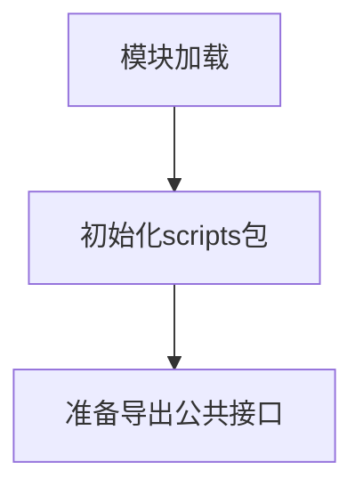

# `graphrag\scripts\__init__.py` 详细设计文档

GraphRAG Scripts模块的初始化文件，用于组织和管理GraphRAG项目中的脚本组件。该模块作为scripts包的入口点，提供对脚本功能的访问支持。

## 整体流程



## 类结构

```
scripts (包)
└── __init__.py (模块入口)
```

## 全局变量及字段


    

## 全局函数及方法


## 关键组件


# 代码设计文档

## 一段话描述

该代码片段为 GraphRAG Scripts 模块的初始化文件，仅包含版权声明和 MIT 许可证信息，不包含任何实际的功能实现代码。

## 文件的整体运行流程

该模块为纯声明性质的空模块，无实际执行流程。

## 类的详细信息

无类定义。

## 全局变量和全局函数

无全局变量或全局函数定义。

## 关键组件信息

### GraphRAG Scripts 模块

该模块为 GraphRAG 项目的脚本模块入口，目前仅包含版权和许可证声明，具体功能实现待填充。

## 潜在的技术债务或优化空间

- 该模块目前为空模块，需要根据 GraphRAG 项目的需求填充实际的脚本功能
- 缺少模块级别的配置和初始化逻辑

## 其它项目

- **设计目标**: 作为 GraphRAG 项目的脚本模块容器
- **约束**: 遵循 MIT 开源许可证
- **错误处理**: 无实际代码，无法分析
- **数据流**: 无实际代码，无法分析
- **外部依赖**: 无实际代码，无法分析


## 问题及建议


### 已知问题

-   **模块内容为空**：该模块仅包含版权声明和模块文档字符串，没有任何实际的类、函数或实现代码，无法提供实际功能。
-   **缺乏模块结构**：作为"GraphRAG Scripts module"，缺少预期的脚本组织结构，如子模块划分、工具函数或主入口点。
-   **文档不完整**：模块文档字符串过于简单，未说明该模块的用途、包含的脚本类型或预期的使用方式。

### 优化建议

-   **完善模块结构**：根据GraphRAG项目需求，添加相应的脚本模块，如数据导入脚本、索引构建脚本、查询处理脚本等。
-   **添加详细文档**：在模块文档字符串中详细描述该模块的功能、包含的子模块以及使用示例。
-   **建立包结构**：如果包含多个脚本，考虑使用Python包结构（__init__.py）来组织和管理相关功能。
-   **版本与依赖说明**：添加模块版本信息和依赖说明，便于维护和兼容性管理。


## 其它


### 设计目标与约束

- **目标**：为 GraphRAG 项目提供可执行的脚本集合，支持知识图谱构建、查询和评估等核心工作流。  
- **约束**：  
  - 必须兼容 Python 3.9 及以上版本。  
  - 所有依赖库须遵守 MIT License 或兼容的开源许可证。  
  - 脚本须具备命令行接口（CLI），使用 Click 或 argparse。  
  - 代码遵循 PEP 8 代码风格，并使用类型注解提升可读性。  

### 错误处理与异常设计

- **自定义异常类**：`GraphRAGScriptError` 作为基类，衍生出 `ConfigurationError`、`ExecutionError`、`ValidationError` 等子类。  
- **错误码**：采用统一的错误码体系，例如 `GR0001` 表示配置缺失，`GR0002` 表示执行超时。  
- **日志记录**：使用 Python `logging` 模块，错误信息必须包含上下文（如文件名、参数值）。  
- **异常传播**：在 CLI 入口统一捕获未处理异常，返回非零退出码并输出友好错误信息。  

### 数据流与状态机

- **脚本入口**：入口脚本（如 `run_indexing.py`）负责解析命令行参数、加载配置文件、初始化组件。  
- **状态机**：关键流程（如索引构建）可划分为 `INIT`、`DOWNLOAD`、`EXTRACT`、`BUILD`、`FINISH` 五个状态，每一步都有明确的输入输出及可能的错误回滚。  
- **数据传递**：使用 JSON/YAML 格式的中间结果文件，确保不同脚本之间可解耦。  

### 外部依赖与接口契约

- **核心依赖**：  
  - `graphrag` 核心库（图谱推理实现）。  
  - `openai` 或兼容的 LLM API 客户端。  
  - `pandas`、`numpy` 用于数据处理。  
- **接口契约**：  
  - `Indexer` 接口：接受配置、输入路径、输出路径，返回状态码。  
  - `QueryEngine` 接口：接受查询语句、图谱路径，返回答案及置信度。  
  - 所有接口均使用抽象基类（ABC）定义，确保实现可替换。  

### 安全性考虑

- **敏感信息**：API 密钥、认证 token 必须通过环境变量或密钥管理服务注入，禁止硬编码。  
- **输入校验**：所有外部输入（文件、命令行参数）须进行白名单校验，防止路径遍历、注入攻击。  
- **沙箱执行**：若脚本支持用户提供的自定义插件或脚本，应在受限的子进程或容器环境中运行。  

### 性能要求

- **执行时长**：单次索引构建须在 30 分钟内完成（基于 10 万条文档的基准）。  
- **资源限制**：CPU 使用不超过 4 核，内存不超过 8 GB（可通过配置调节）。  
- **并发**：支持批量查询时使用异步 I/O，最大并发度可配置。  

### 可维护性与可扩展性

- **模块化**：核心功能划分为独立子模块（如 `ingest`, `index`, `query`），每个子模块拥有独立的单元测试。  
- **配置驱动**：所有业务参数通过外部 YAML/JSON 配置文件管理，代码不做硬编码。  
- **插件机制**：提供插件接口，允许用户自定义图谱生成、结果后处理等步骤。  

### 测试策略

- **单元测试**：使用 `pytest`，覆盖率目标 ≥ 80%。  
- **集成测试**：针对完整脚本流程（如 `python -m graphrag.scripts.index`）进行端到端测试，使用真实小规模数据集。  
- **性能测试**：使用 `pytest-benchmark` 评估关键函数的执行时间。  

### 部署与运维

- **打包**：通过 `setuptools` 或 `poetry` 进行打包，提供 `pyproject.toml`。  
- **容器化**：提供 `Dockerfile`，基于官方 Python 镜像，安装依赖并预设工作目录。  
- **监控**：导出 Prometheus 指标（如处理文档数、错误率），配合 `grafana` 可视化。  

### 版本控制与变更管理

- **分支模型**：采用 GitFlow，特性开发在 `feature/*` 分支，发布在 `release/*` 分支。  
- **变更日志**：使用 `CHANGELOG.md` 记录每次发布的修改内容、破坏性变更及升级指南。  

### 许可证与合规

- 本模块采用 MIT License，依赖库均已检查许可证兼容性，确保符合开源合规要求。  

### 文档与注释规范

- **代码注释**：使用 Google 风格的 docstring，公开 API 必须包含参数、返回值说明。  
- **用户文档**：在 `docs/` 目录下提供 Markdown 格式的使用手册、API 参考和常见问题解答。  

### CI/CD 与构建

- **持续集成**：GitHub Actions 自动运行单元测试、代码 linting（flake8、mypy）和安全扫描（bandit）。  
- **持续交付**：每次合并至 `main` 分支自动构建并发布至 PyPI（若已配置）。  

### 监控与日志

- **日志级别**：默认 `INFO`，可通过环境变量 `LOG_LEVEL` 调整为 `DEBUG`、`WARNING`。  
- **结构化日志**：采用 JSON 格式输出，便于日志收集系统（如 ELK）解析。  

### 国际化与本地化

- **多语言支持**：用户错误信息和帮助文档使用 `gettext` 进行国际化（i18n），目前提供英文和简体中文。  

### 异常流与边界条件

- **网络异常**：对外部 LLM API 调用实现重试机制（指数退避），最大重试次数可配置。  
- **数据缺失**：若输入文件缺失，脚本立即终止并返回明确错误信息。  

### 资源管理与内存

- **批处理**：大规模数据采用分批读取，避免一次性加载导致内存溢出。  
- **临时文件**：使用 `tempfile` 模块管理临时中间结果，确保脚本异常退出后能够自动清理。  

### 并发与线程安全

- **多线程**：仅在 I/O 密集型操作（如网络请求）使用 `asyncio`，避免 GIL 带来的性能瓶颈。  
- **线程安全**：全局共享状态（如配置对象）采用只读模式或使用线程锁。  

### API 设计（若提供编程接口）

- **RESTful**：若提供 HTTP 服务，使用 Flask/FastAPI 实现，遵循 REST 最佳实践。  
- **gRPC**：内部组件间可使用 gRPC 进行高效二进制序列化通信。  

### 数据模型与持久化

- **图谱存储**：采用 Neo4j 或轻量级的 RDF 库（如 `rdflib`）进行持久化。  
- **中间结果**：使用 Parquet 或 SQLite 保存索引过程的中间状态，便于断点续跑。  

### 缓存策略

- **查询缓存**：对相同查询语句的返回结果使用 LRU 缓存，缓存容量可通过配置项 `CACHE_SIZE` 调整。  
- **模型缓存**：LLM 模型（如 embedding）可在本地文件系统中缓存，避免重复下载。  

### 配置管理

- **默认配置**：提供 `config/default.yaml`，包含所有可配置项及说明。  
- **环境覆盖**：支持通过环境变量或自定义配置文件覆盖默认配置。  

### 灾备与恢复

- **检查点**：在关键步骤（如索引完成）写入检查点文件，异常恢复时读取最近的检查点继续执行。  
- **日志归档**：日志文件每日归档，保留 30 天，支持故障追溯。  

### 代码风格与规范

- **风格指南**：遵循 PEP 8，使用 Black 自动化格式化，isort 排序导入。  
- **类型检查**：使用 mypy 进行静态类型检查，确保类型注解完整。  

### 元数据与版本信息

- **版本号**：遵循 SemVer，主版本号表示兼容性和重大变更。  
- **元数据**：在 `__init__.py` 中定义 `__version__`、`__author__`、`__license__`。  

### 示例与使用案例

- **快速开始**：提供 `examples/quickstart.ipynb` 演示从原始文本到知识图谱查询的完整流程。  
- **进阶用法**：示例展示如何自定义图谱生成插件、如何调优索引性能。  

### 参考文献

- GraphRAG 官方文档：https://graphrag.readthedocs.io  
- Microsoft MIT License 文本：https://opensource.org/licenses/MIT  
- 推荐的 Python 项目结构：https://docs.python-guide.org/writing/structure/  


    