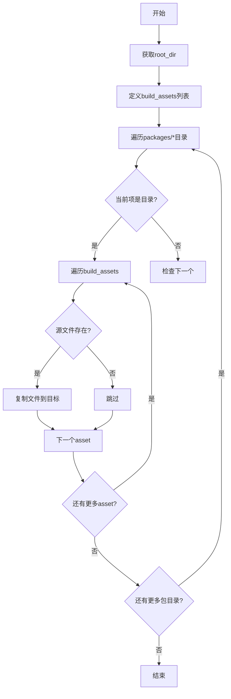

# `graphrag\scripts\copy_build_assets.py` 详细设计文档

该脚本用于将根目录的构建资产（如LICENSE文件）复制到所有包目录中，确保这些文件能够包含在PyPI分发包中。

## 整体流程

```mermaid
graph TD
    A[开始] --> B[获取根目录路径]
    B --> C[定义构建资产列表 ['LICENSE']]
    C --> D{遍历 packages 目录下的所有子目录}
    D --> E{源文件存在?}
    E -- 否 --> F[跳过]
    E -- 是 --> G[使用shutil.copy复制文件到目标目录]
    G --> H{处理下一个包目录}
    H -- 是 --> D
    H -- 否 --> I[结束]
```

## 类结构

```
模块级别 (无类)
└── copy_build_assets (全局函数)
```

## 全局变量及字段


### `root_dir`
    
项目根目录路径，通过__file__父目录的父目录计算得出

类型：`Path`
    


### `build_assets`
    
要复制的构建资产列表，当前包含LICENSE文件

类型：`list`
    


### `package_dir`
    
遍历过程中当前访问的包目录路径

类型：`Path`
    


### `asset`
    
当前正在处理的资产文件名

类型：`str`
    


### `src`
    
源文件的完整路径

类型：`Path`
    


### `dest`
    
目标文件的完整路径

类型：`Path`
    


    

## 全局函数及方法


### `copy_build_assets`

该函数用于将根目录下的构建资产（如 LICENSE 文件）复制到各包目录，以便这些文件能够包含在 PyPI 发行版中。

参数：此函数无参数。

返回值：`None`，该函数不返回值，仅执行文件复制操作。

#### 流程图

```mermaid
flowchart TD
    A[Start copy_build_assets] --> B[Get root_dir = Path(__file__).parent.parent]
    B --> C[Define build_assets = ["LICENSE"]]
    C --> D[Iterate: for package_dir in root_dir.glob packages/*]
    D --> E{Is package_dir a directory?}
    E -->|Yes| F[Iterate: for asset in build_assets]
    E -->|No| G[Continue to next package]
    F --> H[src = root_dir / asset]
    F --> I[dest = package_dir / asset]
    H --> J{Does src exist?}
    I --> J
    J -->|Yes| K[shutil.copy src to dest]
    J -->|No| L[Skip - asset not copied]
    K --> M[End of asset loop]
    L --> M
    M --> N{More packages?}
    N -->|Yes| D
    N -->|No| O[End function]
```

#### 带注释源码

```python
# Copyright (c) 2025 Microsoft Corporation.
# Licensed under the MIT License

"""Copy root build assets to package directories."""

import shutil  # 用于文件复制操作
from pathlib import Path  # 用于路径操作


def copy_build_assets():
    """
    Copy root build assets to package build directories 
    so files are included in pypi distributions.
    """
    # 获取项目根目录（当前文件所在目录的父目录的父目录）
    root_dir = Path(__file__).parent.parent
    
    # 定义需要复制的构建资产列表
    build_assets = ["LICENSE"]

    # 遍历 packages 目录下的所有包目录
    for package_dir in root_dir.glob("packages/*"):
        # 只处理目录类型的包
        if package_dir.is_dir():
            # 遍历每个需要复制的资产文件
            for asset in build_assets:
                # 构建源文件路径（根目录下）
                src = root_dir / asset
                # 构建目标文件路径（包目录下）
                dest = package_dir / asset
                # 仅当源文件存在时执行复制
                if src.exists():
                    shutil.copy(src, dest)


if __name__ == "__main__":
    # 允许直接运行此脚本进行资产复制
    copy_build_assets()
```

## 关键组件


### 一段话描述

该脚本是一个构建工具函数，用于在Python包发布前将根目录的LICENSE文件自动复制到所有子包目录中，确保PyPI分发包中包含许可证文件。

### 文件的整体运行流程

1. 脚本作为主程序入口执行时，调用`copy_build_assets()`函数
2. 函数首先确定项目根目录路径
3. 定义需要复制的构建资产列表（当前仅包含LICENSE文件）
4. 使用glob模式遍历packages目录下的所有子目录
5. 对每个包目录，检查源文件是否存在
6. 如果源文件存在，使用shutil.copy将文件复制到目标位置

### 全局变量

#### root_dir

- **类型**: Path
- **描述**: 项目根目录的路径对象，通过当前文件路径的父目录的父目录确定

#### build_assets

- **类型**: List[str]
- **描述**: 需要复制到各包目录的构建资产文件名列表，当前包含LICENSE文件

### 全局函数

#### copy_build_assets()

- **参数**: 无
- **返回值**: None
- **描述**: 将根目录的构建资产复制到所有包目录的主函数

**mermaid流程图**:


**带注释源码**:
```python
def copy_build_assets():
    """Copy root build assets to package build directories so files are included in pypi distributions."""
    # 获取项目根目录（当前文件向上两级）
    root_dir = Path(__file__).parent.parent
    
    # 定义需要复制的构建资产列表
    build_assets = ["LICENSE"]

    # 遍历packages目录下的所有子目录
    for package_dir in root_dir.glob("packages/*"):
        # 确保是目录而非文件
        if package_dir.is_dir():
            # 遍历每个需要复制的资产
            for asset in build_assets:
                # 构建源文件和目标文件路径
                src = root_dir / asset
                dest = package_dir / asset
                # 仅当源文件存在时复制
                if src.exists():
                    shutil.copy(src, dest)
```

### 关键组件信息

#### shutil模块

- Python标准库模块，提供高级文件操作功能，此处使用copy函数进行文件复制

#### Path类

- pathlib模块提供的面向对象路径操作类，用于跨平台路径构建和操作

#### glob模式匹配

- 使用"packages/*"通配符模式匹配所有直接子目录，用于发现所有需要复制的包目录

### 潜在的技术债务或优化空间

1. **硬编码的资产列表**: build_assets列表硬编码在函数内部，若需添加更多资产需修改代码逻辑
2. **缺乏错误处理**: 未处理文件复制失败的情况（如权限问题），可能静默失败
3. **缺少日志记录**: 无任何日志输出，难以追踪复制操作的结果
4. **通配符限制**: packages/*仅匹配一级子目录，无法处理嵌套的包结构
5. **配置外部化**: 资产列表和包目录模式应考虑从配置文件或参数读取，提高灵活性

### 其它项目

#### 设计目标与约束

- **目标**: 确保LICENSE文件包含在PyPI发布的wheel和sdist包中
- **约束**: 依赖Python标准库，无需额外依赖；跨平台兼容

#### 错误处理与异常设计

- 当前实现使用条件检查（if src.exists()）避免异常，而非try-except捕获
- 未处理PermissionError、OSError等可能的文件系统异常
- 复制失败时静默跳过，无用户反馈

#### 外部依赖与接口契约

- 依赖标准库: shutil、pathlib
- 无外部接口契约
- 作为__main__模块可直接执行，也可被其他模块导入调用

#### 数据流与状态机

- 单向数据流：从root_dir读取文件，复制到各package_dir
- 无状态机设计，函数执行完成后即结束，无持久状态


## 问题及建议


### 已知问题

-   **硬编码的构建资源列表**：`build_assets = ["LICENSE"]` 是硬编码的，若需复制其他文件（如 README、配置文件等）需要修改源代码，缺乏灵活性
-   **缺乏错误处理**：`shutil.copy(src, dest)` 未被 try-except 包裹，复制失败（如权限不足、磁盘空间不足）时程序会直接崩溃
-   **缺少日志输出**：整个复制过程无任何日志记录，难以排查问题或确认执行结果
-   **未保留文件元数据**：使用 `shutil.copy` 而非 `shutil.copy2`，文件的元数据（如修改时间、权限）不会被保留
-   **缺少类型注解**：函数参数和返回值均无类型注解，降低了代码的可读性和 IDE 支持
-   **函数设计不灵活**：`copy_build_assets()` 无参数，无法通过调用方传入要复制的资源列表或指定其他源/目标目录
-   **未检查文件是否已存在**：即使目标文件已存在且内容相同也会执行复制操作，造成不必要的 I/O 开销
-   **包目录验证不足**：仅检查 `package_dir.is_dir()`，未验证其是否为有效的 Python 包结构，可能将文件复制到非预期的目录

### 优化建议

-   将 `build_assets` 改为函数参数或从配置文件读取，提高可配置性
-   添加 try-except 异常处理，记录失败的文件和原因，并允许部分失败时继续执行
-   引入日志模块（如 `logging`），记录复制文件数量、跳过原因等信息
-   考虑使用 `shutil.copy2` 以保留文件元数据
-   为函数添加类型注解：`(root_dir: Path, build_assets: list[str] = None) -> int` 返回复制的文件数量
-   在复制前检查目标文件是否存在且内容相同，可通过比较文件哈希或修改时间避免不必要的复制
-   添加 `--dry-run` 参数支持，允许预览将要执行的操作而不实际复制
-   考虑使用 `importlib.metadata` 或 `setuptools` 获取包信息，验证目标目录为有效的 Python 包

## 其它


### 设计目标与约束

该脚本的设计目标是在Python包发布到PyPI时，确保每个包的构建目录中都包含LICENSE文件。约束条件包括：仅处理packages/*目录下的包、仅复制根目录存在的资源文件、不处理目录复制。

### 错误处理与异常设计

脚本采用静默失败策略：当源文件不存在时跳过复制，不抛出异常。主要潜在异常包括：文件访问权限错误、磁盘空间不足、路径解析错误。当前实现通过try-except隐式处理（src.exists()检查），建议显式捕获并记录异常。

### 外部依赖与接口契约

仅依赖Python标准库：shutil（文件操作）和pathlib（路径处理）。接口契约：root_dir自动从__file__推断、package_dir通过glob模式匹配、asset列表可配置。无命令行接口或配置文件。

### 性能考量

该脚本为一次性运行脚本，性能非关键因素。当前实现逐个包、逐个资源复制，glob调用会产生文件系统遍历开销。对于大规模 monorepo，建议优化为单次glob调用后批量处理。

### 可测试性

测试要点包括：验证存在包目录时的复制行为、验证不存在源文件时的跳过行为、验证目标文件存在时的覆盖行为。建议添加单元测试覆盖各种边界情况。

### 安全性考虑

潜在风险：符号链接攻击（需验证src不是符号链接）、路径遍历攻击（package_dir应在root_dir内）、竞态条件（多线程环境下）。当前实现未做安全检查。

### 配置管理

build_assets列表当前硬编码，建议抽取为常量或配置文件。package目录匹配模式"packages/*"硬编码，可考虑支持自定义包目录路径。

### 版本兼容性

使用Python 3.4+引入的pathlib.Path，需确保目标环境Python版本 >= 3.4。shutil.copy支持Python 3.x全版本。

### 部署与执行时机

该脚本应在包构建/发布流程中执行，建议通过setup.py、pyproject.toml或CI/CD流水线调用。执行频率：每次发布新版本时执行一次。

### 监控与日志

当前实现无日志输出，建议添加logging模块以便追踪复制操作结果。关键监控点：复制成功数量、跳过数量、异常数量。

### 扩展性建议

可扩展方向：支持配置文件定义资源列表、支持排除特定包、支持复制目录而非仅文件、添加dry-run模式预览操作结果。

    