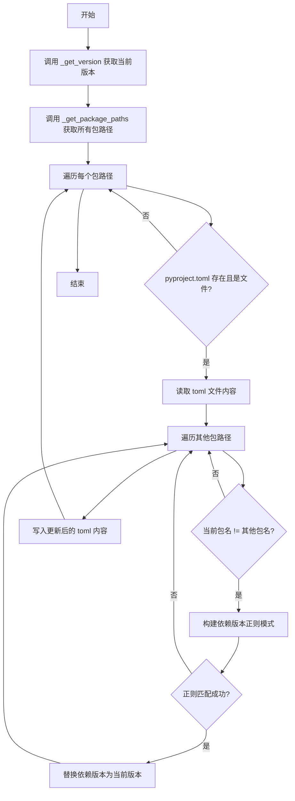
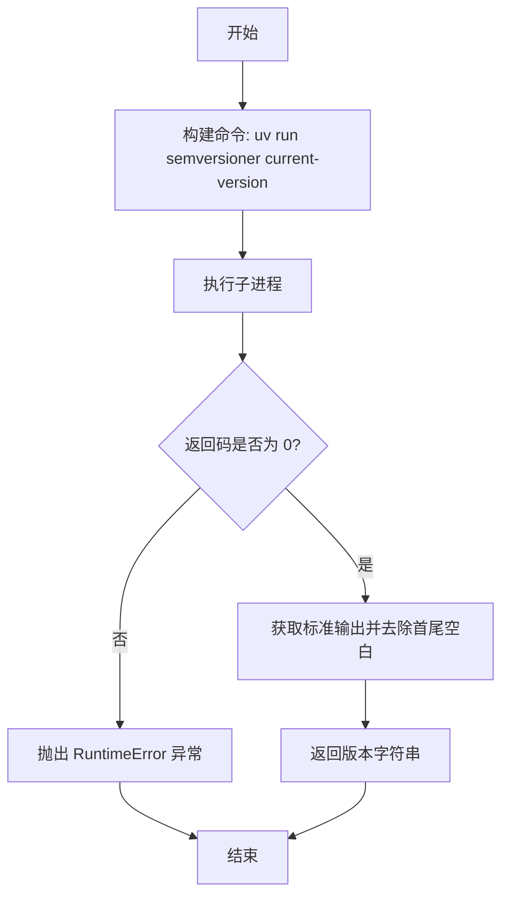
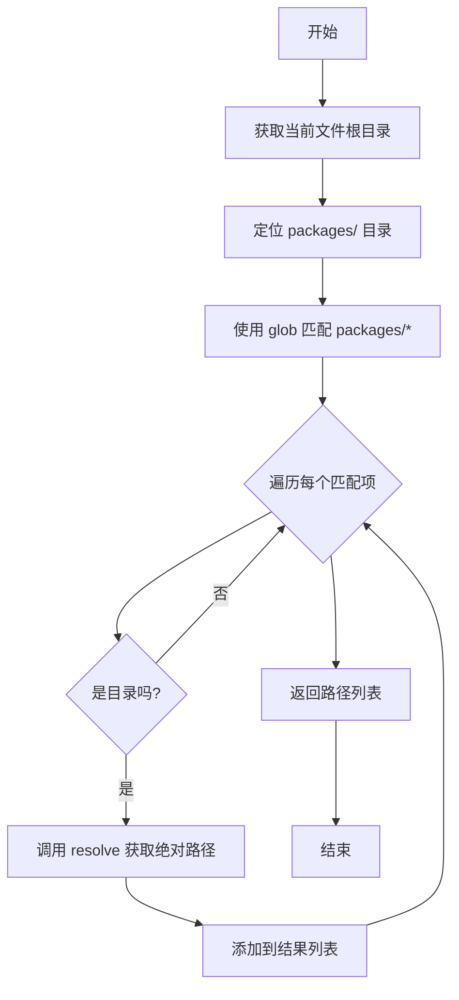
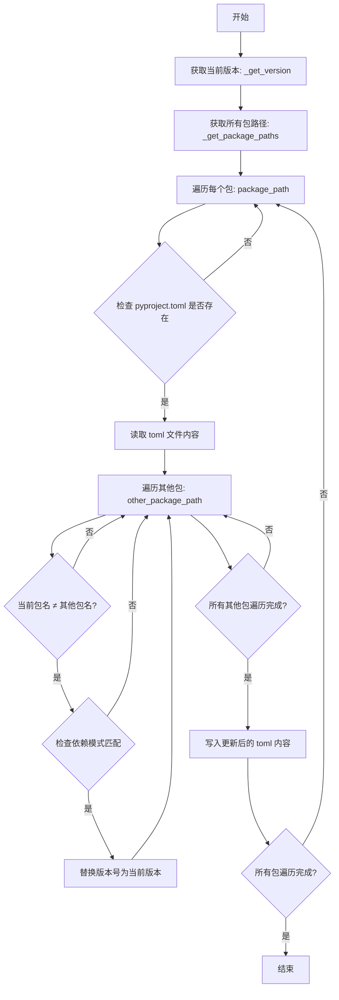

# `graphrag\scripts\update_workspace_dependency_versions.py` 详细设计文档

该脚本用于自动更新工作区中所有包的跨包依赖版本。它通过 semversioner 工具获取当前版本，然后遍历每个包的 pyproject.toml 文件，使用正则表达式匹配并更新其他工作区包的依赖版本号。

## 整体流程



## 类结构

```
无类层次结构（脚本文件）
└── 模块级函数
    ├── _get_version()
    ├── _get_package_paths()
    └── update_workspace_dependency_versions()
```

## 全局变量及字段


    

## 全局函数及方法


### `_get_version`

获取当前工作区的版本号，通过执行 `uv run semversioner current-version` 命令并解析其输出来返回版本字符串。

参数：

- 无参数

返回值：`str`，当前工作区的版本号（如 "1.0.0"）

#### 流程图



#### 带注释源码

```python
def _get_version() -> str:
    """获取当前工作区的版本号。
    
    通过 subprocess 执行外部命令 'uv run semversioner current-version'
    来获取当前项目版本，并返回版本字符串。
    
    Returns:
        str: 当前工作区的版本号（已去除首尾空白）
        
    Raises:
        RuntimeError: 当命令执行失败（返回码非 0）时抛出
    """
    # 构建命令列表，使用 uv 运行 semversioner 工具获取当前版本
    command = ["uv", "run", "semversioner", "current-version"]
    
    # 执行子进程，运行版本获取命令
    # env=os.environ: 继承当前环境变量
    # capture_output=True: 捕获 stdout 和 stderr
    # text=True: 以文本模式返回输出
    completion = subprocess.run(
        command, 
        env=os.environ, 
        capture_output=True, 
        text=True
    )
    
    # 检查命令执行是否成功
    if completion.returncode != 0:
        # 构建错误消息，包含返回码
        msg = f"Failed to get current version with return code: {completion.returncode}"
        # 抛出运行时错误
        raise RuntimeError(msg)
    
    # 成功时返回版本号，去除可能的首尾空白和换行符
    return completion.stdout.strip()
```


### `_get_package_paths`

获取工作空间中所有包（package）的路径列表。该函数通过查找项目根目录下的 `packages/` 目录，找出所有子目录并返回其绝对路径，供其他函数迭代更新依赖版本使用。

参数： 无

返回值：`list[Path]`，返回包含所有包目录绝对路径的列表，每个元素为 `pathlib.Path` 对象。

#### 流程图



#### 带注释源码

```python
def _get_package_paths() -> list[Path]:
    """获取工作空间中所有包的路径列表。
    
    Returns:
        list[Path]: 包含所有包目录绝对路径的列表
    """
    # 获取当前 Python 文件的父目录（即脚本所在目录）
    # 再向上两级到达项目根目录
    root_dir = Path(__file__).parent.parent
    
    # 使用 glob 模式匹配 packages/ 目录下的所有直接子项
    # 遍历每个匹配项，只保留目录类型的项
    # 对每个目录调用 resolve() 转换为绝对路径
    # 最终返回所有包目录的绝对路径列表
    return [p.resolve() for p in root_dir.glob("packages/*") if p.is_dir()]
```


### `update_workspace_dependency_versions`

更新工作区中所有包的依赖版本，通过遍历每个包的 pyproject.toml 文件，将跨包依赖的版本号更新为当前工作区版本。

参数：此函数无参数。

返回值：`None`，无返回值描述。

#### 流程图



#### 带注释源码

```python
def update_workspace_dependency_versions():
    """Update dependency versions across workspace packages.

    Iterate through all the workspace packages and update cross-package
    dependency versions to match the current version of the workspace.
    """
    # 第一步：获取当前工作区的版本号
    # 通过调用 semversioner 工具获取当前版本
    version = _get_version()
    
    # 第二步：获取所有工作区包的路径
    # 扫描 packages/ 目录下的所有子目录
    package_paths = _get_package_paths()
    
    # 第三步：遍历每个包目录
    for package_path in package_paths:
        # 获取当前包的名称（目录名）
        current_package_name = package_path.name
        
        # 构建 pyproject.toml 文件路径
        toml_path = package_path / "pyproject.toml"
        
        # 检查 toml 文件是否存在
        if not toml_path.exists() or not toml_path.is_file():
            # 如果文件不存在，跳过该包
            continue
            
        # 读取 toml 文件内容
        toml_contents = toml_path.read_text(encoding="utf-8")

        # 第四步：遍历其他包，检查是否有依赖关系
        for other_package_path in package_paths:
            other_package_name = other_package_path.name
            
            # 跳过自身包的检查
            if other_package_name == current_package_name:
                continue
                
            # 构建正则表达式模式，匹配其他包的依赖声明
            # 匹配格式：package_name==x.x.x
            dep_pattern = rf"{other_package_name}\s*==\s*\d+\.\d+\.\d+"

            # 在 toml 内容中搜索匹配的依赖
            if re.search(dep_pattern, toml_contents):
                # 替换为新版本号
                toml_contents = re.sub(
                    dep_pattern,
                    f"{other_package_name}=={version}",
                    toml_contents,
                )

        # 第五步：将更新后的内容写回文件
        toml_path.write_text(toml_contents, encoding="utf-8", newline="\n")
```

## 关键组件


### 版本获取组件

使用 `subprocess` 执行 `uv run semversioner current-version` 命令来获取当前工作区的版本号，返回字符串类型的版本号。

### 包路径发现组件

通过 `pathlib.Path.glob("packages/*")` 扫描工作区下的所有包目录，返回 `list[Path]` 类型的包路径列表。

### 依赖版本更新组件

核心业务逻辑函数，遍历所有包目录下的 `pyproject.toml` 文件，使用正则表达式匹配跨包依赖（如 `package-name==1.0.0`），并替换为当前版本号。

### TOML 文件读写组件

使用 `Path.read_text()` 和 `Path.write_text()` 方法对 `pyproject.toml` 进行读取和写入操作，支持 UTF-8 编码和换行符处理。

### 正则表达式匹配组件

使用 `re.search()` 和 `re.sub()` 函数构建依赖版本匹配模式 `rf"{other_package_name}\s*==\s*\d+\.\d+\.\d+"`，支持跨包依赖版本的精确替换。


## 问题及建议


### 已知问题

- **错误处理不完善**：文件读写操作缺少异常捕获，文件不存在或权限问题会导致程序直接崩溃
- **正则匹配能力有限**：正则表达式 `rf"{other_package_name}\s*==\s*\d+\.\d+\.\d+"` 只能匹配精确的三段式版本号（如 `==1.0.0`），无法处理 `>=`, `>`, `<`, `^`, `~` 等其他版本约束格式，也无法匹配预发布版本（alpha、beta等）
- **TOML解析缺失**：直接使用文本正则替换而非结构化解析 TOML，可能因注释、字符串中的巧合匹配而产生误替换
- **重复IO操作**：对每个包都重新读取 toml_contents，效率低下
- **缺少日志和调试信息**：执行过程无任何日志输出，无法追踪哪些包被修改
- **缺少dry-run模式**：无法预览将要进行的修改，生产环境使用风险较高
- **硬编码路径**：包路径硬编码为 `packages/*`，缺乏灵活性
- **无版本验证**：获取的版本号未做格式验证，可能包含非法字符导致后续问题

### 优化建议

- 使用 `toml` 或 `tomli` 库结构化解析和修改 pyproject.toml，避免文本替换风险
- 对多次使用的正则表达式进行预编译，提升性能
- 添加 try-except 捕获文件操作异常，提供有意义的错误信息
- 增加日志输出，记录修改的文件和变更内容
- 添加 `--dry-run` 参数，支持预览模式
- 验证版本号格式，确保符合语义化版本规范
- 将包路径、版本约束模式等提取为配置参数，提升可维护性
- 考虑使用 `pathlib` 的 `read_bytes`/`write_bytes` 配合显式编码声明，提高兼容性

## 其它


### 设计目标与约束

本代码的设计目标是实现一个自动化工具，用于在多包工作区环境中同步更新跨包依赖的版本号，确保所有内部包依赖都指向当前工作区的统一版本。约束条件包括：依赖管理工具（uv、semversioner）必须可用、工作区采用packages目录结构、pyproject.toml使用特定的版本声明格式（"package==x.y.z"）。

### 错误处理与异常设计

代码在获取版本和更新文件过程中采用了异常处理策略。`_get_version()`函数通过检查subprocess的返回码来验证命令执行成功，失败时抛出RuntimeError并包含返回码信息。文件读写操作使用Path对象的内置方法，假设pyproject.toml存在且可读，若不存在或非文件则跳过处理。未处理的情况包括：pyproject.toml权限不足、文件编码非UTF-8、regex匹配失败等，这些情况可能导致静默失败或写入错误数据。

### 外部依赖与接口契约

本脚本依赖三个外部组件：1）uv工具 - 用于运行semversioner命令；2）semversioner工具 - 用于获取当前版本号；3）Python标准库（os、re、subprocess、pathlib）。接口契约方面，semversioner的`current-version`子命令需返回纯版本号字符串（如"1.0.0"），工作区目录结构需符合`root/packages/*`的glob模式。

### 性能考虑

当前实现采用O(n²)的算法复杂度，对每个包遍历所有其他包进行版本更新。在包数量较少时性能可接受，但当工作区包含大量包时可能存在优化空间。文件I/O操作逐个处理，未使用并发机制。版本号通过正则表达式匹配，效率基本满足需求。

### 安全性考虑

代码使用了subprocess.run()而非subprocess.popen()，降低了命令注入风险，并通过capture_output限制输出范围。文件操作使用pathlib的resolve()获取绝对路径，避免符号链接相关问题。但存在潜在风险：未对version变量进行严格校验（可能包含特殊字符）、toml_contents直接写入文件（未做原子性写入保护）、subprocess.run未设置超时。

### 可维护性与扩展性

代码结构清晰，函数职责单一（获取版本、获取包路径、更新依赖），便于维护和测试。扩展性方面，可考虑的改进包括：支持非标准版本格式、支持排除特定包、添加日志记录、返回更新报告等。当前hardcoded的"packages/*"路径和版本匹配模式限制了通用性。

### 测试策略建议

建议添加单元测试覆盖：1）_get_version成功和失败场景；2）_get_package_paths返回正确的包列表；3）update_workspace_dependency_versions对单包、多包、包含/不包含依赖的场景处理；4）正则表达式边界情况（版本号格式变化）；5）文件读写权限问题模拟。

### 日志与监控

当前实现缺少日志记录功能，无法追踪脚本执行过程和结果。建议添加：版本获取成功/失败日志、包处理进度日志、依赖更新成功/失败日志，以及最终更新的包数量统计，便于问题排查和执行验证。

### 配置与参数化

当前脚本使用硬编码配置，包括工作区路径（根目录的父目录）、包目录模式（"packages/*"）、依赖版本正则模式。如需支持自定义，可考虑添加命令行参数（--packages-dir、--pattern等）或配置文件（pyproject.toml中的相关配置节）。


    