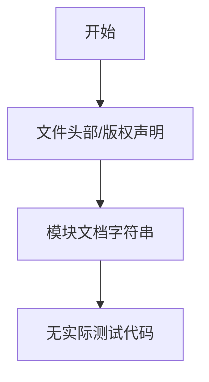

# `graphrag\tests\__init__.py` 详细设计文档

这是一个GraphRAG LLM模块的测试文件头部，目前仅包含版权声明和模块文档字符串，没有实际代码实现。

## 整体流程



## 类结构

```
无类定义（文件为空/仅头部）
```

## 全局变量及字段


    

## 全局函数及方法


## 关键组件


### 一段话描述

该代码文件是GraphRAG LLM模块的测试文件头部，包含版权声明和模块文档说明，但当前代码段中仅包含文件级别的注释信息，未包含具体的类、函数或实现逻辑。

### 文件的整体运行流程

由于当前代码段仅包含版权声明和文档字符串，无实际可执行代码，因此无法分析具体的运行流程。该文件可能是测试套件的入口点或测试模块的初始化部分，需要查看完整的测试文件以了解具体的测试流程和执行逻辑。

### 类的详细信息

当前代码段中未发现任何类定义。

### 关键组件信息

由于代码段中未包含实际实现代码，无法识别具体的组件信息。该文件可能属于GraphRAG项目的测试基础设施，建议查看完整的测试文件以获取详细的组件信息。

### 潜在的技术债务或优化空间

当前代码段信息有限，无法进行完整的技术债务分析。建议在获取完整测试代码后，从以下角度进行评估：
- 测试覆盖率
- 测试用例的边界条件处理
- Mock对象的使用策略
- 异步测试的处理方式

### 其它项目

**设计目标与约束**：由于缺乏具体代码，无法确定设计目标。

**错误处理与异常设计**：未发现相关实现。

**数据流与状态机**：未发现相关实现。

**外部依赖与接口契约**：仅知道该模块属于GraphRAG项目，具体依赖关系需查看完整代码。


## 问题及建议


### 已知问题

-   **文件内容为空**：当前文件仅包含版权头和模块文档字符串，缺少实际的测试代码实现。
-   **缺乏测试覆盖**：作为 GraphRAG LLM 模块的测试文件，未包含任何测试用例或测试逻辑。
-   **无导入语句**：没有导入待测试模块或相关依赖，无法执行任何测试功能。
-   **测试结构缺失**：未定义任何测试类或测试函数，文件未达到可用状态。

### 优化建议

-   **补充测试用例**：根据 GraphRAG LLM 模块的功能，编写相应的单元测试和集成测试，覆盖核心业务逻辑。
-   **完善导入语句**：添加必要的模块导入，包括被测模块及测试所需的辅助库（如 pytest）。
-   **定义测试类**：按照测试类型组织代码，例如 TestLLMClient、TestLLMResponse、TestPromptGeneration 等。
-   **添加测试数据**：准备模拟数据（mock data）和测试 fixtures，确保测试的可重复性和独立性。
-   **覆盖边界情况**：编写异常情况、错误处理和极限输入的测试用例。
-   **集成 CI/CD**：配置自动化测试流程，确保每次代码提交自动运行测试。


## 其它


### 项目概述

该文件是GraphRAG LLM模块的测试文件，用于验证GraphRAG系统中大型语言模型相关功能的正确性，包括LLM调用、提示词模板、响应解析、错误处理等核心功能的单元测试和集成测试。

### 整体运行流程

该测试文件遵循Python测试框架标准流程：首先导入被测试模块及必要的Mock依赖，然后定义测试类和测试方法，每个测试方法通过设置测试数据和Mock对象，执行被测试函数，最后使用断言验证结果是否符合预期。测试通过pytest框架自动发现和执行，支持独立的测试方法运行和批量测试执行。

### 关键组件信息

- **pytest框架**: Python标准测试框架，用于测试发现、执行和报告
- **unittest.mock**: 用于模拟外部依赖（如LLM API调用）
- **GraphRAG LLM模块**: 被测试的核心模块，负责与大型语言模型交互
- **测试数据生成器**: 用于生成各种边界条件和异常情况的测试数据
- **断言工具**: 用于验证函数输出和异常处理

### 设计目标与约束

- 确保LLM模块的正确性和稳定性
- 覆盖正常流程和异常流程的测试场景
- 测试应该是独立的，不依赖外部LLM API的实际调用
- 使用Mock对象隔离外部依赖，确保测试的可重复性和执行速度
- 遵循测试驱动开发（TDD）原则，测试代码应与实现代码保持同步

### 错误处理与异常设计

- 测试各种LLM API错误场景，如网络超时、认证失败、响应格式错误
- 验证模块对无效输入的处理，如空提示词、超长文本、特殊字符
- 测试重试机制和降级策略的有效性
- 验证错误日志记录的完整性和准确性

### 数据流与状态机

- 输入数据流：用户查询 → 提示词模板 → LLM API调用 → 响应解析
- 输出数据流：解析结果 → 结果验证 → 测试断言
- 状态转换：初始化 → 请求发送 → 等待响应 → 响应处理 → 完成/错误
- 并发控制：测试多线程环境下的LLM调用安全性

### 外部依赖与接口契约

- LLM API接口：支持OpenAI、Azure OpenAI、Google Vertex AI等多种LLM提供商
- 缓存接口：用于存储和检索LLM响应
- 配置接口：LLM参数配置（温度、最大token数、模型选择等）
- 日志接口：统一的日志记录规范

### 性能考量与优化空间

- 测试执行时间：单个测试应在合理时间内完成（建议<5秒）
- 资源利用：避免内存泄漏，合理使用Mock对象
- 并行执行：支持pytest-xdist并行测试加速
- 测试覆盖率：目标覆盖率达到80%以上

### 已知限制与扩展性

- 当前仅为测试框架模板，实际测试用例待实现
- 缺少对新兴LLM提供商的支持测试
- 缺少对大规模并发场景的压力测试
- 可扩展支持性能基准测试和模糊测试

### 潜在技术债务

- 测试代码覆盖率可能不足
- 缺少对边缘情况的全面测试
- 测试文档和注释可能不够完善
- Mock对象配置可能与实际API行为存在差异
- 缺少测试数据的版本管理和变更追踪

    