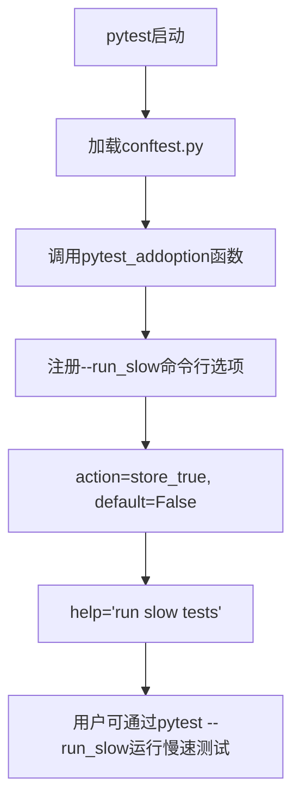
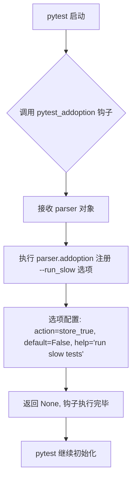

# `graphrag\tests\conftest.py` 详细设计文档

这是一个pytest配置文件，通过pytest_addoption函数向pytest添加了一个名为--run_slow的命令行选项，用于控制是否运行慢速测试用例，默认值为False。

## 整体流程



## 类结构

```
该文件为简单的模块文件，不包含类定义
仅包含一个pytest钩子函数: pytest_addoption
```

## 全局变量及字段


### `parser`
    
pytest的parser对象，用于注册命令行选项

类型：`pytest内置的Parser对象`
    


    

## 全局函数及方法


### `pytest_addoption`

这是一个 pytest 钩子函数，用于在 pytest 初始化阶段注册自定义命令行选项 `--run_slow`，允许用户通过命令行控制是否运行慢速测试。

参数：

- `parser`：`pytest.config.Parser` 或类似的解析器对象，pytest 在调用此钩子时传入，用于注册新的命令行选项

返回值：`None`，该函数不返回任何值，仅通过副作用（向 parser 添加命令行选项）生效

#### 流程图



#### 带注释源码

```python
# Copyright (c) 2024 Microsoft Corporation.
# Licensed under the MIT License

def pytest_addoption(parser):
    """
    pytest 钩子函数，在测试收集阶段之前被调用
    用于注册自定义命令行选项
    
    参数:
        parser: pytest 的配置解析器对象，用于添加命令行选项
    
    返回值:
        无返回值 (None)
    """
    # 向 pytest 注册一个名为 --run_slow 的命令行选项
    # action="store_true": 当选项出现时值为 True，不出现时为 False
    # default=False: 默认不运行慢速测试
    # help="run slow tests": 帮助文本，供 pytest --help 使用
    parser.addoption(
        "--run_slow", 
        action="store_true", 
        default=False, 
        help="run slow tests"
    )
```

## 关键组件


### pytest 命令行选项配置

该代码定义了一个 pytest 钩子函数 `pytest_addoption`，用于注册 `--run_slow` 命令行选项，允许用户通过该标志控制是否执行耗时较长的测试用例，默认情况下不运行慢速测试。


## 问题及建议


### 已知问题

-   缺少函数文档字符串（docstring），降低代码可维护性和可读性
-   缺少类型注解（type hints），不利于静态分析和IDE支持
-   未考虑选项分组或更详细的帮助信息，当前help文本过于简洁
-   未设置metavar或dest参数，默认行为可能不够明确

### 优化建议

-   为函数添加类型注解：`def pytest_addoption(parser: Any) -> None:`
-   添加函数级文档字符串，说明该hook的用途和注册选项的行为
-   增强help文本，添加更详细的功能描述和使用场景说明
-   考虑将选项添加到特定分组（如"custom options"），提升CLI用户体验
-   如项目有配置管理需求，可添加选项验证逻辑


## 其它


### 设计目标与约束

本代码的目标是为pytest测试框架添加自定义命令行选项`--run_slow`，允许用户控制是否执行耗时较长的测试用例。设计约束包括：必须遵循pytest插件的钩子函数规范，选项名称为`--run_slow`，默认值为`False`，帮助信息为"run slow tests"。

### 错误处理与异常设计

本代码为简单的pytest配置函数，不涉及复杂的错误处理逻辑。若参数解析失败，pytest框架自身会捕获并报告错误。无需额外的异常处理设计。

### 外部依赖与接口契约

外部依赖：pytest框架。接口契约：遵循pytest插件协议中的`pytest_addoption`钩子函数规范，接收`parser`参数并通过其`addoption`方法注册命令行选项。

### 配置管理

本代码作为pytest配置文件，依赖于pytest的配置机制。`--run_slow`选项的值可通过pytest的`request`对象或`pytestconfig` fixture在测试代码中获取，用于条件性地执行慢速测试。

### 版本兼容性

代码使用Python语法，适用于Python 3.x版本。依赖pytest版本需支持`pytest_addoption`钩子（pytest 3.0+均支持）。

### 测试策略

本配置代码本身无需测试。作为使用示例，可在测试代码中通过`pytest --run_slow`参数验证选项是否正确注册并生效。


    