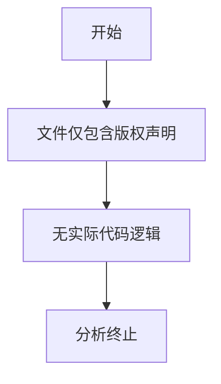

# `graphrag\tests\integration\__init__.py` 详细设计文档

该文件仅包含版权声明和MIT许可证信息，没有实际的代码实现，无法进行功能分析。

## 整体流程



## 类结构

```
无类定义
无模块结构
```

## 全局变量及字段


    

## 全局函数及方法


## 关键组件


### 概述

由于提供的代码仅包含版权声明和MIT许可证声明，无实际功能代码实现，因此无法提取关键组件、类信息或进行逻辑分析。

### 文件运行流程

无（代码中无实际可执行逻辑）

### 类详细信息

无（代码中无类定义）

### 关键组件信息

无（代码中无关键组件）

### 潜在技术债务或优化空间

无（代码中无可分析内容）

### 其它项目

**设计目标与约束**: 无法确定（无代码内容）

**错误处理与异常设计**: 无法确定（无代码内容）

**数据流与状态机**: 无法确定（无代码内容）

**外部依赖与接口契约**: 无法确定（无代码内容）


## 问题及建议


### 已知问题

-   代码片段仅包含版权声明和许可证信息，未提供实际可执行的代码逻辑，无法进行深度的技术债务或优化空间分析
-   缺少具体的业务逻辑、类定义、函数实现等代码内容

### 优化建议

-   提供完整的源代码文件以进行全面的技术债务分析和优化建议
-   建议包含核心业务逻辑、数据处理流程、API接口实现等代码模块
-   如果是多文件项目，建议提供项目的主要入口文件和关键模块代码


## 其它


### 设计目标与约束

由于提供的代码文件仅包含版权声明和MIT许可证信息，无实际功能代码实现，因此无法提取具体的设计目标和约束。

### 错误处理与异常设计

由于提供的代码文件仅包含版权声明和MIT许可证信息，无实际功能代码实现，因此无法提取具体的错误处理与异常设计模式。

### 数据流与状态机

由于提供的代码文件仅包含版权声明和MIT许可证信息，无实际功能代码实现，因此无法提取具体的数据流和状态机设计。

### 外部依赖与接口契约

由于提供的代码文件仅包含版权声明和MIT许可证信息，无实际功能代码实现，因此无法提取具体的外部依赖和接口契约。

### 性能要求

由于提供的代码文件仅包含版权声明和MIT许可证信息，无实际功能代码实现，因此无法提取具体的性能要求。

### 安全性考虑

由于提供的代码文件仅包含版权声明和MIT许可证信息，无实际功能代码实现，因此无法提取具体的安全性设计考量。

### 可用性与可靠性

由于提供的代码文件仅包含版权声明和MIT许可证信息，无实际功能代码实现，因此无法提取具体的可用性和可靠性设计。

### 可测试性设计

由于提供的代码文件仅包含版权声明和MIT许可证信息，无实际功能代码实现，因此无法提取具体的可测试性设计。

### 部署与配置

由于提供的代码文件仅包含版权声明和MIT许可证信息，无实际功能代码实现，因此无法提取具体的部署和配置方案。

### 版本兼容性

由于提供的代码文件仅包含版权声明和MIT许可证信息，无实际功能代码实现，因此无法提取具体的版本兼容性要求。

### 国际化与本地化

由于提供的代码文件仅包含版权声明和MIT许可证信息，无实际功能代码实现，因此无法提取具体的国际化与本地化设计。

### 监控与日志

由于提供的代码文件仅包含版权声明和MIT许可证信息，无实际功能代码实现，因此无法提取具体的监控和日志设计。

### 命名约定与代码风格

由于提供的代码文件仅包含版权声明和MIT许可证信息，无实际功能代码实现，因此无法提取具体的命名约定和代码风格规范。

### 许可与合规

MIT License - 该代码采用MIT许可证，允许在遵守许可证条款的前提下自由使用、复制、修改、合并、发布、分发、再授权和销售软件副本。


    