# `graphrag\tests\integration\cache\test_factory.py` 详细设计文档

这是 graphrag_cache 模块的 CacheFactory 单元测试文件，测试了多种缓存类型（Noop、Memory、Json with 各种存储后端）的创建功能，以及自定义缓存的注册和实例化机制，同时验证了未知缓存类型的错误处理。

## 整体流程

```mermaid
graph TD
    A[开始测试] --> B{测试用例类型}
    B --> C[测试 NoopCache 创建]
    B --> D[测试 MemoryCache 创建]
    B --> E[测试 JsonCache + MemoryStorage 创建]
    B --> F[测试 JsonCache + AzureBlobStorage 创建]
    B --> G{平台检查}
    G -->|Windows| H[测试 JsonCache + AzureCosmosDB 创建]
    G -->|非Windows| I[跳过 CosmosDB 测试]
    B --> J[测试自定义缓存注册与创建]
    B --> K[测试未知缓存类型错误处理]
    B --> L[测试直接注册类的方式]
    C --> M[断言 isinstance(cache, NoopCache)]
    D --> N[断言 isinstance(cache, MemoryCache)]
    E --> O[断言 isinstance(cache, JsonCache)]
    F --> P[断言 isinstance(cache, JsonCache)]
    H --> Q[断言 isinstance(cache, JsonCache)]
    J --> R[断言 custom_cache_class.called 和 cache.initialized]
    K --> S[断言抛出 ValueError 包含特定错误信息]
    L --> T[断言 isinstance(cache, CustomCache)]
    M --> U[测试结束]
    N --> U
    O --> U
    P --> U
    Q --> U
    R --> U
    S --> U
    T --> U
```

## 类结构

```
测试模块 (test_cache_factory.py)
├── 全局变量
│   ├── WELL_KNOWN_BLOB_STORAGE_KEY
│   └── WELL_KNOWN_COSMOS_CONNECTION_STRING
├── 测试函数
test_create_noop_cache
test_create_memory_cache
test_create_file_cache
test_create_blob_cache
test_create_cosmosdb_cache (条件执行)
test_register_and_create_custom_cache
test_create_unknown_cache
test_register_class_directly_works
└── 内部测试类 (在 test_register_class_directly_works 中)
    └── CustomCache (实现 Cache 接口)
```

## 全局变量及字段


### `WELL_KNOWN_BLOB_STORAGE_KEY`
    
用于Azure Blob存储的测试连接字符串，指向本地开发存储模拟器（127.0.0.1:10000）

类型：`str`
    


### `WELL_KNOWN_COSMOS_CONNECTION_STRING`
    
用于Azure Cosmos DB的测试连接字符串，指向本地Cosmos DB模拟器（127.0.0.1:8081）

类型：`str`
    


    

## 全局函数及方法


### `test_create_noop_cache`

该函数是一个单元测试，用于验证 `create_cache` 工厂函数能够正确创建 `NoopCache` 类型的缓存实例。它通过传入 `CacheType.Noop` 类型的 `CacheConfig` 配置，调用缓存创建函数，并断言返回的缓存对象是 `NoopCache` 类的实例。

参数： 无

返回值：`None`，该函数为测试函数，不返回任何值，仅通过断言验证缓存类型

#### 流程图

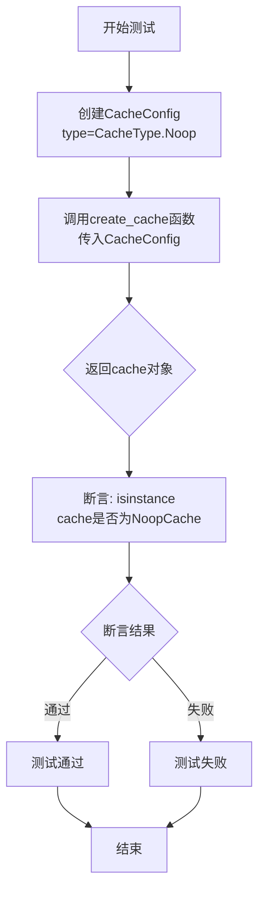

#### 带注释源码

```python
def test_create_noop_cache():
    """
    测试创建 NoopCache 类型的缓存实例
    
    该测试验证 create_cache 工厂函数能够根据 CacheConfig 配置
    正确创建 NoopCache 类型的缓存对象
    """
    # 使用 CacheConfig 指定缓存类型为 Noop
    # 调用 create_cache 工厂方法创建缓存实例
    cache = create_cache(
        CacheConfig(
            type=CacheType.Noop,  # 指定缓存类型为 Noop（无操作缓存）
        )
    )
    # 断言验证返回的缓存对象确实是 NoopCache 的实例
    assert isinstance(cache, NoopCache)
```


### `test_create_memory_cache`

该测试函数用于验证 `create_cache` 工厂函数能够根据 `CacheConfig` 配置正确创建 `MemoryCache` 类型的缓存实例，并通过断言确认返回的对象是 `MemoryCache` 类的实例。

参数：此函数无参数。

返回值：`None`，测试函数不返回值，仅通过断言验证。

#### 流程图

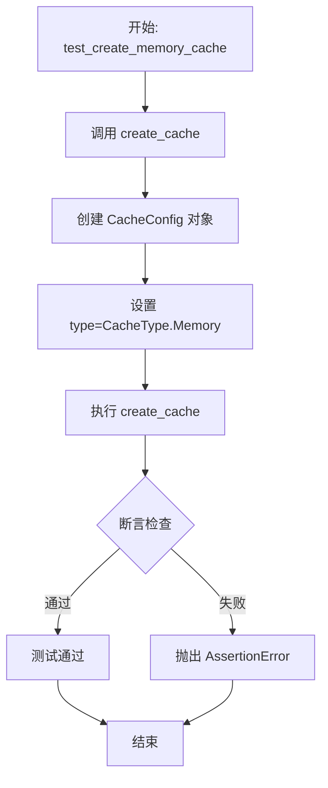

#### 带注释源码

```python
def test_create_memory_cache():
    """测试创建内存缓存的功能"""
    # 使用 CacheConfig 配置缓存类型为 Memory
    # 调用 create_cache 工厂函数创建缓存实例
    cache = create_cache(
        CacheConfig(
            type=CacheType.Memory,  # 指定缓存类型为内存缓存
        )
    )
    # 断言验证返回的缓存对象是 MemoryCache 类的实例
    assert isinstance(cache, MemoryCache)
```


### `test_create_file_cache`

该函数是一个单元测试，用于验证文件缓存（JsonCache）的创建功能。测试通过创建一个内存存储（Memory Storage），然后使用该存储创建 Json 类型的缓存，最后断言缓存实例是 JsonCache 类型。

参数：无

返回值：无（该函数为测试函数，不返回任何值）

#### 流程图

```mermaid
flowchart TD
    A[开始测试] --> B[创建内存存储<br>create_storage<br>StorageConfig(type=StorageType.Memory)]
    B --> C[创建Json缓存<br>create_cache<br>CacheConfig(type=CacheType.Json)<br>storage=storage]
    C --> D{断言检查<br>isinstance(cache, JsonCache)?}
    D -->|通过| E[测试通过]
    D -->|失败| F[测试失败]
```

#### 带注释源码

```python
def test_create_file_cache():
    """测试创建文件缓存（JsonCache）的功能"""
    
    # 步骤1: 创建一个内存存储（Memory Storage）
    # 使用 StorageConfig 配置存储类型为 Memory
    storage = create_storage(
        StorageConfig(
            type=StorageType.Memory,
        )
    )
    
    # 步骤2: 创建一个 Json 类型的缓存
    # 使用 CacheConfig 配置缓存类型为 Json
    # 将上面创建的 storage 作为缓存的底层存储
    cache = create_cache(
        CacheConfig(
            type=CacheType.Json,
        ),
        storage=storage,
    )
    
    # 步骤3: 断言验证创建的缓存是 JsonCache 类型
    # 确认缓存实例确实使用了 JsonCache 实现
    assert isinstance(cache, JsonCache)
```


### `test_create_blob_cache`

该测试函数用于验证能够使用 Azure Blob 存储（通过 Azure Storage Emulator）成功创建 JsonCache 类型的缓存实例，测试 Azure Blob 存储与缓存系统的集成功能。

参数：此函数无显式参数。

返回值：`None`，该函数为测试函数，通过断言验证功能，不返回具体值。

#### 流程图

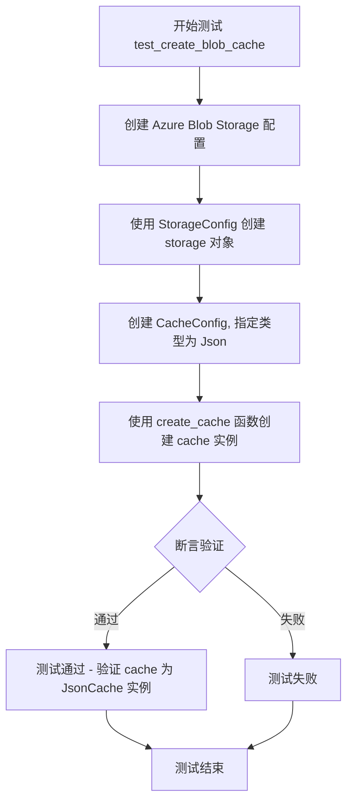

#### 带注释源码

```python
def test_create_blob_cache():
    """测试使用 Azure Blob 存储创建 JsonCache 缓存实例"""
    # 步骤1: 创建 Azure Blob 存储配置
    # 使用本地开发的存储模拟器连接字符串
    storage = create_storage(
        StorageConfig(
            type=StorageType.AzureBlob,                    # 指定存储类型为 Azure Blob
            connection_string=WELL_KNOWN_BLOB_STORAGE_KEY, # 连接字符串（开发存储模拟器）
            container_name="testcontainer",                # Blob 容器名称
            base_dir="testcache",                          # 基础目录
        )
    )
    
    # 步骤2: 创建缓存配置
    # 指定缓存类型为 Json，底层存储使用 Azure Blob
    cache = create_cache(
        CacheConfig(
            type=CacheType.Json,   # 使用 JSON 格式的缓存
        ),
        storage=storage,           # 传入上面创建的 Azure Blob 存储
    )

    # 步骤3: 断言验证
    # 验证创建的缓存确实是 JsonCache 类型的实例
    assert isinstance(cache, JsonCache)
```


### `test_create_cosmosdb_cache`

该测试函数用于验证使用 Azure Cosmos DB 作为存储后端创建 JSON 类型的缓存功能，确保缓存能够正确实例化为 JsonCache 类型。

参数： 无

返回值：`None`，测试函数通过 assert 断言验证，无显式返回值

#### 流程图

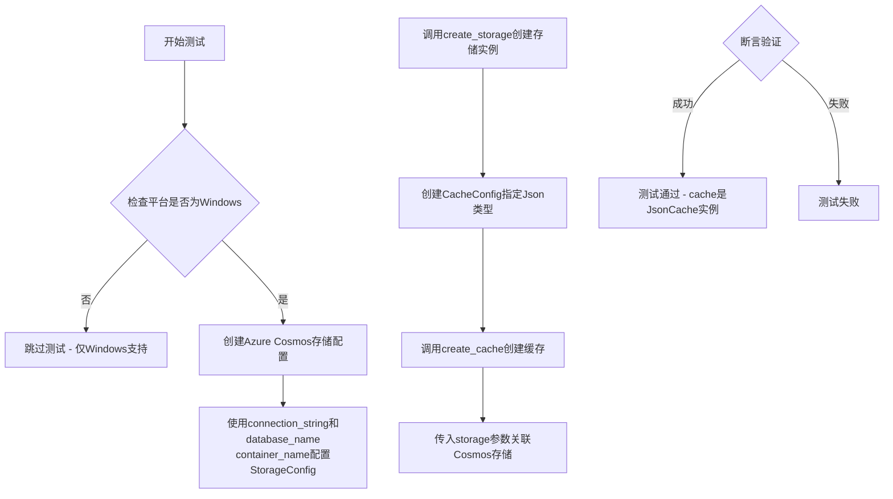

#### 带注释源码

```python
@pytest.mark.skipif(
    not sys.platform.startswith("win"),
    reason="cosmosdb emulator is only available on windows runners at this time",
)
def test_create_cosmosdb_cache():
    """测试使用Azure Cosmos DB作为存储后端创建缓存的功能"""
    
    # 定义Cosmos DB连接字符串（使用本地模拟器）
    # 连接到 https://127.0.0.1:8081/ 的Cosmos模拟器
    # 使用已知测试密钥进行认证
    storage = create_storage(
        StorageConfig(
            type=StorageType.AzureCosmos,  # 指定存储类型为Azure Cosmos DB
            connection_string=WELL_KNOWN_COSMOS_CONNECTION_STRING,  # 模拟器连接字符串
            database_name="testdatabase",    # 测试数据库名称
            container_name="testcontainer",  # 测试容器名称
        )
    )
    
    # 创建缓存配置，指定使用Json类型的缓存
    # JsonCache将数据序列化为JSON格式存储在提供的storage中
    cache = create_cache(
        CacheConfig(
            type=CacheType.Json,  # 使用JSON序列化格式
        ),
        storage=storage,  # 传入Cosmos DB存储后端
    )
    
    # 断言验证：确认创建的缓存是JsonCache类型
    # 这确保了Cosmos DB存储能够正确作为缓存后端工作
    assert isinstance(cache, JsonCache)
```


### `test_register_and_create_custom_cache`

该测试函数用于验证自定义缓存类型的注册和创建功能，通过模拟 `Cache` 接口创建一个自定义缓存类，使用 `register_cache` 函数注册自定义缓存类型，并使用 `create_cache` 函数创建缓存实例，最后验证自定义缓存类型已成功注册到缓存工厂中。

参数：

- 无

返回值：`None`，测试函数无返回值

#### 流程图

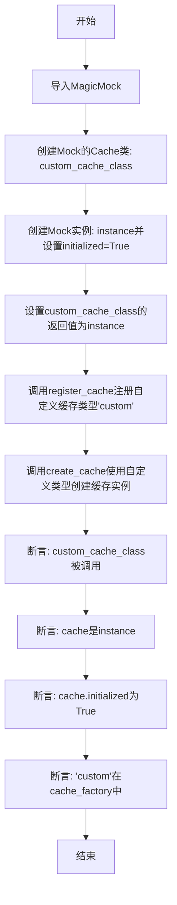

#### 带注释源码

```python
def test_register_and_create_custom_cache():
    """Test registering and creating a custom cache type."""
    # 导入MagicMock用于创建模拟对象
    from unittest.mock import MagicMock

    # 创建一个满足Cache接口的Mock类
    custom_cache_class = MagicMock(spec=Cache)
    
    # 创建一个Mock实例，并设置initialized属性为True
    instance = MagicMock()
    instance.initialized = True
    
    # 设置custom_cache_class实例化时返回我们创建的instance
    custom_cache_class.return_value = instance

    # 使用register_cache函数注册自定义缓存类型"custom"
    # 注册时使用lambda函数作为工厂函数，该函数会调用custom_cache_class
    register_cache("custom", lambda **kwargs: custom_cache_class(**kwargs))
    
    # 使用create_cache函数创建类型为"custom"的缓存实例
    cache = create_cache(CacheConfig(type="custom"))

    # 断言验证custom_cache_class被调用过
    assert custom_cache_class.called
    
    # 断言验证返回的cache就是我们创建的instance
    assert cache is instance
    
    # 断言验证我们设置在instance上的initialized属性为True
    # type: ignore # Attribute only exists on our mock
    assert cache.initialized is True

    # 检查自定义缓存类型是否已注册到cache_factory中
    assert "custom" in cache_factory
```


### `test_create_unknown_cache`

该测试函数用于验证当尝试使用未注册的缓存类型创建缓存时，系统能够正确抛出 `ValueError` 异常。它测试了缓存工厂的错误处理机制，确保未知的缓存类型会被正确识别并报告。

参数：此函数无参数。

返回值：`None`，此测试函数不返回值，仅通过 `pytest.raises` 验证异常被正确抛出。

#### 流程图

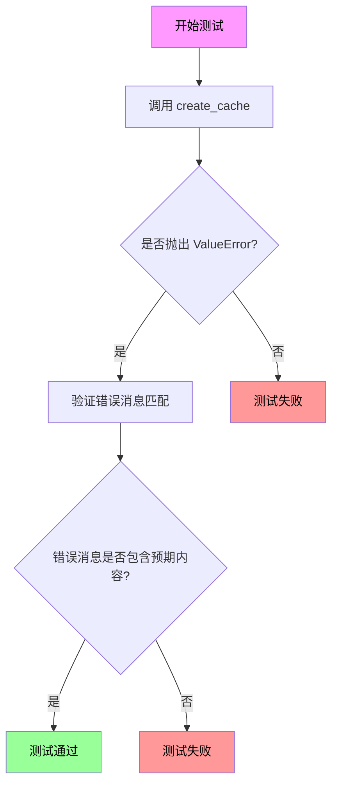

#### 带注释源码

```python
def test_create_unknown_cache():
    """测试使用未注册的缓存类型时是否抛出正确的 ValueError。
    
    此测试验证 CacheFactory 能够正确处理未知缓存类型，
    并在尝试创建未注册的缓存类型时提供有意义的错误消息。
    """
    # 使用 pytest.raises 上下文管理器验证异常
    with pytest.raises(
        ValueError,  # 期望抛出的异常类型
        # 期望的错误消息正则表达式模式
        # 用于匹配 "CacheConfig.type 'unknown' is not registered in the CacheFactory."
        match="CacheConfig\\.type 'unknown' is not registered in the CacheFactory\\.",
    ):
        # 尝试使用未知的缓存类型创建缓存
        # 预期会抛出 ValueError 并被 pytest 捕获验证
        create_cache(CacheConfig(type="unknown"))
```


### `test_register_class_directly_works`

这是一个测试函数，用于验证 CacheFactory 允许直接注册类（而非仅限可调用对象）作为缓存类型，通过创建自定义 Cache 类、注册并实例化来确认功能正常工作。

参数： 无

返回值：`None`，因为这是 pytest 测试函数，执行断言验证而非返回数据。

#### 流程图

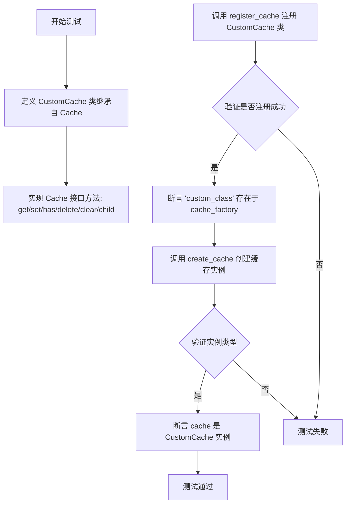

#### 带注释源码

```python
def test_register_class_directly_works():
    """Test that registering a class directly works (CacheFactory() allows this)."""
    # 定义一个自定义缓存类，继承自 Cache 抽象基类
    class CustomCache(Cache):
        # 初始化方法，接受任意关键字参数
        def __init__(self, **kwargs):
            pass

        # 异步获取缓存值
        async def get(self, key: str):
            return None

        # 异步设置缓存值
        async def set(self, key: str, value, debug_data=None):
            pass

        # 异步检查键是否存在
        async def has(self, key: str):
            return False

        # 异步删除键
        async def delete(self, key: str):
            pass

        # 异步清空缓存
        async def clear(self):
            pass

        # 创建子缓存
        def child(self, name: str):
            return self

    # 直接将 CustomCache 类注册到缓存工厂（而非注册可调用对象）
    register_cache("custom_class", CustomCache)

    # 验证自定义缓存类型已注册
    assert "custom_class" in cache_factory

    # 使用配置创建缓存实例
    cache = create_cache(CacheConfig(type="custom_class"))
    
    # 验证创建的实例是 CustomCache 类型
    assert isinstance(cache, CustomCache)
```


### `CustomCache.__init__`

这是 `CustomCache` 类的构造函数，用于初始化自定义缓存实例。它接受任意关键字参数，并将这些参数传递给父类 `Cache` 的构造函数。

参数：

- `**kwargs`：`Dict[str, Any]`，用于传递给父类 `Cache` 构造函数的关键字参数，支持配置缓存的各种选项

返回值：`None`，构造函数不返回值，仅用于初始化对象状态

#### 流程图

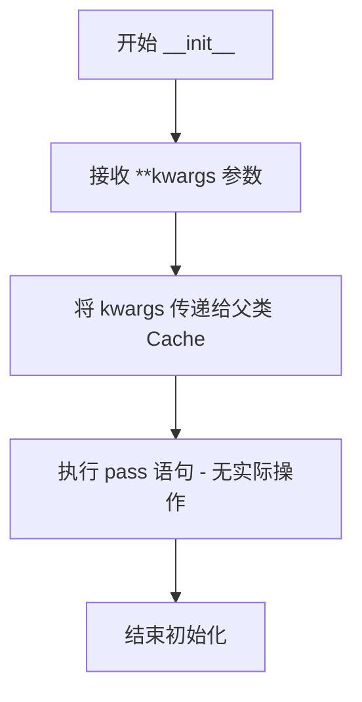

#### 带注释源码

```python
class CustomCache(Cache):
    def __init__(self, **kwargs):
        """初始化 CustomCache 实例。
        
        这是一个测试用的自定义缓存类实现，继承自 Cache 基类。
        该构造函数接受任意关键字参数，用于扩展或配置缓存行为。
        
        Args:
            **kwargs: 传递给父类 Cache 构造函数的参数
        """
        pass  # 目前实现为空，仅作为测试占位符使用
```


### `CustomCache.get`

获取缓存中指定键对应的值。

参数：

- `key`：`str`，要获取的缓存键

返回值：`Any`，返回缓存中该键对应的值，如果键不存在则返回 `None`

#### 流程图

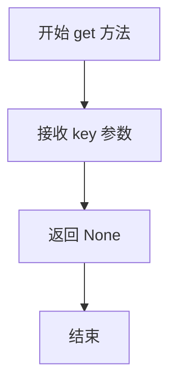

#### 带注释源码

```python
async def get(self, key: str):
    """获取缓存中指定键对应的值。

    参数:
        key: 要获取的缓存键

    返回:
        缓存中该键对应的值，如果键不存在则返回 None
    """
    return None
```


### CustomCache.set

该方法是一个异步缓存设置方法，用于将键值对存储到缓存中。当前实现为占位符方法（pass），不执行实际业务逻辑。

参数：

- `key`：`str`，缓存的键名
- `value`：`任意类型`，要缓存的值
- `debug_data`：`可选参数`，调试数据，默认为 None

返回值：`None`，无返回值

#### 流程图

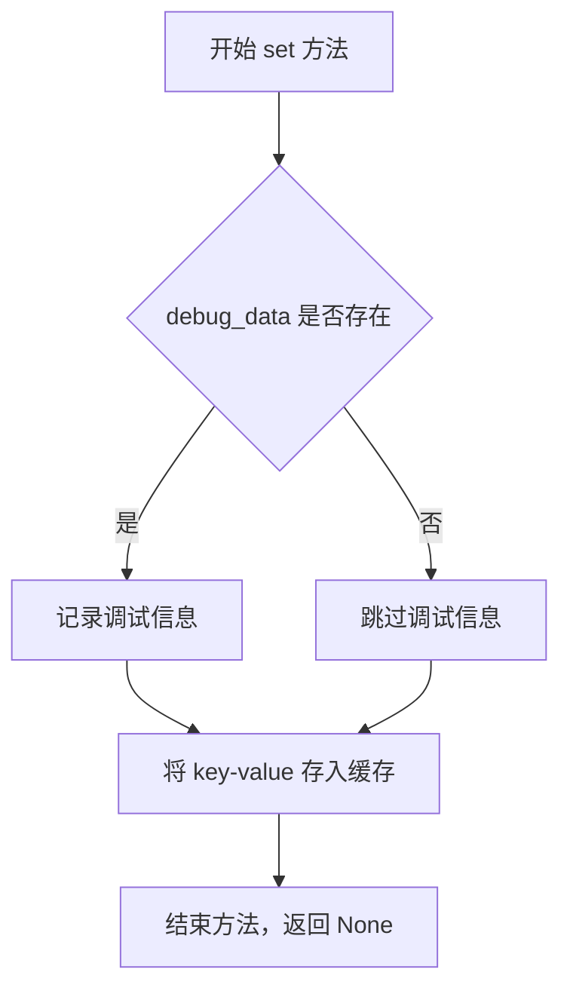

#### 带注释源码

```python
async def set(self, key: str, value, debug_data=None):
    """异步设置缓存值
    
    参数:
        key: str - 缓存的键名，用于唯一标识缓存条目
        value: 任意类型 - 要存储的缓存值，可以是任意可序列化对象
        debug_data: 可选 - 调试数据，可用于记录缓存操作的元信息
    
    返回:
        None - 该方法当前为占位符实现，不返回任何值
    """
    pass  # 当前实现为占位符，不执行任何缓存操作
```


### `CustomCache.has`

检查缓存中是否存在指定的键。

参数：

- `key`：`str`，要检查存在的键名

返回值：`bool`，如果键存在于缓存中返回 True，否则返回 False

#### 流程图

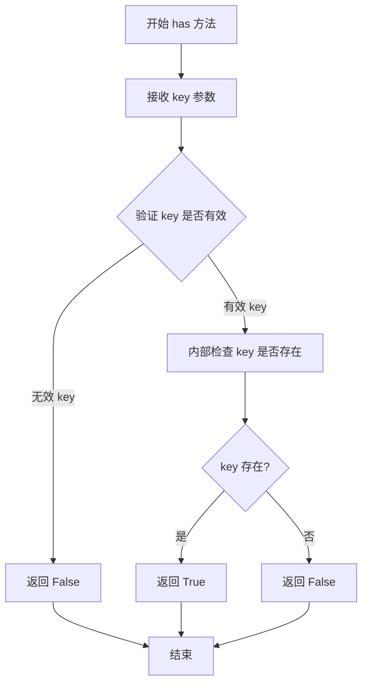

#### 带注释源码

```python
class CustomCache(Cache):
    """自定义缓存类，直接注册到 CacheFactory 的示例"""

    def __init__(self, **kwargs):
        """初始化自定义缓存实例"""
        pass

    async def get(self, key: str):
        """从缓存中获取值"""
        return None

    async def set(self, key: str, value, debug_data=None):
        """设置缓存键值对"""
        pass

    async def has(self, key: str) -> bool:
        """检查缓存中是否存在指定的键

        Args:
            key: 要检查存在的键名

        Returns:
            bool: 始终返回 False，表示该自定义缓存实现不支持实际的键存在性检查
        """
        return False

    async def delete(self, key: str):
        """删除缓存中的指定键"""
        pass

    async def clear(self):
        """清空整个缓存"""
        pass

    def child(self, name: str):
        """创建子缓存实例"""
        return self
```


### `CustomCache.delete`

删除缓存中指定键对应的值。

参数：

- `key`：`str`，要删除的缓存键

返回值：`None`，无返回值描述

#### 流程图

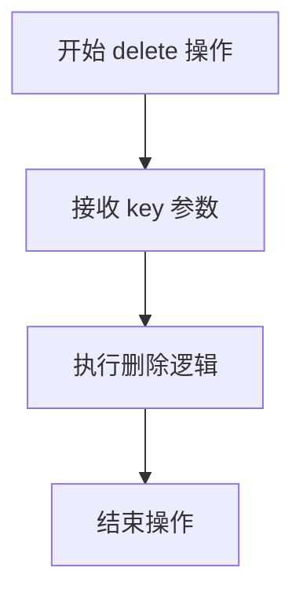

#### 带注释源码

```python
async def delete(self, key: str):
    """删除缓存中指定键对应的值。
    
    参数:
        key: 要删除的缓存键
        
    返回值:
        无返回值
    """
    pass  # 未实现具体逻辑，仅作为测试用例中的占位符
```


### CustomCache.clear

清空缓存内容的方法，用于重置缓存状态。

参数：

- 无

返回值：`None`，清空操作完成后返回空值。

#### 流程图

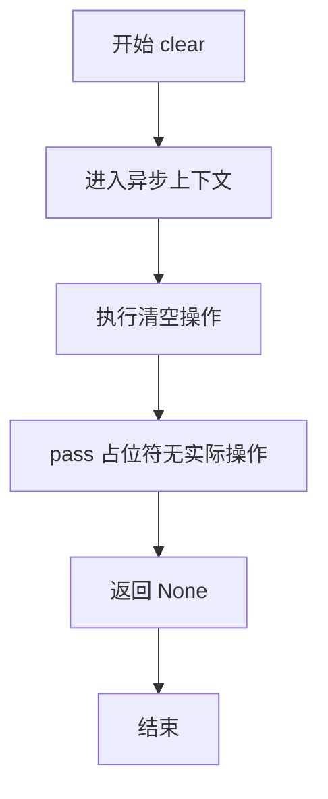

#### 带注释源码

```python
async def clear(self):
    """清空缓存内容。
    
    该方法是 Cache 抽象基类定义的接口方法之一。
    在 CustomCache 的测试实现中，这是一个空的占位符实现，
    用于验证 CacheFactory 能够正确注册和使用自定义缓存类。
    当真实实现时，此方法应包含清除所有缓存条目的逻辑。
    """
    pass  # 占位符实现，测试中不执行实际清空操作
```


### `CustomCache.child`

该方法用于创建当前缓存实例的子缓存实例，通常用于为特定的命名空间或上下文创建独立的缓存引用。在当前实现中，它直接返回实例本身，表示子缓存功能尚未完全实现或作为占位符使用。

参数：

- `name`：`str`，子缓存的名称，用于标识子缓存的上下文或命名空间

返回值：`CustomCache`，返回当前缓存实例本身（self），表示该缓存实例

#### 流程图

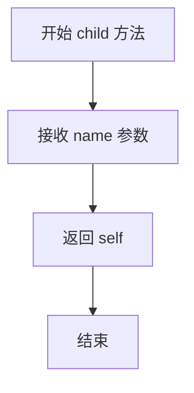

#### 带注释源码

```python
def child(self, name: str):
    """创建子缓存实例。
    
    该方法用于为特定的命名空间或上下文创建独立的缓存引用。
    在当前实现中，直接返回当前实例本身。
    
    参数:
        name: str - 子缓存的名称，用于标识子缓存的上下文
        
    返回:
        CustomCache - 返回当前缓存实例本身
    """
    return self
```

## 关键组件


### CacheFactory (缓存工厂)

核心的工厂类，用于根据配置创建不同类型的缓存实例，支持多种缓存类型（Memory、Json、Noop等）的创建和自定义缓存类型的注册。

### Cache (缓存基类)

定义了缓存操作的抽象接口，包含 get、set、has、delete、clear、child 等方法，是所有具体缓存实现类的基类。

### CacheConfig (缓存配置类)

用于配置缓存创建的配置类，包含缓存类型（type）等参数，用于指定要创建的缓存类型和相关配置。

### CacheType (缓存类型枚举)

定义了支持的缓存类型枚举值，包括 Noop、Memory、Json 等，用于标识不同类型的缓存实现。

### create_cache (创建缓存函数)

负责根据 CacheConfig 创建相应类型的缓存实例，是访问缓存系统的入口函数。

### register_cache (注册缓存函数)

用于注册自定义缓存类型的函数，支持通过名称和工厂函数或直接传递类来注册新的缓存类型。

### cache_factory (缓存工厂实例)

内部的工厂字典，存储已注册的缓存类型及其创建函数，供 create_cache 使用。

### JsonCache (JSON缓存实现)

基于 JSON 文件的缓存实现，使用 Storage 作为底层存储，支持持久化缓存数据。

### MemoryCache (内存缓存实现)

基于内存的缓存实现，存储在进程内存中，适合需要快速访问的短期缓存场景。

### NoopCache (空操作缓存)

空操作的缓存实现，实际不存储任何数据，用于禁用缓存或测试场景。

### Storage (存储层)

底层的存储抽象，用于为 JsonCache 等提供持久化存储能力，支持多种存储后端（Memory、AzureBlob、AzureCosmos等）。

### 自定义缓存注册机制

支持通过 register_cache 函数动态注册自定义缓存类型，包括通过工厂函数或直接传递类的方式，支持灵活的缓存扩展。


## 问题及建议


### 已知问题

-   **MagicMock 类型问题**：在 `test_register_and_create_custom_cache` 中使用 `# type: ignore` 注释绕过类型检查，表明对 MagicMock 的使用方式不够规范，`assert cache.initialized is True` 依赖于 mock 的行为而非真实类型安全
-   **测试污染风险**：`register_cache` 注册的缓存类型在测试后未清理，可能影响后续测试用例，`test_register_and_create_custom_cache` 和 `test_register_class_directly_works` 都向 `cache_factory` 注册了新类型
-   **平台特定测试**：CosmosDB 测试用例使用 `@pytest.mark.skipif` 跳过非 Windows 平台，覆盖范围有限
-   **功能验证不足**：所有测试仅验证 `isinstance` 检查是否通过，缺少对缓存实际功能（get/set/has/delete）的端到端测试
-   **硬编码凭据**：使用硬编码的 Well-Known 连接字符串和密钥进行测试，缺乏敏感信息管理策略
-   **错误消息脆弱性**：`test_create_unknown_cache` 中的正则匹配 `"CacheConfig\.type 'unknown' is not registered in the CacheFactory\."` 与实际异常消息紧密耦合，消息格式变化会导致测试失败
-   **异步方法未测试**：Cache 接口包含异步方法（get/set/has/delete/clear），但测试未覆盖异步执行路径

### 优化建议

-   **添加 teardown 逻辑**：使用 pytest fixture 在测试后清理已注册的缓存类型，确保测试隔离
-   **增加功能测试**：为每种缓存类型添加真实的 get/set 操作测试，验证数据持久化行为
-   **参数化测试**：使用 pytest.mark.parametrize 减少重复的测试模板代码
-   **敏感信息管理**：将连接字符串移至环境变量或使用 pytest fixtures 注入测试配置
-   **异步测试补充**：添加使用 `pytest.mark.asyncio` 的异步测试用例，验证缓存协程行为
-   **改进 mock 使用**：定义真实的测试用 Cache 子类替代 MagicMock，或使用 stub 模式提高测试可读性

## 其它


### 设计目标与约束

本测试文件旨在验证CacheFactory类的功能正确性，确保能够创建和管理不同类型的缓存（Noop、Memory、Json），并支持多种存储后端（Memory、AzureBlob、AzureCosmos）。测试覆盖了内置缓存类型的创建、自定义缓存的注册与实例化，以及错误处理机制。测试受平台约束限制：CosmosDB缓存测试仅在Windows平台运行。

### 错误处理与异常设计

测试文件中包含了两个关键的异常测试场景：(1) test_create_unknown_cache测试当传入未注册的缓存类型时系统是否抛出预期的ValueError异常，错误消息格式为"CacheConfig.type 'unknown' is not registered in the CacheFactory."；(2) 自定义缓存类的注册与实例化测试中，使用unittest.mock模拟Cache接口以验证注册机制的容错能力。

### 数据流与状态机

测试数据流如下：CacheConfig指定缓存类型和配置 → 调用create_cache()工厂函数 → 根据type字段从cache_factory注册表中查找对应的缓存构造器 → 实例化相应缓存类型并返回。状态转换包括：未注册类型→抛出ValueError；已注册类型→成功返回缓存实例；自定义类→支持直接注册类或lambda工厂函数。

### 外部依赖与接口契约

主要依赖包括：(1) graphrag_cache包：Cache抽象基类、CacheConfig配置类、CacheType枚举、create_cache()和register_cache()函数；(2) graphrag_storage包：StorageConfig配置类、StorageType枚举、create_storage()函数；(3) pytest测试框架；(4) unittest.mock用于模拟自定义缓存。接口契约要求自定义缓存类必须实现Cache抽象基类的所有异步方法（get、set、has、delete、clear）和child()方法。

### 测试覆盖范围

测试覆盖了六种场景：NoopCache空操作缓存创建、MemoryCache内存缓存创建、JsonCache配合Memory存储创建、JsonCache配合AzureBlob存储创建、JsonCache配合AzureCosmos存储创建（仅Windows）、自定义缓存类型注册与创建、未知缓存类型错误处理、直接注册缓存类而非工厂函数。

### 平台特定行为

存在平台相关性约束：test_create_cosmosdb_cache测试使用@pytest.mark.skipif装饰器，仅在Windows平台(sys.platform.startswith("win"))执行，原因 CosmosDB模拟器目前仅在Windows runners上可用。测试中使用了硬编码的模拟连接字符串和存储密钥（WELL_KNOWN_BLOB_STORAGE_KEY、WELL_KNOWN_COSMOS_CONNECTION_STRING），这些仅为测试用途。

### 配置与初始化

测试配置通过CacheConfig和StorageConfig类传递：CacheConfig.type字段指定缓存类型（CacheType枚举或自定义字符串），CacheConfig可选参数传递给缓存构造函数；StorageConfig指定存储后端类型、连接字符串、容器/数据库名称、基础目录等参数。测试使用内存存储（StorageType.Memory）进行快速单元测试，使用云存储（AzureBlob、AzureCosmos）进行集成测试。

### 注册机制与扩展性

cache_factory是一个全局注册表（字典），通过register_cache()函数将缓存类型名称映射到对应的构造函数。测试展示了两种注册方式：(1) 注册lambda工厂函数：register_cache("custom", lambda **kwargs: custom_cache_class(**kwargs))；(2) 直接注册类：register_cache("custom_class", CustomCache)。CacheFactory()支持这两种方式，提供了良好的扩展性。

    