# `graphrag\tests\integration\language_model\test_factory.py` 详细设计文档

该测试文件验证了LLMFactory的功能，包括自定义聊天模型（CustomChatModel）和自定义嵌入模型（CustomEmbeddingModel）的创建、注册和使用流程。通过register_completion和register_embedding函数注册自定义模型，并使用create_completion和create_embedding工厂函数根据ModelConfig创建相应实例。

## 整体流程

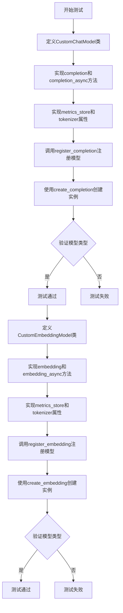

## 类结构

```
LLMCompletion (抽象基类)
└── CustomChatModel

LLMEmbedding (抽象基类)
└── CustomEmbeddingModel
```

## 全局变量及字段


### `test_create_custom_chat_model`
    
测试函数，用于验证自定义聊天模型的注册和创建流程

类型：`function`
    


### `test_create_custom_embedding_llm`
    
测试函数，用于验证自定义embedding模型的注册和创建流程

类型：`function`
    


### `register_completion`
    
用于注册自定义completion模型的函数

类型：`function`
    


### `create_completion`
    
根据配置创建completion模型的工厂函数

类型：`function`
    


### `register_embedding`
    
用于注册自定义embedding模型的函数

类型：`function`
    


### `create_embedding`
    
根据配置创建embedding模型的工厂函数

类型：`function`
    


### `ModelConfig`
    
模型配置类，用于存储模型类型、provider和model名称

类型：`class`
    


### `CustomChatModel.config`
    
存储自定义聊天模型的配置信息

类型：`Any`
    
    

## 全局函数及方法


### `test_create_custom_chat_model`

这是一个单元测试函数，用于验证自定义聊天模型（CustomChatModel）的注册和创建流程。测试通过定义一个继承自 LLMCompletion 的自定义模型类，注册该模型，然后使用 LLMFactory 创建实例并验证实例类型是否正确。

参数：

- 该函数没有参数

返回值：`None`，因为这是一个测试函数，没有显式返回值

#### 流程图

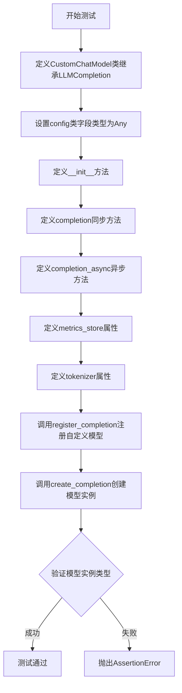

#### 带注释源码

```python
def test_create_custom_chat_model():
    """测试自定义聊天模型的注册和创建功能"""
    
    # 定义一个内部类CustomChatModel，继承自LLMCompletion基类
    # 用于模拟自定义的聊天模型实现
    class CustomChatModel(LLMCompletion):
        # 类字段：config，用于存储模型配置，类型为Any（任意类型）
        config: Any

        def __init__(self, **kwargs):
            """初始化方法，接受任意关键字参数"""
            pass

        def completion(
            self,
            /,  # 强制使用位置参数语法
            **kwargs: Unpack["LLMCompletionArgs[ResponseFormat]"],
        ) -> "LLMCompletionResponse[ResponseFormat] | Iterator[LLMCompletionChunk]":
            """同步完成方法，返回LLM响应或迭代器"""
            ...  # 方法体省略，仅定义接口

        async def completion_async(
            self,
            /,  # 强制使用位置参数语法
            **kwargs: Unpack["LLMCompletionArgs[ResponseFormat]"],
        ) -> (
            "LLMCompletionResponse[ResponseFormat] | AsyncIterator[LLMCompletionChunk]"
        ):
            """异步完成方法，返回LLM响应或异步迭代器"""
            ...  # 方法体省略，仅定义接口

        @property
        def metrics_store(self) -> "MetricsStore":
            """metrics_store属性，返回指标存储对象"""
            ...  # 属性实现省略

        @property
        def tokenizer(self) -> "Tokenizer":
            """tokenizer属性，返回分词器对象"""
            ...  # 属性实现省略

    # 调用register_completion函数，将自定义模型类注册到工厂
    # 注册名称为"custom_chat"，这样后续可以通过该名称创建模型实例
    register_completion("custom_chat", CustomChatModel)

    # 使用create_completion工厂方法创建模型实例
    # 传入ModelConfig配置对象，指定type为"custom_chat"以匹配注册的模型
    model = create_completion(
        ModelConfig(
            type="custom_chat",  # 模型类型，对应注册的名称
            model_provider="custom_provider",  # 模型提供者名称
            model="custom_chat_model",  # 具体模型名称
        )
    )
    
    # 断言验证创建的模型实例确实是CustomChatModel类型
    # 如果类型不匹配会抛出AssertionError
    assert isinstance(model, CustomChatModel)
```


### `test_create_custom_embedding_llm`

这是一个测试函数，用于验证自定义嵌入模型（CustomEmbeddingModel）的创建、注册和使用流程。

参数：

- 无

返回值：`None`，该函数为测试函数，执行一系列断言操作但不返回具体值

#### 流程图

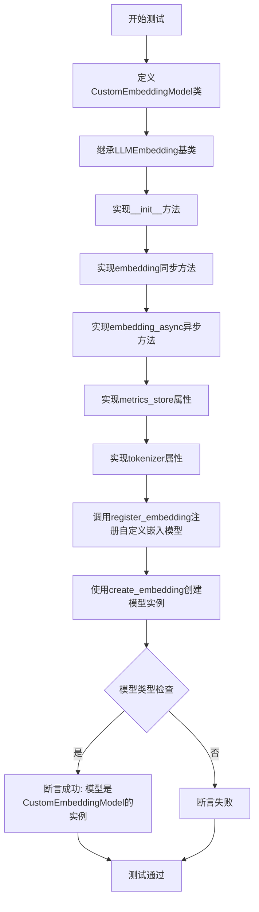

#### 带注释源码

```python
def test_create_custom_embedding_llm():
    """测试自定义嵌入模型的创建流程"""
    
    # 定义CustomEmbeddingModel类，继承自LLMEmbedding基类
    class CustomEmbeddingModel(LLMEmbedding):
        
        # 初始化方法，接受任意关键字参数
        def __init__(self, **kwargs): ...
        
        # 同步嵌入方法，接受任意关键字参数并返回嵌入响应
        def embedding(
            self, /, **kwargs: Unpack["LLMEmbeddingArgs"]
        ) -> "LLMEmbeddingResponse": ...
        
        # 异步嵌入方法，接受任意关键字参数并返回嵌入响应
        async def embedding_async(
            self, /, **kwargs: Unpack["LLMEmbeddingArgs"]
        ) -> "LLMEmbeddingResponse": ...
        
        # 指标存储属性
        @property
        def metrics_store(self) -> "MetricsStore": ...
        
        # 分词器属性
        @property
        def tokenizer(self) -> "Tokenizer": ...

    # 使用register_embedding将自定义嵌入模型注册到工厂
    # 参数1: 注册名称 "custom_embedding"
    # 参数2: 自定义模型类 CustomEmbeddingModel
    register_embedding("custom_embedding", CustomEmbeddingModel)

    # 使用create_embedding工厂方法创建模型实例
    # 传入ModelConfig配置对象，包含type、model_provider和model信息
    model = create_embedding(
        ModelConfig(
            type="custom_embedding",      # 注册时使用的类型名称
            model_provider="custom_provider",  # 模型提供者
            model="custom_embedding_model",    # 模型名称
        )
    )

    # 断言验证创建的模型是否为CustomEmbeddingModel的实例
    assert isinstance(model, CustomEmbeddingModel)
```


### `CustomChatModel.__init__`

这是自定义聊天模型类的初始化方法，用于接收并存储配置参数。该方法接受任意关键字参数（**kwargs），用于初始化自定义聊天模型的配置信息。

参数：

- `self`：无类型标注，CustomChatModel 实例本身，表示当前创建的模型对象
- `**kwargs`：`Any`，接收任意关键字参数，用于传递模型初始化所需的配置信息（如 API 密钥、端点地址、模型参数等）

返回值：`None`，无返回值（`__init__` 方法不返回值）

#### 流程图

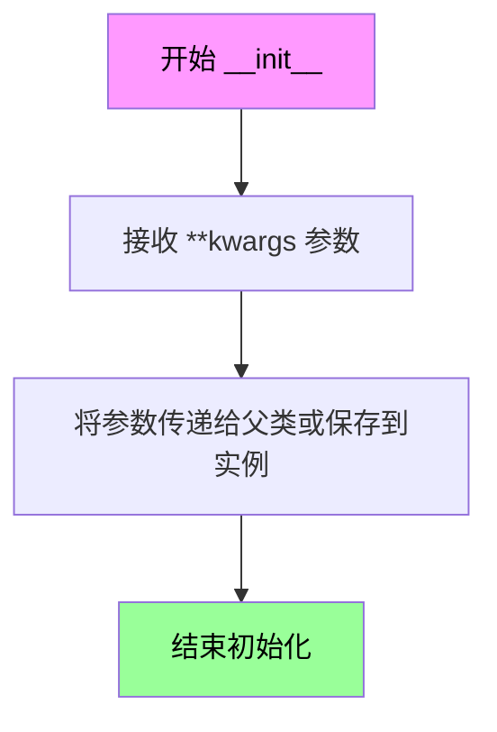

#### 带注释源码

```python
def __init__(self, **kwargs):
    """自定义聊天模型类的初始化方法。
    
    该方法继承自 LLMCompletion 基类，用于初始化自定义聊天模型实例。
    在测试用例中，该方法体为空（pass），意味着使用默认初始化行为。
    
    参数:
        **kwargs: 任意关键字参数，用于传递模型配置信息（如 API 密钥、
                 端点地址、自定义参数等）。这些参数会被传递给父类的
                 __init__ 方法或存储在实例属性中供后续方法使用。
    
    返回值:
        无返回值（None）。__init__ 方法用于初始化对象状态，不应返回值。
    
    示例:
        # 在测试中创建自定义模型实例时调用
        model = CustomChatModel(api_key="test_key", endpoint="https://api.example.com")
    """
    pass  # 空实现，使用从 LLMCompletion 继承的默认初始化逻辑
```


### `CustomChatModel.completion`

该方法是一个同步完成方法，用于生成聊天补全响应。它接收任意关键字参数，并将结果以同步迭代器或完整响应对象的形式返回，支持流式和批量两种模式。

参数：

- `self`：`CustomChatModel`，方法的调用者实例
- `**kwargs`：`Unpack["LLMCompletionArgs[ResponseFormat]"]`，可变关键字参数，包含聊天完成请求的所有配置，如消息内容、模型参数、温度、top_p 等

返回值：`LLMCompletionResponse[ResponseFormat] | Iterator[LLMCompletionChunk]`，返回完整的聊天完成响应对象，或者返回流式迭代器用于逐步获取响应块

#### 流程图

```mermaid
flowchart TD
    A[开始 completion 方法] --> B{接收 **kwargs}
    B --> C[调用底层模型服务]
    C --> D{是否流式响应?}
    D -->|是| E[返回 Iterator[LLMCompletionChunk]]
    D -->|否| F[返回 LLMCompletionResponse]
    E --> G[结束]
    F --> G
```

#### 带注释源码

```python
def completion(
    self,
    /,
    **kwargs: Unpack["LLMCompletionArgs[ResponseFormat]"],
) -> "LLMCompletionResponse[ResponseFormat] | Iterator[LLMCompletionChunk]":
    """Generate a chat completion response.
    
    Args:
        self: The CustomChatModel instance.
        **kwargs: Variable keyword arguments unpacked from LLMCompletionArgs,
                  containing parameters like messages, model, temperature, etc.
    
    Returns:
        Either a complete LLMCompletionResponse or an Iterator of 
        LLMCompletionChunk for streaming responses.
    """
    ...  # 实现代码在测试中省略，使用 ... 表示方法定义
```


### `CustomChatModel.completion_async`

这是一个异步方法，用于向语言模型发送聊天补全请求并获取响应。该方法支持两种返回模式：同步返回完整的补全响应，或异步迭代返回流式补全块。

参数：

- `self`：`CustomChatModel`，CustomChatModel 类的实例本身
- `**kwargs`：`Unpack["LLMCompletionArgs[ResponseFormat]"]`，包含聊天补全请求参数的可变关键字参数，如消息内容、模型参数、温度、最大令牌数等

返回值：`"LLMCompletionResponse[ResponseFormat] | AsyncIterator[LLMCompletionChunk]"`，返回完整的补全响应对象，或异步迭代器（用于流式输出场景）

#### 流程图

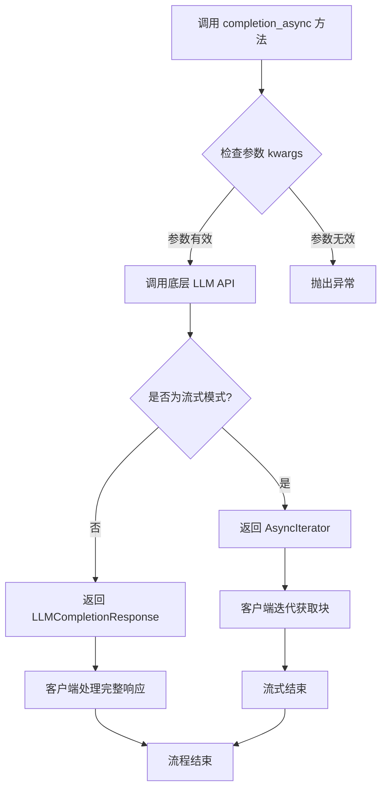

#### 带注释源码

```python
async def completion_async(
    self,
    /,
    **kwargs: Unpack["LLMCompletionArgs[ResponseFormat]"],
) -> (
    "LLMCompletionResponse[ResponseFormat] | AsyncIterator[LLMCompletionChunk]"
):
    """异步聊天补全方法.
    
    Args:
        self: CustomChatModel 实例
        /: 斜杠表示之前的参数仅限位置传递
        **kwargs: 包含 LLMCompletionArgs 的解包参数，支持:
            - messages: 聊天消息列表
            - model: 模型名称
            - temperature: 采样温度
            - max_tokens: 最大生成令牌数
            - stream: 是否启用流式输出
            - response_format: 响应格式规范
            - 及其他模型特定参数
    
    Returns:
        LLMCompletionResponse[ResponseFormat]: 非流式模式的完整响应
        AsyncIterator[LLMCompletionChunk]: 流式模式的异步迭代器
    
    Note:
        此方法为抽象方法定义，具体实现由子类提供
        返回类型取决于 kwargs 中的 stream 参数
    """
    ...  # 抽象方法，由具体实现类重写
```


### `CustomChatModel.metrics_store`

该属性方法返回模型的指标存储（MetricsStore）实例，用于收集和存储模型的性能指标数据，如请求延迟、token使用量、错误率等，以便后续进行性能分析和监控。

参数：无（属性方法不接受额外参数，`self` 为隐式参数）

返回值：`MetricsStore`，返回模型的指标存储实例，用于记录和查询模型运行时的各种度量指标。

#### 流程图

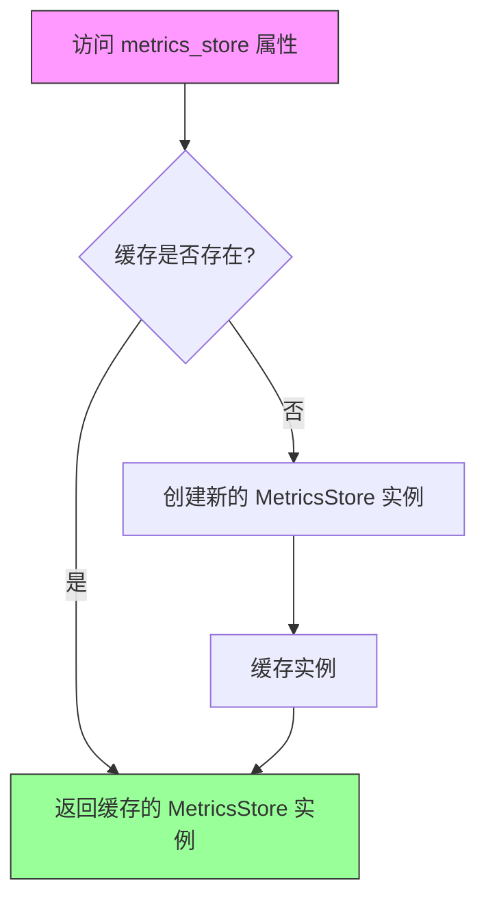

#### 带注释源码

```python
@property
def metrics_store(self) -> "MetricsStore":
    """获取模型的指标存储实例。
    
    这是一个只读属性，返回与该模型关联的 MetricsStore 对象。
    MetricsStore 用于收集和存储模型运行时的各种性能指标，
    包括但不限于：
    - 请求响应时间
    - Token 使用数量
    - 错误率和失败原因
    - 模型调用的频率统计
    
    Returns:
        MetricsStore: 模型关联的指标存储实例，用于性能监控和分析。
    
    Example:
        >>> model = create_completion(config)
        >>> store = model.metrics_store
        >>> metrics = store.get_metrics()  # 获取收集的指标数据
    """
    ...
```


### `CustomChatModel.tokenizer`

该属性是一个只读属性，用于获取与自定义聊天模型关联的 Tokenizer 实例，用于对文本进行分词处理。

参数：无需显式参数（`self` 为隐式参数）

返回值：`Tokenizer`，返回模型的分词器实例，用于文本编码和解码操作。

#### 流程图

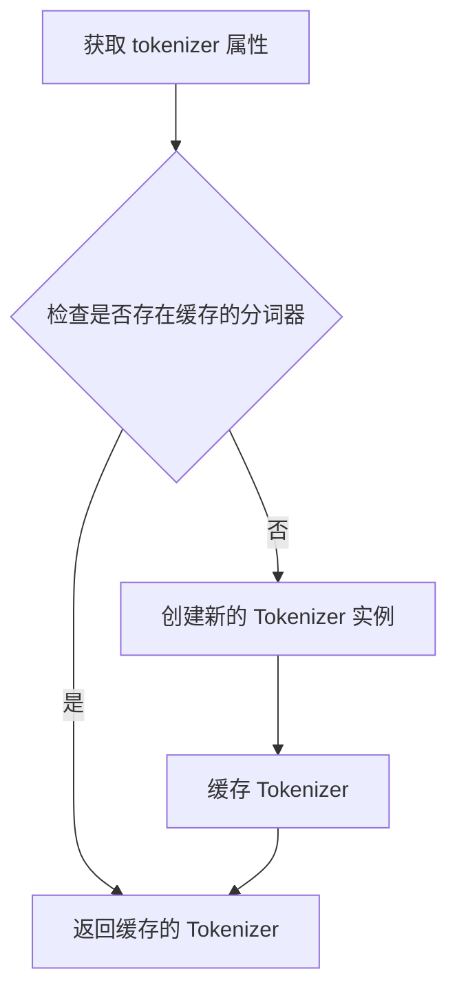

#### 带注释源码

```python
@property
def tokenizer(self) -> "Tokenizer":
    """获取模型的分词器实例。
    
    这是一个只读属性，返回与当前模型关联的 Tokenizer 对象。
    Tokenizer 用于将文本转换为模型可以处理的 token 序列，
    以及将 token 序列转换回文本。
    
    Returns:
        Tokenizer: 模型的分词器实例，用于文本编码/解码操作。
    """
    ...
```


### `CustomEmbeddingModel.__init__`

这是自定义嵌入模型类的初始化方法，用于实例化一个继承自 `LLMEmbedding` 的自定义嵌入模型。该方法接受任意关键字参数（**kwargs），允许调用者灵活地传递配置选项或依赖项，而无需在方法签名中显式声明每个参数。

参数：

- `self`：`CustomEmbeddingModel`，类的实例本身，用于访问实例属性和方法
- `**kwargs`：`Dict[str, Any]` 或 `Any`，可变关键字参数，用于接收任意数量的命名参数，如模型配置、API 密钥、连接设置等

返回值：`None`，构造函数不返回任何值，仅完成对象的初始化

#### 流程图

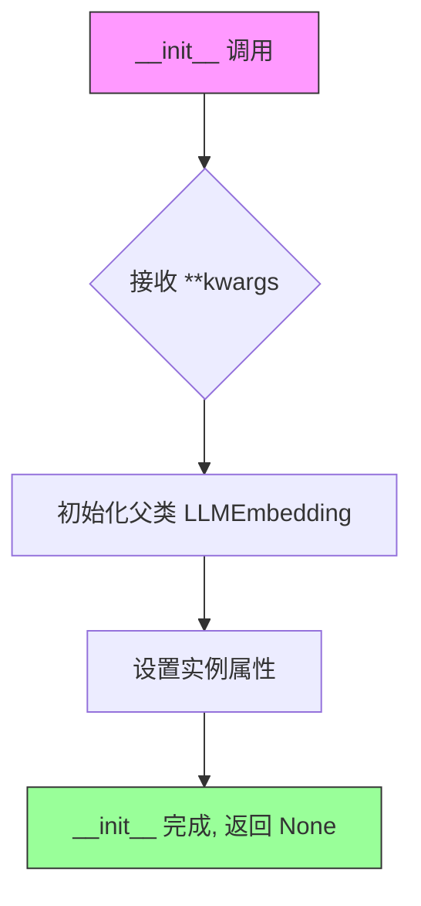

#### 带注释源码

```python
def __init__(self, **kwargs):
    """初始化 CustomEmbeddingModel 实例。
    
    这是一个可变参数构造函数，允许调用者传入任意数量的关键字参数。
    这些参数可以包括但不限于：
    - 模型配置参数（如 model_name, endpoint 等）
    - 认证凭据（如 api_key, token 等）
    - 连接选项（如 timeout, retry_policy 等）
    
    Args:
        **kwargs: 任意关键字参数，类型和含义取决于具体的实现需求
        
    Returns:
        None: 构造函数不返回值，仅初始化对象状态
    """
    pass  # 此处为占位符实现，实际逻辑由调用者扩展
```


### `CustomEmbeddingModel.embedding`

这是一个自定义嵌入模型类中的嵌入方法，用于根据输入参数生成嵌入向量。该方法接受任意关键字参数，将其解包为嵌入参数，并返回嵌入响应结果。

参数：

- `self`：隐式参数，CustomEmbeddingModel 实例，表示当前对象本身
- `/`：参数分隔符，表示前面的参数只能使用位置传递
- `**kwargs`：`Unpack["LLMEmbeddingArgs"]`，接受任意关键字参数，这些参数会被解包为嵌入操作的配置参数（如文本输入、模型参数等）

返回值：`LLMEmbeddingResponse`，嵌入操作的响应结果，包含生成的嵌入向量及相关元数据

#### 流程图

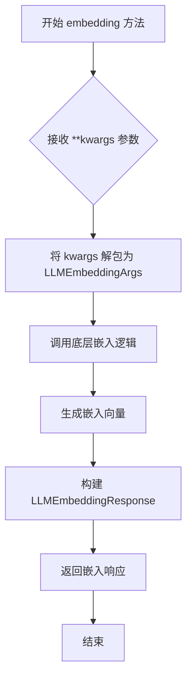

#### 带注释源码

```python
def embedding(
    self,  # self: 隐式参数，指向 CustomEmbeddingModel 实例本身
    /,     # /: 参数分隔符，表示 self 只能通过位置参数传递
    **kwargs: Unpack["LLMEmbeddingArgs"]  # **kwargs: 可变关键字参数，解包为嵌入参数
) -> "LLMEmbeddingResponse":  # -> LLMEmbeddingResponse: 返回嵌入响应对象
    """生成嵌入向量的同步方法。
    
    该方法接收任意关键字参数，将其解包为 LLMEmbeddingArgs 类型，
    然后执行嵌入操作并返回 LLMEmbeddingResponse 结果。
    
    参数:
        **kwargs: 任意关键字参数，会被解包为 LLMEmbeddingArgs 类型的配置参数
        
    返回:
        LLMEmbeddingResponse: 包含嵌入向量和相关元数据的响应对象
    """
    ...  # 实现细节在测试中为占位符
```


### `CustomEmbeddingModel.embedding_async`

异步嵌入方法，用于生成输入文本的向量表示。该方法继承自 `LLMEmbedding` 抽象类，提供异步调用接口以支持高效的嵌入计算。

参数：

- `self`：`CustomEmbeddingModel` 实例，隐式参数
- `/`：POSITIONAL_ONLY 分割符，表示其后的参数为仅位置参数
- `**kwargs`：`Unpack["LLMEmbeddingArgs"]`，可变关键字参数，包含嵌入操作所需的所有配置参数（如输入文本、模型参数等）

返回值：`LLMEmbeddingResponse`，嵌入操作的响应结果，包含生成的向量嵌入和相关元数据

#### 流程图

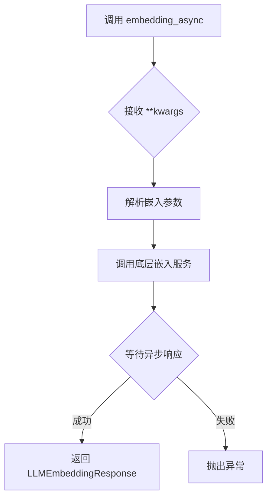

#### 带注释源码

```python
async def embedding_async(
    self, /, **kwargs: Unpack["LLMEmbeddingArgs"]
) -> "LLMEmbeddingResponse": ...
"""
异步嵌入方法

参数:
    self: CustomEmbeddingModel 实例
    /: 位置参数分隔符，表明后续参数为仅位置参数
    **kwargs: 任意关键字参数，解包自 LLMEmbeddingArgs 类型，
              包含如 prompt、dimension、normalize 等嵌入配置

返回值:
    LLMEmbeddingResponse: 包含嵌入向量的响应对象，
                         通常包括 embeddings 列表和 usage 信息

注意:
    - 该方法为抽象方法声明，具体实现由子类提供
    - 使用异步语法支持并发调用嵌入服务
    - ... 表示方法体未在此处实现（测试代码占位符）
"""
```


### `CustomEmbeddingModel.metrics_store`

返回自定义嵌入模型的度量存储库实例，用于收集和访问模型运行时的度量数据。

参数：

- `self`：`CustomEmbeddingModel`，隐式参数，指向当前 CustomEmbeddingModel 实例本身

返回值：`MetricsStore`，度量存储库实例，提供对模型性能指标（如延迟、吞吐量、错误率等）的访问接口

#### 流程图

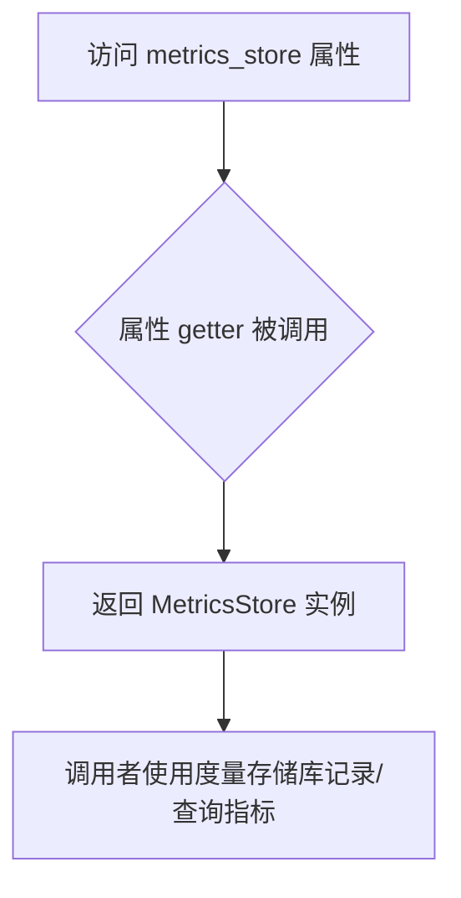

#### 带注释源码

```python
@property
def metrics_store(self) -> "MetricsStore":
    """度量存储库属性 getter 方法。
    
    该属性返回一个 MetricsStore 实例，用于收集和访问
    自定义嵌入模型在运行过程中的各种性能指标数据。
    调用者可以通过返回的 MetricsStore 实例来记录请求延迟、
    吞吐量、错误率等指标，或者查询历史度量数据。
    
    Returns:
        MetricsStore: 模型关联的度量存储库实例，用于指标管理
    """
    ...
```


### `CustomEmbeddingModel.tokenizer`

这是一个属性方法（property），用于获取与自定义嵌入模型关联的 tokenizer 实例。该属性返回 `Tokenizer` 对象，使得调用者可以使用该 tokenizer 对文本进行分词处理。

参数：

-  `self`：`CustomEmbeddingModel`，表示 `CustomEmbeddingModel` 类的实例本身

返回值：`Tokenizer`，返回与嵌入模型关联的 tokenizer 实例，用于文本分词操作

#### 流程图

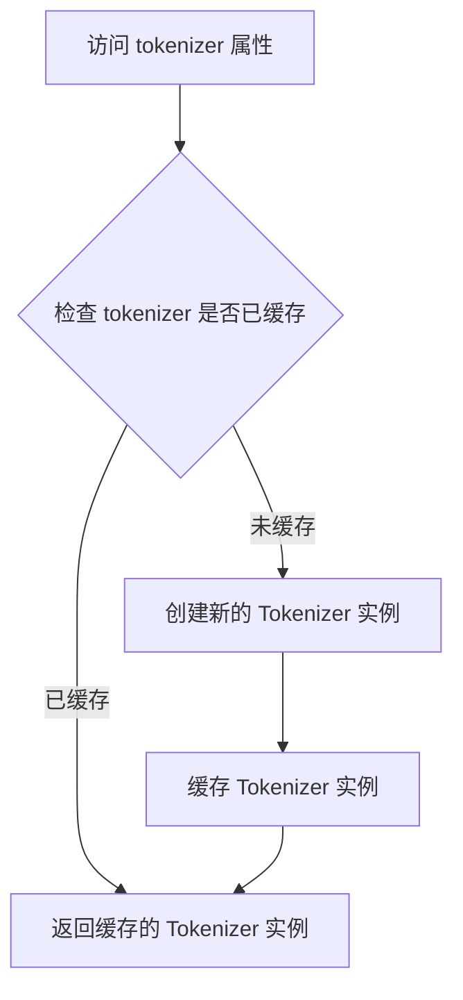

#### 带注释源码

```python
@property
def tokenizer(self) -> "Tokenizer":
    """获取与嵌入模型关联的 tokenizer 实例。
    
    这是一个只读属性，返回用于文本分词的 Tokenizer 对象。
    该属性可能实现了懒加载机制，仅在首次访问时创建 Tokenizer 实例，
    后续访问直接返回缓存的实例以提高性能。
    
    Returns:
        Tokenizer: 与当前嵌入模型关联的分词器实例
    """
    ...
```

## 关键组件


### CustomChatModel (自定义聊天模型类)

继承自LLMCompletion的测试用自定义聊天模型类，用于测试completion模型的注册与创建流程。

### CustomEmbeddingModel (自定义嵌入模型类)

继承自LLMEmbedding的测试用自定义嵌入模型类，用于测试embedding模型的注册与创建流程。

### register_completion (Completion模型注册函数)

用于将自定义completion模型类注册到系统中，支持通过字符串标识符创建模型。

### create_completion (Completion模型创建函数)

根据ModelConfig配置创建对应的completion模型实例，支持多种模型类型的动态创建。

### register_embedding (Embedding模型注册函数)

用于将自定义embedding模型类注册到系统中，支持通过字符串标识符创建模型。

### create_embedding (Embedding模型创建函数)

根据ModelConfig配置创建对应的embedding模型实例，支持多种模型类型的动态创建。

### LLMCompletion (Completion基类)

提供LLM完成任务能力的抽象基类，定义了同步和异步completion接口。

### LLMEmbedding (Embedding基类)

提供LLM嵌入能力的抽象基类，定义了同步和异步embedding接口。

### ModelConfig (模型配置类)

用于配置LLM模型的参数，包括模型类型、提供商和模型名称等配置信息。

### test_create_custom_chat_model (测试函数)

测试自定义聊天模型的注册、创建和实例化流程，验证自定义模型能够被正确创建。

### test_create_custom_embedding_llm (测试函数)

测试自定义嵌入模型的注册、创建和实例化流程，验证自定义嵌入模型能够被正确创建。


## 问题及建议


### 已知问题

-   **测试实现不完整**：自定义类中使用 `...`（省略号）和 `pass` 作为方法体，导致测试无法验证实际功能，仅验证了注册和创建流程
-   **缺少错误处理测试**：未测试无效 type、缺失必填参数、模型注册冲突等异常场景
-   **测试隔离不足**：`register_completion` 和 `register_embedding` 修改全局注册表，多个测试运行时可能产生相互影响
-   **类型注解过于宽泛**：`config: Any` 使用 Any 类型，丧失类型安全性和文档可读性
-   **属性实现缺失**：CustomChatModel 和 CustomEmbeddingModel 的 `metrics_store` 和 `tokenizer` 属性仅有文档注释，无实际实现
-   **未验证异步方法**：`completion_async` 和 `embedding_async` 方法仅有签名声明，未测试异步调用逻辑

### 优化建议

-   为自定义模型类添加完整的方法实现或使用 mock 对象，确保测试能够覆盖实际调用场景
-   添加负面测试用例：测试不存在的 type、重复注册、非法配置等边界情况
-   在测试前后添加注册表清理逻辑（`unregister_completion`/`unregister_embedding`），或使用 fixture 确保测试隔离
-   将 `config: Any` 改为具体类型如 `ModelConfig`，增强类型安全
-   实现或使用 `@property` 装饰器返回适当的 mock 对象，确保属性可访问
-   添加异步测试方法，使用 `pytest.mark.asyncio` 装饰器验证异步方法的正确性
-   添加集成测试验证完整的模型调用链路，包括配置传递和响应处理

## 其它


### 设计目标与约束

本测试文件旨在验证LLMFactory工厂模式的正确性，确保能够通过注册机制动态创建自定义聊天模型和嵌入模型。设计约束包括：必须继承自LLMCompletion或LLMEmbedding基类，必须实现相应的抽象方法，必须通过register_*函数注册后才能通过create_*函数创建实例。

### 错误处理与异常设计

测试中未显式展示错误处理，但预期错误场景包括：未注册的模型类型会导致创建失败；配置参数不匹配会导致初始化异常；异步方法的异常应该被正确传播。基类方法使用省略号（...）表示未实现，调用时会抛出NotImplementedError。

### 数据流与状态机

数据流主要涉及ModelConfig配置对象的传递，从register_*注册表到create_*工厂函数的查询过程。状态机方面：注册状态（已注册/未注册）→ 创建状态（创建中/创建成功/创建失败）→ 实例状态（可用/不可用）。

### 外部依赖与接口契约

主要外部依赖包括：graphrag_llm.completion模块提供LLMCompletion基类、create_completion和register_completion函数；graphrag_llm.embedding模块提供LLMEmbedding基类、create_embedding和register_embedding函数；graphrag_llm.config提供ModelConfig配置类；graphrag_llm.metrics提供MetricsStore；graphrag_llm.tokenizer提供Tokenizer。接口契约要求自定义类必须实现指定的属性和方法签名。

### 安全性考虑

测试代码本身不涉及敏感数据处理，但生产环境中需注意：模型配置中的API密钥等敏感信息应妥善保管；自定义模型类不应包含恶意代码；注册机制应防止未授权的模型注入攻击。

### 性能考虑

测试主要关注功能正确性，性能方面需注意：注册表查询应为O(1)复杂度；模型创建应避免重复初始化；异步方法应支持并发调用。

### 测试策略

采用单元测试策略，测试两个核心场景：test_create_custom_chat_model验证自定义聊天模型的注册和创建流程；test_create_custom_embedding_llm验证自定义嵌入模型的注册和创建流程。使用assert确保返回实例类型正确。

### 配置管理

通过ModelConfig统一管理模型配置，包含type（模型类型）、model_provider（模型提供商）、model（模型名称）三个必要字段。配置对象在create_*函数中被用于查找对应的注册类。

### 版本兼容性

代码使用TYPE_CHECKING进行类型检查的条件导入，确保运行时不导入不必要的类型。使用了Python 3.12+的类型注解语法（Unpack）。

### 并发处理

异步方法completion_async和embedding_async设计为支持并发调用，返回类型包含AsyncIterator用于流式响应。测试未涵盖并发场景，但生产代码应考虑线程安全。

### 资源管理

自定义模型类的__init__方法接收**kwargs参数，应在实现中正确管理资源（如连接池、缓存等）。基类未定义显式的资源清理接口，建议实现上下文管理器协议。

### 监控与可观测性

通过metrics_store属性提供指标存储功能，自定义模型应正确维护指标数据。tokenizer属性用于获取分词器，支持文本处理相关的监控需求。

    