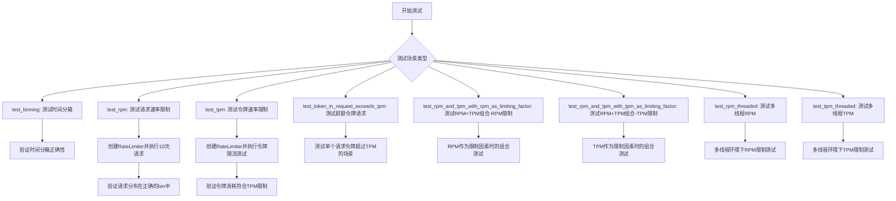
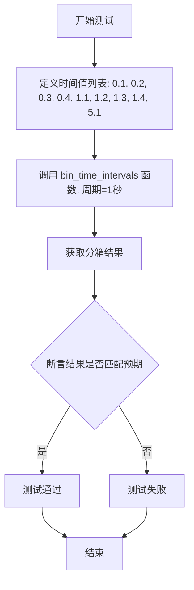
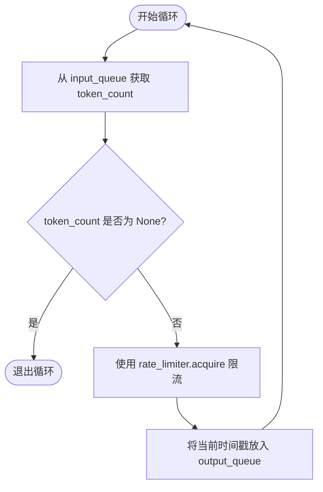
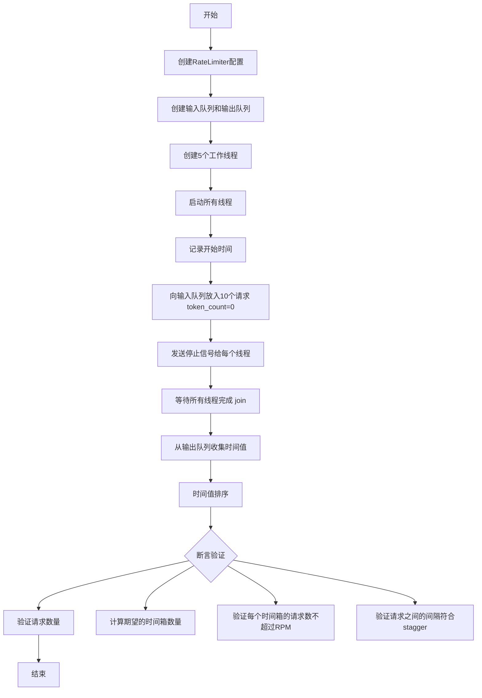
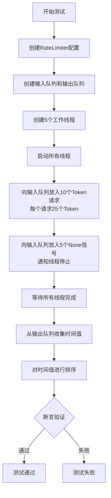

# `graphrag\tests\integration\language_model\test_rate_limiter.py` 详细设计文档

这是一个集成测试文件，用于测试 LiteLLM 的速率限制器（Rate Limiter）功能。该测试文件涵盖了多种速率限制场景，包括基于请求数（RPM）和基于令牌数（TPM）的限制，支持滑动窗口算法，并验证了单线程和多线程环境下的限流行为。

## 整体流程



## 类结构

```
测试模块 (test_rate_limit.py)
├── 全局配置变量
│   ├── _period_in_seconds
│   ├── _rpm
│   ├── _tpm
│   ├── _tokens_per_request
│   ├── _stagger
│   └── _num_requests
├── 测试函数
│   ├── test_binning
│   ├── test_rpm
│   ├── test_tpm
│   ├── test_token_in_request_exceeds_tpm
│   ├── test_rpm_and_tpm_with_rpm_as_limiting_factor
│   ├── test_rpm_and_tpm_with_tpm_as_limiting_factor
│   ├── _run_rate_limiter (辅助函数)
│   ├── test_rpm_threaded
│   └── test_tpm_threaded
└── 外部依赖 (导入)
    ├── RateLimitConfig (配置类)
    ├── RateLimitType (枚举)
    ├── RateLimiter (速率限制器类)
    ├── create_rate_limiter (工厂函数)
    └── 测试工具函数
```

## 全局变量及字段


### `_period_in_seconds`
    
速率限制的时间周期（秒），设为1秒

类型：`int`
    


### `_rpm`
    
每周期允许的请求数（Requests Per Minute），即每秒允许4个请求

类型：`int`
    


### `_tpm`
    
每周期允许的令牌数（Tokens Per Minute），即每秒允许75个令牌

类型：`int`
    


### `_tokens_per_request`
    
每个请求消耗的令牌数，设为25个令牌

类型：`int`
    


### `_stagger`
    
相邻请求之间的等待时间间隔，通过_period_in_seconds/_rpm计算得出

类型：`float`
    


### `_num_requests`
    
测试中发送的请求总数，设为10个

类型：`int`
    


    

## 全局函数及方法


### `test_binning`

测试时间分箱功能，将时间值按指定周期（1秒）分组，验证分组结果是否正确。

参数： 无

返回值：`None`，该函数为测试函数，无返回值，通过 assert 断言验证结果

#### 流程图



#### 带注释源码

```python
def test_binning():
    """Test binning timings into 1-second intervals."""
    # 定义一组时间值，用于测试分箱功能
    # 这些值分布在不同的秒数区间内
    values = [0.1, 0.2, 0.3, 0.4, 1.1, 1.2, 1.3, 1.4, 5.1]
    
    # 调用 bin_time_intervals 函数，将时间值按1秒周期分组
    # 参数1: values - 时间值列表
    # 参数2: 1 - 分箱周期（1秒）
    binned_values = bin_time_intervals(values, 1)
    
    # 验证分箱结果是否符合预期
    # 预期结果说明:
    # - 第0秒区间: [0.1, 0.2, 0.3, 0.4] (0<=t<1)
    # - 第1秒区间: [1.1, 1.2, 1.3, 1.4] (1<=t<2)
    # - 第2-4秒区间: [] (空，无时间值)
    # - 第5秒区间: [5.1] (5<=t<6)
    assert binned_values == [
        [0.1, 0.2, 0.3, 0.4],
        [1.1, 1.2, 1.3, 1.4],
        [],
        [],
        [],
        [5.1],
    ]
```


### `test_rpm`

测试基于请求数的速率限制器（RPM），验证速率限制器是否在滑动窗口模式下正确限制每个时间段内的请求数量，并通过时间分箱和间隔验证确保请求分布符合预期。

参数：

- 该函数无参数

返回值：`None`，该函数为测试函数，通过断言验证速率限制器的行为，不返回任何值

#### 流程图

```mermaid
flowchart TD
    A[开始 test_rpm] --> B[创建 RateLimiter: SlidingWindow, 1秒周期, 4请求/周期]
    B --> C[初始化: time_values列表, start_time当前时间]
    C --> D{循环 i 从 0 到 9}
    D -->|每次迭代| E[调用 rate_limiter.acquire token_count=25]
    E --> F[记录当前时间到 time_values]
    F --> D
    D -->|循环结束| G[断言 len(time_values) == 10]
    G --> H[调用 bin_time_intervals 分箱时间值, 箱大小1秒]
    H --> I[计算预期箱数: ceil(10/4) = 3]
    I --> J[断言 len(binned_time_values) == 3]
    J --> K[调用 assert_max_num_values_per_period 验证每箱最多4个请求]
    K --> L[调用 assert_stagger 验证请求间隔为0.25秒]
    L --> M[结束]
```

#### 带注释源码

```python
def test_rpm():
    """Test that the rate limiter enforces RPM limits."""
    # 使用滑动窗口类型的速率限制器配置，每1秒允许4个请求
    rate_limiter = create_rate_limiter(
        RateLimitConfig(
            type=RateLimitType.SlidingWindow,  # 使用滑动窗口算法
            period_in_seconds=_period_in_seconds,  # 时间周期为1秒
            requests_per_period=_rpm,  # 每周期允许4个请求
        )
    )

    # 用于记录每个请求完成时间的时间戳列表
    time_values: list[float] = []
    # 记录测试开始时间
    start_time = time.time()
    
    # 循环发送10个请求
    for _ in range(_num_requests):
        # 使用上下文管理器获取速率限制令牌，每次请求消耗25个token
        with rate_limiter.acquire(token_count=_tokens_per_request):
            # 记录请求完成时相对于开始时间的时间差
            time_values.append(time.time() - start_time)

    # 验证所有10个请求都已完成
    assert len(time_values) == _num_requests
    
    # 将时间值分箱到1秒间隔的桶中
    binned_time_values = bin_time_intervals(time_values, _period_in_seconds)

    """
    With _num_requests = 10 and _rpm = 4, we expect the requests to be
    distributed across ceil(10/4) = 3 bins:
    with a stagger of 1/4 = 0.25 seconds between requests.
    """

    # 计算预期的分箱数量：10个请求 / 4个请求每周期 = 2.5，向上取整为3
    expected_num_bins = ceil(_num_requests / _rpm)
    
    # 验证分箱后的时间值数量是否符合预期
    assert len(binned_time_values) == expected_num_bins

    # 验证每个时间箱内的请求数量不超过速率限制（每周期4个请求）
    assert_max_num_values_per_period(binned_time_values, _rpm)
    
    # 验证相邻请求之间的时间间隔符合预期的0.25秒 staggered 分布
    assert_stagger(time_values, _stagger)
```


### `test_tpm`

测试基于令牌数（TPM）的速率限制器，验证在滑动窗口模式下，速率限制器能否正确限制每个时间周期内的令牌消耗量。

参数：

- 无（该函数为模块级测试函数，无参数）

返回值：`None`，该函数为测试函数，通过断言验证行为，不返回具体值

#### 流程图

```mermaid
flowchart TD
    A[开始测试 test_tpm] --> B[创建 RateLimitConfig: SlidingWindow, period=1s, tokens_per_period=75]
    C[创建 RateLimiter 实例] --> D[初始化 time_values 列表和 start_time]
    E{循环 10 次} -->|每次| F[使用 rate_limiter.acquire token_count=25]
    F --> G[记录时间到 time_values]
    E --> H{循环结束?}
    H -->|是| I[断言 time_values 长度为 10]
    I --> J[计算 expected_num_bins = ceil(10 * 25 / 75) = 4]
    J --> K[断言 binned_time_values 长度为 4]
    K --> L[计算 max_num_of_requests_per_bin = 75 // 25 = 3]
    L --> M[断言每个时间周期内最大请求数不超过 3]
    M --> N[测试通过]
```

#### 带注释源码

```python
def test_tpm():
    """Test that the rate limiter enforces TPM limits."""
    # 创建速率限制器配置：滑动窗口类型，周期1秒，每周期75个令牌
    rate_limiter = create_rate_limiter(
        RateLimitConfig(
            type=RateLimitType.SlidingWindow,
            period_in_seconds=_period_in_seconds,  # 1秒
            tokens_per_period=_tpm,  # 75 tokens
        )
    )

    # 初始化时间记录列表
    time_values: list[float] = []
    # 记录测试开始时间
    start_time = time.time()
    
    # 发送10个请求，每个请求消耗25个令牌
    for _ in range(_num_requests):  # 10次循环
        # 获取令牌（阻塞直到速率限制允许）
        with rate_limiter.acquire(token_count=_tokens_per_request):  # 25 tokens
            # 记录每个请求完成的时间戳
            time_values.append(time.time() - start_time)

    # 验证请求数量正确
    assert len(time_values) == _num_requests
    
    # 将时间值按1秒周期分箱
    binned_time_values = bin_time_intervals(time_values, _period_in_seconds)

    """
    预期行为分析：
    - 总令牌数 = 10 * 25 = 250 tokens
    - TPM = 75 tokens/周期
    - 需要的周期数 = ceil(250 / 75) = 4 个周期
    - 每个周期最大请求数 = 75 // 25 = 3 个请求
    """

    # 计算预期的周期数
    expected_num_bins = ceil((_num_requests * _tokens_per_request) / _tpm)
    # 验证分箱数量正确
    assert len(binned_time_values) == expected_num_bins

    # 计算每个周期允许的最大请求数
    max_num_of_requests_per_bin = _tpm // _tokens_per_request
    # 验证每个周期内的请求数不超过限制
    assert_max_num_values_per_period(binned_time_values, max_num_of_requests_per_bin)
```


### `test_token_in_request_exceeds_tpm`

测试速率限制器允许单个请求使用的令牌数超过TPM（每分钟令牌数）限制的情况，验证当请求令牌数大于配置的tokens_per_period时，请求仍被允许执行但会占用独立的速率限制桶。

参数：

- 该函数无参数

返回值：`None`，无返回值（测试函数，通过断言验证行为）

#### 流程图

```mermaid
flowchart TD
    A[开始] --> B[创建RateLimiter<br/>type=SlidingWindow<br/>period_in_seconds=1<br/>tokens_per_period=75]
    B --> C[记录start_time]
    C --> D{迭代次数 < 2?}
    D -->|是| E[调用rate_limiter.acquire<br/>token_count=150<br/>即TPM * 2]
    E --> F[记录当前时间到time_values]
    F --> D
    D -->|否| G[断言len(time_values) == 2]
    G --> H[调用bin_time_intervals<br/>将时间值分到1秒桶中]
    H --> I[断言len(binned_time_values) == 2<br/>每个请求占用独立桶]
    I --> J[调用assert_max_num_values_per_period<br/>验证每桶最多1个请求]
    J --> K[结束]
```

#### 带注释源码

```python
def test_token_in_request_exceeds_tpm():
    """Test that the rate limiter allows for requests that use more tokens than the TPM.

    A rate limiter could be configured with a tpm of 1000 but a request may use 2000 tokens,
    greater than the tpm limit but still below the context window limit of the underlying model.
    In this case, the request should still be allowed to proceed but may take up its own rate limit bin.
    """
    # 创建速率限制器，配置为滑动窗口模式
    # 周期为1秒，每个周期最多75个令牌
    rate_limiter = create_rate_limiter(
        RateLimitConfig(
            type=RateLimitType.SlidingWindow,
            period_in_seconds=_period_in_seconds,
            tokens_per_period=_tpm,  # _tpm = 75
        )
    )

    # 用于记录每个请求完成的时间戳
    time_values: list[float] = []
    # 记录测试开始时间
    start_time = time.time()
    
    # 发送2个请求，每个请求使用150个令牌
    # 150 > 75 (TPM)，因此每个请求都超过TPM限制
    for _ in range(2):
        # 使用上下文管理器获取令牌
        # token_count = 75 * 2 = 150，超过配置的tokens_per_period
        with rate_limiter.acquire(token_count=_tpm * 2):
            # 记录请求完成时相对于开始时间的时间差
            time_values.append(time.time() - start_time)

    # 验证2个请求都已完成
    assert len(time_values) == 2
    
    # 将时间值分到1秒间隔的桶中
    binned_time_values = bin_time_intervals(time_values, _period_in_seconds)

    """
    Since each request exceeds the tpm, we expect each request to still be fired off but to be in its own bin
    """

    # 验证每个请求占用独立的桶（因为每个请求都超过TPM）
    assert len(binned_time_values) == 2

    # 验证每个桶最多只有1个请求
    assert_max_num_values_per_period(binned_time_values, 1)
```


### `test_rpm_and_tpm_with_rpm_as_limiting_factor`

测试速率限制器在同时启用 RPM（每分钟请求数）和 TPM（每分钟 token 数）限制时，以 RPM 作为限制因素的场景。

参数：无

返回值：无返回值（测试函数，使用断言验证行为）

#### 流程图

```mermaid
flowchart TD
    A[开始测试] --> B[创建速率限制器: SlidingWindow, period=1s, requests_per_period=4, tokens_per_period=75]
    B --> C[初始化空列表 time_values]
    C --> D[记录测试开始时间 start_time]
    D --> E{循环 i from 0 to 9}
    E --> F[调用 rate_limiter.acquire token_count=0]
    F --> G[记录当前时间到 time_values]
    G --> H{检查循环条件}
    H -->|未完成| E
    H -->|完成| I[断言: len(time_values) == 10]
    I --> J[将时间值分箱到1秒间隔]
    J --> K[断言: 分箱数量 == ceil(10/4) = 3]
    K --> L[断言: 每个箱子最多4个请求]
    L --> M[断言: 请求时间间隔符合 stagger=0.25s]
    M --> N[测试结束]
```

#### 带注释源码

```python
def test_rpm_and_tpm_with_rpm_as_limiting_factor():
    """Test that the rate limiter enforces RPM and TPM limits."""
    # 创建速率限制器，配置为滑动窗口模式
    # 限制条件：每秒最多4个请求，每秒最多75个token
    rate_limiter = create_rate_limiter(
        RateLimitConfig(
            type=RateLimitType.SlidingWindow,
            period_in_seconds=_period_in_seconds,  # 1秒
            requests_per_period=_rpm,  # 4请求/周期
            tokens_per_period=_tpm,  # 75 tokens/周期
        )
    )

    # 用于存储每个请求的完成时间
    time_values: list[float] = []
    # 记录测试开始时间
    start_time = time.time()
    
    # 循环发送10个请求
    for _ in range(_num_requests):
        # 使用 token_count=0 使得 TPM 不会成为限制因素
        # 从而测试 RPM 作为唯一限制因素的情况
        with rate_limiter.acquire(token_count=0):
            # 记录请求完成时间（相对于测试开始时间）
            time_values.append(time.time() - start_time)

    # 验证所有请求都已完成
    assert len(time_values) == _num_requests
    
    # 将时间值分箱到1秒的时间间隔中
    binned_time_values = bin_time_intervals(time_values, _period_in_seconds)

    """
    With _num_requests = 10 and _rpm = 4, we expect the requests to be
    distributed across ceil(10/4) = 3 bins:
    with a stagger of 1/4 = 0.25 seconds between requests.
    """

    # 计算预期的分箱数量：10个请求 / 4个请求每周期 = 2.5，向上取整 = 3个箱子
    expected_num_bins = ceil(_num_requests / _rpm)
    assert len(binned_time_values) == expected_num_bins

    # 验证每个时间箱子中的请求数不超过 RPM 限制
    assert_max_num_values_per_period(binned_time_values, _rpm)
    
    # 验证请求之间的时间间隔符合预期的 stagger 值
    assert_stagger(time_values, _stagger)
```


### `test_rpm_and_tpm_with_tpm_as_limiting_factor`

测试速率限制器在TPM（每分钟令牌数）作为限制因素时是否正确执行RPM和TPM组合限制。该函数通过创建配置了滑动窗口类型、周期时间、RPM和TPM的速率限制器，然后发送多个带有特定令牌数的请求，验证请求在时间上的分布是否符合预期的令牌限制逻辑。

参数： （无）

返回值：`None`，该函数为测试函数，通过断言验证行为，不返回任何值

#### 流程图

```mermaid
flowchart TD
    A[开始测试] --> B[创建RateLimitConfig配置]
    B --> C[配置类型为SlidingWindow]
    C --> D[设置period_in_seconds=1, requests_per_period=4, tokens_per_period=75]
    D --> E[调用create_rate_limiter创建速率限制器实例]
    E --> F[记录开始时间]
    F --> G[循环发送10个请求]
    G --> H{循环次数 < 10?}
    H -->|是| I[调用rate_limiter.acquire获取令牌, token_count=25]
    I --> J[记录当前时间与开始时间的差值到time_values列表]
    J --> K[循环次数+1]
    K --> H
    H -->|否| L[断言请求数量等于10]
    L --> M[调用bin_time_intervals将时间值分箱到1秒区间]
    M --> N[计算预期箱数: ceil(10*25/75) = 4]
    N --> O[断言实际箱数等于预期箱数]
    O --> P[计算每箱最大请求数: 75//25 = 3]
    P --> Q[调用assert_max_num_values_per_period验证每箱请求数不超过最大请求数]
    Q --> R[调用assert_stagger验证请求时间间隔符合预期]
    R --> S[结束测试]
```

#### 带注释源码

```python
def test_rpm_and_tpm_with_tpm_as_limiting_factor():
    """Test that the rate limiter enforces TPM limits."""
    # 创建速率限制器配置，设置滑动窗口类型，周期1秒
    # RPM=4（每周期最多4个请求），TPM=75（每周期最多75个令牌）
    rate_limiter = create_rate_limiter(
        RateLimitConfig(
            type=RateLimitType.SlidingWindow,
            period_in_seconds=_period_in_seconds,  # 1秒
            requests_per_period=_rpm,             # 4个请求/周期
            tokens_per_period=_tpm,               # 75个令牌/周期
        )
    )

    # 初始化时间值列表用于记录每个请求的发送时间
    time_values: list[float] = []
    # 记录测试开始时间
    start_time = time.time()
    
    # 循环发送10个请求，每个请求消耗25个令牌
    for _ in range(_num_requests):
        # 使用rate_limiter.acquire获取执行许可，每次请求消耗25个令牌
        # 由于25*10=250 > 75，TPM将成为限制因素
        with rate_limiter.acquire(token_count=_tokens_per_request):
            # 记录当前请求相对于开始时间的时间戳
            time_values.append(time.time() - start_time)

    # 断言：验证所有10个请求都已完成
    assert len(time_values) == _num_requests
    
    # 将时间值分箱到1秒的时间间隔中，用于分析请求分布
    binned_time_values = bin_time_intervals(time_values, _period_in_seconds)

    """
    预期分析：
    - 请求数：10
    - TPM：75
    - 每个请求令牌数：25
    - 预期箱数：ceil(10 * 25 / 75) = ceil(250/75) = 4
    - 每箱最大请求数：75 / 25 = 3
    """

    # 计算预期的箱数：总令牌数除以每周期令牌数向上取整
    expected_num_bins = ceil((_num_requests * _tokens_per_request) / _tpm)
    # 断言：验证分箱数量正确
    assert len(binned_time_values) == expected_num_bins

    # 计算每个时间箱最多允许的请求数（基于TPM）
    max_num_of_requests_per_bin = _tpm // _tokens_per_request
    # 断言：验证每个时间箱中的请求数不超过最大允许数
    assert_max_num_values_per_period(binned_time_values, max_num_of_requests_per_bin)
    # 断言：验证请求之间的时间间隔符合预期的stagger值
    assert_stagger(time_values, _stagger)
```


### `_run_rate_limiter`

这是一个多线程测试辅助函数，用于在并发场景下测试速率限制器。该函数从输入队列获取令牌计数（token_count），如果收到 `None` 则退出循环；否则，它会调用速率限制器的 `acquire` 方法来等待并获取执行许可，获取许可后将当前时间戳放入输出队列，以此记录请求的实际执行时间。

参数：

-  `rate_limiter`：`RateLimiter`，速率限制器实例，用于控制请求的发射速率。
-  `input_queue`：`Queue[int | None]`，输入队列，提供每次请求所需的令牌计数（整数）。传入 `None` 用于发送线程终止信号。
-  `output_queue`：`Queue[float | None]`，输出队列，用于存储每个请求完成时的 Unix 时间戳。

返回值：`None`，该函数没有返回值，主要通过输出队列传递数据。

#### 流程图



#### 带注释源码

```python
def _run_rate_limiter(
    rate_limiter: RateLimiter,
    # 输入队列：传入令牌计数 (int) 或终止信号 (None)
    input_queue: Queue[int | None],
    # 输出队列：传出请求执行的时间戳 (float) 或终止信号 (None)
    output_queue: Queue[float | None],
):
    """多线程执行速率限制的函数"""
    while True:
        # 从队列中获取令牌计数
        token_count = input_queue.get()
        
        # 如果收到 None 信号，表示测试结束，退出线程循环
        if token_count is None:
            break
            
        # 使用上下文管理器获取速率限制许可
        # 如果当前请求超过限制，此处会阻塞直到可以执行
        with rate_limiter.acquire(token_count=token_count):
            # 请求被允许执行，记录当前时间戳并存入输出队列
            output_queue.put(time.time())
```


### `test_rpm_threaded`

该函数用于在多线程环境下测试速率限制器对RPM（每分钟请求数）限制的 enforcement，通过创建多个工作线程并发地从队列中获取请求并记录执行时间，验证速率限制器能否正确地在并发场景下控制请求发送速率。

参数： 无

返回值： `None`，该函数为测试函数，通过assert语句进行断言验证，不返回任何值

#### 流程图



#### 带注释源码

```python
def test_rpm_threaded():
    """Test that the rate limiter enforces RPM limits in a threaded environment."""
    # 创建一个滑动窗口类型的速率限制器
    # 配置：1秒时间周期，每周期最多4个请求，每周期最多75个token
    rate_limiter = create_rate_limiter(
        RateLimitConfig(
            type=RateLimitType.SlidingWindow,
            period_in_seconds=_period_in_seconds,  # 1秒
            requests_per_period=_rpm,               # 4个请求
            tokens_per_period=_tpm,                 # 75个token
        )
    )

    # 创建输入队列（传递token_count）和输出队列（记录时间）
    input_queue: Queue[int | None] = Queue()
    output_queue: Queue[float | None] = Queue()

    # 创建5个工作线程（_num_requests // 2 = 10 // 2 = 5）
    # 每个线程都会运行_run_rate_limiter函数
    threads = [
        threading.Thread(
            target=_run_rate_limiter,
            args=(rate_limiter, input_queue, output_queue),
        )
        for _ in range(_num_requests // 2)  # Create 5 threads
    ]

    # 启动所有线程
    for thread in threads:
        thread.start()

    # 记录测试开始时间
    start_time = time.time()
    
    # 向输入队列放入10个请求，每个请求token_count=0
    # 使用0 token使得RPM成为限制因素而非TPM
    for _ in range(_num_requests):
        # Use 0 tokens per request to simulate RPM as the limiting factor
        input_queue.put(0)

    # 发送停止信号给每个线程（None作为结束标记）
    for _ in range(len(threads)):
        input_queue.put(None)

    # 等待所有线程完成
    for thread in threads:
        thread.join()

    # 发送输出结束信号
    output_queue.put(None)  # Signal end of output

    # 收集所有时间值
    time_values = []
    while True:
        time_value = output_queue.get()
        if time_value is None:
            break
        # 计算相对时间（相对于测试开始时间）
        time_values.append(time_value - start_time)

    # 对时间值进行排序
    time_values.sort()

    # 断言：验证收集到的时间值数量等于请求数量
    assert len(time_values) == _num_requests
    
    # 将时间值按1秒间隔分箱
    binned_time_values = bin_time_intervals(time_values, _period_in_seconds)

    """
    With _num_requests = 10 and _rpm = 4, we expect the requests to be
    distributed across ceil(10/4) = 3 bins:
    with a stagger of 1/4 = 0.25 seconds between requests.
    """
    # 计算期望的时间箱数量：ceil(10/4) = 3
    expected_num_bins = ceil(_num_requests / _rpm)
    
    # 断言：验证时间箱数量
    assert len(binned_time_values) == expected_num_bins

    # 断言：验证每个时间箱的请求数不超过RPM限制
    assert_max_num_values_per_period(binned_time_values, _rpm)
    
    # 断言：验证请求之间的时间间隔符合预期的stagger（0.25秒）
    assert_stagger(time_values, _stagger)
```


### `test_tpm_threaded`

该函数用于在多线程环境下测试速率限制器对TPM（每分钟Token数）限制的执行效果。函数创建5个工作线程来并发处理10个请求，每个请求消耗25个Token，验证在TPM为75的限制下，请求是按照正确的分桶策略和时间间隔被限流的。

参数：

- 该函数无显式参数

返回值：`None`，该函数为测试函数，不返回任何值，仅通过断言验证结果

#### 流程图



#### 带注释源码

```python
def test_tpm_threaded():
    """Test that the rate limiter enforces TPM limits in a threaded environment."""
    # 1. 创建速率限制器配置
    # 使用滑动窗口类型，周期为1秒
    # RPM设置为4，TPM设置为75
    rate_limiter = create_rate_limiter(
        RateLimitConfig(
            type=RateLimitType.SlidingWindow,
            period_in_seconds=_period_in_seconds,  # 1秒
            requests_per_period=_rpm,              # 4请求/周期
            tokens_per_period=_tpm,                # 75令牌/周期
        )
    )

    # 2. 创建输入队列和输出队列用于线程间通信
    # 输入队列：传递token数量（int或None表示结束）
    # 输出队列：传递时间戳（float或None表示结束）
    input_queue: Queue[int | None] = Queue()
    output_queue: Queue[float | None] = Queue()

    # 3. 创建5个工作线程（_num_requests // 2 = 10 // 2 = 5）
    # 每个线程执行_run_rate_limiter函数
    threads = [
        threading.Thread(
            target=_run_rate_limiter,
            args=(rate_limiter, input_queue, output_queue),
        )
        for _ in range(_num_requests // 2)  # Create 5 threads
    ]

    # 4. 启动所有线程
    for thread in threads:
        thread.start()

    # 5. 记录测试开始时间
    start_time = time.time()
    
    # 6. 向输入队列放入10个请求，每个请求消耗25个Token
    # 使用_tokens_per_request = 25
    for _ in range(_num_requests):
        input_queue.put(_tokens_per_request)

    # 7. 发送停止信号：向输入队列放入5个None
    # 每个工作线程在接收到None后会退出
    for _ in range(len(threads)):
        input_queue.put(None)

    # 8. 等待所有工作线程完成
    for thread in threads:
        thread.join()

    # 9. 发送输出结束信号
    output_queue.put(None)  # Signal end of output

    # 10. 从输出队列收集所有时间值
    time_values = []
    while True:
        time_value = output_queue.get()
        if time_value is None:
            break
        # 减去开始时间得到相对时间
        time_values.append(time_value - start_time)

    # 11. 对时间值进行排序
    time_values.sort()

    # 12. 断言验证
    assert len(time_values) == _num_requests  # 验证收到10个时间值
    binned_time_values = bin_time_intervals(time_values, _period_in_seconds)

    """
    预期分析：
    - _num_requests = 10
    - _tpm = 75（每分钟75个Token）
    - _tokens_per_request = 25（每个请求25个Token）
    - 总Token数 = 10 * 25 = 250
    - 预期分桶数 = ceil(250 / 75) = 4 个时间桶
    - 每桶最大请求数 = 75 // 25 = 3 个请求
    """

    # 13. 计算预期的分桶数量
    expected_num_bins = ceil((_num_requests * _tokens_per_request) / _tpm)
    assert len(binned_time_values) == expected_num_bins

    # 14. 计算每桶最大请求数并验证
    max_num_of_requests_per_bin = _tpm // _tokens_per_request  # 75 // 25 = 3
    assert_max_num_values_per_period(binned_time_values, max_num_of_requests_per_bin)
    
    # 15. 验证请求之间的时间间隔是否符合预期
    # stagger = _period_in_seconds / _rpm = 1 / 4 = 0.25秒
    assert_stagger(time_values, _stagger)
```

## 关键组件


### RateLimiter (速率限制器核心)

负责管理和强制执行请求速率限制，支持 RPM（每分钟请求数）和 TPM（每分钟令牌数）两种限制模式，采用滑动窗口策略实现精确的速率控制。

### SlidingWindow (滑动窗口策略)

实现滑动窗口算法的速率限制策略，通过时间片分桶的方式将请求分散到不同的时间窗口中，确保请求不会超过配置的速率限制。

### RateLimitConfig (速率限制配置)

定义速率限制器的配置参数，包括限制类型、时间周期、每周期请求数、每周期令牌数等配置项。

### Token Counting (令牌计数机制)

管理令牌的分配和消耗，支持单个请求的令牌数超过 TPM 限制时的特殊处理逻辑，允许请求占用独立的速率限制桶。

### Thread-Safe Rate Limiter (线程安全机制)

通过队列和线程同步机制，在多线程环境下安全地实施速率限制，确保并发请求能够正确地受到速率限制的约束。

### Rate Limit Testing Framework (测试框架)

包含时间分桶、请求分布验证、时间间隔验证等测试辅助函数，用于验证速率限制器行为的正确性。


## 问题及建议


### 已知问题

-   **测试代码中的魔法数字和硬编码值**：多处断言中包含计算出的期望值（如 `expected_num_bins`、`max_num_of_requests_per_bin`），虽然计算逻辑正确，但分散在各处难以维护。部分预期值仅在注释中说明，未提取为常量。
-   **线程测试中的队列哨兵值处理不当**：`test_rpm_threaded` 和 `test_tpm_threaded` 在所有线程结束后仅放入一个 `None` 到 `output_queue`，但应该有与线程数量相等的哨兵值，或者采用更可靠的同步机制（如使用 `threading.Event`）来通知测试完成。
-   **缺乏超时机制**：`_run_rate_limiter` 函数使用 `input_queue.get()` 和 `output_queue.put()` 但未设置超时，如果 RateLimiter 出现死锁或内部逻辑错误，测试将无限期挂起。
-   **时间测试的脆弱性**：测试依赖 `time.time()` 获取时间戳，易受系统时钟调整（NTP同步、系统休眠等）影响，在CI/CD环境中可能导致 flaky tests。
-   **测试隔离性问题**：多个测试共享全局配置常量（`_rpm`, `_tpm`, `_period_in_seconds` 等），未在每个测试前重置状态，若其中一个测试修改了这些值会影响后续测试（虽然当前测试未修改常量，但存在潜在风险）。
-   **边界条件覆盖不足**：未测试以下边界情况：token_count 为负数、token_count 为零的特殊处理、period_in_seconds 为零或极小值、requests_per_period 或 tokens_per_period 为零的情况。
-   **类型注解兼容性**：`Queue[float | None]` 使用 Python 3.10+ 的联合类型语法，若项目需要支持更低版本 Python 会导致兼容性问题。
-   **注释与代码不一致**：部分测试的注释中的预期描述与实际断言逻辑存在细微差异（如 `test_rpm_and_tpm_with_tpm_as_limiting_factor` 注释中提到 "assert_stagger" 但实际未调用）。

### 优化建议

-   将重复使用的计算逻辑提取为测试辅助函数或常量，例如 `calculate_expected_bins()`、`calculate_max_requests_per_bin()` 等，提高可读性和可维护性。
-   为队列操作添加超时参数（如 `queue.get(timeout=5)`），并为测试添加整体超时装饰器 `@pytest.mark.timeout(30)` 防止死锁导致测试挂起。
-   使用 `threading.Event` 或 `Barrier` 替代基于队列哨兵值的同步机制，使线程结束信号更可靠。
-   考虑使用 `time.monotonic()` 替代 `time.time()` 进行时间测量，避免系统时钟影响测试稳定性。
-   增加边界条件测试用例，覆盖零值、负值、极值场景，提高代码覆盖率。
-   将测试辅助函数（如 `_run_rate_limiter`、时间分箱函数）移入独立的测试工具模块，提高代码组织性和可复用性。
-   统一使用项目约定的类型注解风格，若需兼容旧版 Python 可使用 `Union[float, None]` 而非 `float | None`。
-   补充测试前置条件检查（如验证 RateLimiter 初始化参数的有效性），并在测试失败时提供更明确的错误信息。


## 其它


### 设计目标与约束

1. **核心目标**：验证 RateLimiter 能够在滑动窗口模式下正确实施 RPM（每分钟请求数）和 TPM（每分钟令牌数）的速率限制，确保在单线程和多线程环境下都能稳定工作。
2. **约束条件**：
   - 时间窗口固定为 1 秒（`_period_in_seconds = 1`）
   - RPM 限制为 4 请求/周期
   - TPM 限制为 75 令牌/周期
   - 每个请求默认使用 25 令牌
   - 支持令牌数超过 TPM 的请求（允许占用独立时间槽）

### 错误处理与异常设计

1. **测试框架**：使用 Python 标准库 `unittest` 风格的断言进行验证
2. **异常捕获**：测试代码本身不包含显式的异常处理，假设 RateLimiter 在无效配置时抛出合理的异常
3. **边界条件**：
   - 测试了令牌数超过 TPM 的场景（`test_token_in_request_exceeds_tpm`）
   - 测试了令牌数为 0 的场景（用于隔离测试 RPM 限制）
4. **超时机制**：速率限制器使用 `time.time()` 进行时间计算，需确保系统时钟的稳定性

### 数据流与状态机

1. **主数据流**：
   - 配置输入 → RateLimiter 创建 → 请求 acquire → 时间戳记录 → 验证分布
2. **状态转换**：
   - 空闲状态 → 获取锁 → 执行请求 → 释放锁 → 空闲状态
3. **多线程数据流**：
   - 输入队列（`input_queue`）→ 工作线程 → RateLimiter 同步 → 输出队列（`output_queue`）→ 主线程收集
4. **关键时间点**：
   - `start_time`：测试开始时间
   - `time.time() - start_time`：每个请求的相对时间戳

### 外部依赖与接口契约

1. **核心依赖**：
   - `graphrag_llm.config.RateLimitConfig`：速率限制配置类
   - `graphrag_llm.config.RateLimitType`：速率限制类型枚举
   - `graphrag_llm.rate_limit.RateLimiter`：速率限制器核心类
   - `graphrag_llm.rate_limit.create_rate_limiter`：工厂函数
2. **测试工具依赖**：
   - `tests.integration.language_model.utils`：测试辅助函数
     - `assert_max_num_values_per_period`：验证每周期最大请求数
     - `assert_stagger`：验证请求间隔
     - `bin_time_intervals`：将时间戳分桶到时间区间
3. **接口契约**：
   - `RateLimiter.acquire(token_count)`：上下文管理器，需传入令牌数
   - `create_rate_limiter(config)`：接受 RateLimitConfig 返回 RateLimiter 实例

### 并发模型

1. **线程安全**：RateLimiter 需支持多线程并发访问（`test_rpm_threaded`, `test_tpm_threaded`）
2. **同步机制**：使用 Python 标准的线程同步原语（`threading.Lock` 或类似机制）
3. **线程数量**：测试使用 5 个工作线程处理 10 个请求（`=_num_requests // 2`）
4. **生产者-消费者模式**：主线程作为生产者向输入队列推送任务，工作线程作为消费者处理任务

### 配置说明

1. **RateLimitConfig 参数**：
   - `type`: RateLimitType.SlidingWindow（滑动窗口类型）
   - `period_in_seconds`: 时间窗口长度
   - `requests_per_period`: 每周期允许的请求数（RPM）
   - `tokens_per_period`: 每周期允许的令牌数（TPM）
2. **测试参数**：
   - `_period_in_seconds = 1`：1秒时间窗口
   - `_rpm = 4`：每周期4个请求
   - `_tpm = 75`：每周期75个令牌
   - `_tokens_per_request = 25`：每个请求25个令牌
   - `_num_requests = 10`：总请求数

### 性能考量

1. **时间精度**：使用 `time.time()` 获取时间戳，精度约为毫秒级
2. **计算复杂度**：
   - 时间分桶：`O(n)` 线性扫描
   - 速率限制：取决于内部实现，通常为 `O(1)` 或 `O(log n)`
3. **预期分布**：
   - 10 个请求，RPM=4：预期分布在 3 个时间桶（`ceil(10/4)=3`）
   - 10 个请求，25 令牌/请求，TPM=75：预期分布在 4 个时间桶（`ceil(250/75)=4`）

### 测试覆盖率

1. **单线程测试**：
   - `test_binning`：时间分桶功能
   - `test_rpm`：RPM 限制验证
   - `test_tpm`：TPM 限制验证
   - `test_token_in_request_exceeds_tpm`：令牌超限场景
   - `test_rpm_and_tpm_with_rpm_as_limiting_factor`：RPM 主导场景
   - `test_rpm_and_tpm_with_tpm_as_limiting_factor`：TPM 主导场景
2. **多线程测试**：
   - `test_rpm_threaded`：多线程 RPM 限制
   - `test_tpm_threaded`：多线程 TPM 限制
3. **边界场景**：
   - 令牌数为 0 的请求
   - 令牌数超过 TPM 的请求

### 安全性考虑

1. **无敏感数据**：测试代码不涉及敏感信息处理
2. **线程安全**：RateLimiter 需保证多线程环境下的正确性
3. **资源清理**：使用上下文管理器（`with` 语句）确保锁的正确释放

### 使用示例与运行指南

1. **运行单测**：
   ```bash
   pytest tests/integration/language_model/test_rate_limit.py -v
   ```
2. **单独运行某个测试**：
   ```bash
   pytest tests/integration/language_model/test_rate_limit.py::test_rpm -v
   ```
3. **验证多线程场景**：
   ```bash
   pytest tests/integration/language_model/test_rate_limit.py::test_rpm_threaded -v
   ```

### 设计决策记录

1. **滑动窗口选择**：使用滑动窗口而非固定窗口，提供了更平滑的速率限制
2. **令牌数上下文管理**：使用 `with` 语句简化资源获取和释放
3. **队列模式**：多线程测试采用队列解耦生产者和消费者，提高测试可靠性

    