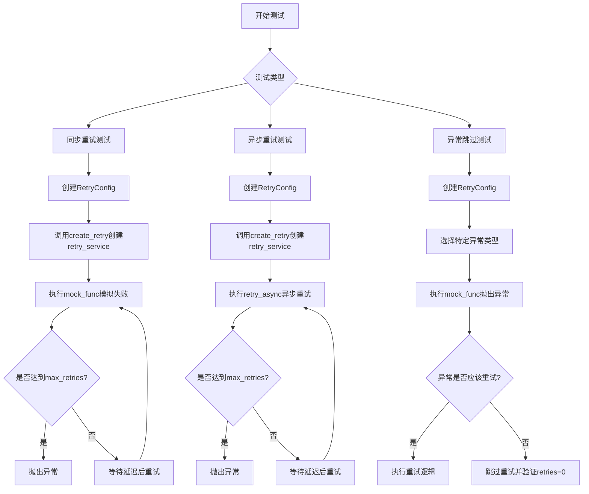
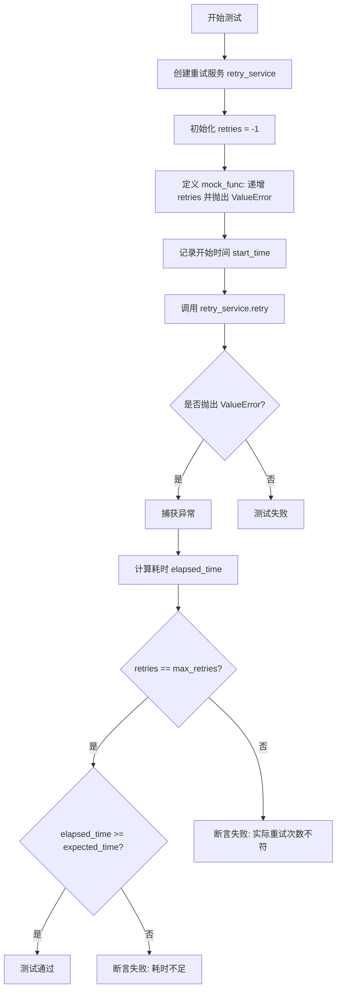
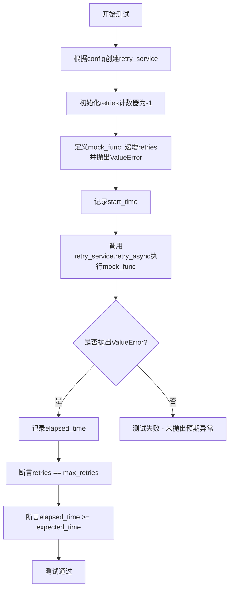
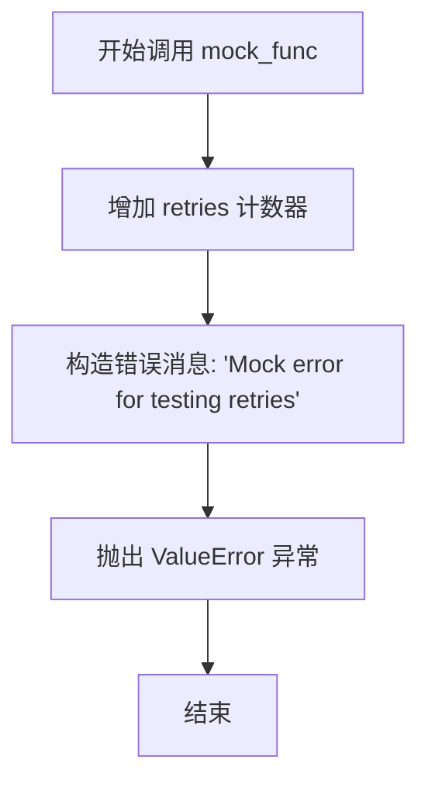

# `graphrag\tests\integration\language_model\test_retries.py` 详细设计文档

这是一个测试LiteLLM重试机制的单元测试文件，验证了指数退避(ExponentialBackoff)和立即重试(Immediate)两种策略的正确性，包括同步和异步方法，以及各种异常类型的跳过重试逻辑。

## 整体流程



## 类结构

```
测试模块 (test_retries.py)
├── 配置类 (由graphrag_llm.config提供)
│   ├── RetryConfig
│   └── RetryType
├── 重试服务 (由graphrag_llm.retry提供)
│   └── retry_service (通过create_retry创建)
└── 测试函数
    ├── test_retries (同步重试测试)
    ├── test_retries_async (异步重试测试)
    └── test_exponential_backoff_skipping_exceptions (异常跳过测试)
```

## 全局变量及字段


### `retries`
    
Counter to track the number of retry attempts, initialized to -1 because the first call is not considered a retry

类型：`int`
    


### `start_time`
    
Timestamp recorded before starting the retry operation

类型：`float`
    


### `elapsed_time`
    
Time duration between start_time and current time after retry operation completes

类型：`float`
    


### `msg`
    
Error message string used in mock functions to simulate failures

类型：`str`
    


### `mock_func`
    
Mock function that raises ValueError to simulate failures for testing retry logic

类型：`Callable`
    


### `exception_cls`
    
Exception class retrieved dynamically from litellm.exceptions module based on exception name string

类型：`Type[Exception]`
    


### `retry_service`
    
Retry service instance created by create_retry factory function using RetryConfig

类型：`Retry`
    


### `config`
    
Configuration object specifying retry strategy type, max_retries, base_delay, and jitter settings

类型：`RetryConfig`
    


### `max_retries`
    
Maximum number of retry attempts allowed before giving up

类型：`int`
    


### `expected_time`
    
Expected elapsed time in seconds for the retry operation to complete

类型：`float`
    


### `exception`
    
String name of the exception class to test against (e.g., 'BadRequestError', 'APIError')

类型：`str`
    


### `exception_args`
    
List of arguments to pass when instantiating the exception class for testing

类型：`list[Any]`
    


    

## 全局函数及方法


### `test_retries`

测试各种重试策略在不同配置下的行为，验证重试次数和总耗时是否符合预期。

参数：

- `config`：`RetryConfig`，重试策略的配置参数
- `max_retries`：`int`，期望的重试次数
- `expected_time`：`float`，期望的最小耗时（秒）

返回值：`None`，无返回值

#### 流程图



#### 带注释源码

```python
def test_retries(config: RetryConfig, max_retries: int, expected_time: float) -> None:
    """
    Test various retry strategies with various configurations.
    """
    # 根据配置创建重试服务实例
    retry_service = create_retry(config)

    # 初始化计数器为 -1，因为第一次调用不算重试
    retries = -1

    # 定义模拟函数，每次调用递增计数器并抛出异常
    def mock_func():
        nonlocal retries
        retries += 1
        msg = "Mock error for testing retries"
        raise ValueError(msg)

    # 记录测试开始时间
    start_time = time.time()
    
    # 执行重试并预期捕获 ValueError 异常
    with pytest.raises(ValueError, match="Mock error for testing retries"):
        retry_service.retry(func=mock_func, input_args={})
    
    # 计算总耗时
    elapsed_time = time.time() - start_time

    # 断言：验证实际重试次数是否符合预期
    assert retries == max_retries, f"Expected {max_retries} retries, got {retries}"
    
    # 断言：验证耗时是否满足最小要求（考虑重试间隔）
    assert elapsed_time >= expected_time, (
        f"Expected elapsed time >= {expected_time}, got {elapsed_time}"
    )
```


### `test_retries_async`

这是一个异步测试函数，用于测试重试策略在不同配置下的行为，包括验证最大重试次数是否正确以及重试过程中经过的时间是否符合预期（对于指数退避策略，应为各次延迟之和；对于立即重试，应为0）。

参数：

-  `config`：`RetryConfig`，重试配置对象，包含重试类型、最大重试次数、基础延迟等参数
-  `max_retries`：`int`，期望的最大重试次数
-  `expected_time`：`float`，期望经过的总时间（秒），用于验证重试延迟是否符合预期

返回值：`None`，测试函数无返回值，通过断言验证行为

#### 流程图



#### 带注释源码

```python
@pytest.mark.parametrize(
    ("config", "max_retries", "expected_time"),
    [
        (
            RetryConfig(
                type=RetryType.ExponentialBackoff,
                max_retries=3,
                base_delay=2.0,
                jitter=False,
            ),
            3,
            2 + 4 + 8,  # 指数退避无抖动，延迟分别为2、4、8秒
        ),
        (
            RetryConfig(
                type=RetryType.Immediate,
                max_retries=3,
            ),
            3,
            0,  # 立即重试，无延迟
        ),
    ],
)
async def test_retries_async(
    config: RetryConfig, max_retries: int, expected_time: float
) -> None:
    """
    Test various retry strategies with various configurations.
    测试各种重试策略在不同配置下的行为。
    """
    # 根据配置创建重试服务实例
    retry_service = create_retry(config)

    # 初始化计数器为-1，因为第一次调用不算重试
    retries = -1

    # 定义模拟函数，每次调用递增计数器并抛出错误
    def mock_func():
        nonlocal retries
        retries += 1
        msg = "Mock error for testing retries"
        raise ValueError(msg)

    # 记录测试开始时间
    start_time = time.time()
    
    # 执行异步重试，预期会抛出ValueError
    with pytest.raises(ValueError, match="Mock error for testing retries"):
        await retry_service.retry_async(func=mock_func, input_args={})
    
    # 计算总耗时
    elapsed_time = time.time() - start_time

    # 验证重试次数是否符合预期
    assert retries == max_retries, f"Expected {max_retries} retries, got {retries}"
    
    # 验证经过时间是否大于等于预期时间
    assert elapsed_time >= expected_time, (
        f"Expected elapsed time >= {expected_time}, got {elapsed_time}"
    )
```


### `test_exponential_backoff_skipping_exceptions`

测试在遇到特定异常（如 BadRequestError、UnsupportedParamsError 等）时，重试服务应该跳过重试，而不是进行重试。该函数通过模拟抛出各种 LiteLLM 异常，验证重试机制能正确识别并跳过不应重试的异常类型。

参数：

- `config`：`RetryConfig`，重试配置，包含重试类型、最大重试次数、基础延迟等参数
- `exception`：`str`，要测试的异常类名称（如 "BadRequestError"、"UnsupportedParamsError" 等）
- `exception_args`：`list[Any]`，用于构造异常实例的参数列表

返回值：`None`，测试函数无返回值

#### 流程图

```mermaid
flowchart TD
    A[开始测试] --> B[创建重试服务: create_retry config]
    B --> C[初始化重试计数器 retries = -1]
    C --> D[从 litellm.exceptions 获取异常类: exception_cls = exceptions.__dict__[exception]]
    D --> E[定义 mock_func: 递增 retries 并抛出异常]
    E --> F[调用 retry_service.retry func=mock_func input_args={}]
    F --> G{异常是否被抛出?}
    G -->|是| H[验证 retries == 0]
    H --> I[测试通过: 不应对此类异常进行重试]
    G -->|否| J[测试失败]
    I --> K[结束]
    J --> K
```

#### 带注释源码

```python
def test_exponential_backoff_skipping_exceptions(
    config: RetryConfig, exception: str, exception_args: list[Any]
) -> None:
    """
    Test skipping retries for exceptions that should not cause a retry.
    """
    # 根据配置创建重试服务实例
    retry_service = create_retry(config)

    # 初始化重试计数器为 -1，因为第一次调用不算重试
    retries = -1
    
    # 从 litellm.exceptions 模块动态获取异常类
    exception_cls = exceptions.__dict__[exception]

    # 定义模拟函数，每次调用递增重试计数并抛出指定异常
    def mock_func():
        nonlocal retries
        retries += 1
        raise exception_cls(*exception_args)

    # 执行重试逻辑，预期会抛出异常
    with pytest.raises(exception_cls, match="Oh no!"):
        retry_service.retry(func=mock_func, input_args={})

    # 验证重试次数为 0，确认对于该异常类型没有进行重试
    # 减去 1 是因为第一次调用不算重试
    assert retries == 0, (
        f"Expected not to retry for '{exception}' exception. Got {retries} retries."
    )
```


### `mock_func`

模拟函数，用于在测试重试机制时模拟失败的操作。该函数增加重试计数器并抛出 `ValueError` 异常，以测试重试逻辑是否正常工作。

参数：此函数无参数。

返回值：无返回值（该函数通过抛出异常来表示失败）。

#### 流程图



#### 带注释源码

```python
def mock_func():
    """
    模拟失败操作的函数，用于测试重试机制。
    
    每次调用时：
    1. 增加 retries 计数器（使用 nonlocal 关键字修改外部变量）
    2. 构造错误消息
    3. 抛出 ValueError 异常以模拟失败
    """
    nonlocal retries  # 允许修改外部函数作用域中的 retries 变量
    retries += 1     # 增加重试次数计数器
    msg = "Mock error for testing retries"  # 错误消息
    raise ValueError(msg)  # 抛出异常以模拟失败的操作
```

---

### 补充说明

#### 设计目标与约束
- **设计目标**：验证重试服务在不同重试策略（指数退避Immediate）下的行为是否符合预期
- **约束**：
  - `mock_func` 必须在测试函数内部定义，以便访问 `retries` 变量
  - 该函数故意抛出异常以模拟失败场景

#### 错误处理与异常设计
- `mock_func` 故意抛出 `ValueError` 异常，异常消息为 "Mock error for testing retries"
- 在 `test_exponential_backoff_skipping_exceptions` 测试中，会根据传入的 `exception_cls` 动态抛出不同的异常类型

#### 数据流与状态机
- **状态**：重试次数计数器 `retries`
- **初始状态**：`retries = -1`（因为第一次调用不算重试）
- **转换**：每次调用 `mock_func` 后，`retries` 加 1
- **终止条件**：达到最大重试次数或遇到不应重试的异常

#### 潜在的技术债务或优化空间
1. **代码重复**：`mock_func` 在多个测试函数中重复定义，可以提取为共享的 fixture
2. **测试覆盖**：可以增加更多边界情况的测试，如最大延迟限制、超时处理等
3. **异步测试**：当前的异步测试使用了 `retry_async`，但逻辑与同步版本相似，可以考虑合并测试逻辑

#### 外部依赖与接口契约
- 依赖 `pytest` 框架进行参数化测试
- 依赖 `retry_service` 对象（由 `create_retry` 创建）
- 依赖 `RetryConfig` 配置类定义重试策略

## 关键组件


### RetryConfig

用于配置重试策略的配置类，包含重试类型、最大重试次数、基础延迟和抖动开关等参数。

### RetryType

枚举类型，定义两种重试策略：ExponentialBackoff（指数退避）和 Immediate（立即重试）。

### create_retry

工厂函数，根据 RetryConfig 创建对应的重试服务实例。

### retry_service.retry

同步重试方法，执行带有重试逻辑的函数调用，支持指数退避和立即重试策略。

### retry_service.retry_async

异步重试方法，异步版本的重试服务，支持在异步上下文中执行重试逻辑。

### 异常类型映射

测试中使用的各种 LiteLLM 异常类型集合，包括 BadRequestError、UnsupportedParamsError、ContextWindowExceededError、ContentPolicyViolationError、ImageFetchError、InvalidRequestError、AuthenticationError、PermissionDeniedError、NotFoundError、UnprocessableEntityError、APIConnectionError、APIError、ServiceUnavailableError、APIResponseValidationError 和 BudgetExceededError。

### 测试参数化

使用 pytest.mark.parametrize 装饰器定义多组测试场景，验证不同重试配置和时间计算逻辑。


## 问题及建议


### 已知问题

-   **硬编码的魔法数字**：`retries = -1` 使用 `-1` 来表示第一次调用不是重试，但未添加注释解释该设计的意图，后续维护者可能难以理解
-   **代码重复**：同步测试 `test_retries` 和异步测试 `test_retries_async` 结构几乎完全相同，仅在调用方法上有区别（`retry` vs `retry_async`），违反了 DRY 原则
-   **脆弱的时间断言**：使用 `elapsed_time >= expected_time` 进行时间比较，精度较低，可能在不同负载的机器上产生不稳定结果
-   **动态异常类获取**：使用 `exceptions.__dict__[exception]` 动态获取异常类，这种方式缺乏类型安全性和 IDE 友好性
-   **httpx 模拟对象重复创建**：在多个异常测试中重复构造相同的 `httpx.Request` 和 `httpx.Response` 对象，可提取为 fixture
-   **缺少成功场景测试**：仅测试了重试失败的路径，未覆盖重试成功后正常返回的场景
-   **异常参数传递不清晰**：测试异常跳过时传入的 `exception_args` 列表中包含空字符串 `""` 和模拟的响应对象，参数意义不明确
-   **异步测试未使用异步 mock 函数**：异步测试中仍使用同步的 `mock_func`，未能真正验证异步调用路径的正确性
-   **测试参数冗余**：`RetryConfig` 对象在参数化测试中重复定义多次，可提取为共享 fixture

### 优化建议

-   为 `retries = -1` 添加明确注释，说明初始值为 -1 是因为首次调用不计入重试次数
-   将同步和异步的重试测试逻辑提取为通用辅助函数，减少代码重复
-   考虑使用 `pytest-timeout` 插件或放宽时间断言的范围，提高测试稳定性
-   使用 `getattr(exceptions, exception)` 替代字典访问方式，提高代码可读性
-   定义 pytest fixture 来集中管理 httpx 模拟对象的创建
-   添加重试成功后正常返回的测试用例，提高测试覆盖率
-   为 `exception_args` 使用具名参数或定义测试数据类，提高参数含义的可读性
-   在异步测试中使用 `async def mock_func()` 定义真正的异步 mock 函数
-   使用 `@pytest.fixture` 提取重复的 `RetryConfig` 配置对象，减少测试代码冗余

## 其它


### 设计目标与约束

本测试文件旨在验证重试机制（Retries）的正确性，确保在不同重试策略（指数退避、立即重试）下，系统能够正确处理重试次数和延迟时间。测试覆盖同步和异步两种重试方法，验证在遇到特定异常时是否进行重试。设计约束包括：重试策略必须遵循RetryConfig配置，延迟时间必须符合预期（指数退避为2+4+8秒，立即重试为0秒），并且对于特定异常不应进行重试。

### 错误处理与异常设计

测试文件覆盖了多种LiteLLM异常类的重试行为验证，包括：BadRequestError、UnsupportedParamsError、ContextWindowExceededError、ContentPolicyViolationError、ImageFetchError、InvalidRequestError、AuthenticationError、PermissionDeniedError、NotFoundError、UnprocessableEntityError、APIConnectionError、APIError、ServiceUnavailableError、APIResponseValidationError和BudgetExceededError。测试验证这些异常在重试服务中的行为是否符合预期，即某些异常应该被重试，而某些异常应该立即失败不进行重试。

### 数据流与状态机

重试服务的数据流如下：调用retry(func, input_args)或retry_async(func, input_args)方法 → 检查重试次数是否超过max_retries → 如果未超过则执行函数 → 如果函数抛出异常，根据异常类型决定是否进行重试 → 如果需要重试，根据重试策略（ExponentialBackoff或Immediate）计算延迟时间 → 等待延迟时间后重新执行函数。状态机包含三个状态：初始状态（未执行）、执行中状态（正在执行函数）、重试状态（等待延迟后重试）。

### 外部依赖与接口契约

本测试依赖以下外部组件：1) graphrag_llm.config中的RetryConfig和RetryType，用于配置重试策略；2) graphrag_llm.retry中的create_retry工厂函数，用于创建重试服务；3) litellm.exceptions中的各种异常类，用于测试异常处理；4) httpx库，用于构造模拟的HTTP响应对象。接口契约方面：create_retry接受RetryConfig参数并返回重试服务实例；重试服务必须提供retry和retry_async方法，接收func和input_args参数。

### 性能考虑

测试验证了重试机制的时序性能，确保指数退避策略的延迟时间精确符合预期（2秒、4秒、8秒），立即重试策略的延迟时间为0秒。测试使用time.time()测量实际执行时间，并与预期时间进行比较，验证性能是否符合设计要求。

### 安全性考虑

测试代码本身不涉及敏感数据的处理，但通过模拟各种认证错误（AuthenticationError）和权限错误（PermissionDeniedError）来验证重试服务对安全相关异常的处理逻辑。测试使用httpx.MockRequest对象构造安全的测试数据，不涉及真实的API调用。

### 配置管理

测试中的RetryConfig配置通过pytest.mark.parametrize进行参数化，包括两种重试类型（ExponentialBackoff和Immediate）、max_retries=3、base_delay=2.0、jitter=False等参数。这种配置方式允许灵活地测试不同的配置组合，确保重试服务能够正确处理各种配置场景。

### 测试覆盖率

测试覆盖了以下场景：1) 同步重试的指数退避策略；2) 同步重试的立即重试策略；3) 异步重试的指数退避策略；4) 异步重试的立即重试策略；5) 15种不同异常类型的重试行为验证。测试使用assert语句验证retries计数和elapsed_time，确保每个场景都被充分测试。

### 部署注意事项

本测试文件是开发阶段的单元测试，不直接参与生产环境部署。在部署包含重试机制的生产代码时，需要确保：1) RetryConfig的配置参数适合实际生产环境；2) 重试次数和延迟时间不会导致用户长时间等待；3) 异常处理逻辑符合业务需求。

### 监控和日志

测试代码本身不包含日志记录，但重试服务在实际运行中应记录重试事件，包括：重试次数、延迟时间、抛出的异常类型和消息。这些日志信息对于调试和生产环境监控重试行为非常重要。

### 版本兼容性

测试代码使用了Python的typing.Any类型注解，支持Python 3.8+。httpx库的使用需要与项目其他部分保持版本一致。litellm.exceptions的访问方式依赖于litellm库的版本，需要确保使用的litellm版本包含所有测试中引用的异常类。

### 许可证和法律

文件头部包含MIT许可证声明：Copyright (c) 2024 Microsoft Corporation, Licensed under the MIT License。这表明该代码可以自由使用、修改和分发，只需保留许可证声明。

### 文档和维护

测试代码包含详细的文档字符串，说明每个测试函数的用途。测试覆盖了主要的重试场景，但由于测试环境与实际生产环境可能存在差异，建议在实际使用中持续监控重试行为，并根据实际情况调整RetryConfig配置。代码维护者应确保litellm.exceptions中的异常类与测试中引用的类保持一致。


    