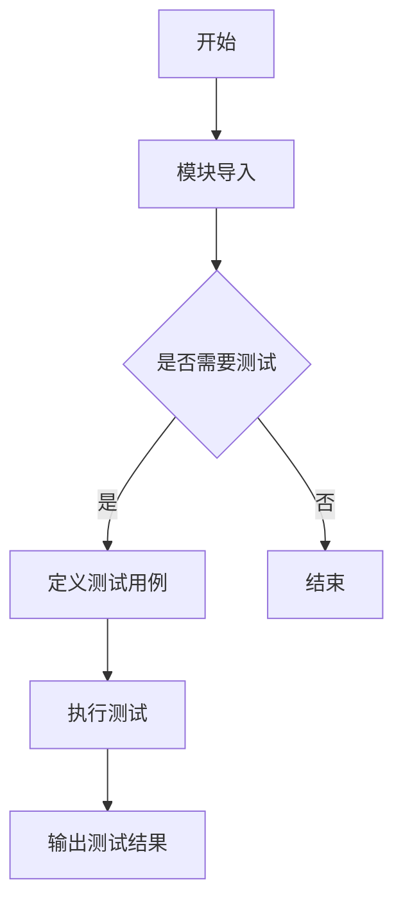

# `graphrag\tests\integration\logging\__init__.py` 详细设计文档

这是一个用于logger模块的测试文件模板，仅包含版权声明和模块文档字符串，尚未实现具体的测试用例。

## 整体流程



## 类结构

```
无类结构（这是一个测试模块文件）
```

## 全局变量及字段


    

## 全局函数及方法


## 关键组件


### 模块文件 (Test File)

这是一个测试文件的元信息头部，仅包含版权声明和模块文档字符串，无实际实现代码。

### 版权与许可证信息

- **组件名称**: 版权与许可证声明
- **描述**: 该文件受 MIT 许可证保护，版权归属 Microsoft Corporation (2024)

### 潜在问题

- **代码不完整**: 提供的源代码仅包含文件头和文档字符串，没有实际的实现代码（如类、函数、变量等）
- **无法分析关键组件**: 由于缺少实际代码，无法识别张量索引、惰性加载、反量化支持、量化策略等关键组件
- **建议**: 请提供完整的源代码以便进行详细的设计分析和文档生成


## 问题及建议


### 已知问题

-   代码文件仅包含版权声明和模块文档字符串，缺乏实际的测试用例实现
-   文件名暗示为 logger 模块的测试文件，但未包含任何针对 logger 功能的测试代码
-   无法验证 logger 模块的功能正确性和边界条件处理

### 优化建议

-   补充完整的测试用例，覆盖 logger 模块的核心功能，包括日志级别设置、日志格式化、输出目标等
-   添加边界条件测试，如空输入、异常输入、并发写入等场景
-   考虑添加性能基准测试，评估 logger 在高并发或大量日志场景下的表现
-   增加测试覆盖率报告，确保关键代码路径均被测试覆盖


## 其它


### 设计目标与约束

本文档旨在为日志模块的测试代码提供完整的设计说明。设计目标包括：确保日志功能在不同场景下的正确性、验证日志输出的格式和内容符合规范、测试日志记录的性能表现。约束条件包括：测试代码需遵循项目统一的代码风格、使用pytest框架编写测试用例、测试需覆盖正常路径和异常路径。

### 错误处理与异常设计

测试代码应验证日志模块在异常情况下的行为，包括：日志写入失败时的异常捕获和处理、日志缓冲区满时的降级策略、无权限写入日志文件时的错误反馈。测试用例应模拟文件IO错误、磁盘空间不足、路径不存在等异常场景，确保日志模块的健壮性。

### 数据流与状态机

日志模块的数据流包括：日志输入（应用代码调用日志接口）→日志格式化（转换为指定格式）→日志输出（写入文件/控制台/远程服务）。状态机涉及日志模块的初始化状态、就绪状态、运行状态和异常状态之间的转换。测试需验证各状态转换的正确性和状态保持能力。

### 外部依赖与接口契约

日志模块依赖的外部组件包括：Python标准库logging模块、文件系统IO接口、可选的远程日志服务（如需要）。接口契约规定：日志记录方法接受指定格式的参数、返回布尔值表示写入成功与否、异常情况下抛出统一类型的异常。测试需验证与这些外部依赖的交互是否符合契约约定。

### 性能要求与指标

日志模块的性能指标包括：日志写入延迟（同步模式不超过10ms）、内存占用（单实例不超过50MB）、并发写入支持（至少支持100个并发线程）。测试需包含性能基准测试，验证在高频日志场景下的表现。

### 安全考虑

日志模块需处理敏感信息的脱敏、防止日志注入攻击、确保日志文件的访问权限控制。测试需验证：敏感信息（如密码、token）不会被记录到日志中、恶意输入不会导致日志解析异常、日志文件权限设置正确。

### 兼容性设计

日志模块需兼容Python 3.8+版本、支持主流操作系统（Windows/Linux/macOS）、保持与现有日志格式的向后兼容。测试需在多版本Python和多平台上执行，确保跨平台兼容性。

### 配置管理

日志模块的配置项包括：日志级别（DEBUG/INFO/WARNING/ERROR/CRITICAL）、输出格式、输出目标（文件/控制台/远程）、日志轮转策略。测试需覆盖各种配置组合，验证配置生效的正确性。

### 资源管理

日志模块需正确管理文件句柄、内存缓冲、网络连接等资源。测试需验证：长时间运行不会导致资源泄漏、程序退出时资源正确释放、资源使用达到上限时的优雅降级。

### 测试策略

测试策略包括：单元测试（覆盖日志模块的核心功能）、集成测试（验证与其他模块的交互）、端到端测试（验证完整日志流程）、性能测试（验证性能指标）、回归测试（防止功能退化）。

### 部署与运维注意事项

部署时需注意：日志目录的创建和权限设置、日志文件的轮转和清理策略、日志级别的生产环境配置。运维需关注：日志大小的监控、日志写入异常的告警、日志分析工具的配置。

### 监控与可观测性

日志模块需提供可观测性支持，包括：关键操作的埋点指标、日志写入成功率的监控、异常发生时的追踪信息。测试需验证监控指标的正确性和完整性。

### 国际化与本地化

日志模块需支持多语言日志消息、时间戳的本地化格式、错误消息的国际化。测试需验证不同语言环境下的日志输出正确性。

### 版本兼容性

日志模块需保持API的向后兼容、记录版本变更历史、提供迁移指南。测试需验证新旧版本接口的兼容性。


    