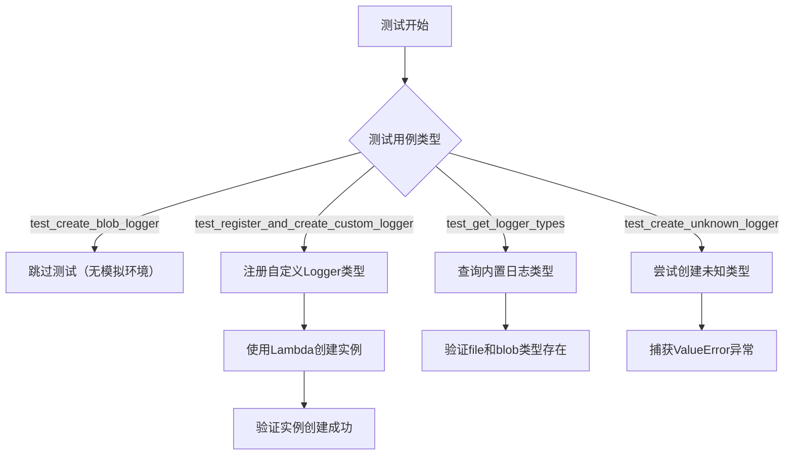
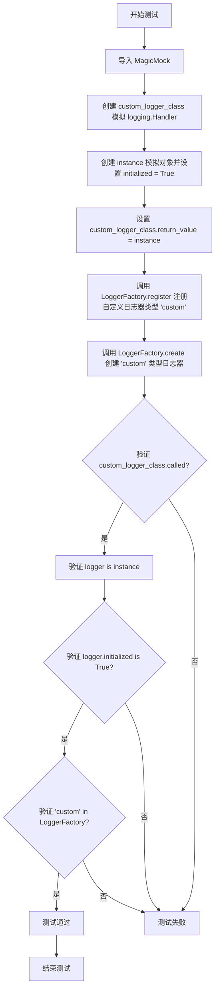
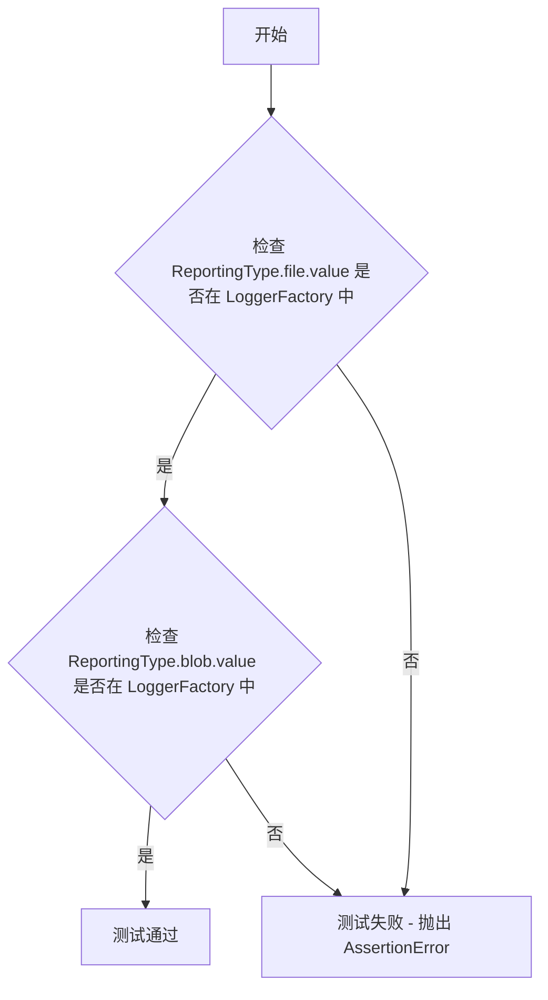
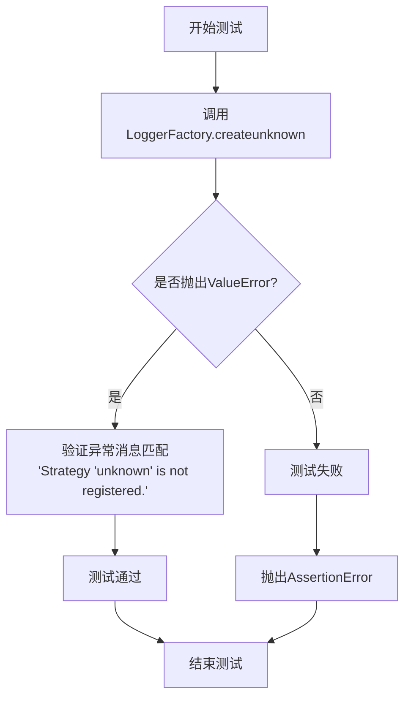
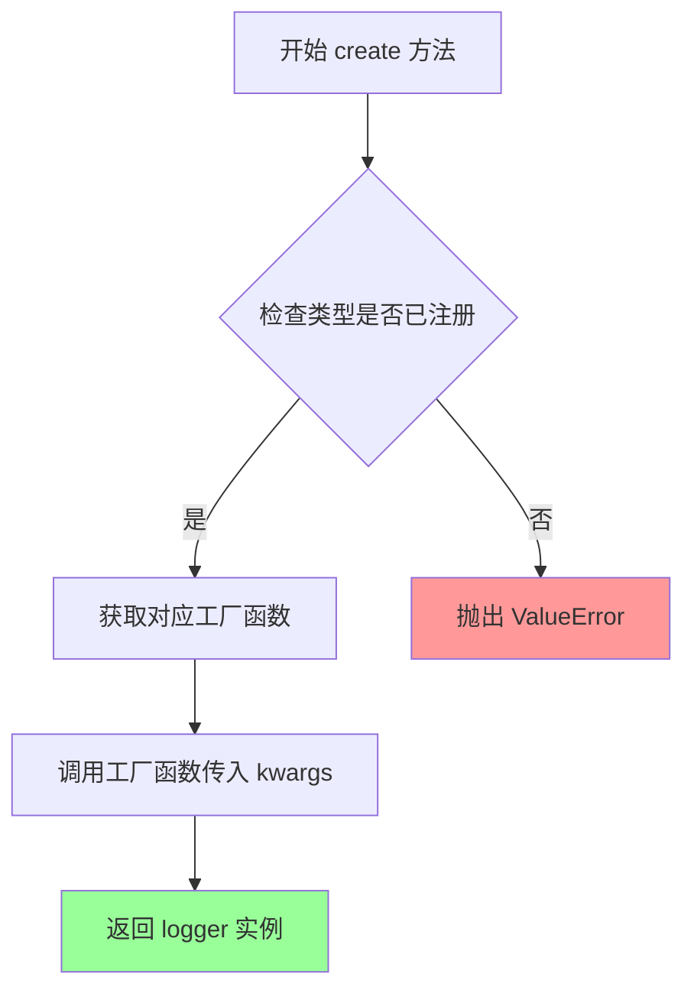
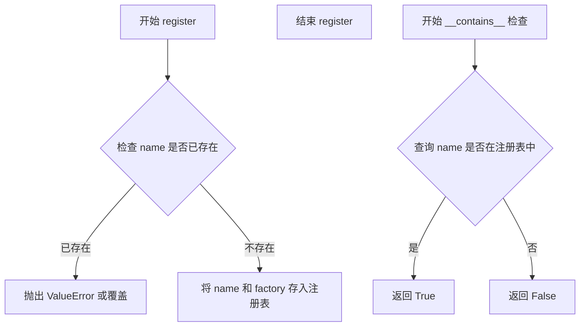
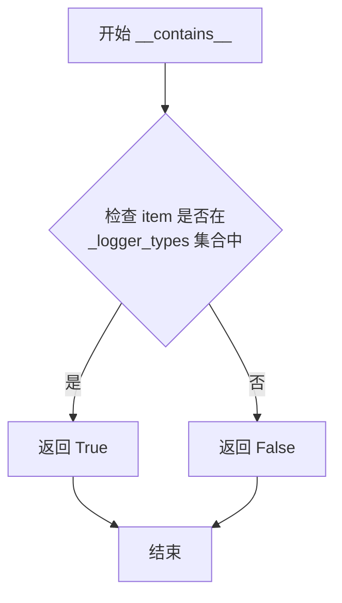

# `graphrag\tests\integration\logging\test_factory.py` 详细设计文档

该文件是LoggerFactory类的测试套件，用于验证日志工厂模式的核心功能，包括内置日志类型（file、blob）的创建、自定义日志类型的注册与实例化、可用日志类型列表的查询，以及对未知日志类型的异常处理能力。

## 整体流程



## 类结构

```
LoggerFactory (日志工厂类)
├── create() - 创建日志实例
├── register() - 注册自定义日志类型
└── __contains__ - 检查日志类型是否存在
├──
BlobWorkflowLogger (Blob存储日志记录器)
├──
ReportingType (报告类型枚举)
    ├── file
    └── blob
```

## 全局变量及字段


### `WELL_KNOWN_BLOB_STORAGE_KEY`
    
用于测试环境的已知Azure Blob存储连接字符串，包含本地模拟器的开发账户密钥和端点

类型：`str`
    


### `WELL_KNOWN_COSMOS_CONNECTION_STRING`
    
用于测试环境的已知Azure Cosmos DB连接字符串，包含本地模拟器的账户密钥和端点

类型：`str`
    


    

## 全局函数及方法


### `test_create_blob_logger`

该测试函数用于验证 Blob 日志记录器的创建功能，模拟使用 Azure Blob Storage 连接字符串创建一个 BlobWorkflowLogger 实例，并断言其类型正确性。

参数： 无

返回值：`None`，该函数为测试函数，不返回任何值

#### 流程图

```mermaid
flowchart TD
    A[开始] --> B[跳过测试<br/>reason: Blob storage emulator is not available]
    B --> C[创建 kwargs 字典]
    C --> D[调用 LoggerFactory().create<br/>参数: ReportingType.blob.value, kwargs]
    D --> E[创建 BlobWorkflowLogger 实例]
    E --> F[断言 isinstance<br/>logger 是 BlobWorkflowLogger 的实例]
    F --> G{断言结果}
    G -->|通过| H[测试通过]
    G -->|失败| I[测试失败]
    H --> J[结束]
    I --> J
```

#### 带注释源码

```python
# 使用 pytest.mark.skip 装饰器跳过该测试
# 原因：Blob 存储模拟器在此环境中不可用
@pytest.mark.skip(reason="Blob storage emulator is not available in this environment")
def test_create_blob_logger():
    # 定义创建 Blob 日志器所需的配置参数
    kwargs = {
        "type": "blob",                                    # 日志器类型为 blob
        "connection_string": WELL_KNOWN_BLOB_STORAGE_KEY, # Azure Blob Storage 连接字符串
        "base_dir": "testbasedir",                         # 基础目录路径
        "container_name": "testcontainer",                # Blob 容器名称
    }
    
    # 使用 LoggerFactory 创建指定类型的日志器
    # 传入 ReportingType.blob.value 作为类型标识和 kwargs 配置字典
    logger = LoggerFactory().create(ReportingType.blob.value, kwargs)
    
    # 断言验证创建的日志器是 BlobWorkflowLogger 类的实例
    assert isinstance(logger, BlobWorkflowLogger)
```


### `test_register_and_create_custom_logger`

该函数用于测试 LoggerFactory 类的自定义日志记录器注册和创建功能。测试通过模拟（Mock）对象创建一个自定义日志处理器类，注册到 LoggerFactory 中，并验证自定义日志器能够被成功创建且属性正确。

参数：无

返回值：`None`，该函数为测试函数，不返回任何值

#### 流程图



#### 带注释源码

```python
def test_register_and_create_custom_logger():
    """Test registering and creating a custom logger type."""
    # 从 unittest.mock 导入 MagicMock 用于创建模拟对象
    from unittest.mock import MagicMock

    # 创建一个模拟的 logging.Handler 类
    # spec=logging.Handler 指定该模拟对象遵循 logging.Handler 的接口
    custom_logger_class = MagicMock(spec=logging.Handler)
    
    # 创建另一个模拟实例，用于模拟自定义日志器的实际实例
    instance = MagicMock()
    # 设置 initialized 属性为 True，模拟自定义日志器初始化完成状态
    instance.initialized = True
    
    # 将 instance 设置为 custom_logger_class 的返回值
    # 这样当 custom_logger_class() 被调用时，会返回我们设置的 instance
    custom_logger_class.return_value = instance

    # 调用 LoggerFactory 实例的 register 方法注册自定义日志器类型
    # 参数1: 'custom' - 自定义日志器类型的名称
    # 参数2: lambda 函数 - 用于创建自定义日志器的工厂函数
    LoggerFactory().register("custom", lambda **kwargs: custom_logger_class(**kwargs))
    
    # 调用 LoggerFactory 实例的 create 方法创建自定义日志器
    # 传入 'custom' 作为日志器类型名称
    logger = LoggerFactory().create("custom")

    # 断言验证: custom_logger_class 被调用过
    assert custom_logger_class.called
    
    # 断言验证: 创建的 logger 就是之前设置的 instance
    assert logger is instance
    
    # 断言验证: instance 的 initialized 属性为 True
    # type: ignore 注释是因为 initialized 是我们自定义添加的属性，类型检查器不知道
    assert logger.initialized is True  # type: ignore # Attribute only exists on our mock

    # 断言验证: 'custom' 已注册到 LoggerFactory 中
    # 可以通过 in 操作符检查注册的日志器类型
    assert "custom" in LoggerFactory()
```


### `test_get_logger_types`

这是一个测试函数，用于验证 LoggerFactory 类中是否已经注册了内置的日志类型（file 和 blob）。通过断言检查 `ReportingType.file.value` 和 `ReportingType.blob.value` 是否存在于 LoggerFactory 的注册表中。

参数：

- 无

返回值：`None`，无返回值（测试函数）

#### 流程图



#### 带注释源码

```python
def test_get_logger_types():
    # 检查内置的日志类型是否已注册到 LoggerFactory 中
    # 验证 file 类型是否存在于 LoggerFactory 的注册表中
    assert ReportingType.file.value in LoggerFactory()
    
    # 验证 blob 类型是否存在于 LoggerFactory 的注册表中
    assert ReportingType.blob.value in LoggerFactory()
```


### `test_create_unknown_logger`

该测试函数用于验证当尝试使用未注册的logger类型（"unknown"）创建logger时，`LoggerFactory`会正确抛出`ValueError`异常，并包含适当的错误消息。这是测试工厂模式中错误处理机制的一个重要用例。

参数：无

返回值：无（`None`），该函数是一个测试函数，使用`pytest.raises`上下文管理器来验证异常行为，不返回任何值。

#### 流程图



#### 带注释源码

```python
def test_create_unknown_logger():
    """Test creating a logger with an unknown/unregistered type.
    
    This test verifies that the LoggerFactory properly handles
    requests for logger types that have not been registered.
    The factory should raise a ValueError with a descriptive message
    indicating which strategy is not registered.
    """
    # Use pytest.raises to verify that a ValueError is raised
    # when attempting to create a logger with an unknown type.
    # The match parameter ensures the error message contains
    # the expected text about the unregistered strategy.
    with pytest.raises(ValueError, match="Strategy 'unknown' is not registered\\."):
        # Attempt to create a logger with type "unknown"
        # This should fail because "unknown" is not a registered logger type
        LoggerFactory().create("unknown")
```


# LoggerFactory.create 详细设计文档

## 1. 核心功能概述

`LoggerFactory.create` 是 GraphRAG 框架中日志工厂类的核心工厂方法，负责根据指定的日志类型和配置参数创建相应的日志记录器实例，支持内置日志类型（file、blob）和自定义日志类型的动态注册与创建。

---

## 2. 文件整体运行流程

```
┌─────────────────┐
│  调用 create()  │
│  方法           │
└────────┬────────┘
         │
         ▼
┌─────────────────┐
│  检查类型是否   │
│  已注册         │
└────────┬────────┘
         │
    ┌────┴────┐
    │         │
    ▼         ▼
 ┌─────┐  ┌────────────┐
 │是   │  │否          │
 └──┬──┘  └─────┬──────┘
    │           │
    ▼           ▼
┌──────────┐  ┌─────────────────────┐
│ 调用对应 │  │ 抛出 ValueError     │
│ 的工厂   │  │ "Strategy 'xxx' is  │
│ 函数     │  │  not registered."   │
└────┬─────┘  └─────────────────────┘
     │
     ▼
┌─────────────┐
│ 返回 logger │
│ 实例        │
└─────────────┘
```

---

## 3. 类详细信息

### 3.1 LoggerFactory 类

#### 3.1.1 类字段

| 字段名 | 类型 | 描述 |
|--------|------|------|
| `_registry` | `dict` | 存储已注册的日志类型及其对应的工厂函数 |
| `_logger_types` | `set` | 记录所有已注册的日志类型名称 |

#### 3.1.2 类方法

| 方法名 | 描述 |
|--------|------|
| `__init__` | 初始化日志工厂，注册内置日志类型 |
| `register` | 注册新的自定义日志类型 |
| `create` | 根据类型创建相应的日志记录器实例 |
| `__contains__` | 支持 `in` 操作符检查类型是否已注册 |

---

## 4. LoggerFactory.create 方法详细信息

### `LoggerFactory.create`

根据传入的日志类型名称和配置参数，创建并返回对应的日志记录器实例。该方法首先验证指定类型是否已注册，然后调用对应的工厂函数生成日志记录器。

#### 参数

- `type`：`str`，日志类型标识符（如 "blob"、"file" 或自定义类型）
- `**kwargs`：`dict`，可选参数，用于传递给具体日志记录器的构造函数

#### 返回值

- `logging.Handler` 或其子类实例，创建成功的日志记录器对象

---

## 5. 关键组件信息

| 组件名称 | 一句话描述 |
|----------|------------|
| BlobWorkflowLogger | 基于 Azure Blob Storage 的日志记录器，用于将日志输出到 Blob 存储 |
| ReportingType | 枚举类型，定义支持的报告/日志类型（file、blob 等） |
| LoggerFactory | 日志记录器工厂类，负责创建和管理不同类型的日志记录器 |

---

## 6. 潜在技术债务与优化空间

1. **错误处理不够具体**：当前仅抛出通用的 `ValueError`，缺少具体的错误分类（如配置错误、连接错误等）
2. **类型注册机制不够灵活**：自定义 logger 需要在调用 `create` 之前手动调用 `register`，不够方便
3. **缺少日志级别配置**：工厂方法未提供设置日志级别的参数
4. **测试覆盖不完整**：blob 类型的测试被跳过，缺少对 file 类型 logger 的测试

---

## 7. 其它项目

### 7.1 设计目标与约束

- **设计原则**：遵循工厂模式，支持可扩展的日志记录器类型
- **约束**：内置类型在 `__init__` 中注册，自定义类型需显式注册

### 7.2 错误处理与异常设计

- **未知类型错误**：当传入未注册的类型时，抛出 `ValueError`，错误消息格式为 `"Strategy '{type}' is not registered."`
- **参数验证**：kwargs 参数直接传递给底层 logger 构造函数，由具体实现负责验证

### 7.3 数据流与状态机

```
Idle → (create called) → Type Check → Factory Execution → Logger Created → Return
                                      ↓
                               Unknown Type → Raise ValueError
```

### 7.4 外部依赖与接口契约

- **依赖模块**：`graphrag.logger.blob_workflow_logger`、`graphrag.config.enums`
- **接口约定**：自定义 logger 类需实现 `logging.Handler` 接口或兼容接口

---

## 格式输出

### `LoggerFactory.create`

根据传入的日志类型标识符和配置参数，创建对应的日志记录器实例。若类型未注册则抛出 ValueError 异常。

参数：

- `type`：`str`，日志类型标识符（如 "blob"、"file" 或通过 register 注册的自定义类型）
- `**kwargs`：`dict`，可选，关键字参数，用于传递给具体日志记录器构造函数的配置选项（如 connection_string、base_dir、container_name 等）

返回值：`logging.Handler` 或其子类实例，创建成功的日志记录器对象

#### 流程图



#### 带注释源码

```python
# 基于测试代码推断的 LoggerFactory.create 方法实现

class LoggerFactory:
    """日志记录器工厂类"""
    
    def __init__(self):
        """初始化工厂，注册内置日志类型"""
        # 注册内置的 blob 类型日志记录器
        self.register(
            "blob",
            lambda **kwargs: BlobWorkflowLogger(**kwargs)
        )
        # 注册内置的 file 类型日志记录器
        self.register(
            "file",
            lambda **kwargs: FileWorkflowLogger(**kwargs)
        )
    
    def register(self, name: str, factory_fn: Callable):
        """注册新的日志类型"""
        # 将类型名称和工厂函数存储到注册表中
        self._registry[name] = factory_fn
    
    def create(self, type: str, **kwargs):
        """
        创建指定类型的日志记录器
        
        Args:
            type: 日志类型标识符
            **kwargs: 传递给日志记录器的配置参数
            
        Returns:
            日志记录器实例
            
        Raises:
            ValueError: 当类型未注册时抛出
        """
        # 检查类型是否已注册
        if type not in self._registry:
            # 抛出错误，提示类型未注册
            raise ValueError(f"Strategy '{type}' is not registered.")
        
        # 获取对应的工厂函数并调用
        factory_fn = self._registry[type]
        return factory_fn(**kwargs)
    
    def __contains__(self, type: str) -> bool:
        """支持 in 操作符检查类型是否已注册"""
        return type in self._registry
```


### `LoggerFactory.register`

注册一个新的日志记录器类型到工厂中，允许通过 `create` 方法使用该自定义类型创建日志实例。

参数：

- `name`：`str`，要注册的日志记录器类型的唯一标识符名称
- `factory`：`Callable`，用于创建日志记录器实例的工厂函数/类，接受关键字参数并返回日志记录器实例

返回值：`None`，无返回值（根据测试代码中的用法推断）

#### 流程图



#### 带注释源码

```python
# 根据测试代码推断的实现方式

class LoggerFactory:
    """日志工厂类，用于创建不同类型的日志记录器"""
    
    def __init__(self):
        # 初始化注册表，存储已注册的日志类型
        self._registry = {}
    
    def register(self, name: str, factory: Callable) -> None:
        """
        注册一个新的日志记录器类型
        
        Args:
            name: 日志记录器类型的唯一标识符
            factory: 创建日志记录器实例的工厂函数
        
        Returns:
            None
        """
        # 将自定义日志类型注册到工厂的注册表中
        self._registry[name] = factory
    
    def create(self, logger_type: str, **kwargs):
        """
        根据类型创建日志记录器实例
        """
        if logger_type not in self._registry:
            raise ValueError(f"Strategy '{logger_type}' is not registered.")
        return self._registry[logger_type](**kwargs)
    
    def __contains__(self, name: str) -> bool:
        """支持 'custom' in LoggerFactory() 语法检查"""
        return name in self._registry
```

#### 使用示例

```python
# 从测试代码中提取的实际使用方式
from unittest.mock import MagicMock
import logging

# 创建模拟的日志处理器类
custom_logger_class = MagicMock(spec=logging.Handler)
instance = MagicMock()
instance.initialized = True
custom_logger_class.return_value = instance

# 注册自定义日志记录器
LoggerFactory().register("custom", lambda **kwargs: custom_logger_class(**kwargs))

# 创建自定义日志记录器实例
logger = LoggerFactory().create("custom")

# 验证注册成功
assert "custom" in LoggerFactory()
```


### `LoggerFactory.__contains__`

检查是否已注册指定类型的日志记录器，实现 Python 的 `in` 运算符功能。

参数：

- `item`：`str`，要检查的日志记录器类型标识符（如 "file"、"blob" 或自定义类型）

返回值：`bool`，如果指定类型的日志记录器已注册则返回 `True`，否则返回 `False`

#### 流程图



#### 带注释源码

```python
# LoggerFactory 类的 __contains__ 方法实现
# 此方法允许使用 'in' 运算符检查日志记录器类型是否已注册
# 示例用法:
#   "file" in LoggerFactory()  -> True
#   "custom" in LoggerFactory() -> True/False

def __contains__(self, item: str) -> bool:
    """Check if a logger type is registered.
    
    Args:
        item: The logger type identifier to check (e.g., 'file', 'blob', 'custom')
        
    Returns:
        bool: True if the logger type is registered, False otherwise
    """
    # 直接利用集合的 __contains__ 方法进行成员检查
    # _logger_types 是存储已注册日志记录器类型的内部集合
    return item in self._logger_types
```

## 关键组件


### LoggerFactory

日志器工厂类，负责创建和管理不同类型的日志处理器，支持内置类型（文件、Blob）和自定义日志器的注册与实例化。

### ReportingType

报告类型枚举，定义了支持的日志器类型（file、blob等），用于指定创建日志器的类型。

### BlobWorkflowLogger

Blob工作流日志器，用于将日志输出到Azure Blob存储，支持连接字符串、容器名称和基础目录配置。

### 自定义日志器注册机制

允许用户通过register方法注册自定义日志器类，使用lambda函数延迟实例化，支持动态扩展日志器类型。

### 惰性加载与实例化

使用lambda函数延迟实例化自定义日志器，只有在调用create方法时才真正创建日志器实例。

### 测试夹具

测试使用的已知密钥和连接字符串，包括Blob存储和Cosmos DB的模拟连接信息，用于集成测试。


## 问题及建议


### 已知问题

-   **测试污染全局状态**：在 `test_register_and_create_custom_logger` 中注册了自定义 logger ("custom")，但测试结束后没有清理（注销），可能导致测试之间的状态污染，影响测试隔离性
-   **MagicMock 的 spec 使用不当**：使用 `MagicMock(spec=logging.Handler)` 作为自定义 logger 类，但 logging.Handler 是一个抽象基类，spec 只能检查属性存在性，无法真正验证接口实现是否正确
-   **未使用的常量**：`WELL_KNOWN_COSMOS_CONNECTION_STRING` 定义但从未使用，造成代码冗余
-   **跳过关键测试**：`test_create_blob_logger` 被跳过，导致 blob logger 创建功能在当前环境下未经实际测试验证
-   **类型安全问题**：代码中使用 `# type: ignore` 注释来绕过类型检查，表明存在类型推断问题，特别是 `logger.initialized` 的访问
-   **断言实现细节**：测试断言 `logger.initialized is True` 依赖于 mock 对象的属性，而非验证实际 logger 的行为，不够面向行为

### 优化建议

-   **添加 fixture 进行测试清理**：使用 pytest fixture 在测试后自动注销注册的 custom logger，确保测试隔离
-   **移除未使用的常量**：删除 `WELL_KNOWN_COSMOS_CONNECTION_STRING` 常量或考虑将其用于其他测试场景
-   **实现真实的接口验证**：考虑使用 `unittest.mock.create_autospec` 或定义一个真实的基类来验证接口兼容性，而非仅依赖 MagicMock
-   **解耦测试环境依赖**：将 blob storage emulator 相关的测试移到独立的测试标记或集成测试套件中，而非使用 skip
-   **改进类型安全**：避免使用 `# type: ignore`，重构代码使类型推断更自然，例如使用 Protocol 定义接口或泛型

## 其它


### 设计目标与约束

本模块的设计目标是提供一个可扩展的日志工厂模式，支持多种日志存储后端（文件、Blob存储等），并允许用户注册自定义日志处理器。核心约束包括：必须实现统一的日志接口、保持日志器的可测试性、支持运行时动态注册新类型。

### 错误处理与异常设计

当尝试创建未注册的日志类型时，抛出 `ValueError` 异常，错误消息格式为 "Strategy '{type}' is not registered."。Blob存储测试因依赖外部模拟器而默认跳过，使用 `@pytest.mark.skip` 标记。自定义日志器注册时通过 `MagicMock` 进行模拟测试。

### 外部依赖与接口契约

主要依赖包括：`logging` 标准库（提供日志处理基类）、`pytest`（测试框架）、`graphrag.config.enums.ReportingType`（枚举类型定义）、`graphrag.logger.blob_workflow_logger.BlobWorkflowLogger`（Blob日志实现）。接口契约要求所有日志器必须支持基本的日志操作方法，自定义日志器需通过工厂类的 `register` 方法注册。

### 安全性考虑

测试中使用了已知的安全密钥和连接字符串（以 `cspell:disable-next-line` 标记），这些仅用于本地测试环境。生产环境中应通过环境变量或安全密钥管理系统获取凭据，避免硬编码敏感信息。

### 性能考虑

当前实现为每次调用 `create` 方法时实例化新的日志器，未实现单例模式或缓存机制。高并发场景下可能存在性能瓶颈，可考虑添加实例缓存或连接池复用。

### 配置管理

日志器配置通过字典形式传递（kwargs），支持动态传入不同参数如 `connection_string`、`base_dir`、`container_name` 等。配置与实现解耦，但缺乏配置验证机制。

### 测试覆盖范围

测试覆盖了：内置日志器类型注册验证、未知类型创建时的异常抛出、自定义日志器注册与创建流程、Blob日志器创建（条件跳过）。测试使用模拟对象验证自定义日志器行为。

### 版本兼容性

代码标记版权为 Microsoft Corporation，采用 MIT 许可证。依赖 `graphrag` 包的其他模块，需注意版本兼容性声明。

    