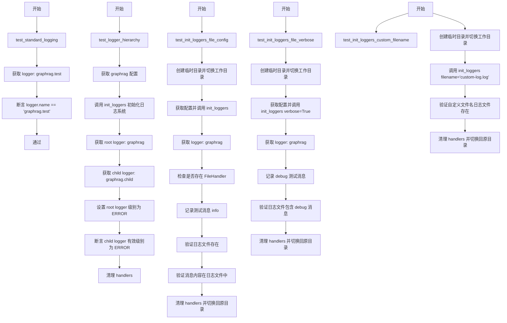
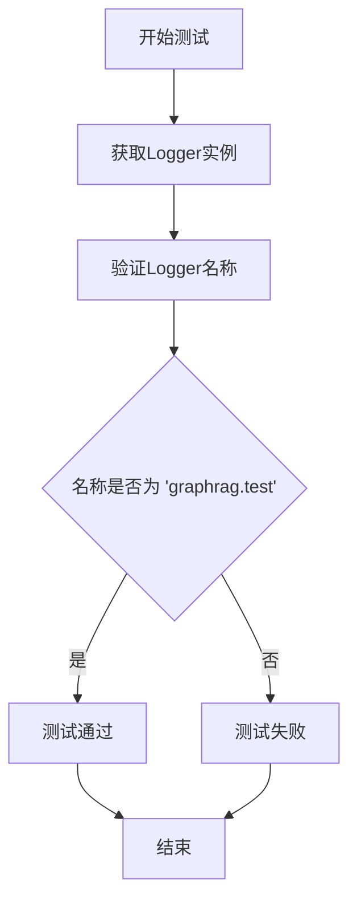
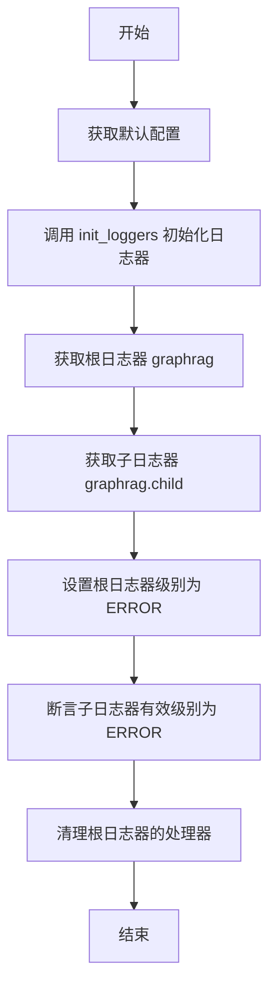
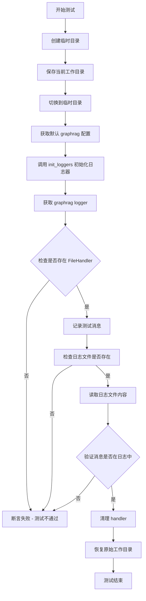
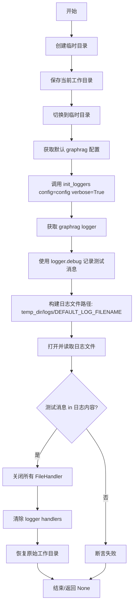
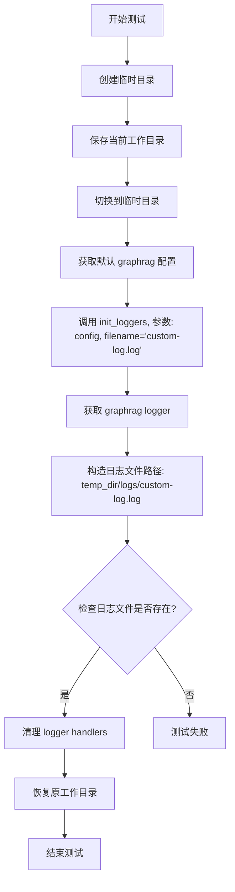
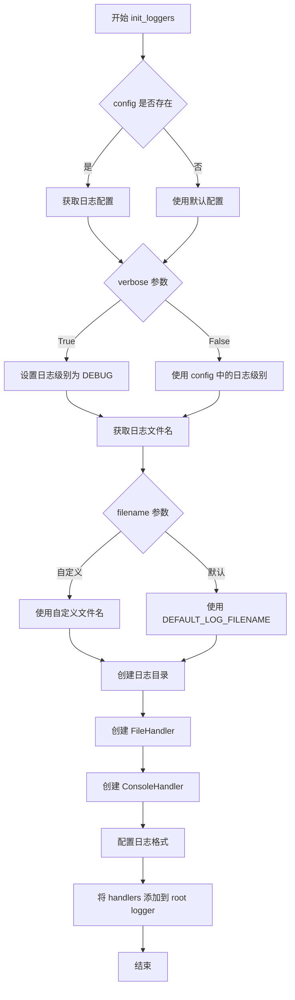
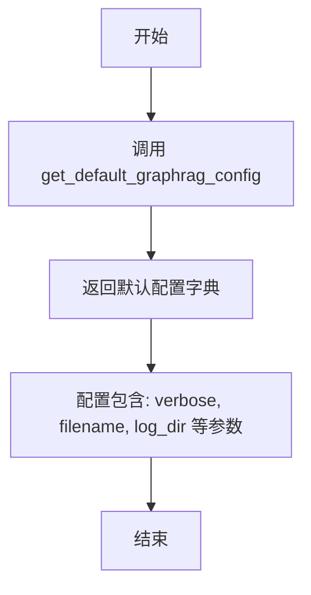

# `graphrag\tests\integration\logging\test_standard_logging.py` 详细设计文档

这是一个针对 graphrag 项目标准日志功能的单元测试文件，验证日志记录器的初始化、层级关系、文件配置、详细模式以及自定义文件名等功能是否正常工作。

## 整体流程



## 类结构

```
test_standard_logging.py (测试模块)
├── test_standard_logging (基本日志获取测试)
├── test_logger_hierarchy (日志层级测试)
├── test_init_loggers_file_config (文件配置测试)
├── test_init_loggers_file_verbose (详细模式测试)
└── test_init_loggers_custom_filename (自定义文件名测试)
```

## 全局变量及字段


### `DEFAULT_LOG_FILENAME`
    
从 graphrag.logger.standard_logging 导入的默认日志文件名常量

类型：`str`
    


### `temp_dir`
    
临时目录上下文管理器，用于创建和自动清理临时测试目录

类型：`tempfile.TemporaryDirectory`
    


### `cwd`
    
原始工作目录路径，测试完成后需切换回该目录

类型：`Path`
    


### `config`
    
graphrag 配置对象，包含日志初始化所需的配置参数

类型：`GraphRagConfig`
    


### `logger`
    
日志记录器实例，用于记录测试日志和验证日志功能

类型：`logging.Logger`
    


### `file_handlers`
    
日志记录器的文件处理器列表，用于筛选和验证文件日志是否正确配置

类型：`list[logging.FileHandler]`
    


### `test_message`
    
测试消息字符串，用于验证日志记录功能是否正常工作

类型：`str`
    


### `log_file`
    
日志文件路径对象，指向实际写入的日志文件位置

类型：`Path`
    


    

## 全局函数及方法


### `test_standard_logging`

验证标准日志功能是否正常工作，通过获取名为"graphrag.test"的logger并断言其名称正确性。

参数：此函数无参数。

返回值：`None`，测试函数无显式返回值。

#### 流程图



#### 带注释源码

```python
def test_standard_logging():
    """Test that standard logging works."""
    # 通过logging模块获取名为"graphrag.test"的logger实例
    logger = logging.getLogger("graphrag.test")
    
    # 断言logger的名称等于"graphrag.test"，验证logger创建正确
    assert logger.name == "graphrag.test"
```


### `test_logger_hierarchy`

验证日志器层级结构是否正常工作，确保在父日志器上设置的日志级别会自动影响子日志器。

参数： 无

返回值：`None`，测试函数不返回任何值

#### 流程图



#### 带注释源码

```python
def test_logger_hierarchy():
    """Test that logger hierarchy works correctly."""
    # 重置日志系统到默认状态
    # 使用 init_loggers 函数初始化日志器
    config = get_default_graphrag_config()
    init_loggers(config)

    # 获取根日志器（父日志器）
    root_logger = logging.getLogger("graphrag")
    # 获取子日志器
    child_logger = logging.getLogger("graphrag.child")

    # 在根日志器上设置级别为 ERROR
    # 根据日志器层级机制，这应该会影响子日志器
    root_logger.setLevel(logging.ERROR)
    # 断言：子日志器的有效级别应该等于根日志器的级别（ERROR）
    assert child_logger.getEffectiveLevel() == logging.ERROR

    # 测试完成后清理：清除根日志器的所有处理器
    root_logger.handlers.clear()
```


### `test_init_loggers_file_config`

验证 `init_loggers` 函数能够正确配置基于文件的日志记录功能，包括创建日志文件处理器并将日志消息写入指定的日志文件。

参数： 无

返回值：`None`，本函数为测试函数，使用断言验证功能，不返回任何值。

#### 流程图



#### 带注释源码

```python
def test_init_loggers_file_config():
    """Test that init_loggers works with file configuration."""
    # 创建一个临时目录用于存放日志文件，测试结束后自动清理
    with tempfile.TemporaryDirectory() as temp_dir:
        # 需要手动更改 cwd，因为没有使用 load_config 来创建 graphrag 配置
        # 保存原始工作目录，以便测试结束后恢复
        cwd = Path.cwd()
        # 切换到临时目录，使日志文件创建在临时目录中
        os.chdir(temp_dir)
        # 获取默认的 graphrag 配置
        config = get_default_graphrag_config()

        # 使用文件配置调用 init_loggers 初始化日志器
        init_loggers(config=config)

        # 获取 graphrag 根日志器
        logger = logging.getLogger("graphrag")

        # 查找所有 FileHandler 类型的处理器
        file_handlers = [
            h for h in logger.handlers if isinstance(h, logging.FileHandler)
        ]
        # 断言：应该至少有一个文件处理器
        assert len(file_handlers) > 0

        # 测试日志记录功能
        test_message = "Test init_loggers file message"
        # 记录一条 info 级别的日志消息
        logger.info(test_message)

        # 检查日志文件是否已创建
        # 默认日志文件名由 DEFAULT_LOG_FILENAME 常量指定
        log_file = Path(temp_dir) / "logs" / DEFAULT_LOG_FILENAME
        assert log_file.exists()

        # 打开日志文件并读取内容
        with open(log_file) as f:
            content = f.read()
            # 断言：测试消息应该出现在日志内容中
            assert test_message in content

        # 清理工作：关闭并移除所有文件处理器
        for handler in logger.handlers[:]:
            if isinstance(handler, logging.FileHandler):
                handler.close()
        # 清除 logger 的所有处理器
        logger.handlers.clear()
        # 恢复原始工作目录
        os.chdir(cwd)
```


### `test_init_loggers_file_verbose`

测试 `init_loggers` 函数在 verbose 模式下是否正确启用 debug 级别日志并将其写入日志文件。

参数：无

返回值：`None`，无返回值描述

#### 流程图



#### 带注释源码

```python
def test_init_loggers_file_verbose():
    """Test that init_loggers works with verbose flag."""
    # 创建临时目录用于测试，避免污染真实文件系统
    with tempfile.TemporaryDirectory() as temp_dir:
        # Need to manually change cwd since we are not using load_config
        # to create graphrag config.
        # 保存当前工作目录，测试结束后恢复
        cwd = Path.cwd()
        # 切换到临时目录，确保日志文件写入到预期位置
        os.chdir(temp_dir)
        # 获取默认的 graphrag 配置对象
        config = get_default_graphrag_config()

        # call init_loggers with file config
        # 关键测试点：传入 verbose=True 启用 debug 日志
        init_loggers(config=config, verbose=True)

        # 获取名为 "graphrag" 的 logger 实例
        logger = logging.getLogger("graphrag")

        # test that logging works
        # 准备测试消息内容
        test_message = "Test init_loggers file message"
        # 使用 debug 级别记录消息（仅在 verbose=True 时可见）
        logger.debug(test_message)

        # check that the log file was created
        # 构建期望的日志文件路径：temp_dir/logs/DEFAULT_LOG_FILENAME
        log_file = Path(temp_dir) / "logs" / DEFAULT_LOG_FILENAME

        # 打开日志文件并读取内容
        with open(log_file) as f:
            content = f.read()
            # 断言：测试消息应该存在于日志文件中
            assert test_message in content

        # clean up
        # 遍历 logger 的所有 handler，关闭 FileHandler
        for handler in logger.handlers[:]:
            if isinstance(handler, logging.FileHandler):
                handler.close()
        # 清除所有 handler，避免影响后续测试
        logger.handlers.clear()
        # 恢复原始工作目录
        os.chdir(cwd)
```


### `test_init_loggers_custom_filename`

描述：验证 `init_loggers` 函数能否使用自定义日志文件名创建日志文件。测试通过临时目录、配置初始化、文件验证和清理流程确保自定义文件名功能正常工作。

参数： 无

返回值：`None`，测试函数无返回值

#### 流程图



#### 带注释源码

```python
def test_init_loggers_custom_filename():
    """Test that init_loggers works with custom filename."""
    # 创建临时目录用于测试，测试结束后自动清理
    with tempfile.TemporaryDirectory() as temp_dir:
        # Need to manually change cwd since we are not using load_config
        # to create graphrag config.
        # 保存当前工作目录，以便测试结束后恢复
        cwd = Path.cwd()
        # 切换到临时目录，确保日志文件写入预期位置
        os.chdir(temp_dir)
        # 获取默认的 graphrag 配置对象
        config = get_default_graphrag_config()

        # call init_loggers with file config
        # 调用 init_loggers，传入配置和自定义日志文件名
        init_loggers(config=config, filename="custom-log.log")

        # 获取 graphrag 根 logger 用于验证
        logger = logging.getLogger("graphrag")

        # check that the log file was created
        # 构造预期的自定义日志文件路径
        log_file = Path(temp_dir) / "logs" / "custom-log.log"
        # 断言日志文件已成功创建
        assert log_file.exists()

        # clean up
        # 清理工作：关闭并移除所有 FileHandler，防止影响后续测试
        for handler in logger.handlers[:]:
            if isinstance(handler, logging.FileHandler):
                handler.close()
        logger.handlers.clear()
        # 恢复原始工作目录
        os.chdir(cwd)
```


### `init_loggers`

该函数用于初始化 GraphRAG 项目的日志系统，根据配置创建文件处理器和控制台处理器，支持自定义日志文件名和详细日志模式。

参数：

- `config`：`GraphRagConfig`，GraphRAG 配置文件，包含日志相关配置（如日志级别、日志目录等）
- `verbose`：`bool`，可选参数，默认为 `False`，设置为 `True` 时启用 DEBUG 级别的日志输出
- `filename`：`str`，可选参数，默认为 `DEFAULT_LOG_FILENAME`，指定日志文件的名称

返回值：`None`，该函数无返回值，仅执行日志系统的初始化和配置

#### 流程图



#### 带注释源码

```python
def init_loggers(
    config: "GraphRagConfig",
    verbose: bool = False,
    filename: str | None = None,
) -> None:
    """
    初始化 GraphRAG 日志系统。
    
    该函数配置 Python logging 模块，为 GraphRAG 应用创建文件和控制台日志处理器。
    
    Args:
        config: GraphRagConfig 对象，包含日志配置
        verbose: 是否启用详细日志模式（DEBUG 级别）
        filename: 自定义日志文件名，默认使用 DEFAULT_LOG_FILENAME
    
    Returns:
        None
    """
    # 省略具体实现细节（源码未在当前代码段中提供）
```

---

#### 关键组件信息

| 组件名称 | 一句话描述 |
|---------|-----------|
| `DEFAULT_LOG_FILENAME` | 默认日志文件名常量（从测试代码导入可知） |
| `FileHandler` | Python logging 文件处理器，用于将日志写入文件 |
| `ConsoleHandler` | Python logging 控制台处理器，用于输出日志到终端 |
| Root Logger | 根日志记录器，所有子 logger 的父级 |

#### 潜在的技术债务或优化空间

1. **缺少源码实现**：当前仅提供测试代码，未见 `init_loggers` 的实际实现源码，无法进行深入的代码级分析
2. **测试覆盖可增强**：可增加对异常情况的测试（如日志目录无写入权限、配置文件缺失等）
3. **日志轮转缺失**：未看到日志文件轮转（rotation）配置，长期运行可能产生过大的日志文件

#### 其它项目

- **设计目标**：为 GraphRAG 提供统一的日志记录机制，支持文件日志和控制台日志的分离
- **约束**：
  - 日志文件默认存放在 `logs` 目录下
  - 根 logger 名称为 `graphrag`
- **错误处理**：根据测试代码推测，当配置文件或日志目录异常时可能抛出异常
- **数据流**：`config` → 日志级别/文件名 → `logging.basicConfig` 或手动配置 handlers
- **外部依赖**：
  - Python `logging` 标准库
  - `GraphRagConfig` 配置对象
  - `pathlib.Path` 用于路径操作


# 函数分析文档

由于提供的代码片段中没有 `get_default_graphrag_config` 函数的实际实现，只有导入和使用代码，我需要基于测试文件中的使用方式来推断该函数的完整签名和行为。

### `get_default_graphrag_config`

该函数用于获取 GraphRAG 的默认日志配置，返回一个包含日志初始化所需参数的配置对象。

参数：空

返回值：`Dict`，包含日志配置信息的字典，可能包含日志级别、日志文件路径、文件名等参数。

#### 流程图



#### 带注释源码

```python
# 该函数定义位于 tests/unit/config/utils.py
# 由于源代码未提供，以下为基于测试用法的推断实现

def get_default_graphrag_config() -> Dict:
    """
    获取 GraphRAG 的默认日志配置。
    
    返回值:
        Dict: 包含默认日志配置信息的字典，
              可用于 init_loggers 函数的参数
    """
    # 推断的默认配置结构
    return {
        "verbose": False,           # 是否启用详细日志
        "filename": "graphrag.log", # 默认日志文件名
        "log_dir": "logs",          # 日志目录
        # ... 其他可能的配置项
    }
```

---

> **注意**：提供的代码片段仅包含测试文件 `test_standard_logging.py`，未包含 `get_default_graphrag_config` 函数本身的实现。该函数定义在 `tests.unit.config.utils` 模块中，但该模块的源代码未在本次任务中提供。以上分析基于测试文件中的使用方式推断得出。

## 关键组件


### 组件1：日志器层次结构 (Logger Hierarchy)

支持Python标准logging模块的日志器层次结构，根日志器(graphrag)设置的日志级别会自动传递给子日志器(graphrag.child)，实现统一的日志级别管理。

### 组件2：文件日志处理 (File Logging)

通过init_loggers函数配置文件日志处理器，支持将日志输出到指定目录的日志文件中，默认路径为"logs"目录，默认文件名为DEFAULT_LOG_FILENAME。

### 组件3：日志配置初始化 (Logger Initialization)

init_loggers函数负责初始化graphrag项目的日志系统，支持通过config对象配置日志参数，支持verbose模式开启debug级别日志，支持自定义日志文件名。

### 组件4：临时目录管理 (Temporary Directory Management)

使用Python的tempfile.TemporaryDirectory()和os.chdir()实现测试环境的隔离和清理，确保测试之间互不影响。

### 组件5：日志文件验证 (Log File Verification)

通过读取日志文件内容验证日志系统是否正常工作，检查指定消息是否被正确写入日志文件。

### 组件6：测试配置获取 (Test Configuration)

使用get_default_graphrag_config()获取默认的graphrag配置，用于初始化日志系统。


## 问题及建议


### 已知问题

-   **测试状态隔离不足**：`test_logger_hierarchy` 修改了 root logger 的级别但在测试结束时未恢复原始状态，可能影响后续测试
-   **资源清理不一致**：部分测试在 `with` 块外手动 `os.chdir(cwd)` 恢复目录，但如果测试中途失败，目录切换可能无法恢复
-   **代码重复**：多个测试函数中重复实现临时目录创建、目录切换、handler 关闭和清理逻辑，违反 DRY 原则
-   **断言不够严格**：`test_standard_logging` 仅验证 logger 名称，未验证日志级别、格式等配置是否正确
-   **缺少错误处理测试**：未测试无效配置、文件权限问题、磁盘空间不足等异常场景
-   **未使用 pytest 最佳实践**：手动管理 `cwd` 而非使用 pytest 提供的 `tmp_path` 或 `monkeypatch` fixture
-   **测试覆盖不全面**：缺少对日志文件轮转、多线程环境 logging、logger 命名空间冲突等场景的测试
-   **隐藏的测试依赖**：测试依赖 `get_default_graphrag_config()` 函数但未做存在性检查

### 优化建议

-   使用 `@pytest.fixture` 封装临时目录创建和 `cwd` 恢复逻辑，确保资源正确释放
-   在 `test_logger_hierarchy` 结束时使用 `try/finally` 恢复 root logger 的原始级别
-   将重复的文件 handler 清理逻辑提取为独立的辅助函数
-   增加边界条件测试：无效路径、无权限创建日志目录、磁盘满等场景
-   使用 `monkeypatch` 替代手动 `os.chdir` 操作，提高测试可维护性
-   增强断言：验证日志级别、格式器配置、handler 类型和数量等

## 其它


### 设计目标与约束

本测试套件的设计目标是验证graphrag日志系统的核心功能，包括标准日志记录器创建、日志器层次结构、文件日志配置、详细模式支持以及自定义文件名能力。约束条件包括：测试必须在隔离的临时目录环境中执行，测试完成后必须清理所有处理器和临时文件，测试不应修改当前工作目录（测试后必须恢复）。

### 错误处理与异常设计

测试中涉及的错误处理包括：使用tempfile.TemporaryDirectory确保临时资源自动清理；使用try-finally或with语句确保目录切换后能正确恢复；文件操作使用with语句确保资源正确关闭；测试清理阶段遍历handlers列表时使用切片复制避免迭代过程中修改列表的问题。当前测试未覆盖的错误场景包括：配置文件无效时的异常处理、日志目录创建失败时的错误传播、磁盘空间不足时的处理等。

### 数据流与状态机

测试数据流如下：get_default_graphrag_config()生成默认配置对象→init_loggers(config)初始化日志系统→获取graphrag相关logger→logger输出日志→验证日志文件内容或logger级别状态。状态转换包括：初始状态（未初始化）→配置加载状态→日志器初始化状态→日志输出状态→验证完成状态。测试通过直接操作logging模块的全局状态来验证层次结构特性。

### 外部依赖与接口契约

主要外部依赖包括：Python标准库logging模块（提供日志基础设施）、tempfile模块（提供临时目录管理）、pathlib.Path（提供路径操作）、os模块（提供目录切换功能）。被测模块接口包括：init_loggers(config, verbose, filename)函数，其中config为GraphRagConfig对象，verbose为布尔值控制调试日志级别，filename为可选字符串指定日志文件名；DEFAULT_LOG_FILENAME常量定义默认日志文件名。配置对象需包含logs字段且该字段包含base_dir属性以支持日志目录配置。

### 测试覆盖范围与边界条件

当前测试覆盖了正常功能路径和以下边界条件：空配置使用默认设置、临时目录环境下的文件创建、文件处理器的正确关闭和清理、日志级别的层次性传播。未覆盖的边界条件包括：并发日志写入、多进程环境下的日志文件锁定、日志文件轮转机制、超大日志文件处理、配置对象缺失必要字段时的行为。

### 配置与环境要求

测试要求Python标准库支持，要求当前工作目录可切换（部分测试需要修改cwd），要求临时文件系统可写以创建日志文件。测试通过get_default_graphrag_config()获取配置，该函数应返回包含logs.base_dir等必要字段的配置对象。测试环境不依赖外部网络服务或数据库。

### 已知限制与改进建议

当前测试使用os.chdir修改进程工作目录，这种方式在多线程环境下可能导致竞态条件，建议改用pytest的tmp_path fixture或subprocess隔离。测试未验证日志格式配置、日志轮转功能、多处理器场景。test_init_loggers_file_verbose测试中未检查日志文件是否存在即直接读取，存在潜在竞态条件。测试cleanup代码重复，建议提取为辅助函数。

    