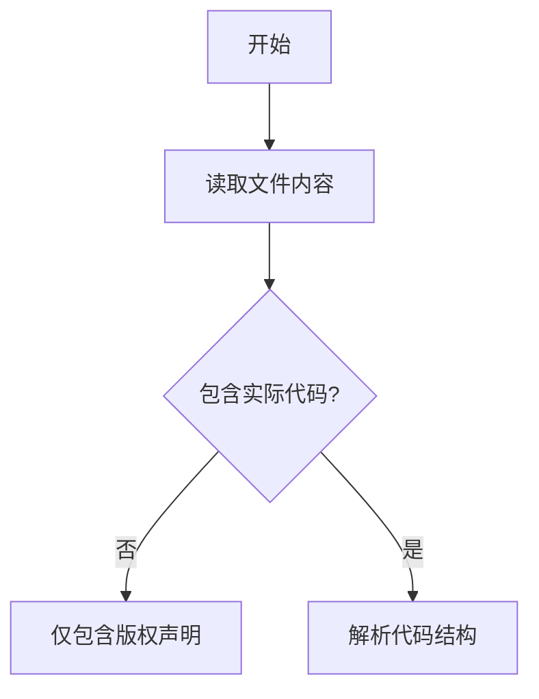

# `graphrag\tests\integration\storage\__init__.py` 详细设计文档

该代码文件仅包含版权声明头部信息，未包含实际的实现代码，因此无法提取核心功能描述。

## 整体流程



## 类结构

```
无类结构（代码为空）
```

## 全局变量及字段


    

## 全局函数及方法


## 关键组件


## 问题及建议


### 已知问题

-   提供的代码仅包含版权声明和MIT许可声明，缺少实际的源代码实现
-   无法从仅包含许可信息的文件中进行功能分析、类结构提取或流程设计
-   当前内容不包含任何类定义、全局变量、函数实现或业务逻辑

### 优化建议

-   提供完整的源代码文件以进行全面的技术分析和文档生成
-   如果这是项目的入口文件或初始化文件，建议补充实际的功能实现代码
-   确保分析范围内包含所有相关的模块和依赖文件，以便生成完整的架构设计文档


## 其它


### 设计目标与约束

由于该代码文件仅包含版权声明信息，未包含任何功能性实现代码，因此无法提取具体的设计目标与约束。

### 错误处理与异常设计

由于该代码文件仅包含版权声明信息，未包含任何功能性实现代码，因此无法提供错误处理与异常设计相关内容。

### 数据流与状态机

由于该代码文件仅包含版权声明信息，未包含任何功能性实现代码，因此无法提供数据流与状态机相关内容。

### 外部依赖与接口契约

由于该代码文件仅包含版权声明信息，未包含任何功能性实现代码，因此无法提供外部依赖与接口契约相关内容。

### 安全考虑

由于该代码文件仅包含版权声明信息，未包含任何功能性实现代码，因此无法提供安全考虑相关内容。

### 性能要求

由于该代码文件仅包含版权声明信息，未包含任何功能性实现代码，因此无法提供性能要求相关内容。

### 兼容性设计

由于该代码文件仅包含版权声明信息，未包含任何功能性实现代码，因此无法提供兼容性设计相关内容。

### 测试策略

由于该代码文件仅包含版权声明信息，未包含任何功能性实现代码，因此无法提供测试策略相关内容。

### 部署与运维

由于该代码文件仅包含版权声明信息，未包含任何功能性实现代码，因此无法提供部署与运维相关内容。

### 版本兼容性

MIT License 允许代码在符合许可证条款的前提下被用于任何目的，包括商业用途、私人使用、再分发等。该许可证不限制版本兼容性。


    