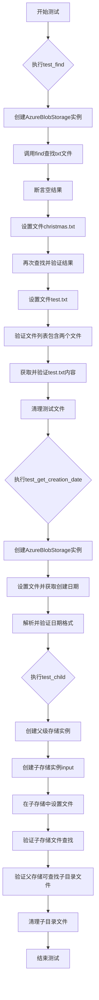
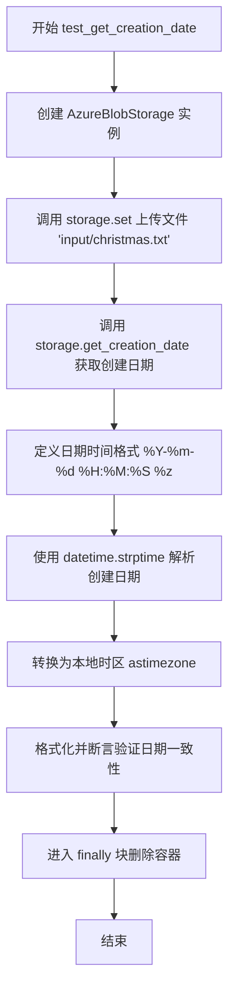

# `graphrag\tests\integration\storage\test_blob_storage.py` 详细设计文档

该文件是一组针对AzureBlobStorage类的异步集成测试用例，验证了Blob存储的查找文件、获取文件创建日期、子存储分区等核心功能的正确性。

## 整体流程



## 类结构

```
测试模块 (无类定义)
├── test_find (异步测试函数)
├── test_get_creation_date (异步测试函数)
└── test_child (异步测试函数)
```

## 全局变量及字段


### `WELL_KNOWN_BLOB_STORAGE_KEY`
    
Azure Blob Storage本地开发环境的连接字符串，用于连接本地模拟的Azurite存储服务

类型：`str`
    


    

## 全局函数及方法


### `test_find`

该异步测试函数用于验证 AzureBlobStorage 类的 `find` 方法能否正确查找匹配指定正则表达式（`.txt$`）的文件，并测试文件创建、读取和删除的完整生命周期。

参数：无

返回值：`None`（异步测试函数）

#### 流程图

```mermaid
flowchart TD
    A[开始测试] --> B[创建AzureBlobStorage实例]
    B --> C[调用find查找.txt文件]
    C --> D{断言结果为空}
    D -->|通过| E[使用set添加input/christmas.txt]
    E --> F[再次调用find查找.txt文件]
    F --> G{断言结果为['input/christmas.txt']}
    G -->|通过| H[添加test.txt文件]
    H --> I[第三次调用find查找.txt文件]
    I --> J{断言结果包含两个文件}
    J -->|通过| K[使用get获取test.txt内容]
    K --> L{断言内容为'Hello, World!'}
    L -->|通过| M[进入finally块删除test.txt]
    M --> N[验证test.txt已删除]
    N --> O[进入外层finally删除容器]
    O --> P[测试结束]
    
    D -->|失败| Q[测试失败]
    G -->|失败| Q
    J -->|失败| Q
    L -->|失败| Q
```

#### 带注释源码

```python
async def test_find():
    """测试AzureBlobStorage的find方法功能"""
    # 创建AzureBlobStorage实例，使用本地开发存储账户
    storage = AzureBlobStorage(
        connection_string=WELL_KNOWN_BLOB_STORAGE_KEY,
        container_name="testfind",
    )
    try:
        try:
            # 第一次查找：容器为空，期望返回空列表
            items = list(storage.find(file_pattern=re.compile(r".*\.txt$")))
            assert items == []

            # 添加第一个txt文件到容器
            await storage.set(
                "input/christmas.txt", "Merry Christmas!", encoding="utf-8"
            )
            # 第二次查找：期望找到1个文件
            items = list(storage.find(file_pattern=re.compile(r".*\.txt$")))
            assert items == ["input/christmas.txt"]

            # 添加第二个txt文件到容器根目录
            await storage.set("test.txt", "Hello, World!", encoding="utf-8")
            # 第三次查找：期望找到2个文件，按路径排序
            items = list(storage.find(file_pattern=re.compile(r".*\.txt$")))
            assert items == ["input/christmas.txt", "test.txt"]

            # 验证get方法能正确读取文件内容
            output = await storage.get("test.txt")
            assert output == "Hello, World!"
        finally:
            # 清理：删除test.txt文件
            await storage.delete("test.txt")
            # 验证文件已被删除，get返回None
            output = await storage.get("test.txt")
            assert output is None
    finally:
        # 最终清理：删除整个测试容器
        storage._delete_container()  # noqa: SLF001
```


### `test_get_creation_date`

这是一个异步测试函数，用于测试 AzureBlobStorage 类的 `get_creation_date` 方法是否能正确获取 Blob 的创建日期，并通过日期时间解析验证返回值的格式是否符合预期的时区格式。

参数：
- （无）

返回值：`None`，该函数为测试函数，不返回任何值，仅通过断言验证逻辑正确性

#### 流程图



#### 带注释源码

```python
async def test_get_creation_date():
    """测试 AzureBlobStorage 的 get_creation_date 方法"""
    
    # 创建 AzureBlobStorage 实例，使用本地开发存储连接字符串
    storage = AzureBlobStorage(
        connection_string=WELL_KNOWN_BLOB_STORAGE_KEY,
        container_name="testfind",
    )
    try:
        # 上传一个测试文件到 Blob 存储
        await storage.set(
            "input/christmas.txt", 
            "Merry Christmas!", 
            encoding="utf-8"
        )
        
        # 获取该文件（Blob）的创建日期
        creation_date = await storage.get_creation_date("input/christmas.txt")

        # 定义期望的日期时间格式：年-月-日 时:分:秒 时区
        datetime_format = "%Y-%m-%d %H:%M:%S %z"
        
        # 使用 datetime.strptime 解析字符串为 datetime 对象
        parsed_datetime = datetime.strptime(creation_date, datetime_format)
        
        # 转换为本地时区
        parsed_datetime = parsed_datetime.astimezone()

        # 验证：重新格式化后的日期时间字符串应与原始字符串一致
        assert parsed_datetime.strftime(datetime_format) == creation_date
    finally:
        # 清理：删除测试用的容器
        storage._delete_container()  # noqa: SLF001
```


### `test_child`

该测试函数验证AzureBlobStorage的`child`方法功能，创建一个子存储空间并在子空间中进行文件操作（设置、查找、获取、删除），同时确认子空间的文件在父空间中能够正确显示为带前缀的完整路径。

参数：無

返回值：`None`，测试函数无返回值

#### 流程图

```mermaid
flowchart TD
    A[开始测试] --> B[创建父存储对象 parent]
    B --> C[创建子存储对象 storage = parent.child]
    C --> D[在子空间设置 christmas.txt]
    D --> E[在子空间查找 .txt 文件]
    E --> F{断言: items == ['christmas.txt']}
    F -->|通过| G[在子空间设置 test.txt]
    F -->|失败| Z[测试失败]
    G --> H[在子空间查找 .txt 文件]
    H --> I[打印找到的文件列表]
    I --> J{断言: items == ['christmas.txt', 'test.txt']}
    J -->|通过| K[从子空间获取 test.txt]
    J -->|失败| Z
    K --> L{断言: output == 'Hello, World!'}
    L -->|通过| M[在父空间查找 .txt 文件]
    L -->|失败| Z
    M --> N[打印父空间找到的文件]
    N --> O{断言: items == ['input/christmas.txt', 'input/test.txt']}
    O -->|通过| P[进入 finally 块]
    O -->|失败| Z
    P --> Q[删除父空间中 input/test.txt]
    Q --> R[检查 input/test.txt 是否存在]
    R --> S{断言: not has_test}
    S -->|通过| T[删除容器]
    S -->|失败| Z
    T --> U[结束测试]
```

#### 带注释源码

```python
async def test_child():
    """
    测试 AzureBlobStorage 的 child 方法功能。
    
    该测试验证：
    1. 能够通过 parent.child() 创建一个子存储空间
    2. 子空间的文件操作（set/find/get）正常工作
    3. 子空间的文件在父空间中显示为带前缀的完整路径
    """
    # 创建父存储对象，使用测试专用的连接字符串和容器名
    parent = AzureBlobStorage(
        connection_string=WELL_KNOWN_BLOB_STORAGE_KEY,
        container_name="testchild",
    )
    try:
        try:
            # 通过 child 方法创建子存储对象，指定前缀为 "input"
            storage = parent.child("input")
            
            # 在子空间设置文件 christmas.txt
            await storage.set("christmas.txt", "Merry Christmas!", encoding="utf-8")
            
            # 在子空间中查找所有 .txt 文件
            items = list(storage.find(re.compile(r".*\.txt$")))
            
            # 断言子空间只包含 christmas.txt
            assert items == ["christmas.txt"]

            # 在子空间设置另一个文件 test.txt
            await storage.set("test.txt", "Hello, World!", encoding="utf-8")
            
            # 再次在子空间中查找所有 .txt 文件
            items = list(storage.find(re.compile(r.*\.txt$")))
            
            # 打印找到的文件列表（调试用）
            print("FOUND", items)
            
            # 断言子空间包含两个文件（按设置顺序）
            assert items == ["christmas.txt", "test.txt"]

            # 从子空间获取 test.txt 的内容
            output = await storage.get("test.txt")
            
            # 断言获取的内容正确
            assert output == "Hello, World!"

            # 在父空间中查找所有 .txt 文件
            items = list(parent.find(re.compile(r.*\.txt$)))
            
            # 打印父空间找到的文件列表（调试用）
            print("FOUND ITEMS", items)
            
            # 断言父空间的文件带有 "input/" 前缀
            assert items == ["input/christmas.txt", "input/test.txt"]
        finally:
            # 内层 finally：清理测试文件
            # 删除父空间中的 input/test.txt
            await parent.delete("input/test.txt")
            
            # 检查 input/test.txt 是否已删除
            has_test = await parent.has("input/test.txt")
            
            # 断言文件已被删除
            assert not has_test
    finally:
        # 外层 finally：清理测试容器
        # 调用私有方法删除整个测试容器
        parent._delete_container()  # noqa: SLF001
```

## 关键组件


### AzureBlobStorage 类

Azure Blob Storage 存储客户端的核心实现类，提供文件存储、检索、查找和容器管理功能。

### find 方法

异步查找方法，支持通过正则表达式模式匹配查找存储中的文件，并返回匹配的文件路径列表。

### get 方法

异步获取方法，根据给定键获取存储中的文件内容，支持指定编码格式。

### set 方法

异步存储方法，将内容存储到指定键，支持指定编码格式（如 UTF-8）。

### delete 方法

异步删除方法，根据键删除存储中的指定文件。

### get_creation_date 方法

异步方法，获取指定文件的创建时间戳，返回格式化的日期时间字符串。

### child 方法

创建子存储实例方法，基于父存储创建具有特定前缀路径的子存储分区。

### has 方法

异步方法，检查指定键的文件是否存在于存储中，返回布尔值。

### _delete_container 方法

内部方法，直接删除整个存储容器，用于测试cleanup。

### WELL_KNOWN_BLOB_STORAGE_KEY

预定义的 Azure Blob Storage 连接字符串，用于本地开发测试环境（Azurite）。

### 文件模式匹配

使用正则表达式进行文件过滤的核心逻辑，支持通配符模式匹配。

## 问题及建议


### 已知问题

-   **同步消费异步生成器**：使用 `list(storage.find(...))` 同步方式消费可能返回异步生成器的方法，未正确处理异步迭代
-   **使用私有方法进行清理**：直接调用 `storage._delete_container()` 私有方法进行测试清理，违反封装原则，应通过公共 API 或 pytest fixture 管理
-   **容器名称冲突**：`test_find` 和 `test_get_creation_date` 共用容器名 "testfind"，可能导致测试间相互干扰
-   **缺少异步标记**：未使用 `@pytest.mark.asyncio` 装饰器声明异步测试函数
-   **调试代码残留**：存在 `print("FOUND", items)` 和 `print("FOUND ITEMS", items)` 调试输出语句
-   **异常处理嵌套过深**：使用多层嵌套 try-finally 结构，代码可读性差
-   **测试逻辑重复**：容器创建、设置、断言模式在多个测试中重复出现
-   **硬编码连接字符串**：测试密钥和连接字符串直接硬编码在代码中

### 优化建议

-   使用 pytest fixtures 自动管理容器生命周期，替代手动 try-finally 清理
-   确认 `find()` 方法是否为异步方法，如是应使用 `async for` 或 `await asyncio.gather()` 消费
-   为每个测试使用独立的容器名称，避免测试间状态污染
-   移除所有调试用的 print 语句
-   将连接字符串提取至 pytest 配置或环境变量中
-   考虑使用 pytest parametrize 减少重复测试代码
-   提取公共测试辅助函数，减少代码重复
-   添加对异常场景（如文件不存在、非法参数等）的测试覆盖

## 其它


### 设计目标与约束

本测试文件旨在验证AzureBlobStorage类的核心功能，包括文件查找、读取、写入、删除、创建时间获取、子存储空间管理等。测试使用本地Azure Storage Emulator（127.0.0.1:10000）进行，不依赖真实的Azure云存储服务。约束条件包括：仅支持UTF-8编码、使用固定的测试容器名称、测试后需清理资源。

### 错误处理与异常设计

测试代码中使用了try-finally结构确保资源清理。关键异常处理场景包括：文件不存在时get返回None、删除操作后验证文件已删除、断言失败时抛出AssertionError。_delete_container()方法使用私有方法（带SLF001 noqa注释），表明其设计为内部使用，可能不提供完整的异常处理。

### 数据流与状态机

测试数据流为：初始化存储客户端 → 执行操作（set/find/get/delete等）→ 验证结果 → 清理资源。状态转换包括：空容器 → 添加文件 → 查询/读取 → 删除文件 → 验证删除。child方法创建新的存储实例，模拟目录层级结构。

### 外部依赖与接口契约

主要依赖：graphrag_storage.azure_blob_storage.AzureBlobStorage类、re模块（正则表达式）、datetime模块。WELL_KNOWN_BLOB_STORAGE_KEY定义标准开发存储连接字符串，遵循Azure Storage Emulator格式规范。接口契约：find返回文件路径列表、set/get使用encoding参数、delete和get_creation_date返回异步操作结果。

### 性能考虑

测试未包含性能基准测试。潜在性能关注点：find方法使用正则表达式匹配可能影响大量文件时的性能、每次操作都创建新的异步连接、child方法创建新实例的开销。

### 安全性考虑

测试使用硬编码的开发账户密钥（Eby8vdM02xNOcqFlqUwJPLlmEtlCDXJ1OUzFT50uSRZ6IFsuFq2UVErCz4I6tq/K1SZFPTOtr/KBHBeksoGMGw==），仅适用于本地开发环境。生产环境不应使用此密钥。代码中无敏感数据加密或访问控制验证。

### 并发与线程安全

测试均为顺序执行，未测试并发场景。AzureBlobStorage客户端的线程安全性依赖于底层azure-storage-blob库的实现。_delete_container()使用私有方法直接操作，可能存在竞态条件风险。

### 资源管理

测试使用try-finally确保容器清理。_delete_container()方法删除整个容器，测试结束后验证资源已释放。连接字符串包含BlobEndpoint，表明使用显式端点配置。

### 配置管理

配置通过WELL_KNOWN_BLOB_STORAGE_KEY全局常量提供，包含协议、账户名、密钥和Blob端点。容器名称在每个测试中单独指定（testfind、testchild）。无外部配置文件支持。

### 测试策略

采用集成测试方法，使用真实Azure Storage Emulator验证功能。测试覆盖场景：基本CRUD操作、文件模式匹配、嵌套路径处理、时间戳解析。每个测试函数独立，使用不同容器避免相互干扰。

### 部署和运维考虑

测试代码仅用于开发/验证目的，不应部署到生产环境。_delete_container()方法带有私有方法警告，暗示其可能不适合生产使用。运维需注意：确保Azure Storage Emulator运行在127.0.0.1:10000，或修改连接字符串指向实际存储端点。

### 代码质量与规范

使用类型注解（async def、await）、遵循Python命名规范。cspell注释表明代码检查配置。私有方法_slf001警告表明代码风格检查建议避免直接访问私有成员。测试文件以blob_storage_tests命名约定存在但实际文件名为test_blob_storage.py。

### 已知限制与边界情况

不支持非UTF-8编码文件（encoding参数限制）。正则表达式file_pattern在空容器返回空列表。child方法创建的子存储空间仅作为路径前缀，不创建实际容器层级。get_creation_date返回带时区的ISO格式字符串，需要解析处理。


    