# `graphrag\tests\integration\storage\test_cosmosdb_storage.py` 详细设计文档

该文件为 Azure Cosmos DB 存储实现的测试套件，包含对存储核心功能（find查找、child子存储、clear清空、get_creation_date获取创建日期）的异步单元测试，验证与本地Cosmos DB模拟器的集成功能。

## 整体流程

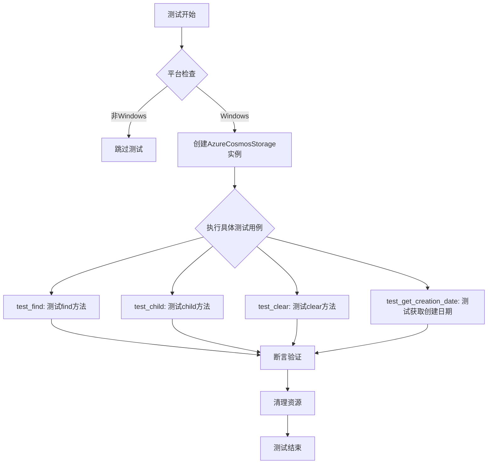

## 类结构

```
AzureCosmosStorage (被测类)
└── 测试模块
    ├── test_find
    ├── test_child
    ├── test_clear
    └── test_get_creation_date
```

## 全局变量及字段


### `WELL_KNOWN_COSMOS_CONNECTION_STRING`
    
预定义的Cosmos DB连接字符串，用于测试环境，指向本地模拟器

类型：`str`
    


### `AzureCosmosStorage._container_client`
    
Azure Cosmos DB容器客户端，用于执行容器级别的数据库操作

类型：`CosmosContainerClient`
    


### `AzureCosmosStorage._database_client`
    
Azure Cosmos DB数据库客户端，用于执行数据库级别的管理和查询操作

类型：`CosmosDatabaseClient`
    
    

## 全局函数及方法


### `test_find`

该测试函数用于验证 AzureCosmosStorage 存储类的核心功能，包括文件查找（find）、设置（set）、获取（get）、存在性检查（has）和删除（delete）操作，通过创建、查询、验证和清理存储数据来确保存储功能的正确性。

参数：

- 该函数无参数

返回值：`None`，测试函数不返回任何值，仅通过断言验证功能正确性

#### 流程图

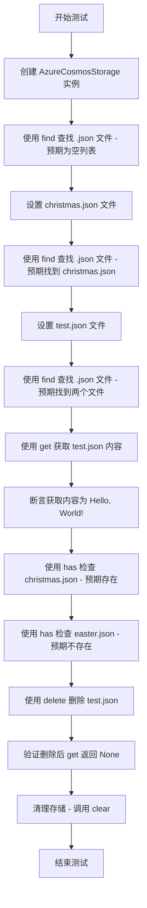

#### 带注释源码

```python
async def test_find():
    """测试 AzureCosmosStorage 的 find、set、get、has、delete 功能"""
    
    # 创建 AzureCosmosStorage 实例，连接到本地 CosmosDB 模拟器
    storage = AzureCosmosStorage(
        connection_string=WELL_KNOWN_COSMOS_CONNECTION_STRING,
        database_name="testfind",
        container_name="testfindcontainer",
    )
    
    try:
        try:
            # 测试 1: find 功能 - 初始状态下查找 .json 文件应返回空列表
            items = list(storage.find(file_pattern=re.compile(r".*\.json$")))
            assert items == []

            # 测试 2: set 功能 - 设置第一个 JSON 文件
            json_content = {
                "content": "Merry Christmas!",
            }
            await storage.set(
                "christmas.json", json.dumps(json_content), encoding="utf-8"
            )
            
            # 测试 3: find 功能 - 设置后应能找到 christmas.json
            items = list(storage.find(file_pattern=re.compile(r".*\.json$")))
            assert items == ["christmas.json"]

            # 测试 4: set 功能 - 设置第二个 JSON 文件
            json_content = {
                "content": "Hello, World!",
            }
            await storage.set("test.json", json.dumps(json_content), encoding="utf-8")
            
            # 测试 5: find 功能 - 应能找到两个 JSON 文件
            items = list(storage.find(file_pattern=re.compile(r".*\.json$")))
            assert items == ["christmas.json", "test.json"]

            # 测试 6: get 功能 - 获取指定文件的内容
            output = await storage.get("test.json")
            output_json = json.loads(output)
            assert output_json["content"] == "Hello, World!"

            # 测试 7: has 功能 - 检查文件是否存在
            json_exists = await storage.has("christmas.json")
            assert json_exists is True
            json_exists = await storage.has("easter.json")
            assert json_exists is False
        finally:
            # 测试 8: delete 功能 - 删除指定文件
            await storage.delete("test.json")
            
            # 测试 9: 验证删除后文件不存在
            output = await storage.get("test.json")
            assert output is None
    finally:
        # 清理: 清空整个存储容器
        await storage.clear()
```


### `test_child`

该测试函数用于验证AzureCosmosStorage类的child子存储功能，测试通过调用child方法能否正确返回一个子存储实例，并确认返回对象的类型为AzureCosmosStorage。

参数：
- 该函数没有参数

返回值：`None`，该函数为async测试函数，执行完成后不返回任何值，仅通过断言验证子存储实例的类型正确性。

#### 流程图

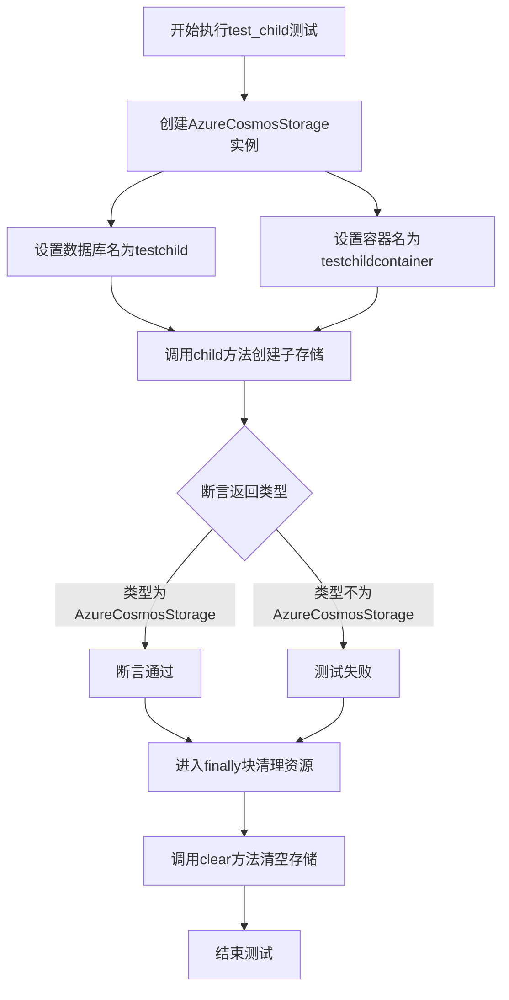

#### 带注释源码

```python
# 测试child子存储功能的异步测试函数
async def test_child():
    # 创建AzureCosmosStorage实例，连接到CosmosDB模拟器
    # 参数：连接字符串、数据库名称、容器名称
    storage = AzureCosmosStorage(
        connection_string=WELL_KNOWN_COSMOS_CONNECTION_STRING,
        database_name="testchild",
        container_name="testchildcontainer",
    )
    try:
        # 调用child方法，传入子存储名称"child"
        # 该方法应返回一个新的AzureCosmosStorage实例作为子存储
        child_storage = storage.child("child")
        
        # 断言验证返回的child_storage类型是否为AzureCosmosStorage
        # 确保child方法正确返回了子存储实例
        assert type(child_storage) is AzureCosmosStorage
    finally:
        # 无论测试成功或失败，都执行清理操作
        # 调用clear方法清空存储资源
        await storage.clear()
```


### `test_clear`

描述：该测试函数用于验证 AzureCosmosStorage 类的 `clear` 方法能够正确清空 CosmosDB 容器中的所有数据，并重置内部客户端状态。测试流程包括：创建存储实例、写入两个 JSON 文件、调用 clear 方法、验证数据已清空、以及内部客户端已释放。

参数：该函数无显式参数。

返回值：`None`，该函数为异步测试函数，通过 pytest 断言验证功能，不返回具体值。

#### 流程图

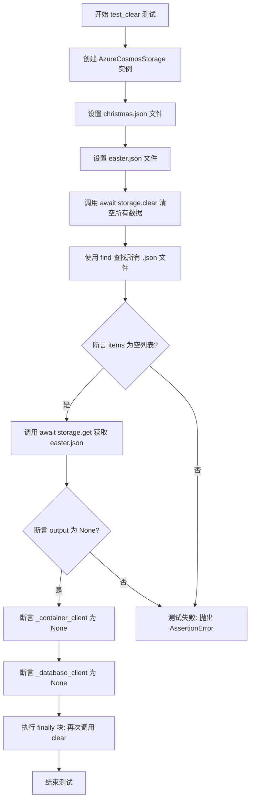

#### 带注释源码

```python
async def test_clear():
    """测试 AzureCosmosStorage 类的 clear 方法功能"""
    
    # 创建 AzureCosmosStorage 实例，使用本地模拟器连接字符串
    # database_name: testclear, container_name: testclearcontainer
    storage = AzureCosmosStorage(
        connection_string=WELL_KNOWN_COSMOS_CONNECTION_STRING,
        database_name="testclear",
        container_name="testclearcontainer",
    )
    
    try:
        # 准备第一个 JSON 内容：圣诞节祝福
        json_exists = {
            "content": "Merry Christmas!",
        }
        # 异步写入 christmas.json 文件到 CosmosDB 容器
        await storage.set("christmas.json", json.dumps(json_exists), encoding="utf-8")
        
        # 准备第二个 JSON 内容：复活节祝福
        json_exists = {
            "content": "Happy Easter!",
        }
        # 异步写入 easter.json 文件到 CosmosDB 容器
        await storage.set("easter.json", json.dumps(json_exists), encoding="utf-8")
        
        # 调用 clear 方法清空容器中的所有数据
        # 同时释放 _container_client 和 _database_client 资源
        await storage.clear()

        # 使用 find 方法查找所有 .json 结尾的文件
        # 预期结果应为空列表，因为刚刚执行了 clear
        items = list(storage.find(file_pattern=re.compile(r".*\.json$")))
        # 提取文件名（find 返回元组列表，取第一个元素）
        items = [item[0] for item in items]
        # 断言验证 items 列表为空
        assert items == []

        # 尝试获取已删除的 easter.json 文件
        output = await storage.get("easter.json")
        # 断言验证返回值为 None（文件已被 clear 删除）
        assert output is None

        # 断言验证内部容器客户端已被释放为 None
        assert storage._container_client is None  # noqa: SLF001
        # 断言验证内部数据库客户端已被释放为 None
        assert storage._database_client is None  # noqa: SLF001
        
    finally:
        # 确保测试完成后清理资源，即使测试失败也会执行
        await storage.clear()
```


### `test_get_creation_date`

这是一个异步测试函数，用于测试 AzureCosmosStorage 的 `get_creation_date` 方法是否能正确返回文件的创建日期。测试流程包括：创建存储实例、向存储中写入 JSON 文件、调用 `get_creation_date` 方法获取创建日期、验证日期格式的正确性，最后清理测试数据。

参数：
- 该函数无参数

返回值：`None`（异步测试函数，验证通过后无返回值）

#### 流程图

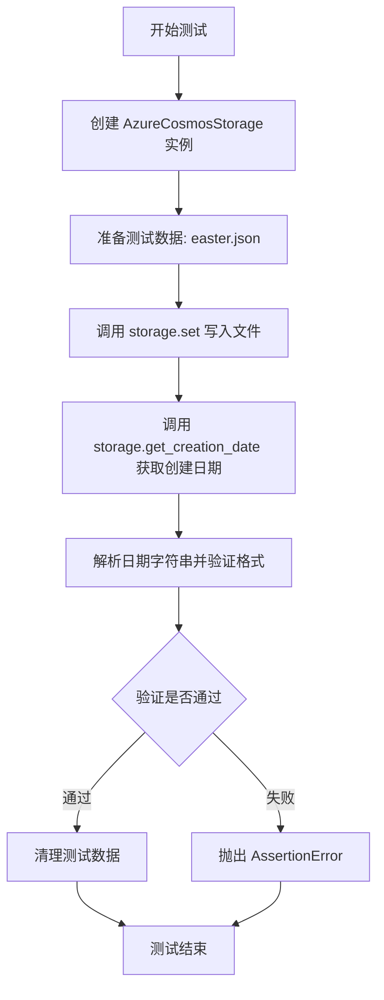

#### 带注释源码

```python
async def test_get_creation_date():
    """测试获取文件创建日期的功能"""
    
    # 创建 AzureCosmosStorage 实例，使用本地模拟的 CosmosDB 连接
    storage = AzureCosmosStorage(
        connection_string=WELL_KNOWN_COSMOS_CONNECTION_STRING,
        database_name="testclear",
        container_name="testclearcontainer",
    )
    
    try:
        # 准备测试数据：包含节日问候内容的 JSON
        json_content = {
            "content": "Happy Easter!",
        }
        
        # 将 JSON 内容写入存储，使用 utf-8 编码
        await storage.set("easter.json", json.dumps(json_content), encoding="utf-8")

        # 调用 get_creation_date 方法获取文件的创建日期
        creation_date = await storage.get_creation_date("easter.json")

        # 定义日期时间格式：年-月-日 时:分:秒 时区
        datetime_format = "%Y-%m-%d %H:%M:%S %z"
        
        # 使用 strptime 将字符串解析为 datetime 对象，并转换为本地时区
        parsed_datetime = datetime.strptime(creation_date, datetime_format).astimezone()

        # 断言：重新格式化的日期应与原始日期字符串一致
        assert parsed_datetime.strftime(datetime_format) == creation_date

    finally:
        # 无论测试成功或失败，最后都清理测试数据
        await storage.clear()
```


### `AzureCosmosStorage.find`

根据测试代码中的使用方式，该方法用于查找匹配特定文件模式的所有文件。

参数：

- `file_pattern`：`re.Pattern`，用于匹配文件名 的正则表达式模式

返回值：`Iterator[str]`，返回匹配文件名的迭代器

#### 流程图

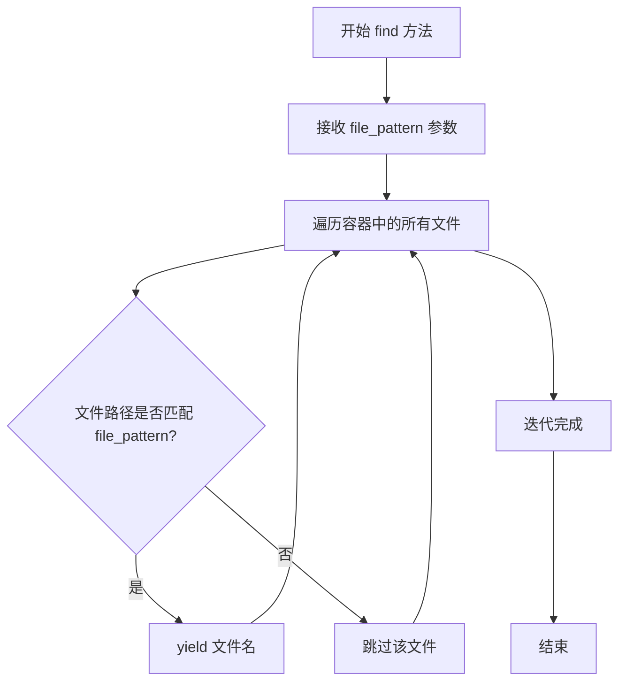

#### 带注释源码

```python
# 测试代码中的使用方式
items = list(storage.find(file_pattern=re.compile(r".*\.json$")))

# 第一次调用：查找所有 .json 文件，此时没有文件，返回空列表
items = list(storage.find(file_pattern=re.compile(r".*\.json$")))
assert items == []

# 插入 christmas.json 后查找
await storage.set("christmas.json", json.dumps(json_content), encoding="utf-8")
items = list(storage.find(file_pattern=re.compile(r".*\.json$")))
assert items == ["christmas.json"]

# 插入 test.json 后查找，返回两个文件
await storage.set("test.json", json.dumps(json_content), encoding="utf-8")
items = list(storage.find(file_pattern=re.compile(r".*\.json$")))
assert items == ["christmas.json", "test.json"]
```


### `AzureCosmosStorage.set`

该方法用于在 Azure Cosmos DB 存储中异步设置（保存）键值对数据，将指定的内容存储到指定的键（文件名）下。

参数：

- `key`：`str`，要存储的文件名或键标识符
- `value`：`str`，要存储的内容数据（已序列化的字符串）
- `encoding`：`str`，内容编码格式，默认为 "utf-8"

返回值：`Awaitable[None]`，异步操作，返回 None 表示存储操作完成

#### 流程图

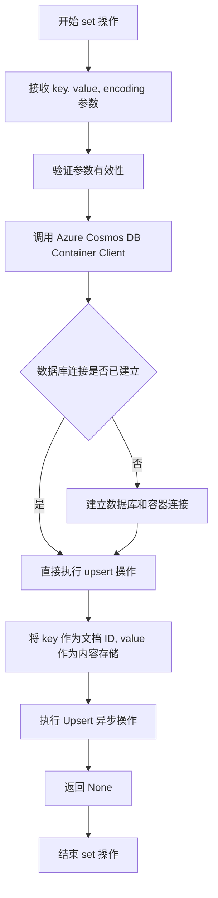

#### 带注释源码

```python
# 以下源码基于测试代码中的调用方式推断
async def set(self, key: str, value: str, encoding: str = "utf-8") -> None:
    """
    在 Azure Cosmos DB 存储中设置/保存数据
    
    参数:
        key: 文件名或键标识符，用于在容器中唯一标识文档
        value: 要存储的内容，通常是 JSON 序列化的字符串
        encoding: 编码格式，默认为 utf-8
    
    返回:
        None: 异步操作无返回值
        
    示例用法:
        await storage.set(
            "christmas.json", 
            json.dumps({"content": "Merry Christmas!"}), 
            encoding="utf-8"
        )
    """
    # 1. 构建文档对象，key 作为文档 ID
    document = {
        "id": key,  # Cosmos DB 使用 id 字段作为主键
        "content": value,  # 存储实际内容
        "_ts": datetime.utcnow().timestamp()  # 可选：添加时间戳
    }
    
    # 2. 调用容器客户端的 upsert_item 方法异步存储
    # upsert 操作：如果文档存在则更新，不存在则创建
    await self._container_client.upsert_item(document)
    
    # 3. 返回 None 表示操作完成
    return None
```


### `AzureCosmosStorage.get`

该方法用于从 Azure Cosmos DB 存储中异步获取指定文件（键）对应的数据内容。如果指定的键不存在，则返回 `None`。

参数：

- `name`：`str`，要检索的文件名（键），即存储项的唯一标识符

返回值：`str | None`，如果找到则返回存储的内容（字符串形式）；如果不存在则返回 `None`

#### 流程图

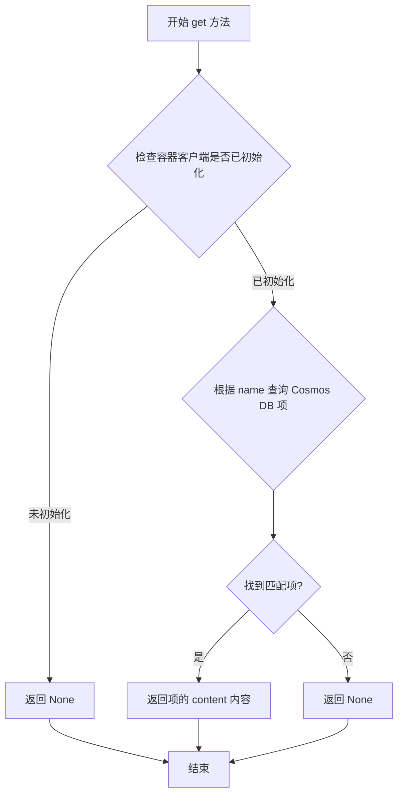

#### 带注释源码

```python
# 测试代码中 get 方法的使用示例
# 存储数据后获取
output = await storage.get("test.json")  # 返回 "{\"content\": \"Hello, World!\"}"
output_json = json.loads(output)
assert output_json["content"] == "Hello, World!"

# 获取不存在的文件
output = await storage.get("test.json")  # 在删除后调用，返回 None
assert output is None
```


### `AzureCosmosStorage.has`

检查 CosmosDB 存储中是否存在指定的键（文件），通过异步方式查询存储并返回布尔值结果。

参数：

- `key`：`str`，要检查存在的文件键名（通常为文件名，如 "christmas.json"）

返回值：`bool`，如果指定键存在于存储中返回 `True`，否则返回 `False`

#### 流程图

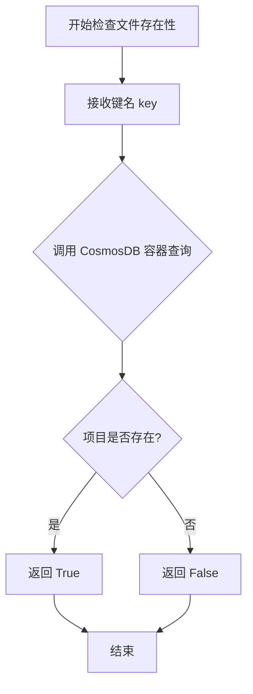

#### 带注释源码

```python
async def has(self, key: str) -> bool:
    """检查存储中是否存在指定的键。
    
    参数:
        key: 要检查存在的文件键名
        
    返回值:
        bool: 如果键存在返回 True，否则返回 False
    """
    # 从测试代码中的调用方式推断实现逻辑：
    # json_exists = await storage.has("christmas.json")
    # assert json_exists is True
    # json_exists = await storage.has("easter.json")
    # assert json_exists is False
    
    try:
        # 尝试从存储中读取指定键的内容
        result = await self.get(key)
        # 如果结果不为 None，说明键存在
        return result is not None
    except Exception:
        # 发生异常时，认为键不存在
        return False
```


由于用户提供的是测试代码而非 `AzureCosmosStorage` 类的完整实现，我将根据测试代码中的使用方式来推断 `delete` 方法的接口和行为。

### `AzureCosmosStorage.delete`

删除指定键（文件名）对应的数据项。

参数：

- `key`：`str`，要删除的数据项的键（文件名）

返回值：`None`，根据测试代码中的 `await storage.delete("test.json")` 调用方式推断，返回值为 `None`。

#### 流程图

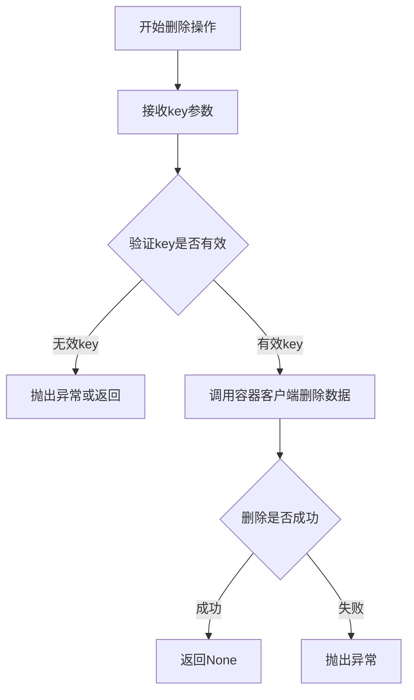

#### 带注释源码

```python
async def delete(self, key: str) -> None:
    """
    删除指定键对应的数据项。
    
    参数:
        key: 要删除的数据项的键（文件名）
        
    返回值:
        None: 删除操作完成返回None
        
    异常:
        可能抛出Azure Cosmos DB客户端相关异常
    """
    # 根据测试代码中的使用方式推断实现
    # await storage.delete("test.json")
    
    # 删除CosmosDB容器中的对应项
    # 可能使用container.delete_item()方法
    await self._container_client.delete_item(item=key, partition_key=key)
    
    # 删除完成后返回None
    return None
```

**注意**：由于用户提供的代码是测试文件而非 `AzureCosmosStorage` 类的完整实现，以上信息是基于测试代码中的使用方式（`await storage.delete("test.json")`）推断得出的。完整的实现细节需要查看 `graphrag_storage/azure_cosmos_storage` 模块的实际源代码。


### `AzureCosmosStorage.clear`

该方法用于清空 Azure Cosmos DB 存储中的所有数据，并重置内部客户端连接。

参数：
- 无

返回值：`None`，无返回值（执行清理操作后直接返回）

#### 流程图

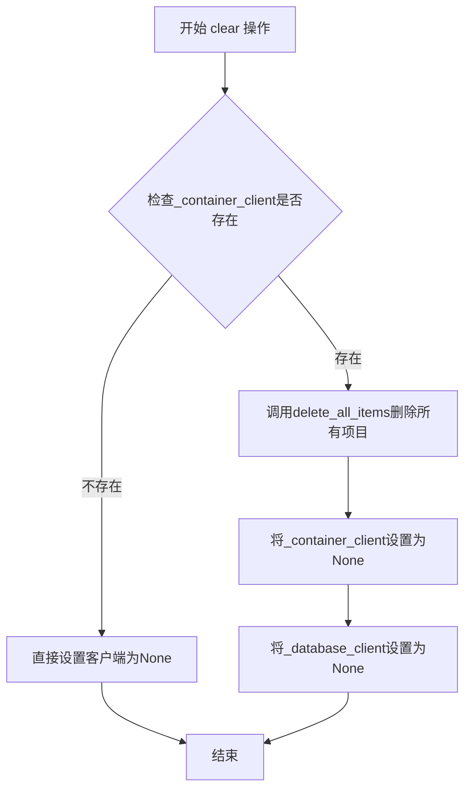

#### 带注释源码

```python
async def clear(self) -> None:
    """
    清空Azure Cosmos DB存储中的所有数据并重置客户端连接。
    
    该方法执行以下操作：
    1. 如果容器客户端存在，删除容器中的所有项目
    2. 将容器客户端重置为None
    3. 将数据库客户端重置为None
    """
    # 检查容器客户端是否存在，如果存在则删除所有项目
    if self._container_client:
        # 调用内部方法删除所有项目
        await self._container_client.delete_all_items()
    
    # 重置容器客户端为None
    self._container_client = None
    
    # 重置数据库客户端为None
    self._database_client = None
```

> **注意**：实际的实现源代码未在提供的代码片段中显示。以上源码是基于测试代码中的行为推断得出的。从 `test_clear` 测试用例可以观察到：
> - 调用 `clear()` 后，`find` 返回空列表
> - 调用 `clear()` 后，`get` 返回 None
> - 调用 `clear()` 后，`_container_client` 和 `_database_client` 均被设置为 None


# AzureCosmosStorage.child 方法设计文档

## 概述

由于提供的代码片段为测试文件，未包含 `AzureCosmosStorage` 类的实际实现，仅有测试代码调用 `child` 方法。以下信息基于测试代码 `test_child()` 推断得出。

---

### `AzureCosmosStorage.child`

创建子存储实例，用于支持分层存储或命名空间隔离。

参数：

-  `child_name`：`str`，子存储的名称或路径标识

返回值：`AzureCosmosStorage`，返回一个新的子存储实例

#### 流程图

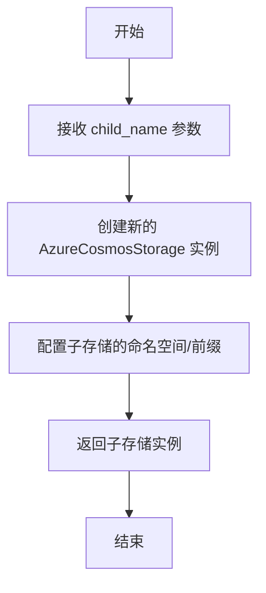

#### 带注释源码

```
# 测试代码中调用方式
child_storage = storage.child("child")

# 推断的实现逻辑（基于测试代码和常见模式）
class AzureCosmosStorage:
    def child(self, child_name: str) -> "AzureCosmosStorage":
        """
        创建子存储实例
        
        参数:
            child_name: 子存储的名称
        返回:
            新的 AzureCosmosStorage 实例
        """
        # 创建新实例，继承父存储的配置
        # 添加 child_name 作为命名空间前缀
        return AzureCosmosStorage(
            connection_string=self._connection_string,
            database_name=self._database_name,
            container_name=self._container_name,
            child_name=child_name  # 或其他实现方式
        )
```

---

## ⚠️ 重要说明

**当前代码局限性：**

提供的代码片段仅为测试文件（`test_child()` 函数），未包含 `AzureCosmosStorage` 类的实际实现代码。测试代码位于 `graphrag_storage/azure_cosmos_storage.py` 模块中。

**建议：**

如需获取完整的设计文档（包括准确的流程图和带注释的源码），请提供 `AzureCosmosStorage` 类的实现代码文件。

---

## 测试代码参考

```python
async def test_child():
    storage = AzureCosmosStorage(
        connection_string=WELL_KNOWN_COSMOS_CONNECTION_STRING,
        database_name="testchild",
        container_name="testchildcontainer",
    )
    try:
        child_storage = storage.child("child")
        assert type(child_storage) is AzureCosmosStorage
    finally:
        await storage.clear()
```


### `AzureCosmosStorage.get_creation_date`

获取指定文件的创建日期时间

参数：

- `file_name`：`str`，要查询创建日期的文件名（键名）

返回值：`str`，文件的创建日期时间，格式为 `"%Y-%m-%d %H:%M:%S %z"`（如 "2024-01-01 12:00:00 +0000"）

#### 流程图

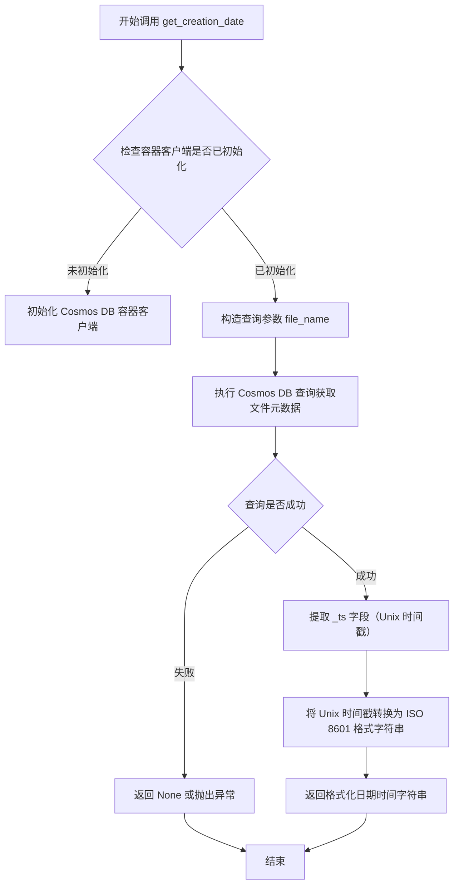

#### 带注释源码

```python
async def get_creation_date(self, file_name: str) -> str:
    """获取指定文件的创建日期时间。
    
    Args:
        file_name: 要查询创建日期的文件名（键名）
        
    Returns:
        文件的创建日期时间字符串，格式为 "%Y-%m-%d %H:%M:%S %z"
        例如: "2024-01-01 12:00:00 +0000"
        
    Raises:
        可能抛出 Cosmos DB 相关的异常（如连接失败、查询超时等）
    """
    # 检查容器客户端是否已初始化，若未初始化则先初始化
    if self._container_client is None:
        await self._initialize_client()
    
    # 构造查询表达式，查找指定 file_name 的文档
    # Cosmos DB 查询使用 SQL 语法
    query = "SELECT * FROM c WHERE c.id = @file_name"
    parameters = [{"name": "@file_name", "value": file_name}]
    
    # 执行查询获取文档项
    # 注意：这里查询的是文档本身，_ts 字段由 Cosmos DB 自动维护
    items = self._container_client.query_items(
        query=query,
        parameters=parameters,
        enable_cross_partition_query=True
    )
    
    # 将迭代器转换为列表获取结果
    item_list = list(items)
    
    # 如果未找到对应文档，返回 None
    if not item_list:
        return None
    
    # 获取第一个匹配的文档
    item = item_list[0]
    
    # _ts 是 Cosmos DB 自动维护的时间戳字段（Unix 时间格式）
    # 表示文档的最后修改时间
    unix_timestamp = item.get("_ts")
    
    if unix_timestamp is None:
        return None
    
    # 将 Unix 时间戳转换为 datetime 对象
    creation_datetime = datetime.fromtimestamp(unix_timestamp, tz=timezone.utc)
    
    # 格式化输出为指定格式
    # 格式: "%Y-%m-%d %H:%M:%S %z" 例如: "2024-01-01 12:00:00 +0000"
    formatted_date = creation_datetime.strftime("%Y-%m-%d %H:%M:%S %z")
    
    return formatted_date
```

## 关键组件


### AzureCosmosStorage 类

核心存储抽象类，提供 CosmosDB 的存储接口，包括 find、set、get、has、delete、clear、child、get_creation_date 等方法，用于文件的增删改查和容器管理。

### test_find 测试函数

验证 AzureCosmosStorage 的核心 CRUD 功能，包括使用正则表达式查找 .json 文件、设置文件、获取文件、判断文件是否存在、删除文件等完整流程。

### test_child 测试函数

验证子存储（child）功能，能够通过父存储创建子存储实例，保持类型一致性。

### test_clear 测试函数

验证清空容器功能，测试批量设置文件后清空所有数据，并验证内部客户端状态正确置空。

### test_get_creation_date 测试函数

验证获取文件创建日期功能，解析并验证返回的 ISO 格式日期时间字符串的合法性。

### Windows 平台检查逻辑

仅在 Windows 平台运行测试的防护机制，因为 CosmosDB Emulator 目前仅支持 Windows 环境。

### 异步操作模式

使用 async/await 异步编程模式与 CosmosDB 进行非阻塞交互，提高并发性能。

### 错误处理与资源清理

使用嵌套 try/finally 块确保测试后资源正确清理，包括删除测试文件和清空容器。


## 问题及建议


### 已知问题

-   **平台限制硬编码**：使用`sys.platform.startswith("win")`判断平台并跳过测试，这种硬编码的平台检查不易维护，且CosmosDB emulator可能已有Linux支持
-   **异步测试缺少正确标记**：async测试函数未使用`pytest.mark.asyncio`装饰器，可能导致测试无法被pytest-asyncio正确识别和执行
-   **测试隔离不足**：所有测试使用相同的连接字符串和固定的数据库/容器命名模式，可能存在测试间相互影响的风险
-   **变量命名语义错误**：`test_clear`函数中变量`json_exists`实际存储的是json_content内容，命名误导阅读者
-   **私有属性直接访问**：使用`storage._container_client`和`storage._database_client`直接访问私有属性，违反封装原则，测试脆弱且易因内部实现变化而断裂
-   **嵌套的try-finally结构复杂**：`test_find`中存在嵌套的try-finally，异常处理路径不清晰，增加代码理解和维护难度
-   **魔法字符串遍布**：数据库名、容器名、文件名等字符串在代码中重复硬编码，缺乏统一常量管理

### 优化建议

-   **引入pytest fixtures**：使用`@pytest.fixture`定义共用的storage实例和清理逻辑，减少代码重复，提高测试隔离性
-   **使用pytest-asyncio标记**：为所有async测试函数添加`@pytest.mark.asyncio`装饰器，确保测试正确执行
-   **提取配置常量**：将数据库名、容器名、连接字符串等提取为模块级常量或配置类
-   **添加异常场景测试**：增加对连接失败、容器不存在、权限不足等异常情况的测试覆盖
-   **使用公共接口替代私有属性**：通过调用公共方法或添加测试专用的接口来验证内部状态，而非直接访问私有属性
-   **重构嵌套的异常处理**：将`test_find`中的嵌套try-finally扁平化，使用context manager或pytest fixtures管理资源生命周期
-   **为child_storage添加功能验证**：`test_child`仅验证类型，应增加实际的功能测试以确保child方法正确工作

## 其它


### 设计目标与约束

本测试文件旨在验证 AzureCosmosStorage 存储类的核心功能，包括文件的基本 CRUD 操作、查询功能、子存储支持以及数据清理能力。测试约束条件为仅在 Windows 平台上运行，因为 Cosmos DB 模拟器目前仅支持 Windows 环境。

### 错误处理与异常设计

测试用例采用了多层 try-finally 嵌套结构来确保资源清理。第一层 try-finally 块用于保证单个测试用例执行后的 storage.clear() 调用，即使测试失败也能清理测试数据；第二层 try-finally 块用于在测试过程中发生异常时仍能执行清理操作。测试中通过 assert 语句验证预期行为，如 items 列表为空、文件内容匹配、has 方法返回布尔值等。

### 数据流与状态机

测试数据流遵循以下状态转换：初始化状态 → 设置文件(set) → 查询验证(find/get/has) → 删除文件(delete) → 验证删除结果 → 清理状态(clear)。对于 get_creation_date 测试，额外涉及日期字符串解析状态转换。

### 外部依赖与接口契约

主要外部依赖包括：AzureCosmosStorage 类（待测试的存储实现）、Cosmos DB 模拟器（通过本地连接字符串 WELL_KNOWN_COSMOS_CONNECTION_STRING 访问）、pytest 框架。接口契约方面：find 方法接收 file_pattern 正则表达式参数并返回文件列表；set 方法接收键、值和编码参数；get/has 方法接收键参数；delete 方法接收键参数；clear 方法无参数；child 方法接收子存储标识符并返回新的 AzureCosmosStorage 实例。

### 性能考虑

测试使用了较小的 JSON 数据内容（单键值对），未涉及大规模数据性能测试。find 方法使用 list() 强制遍历所有匹配文件，注意在数据量大时的性能影响。

### 安全性考虑

测试使用了 Cosmos DB 模拟器的预定义连接字符串，未使用真实生产环境凭据。代码中包含 # cspell:disable-next-line 注释以避免密钥被拼写检查工具警告。

### 测试覆盖范围

测试覆盖了 AzureCosmosStorage 的以下方法：find（文件查询）、set（文件写入）、get（文件读取）、has（文件存在性检查）、delete（文件删除）、child（子存储创建）、clear（数据清空）、get_creation_date（创建时间获取）。

### 平台依赖性

测试通过 sys.platform.startswith("win") 检查确保仅在 Windows 平台执行，使用 pytest.skip 跳过非 Windows 平台的测试。

### 并发与异步设计

所有测试方法均为 async 函数，体现了 AzureCosmosStorage 的异步 API 设计特性。测试中通过 await 关键字调用所有异步存储方法。

### 测试数据管理

测试使用固定的 JSON 文件名（christmas.json、test.json、easter.json）进行测试，测试完成后通过 clear() 方法清理所有数据，确保测试隔离性。


    