# `graphrag\tests\integration\storage\test_factory.py` 详细设计文档

这是一个测试文件，用于验证StorageFactory类的功能以及创建各种原生支持的存储类型（Azure Blob、Azure Cosmos、File、Memory），包括自定义存储的注册和创建流程。

## 整体流程

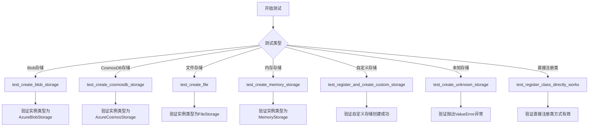

## 类结构

```
测试模块 (test_storage_factory.py)
├── 全局变量
│   ├── WELL_KNOWN_BLOB_STORAGE_KEY
│   └── WELL_KNOWN_COSMOS_CONNECTION_STRING
└── 测试函数
    ├── test_create_blob_storage
    ├── test_create_cosmosdb_storage
    ├── test_create_file
    ├── test_create_memory_storage
    ├── test_register_and_create_custom_storage
    ├── test_create_unknown_storage
    └── test_register_class_directly_works
```

## 全局变量及字段


### `WELL_KNOWN_BLOB_STORAGE_KEY`
    
用于测试环境的Azure Blob Storage开发存储账户连接字符串，包含端点协议、账户名、账户密钥和Blob端点

类型：`str`
    


### `WELL_KNOWN_COSMOS_CONNECTION_STRING`
    
用于测试环境的Azure Cosmos DB开发存储账户连接字符串，包含账户端点和账户密钥

类型：`str`
    


    

## 全局函数及方法


### `test_create_blob_storage`

该测试函数用于验证使用 StorageFactory 创建 Azure Blob Storage 存储实例的功能是否正常。它通过构造特定的 StorageConfig 配置（包括连接字符串、容器名称等），调用 create_storage 函数创建存储实例，并断言返回的实例类型为 AzureBlobStorage。

参数：
- 该函数无参数

返回值：`None`，pytest 测试函数不返回任何内容，仅执行断言验证

#### 流程图

```mermaid
flowchart TD
    A[开始测试 test_create_blob_storage] --> B[创建 StorageConfig 对象]
    B --> C[配置: type=StorageType.AzureBlob]
    B --> D[配置: connection_string=WELL_KNOWN_BLOB_STORAGE_KEY]
    B --> E[配置: base_dir='testbasedir']
    B --> F[配置: container_name='testcontainer']
    C --> G[调用 create_storage 函数, 传入 config]
    G --> H{执行测试环境}
    H -->|Blob Storage Emulator 可用| I[创建 AzureBlobStorage 实例]
    H -->|Blob Storage Emulator 不可用| J[跳过测试 @pytest.mark.skip]
    I --> K[断言 isinstance(storage, AzureBlobStorage)]
    K --> L[测试通过]
    J --> M[测试跳过]
```

#### 带注释源码

```python
# 使用 @pytest.mark.skip 标记跳过该测试
# 原因：Blob Storage Emulator 在当前测试环境中不可用
@pytest.mark.skip(reason="Blob storage emulator is not available in this environment")
def test_create_blob_storage():
    """
    测试使用 StorageFactory 创建 Azure Blob Storage 存储实例
    
    该测试执行以下步骤：
    1. 构造 StorageConfig 配置对象，包含 AzureBlob 存储类型、连接字符串等
    2. 调用 create_storage() 函数创建存储实例
    3. 验证返回的实例类型是否为 AzureBlobStorage
    """
    
    # 步骤1：创建 StorageConfig 配置对象
    # type: 指定存储类型为 Azure Blob Storage
    # connection_string: Azure Blob 存储的连接字符串（使用本地开发模拟器）
    # base_dir: 存储的基础目录路径
    # container_name: Azure Blob 存储的容器名称
    config = StorageConfig(
        type=StorageType.AzureBlob,
        connection_string=WELL_KNOWN_BLOB_STORAGE_KEY,
        base_dir="testbasedir",
        container_name="testcontainer",
    )
    
    # 步骤2：调用 create_storage 工厂函数，传入配置创建存储实例
    # create_storage 是 StorageFactory 提供的工厂方法，根据配置创建相应的存储实例
    storage = create_storage(config)
    
    # 步骤3：断言验证返回的存储实例类型
    # 使用 isinstance 检查 storage 是否为 AzureBlobStorage 类的实例
    # 如果类型匹配，测试通过；如果不匹配，测试失败并抛出 AssertionError
    assert isinstance(storage, AzureBlobStorage)
```


### `test_create_cosmosdb_storage`

该函数是一个集成测试用例，用于验证能够正确创建 Azure Cosmos DB 类型的存储实例。它首先构建包含连接字符串、数据库名称和容器名称的 StorageConfig 配置对象，然后调用 create_storage 工厂函数创建存储实例，最后通过断言验证返回的对象确实是 AzureCosmosStorage 类型的实例。

参数：
- 该函数无参数

返回值：`None`，测试函数不返回任何值，仅通过断言验证

#### 流程图

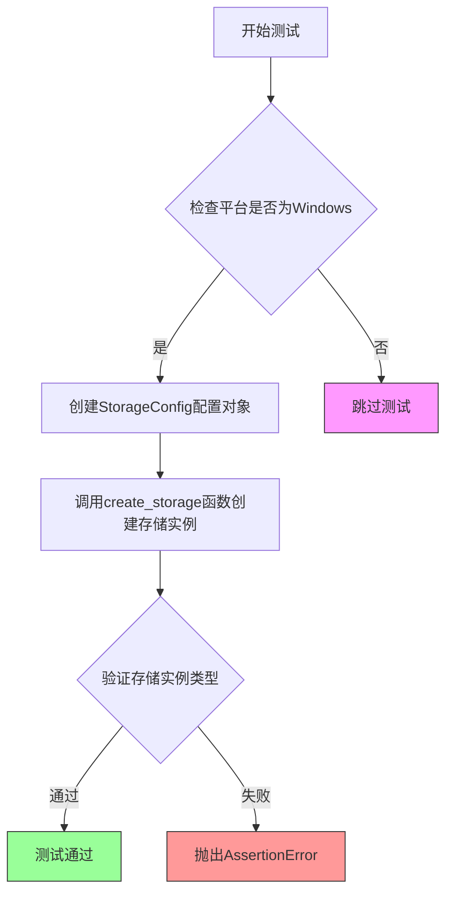

#### 带注释源码

```python
# 使用 skipif 装饰器，仅在 Windows 平台运行测试
# 原因：cosmosdb emulator 目前仅在 windows runners 上可用
@pytest.mark.skipif(
    not sys.platform.startswith("win"),
    reason="cosmosdb emulator is only available on windows runners at this time",
)
def test_create_cosmosdb_storage():
    """测试创建 Azure Cosmos DB 存储类型"""
    
    # 构建存储配置对象
    # 包含：存储类型为 AzureCosmos、连接字符串、数据库名、容器名
    config = StorageConfig(
        type=StorageType.AzureCosmos,
        connection_string=WELL_KNOWN_COSMOS_CONNECTION_STRING,
        database_name="testdatabase",
        container_name="testcontainer",
    )
    
    # 调用工厂函数 create_storage 根据配置创建存储实例
    storage = create_storage(config)
    
    # 断言验证创建的存储实例确实是 AzureCosmosStorage 类型
    assert isinstance(storage, AzureCosmosStorage)
```


### `test_create_file`

该测试函数用于验证文件系统存储（FileStorage）的创建功能，通过创建特定配置的 StorageConfig 对象并调用 create_storage 函数，断言返回的存储实例类型为 FileStorage。

参数：

- 无参数

返回值：`None`，无返回值（测试函数）

#### 流程图

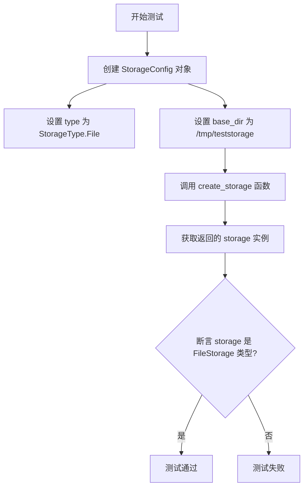

#### 带注释源码

```python
def test_create_file():
    """测试创建文件系统存储类型"""
    # 创建一个存储配置对象，指定存储类型为文件存储
    config = StorageConfig(
        type=StorageType.File,
        base_dir="/tmp/teststorage",
    )
    # 使用配置创建存储实例
    storage = create_storage(config)
    # 断言创建的存储实例是 FileStorage 类型
    assert isinstance(storage, FileStorage)
```


### `test_create_memory_storage`

该测试函数用于验证能够通过 `StorageFactory` 成功创建内存存储类型的实例，并确保返回的对象是 `MemoryStorage` 类的实例。

参数：无

返回值：无返回值（测试函数）

#### 流程图

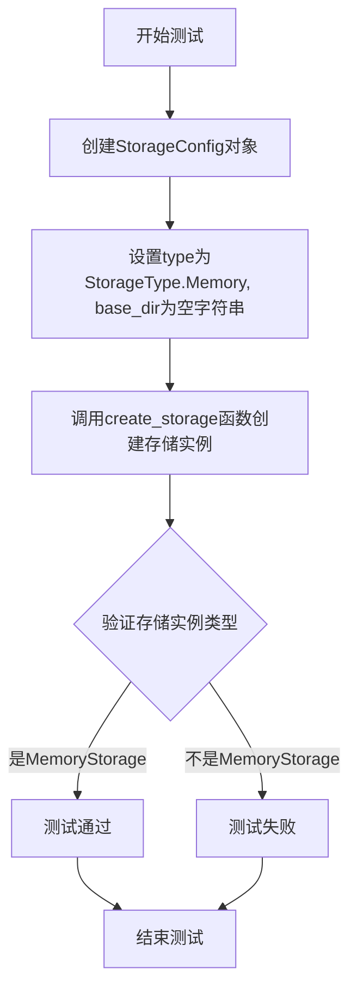

#### 带注释源码

```python
def test_create_memory_storage():
    """
    测试创建内存存储类型的功能。
    
    该测试函数验证以下内容：
    1. StorageConfig能够正确配置内存存储类型
    2. create_storage工厂函数能够根据配置创建正确的存储实例
    3. 创建的存储实例是MemoryStorage类型
    """
    # 创建StorageConfig配置对象，指定存储类型为Memory
    config = StorageConfig(
        base_dir="",          # 内存存储不需要持久化目录，设为空字符串
        type=StorageType.Memory,  # 指定存储类型为内存存储
    )
    
    # 调用create_storage工厂函数，根据配置创建存储实例
    storage = create_storage(config)
    
    # 断言验证创建的存储实例确实是MemoryStorage类型
    assert isinstance(storage, MemoryStorage)
```


### `test_register_and_create_custom_storage`

描述：测试通过 `register_storage` 函数注册自定义存储类型，并使用 `create_storage` 函数根据配置创建自定义存储实例的功能是否正常工作。

参数：无

返回值：`None`，无返回值（测试函数）

#### 流程图

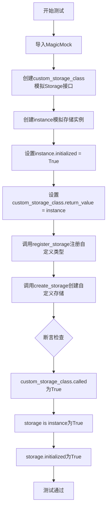

#### 带注释源码

```python
def test_register_and_create_custom_storage():
    """Test registering and creating a custom storage type."""
    # 从unittest.mock模块导入MagicMock，用于创建模拟对象
    from unittest.mock import MagicMock

    # 步骤1：创建一个满足Storage接口规范的Mock类
    # 使用spec=Storage确保mock对象只包含Storage接口中定义的方法和属性
    custom_storage_class = MagicMock(spec=Storage)
    
    # 步骤2：创建另一个Mock实例作为实际返回的存储对象
    instance = MagicMock()
    
    # 步骤3：在模拟实例上设置自定义属性，用于后续验证
    # 即使该属性不在Storage接口中，也可以在mock上设置
    instance.initialized = True
    
    # 步骤4：配置custom_storage_class在调用时返回我们创建的instance
    # 这样当create_storage内部调用custom_storage_class(**kwargs)时会返回instance
    custom_storage_class.return_value = instance

    # 步骤5：注册自定义存储类型
    # register_storage接受类型名称和工厂函数
    # 这里的工厂函数是一个lambda，接受任意关键字参数并调用custom_storage_class
    register_storage("custom", lambda **kwargs: custom_storage_class(**kwargs))
    
    # 步骤6：使用create_storage根据配置创建存储实例
    storage = create_storage(StorageConfig(type="custom"))

    # 步骤7：断言验证
    # 验证1：custom_storage_class被调用过
    assert custom_storage_class.called
    
    # 验证2：返回的storage对象正是我们设置的instance
    assert storage is instance
    
    # 验证3：可以访问我们在mock上设置的initialized属性
    # type: ignore注释是因为Storage接口中没有initialized属性
    assert storage.initialized is True  # type: ignore # Attribute only exists on our mock
```


### `test_create_unknown_storage`

该函数是一个单元测试，用于验证当尝试使用未注册的存储类型创建存储实例时，系统能否正确抛出 `ValueError` 异常并包含正确的错误消息。这是测试存储工厂对未知存储类型的错误处理能力。

**参数：** 无

**返回值：** 无（测试函数，使用 `pytest.raises` 验证异常）

#### 流程图

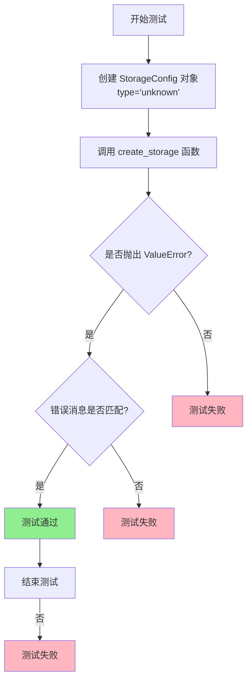

#### 带注释源码

```python
def test_create_unknown_storage():
    """测试创建未注册的存储类型时是否抛出正确的异常.
    
    该测试验证当传入一个未在 StorageFactory 中注册的存储类型时,
    create_storage 函数会抛出 ValueError 并包含描述性错误消息.
    """
    # 使用 pytest.raises 上下文管理器捕获预期的异常
    # 预期会抛出 ValueError, 错误消息匹配指定的正则表达式模式
    with pytest.raises(
        ValueError,
        match="StorageConfig\\.type 'unknown' is not registered in the StorageFactory\\.",
    ):
        # 创建一个 type 为 'unknown' 的 StorageConfig
        # 这是一个未注册的存储类型,应该导致错误
        create_storage(StorageConfig(type="unknown"))
        
        # 注意: 如果 create_storage 没有抛出异常,测试将失败
        # 因为 pytest.raises 会检测到没有抛出预期的 ValueError
```


### `test_register_class_directly_works`

该测试函数用于验证 StorageFactory 允许直接注册一个 Storage 类（而非仅支持注册工厂函数），并通过创建该类的实例来确认注册机制正常工作。

参数：无

返回值：`None`，该测试函数通过断言验证功能，不返回具体值

#### 流程图

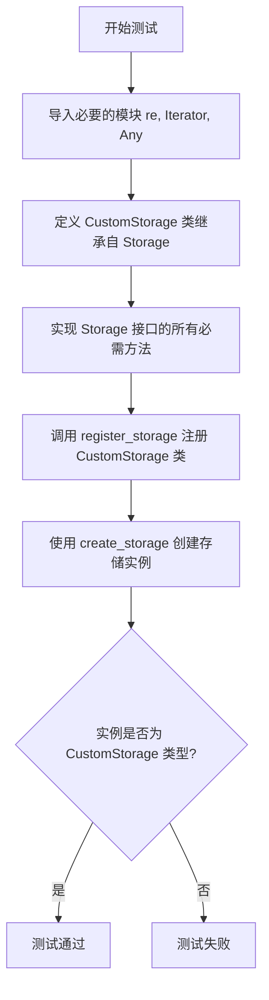

#### 带注释源码

```python
def test_register_class_directly_works():
    """Test that registering a class directly works (StorageFactory allows this)."""
    # 导入正则表达式模块
    import re
    # 导入类型提示相关的模块
    from collections.abc import Iterator
    from typing import Any

    # 定义一个自定义存储类，实现 Storage 接口
    class CustomStorage(Storage):
        """自定义存储类，用于测试直接注册类的功能"""
        
        def __init__(self, **kwargs):
            """初始化方法，接受任意关键字参数"""
            pass

        def find(
            self,
            file_pattern: re.Pattern[str],
        ) -> Iterator[str]:
            """根据文件模式查找文件，返回迭代器"""
            return iter([])

        async def get(
            self, key: str, as_bytes: bool | None = None, encoding: str | None = None
        ) -> Any:
            """异步获取存储的值"""
            return None

        async def set(self, key: str, value: Any, encoding: str | None = None) -> None:
            """异步设置存储的值"""
            pass

        async def delete(self, key: str) -> None:
            """异步删除存储的键"""
            pass

        async def has(self, key: str) -> bool:
            """异步检查键是否存在"""
            return False

        async def clear(self) -> None:
            """异步清空所有存储内容"""
            pass

        def child(self, name: str | None) -> "Storage":
            """返回子存储实例"""
            return self

        def keys(self) -> list[str]:
            """返回所有键的列表"""
            return []

        async def get_creation_date(self, key: str) -> str:
            """异步获取键的创建日期"""
            return "2024-01-01 00:00:00 +0000"

    # StorageFactory allows registering classes directly (no TypeError)
    # 调用 register_storage 直接注册 CustomStorage 类（而非工厂函数）
    register_storage("custom_class", CustomStorage)

    # Test creating an instance
    # 使用配置创建存储实例
    storage = create_storage(StorageConfig(type="custom_class"))
    
    # 断言验证创建的实例是 CustomStorage 类型
    assert isinstance(storage, CustomStorage)
```


### `CustomStorage.__init__`

该方法是自定义存储类的构造函数，接受任意关键字参数用于配置存储实例，不返回任何值。

参数：

- `self`：`CustomStorage`，类的实例本身
- `**kwargs`：`任意`，可变关键字参数，用于传递存储配置选项

返回值：`None`，构造函数不返回任何值

#### 流程图

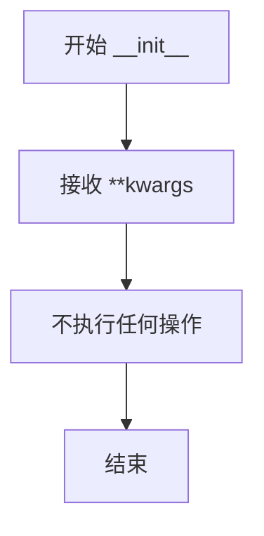

#### 带注释源码

```python
def __init__(self, **kwargs):
    """自定义存储类的构造函数。
    
    参数:
        **kwargs: 任意关键字参数，用于传递存储配置选项
                 在本实现中被忽略（pass），仅满足接口要求
    """
    pass  # 不执行任何操作，仅满足 Storage 接口的构造函数签名要求
```


### `CustomStorage.find`

该方法接收一个正则表达式模式作为参数，遍历存储中的文件并返回匹配该模式的所有文件路径的迭代器。在当前实现中，它返回一个空迭代器。

参数：

- `file_pattern`：`re.Pattern[str]`，用于匹配文件名的正则表达式模式

返回值：`Iterator[str]`，返回匹配 `file_pattern` 的所有文件路径的迭代器

#### 流程图

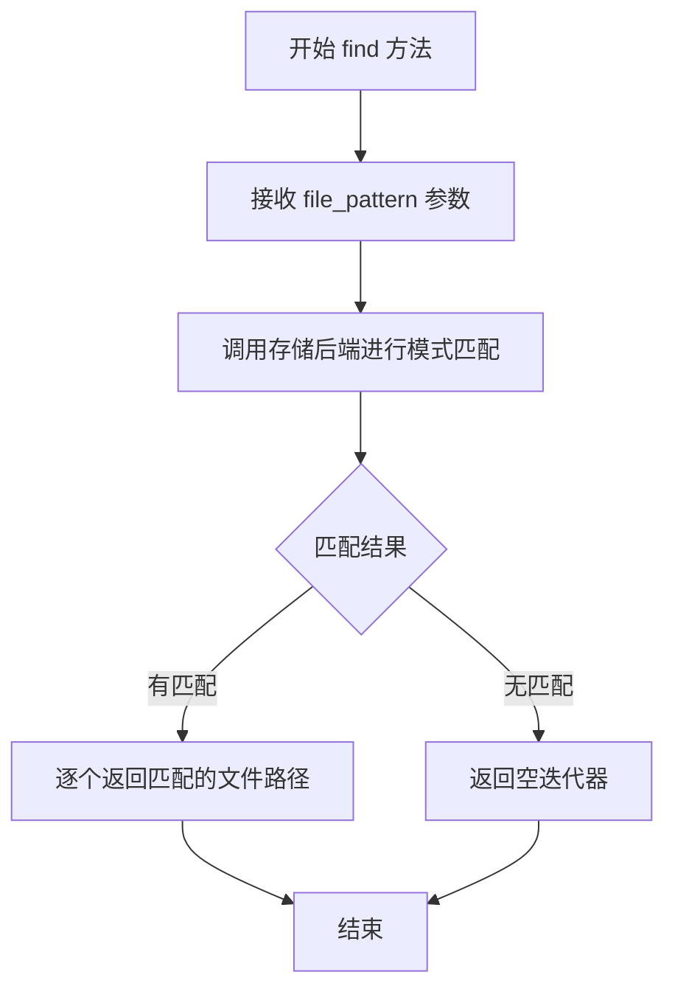

#### 带注释源码

```python
def find(
    self,
    file_pattern: re.Pattern[str],
) -> Iterator[str]:
    """查找所有匹配给定正则表达式模式的文件。

    该方法会遍历存储中的所有文件，过滤出名称符合指定正则表达式模式的文件，
    并返回一个迭代器供调用者逐个处理匹配的文件路径。

    Args:
        file_pattern: 用于匹配文件名的正则表达式模式对象

    Returns:
        Iterator[str]: 一个迭代器，包含所有匹配 file_pattern 的文件路径字符串
    
    Note:
        当前实现直接返回空迭代器，具体匹配逻辑由子类存储实现类重写
    """
    return iter([])
```


### CustomStorage.get

这是自定义存储类中的异步获取方法，用于根据键名从存储中检索数据。

参数：

- `key`：`str`，要检索的键名
- `as_bytes`：`bool | None`，可选参数，指定是否以字节形式返回数据
- `encoding`：`str | None`，可选参数，指定数据的编码方式

返回值：`Any`，返回检索到的值，如果没有找到则返回 None

#### 流程图

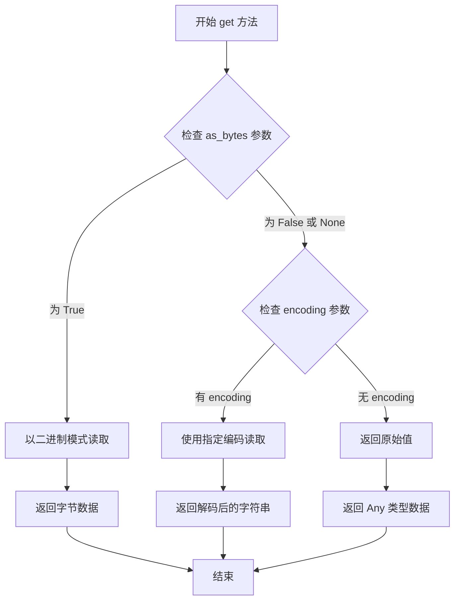

#### 带注释源码

```python
async def get(
    self, key: str, as_bytes: bool | None = None, encoding: str | None = None
) -> Any:
    """异步获取存储中的值。

    Args:
        key: 要检索的键名
        as_bytes: 可选参数，指定是否以字节形式返回数据
        encoding: 可选参数，指定数据的编码方式

    Returns:
        返回检索到的值，如果没有找到则返回 None
    """
    return None
```


### `CustomStorage.set`

该方法用于异步将数据存储到指定的键中。它是 `Storage` 接口的实现部分，在此测试代码中为空实现（`pass`）。

参数：

-  `key`：`str`，用于索引存储值的键名。
-  `value`：`Any`，需要存储的具体数据内容。
-  `encoding`：`str | None`，可选参数，指定存储时的编码格式（如 utf-8）。

返回值：`None`，该方法执行完成后不返回任何数据。

#### 流程图

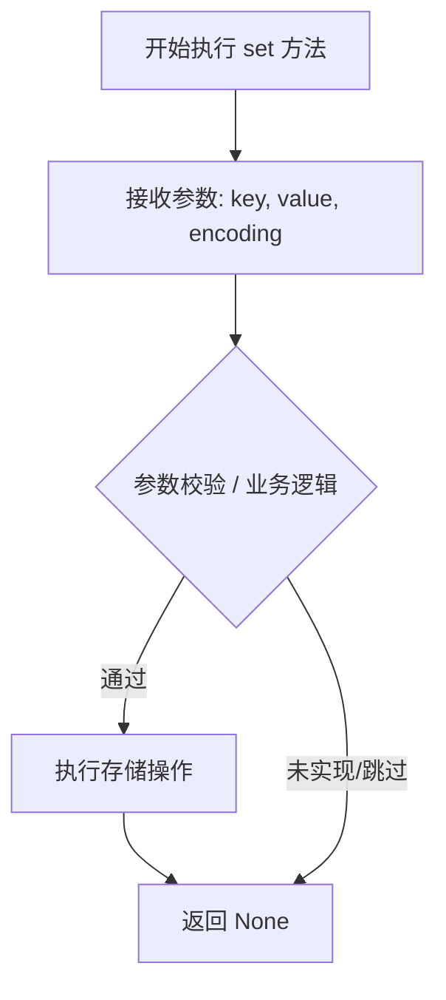

#### 带注释源码

```python
async def set(self, key: str, value: Any, encoding: str | None = None) -> None:
    """
    异步存储操作。
    
    将值 value 存储到键 key 下。
    
    参数:
        key (str): 存储键。
        value (Any): 存储的值。
        encoding (str | None): 可选的字符编码。
    """
    pass  # 这里是空实现，用于测试类注册流程
```


### `CustomStorage.delete`

该方法是一个异步方法，用于从存储中删除指定键对应的数据。

参数：

- `key`：`str`，要删除的键

返回值：`None`，无返回值

#### 流程图

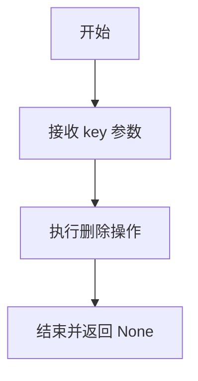

#### 带注释源码

```python
async def delete(self, key: str) -> None:
    """删除存储中指定键对应的数据。
    
    Args:
        key: 要删除的键名
        
    Returns:
        None
    """
    pass  # 目前实现为空操作，实际删除逻辑由子类实现
```


### `CustomStorage.has`

该方法是一个异步成员方法，用于检查存储中是否存在指定键对应的数据。

参数：

- `key`：`str`，要检查存在的键名称

返回值：`bool`，如果存储中存在指定键则返回 `True`，否则返回 `False`

#### 流程图

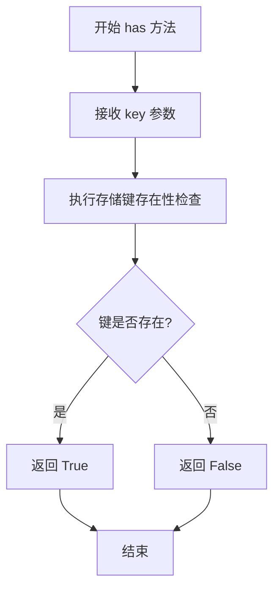

#### 带注释源码

```python
async def has(self, key: str) -> bool:
    """检查存储中是否存在指定键。

    参数:
        key: 要检查存在的键名称

    返回值:
        bool: 键存在返回 True，否则返回 False
    """
    return False
```


### `CustomStorage.clear`

这是一个异步方法，用于清除存储中的所有数据。在当前的测试实现中，该方法为空实现（pass），仅作为 Storage 接口的占位符实现。

#### 参数

无参数（仅包含 `self`）

#### 返回值

`None`，该方法不返回任何值，仅执行清除存储的异步操作。

#### 流程图

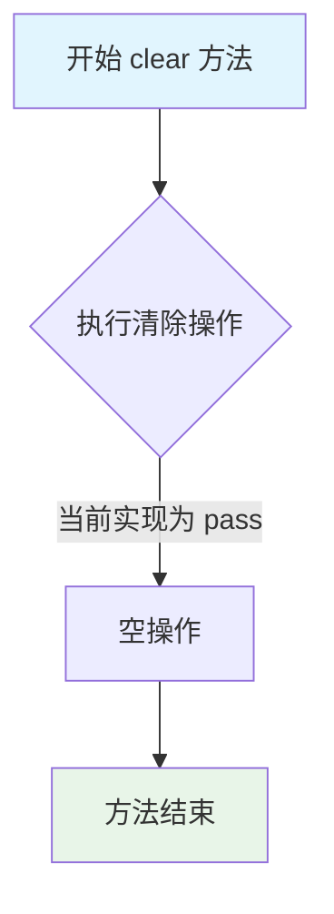

#### 带注释源码

```python
async def clear(self) -> None:
    """清除存储中所有数据的方法。
    
    这是 Storage 接口的实现方法，用于清空存储内容。
    当前实现为测试用的占位符，不执行实际清除操作。
    
    参数:
        无额外参数，仅使用 self 引用实例本身
        
    返回值:
        无返回值 (None)
    """
    pass  # 空实现，仅满足 Storage 接口契约
```

---

### 补充信息

#### 1. 文件整体运行流程

该代码文件是一个测试文件（`test_*.py`），主要用于测试 `StorageFactory` 类的功能以及各种存储类型的创建和注册。文件包含以下测试场景：

- 测试 Azure Blob 存储的创建（需要模拟器，跳过执行）
- 测试 Azure Cosmos DB 存储的创建（仅限 Windows 平台）
- 测试文件存储的创建
- 测试内存存储的创建
- 测试自定义存储类型的注册和创建
- 测试未知存储类型的错误处理
- 测试直接注册类的方式

#### 2. 类详细信息

**CustomStorage 类**（定义在测试函数内部）

| 字段/方法 | 类型 | 描述 |
|-----------|------|------|
| `__init__` | 方法 | 构造函数，接受任意关键字参数 |
| `find` | 方法 | 异步查找方法，返回匹配的文件路径迭代器 |
| `get` | 方法 | 异步获取方法，根据键获取值 |
| `set` | 方法 | 异步设置方法，存储键值对 |
| `delete` | 方法 | 异步删除方法，删除指定键 |
| `has` | 方法 | 异步检查方法，判断键是否存在 |
| `clear` | 方法 | 异步清除方法，清空所有存储数据 |
| `child` | 方法 | 创建子存储实例 |
| `keys` | 方法 | 获取所有键的列表 |
| `get_creation_date` | 方法 | 异步获取键的创建日期 |

#### 3. 关键组件信息

- **Storage 接口**：定义了存储抽象需要实现的方法集合
- **StorageFactory**：负责创建不同类型的存储实例
- **StorageConfig**：存储配置类，包含连接字符串、类型等配置
- **CustomStorage**：测试用自定义存储类，实现 Storage 接口

#### 4. 潜在技术债务或优化空间

1. **空实现方法**：`clear` 方法目前为空实现（pass），在实际使用中需要根据具体存储类型实现真正的清除逻辑
2. **测试类定义位置**：CustomStorage 类定义在测试函数内部，不便于复用，应提取为独立的测试辅助类
3. **缺少错误处理**：当前实现没有错误处理逻辑，如权限问题、连接失败等场景

#### 5. 其它项目

**设计目标与约束**：
- 实现 Storage 接口契约
- 支持异步操作
- 兼容 Python 类型注解

**错误处理与异常设计**：
- 当前无错误处理实现
- 在实际使用时应考虑 IO 异常、权限问题等

**数据流与状态机**：
- 该方法为无状态操作，不维护内部状态
- 异步操作不返回中间结果

**外部依赖与接口契约**：
- 依赖 `Storage` 抽象基类
- 依赖 `typing.Any` 和 `collections.abc.Iterator` 类型
- 依赖 `re.Pattern[str]` 用于文件模式匹配


### `CustomStorage.child`

该方法返回当前存储实例作为子存储，用于创建存储的层级结构。

参数：

- `name`：`str | None`，子存储的名称，用于标识子存储的标识符

返回值：`Storage`，返回当前存储实例本身作为子存储

#### 流程图

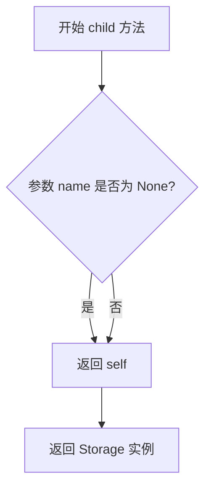

#### 带注释源码

```python
def child(self, name: str | None) -> "Storage":
    """返回当前存储实例作为子存储。
    
    该方法用于支持存储的层级结构，允许创建一个子存储实例。
    在当前实现中，无论传入的 name 参数是什么，都返回当前实例本身。
    
    Args:
        name: 子存储的可选名称标识符
        
    Returns:
        Storage: 返回当前 Storage 实例
    """
    return self
```


### `CustomStorage.keys`

该方法用于返回当前存储中所有键的列表。

参数： 无

返回值：`list[str]`，返回存储中所有键的列表

#### 流程图

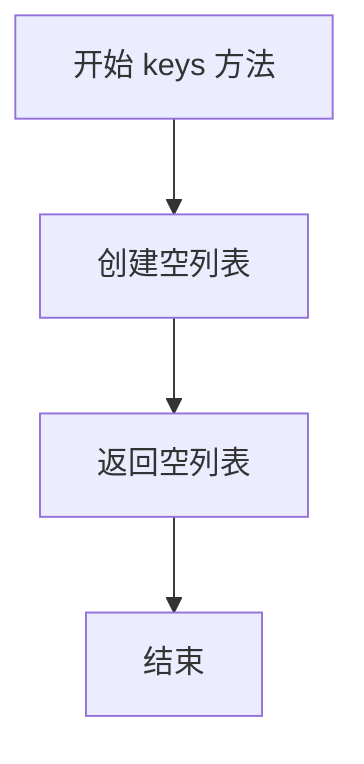

#### 带注释源码

```python
def keys(self) -> list[str]:
    """返回存储中所有键的列表。
    
    该方法遍历存储中的所有键并以列表形式返回。
    当前实现返回空列表，表示没有存储任何键。
    
    Returns:
        list[str]: 存储中所有键的列表
    """
    return []
```


### `CustomStorage.get_creation_date`

获取指定键对应的存储对象的创建日期。

参数：

- `key`：`str`，要获取创建日期的文件键

返回值：`str`，返回文件的创建日期字符串，格式为"YYYY-MM-DD HH:MM:SS +0000"

#### 流程图

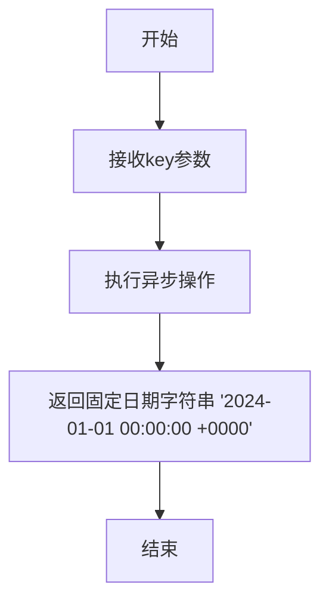

#### 带注释源码

```python
async def get_creation_date(self, key: str) -> str:
    """获取指定键对应的存储对象的创建日期。
    
    参数:
        key: str - 要获取创建日期的文件键
        
    返回:
        str - 文件的创建日期字符串，格式为 'YYYY-MM-DD HH:MM:SS +0000'
    """
    # 返回一个固定的日期字符串，表示文件的创建时间
    # 在实际实现中，这个方法应该查询存储后端来获取真实的创建日期
    return "2024-01-01 00:00:00 +0000"
```

## 关键组件


### StorageFactory 工厂架构

StorageFactory 是整个存储系统的核心工厂组件，负责根据 StorageConfig 配置创建不同类型的存储实例。它采用注册机制支持内置存储类型（AzureBlob、AzureCosmos、File、Memory）和自定义存储类型的动态注册与创建。

### StorageConfig 配置类

StorageConfig 是存储配置的数据类，用于定义存储实例的创建参数，包括存储类型（type）、连接字符串（connection_string）、基础目录（base_dir）、容器名称（container_name）、数据库名称（database_name）等属性。

### StorageType 枚举

StorageType 是存储类型的枚举定义，包含了系统支持的原生存储后端标识，如 AzureBlob、AzureCosmos、File、Memory 等，用于在 StorageConfig 中指定要创建的存储类型。

### create_storage 工厂函数

create_storage 是创建存储实例的核心入口函数，接收 StorageConfig 对象作为参数，根据配置中的 type 字段从注册表中查找对应的存储创建函数并执行，返回对应的存储实例。

### register_storage 注册函数

register_storage 用于动态注册自定义存储类型，支持两种注册方式：注册一个 lambda 工厂函数或直接注册一个 Storage 子类。注册时需要提供存储类型名称和创建函数或类。

### Storage 接口/抽象基类

Storage 定义了存储系统的抽象接口，声明了所有存储实现必须实现的方法：find（文件模式匹配）、get（获取内容）、set（设置内容）、delete（删除内容）、has（检查存在）、clear（清空）、child（子存储）、keys（键列表）、get_creation_date（获取创建日期）等。

### AzureBlobStorage 存储实现

AzureBlobStorage 是微软 Azure Blob 存储的客户端实现，用于与 Azure Blob 存储服务进行交互，提供对象存储能力。

### AzureCosmosStorage 存储实现

AzureCosmosStorage 是微软 Azure Cosmos DB 的客户端实现，用于与 Azure Cosmos 数据库服务进行交互，提供 NoSQL 文档数据库存储能力。

### FileStorage 存储实现

FileStorage 是本地文件系统存储的实现，将数据存储在指定的本地目录中，支持基于文件系统的持久化存储。

### MemoryStorage 存储实现

MemoryStorage 是内存存储的实现，将数据存储在进程内存中，适用于临时数据存储或测试场景。

### 测试夹具配置

测试文件中定义了两个测试夹具配置字符串：WELL_KNOWN_BLOB_STORAGE_KEY（Azure Blob 存储的开发测试连接字符串）和 WELL_KNOWN_COSMOS_CONNECTION_STRING（Azure Cosmos DB 的开发测试连接字符串），用于本地模拟器测试。

### pytest 跳过标记

测试中使用了 @pytest.mark.skip 和 @pytest.mark.skipif 条件跳过标记，分别用于在 Blob 存储模拟器不可用时跳过测试，以及仅在 Windows 平台运行 CosmosDB 模拟器测试。


## 问题及建议


### 已知问题

-   **硬编码的敏感信息**：代码中硬编码了测试用的连接字符串（`WELL_KNOWN_BLOB_STORAGE_KEY` 和 `WELL_KNOWN_COSMOS_CONNECTION_STRING`），虽然这些是已知测试凭据，但在生产代码仓库中暴露仍然存在安全风险。
-   **测试跳过导致覆盖不足**：`test_create_blob_storage` 使用 `@pytest.mark.skip` 完全跳过测试，`test_create_cosmosdb_storage` 仅在 Windows 环境运行，导致关键存储类型的创建逻辑未被验证。
-   **类型注解不完整**：`CustomStorage.find()` 方法返回 `Iterator[str]`，但作为 `Storage` 接口实现，应确保与基类定义一致；多处使用 `# type: ignore` 注释掩盖了潜在的静态类型问题。
-   **Mock 使用不规范**：`test_register_and_create_custom_storage` 中通过 `MagicMock` 设置非 `Storage` 接口的属性（如 `instance.initialized`），这种模式可能导致运行时行为与预期不符，且依赖了 mock 的动态特性。
-   **错误消息断言脆弱**：`test_create_unknown_storage` 中的错误消息正则匹配 `"StorageConfig\\.type 'unknown' is not registered in the StorageFactory\\."`，对错误文本格式强耦合，任何内部错误消息的修改都会导致测试失败。
-   **自定义存储实现不完整**：`CustomStorage` 类实现了 `Storage` 接口的异步方法，但 `find()` 方法是同步的，可能导致在异步上下文中的使用问题。

### 优化建议

-   **移除硬编码凭据**：将连接字符串迁移至环境变量或测试配置文件，使用 `pytest fixtures` 或 `conftest.py` 管理敏感测试数据。
-   **补充集成测试覆盖**：为被跳过的 Blob 和 CosmosDB 存储测试实现模拟服务或容器化测试环境（如 Azurite、CosmosDB Emulator），确保核心创建逻辑被验证。
-   **强化类型安全**：移除 `# type: ignore` 注释，补充完整的类型注解；将 `CustomStorage.find()` 改为异步方法或明确文档说明其同步特性。
-   **重构 Mock 测试**：使用 `unittest.mock.create_autospec` 或定义真实的测试存储类替代动态 Mock，提高测试可读性和可靠性。
-   **解耦错误消息断言**：使用 `pytest.raises` 的 `match` 参数时考虑更宽松的匹配模式，或直接验证异常类型而不依赖文本。
-   **分离同步/异步接口**：明确 `Storage` 接口的同步/异步方法边界，考虑提供统一的异步 API 或分离的同步/异步存储接口。

## 其它


### 设计目标与约束

该测试模块旨在验证 StorageFactory 类的功能正确性，确保能够正确创建和注册不同类型的存储实例。测试覆盖了 Azure Blob Storage、Azure Cosmos Storage、File Storage 和 Memory Storage 四种原生支持的存储类型，同时支持自定义存储的注册与创建。测试环境约束包括：Blob Storage 测试需要 Blob 模拟器支持，CosmosDB 测试仅在 Windows 环境下运行。

### 错误处理与异常设计

测试用例 `test_create_unknown_storage` 验证了错误处理机制。当尝试创建未注册的存储类型时，系统应抛出 `ValueError` 异常，错误消息格式为 "StorageConfig.type 'unknown' is not registered in the StorageFactory."。这确保了工厂模式在遇到未知类型时能够提供清晰的错误信息，帮助开发者快速定位配置问题。

### 数据流与状态机

测试数据流遵循以下路径：首先通过 `StorageConfig` 定义存储配置（包括类型、连接字符串、目录等参数），然后调用 `create_storage()` 工厂方法，该方法根据配置中的 `type` 字段查找并实例化对应的存储类。对于注册的自定义存储，使用 `register_storage()` 方法将存储类型名称与创建函数或类进行关联。状态机转换包括：配置创建 -> 存储注册 -> 存储实例化 -> 实例返回。

### 外部依赖与接口契约

测试代码依赖以下外部组件和接口契约：1) `Storage` 抽象基类，定义了存储的通用接口（find、get、set、delete、has、clear、child、keys、get_creation_date）；2) `StorageConfig` 数据类，用于配置存储参数；3) `StorageType` 枚举，定义支持的存储类型；4) 特定存储实现类（AzureBlobStorage、AzureCosmosStorage、FileStorage、MemoryStorage）；5) pytest 测试框架；6) unittest.mock 用于模拟自定义存储。Azure 连接使用模拟连接字符串，指向本地模拟器（127.0.0.1）。

### 配置管理

测试中的配置通过 `StorageConfig` 类传递，主要配置项包括：type（存储类型）、connection_string（连接字符串，用于 Azure 存储）、base_dir（基础目录，用于 File 和 Memory 存储）、container_name（容器名称，用于 Blob 存储）、database_name（数据库名称，用于 Cosmos 存储）。测试覆盖了不同存储类型所需的特定配置参数组合。

### 性能考虑

测试中使用了 `@pytest.mark.skip` 和 `@pytest.mark.skipif` 装饰器来跳过依赖外部服务的测试用例，这是出于性能和资源考虑的合理设计。测试重点在于验证逻辑正确性而非性能指标，未来可考虑添加性能基准测试。

### 安全考虑

测试代码中的连接字符串为测试目的设计，使用了公开已知的 Well-Known 密钥（如 devstoreaccount1 的默认密钥），这些仅用于本地模拟器测试。生产环境中应使用 Azure Key Vault 或其他安全机制管理敏感凭据。测试未涵盖凭据加密传输和存储安全验证。

    