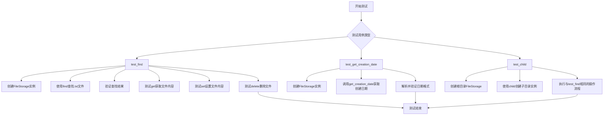
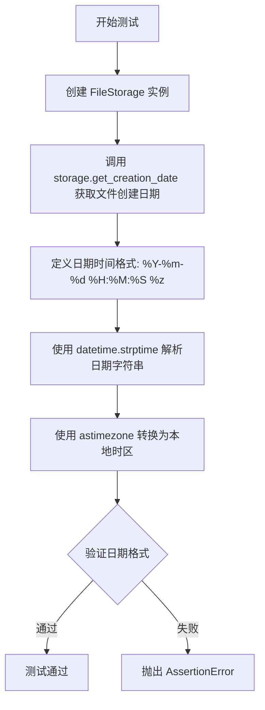

# `graphrag\tests\integration\storage\test_file_storage.py` 详细设计文档

该文件是FileStorage类的异步测试套件，包含三个测试用例分别验证文件查找、获取文件创建日期、以及子目录功能

## 整体流程



## 类结构

```
FileStorage (被测试类)
├── base_dir: 基础目录路径
├── find(): 查找文件方法
├── get(): 获取文件内容方法
├── set(): 设置文件内容方法
├── delete(): 删除文件方法
└── get_creation_date(): 获取文件创建日期方法
```

## 全局变量及字段


### `__dirname__`
    
存储当前测试文件的目录路径

类型：`str`
    


    

## 全局函数及方法


### `test_find`

这是一个异步测试函数，用于测试 `FileStorage` 类的核心功能，包括使用正则表达式查找 `.txt` 文件、读取文件内容、创建新文件、删除文件等操作，验证文件存储的完整生命周期。

参数：此函数没有参数

返回值：`None`，因为这是一个测试函数，不返回任何值

#### 流程图

```mermaid
flowchart TD
    A[开始] --> B[创建FileStorage实例<br/>base_dir='tests/fixtures/text/input']
    B --> C[调用find方法查找.txt文件<br/>file_pattern=re.compile(r".*\.txt$")]
    C --> D{断言: items == [str(Path('dulce.txt'))]}
    D -->|失败| E[测试失败]
    D -->|成功| F[调用get方法读取dulce.txt内容]
    F --> G{断言: len(output) > 0}
    G -->|失败| E
    G -->|成功| H[调用set方法创建test.txt<br/>内容='Hello, World!']
    H --> I[调用get方法读取test.txt]
    I --> J{断言: output == 'Hello, World!'}
    J -->|失败| E
    J -->|成功| K[调用delete方法删除test.txt]
    K --> L[调用get方法验证删除]
    L --> M{断言: output is None}
    M -->|失败| E
    M -->|成功| N[测试通过]
```

#### 带注释源码

```python
async def test_find():
    """测试FileStorage的文件查找、读取、写入和删除功能"""
    
    # 步骤1: 创建FileStorage实例，指定基础目录
    storage = FileStorage(base_dir="tests/fixtures/text/input")
    
    # 步骤2: 使用正则表达式查找所有.txt文件
    items = list(storage.find(file_pattern=re.compile(r".*\.txt$")))
    
    # 步骤3: 断言查找结果只包含dulce.txt
    assert items == [str(Path("dulce.txt"))]
    
    # 步骤4: 读取dulce.txt文件内容
    output = await storage.get("dulce.txt")
    
    # 步骤5: 断言文件内容不为空
    assert len(output) > 0

    # 步骤6: 创建新文件test.txt，写入"Hello, World!"
    await storage.set("test.txt", "Hello, World!", encoding="utf-8")
    
    # 步骤7: 读取刚创建的test.txt内容
    output = await storage.get("test.txt")
    
    # 步骤8: 断言写入的内容与读取的内容一致
    assert output == "Hello, World!"
    
    # 步骤9: 删除test.txt文件
    await storage.delete("test.txt")
    
    # 步骤10: 验证文件已被删除，读取返回None
    output = await storage.get("test.txt")
    assert output is None
```


### `test_get_creation_date`

该异步测试函数用于验证 `FileStorage` 类的 `get_creation_date` 方法能够正确获取文件的创建日期，并以指定的日期时间格式进行解析和验证。

参数：

- 该函数无参数

返回值：`None`，测试函数通过断言验证 `get_creation_date` 方法返回的日期字符串格式正确，无显式返回值

#### 流程图



#### 带注释源码

```python
# 异步测试函数，验证 FileStorage 获取文件创建日期的功能
async def test_get_creation_date():
    # 创建一个 FileStorage 实例，指定基础目录为测试fixtures路径
    storage = FileStorage(
        base_dir="tests/fixtures/text/input",
    )

    # 调用 get_creation_date 方法获取 dulce.txt 文件的创建日期
    # 返回值应为格式化的日期字符串，如 "2024-01-15 10:30:00 +0800"
    creation_date = await storage.get_creation_date("dulce.txt")

    # 定义预期的日期时间格式：
    # %Y-4位年份 %m-2位月份 %d-2位日期 %H-24小时制 %M-分钟 %S-秒 %z-时区偏移
    datetime_format = "%Y-%m-%d %H:%M:%S %z"
    
    # 使用 datetime.strptime 将字符串解析为 datetime 对象
    # astimezone() 方法将 datetime 转换为本地时区进行验证
    parsed_datetime = datetime.strptime(creation_date, datetime_format).astimezone()

    # 断言：重新格式化后的日期字符串应与原始返回的日期字符串完全一致
    # 这样验证了日期格式的正确性和时区处理的准确性
    assert parsed_datetime.strftime(datetime_format) == creation_date
```


### `test_child`

该函数是一个异步测试函数，用于测试 `FileStorage` 类的 `child` 方法。它创建一个根存储实例，然后通过 `child` 方法创建一个子存储实例，验证子存储能够正确地定位到指定目录下的文件，并执行基本的文件操作（查找、读取、写入、删除）。

参数：

- 该函数无参数

返回值：`None`，该函数为异步测试函数，通过 `assert` 语句进行断言验证，不返回具体值

#### 流程图

```mermaid
flowchart TD
    A[开始 test_child] --> B[创建根 FileStorage 实例, base_dir='']
    B --> C[调用 child 方法创建子存储实例, 路径为 'tests/fixtures/text/input']
    C --> D[使用 find 查找匹配 .txt 的文件]
    D --> E{断言: items == ['dulce.txt']}
    E -->|失败| F[抛出 AssertionError]
    E -->|成功| G[异步获取 dulce.txt 文件内容]
    G --> H{断言: 文件内容长度 > 0}
    H -->|失败| F
    H -->|成功| I[异步写入 test.txt 文件, 内容为 'Hello, World!']
    I --> J[异步读取 test.txt 文件]
    J --> K{断言: 内容 == 'Hello, World!'}
    K -->|失败| F
    K -->|成功| L[异步删除 test.txt 文件]
    L --> M[异步读取 test.txt 文件]
    M --> N{断言: 内容 is None}
    N -->|失败| F
    N -->|成功| O[测试通过]
    F --> P[测试失败]
```

#### 带注释源码

```python
# 异步测试函数 test_child
# 功能：测试 FileStorage 类的 child 方法是否正确创建子存储实例
async def test_child():
    # 创建一个根目录为空的 FileStorage 实例
    storage = FileStorage(base_dir="")
    # 使用 child 方法创建子存储实例，指向测试 fixture 目录
    storage = storage.child("tests/fixtures/text/input")
    # 使用正则表达式查找所有 .txt 文件
    items = list(storage.find(re.compile(r".*\.txt$")))
    # 断言：预期只找到 dulce.txt 文件
    assert items == [str(Path("dulce.txt"))]

    # 异步读取 dulce.txt 文件内容
    output = await storage.get("dulce.txt")
    # 断言：文件内容长度大于 0
    assert len(output) > 0

    # 异步写入新文件 test.txt，内容为 'Hello, World!'，使用 utf-8 编码
    await storage.set("test.txt", "Hello, World!", encoding="utf-8")
    # 异步读取刚写入的文件
    output = await storage.get("test.txt")
    # 断言：读取的内容与写入的内容一致
    assert output == "Hello, World!"
    # 异步删除 test.txt 文件
    await storage.delete("test.txt")
    # 异步尝试读取已删除的文件
    output = await storage.get("test.txt")
    # 断言：文件已删除，读取结果为 None
    assert output is None
```

## 关键组件


### FileStorage 类

FileStorage 是一个异步文件存储抽象类，提供文件的查找、读取、写入、删除以及获取文件创建日期等功能，支持子目录操作和正则表达式文件模式匹配。

### 异步文件操作

代码使用 Python 的 async/await 模式实现异步文件操作，包括 get()、set()、delete() 和 get_creation_date() 等方法，支持并发文件操作。

### 文件模式匹配

利用 re.compile() 正则表达式实现灵活的文件查找功能，test_find 和 test_child 中使用 r".*\.txt$" 模式匹配所有 txt 文件。

### 路径层级管理

通过 child() 方法支持目录的层级嵌套，test_child 演示了从空基础目录创建子存储实例的用法。

### 编码支持

set() 方法支持指定编码格式（encoding="utf-8"），确保文件内容的正确读写编码。

### 测试用例设计

包含三个测试函数：test_find 测试基础文件操作、test_get_creation_date 测试文件元数据获取、test_child 测试子目录功能，覆盖了 FileStorage 的核心功能场景。


## 问题及建议


### 已知问题

-   **测试隔离性不足**：test_find 和 test_child 中都创建和删除 test.txt 文件，若测试执行顺序改变或并发执行，可能导致测试相互干扰
-   **硬编码相对路径**：使用 "tests/fixtures/text/input" 相对路径，在不同工作目录下运行可能失败，应使用 __dirname__ 构建绝对路径
-   **缺少异步测试装饰器**：未使用 @pytest.mark.asyncio 装饰器，依赖 pytest-asyncio 的隐式行为，版本兼容性存在风险
-   **重复代码**：test_find 和 test_child 包含大量重复的测试逻辑（创建文件、读取、删除、验证），违反 DRY 原则
-   **无错误场景测试**：缺少对文件不存在、权限错误、编码错误等异常情况的测试覆盖
-   **资源清理风险**：虽然测试末尾调用 delete，但若测试中途失败，test.txt 文件可能残留影响后续测试
-   **断言信息缺失**：断言缺乏自定义错误消息，测试失败时难以快速定位问题

### 优化建议

-   使用 pytest fixtures 管理测试资源，实现自动 setup/teardown，确保测试隔离
-   引入 pathlib 和 __dirname__ 构建绝对路径：Path(__dirname__).parent.parent / "tests" / "fixtures" / "text" / "input"
-   明确添加 @pytest.mark.asyncio 装饰器，提高测试框架兼容性
-   提取公共测试逻辑到辅助函数，如 create_read_delete_workflow()
-   增加负面测试用例：测试不存在的文件、非法编码、无效路径等场景
-   为关键断言添加自定义错误消息，如 assert output == "Hello, World!", "内容不匹配"
-   考虑使用临时目录（tmp_path fixture）进行测试，避免污染真实文件系统

## 其它


### 设计目标与约束

本测试文件的设计目标是验证 `FileStorage` 类的核心文件操作功能，包括文件查找、读取、写入、删除以及获取文件元数据等能力。测试约束包括：测试数据位于 `tests/fixtures/text/input` 目录下，仅包含 `.txt` 文件，测试完成后会清理创建的临时文件。

### 错误处理与异常设计

测试用例验证了关键错误处理场景：当尝试获取不存在的文件时，`get` 方法应返回 `None` 而非抛出异常；删除不存在的文件应正常执行而不报错。测试通过断言确保 `FileStorage` 类在边界条件下的行为符合预期。

### 数据流与状态机

数据流遵循以下路径：测试创建 `FileStorage` 实例 → 调用 `find` 方法扫描文件 → 通过 `get` 方法读取文件内容 → 使用 `set` 方法写入新文件 → 最终通过 `delete` 方法清理测试数据。状态转换包括：初始状态 → 文件存在状态 → 文件修改状态 → 文件删除状态。

### 外部依赖与接口契约

本测试文件依赖以下外部组件：`FileStorage` 类（来自 `graphrag_storage.file_storage` 模块）、`re` 模块用于正则表达式匹配、`datetime` 模块用于日期解析、`pathlib.Path` 用于路径操作。测试假设 `FileStorage` 实现以下接口契约：`find(file_pattern)` 返回匹配的文件列表、`get(key)` 返回文件内容或 `None`、`set(key, value, encoding)` 写入文件、`delete(key)` 删除文件、`get_creation_date(key)` 返回创建日期、`child(path)` 返回子目录存储实例。

### 测试数据与 Fixture

测试使用 `tests/fixtures/text/input` 目录作为测试数据源，其中应包含 `dulce.txt` 文件作为已知测试数据。测试数据应为只读性质，不应在测试过程中修改原始测试文件。

### 并发与异步设计

所有测试函数均为异步函数（`async def`），表明 `FileStorage` 类的所有操作均为异步操作。测试验证了异步操作的正确执行，确保文件操作不会阻塞事件循环。

### 边界条件与极限情况

测试覆盖了以下边界条件：空 base_dir 情况（`test_child` 中 `storage = FileStorage(base_dir=""`）、使用正则表达式匹配所有 `.txt` 文件、验证文件内容长度大于 0、测试文件不存在时的返回值。

### 可维护性与测试隔离

每个测试函数相互独立，使用不同的 `FileStorage` 实例。`test_find` 和 `test_child` 都会创建临时测试文件 `test.txt` 并在测试结束后删除，确保测试之间的隔离性。测试使用绝对断言（`assert items == [str(Path("dulce.txt"))]`）确保测试的确定性。

    