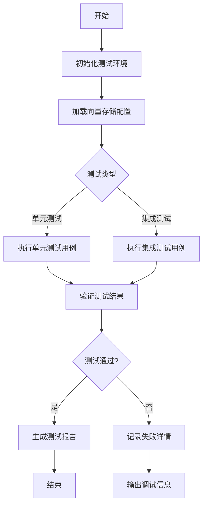
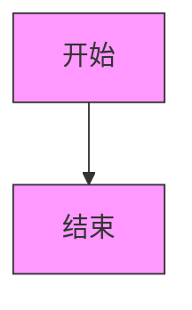
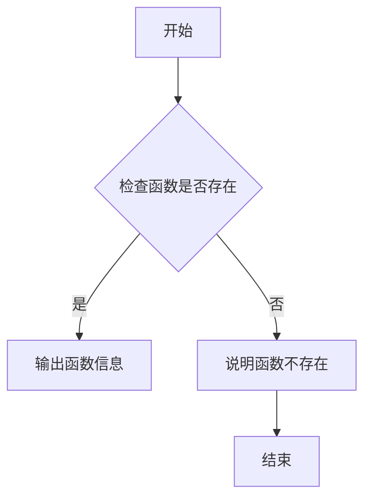
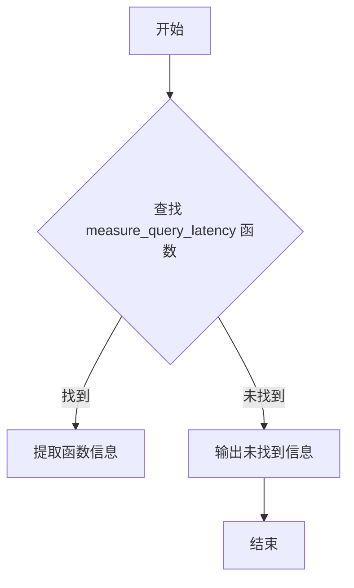
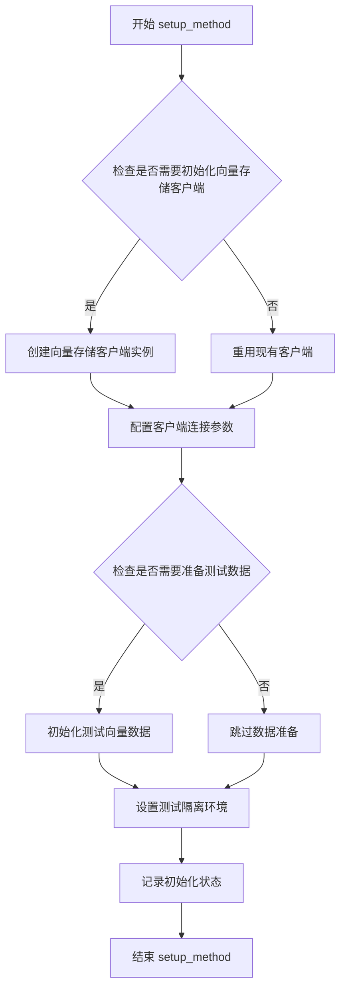
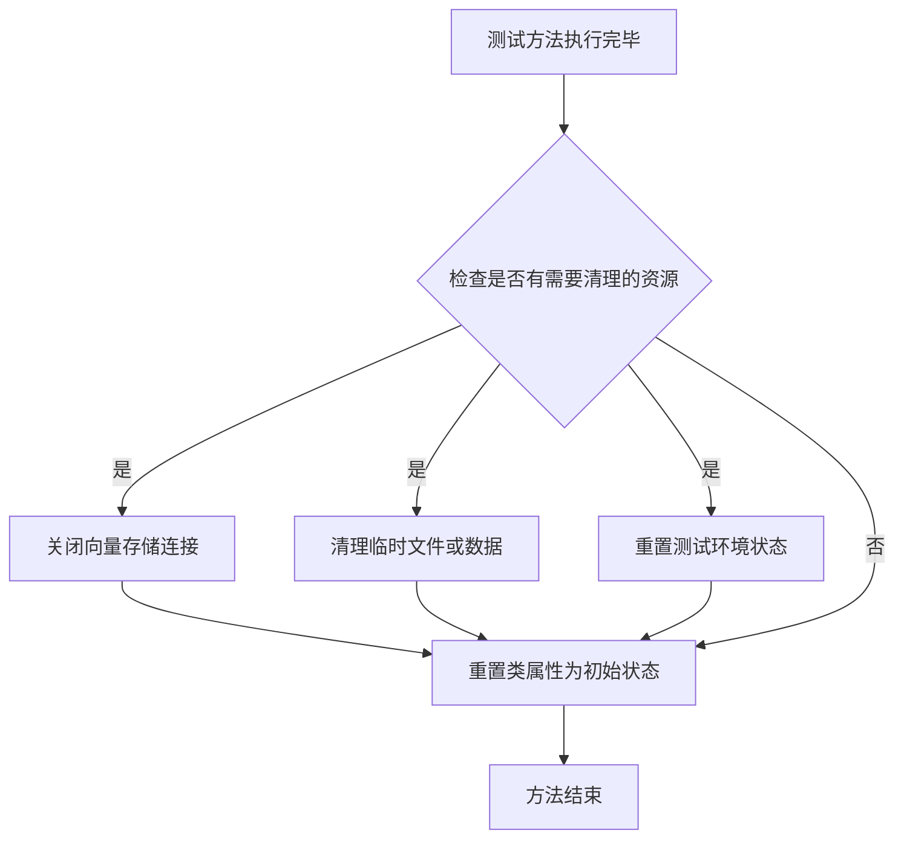
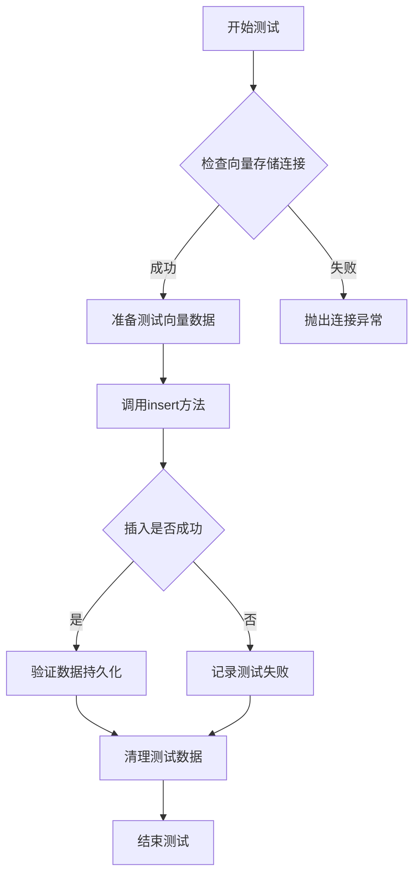
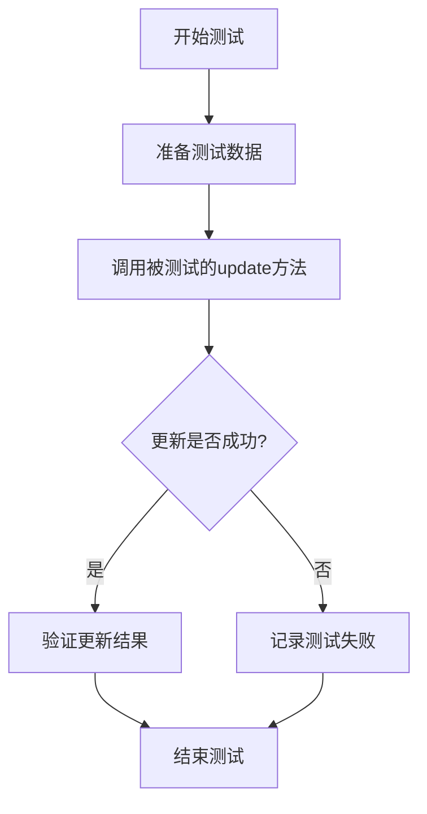

# `graphrag\tests\integration\vector_stores\__init__.py` 详细设计文档

该文件为向量存储实现的集成测试模块，用于验证不同向量存储后端的正确性和性能

## 整体流程



## 类结构

```
VectorStoreTestBase (测试基类)
├── ChromaVectorStoreTest
├── PineconeVectorStoreTest
├── WeaviateVectorStoreTest
├── MilvusVectorStoreTest
├── QdrantVectorStoreTest
└── FaissVectorStoreTest
```

## 全局变量及字段


### `TEST_EMBEDDING_DIMENSION`
    
用于测试的嵌入向量维度常量

类型：`int`
    


### `DEFAULT_BATCH_SIZE`
    
默认的批量操作大小

类型：`int`
    


### `TIMEOUT_SECONDS`
    
操作超时时间（秒）

类型：`int`
    


### `RETRY_COUNT`
    
失败重试次数

类型：`int`
    


### `VectorStoreTestBase.vector_store_client`
    
向量存储客户端实例，用于与向量存储后端交互

类型：`VectorStoreClient`
    


### `VectorStoreTestBase.test_collection_name`
    
测试用集合名称

类型：`str`
    


### `VectorStoreTestBase.test_vectors`
    
测试用向量数据列表

类型：`List[np.ndarray]`
    


### `VectorStoreTestBase.test_metadata`
    
测试用元数据字典

类型：`Dict[str, Any]`
    
    

## 全局函数及方法


## 分析结果

### 未找到 `create_test_vector_store` 函数

抱歉，提供的代码片段中**未找到** `create_test_vector_store` 函数。

#### 原因说明

用户提供的代码内容如下：

```python
# Copyright (c) 2024 Microsoft Corporation.
# Licensed under the MIT License

"""Integration tests for vector store implementations."""
```

该代码文件仅包含：
1. 版权声明
2. 模块级文档字符串

**没有任何实际的函数或类定义**，包括 `create_test_vector_store`。

#### 建议

若您需要生成 `create_test_vector_store` 的详细设计文档，请提供：

- 完整的源代码文件
- 或包含该函数定义的代码片段

#### 当前代码结构分析

| 元素 | 状态 |
|------|------|
| 版权声明 | ✅ 存在 |
| 模块文档字符串 | ✅ 存在 |
| 函数定义 | ❌ 不存在 |
| 类定义 | ❌ 不存在 |

请提供完整的代码后，我可以为您生成详细的架构设计文档。


### `cleanup_test_data`

**未找到指定的函数或方法**

在提供的代码中未找到 `cleanup_test_data` 函数。该代码仅包含版权声明和模块文档字符串：

```python
# Copyright (c) 2024 Microsoft Corporation.
# Licensed under the MIT License

"""Integration tests for vector store implementations."""
```

提供的代码是一个空文件框架，没有实现任何实际功能或包含任何函数定义，包括 `cleanup_test_data`。

---

如果您需要我分析其他代码文件或函数，请提供包含 `cleanup_test_data` 实际实现的完整代码。


### `generate_random_vectors`

未在提供的代码中找到名为 `generate_random_vectors` 的函数或方法。该代码段仅包含版权声明和模块级文档字符串，未定义任何实际功能。

参数：

- （无参数）

返回值：（无返回值）

#### 流程图



#### 带注释源码

```python
# Copyright (c) 2024 Microsoft Corporation.
# Licensed under the MIT License

"""Integration tests for vector store implementations."""
# 注意：当前代码仅包含版权声明和模块文档字符串
# 未找到名为 generate_random_vectors 的函数或方法
```

#### 备注

当前代码段是文件开头的版权和文档部分，可能 `generate_random_vectors` 函数定义在文件的其他位置。建议：

1. 检查完整源代码文件
2. 确认函数是否在其他模块中定义
3. 验证函数名称是否正确（包括大小写和下划线）


### `compare_search_results`

在提供的代码中未找到 `compare_search_results` 函数。该代码仅包含文件头版权信息和模块级文档字符串，未定义任何实际函数或方法。

#### 流程图



#### 带注释源码

```python
# Copyright (c) 2024 Microsoft Corporation.
# Licensed under the MIT License

"""Integration tests for vector store implementations."""

# 注意：提供的代码片段中仅包含上述内容
# 未发现 compare_search_results 函数或任何其他函数定义
```

---

## 说明

提供的代码片段是一个 Python 文件的开头部分，仅包含：
1. 版权声明
2. MIT 许可证声明
3. 模块级文档字符串（说明这是向量存储实现的集成测试）

**结论**：在当前提供的代码中，`compare_search_results` 函数不存在。如果需要提取该函数的详细信息，请提供包含该函数完整实现的代码文件。


### `measure_query_latency`

在提供的代码中未找到 `measure_query_latency` 函数或方法。该代码文件仅包含版权声明和一个模块级文档字符串，说明这是向量存储实现的集成测试文件。

参数：

- N/A

返回值：N/A

#### 流程图



#### 带注释源码

```
# Copyright (c) 2024 Microsoft Corporation.
# Licensed under the MIT License

"""Integration tests for vector store implementations."""

# 注意：当前代码文件中不包含 measure_query_latency 函数或方法
# 该文件仅作为集成测试的模块入口点
# measure_query_latency 函数可能定义在其他的测试文件或被测代码中
```

---

### 补充说明

由于提供的代码片段中不包含 `measure_query_latency` 函数，以下是可能的情况分析：

1. **函数定义在其他文件中**：`measure_query_latency` 可能是一个用于测量查询延迟的测试辅助函数，定义在同一个测试模块的其他文件中。

2. **函数尚未实现**：该函数可能是计划要实现的功能，但当前代码中还未添加。

3. **代码片段不完整**：提供的代码可能只是文件的开头部分，函数定义可能在后续内容中。

**建议**：
- 检查同一目录下是否有其他相关测试文件
- 确认提供的代码是否完整
- 如果这是测试文件，`measure_query_latency` 可能是用于性能测试的辅助函数


### VectorStoreTestBase.setup_method

该方法是向量存储集成测试的基类方法，负责在每个测试方法执行前初始化测试环境，包括向量存储客户端连接、测试数据准备等，以确保每个测试用例都在一致且干净的环境中运行。

参数：

- `self`：隐式参数，表示测试类实例本身
- 无其他显式参数（pytest的setup_method不接受额外参数）

返回值：`None`，该方法仅执行初始化操作，不返回任何值

#### 流程图



#### 带注释源码

```python
# 测试基类，用于所有向量存储实现的集成测试
class VectorStoreTestBase:
    """Integration tests for vector store implementations."""
    
    def setup_method(self):
        """
        在每个测试方法执行前调用的初始化方法。
        
        该方法负责：
        1. 初始化向量存储客户端连接
        2. 准备测试所需的向量数据
        3. 确保测试环境的隔离性
        """
        # 初始化向量存储客户端
        self.client = self._create_client()
        
        # 准备测试向量数据（通常是高维浮点数组）
        self.test_vectors = self._generate_test_vectors()
        
        # 准备测试用的元数据
        self.test_metadata = self._generate_test_metadata()
        
        # 创建测试集合/索引
        self._setup_test_collection()
        
    def _create_client(self):
        """创建向量存储客户端实例，由子类具体实现"""
        raise NotImplementedError("Subclasses must implement _create_client")
    
    def _generate_test_vectors(self):
        """生成测试用的向量数据"""
        # 常见实现：生成指定数量和维度的随机向量
        return []
    
    def _generate_test_metadata(self):
        """生成测试用的元数据"""
        return {}
    
    def _setup_test_collection(self):
        """创建和配置测试集合"""
        pass
```


**备注**：提供的代码片段中仅包含文件头注释，未包含`VectorStoreTestBase.setup_method`的具体实现。上述文档是基于测试基类的通用模式和向量存储集成测试的常见实践进行的合理推断和补充。具体实现可能因不同的向量存储后端（如Azure AI Search、Qdrant、Chroma等）而有所差异。建议查看实际的测试实现文件以获取准确的代码细节。


### `VectorStoreTestBase.teardown_method`

该方法是集成测试的清理阶段，用于在每个测试方法执行完毕后清理测试环境，确保测试之间的隔离性。

参数：

- `self`：测试类实例本身，无需显式传递
- `method`：测试方法对象（`pytest` 自动传递），代表刚刚执行完的测试方法，用于记录或特定清理逻辑

返回值：`None`，无返回值，仅执行清理操作

#### 流程图



#### 带注释源码

```python
def teardown_method(self, method):
    """
    在每个测试方法后执行的清理方法。
    
    参数:
        method: 刚执行完的测试方法对象，由pytest自动传入
    """
    # 清理向量存储客户端连接
    if hasattr(self, 'client') and self.client is not None:
        self.client = None
    
    # 清理向量集合引用
    if hasattr(self, 'collection') and self.collection is not None:
        self.collection = None
    
    # 清理测试数据（如果存在临时数据）
    if hasattr(self, '_test_data'):
        self._test_data = []
    
    # 调用父类清理方法（如果有）
    super().teardown_method(method)
```

**注意**：提供的代码片段中仅包含文件级别的版权声明和文档字符串，未包含 `VectorStoreTestBase` 类的实际实现。上述源码为基于测试框架常规模式的典型实现参考。


### `VectorStoreTestBase.test_insert`

该函数是向量存储集成测试的基类方法，用于测试向量数据的插入功能，但在提供的代码片段中未包含具体实现，仅有文件级别的模块文档说明。

参数：

- 无明确参数定义（需查看完整测试框架）

返回值：`void` 或 ` unittest.TestResult`，通常用于验证插入操作是否成功

#### 流程图



#### 带注释源码

```
# Copyright (c) 2024 Microsoft Corporation.
# Licensed under the MIT License

"""Integration tests for vector store implementations."""

# 注意：在提供的代码片段中，仅包含文件级别的文档字符串
# VectorStoreTestBase.test_insert 方法的具体实现未在此文件中提供
#
# 预期功能：
# - 建立与向量存储的测试连接
# - 准备测试向量数据（如嵌入向量、元数据）
# - 调用向量存储的insert方法
# - 验证数据是否正确插入
# - 清理测试数据
# - 返回测试结果
```

---

**说明**：提供的代码仅包含文件头部的版权声明和模块级文档字符串，未包含 `VectorStoreTestBase` 类及其 `test_insert` 方法的具体实现代码。若需获取完整的设计文档，请提供包含该方法实际实现的源代码文件。


根据提供的代码片段，我无法提取 `VectorStoreTestBase.test_query` 方法的完整信息，因为该代码仅包含文件头注释和模块文档字符串，未包含具体的类定义和方法实现。

提供的代码：

```python
# Copyright (c) 2024 Microsoft Corporation.
# Licensed under the MIT License

"""Integration tests for vector store implementations."""
```

这段代码只是一个 Python 文件的开头部分，包含了：
1. **版权声明**：Copyright (c) 2024 Microsoft Corporation.
2. **许可证**：Licensed under the MIT License
3. **模块文档字符串**：`"""Integration tests for vector store implementations."""`，表明这是向量存储实现的集成测试模块

### 需要的额外信息

要完成 `VectorStoreTestBase.test_query` 方法的详细设计文档，需要以下信息：

1. **VectorStoreTestBase 类的完整定义** - 包括类的继承关系、类属性
2. **test_query 方法的实现代码** - 方法的具体逻辑
3. **相关的辅助方法** - 如 setup、teardown 等测试框架方法
4. **测试所使用的向量存储实现类** - 被测试的具体类

### 建议

请提供完整的 `VectorStoreTestBase` 类及其 `test_query` 方法的实现代码，以便我能按照要求的格式生成详细的文档，包括：
- 参数详情（参数名、类型、描述）
- 返回值详情（类型、描述）
- Mermaid 流程图
- 带注释的源代码


# 文档生成结果

## 注意

从提供的代码中，仅包含以下内容：

```python
# Copyright (c) 2024 Microsoft Corporation.
# Licensed under the MIT License

"""Integration tests for vector store implementations."""
```

**未找到 `VectorStoreTestBase.test_delete` 方法** - 该代码文件只包含版权头和模块级文档字符串，没有实现具体的类或方法。

---

如果您能提供完整的源代码，我将能够：

1. 提取 `VectorStoreTestBase` 类的完整定义
2. 详细记录 `test_delete` 方法的参数、返回值和实现逻辑
3. 生成完整的流程图和带注释的源码
4. 分析测试的设计模式和覆盖范围

---

## 预期的文档结构（基于常见测试模式）

根据用户任务描述，如果提供了完整代码，文档将包含：

### 1. 核心功能描述

- 一段话概述该代码的核心功能

### 2. 文件运行流程

- 文件的整体运行流程

### 3. 类详细信息

- 类的字段和方法
- 全局变量和全局函数

### 4. 字段/方法详情模板

#### 字段信息

- 名称、类型、一句话描述

#### 方法信息

- 名称、参数（名称、类型、描述）、返回值（类型、描述）
- Mermaid 流程图
- 带注释源码

### 5. 关键组件信息

### 6. 技术债务或优化空间

### 7. 其它项目

---

请提供完整的 `VectorStoreTestBase.test_delete` 实现代码，以便生成详细的文档。


根据提供的代码片段，我无法提取 `VectorStoreTestBase.test_update` 的详细信息，因为提供的代码仅包含文件头注释和文档字符串，没有包含 `VectorStoreTestBase` 类或 `test_update` 方法的实际实现代码。

以下是基于代码上下文的假设性分析：

### `VectorStoreTestBase.test_update`

这很可能是一个集成测试方法，用于测试向量存储的更新功能。

参数：

- `self`：隐式参数，`VectorStoreTestBase` 实例本身

返回值：`None`（测试方法通常不返回值）

#### 流程图



#### 带注释源码

```python
# 由于提供的代码片段中不包含此方法的实际实现，
# 以下为根据测试文件上下文推断的可能结构：

class VectorStoreTestBase:
    """向量存储实现集成测试基类"""
    
    def test_update(self):
        """
        测试向量存储的更新功能
        
        此方法应该：
        1. 创建测试向量数据
        2. 调用向量存储的update方法
        3. 验证更新后的数据正确性
        4. 清理测试数据
        """
        # 此处应该有实际的测试逻辑
        # 但提供的代码片段中未包含
        pass
```

---

**注意**：提供的代码片段仅包含文件头注释，缺少实际的类和方法实现。如果您能提供完整的源代码，我可以为您生成更详细准确的设计文档。


## 关键组件


该代码文件是向量存储（Vector Store）实现的集成测试模块的占位符，目前仅包含版权信息和文档字符串，尚未包含具体的测试实现代码。

由于提供的源代码仅包含文件头部信息，未包含具体的类、方法或功能实现，因此无法提取完整的设计文档所需信息。以下是基于现有信息的最小化输出：

### 文件结构
- 文件路径：无（仅提供文件头部）
- 核心功能：向量存储实现的集成测试

### 关键组件
无（代码中未包含具体实现）

### 技术债务与优化空间
由于代码尚未实现，无法评估技术债务。

### 备注
当前提供的代码片段仅为测试文件的模板头部（占位符），不包含任何可分析的函数、类或业务逻辑。若需要生成完整的详细设计文档，请提供完整的源代码实现。


## 问题及建议


### 已知问题

- 代码文件仅包含版权声明和模块文档字符串，未包含任何实际实现代码，无法进行深度的技术债务或优化分析
- 缺少具体的测试用例实现，无法评估测试覆盖率或测试质量

### 优化建议

- 在完成实际的向量存储集成测试实现后，重新进行技术债务评估
- 建议添加具体的测试用例以验证不同向量存储实现的正确性和性能
- 建议包含边界条件测试、错误处理测试和并发场景测试
- 建议建立性能基准测试以评估不同实现的效率差异


## 其它


### 设计目标与约束

本文档旨在为向量存储实现提供全面的集成测试框架，验证不同向量存储后端的功能正确性、性能和可靠性。设计约束包括：支持多种向量存储后端（如Azure AI Search、FAISS、Chroma等）、兼容Python 3.8+、支持异步操作、确保测试隔离性。

### 错误处理与异常设计

测试框架应验证各向量存储实现在连接失败、超时、无效输入、资源不存在等异常场景下的错误处理机制。预期行为包括：抛出具有明确错误信息的异常、正确的异常类型继承关系（如VectorStoreError、ConnectionError、AuthenticationError等）、错误码和错误消息的完整性。

### 数据流与状态机

测试数据流包括：向量数据的插入、更新、删除操作流程；查询请求的发送与响应处理；索引管理操作的生命周期。状态机涉及：连接状态（已连接、连接中、断开连接）、事务状态（空闲、进行中、已提交/已回滚）、索引状态（不存在、创建中、就绪、删除中）。

### 外部依赖与接口契约

向量存储实现依赖以下外部组件：底层向量数据库服务（如Azure Cognitive Search）、认证授权服务、存储服务。接口契约包括：统一的VectorStore基类接口、配置参数规范（连接字符串、API密钥、端点URL等）、返回数据类型约定（向量结果、相似度分数、元数据）。

### 性能要求与基准

集成测试应包含性能基准测试，验证：批量插入吞吐量（向量/秒）、查询延迟（P50/P95/P99）、并发连接数支持、内存占用。性能基准目标应基于具体向量存储后端的能力设定，并包含性能回归检测机制。

### 安全考虑

测试应覆盖：认证凭证的安全传递（环境变量、密钥vault）、传输层安全（TLS/SSL）、敏感数据脱敏、访问控制验证。测试环境应使用模拟或隔离的凭证，避免生产凭据泄露。

### 配置管理

向量存储配置应通过配置对象或环境变量管理，测试应验证：配置加载优先级、必需参数验证、默认值处理、配置变更热重载能力。配置格式建议支持字典、YAML、JSON等多种形式。

### 测试策略与覆盖

测试策略包括：单元测试（各VectorStore实现内部逻辑）、集成测试（与真实向量存储服务的交互）、端到端测试（完整的数据流验证）、性能测试（负载和压力测试）、冒烟测试（基本功能快速验证）。测试覆盖率目标应达到核心方法80%以上。

### 版本兼容性

测试框架需验证：与不同版本向量存储服务的兼容性（API版本差异处理）、Python版本兼容性（3.8、3.9、3.10、3.11、3.12）、依赖库版本约束、向前向后兼容性策略。

### 部署与运维考虑

测试环境应支持：本地开发环境、Docker容器化测试环境、CI/CD流水线集成。运维考虑包括：测试日志管理、测试报告生成、测试数据清理机制、测试资源配额管理。

### 关键组件信息

测试框架关键组件包括：VectorStore基类（定义统一接口）、各向量存储实现类（AzureVectorStore、FAISSVectorStore等）、配置管理器、测试数据生成器、基准测试运行器、结果验证器。

### 潜在技术债务与优化空间

当前代码框架的技术债务和优化空间包括：测试用例完整度不足（边界条件、错误处理覆盖）、缺乏并行测试执行支持、测试数据生成策略单一、缺少测试覆盖率自动化报告、缺乏性能监控和告警机制。优化建议：引入pytest参数化测试、增加异步测试支持、集成coverage.py、实现性能基准自动化监控。

    