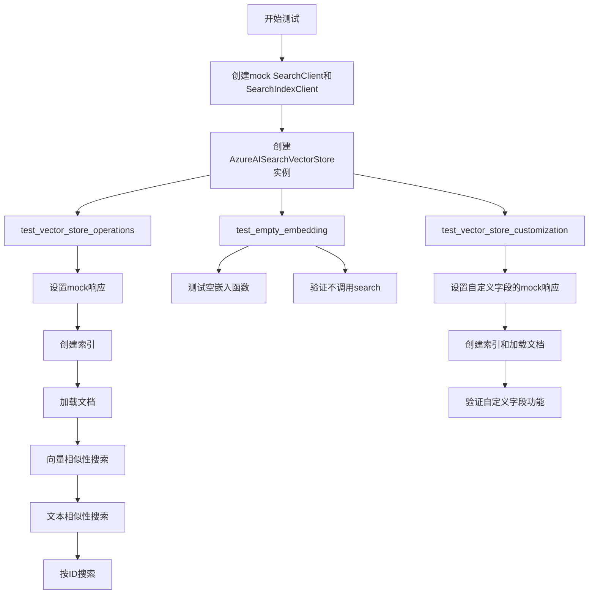
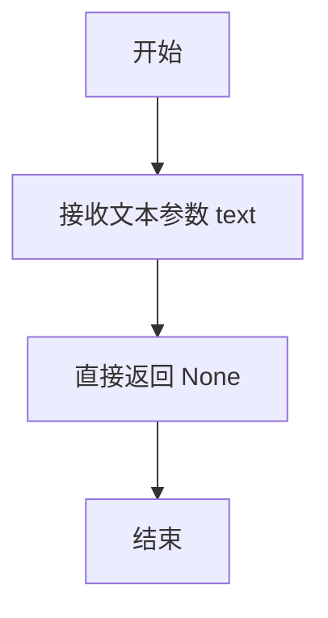
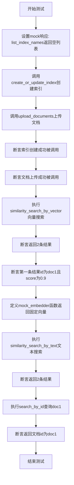
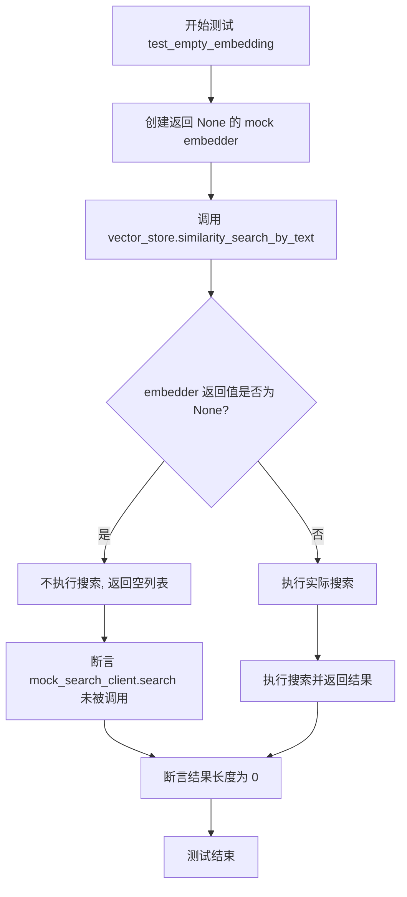
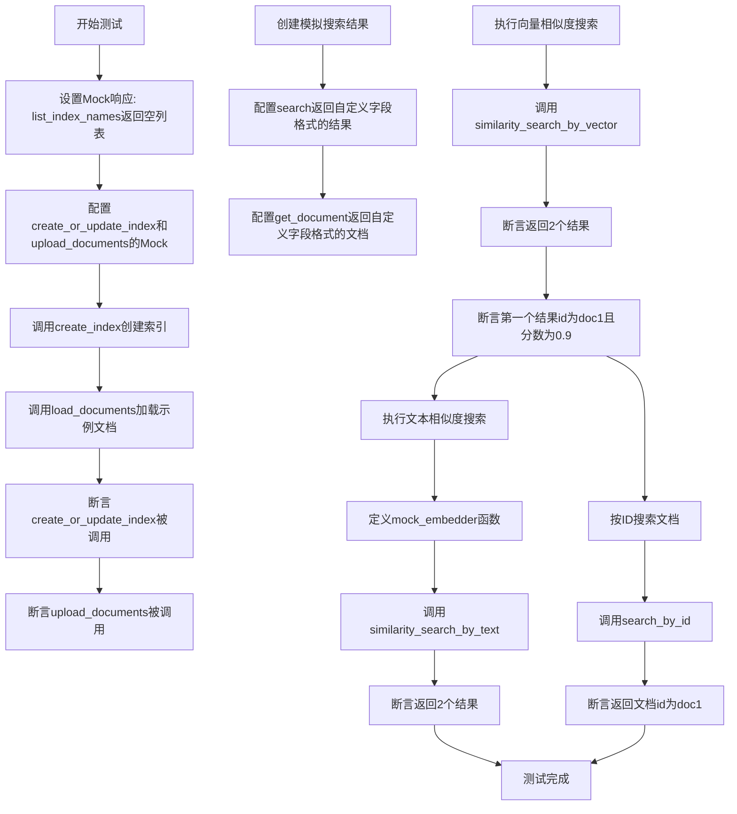

# `graphrag\tests\integration\vector_stores\test_azure_ai_search.py` 详细设计文档

这是一个针对Azure AI Search向量存储实现的集成测试文件，测试了向量存储的基本操作、相似性搜索、文档加载和自定义字段配置等功能。

## 整体流程



## 类结构

```
TestAzureAISearchVectorStore (测试类)
├── Fixtures
│   ├── mock_search_client
│   ├── mock_index_client
│   ├── vector_store
│   ├── vector_store_custom
│   └── sample_documents
└── Test Methods
    ├── test_vector_store_operations
    ├── test_empty_embedding
    └── test_vector_store_customization
```

## 全局变量及字段


### `TEST_AZURE_AI_SEARCH_URL`
    
Azure AI Search服务的URL地址，从环境变量获取，默认为测试用URL

类型：`str`
    


### `TEST_AZURE_AI_SEARCH_KEY`
    
Azure AI Search服务的API密钥，从环境变量获取，默认为测试用密钥

类型：`str`
    


    

## 全局函数及方法


### `mock_embedder`

这是一个用于测试的模拟嵌入函数，接收文本字符串并返回固定长度的浮点数列表，模拟真实的文本向量化过程。

参数：

- `text`：`str`，输入的文本字符串，需要被向量化的文本内容

返回值：`list[float]`，返回固定长度的浮点数列表，代表文本的向量表示

#### 流程图

```mermaid
flowchart TD
    A[开始 mock_embedder] --> B{输入文本}
    B -->|text: str| C[返回固定向量]
    C --> D[结果: list[float]]
    D --> E[结束]
    
    style A fill:#f9f,color:#333
    style E fill:#9f9,color:#333
```

#### 带注释源码

```python
# 定义一个简单的文本嵌入器函数，用于测试
# 这是一个模拟函数，返回固定的向量值 [0.1, 0.2, 0.3, 0.4, 0.5]
# 模拟真实的嵌入模型将文本转换为向量表示的过程
def mock_embedder(text: str) -> list[float]:
    """模拟文本嵌入函数的测试辅助方法。
    
    参数:
        text: 输入的文本字符串
        
    返回:
        固定长度的浮点数列表，表示文本的向量嵌入
    """
    return [0.1, 0.2, 0.3, 0.4, 0.5]
```

---

### 整体文件运行流程

本文件是 Azure AI Search 向量存储的集成测试文件，主要测试流程如下：

1. **测试准备阶段**：通过 pytest fixtures 创建模拟的 SearchClient 和 SearchIndexClient
2. **实例化向量存储**：创建 `AzureAISearchVectorStore` 实例并建立连接
3. **索引操作测试**：测试 `create_index()` 方法创建或更新索引
4. **文档操作测试**：测试 `load_documents()` 方法上传文档
5. **相似度搜索测试**：
   - 通过向量搜索：`similarity_search_by_vector()`
   - 通过文本搜索：`similarity_search_by_text()`（使用 `mock_embedder`）
6. **ID查询测试**：测试 `search_by_id()` 方法

---

### 关键组件信息

| 组件名称 | 描述 |
|---------|------|
| `AzureAISearchVectorStore` | Azure AI Search 向量存储实现类 |
| `VectorStoreDocument` | 向量存储文档数据模型 |
| `mock_search_client` | 模拟 Azure Search Client 的 pytest fixture |
| `mock_index_client` | 模拟 Azure Search Index Client 的 pytest fixture |
| `mock_embedder` | 模拟文本嵌入函数的测试辅助函数 |

---

### 潜在的技术债务或优化空间

1. **重复代码**：`mock_embedder` 函数在两个测试方法中重复定义，应提取为共享的 pytest fixture
2. **硬编码向量值**：测试使用的向量值是硬编码的，建议使用随机生成或参数化
3. **缺乏错误场景测试**：当前测试主要覆盖正常流程，缺少对异常情况的测试（如网络超时、服务不可用等）
4. **测试数据单一**：使用的测试向量维度较小（5维），实际生产环境通常使用更高维度（如1536维）

---

### 其它项目

#### 设计目标与约束

- 测试目标：验证 `AzureAISearchVectorStore` 与 Azure AI Search 服务的集成功能
- 使用 Mock 对象隔离外部依赖，确保测试的可重复性和稳定性

#### 错误处理与异常设计

- `none_embedder` 测试验证了当嵌入函数返回 `None` 时的降级处理逻辑
- 测试确认此时不会调用搜索客户端，返回空结果列表

#### 数据流与状态机

```
实例化 → 连接 → 创建索引 → 加载文档 → 搜索/查询
```

#### 外部依赖与接口契约

- 依赖 `graphrag_vectors` 包中的 `VectorStoreDocument` 和 `AzureAISearchVectorStore`
- 依赖 `unittest.mock` 和 `pytest` 进行测试隔离和模拟


### `none_embedder`

这是一个在测试方法内部定义的本地模拟嵌入器函数，用于测试当嵌入器返回 `None` 时向量存储的行为。该函数接受文本字符串作为输入，但始终返回 `None`，模拟了一个"失败"或"空"的嵌入结果场景。

参数：

- `text`：`str`，输入的文本字符串，需要进行向量化处理的查询文本

返回值：`None`，该函数不返回任何有效的向量数据

#### 流程图



#### 带注释源码

```python
def none_embedder(text: str) -> None:
    """
    模拟嵌入器函数，用于测试场景。
    
    该函数故意返回 None，用于测试当嵌入器无法生成有效向量时，
    similarity_search_by_text 方法的容错处理逻辑。
    
    参数:
        text: str - 输入的文本字符串
        
    返回:
        None - 表示嵌入失败或嵌入器未提供有效输出
    """
    return None
```


### `TestAzureAISearchVectorStore.test_vector_store_operations`

这是一个异步测试方法，用于验证 Azure AI Search 向量存储的基本操作流程，包括索引创建、文档加载、向量相似度搜索、文本相似度搜索以及按 ID 查询文档等核心功能。

参数：

-  `self`：方法本身的引用，表示测试类实例
-  `vector_store`：`AzureAISearchVectorStore`，通过 fixture 注入的待测向量存储实例
-  `sample_documents`：`List[VectorStoreDocument]`，通过 fixture 注入的示例文档列表，用于测试文档操作
-  `mock_search_client`：`MagicMock`，通过 fixture 注入的模拟 Azure Search 客户端
-  `mock_index_client`：`MagicMock`，通过 fixture 注入的模拟 Azure Search Index 客户端

返回值：`None`，该方法为测试方法，不返回任何值

#### 流程图



#### 带注释源码

```python
async def test_vector_store_operations(
    self, vector_store, sample_documents, mock_search_client, mock_index_client
):
    """Test basic vector store operations with Azure AI Search."""
    # Step 1: Setup mock responses
    # 设置模拟索引客户端的list_index_names返回空列表，表示索引不存在
    mock_index_client.list_index_names.return_value = []
    # 模拟create_or_update_index方法
    mock_index_client.create_or_update_index = MagicMock()
    # 模拟upload_documents方法
    mock_search_client.upload_documents = MagicMock()

    # Step 2: Setup search results mock
    # 定义模拟的搜索结果，包含两个文档及其向量和搜索分数
    search_results = [
        {
            "id": "doc1",
            "vector": [0.1, 0.2, 0.3, 0.4, 0.5],
            "@search.score": 0.9,
        },
        {
            "id": "doc2",
            "vector": [0.2, 0.3, 0.4, 0.5, 0.6],
            "@search.score": 0.8,
        },
    ]
    # 配置搜索客户端的search方法返回模拟结果
    mock_search_client.search.return_value = search_results

    # Step 3: Setup get_document mock
    # 配置get_document方法返回doc1的文档数据
    mock_search_client.get_document.return_value = {
        "id": "doc1",
        "vector": [0.1, 0.2, 0.3, 0.4, 0.5],
    }

    # Step 4: Test index creation
    # 调用create_index方法创建索引
    vector_store.create_index()
    # 调用load_documents方法加载示例文档
    vector_store.load_documents(sample_documents)
    # 断言create_or_update_index方法被调用过
    assert mock_index_client.create_or_update_index.called
    # 断言upload_documents方法被调用过
    assert mock_search_client.upload_documents.called

    # Step 5: Test similarity search by vector
    # 使用给定向量执行相似度搜索，k=2表示返回前2个最相似结果
    vector_results = vector_store.similarity_search_by_vector(
        [0.1, 0.2, 0.3, 0.4, 0.5], k=2
    )
    # 断言返回结果数量为2
    assert len(vector_results) == 2
    # 断言第一条结果的文档id为doc1
    assert vector_results[0].document.id == "doc1"
    # 断言第一条结果的相似度分数为0.9
    assert vector_results[0].score == 0.9

    # Step 6: Define mock embedder function
    # 定义一个简单的文本嵌入函数，用于测试文本搜索
    def mock_embedder(text: str) -> list[float]:
        return [0.1, 0.2, 0.3, 0.4, 0.5]

    # Step 7: Test similarity search by text
    # 使用文本查询和嵌入函数执行相似度搜索
    text_results = vector_store.similarity_search_by_text(
        "test query", mock_embedder, k=2
    )
    # 断言返回结果数量为2
    assert len(text_results) == 2

    # Step 8: Test search by id
    # 根据文档ID查询文档
    doc = vector_store.search_by_id("doc1")
    # 断言返回文档的id为doc1
    assert doc.id == "doc1"
```


### `TestAzureAISearchVectorStore.test_empty_embedding`

该方法是一个异步测试用例，用于验证当文本嵌入器（embedder）返回 `None`（空嵌入）时，向量存储的相似度搜索行为是否符合预期——即不执行实际的搜索操作并返回空结果。

参数：

- `self`：`TestAzureAISearchVectorStore` 的实例，表示测试类本身
- `vector_store`：fixture `VectorStore`，通过 pytest fixture 注入的 Azure AI Search 向量存储实例
- `mock_search_client`：fixture `MagicMock`，用于模拟 Azure AI Search 客户端的搜索行为

返回值：无（`async def` 方法返回 `Coroutine`，测试通过断言验证行为）

#### 流程图



#### 带注释源码

```python
async def test_empty_embedding(self, vector_store, mock_search_client):
    """Test similarity search by text with empty embedding."""

    # 创建一个模拟的嵌入函数，该函数接收文本字符串但返回 None
    # 模拟嵌入器无法生成嵌入向量的场景（例如文本为空、模型失败等）
    def none_embedder(text: str) -> None:
        return None

    # 调用 similarity_search_by_text 方法，传入测试查询、返回 None 的嵌入器和 k=1
    # 期望行为：当嵌入器返回 None 时，应该提前返回空结果而不调用底层搜索引擎
    results = vector_store.similarity_search_by_text(
        "test query", none_embedder, k=1
    )
    
    # 断言验证：确认底层搜索客户端的 search 方法从未被调用
    # 这确保了系统正确处理了嵌入失败的情况，没有发起无效的搜索请求
    assert not mock_search_client.search.called
    
    # 断言验证：确认返回的结果列表为空
    # 这是因为嵌入器无法生成有效的向量表示，所以无法执行相似度搜索
    assert len(results) == 0
```


### `TestAzureAISearchVectorStore.test_vector_store_customization`

该异步测试方法用于验证 Azure AI Search 向量存储的自定义配置功能（customization），包括自定义 `id_field` 和 `vector_field` 字段名称，通过创建索引、加载文档、执行向量搜索和文本搜索等操作来确认自定义配置的正确性。

参数：

- `self`：测试类的实例方法隐式参数
- `vector_store_custom`：`AzureAISearchVectorStore`，配置了自定义 `id_field="id_custom"` 和 `vector_field="vector_custom"` 的向量存储实例
- `sample_documents`：`List[VectorStoreDocument]`，包含两个测试文档的列表，每个文档包含 id 和 5 维向量
- `mock_search_client`：`MagicMock`，用于模拟 Azure AI Search 搜索客户端的行为
- `mock_index_client`：`MagicMock`，用于模拟 Azure AI Search 索引客户端的行为

返回值：`None`，测试方法无返回值，通过断言验证功能正确性

#### 流程图



#### 带注释源码

```python
async def test_vector_store_customization(
    self,
    vector_store_custom,
    sample_documents,
    mock_search_client,
    mock_index_client,
):
    """Test vector store customization with Azure AI Search."""
    # Setup mock responses: 模拟索引客户端列出索引名称，返回空列表表示索引不存在
    mock_index_client.list_index_names.return_value = []
    # 模拟索引客户端的创建或更新索引方法
    mock_index_client.create_or_update_index = MagicMock()
    # 模拟搜索客户端的上传文档方法
    mock_search_client.upload_documents = MagicMock()

    # 定义搜索结果，使用自定义的id_field和vector_field名称
    search_results = [
        {
            vector_store_custom.id_field: "doc1",  # 使用自定义id字段名 "id_custom"
            vector_store_custom.vector_field: [0.1, 0.2, 0.3, 0.4, 0.5],  # 使用自定义向量字段名 "vector_custom"
            "@search.score": 0.9,
        },
        {
            vector_store_custom.id_field: "doc2",
            vector_store_custom.vector_field: [0.2, 0.3, 0.4, 0.5, 0.6],
            "@search.score": 0.8,
        },
    ]
    # 配置搜索客户端的search方法返回自定义格式的搜索结果
    mock_search_client.search.return_value = search_results

    # 配置搜索客户端的get_document方法返回自定义格式的文档
    mock_search_client.get_document.return_value = {
        vector_store_custom.id_field: "doc1",
        vector_store_custom.vector_field: [0.1, 0.2, 0.3, 0.4, 0.5],
    }

    # 测试1: 创建索引
    vector_store_custom.create_index()
    # 测试2: 加载文档
    vector_store_custom.load_documents(sample_documents)
    # 验证索引创建方法被调用
    assert mock_index_client.create_or_update_index.called
    # 验证文档上传方法被调用
    assert mock_search_client.upload_documents.called

    # 测试3: 向量相似度搜索
    vector_results = vector_store_custom.similarity_search_by_vector(
        [0.1, 0.2, 0.3, 0.4, 0.5], k=2
    )
    # 验证返回结果数量为2
    assert len(vector_results) == 2
    # 验证第一个结果的文档id为doc1
    assert vector_results[0].document.id == "doc1"
    # 验证第一个结果的相似度分数为0.9
    assert vector_results[0].score == 0.9

    # 定义一个简单的文本嵌入函数用于测试
    def mock_embedder(text: str) -> list[float]:
        return [0.1, 0.2, 0.3, 0.4, 0.5]

    # 测试4: 文本相似度搜索
    text_results = vector_store_custom.similarity_search_by_text(
        "test query", mock_embedder, k=2
    )
    # 验证返回结果数量为2
    assert len(text_results) == 2

    # 测试5: 按ID搜索文档
    doc = vector_store_custom.search_by_id("doc1")
    # 验证返回文档的id为doc1
    assert doc.id == "doc1"
```

## 关键组件


### VectorStoreDocument

向量存储文档模型，包含id和vector字段，用于表示待存储的向量数据及其唯一标识。

### AzureAISearchVectorStore

Azure AI Search向量存储的核心实现类，封装了与Azure AI Search服务的连接、索引创建、文档加载和相似度搜索等操作。

### SearchClient（Mock）

模拟Azure AI Search的搜索客户端，用于执行文档上传、相似度搜索和文档检索等操作。

### SearchIndexClient（Mock）

模拟Azure AI Search的索引管理客户端，用于列出索引和创建/更新索引。

### 相似度搜索功能

支持两种相似度搜索方式：基于向量的相似度搜索（similarity_search_by_vector）和基于文本的相似度搜索（similarity_search_by_text），后者需要嵌入函数将文本转换为向量。

### 文档加载功能

load_documents方法负责将文档批量上传到Azure AI Search索引中。

### 索引创建功能

create_index方法用于在Azure AI Search中创建或更新向量索引，支持自定义id_field和vector_field。

### 测试夹具体系

包含多个pytest fixture：mock_search_client、mock_index_client、vector_store、vector_store_custom和sample_documents，用于构建可测试的环境。

## 问题及建议


### 已知问题

- **测试代码重复**：`test_vector_store_operations` 和 `test_vector_store_customization` 方法存在大量重复代码，包括 mock 设置、搜索结果定义和断言逻辑，未提取公共测试逻辑。
- **MagicMock 赋值位置不当**：`mock_index_client.create_or_update_index` 和 `mock_search_client.upload_documents` 在测试方法内部直接赋值为 `MagicMock()`，而非在 fixture 中配置，与其他 mock 的设置方式不一致。
- **硬编码测试数据**：向量值 `[0.1, 0.2, 0.3, 0.4, 0.5]` 在多处重复出现，未提取为常量或共享 fixture。
- **测试覆盖不足**：缺少对异常情况的测试，如 Azure AI Search 返回错误、网络超时、索引已存在等场景。
- **mock 验证不完整**：对 `load_documents` 的断言仅验证方法被调用，未验证实际传递的文档数据是否正确。
- **fixture 依赖顺序问题**：在 `vector_store` 和 `vector_store_custom` fixture 中，手动设置 `db_connection` 和 `index_client` 属性，绕过了正常的连接逻辑，降低了测试与实际实现的隔离度。
- **缺少资源清理**：异步测试结束后未显式清理或关闭连接，可能导致测试间的潜在状态污染。

### 优化建议

- 将重复的 mock 配置和测试数据提取到共享 fixture 或测试辅助函数中，减少代码冗余。
- 将 `create_or_update_index` 和 `upload_documents` 的 mock 配置移至 `mock_search_client` 和 `mock_index_client` fixture 中，保持 mock 设置的一致性。
- 定义模块级常量或使用 fixture 参数化来管理测试向量数据，提高可维护性。
- 添加负面测试用例，验证异常情况下的错误处理逻辑。
- 增强断言，验证传入方法的参数值，而不仅仅检查方法是否被调用。
- 考虑使用 `pytest-asyncio` 的 `event_loop` fixture 或添加 `await` 等待确保异步操作完成。

## 其它


### 设计目标与约束

本测试文件旨在验证Azure AI Search向量存储实现的正确性，确保向量存储的核心功能（创建索引、加载文档、相似度搜索、ID查询）能够正常工作。测试采用mock对象隔离外部依赖，符合单元测试最佳实践。

### 错误处理与异常设计

测试覆盖了空嵌入值（None embedding）的错误场景，验证当embedder返回None时，系统能够正确处理并返回空结果集，不会抛出未处理异常。测试使用assert语句验证各操作的成功执行和API调用的正确触发。

### 数据流与状态机

测试数据流：测试文档(VectorStoreDocument) → 上传至Azure AI Search → 执行相似度搜索 → 返回带分数的搜索结果 → 解析为VectorStoreResult对象。状态转换：初始化 → 连接(connect) → 创建索引(create_index) → 加载文档(load_documents) → 执行查询操作。

### 外部依赖与接口契约

主要依赖包括：(1) graphrag_vectors库中的VectorStoreDocument类；(2) Azure AI Search的SearchClient和SearchIndexClient；(3) pytest测试框架。接口契约：VectorStore需实现create_index()、load_documents()、similarity_search_by_vector()、similarity_search_by_text()、search_by_id()等方法。

### 测试策略

采用Fixture模式管理测试依赖，使用mock对象模拟Azure AI Search客户端行为。测试覆盖两种场景：默认字段配置(customization=False)和自定义字段配置(id_field、vector_field)。每个测试方法验证特定的向量存储操作功能。

### 配置管理

通过环境变量配置测试参数：TEST_AZURE_AI_SEARCH_URL（默认：https://test-url.search.windows.net）和TEST_AZURE_AI_SEARCH_KEY（默认：test_api_key）。向量维度vector_size在测试中设置为5。

### 性能考虑

测试主要关注功能正确性，未包含性能基准测试。实际部署中需关注向量搜索的响应时间和大规模文档上传的批量处理策略。

### 安全性考虑

测试使用模拟API密钥（test_api_key），不涉及真实凭证。生产环境中应通过Azure Key Vault或环境变量安全存储API密钥，避免硬编码。

### 兼容性考虑

代码指定Python 3.10+兼容（基于graphrag_vectors项目常见要求）。测试使用标准库unittest.mock和pytest框架，确保与主流Python测试生态兼容。

    