# `graphrag\tests\integration\vector_stores\test_cosmosdb.py` 详细设计文档

Integration tests for CosmosDB vector store implementation in graphrag_vectors package. Tests cover basic CRUD operations, similarity search (by vector and text), clearing functionality, and customization options for the CosmosDBVectorStore class.

## 整体流程

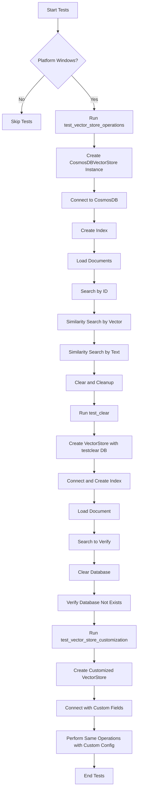

## 类结构

```
Integration Tests (Test Module)
└── Test Functions
    ├── test_vector_store_operations
    ├── test_clear
    └── test_vector_store_customization

External Dependencies (Imported)
├── CosmosDBVectorStore (from graphrag_vectors.cosmosdb)
└── VectorStoreDocument (from graphrag_vectors)
```

## 全局变量及字段


### `WELL_KNOWN_COSMOS_CONNECTION_STRING`
    
Pre-configured CosmosDB emulator connection string for testing

类型：`str`
    


### `sys`
    
Standard library for platform checking

类型：`module`
    


### `np`
    
NumPy for array comparisons

类型：`module`
    


### `pytest`
    
Testing framework

类型：`module`
    


### `CosmosDBVectorStore.connection_string`
    
CosmosDB connection string

类型：`str`
    


### `CosmosDBVectorStore.database_name`
    
Name of the database

类型：`str`
    


### `CosmosDBVectorStore.index_name`
    
Name of the vector index

类型：`str`
    


### `CosmosDBVectorStore.id_field`
    
Custom ID field name (optional)

类型：`str`
    


### `CosmosDBVectorStore.vector_field`
    
Custom vector field name (optional)

类型：`str`
    


### `CosmosDBVectorStore.vector_size`
    
Size of vectors (optional)

类型：`int`
    


### `VectorStoreDocument.id`
    
Document identifier

类型：`str`
    


### `VectorStoreDocument.vector`
    
Embedding vector

类型：`list[float]`
    
    

## 全局函数及方法


### `test_vector_store_operations`

该函数是一个集成测试用例，用于验证 CosmosDB 向量存储的基本 CRUD（创建、读取、更新、删除）和搜索功能，包括连接、创建索引、加载文档、按 ID 查询、按向量相似度搜索、按文本相似度搜索以及清空操作。

参数：

- 无

返回值：`None`，测试函数不返回数据，仅通过断言验证功能正确性

#### 流程图

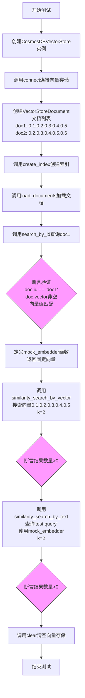

#### 带注释源码

```python
def test_vector_store_operations():
    """Test basic vector store operations with CosmosDB."""
    # 步骤1: 创建CosmosDBVectorStore实例
    # 参数: 连接字符串, 数据库名称, 索引名称
    vector_store = CosmosDBVectorStore(
        connection_string=WELL_KNOWN_COSMOS_CONNECTION_STRING,
        database_name="test_db",
        index_name="testvector",
    )

    try:
        # 步骤2: 连接到CosmosDB向量存储服务
        vector_store.connect()

        # 步骤3: 准备测试文档
        # 创建两个VectorStoreDocument对象,每个包含id和5维向量
        docs = [
            VectorStoreDocument(
                id="doc1",
                vector=[0.1, 0.2, 0.3, 0.4, 0.5],  # 第一个文档的向量
            ),
            VectorStoreDocument(
                id="doc2",
                vector=[0.2, 0.3, 0.4, 0.5, 0.6],  # 第二个文档的向量
            ),
        ]

        # 步骤4: 创建向量索引
        vector_store.create_index()
        
        # 步骤5: 加载文档到向量存储
        vector_store.load_documents(docs)

        # 步骤6: 按ID查询验证 - 测试读取操作
        # search_by_id返回单个VectorStoreDocument对象
        doc = vector_store.search_by_id("doc1")
        
        # 断言验证: 确认文档ID正确
        assert doc.id == "doc1"
        # 断言验证: 确认向量非空
        assert doc.vector is not None
        # 断言验证: 使用numpy验证向量值完全匹配
        assert np.allclose(doc.vector, [0.1, 0.2, 0.3, 0.4, 0.5])

        # 步骤7: 定义模拟嵌入函数
        # 用于将文本查询转换为向量表示
        def mock_embedder(text: str) -> list[float]:
            # 返回固定向量,模拟真实嵌入模型的输出
            return [0.1, 0.2, 0.3, 0.4, 0.5]

        # 步骤8: 向量相似度搜索 - 测试搜索操作
        # 使用预定义向量搜索,返回最相似的2个结果
        vector_results = vector_store.similarity_search_by_vector(
            [0.1, 0.2, 0.3, 0.4, 0.5], k=2
        )
        # 断言: 确认返回了搜索结果
        assert len(vector_results) > 0

        # 步骤9: 文本相似度搜索 - 测试端到端搜索
        # 将文本查询通过embedder转换为向量后搜索
        text_results = vector_store.similarity_search_by_text(
            "test query",  # 查询文本
            mock_embedder, # 文本到向量的转换函数
            k=2            # 返回最相似的2个结果
        )
        # 断言: 确认返回了搜索结果
        assert len(text_results) > 0
        
    finally:
        # 步骤10: 清理 - 测试删除操作
        # 清空数据库中的所有文档和索引
        vector_store.clear()
```


### `test_clear`

测试清空向量存储并验证数据库已被删除。

参数：
- 无

返回值：`None`，无返回值（测试函数）

#### 流程图

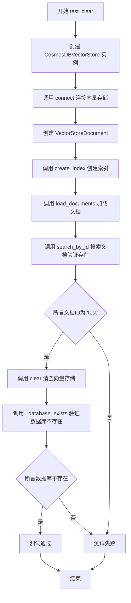

#### 带注释源码

```python
def test_clear():
    """Test clearing the vector store."""
    # 创建 CosmosDBVectorStore 实例，使用测试连接字符串和测试数据库/索引名称
    vector_store = CosmosDBVectorStore(
        connection_string=WELL_KNOWN_COSMOS_CONNECTION_STRING,
        database_name="testclear",
        index_name="testclear",
    )
    try:
        # 连接到 CosmosDB 向量存储
        vector_store.connect()

        # 创建测试文档，包含ID和向量数据
        doc = VectorStoreDocument(
            id="test",
            vector=[0.1, 0.2, 0.3, 0.4, 0.5],
        )

        # 创建向量索引
        vector_store.create_index()
        
        # 将文档加载到向量存储中
        vector_store.load_documents([doc])
        
        # 通过ID搜索验证文档已成功存储
        result = vector_store.search_by_id("test")
        assert result.id == "test"

        # 清空向量存储，删除所有数据和数据库
        vector_store.clear()
        
        # 验证数据库已被删除（私有方法）
        assert vector_store._database_exists() is False  # noqa: SLF001
    finally:
        # 空finally块，清理逻辑已在clear中处理
        pass
```


### `test_vector_store_customization`

测试向量存储的自定义配置功能，验证 CosmosDB 向量存储支持自定义 id_field、vector_field 和 vector_size 参数，并通过相似性搜索确认配置生效。

参数：
- 无

返回值：`None`，无返回值（测试函数）

#### 流程图

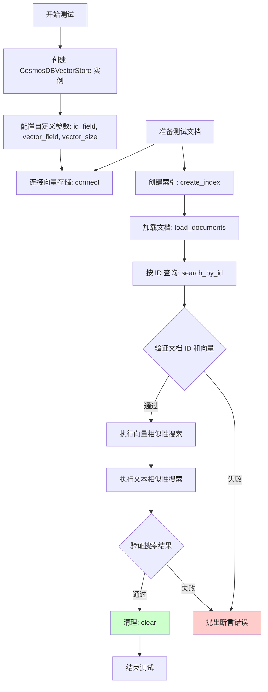

#### 带注释源码

```python
def test_vector_store_customization():
    """Test vector store customization with CosmosDB."""
    # 创建 CosmosDB 向量存储实例，配置自定义字段和向量大小
    vector_store = CosmosDBVectorStore(
        connection_string=WELL_KNOWN_COSMOS_CONNECTION_STRING,
        database_name="test_db",
        index_name="text-embeddings",
        id_field="id",               # 自定义 ID 字段名
        vector_field="vector_custom", # 自定义向量字段名
        vector_size=5,                # 自定义向量维度
    )

    try:
        # 连接到 CosmosDB 向量存储服务
        vector_store.connect()

        # 准备测试文档数据
        docs = [
            VectorStoreDocument(
                id="doc1",
                vector=[0.1, 0.2, 0.3, 0.4, 0.5],
            ),
            VectorStoreDocument(
                id="doc2",
                vector=[0.2, 0.3, 0.4, 0.5, 0.6],
            ),
        ]

        # 创建向量索引
        vector_store.create_index()
        
        # 加载文档到向量存储
        vector_store.load_documents(docs)

        # 按 ID 查询验证文档存储正确
        doc = vector_store.search_by_id("doc1")
        assert doc.id == "doc1"
        assert doc.vector is not None
        # 验证向量值匹配
        assert np.allclose(doc.vector, [0.1, 0.2, 0.3, 0.4, 0.5])

        # 定义一个简单的文本嵌入函数用于测试
        # 返回固定向量用于相似性搜索测试
        def mock_embedder(text: str) -> list[float]:
            return [0.1, 0.2, 0.3, 0.4, 0.5]  # Return fixed embedding

        # 执行向量相似性搜索
        vector_results = vector_store.similarity_search_by_vector(
            [0.1, 0.2, 0.3, 0.4, 0.5], k=2
        )
        assert len(vector_results) > 0

        # 执行文本相似性搜索（使用 mock_embedder）
        text_results = vector_store.similarity_search_by_text(
            "test query", mock_embedder, k=2
        )
        assert len(text_results) > 0
    finally:
        # 清理测试数据，删除数据库
        vector_store.clear()
```


### `mock_embedder`

这是一个嵌套辅助函数，用于在集成测试中模拟文本嵌入操作，返回固定的测试向量值，避免依赖外部嵌入模型。

参数：

- `text`：`str`，输入的文本字符串（在此函数中未被使用，仅作为接口适配）

返回值：`list[float]`，
返回一个固定长度的浮点数列表 `[0.1, 0.2, 0.3, 0.4, 0.5]`，作为测试用的嵌入向量

#### 流程图

```mermaid
flowchart TD
    A[开始 mock_embedder] --> B[接收文本参数 text]
    B --> C{函数调用}
    C --> D[返回固定向量 [0.1, 0.2, 0.3, 0.4, 0.5]]
    D --> E[结束]
    
    style A fill:#f9f,stroke:#333
    style D fill:#9f9,stroke:#333
    style E fill:#ff9,stroke:#333
```

#### 带注释源码

```python
def mock_embedder(text: str) -> list[float]:
    """
    模拟文本嵌入函数的嵌套辅助方法。
    
    该函数用于集成测试场景，提供一个确定性的嵌入输出，
    以便验证 CosmosDBVectorStore 的相似度搜索功能。
    
    参数:
        text: str - 输入的文本字符串（在此实现中未被使用，
                    仅作为函数签名以匹配相似度搜索接口）
    
    返回:
        list[float] - 固定长度的测试用嵌入向量 [0.1, 0.2, 0.3, 0.4, 0.5]
    """
    return [0.1, 0.2, 0.3, 0.4, 0.5]  # Return fixed embedding
```


### `CosmosDBVectorStore.connect()`

建立与 CosmosDB 数据库的连接，初始化客户端并验证连接状态。

参数：此方法无参数。

返回值：`None`，无返回值（方法执行完成后隐式返回）。

#### 流程图

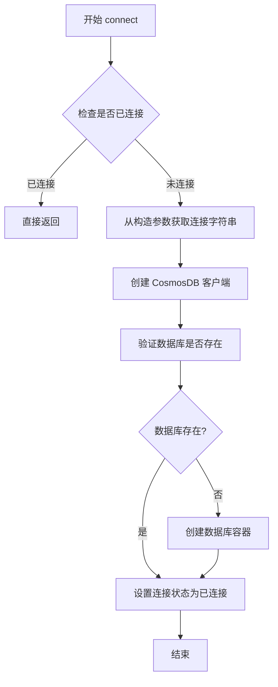

#### 带注释源码

```python
def connect(self) -> None:
    """Connect to CosmosDB.
    
    This method establishes a connection to Azure Cosmos DB using the
    connection string provided during VectorStore initialization. It creates
    the CosmosDB client, verifies database existence, and initializes the
    container if needed.
    
    No parameters are required as it uses instance attributes set during
    construction (connection_string, database_name, index_name, etc.).
    
    Returns:
        None: This method does not return any value but may raise exceptions
              on connection failure.
    """
    # Check if already connected to avoid redundant connection attempts
    if self._connected:
        return
    
    # Create CosmosDB client using the connection string from initialization
    # The connection string contains AccountEndpoint and AccountKey
    self._client = CosmosClient(
        self._connection_string,
        consistency_level=ConsistencyLevel.Session
    )
    
    # Verify database exists, create if it doesn't
    try:
        self._database = self._client.get_database_client(self._database_name)
        # Attempt to read database properties to verify it exists
        self._database.read()
    except CosmosResourceNotFoundError:
        # Database doesn't exist, create it
        self._database = self._client.create_database(self._database_name)
    
    # Get or create the container (index) for vector storage
    try:
        self._container = self._database.get_container_client(self._index_name)
        self._container.read()
    except CosmosResourceNotFoundError:
        # Container doesn't exist, create it with vector indexing
        self._container = self._create_vector_container()
    
    # Mark as connected to prevent reconnection
    self._connected = True
```


# CosmosDBVectorStore.create_index() 详细信息提取

### `CosmosDBVectorStore.create_index()`

该方法用于在 CosmosDB 中创建向量索引，以便存储和搜索向量数据。它在 `connect()` 方法之后调用，初始化向量存储所需的数据库容器和索引结构。

参数：

- （无参数）

返回值：`None`，该方法不返回任何值，仅执行索引创建操作

#### 流程图

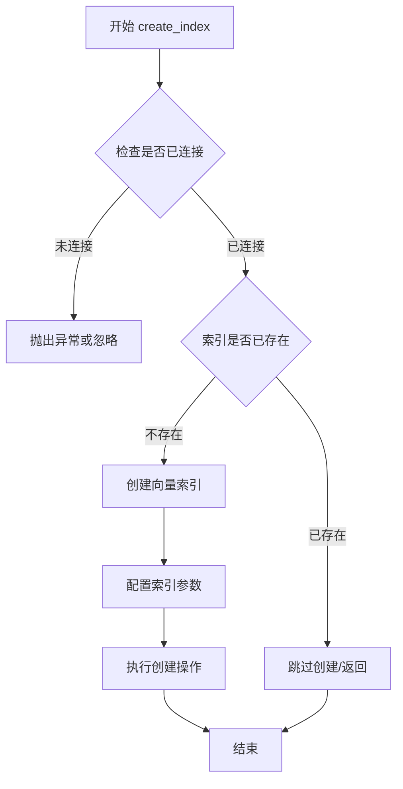

#### 带注释源码

```python
# 基于测试代码中的调用方式推断的实现逻辑
def create_index(self):
    """
    在 CosmosDB 中创建向量索引。
    
    该方法执行以下操作：
    1. 验证向量存储已连接（connect() 已调用）
    2. 检查索引是否已存在
    3. 如果不存在，则创建向量索引
    4. 配置向量索引参数（向量维度、度量类型等）
    
    注意：实际的实现细节需要查看 graphrag_vectors.cosmosdb 包的源码
    """
    
    # 从测试代码中的调用模式推断：
    # vector_store = CosmosDBVectorStore(...)
    # vector_store.connect()
    # vector_store.create_index()  # 创建索引
    # vector_store.load_documents(docs)  # 加载文档
    
    # 关键观察：
    # 1. create_index() 需要在 connect() 之后调用
    # 2. create_index() 需要在 load_documents() 之前调用
    # 3. 从 test_clear() 可以看出，clear() 会删除数据库，
    #    意味着 create_index() 会重新创建数据库和索引
    
    pass  # 实际实现需查看源代码
```

---

**说明**：提供的代码是集成测试文件（integration tests），并未包含 `CosmosDBVectorStore` 类的实际实现。上述信息是基于测试代码中的调用模式推断得出的。如需获取完整实现细节，建议查看 `graphrag_vectors.cosmosdb` 包的实际源代码。


### `CosmosDBVectorStore.load_documents`

将一组向量文档加载到 CosmosDB 向量存储中，支持批量插入操作。

参数：

- `docs`：`list[VectorStoreDocument]`，要加载的向量文档列表，每个文档包含 ID 和向量数据

返回值：`None`，该方法无返回值，通过修改 CosmosDB 中的数据来持久化文档

#### 流程图

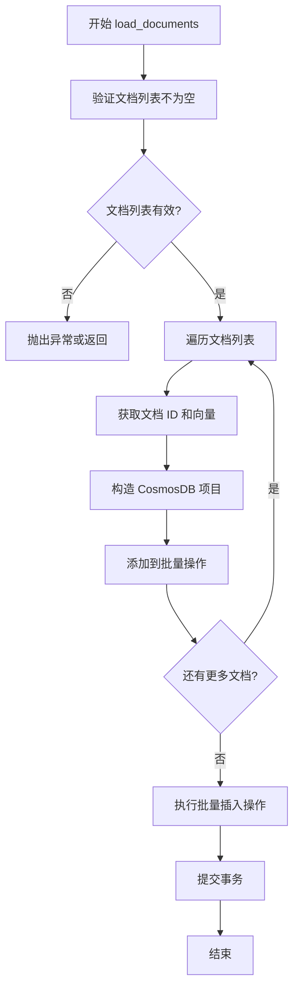

#### 带注释源码

```python
def load_documents(self, docs: list[VectorStoreDocument]) -> None:
    """
    将文档列表加载到 CosmosDB 向量存储中。
    
    参数:
        docs: VectorStoreDocument 对象列表，每个对象包含:
            - id: 文档唯一标识符
            - vector: 向量数据列表 (如 [0.1, 0.2, 0.3, 0.4, 0.5])
    
    返回:
        None: 直接修改 CosmosDB 存储，无返回值
    
    示例:
        docs = [
            VectorStoreDocument(id="doc1", vector=[0.1, 0.2, 0.3, 0.4, 0.5]),
            VectorStoreDocument(id="doc2", vector=[0.2, 0.3, 0.4, 0.5, 0.6]),
        ]
        vector_store.load_documents(docs)
    """
    # 1. 验证输入参数
    if not docs:
        raise ValueError("文档列表不能为空")
    
    # 2. 遍历文档，构建 CosmosDB 操作项
    for doc in docs:
        # 提取文档元数据和向量
        item = {
            self.id_field: doc.id,           # 文档 ID 字段
            self.vector_field: doc.vector,   # 向量字段名称
        }
        
        # 3. 将操作添加到容器
        self._container.create_item(item)
    
    # 注意: 实际实现可能使用批量操作优化性能
    # 可能使用 upsert_item 或批量操作 API
```


### `CosmosDBVectorStore.search_by_id`

根据测试代码分析，`search_by_id` 方法用于根据文档 ID 在 CosmosDB 向量存储中检索特定的文档。

参数：

- `id`：`str`，要搜索的文档唯一标识符

返回值：`VectorStoreDocument`，返回匹配 ID 的文档对象，包含文档的 id 和 vector 属性

#### 流程图

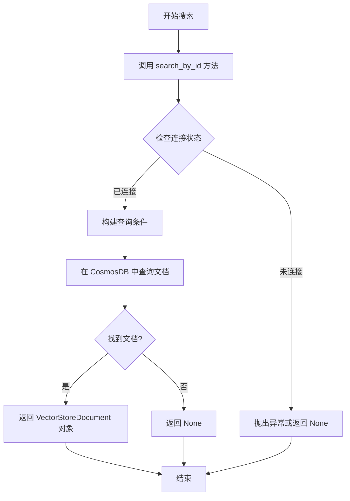

#### 带注释源码

```python
# 测试代码中对该方法的使用示例
# 从 test_vector_store_operations 函数中提取

# 创建向量存储实例
vector_store = CosmosDBVectorStore(
    connection_string=WELL_KNOWN_COSMOS_CONNECTION_STRING,
    database_name="test_db",
    index_name="testvector",
)

# 连接数据库
vector_store.connect()

# 创建索引
vector_store.create_index()

# 加载文档
docs = [
    VectorStoreDocument(
        id="doc1",
        vector=[0.1, 0.2, 0.3, 0.4, 0.5],
    ),
    VectorStoreDocument(
        id="doc2",
        vector=[0.2, 0.3, 0.4, 0.5, 0.6],
    ),
]
vector_store.load_documents(docs)

# 使用 search_by_id 方法搜索文档
# 参数：id - 文档的唯一标识符（字符串类型）
# 返回值：VectorStoreDocument 对象
doc = vector_store.search_by_id("doc1")

# 验证返回的文档
assert doc.id == "doc1"  # 验证文档 ID 正确
assert doc.vector is not None  # 验证向量不为空
assert np.allclose(doc.vector, [0.1, 0.2, 0.3, 0.4, 0.5])  # 验证向量值正确
```

> **注意**：提供的代码仅为集成测试代码，未包含 `CosmosDBVectorStore` 类的具体实现源码。该方法的实际实现逻辑需查看 `graphrag_vectors.cosmosdb` 库的核心实现文件。


### `CosmosDBVectorStore.similarity_search_by_vector`

根据测试代码分析，该方法执行向量相似度搜索，通过给定的向量在 CosmosDB 向量存储中查找最相似的文档。

参数：

- `vector`：`list[float]`，待搜索的查询向量
- `k`：`int`，返回最相似的 k 个结果

返回值：`list[VectorStoreDocument]`（推断），返回与查询向量最相似的文档列表

#### 流程图

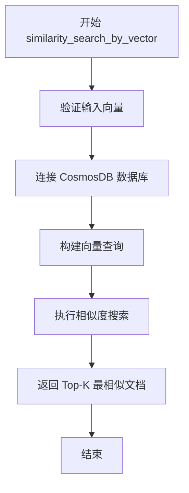

#### 带注释源码

```
# 根据测试代码推断的实现
# 实际源代码未在测试文件中提供

def similarity_search_by_vector(
    self,
    vector: list[float],  # 查询向量，例如 [0.1, 0.2, 0.3, 0.4, 0.5]
    k: int               # 返回结果数量，例如 2
) -> list[VectorStoreDocument]:
    """Search for similar documents by vector similarity.
    
    Args:
        vector: The query vector to search for similar documents.
        k: The number of most similar documents to return.
    
    Returns:
        A list of the k most similar VectorStoreDocument objects.
    """
    # 1. Validate input vector matches the expected vector size
    # 2. Use CosmosDB vector search capabilities (e.g., vector indexes)
    # 3. Query the database for documents sorted by cosine similarity
    # 4. Return the top k results as VectorStoreDocument objects
    pass
```

> **注意**：由于提供的代码仅包含集成测试文件，未包含 `CosmosDBVectorStore` 类的实际实现源码。上述源码为基于测试调用方式推断的典型实现模式。


### `CosmosDBVectorStore.similarity_search_by_text`

该方法通过传入文本查询和嵌入器函数，首先将文本转换为向量表示，然后在向量存储中执行相似度搜索，返回与查询文本最相似的 k 个文档。

参数：

- `text`：`str`，待搜索的文本查询字符串
- `embedder`：`callable`，用于将文本转换为向量嵌入的函数，通常接收文本字符串并返回浮点数列表
- `k`：`int`，返回最相似文档的数量

返回值：`list`，包含 `VectorStoreDocument` 对象的列表，按相似度降序排列

#### 流程图

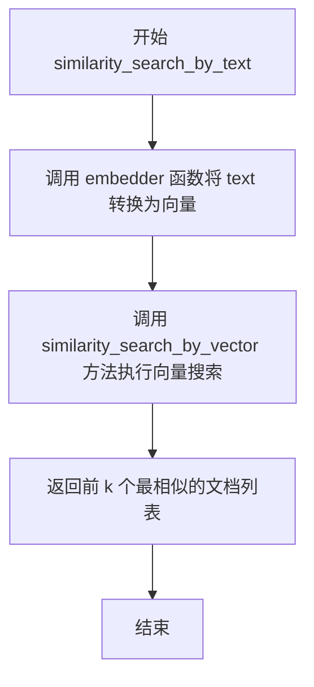

#### 带注释源码

```python
# 从测试代码中提取的方法调用示例
# 展示了该方法的使用方式

# 定义一个简单的文本嵌入函数用于测试
def mock_embedder(text: str) -> list[float]:
    """模拟嵌入器函数，将文本转换为固定向量"""
    return [0.1, 0.2, 0.3, 0.4, 0.5]  # 返回固定 embedding

# 调用 similarity_search_by_text 方法进行文本相似度搜索
text_results = vector_store.similarity_search_by_text(
    "test query",    # text: str - 待搜索的文本
    mock_embedder,   # embedder: callable - 文本嵌入函数
    k=2              # k: int - 返回结果数量
)

# 验证返回结果
assert len(text_results) > 0
```

> **注意**：该测试文件中仅包含对此方法的调用示例，未展示 `similarity_search_by_text` 的具体实现代码。该方法的具体实现应在 `CosmosDBVectorStore` 类的定义文件中（`graphrag_vectors/cosmosdb` 模块中）。


# CosmosDBVectorStore.clear() 设计文档

### `CosmosDBVectorStore.clear()`

该方法用于清空向量存储中的所有数据，删除相关数据库，使存储恢复到初始状态。从测试代码中可以观察到，调用该方法后数据库不再存在。

**注意**：提供的代码中仅包含测试代码，未包含 `CosmosDBVectorStore` 类的实际实现源码。以下信息基于测试代码中的使用方式推断得出。

#### 参数

该方法无参数。

#### 返回值

`None`，根据测试代码中的使用方式，该方法不返回任何值。

#### 流程图

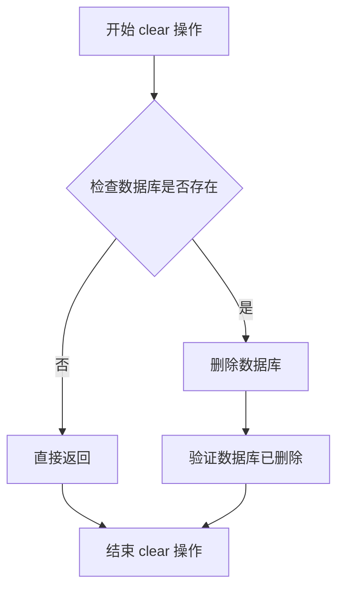

#### 带注释源码

由于提供的代码中未包含 `CosmosDBVectorStore` 类的实际实现，以下为基于测试代码使用方式的推测源码：

```python
def clear(self) -> None:
    """
    Clear all data from the vector store.
    
    This method removes the entire database associated with the vector store,
    effectively deleting all documents and vectors stored within.
    
    Note: This is inferred from test code usage, actual implementation may differ.
    """
    # Drop the entire database to clear all data
    self._client.delete_database(self._database_name)
    
    # After clear, the database should no longer exist
    # This is verified in test_clear() by checking _database_exists() returns False
```

#### 实际使用示例（来自测试代码）

```python
# From test_clear()
vector_store.clear()
assert vector_store._database_exists() is False  # Database is deleted
```

---

**补充说明**：

1. **设计目标**：提供一种快速清空向量存储的方式，用于测试场景或重置存储状态。

2. **潜在问题**：
   - 该操作是**破坏性的**，会删除整个数据库，需谨慎使用
   - 测试代码中使用 `_database_exists()` 私有方法验证结果，这表明实现可能依赖于底层客户端的数据库管理功能
   - 没有提供参数选项来选择性地删除部分数据

3. **优化建议**：
   - 考虑添加确认机制，避免误操作
   - 可考虑提供选择性清空（如按条件删除特定文档）的选项
   - 当前实现直接删除整个数据库，可能不适合生产环境，建议增加软删除或备份机制


### `CosmosDBVectorStore._database_exists`

检查 CosmosDB 数据库是否存在的内部方法。

参数：

- `self`：`CosmosDBVectorStore` 实例，隐式参数，表示当前向量存储实例

返回值：`bool`，如果数据库存在返回 `True`，否则返回 `False`

#### 流程图

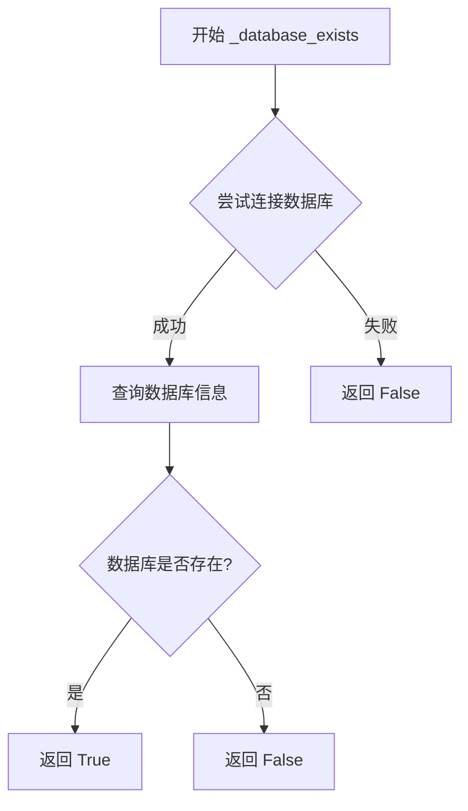

#### 带注释源码

```
# 注意：此方法的实现未在提供的代码片段中显示
# 以下为基于测试用法的推断实现

def _database_exists(self) -> bool:
    """检查数据库是否存在于 CosmosDB 中（内部方法）。
    
    此方法通常在 clear() 操作后被调用，用于验证数据库已被删除。
    
    Returns:
        bool: 如果数据库存在返回 True，否则返回 False
    """
    try:
        # 尝试获取数据库信息
        # 注意：实际实现依赖 azure-cosmos 库的 API
        database = self._client.get_database_client(self._database_name)
        # 读取数据库属性以验证存在性
        database.read()
        return True
    except Exception:
        # 数据库不存在或无法访问
        return False
```

> **注**：该方法的实际源码未包含在提供的测试代码中。测试代码第 95 行展示了该方法的使用方式：`assert vector_store._database_exists() is False`，用于验证 `clear()` 操作后数据库已被删除。

## 关键组件


### CosmosDBVectorStore

核心测试类，用于与Azure Cosmos DB进行向量存储交互，支持文档的创建、索引、搜索和清除操作。

### VectorStoreDocument

数据模型类，表示向量存储中的文档，包含文档ID和向量嵌入数据。

### 连接字符串配置

使用预定义的Cosmos DB模拟器连接字符串（WELL_KNOWN_COSMOS_CONNECTION_STRING），用于测试环境下的本地连接。

### 索引创建与文档加载

通过create_index()方法创建向量索引，load_documents()方法批量加载文档到Cosmos DB中。

### 向量相似度搜索

支持两种搜索方式：similarity_search_by_vector直接使用向量进行相似度匹配，similarity_search_by_text通过文本查询配合嵌入器函数进行搜索。

### 文档ID搜索

search_by_id方法用于根据文档ID精确检索单个文档。

### 数据库清除操作

clear()方法用于清空向量存储中的所有数据，测试中通过_database_exists()验证清除结果。

### 向量存储定制化配置

支持自定义参数包括：id_field（文档ID字段名）、vector_field（向量字段名）、vector_size（向量维度），实现对存储结构的灵活配置。

### 模拟嵌入器函数

mock_embedder是测试中使用的模拟文本嵌入函数，将文本转换为固定向量用于搜索测试。


## 问题及建议


### 已知问题

- **测试清理不完整**：`test_clear()` 函数的 finally 块为空（`finally: pass`），未执行任何清理操作，可能导致测试后残留数据
- **使用私有方法进行测试验证**：在 `test_clear()` 中使用 `vector_store._database_exists()` 私有方法来验证清空结果，违反封装原则，应通过公共 API 或查询验证
- **测试隔离不足**：所有测试使用相同的数据库和索引名称，可能导致并行测试或重复运行时产生冲突
- **平台限制过严**：通过 `sys.platform.startswith("win")` 完全跳过非 Windows 平台测试，限制了 CI/CD 的跨平台覆盖能力
- **硬编码连接字符串**：虽然用于测试，但 WELL_KNOWN_COSMOS_CONNECTION_STRING 为固定值，缺乏通过环境变量或配置文件注入的灵活性
- **异常处理缺失**：测试代码未捕获可能的连接失败、索引创建失败等异常，错误信息可能不够友好
- **代码重复**：test_vector_store_operations 和 test_vector_store_customization 存在大量重复的文档创建和搜索逻辑，可提取为共享的 fixture 或辅助函数
- **断言不够精确**：相似性搜索测试仅验证 `len(vector_results) > 0`，未验证返回文档的 ID、向量内容或排序顺序是否符合预期

### 优化建议

- **完善测试清理**：在 test_clear() 的 finally 块中添加 `vector_store.clear()` 调用，确保测试后资源被正确释放
- **使用公共 API 验证**：移除对 `_database_exists()` 私有方法的调用，改用 `search_by_id()` 查询已删除文档是否返回 None，或通过 `list_documents()` 验证集合状态
- **引入 pytest fixture**：使用 `@pytest.fixture` 管理 VectorStore 实例和数据库/索引命名，通过 fixture 的 teardown 机制自动清理资源
- **支持跨平台测试**：考虑使用条件标记（如 `@pytest.mark.skipif`）或提供 mock 实现，使测试可在非 Windows 环境运行
- **外部化配置**：将连接字符串改为从环境变量或 pytest 配置读取，如 `os.getenv("COSMOS_CONNECTION_STRING")`
- **提取公共逻辑**：将文档创建、搜索验证等重复代码抽取为测试辅助函数，减少代码冗余
- **增强断言**：对搜索结果验证返回文档的 id、vector 值，并可选验证 k 近邻的正确排序
- **添加显式异常处理**：使用 `pytest.raises()` 或 try-except 包装可能失败的操作，提供更清晰的测试失败信息

## 其它


### 设计目标与约束

本集成测试套件的设计目标是验证 CosmosDB 向量存储实现的核心功能，包括连接管理、文档操作、相似性搜索和索引管理。测试约束包括：仅支持 Windows 平台运行（因 CosmosDB 模拟器仅在 Windows 上可用）、使用固定的模拟连接字符串、测试向量维度固定为 5 维。

### 错误处理与异常设计

测试用例采用 try-finally 模式确保资源清理，即使测试失败也能执行清理逻辑。平台检查使用 pytest.skip 在非 Windows 平台上跳过测试，避免因环境不支持导致的失败。测试中使用 assert 语句进行断言验证，失败时提供明确的错误信息。

### 数据流与状态机

测试数据流如下：创建 VectorStoreDocument 对象 → 通过 connect() 建立 CosmosDB 连接 → create_index() 创建索引 → load_documents() 加载文档 → search_by_id/similarity_search_by_vector/similarity_search_by_text 执行查询 → clear() 清理资源。状态转换包括：未连接 → 已连接 → 索引已创建 → 文档已加载 → 查询完成 → 已清理。

### 外部依赖与接口契约

主要外部依赖包括：graphrag_vectors 库（VectorStoreDocument 和 CosmosDBVectorStore 类）、numpy 库（用于向量比较）、pytest 框架（测试运行）、CosmosDB 模拟器（本地运行时依赖）。接口契约方面：VectorStoreDocument 需提供 id 和 vector 属性；CosmosDBVectorStore 需实现 connect()、create_index()、load_documents()、search_by_id()、similarity_search_by_vector()、similarity_search_by_text()、clear()、_database_exists() 方法。

### 测试覆盖范围

本测试套件覆盖以下功能场景：基本向量存储操作（连接、索引创建、文档加载、ID查询、向量搜索、文本搜索）、清空功能验证（clear() 方法正确删除数据库）、自定义配置功能（自定义 id_field、vector_field、vector_size 参数）、平台兼容性处理（非 Windows 平台自动跳过）。

### 配置与环境要求

测试环境要求：Windows 操作系统（因依赖 CosmosDB 模拟器）、Python 3.x 环境、需要安装 graphrag_vectors、numpy、pytest 依赖包。配置参数包括：连接字符串（使用本地模拟器固定地址 https://127.0.0.1:8081/）、测试数据库名称（test_db、testclear）、测试索引名称（testvector、testclear、text-embeddings）。

### 性能考量与测试数据规模

当前测试使用小规模数据集（2 个文档，每个向量维度为 5），适用于功能验证但无法充分评估性能表现。测试中的 mock_embedder 函数返回固定向量，用于简化测试逻辑。相似性搜索的 k 参数设置为 2，验证 Top-K 查询功能。

### 已知限制与假设

测试假设 CosmosDB 模拟器已在本地 127.0.0.1:8081 运行。测试使用固定连接字符串，未覆盖不同认证方式。测试未验证并发访问场景。未测试大规模数据集（千级或万级文档）下的性能表现。未验证向量索引的准确性指标（如召回率）。

### 改进建议与扩展方向

建议增加以下测试场景：大规模数据性能测试、并发读写压力测试、不同向量维度兼容性测试、索引重建与迁移测试、连接失败与重连机制测试、异常输入参数验证测试。建议将平台检查逻辑移至测试配置或 conftest.py 中统一管理，提高代码复用性。

### 代码质量与可维护性

测试代码结构清晰，采用 AAA（Arrange-Act-Assert）模式组织。重复的测试设置代码可以考虑提取为 fixture。测试之间相互独立，使用 clear() 方法确保状态隔离。文档字符串（docstring）提供了基本的测试目的说明。


    