# `graphrag\tests\integration\vector_stores\test_factory.py` 详细设计文档

这是一个测试文件，用于验证VectorStoreFactory类的功能，包括创建内置向量存储（ LanceDB、Azure AI Search、CosmosDB）以及注册和创建自定义向量存储类型。

## 整体流程

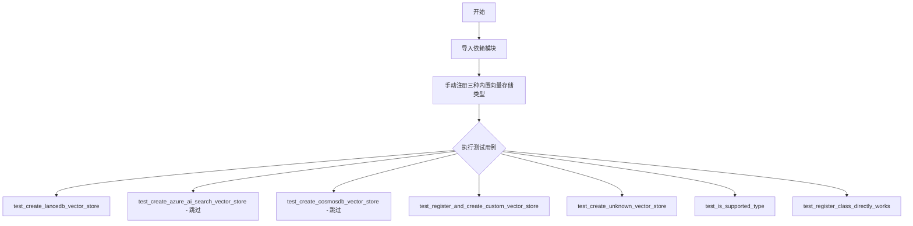

## 类结构

```
测试模块 (test_vectorstore_factory.py)
├── VectorStore (接口/抽象基类)
│   ├── LanceDBVectorStore (具体实现)
│   ├── AzureAISearchVectorStore (具体实现)
│   └── CosmosDBVectorStore (具体实现)
├── VectorStoreFactory (工厂类)
└── VectorStoreType (枚举类型)
```

## 全局变量及字段


### `pytest`
    
Python测试框架库，用于编写和运行单元测试

类型：`module`
    


### `VectorStore`
    
向量存储的抽象基类，定义了向量存储的接口规范

类型：`class`
    


### `VectorStoreFactory`
    
向量存储工厂类，负责注册和创建不同类型的向量存储实例

类型：`class`
    


### `VectorStoreType`
    
枚举类型，定义了支持的向量存储类型（如LanceDB、AzureAISearch、CosmosDB）

类型：`enum`
    


### `AzureAISearchVectorStore`
    
Azure AI Search向量存储的具体实现类

类型：`class`
    


### `CosmosDBVectorStore`
    
Cosmos DB向量存储的具体实现类

类型：`class`
    


### `LanceDBVectorStore`
    
LanceDB向量存储的具体实现类

类型：`class`
    


### `LanceDBVectorStore.index_name`
    
LanceDB向量存储的索引名称，默认为'vector_index'

类型：`str`
    
    

## 全局函数及方法


### `test_create_lancedb_vector_store`

该函数是一个测试用例，用于验证使用 VectorStoreFactory 创建 LanceDB 向量存储实例的正确性，确保返回的对象是 LanceDBVectorStore 类型且具有正确的索引名称。

参数：无

返回值：`None`，测试函数无返回值

#### 流程图

```mermaid
flowchart TD
    A[开始测试] --> B[创建 kwargs 字典<br/>db_uri: /tmp/lancedb]
    B --> C[调用 VectorStoreFactory().create<br/>VectorStoreType.LanceDB, kwargs]
    C --> D{创建向量存储实例}
    D --> E[断言 isinstance<br/>vector_store 是 LanceDBVectorStore]
    E --> F{断言 index_name}
    F --> G[断言 vector_store.index_name<br/>== 'vector_index']
    G --> H[测试通过]
    
    style A fill:#f9f,stroke:#333
    style H fill:#9f9,stroke:#333
    style E fill:#ff9,stroke:#333
    style F fill:#ff9,stroke:#333
```

#### 带注释源码

```python
def test_create_lancedb_vector_store():
    """测试创建 LanceDB 向量存储的功能"""
    
    # 步骤1: 准备创建向量存储所需的参数字典
    # - db_uri: 指定 LanceDB 数据库的存储路径
    kwargs = {
        "db_uri": "/tmp/lancedb",
    }
    
    # 步骤2: 使用 VectorStoreFactory 创建指定类型的向量存储
    # - VectorStoreType.LanceDB: 指定要创建的类型为 LanceDB
    # - kwargs: 传递给向量存储构造函数的参数
    vector_store = VectorStoreFactory().create(VectorStoreType.LanceDB, kwargs)
    
    # 步骤3: 断言验证返回的向量存储是 LanceDBVectorStore 类型
    assert isinstance(vector_store, LanceDBVectorStore)
    
    # 步骤4: 断言验证向量存储的索引名称默认为 "vector_index"
    assert vector_store.index_name == "vector_index"
```


### `test_create_azure_ai_search_vector_store`

用于测试通过 VectorStoreFactory 创建 Azure AI Search 向量存储实例的功能，验证返回的对象类型是否为 AzureAISearchVectorStore。

参数：此函数无显式参数（使用函数内定义的局部变量 `kwargs` 字典）

返回值：`None`（测试函数无返回值）

#### 流程图

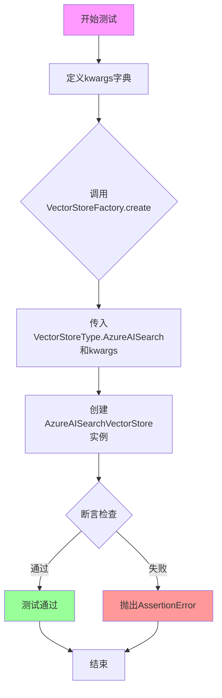

#### 带注释源码

```python
@pytest.mark.skip(reason="Azure AI Search requires credentials and setup")
def test_create_azure_ai_search_vector_store():
    """
    测试创建 Azure AI Search 向量存储的功能。
    
    注意：此测试被跳过，因为需要有效的 Azure AI Search 凭据和配置。
    """
    # 定义创建 Azure AI Search 向量存储所需的参数
    kwargs = {
        "url": "https://test.search.windows.net",  # Azure AI Search 服务 URL
        "api_key": "test_key",                      # API 访问密钥
        "index_name": "test_collection",            # 索引名称
    }
    
    # 使用 VectorStoreFactory 创建向量存储实例
    # 传入向量存储类型 AzureAISearch 和配置参数 kwargs
    vector_store = VectorStoreFactory().create(
        VectorStoreType.AzureAISearch,
        kwargs,
    )
    
    # 断言验证返回的向量存储对象是 AzureAISearchVectorStore 的实例
    assert isinstance(vector_store, AzureAISearchVectorStore)
```


### `test_create_cosmosdb_vector_store`

这是一个测试函数，用于验证 `VectorStoreFactory` 能否正确创建 CosmosDB 类型的向量存储实例。该测试通过构建 CosmosDB 连接所需的参数，调用工厂方法创建向量存储实例，并断言返回实例的类型是否为 `CosmosDBVectorStore`。

参数：此测试函数无显式输入参数，使用硬编码的测试参数。

返回值：`CosmosDBVectorStore`，通过 `VectorStoreFactory.create()` 方法返回的 CosmosDB 向量存储实例，用于验证工厂模式正确创建了对应类型的向量存储。

#### 流程图

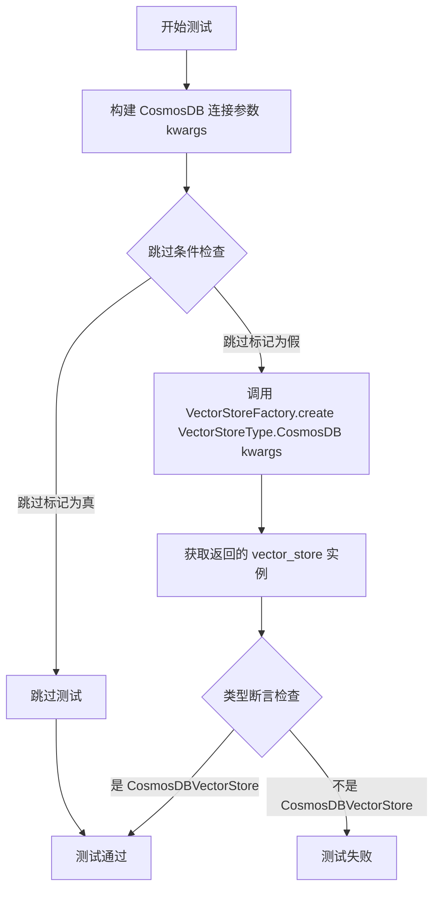

#### 带注释源码

```python
@pytest.mark.skip(reason="CosmosDB requires credentials and setup")
def test_create_cosmosdb_vector_store():
    """测试函数：验证创建 CosmosDB 向量存储实例"""
    
    # 定义创建 CosmosDB 向量存储所需的参数字典
    kwargs = {
        # Azure Cosmos DB 的连接字符串，包含账户端点和访问密钥
        "connection_string": "AccountEndpoint=https://test.documents.azure.com:443/;AccountKey=test_key==",
        # 要连接的数据库名称
        "database_name": "test_db",
        # 向量索引的名称
        "index_name": "test_collection",
    }

    # 使用 VectorStoreFactory 工厂类创建指定类型的向量存储实例
    # 传入向量存储类型为 CosmosDB，以及对应的配置参数
    vector_store = VectorStoreFactory().create(
        VectorStoreType.CosmosDB,
        kwargs,
    )

    # 断言验证返回的实例确实是 CosmosDBVectorStore 类型
    # 确保工厂方法正确创建了对应类型的向量存储
    assert isinstance(vector_store, CosmosDBVectorStore)
```


### `test_register_and_create_custom_vector_store`

该测试函数用于验证 VectorStoreFactory 能够正确注册自定义向量存储类型并通过工厂方法创建其实例。测试使用 `unittest.mock` 模块创建满足 VectorStore 接口的模拟类，验证注册机制、实例创建以及类型识别是否正常工作。

参数：此函数无参数。

返回值：`None`，测试函数无显式返回值。

#### 流程图

```mermaid
flowchart TD
    A[开始] --> B[导入MagicMock]
    B --> C[创建模拟VectorStore接口的mock类: custom_vector_store_class]
    C --> D[创建mock实例instance]
    D --> E[设置instance.initialized = True]
    E --> F[将instance赋值给custom_vector_store_class.return_value]
    F --> G[调用VectorStoreFactory.register注册自定义类型"custom"]
    G --> H[使用lambda函数作为工厂函数]
    H --> I[调用VectorStoreFactory.create创建"custom"类型的向量存储]
    I --> J[断言custom_vector_store_class被调用]
    J --> K[断言返回的vector_store是instance]
    K --> L[断言vector_store.initialized为True]
    L --> M[断言"custom"在VectorStoreFactory中]
    M --> N[结束]
```

#### 带注释源码

```python
def test_register_and_create_custom_vector_store():
    """Test registering and creating a custom vector store type."""
    # 导入MagicMock用于创建模拟对象
    from unittest.mock import MagicMock

    # 步骤1: 创建满足VectorStore接口的mock类
    # 使用spec=VectorStore确保mock只包含VectorStore中存在的属性和方法
    custom_vector_store_class = MagicMock(spec=VectorStore)
    
    # 步骤2: 创建mock实例
    instance = MagicMock()
    # 设置自定义属性initialized，用于后续验证
    instance.initialized = True
    
    # 步骤3: 配置mock类，使其返回我们创建的mock实例
    # 当custom_vector_store_class被调用时，返回instance
    custom_vector_store_class.return_value = instance

    # 步骤4: 向VectorStoreFactory注册自定义向量存储类型
    # 注册键名为"custom"，值为lambda函数作为工厂方法
    VectorStoreFactory().register(
        "custom", lambda **kwargs: custom_vector_store_class(**kwargs)
    )

    # 步骤5: 通过工厂方法创建自定义向量存储实例
    vector_store = VectorStoreFactory().create("custom", {})

    # 步骤6: 验证断言
    # 验证custom_vector_store_class确实被调用过
    assert custom_vector_store_class.called
    
    # 验证返回的实例正是我们创建的mock实例
    assert vector_store is instance
    
    # 验证实例的自定义属性被正确设置
    # type: ignore 注释用于忽略类型检查器的警告
    assert vector_store.initialized is True  # type: ignore # Attribute only exists on our mock

    # 验证自定义类型已成功注册到VectorStoreFactory中
    # 通过__contains__方法检查"custom"是否在工厂中
    assert "custom" in VectorStoreFactory()
```


### `test_create_unknown_vector_store`

该测试函数用于验证 VectorStoreFactory 在尝试创建未注册的向量存储类型时能够正确抛出 ValueError 异常。

参数：无

返回值：无（测试函数，使用 `pytest.raises` 捕获异常）

#### 流程图

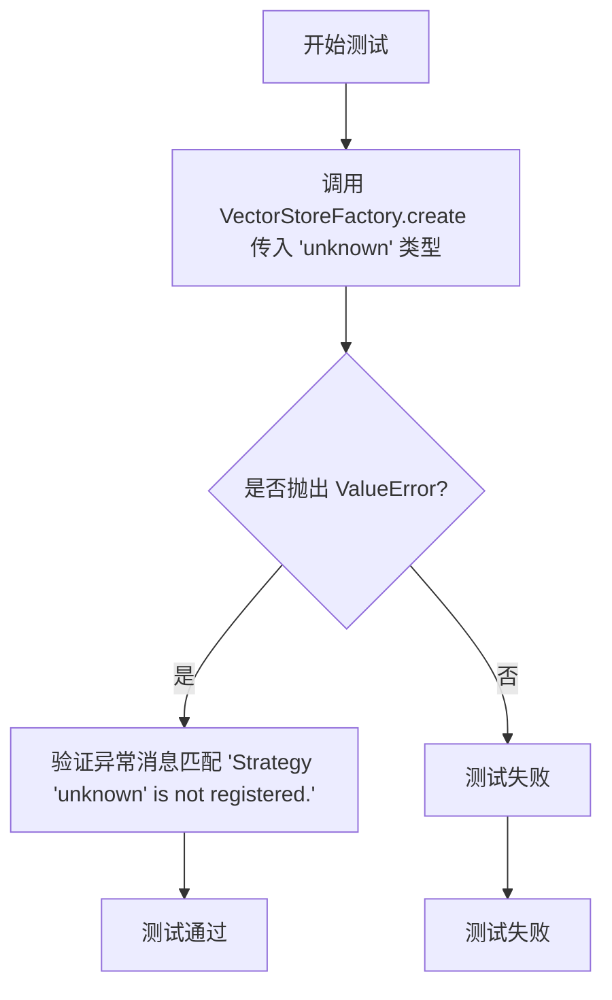

#### 带注释源码

```python
def test_create_unknown_vector_store():
    """测试当尝试创建未注册的向量存储类型时是否抛出正确的异常。
    
    该测试验证 VectorStoreFactory.create 方法在接收到未注册的类型标识符时
    会抛出 ValueError 异常，并包含描述性的错误消息。
    """
    # 使用 pytest.raises 上下文管理器验证异常被正确抛出
    # match 参数用于验证异常消息中包含指定字符串
    with pytest.raises(ValueError, match="Strategy 'unknown' is not registered\\."):
        # 尝试创建一个名为 'unknown' 的向量存储
        # 这应该失败并抛出 ValueError，因为该类型未注册
        VectorStoreFactory().create("unknown")
```


### `test_is_supported_type`

该测试函数用于验证 VectorStoreFactory 是否正确支持内置的向量存储类型（LanceDB、AzureAISearch、CosmosDB），并确保未知的类型不被支持。

参数： 无

返回值： `None`，该函数为测试函数，使用断言进行验证，无显式返回值

#### 流程图

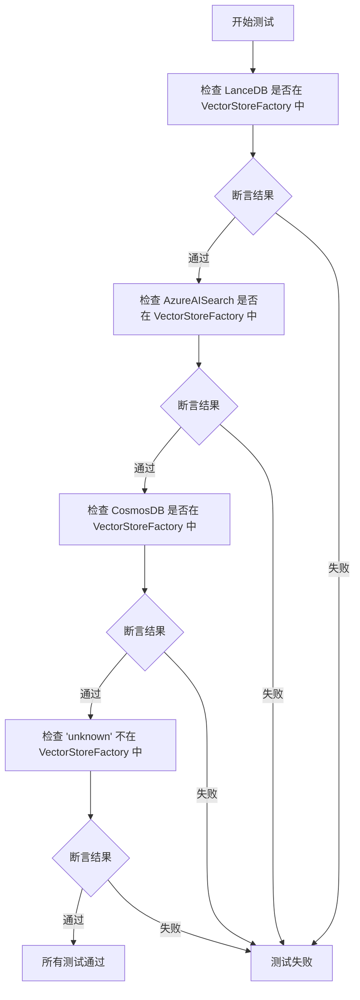

#### 带注释源码

```python
def test_is_supported_type():
    """测试 VectorStoreFactory 是否支持内置的向量存储类型"""
    
    # 测试内置类型：验证 LanceDB 是否已注册到 VectorStoreFactory
    assert VectorStoreType.LanceDB in VectorStoreFactory()
    
    # 测试内置类型：验证 AzureAISearch 是否已注册到 VectorStoreFactory
    assert VectorStoreType.AzureAISearch in VectorStoreFactory()
    
    # 测试内置类型：验证 CosmosDB 是否已注册到 VectorStoreFactory
    assert VectorStoreType.CosmosDB in VectorStoreFactory()

    # 测试未知类型：确保 'unknown' 类型未被注册
    assert "unknown" not in VectorStoreFactory()
```


### `test_register_class_directly_works`

该测试函数验证了 VectorStoreFactory 支持直接注册 VectorStore 类（而非仅支持注册工厂函数），通过创建一个自定义的 VectorStore 子类并注册到工厂中，最后验证可以成功创建该自定义类的实例。

参数：
- 该函数无参数

返回值：
- `None`，该函数为测试函数，通过 pytest 断言验证功能，不返回任何值

#### 流程图

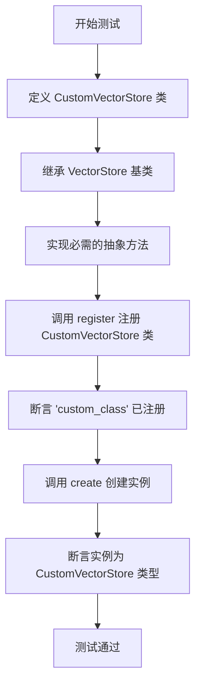

#### 带注释源码

```python
def test_register_class_directly_works():
    """Test that registering a class directly works."""
    # 从 graphrag_vectors 导入 VectorStore 基类
    from graphrag_vectors import VectorStore

    # 定义自定义向量存储类，继承自 VectorStore
    class CustomVectorStore(VectorStore):
        # 初始化方法，接受任意关键字参数
        def __init__(self, **kwargs):
            # 调用父类初始化方法
            super().__init__(**kwargs)

        # 连接方法
        def connect(self, **kwargs):
            pass

        # 创建索引方法
        def create_index(self, **kwargs):
            pass

        # 加载文档方法
        def load_documents(self, documents):
            pass

        # 按向量相似度搜索方法
        def similarity_search_by_vector(self, query_embedding, k=10, **kwargs):
            # 返回空列表作为模拟实现
            return []

        # 按文本相似度搜索方法
        def similarity_search_by_text(self, text, text_embedder, k=10, **kwargs):
            return []

        # 按 ID 搜索方法
        def search_by_id(self, id):
            # 导入 VectorStoreDocument 用于创建返回文档
            from graphrag_vectors import VectorStoreDocument

            # 返回带有指定 ID 的文档对象，向量为 None
            return VectorStoreDocument(id=id, vector=None)

    # 【关键测试点】直接注册类本身而非工厂函数，验证不会抛出 TypeError
    VectorStoreFactory().register("custom_class", CustomVectorStore)

    # 验证 "custom_class" 已成功注册到 VectorStoreFactory
    assert "custom_class" in VectorStoreFactory()

    # 测试创建自定义向量存储实例
    vector_store = VectorStoreFactory().create(
        "custom_class",  # 注册时使用的键名
        {},              # 传递给构造函数的参数
    )

    # 验证创建的实例是 CustomVectorStore 类型的实例
    assert isinstance(vector_store, CustomVectorStore)
```


### `VectorStore.__init__`

该方法是 VectorStore 基类的构造函数，用于初始化向量存储实例的通用配置。它接收可变关键字参数并将配置存储在实例属性中，同时设置初始化状态标志。

参数：

-  `**kwargs`：可变关键字参数（dict），用于接收向量存储配置选项，如连接参数、索引名称等

返回值：`None`，构造函数不返回任何值

#### 流程图

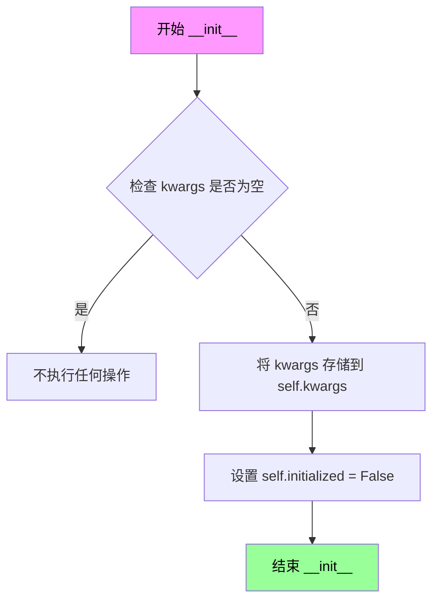

#### 带注释源码

```python
# 源码基于测试代码中的 CustomVectorStore 类推断
# 这是对 VectorStore 基类 __init__ 方法行为的推测

class VectorStore:
    """向量存储基类，提供统一的接口规范"""
    
    def __init__(self, **kwargs):
        """
        初始化 VectorStore 实例
        
        Args:
            **kwargs: 可变关键字参数，用于传递向量存储的配置选项
                     常见的参数可能包括：
                     - connection_string: 连接字符串
                     - db_uri: 数据库 URI
                     - index_name: 索引名称
                     - api_key: API 密钥
                     等其他存储特定的配置
        """
        # 如果传入了配置参数，则存储在实例属性中
        # 这允许子类访问父类的通用配置
        if kwargs:
            self.kwargs = kwargs
        
        # 标记该向量存储尚未初始化/连接
        # 子类在 connect() 或其他初始化方法中应将其设置为 True
        self.initialized = False
```

#### 说明

由于提供的代码是测试文件而非 VectorStore 基类的定义源码，上述源码是基于测试代码中 `CustomVectorStore` 类的调用模式推断得出的。从测试代码中可以看到：

1. `VectorStore.__init__(**kwargs)` 接受可变关键字参数
2. 子类通过 `super().__init__(**kwargs)` 调用父类构造函数
3. 存在 `initialized` 属性用于跟踪初始化状态

如需获取 VectorStore 基类的完整定义，需要查看 `graphrag_vectors` 模块的源码。


### VectorStore.connect

该方法是向量存储库（VectorStore）基类的抽象方法，用于建立与向量数据库的连接。每个具体的向量存储实现（如LanceDB、AzureAISearch、CosmosDB等）都需要重写此方法以实现特定的连接逻辑。

参数：

-  `**kwargs`：`Any`，可变关键字参数，用于传递连接所需的配置参数（如数据库URI、API密钥、连接字符串等），具体参数由各实现类决定

返回值：`None`，无返回值

#### 流程图

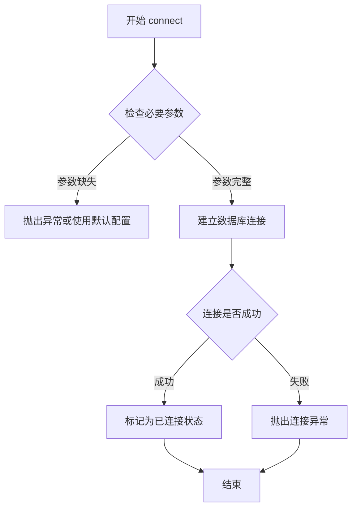

#### 带注释源码

```python
# 从测试代码中提取的接口定义示例
class CustomVectorStore(VectorStore):
    """自定义向量存储实现类"""
    
    def __init__(self, **kwargs):
        """初始化方法"""
        super().__init__(**kwargs)

    def connect(self, **kwargs):
        """
        连接到向量存储数据库
        
        参数:
            **kwargs: 可变关键字参数，包含连接所需的配置信息
                      具体参数由子类实现决定，例如：
                      - LanceDB: db_uri
                      - AzureAISearch: url, api_key, index_name
                      - CosmosDB: connection_string, database_name, index_name
        
        返回:
            None
        
        注意:
            这是一个抽象方法，具体连接逻辑由子类实现
        """
        pass  # 具体实现由子类重写
```

#### 备注

从提供的测试代码分析，`VectorStore.connect` 方法具有以下特点：

1. **抽象方法**：在基类 VectorStore 中定义但未实现（方法体为 `pass`），需要由子类重写
2. **参数灵活性**：使用 `**kwargs` 接受任意数量的关键字参数，允许各实现类定义自己的必需参数
3. **返回值**：无返回值（返回 None）
4. **调用场景**：在创建向量存储实例后，通常需要调用 connect 方法来建立实际的数据库连接
5. **实现差异**：不同存储后端的连接参数和逻辑各不相同


### VectorStore.create_index

该方法是向量存储（VectorStore）基类中的抽象方法，用于在向量数据库中创建索引。每个具体的向量存储实现（如 LanceDB、AzureAISearch、CosmosDB）都需要重写此方法以执行特定数据库的索引创建逻辑。

参数：

- `**kwargs`：可变关键字参数，不同的向量存储实现可能需要不同的参数（如索引名称、配置等）

返回值：`None`，该方法通常执行创建索引的副作用，具体返回值由子类实现决定

#### 流程图

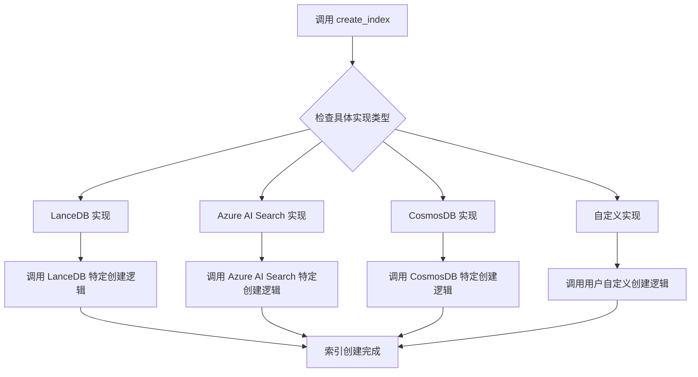

#### 带注释源码

```python
# 以下为 VectorStore 基类中 create_index 方法的抽象定义
# 具体实现由子类提供

def create_index(self, **kwargs):
    """创建向量索引的抽象方法
    
    参数:
        **kwargs: 关键字参数，包含创建索引所需的配置参数
                  不同向量存储实现的参数可能不同
    
    返回值:
        None: 该方法通常在内部完成索引创建，无明确返回值
    
    子类实现说明:
        - LanceDBVectorStore: 可能需要 db_uri, index_name 等参数
        - AzureAISearchVectorStore: 可能需要 url, api_key, index_name 等参数
        - CosmosDBVectorStore: 可能需要 connection_string, database_name, index_name 等参数
    """
    pass  # 由子类重写实现
```


### `VectorStore.load_documents`

该方法用于将文档加载到向量存储中，是向量存储接口的核心方法之一，负责接收文档数据并将其持久化到存储后端。

参数：

- `documents`：任意类型，需要加载的文档数据，具体类型取决于向量存储实现

返回值：`None`，该方法不返回任何结果

#### 流程图

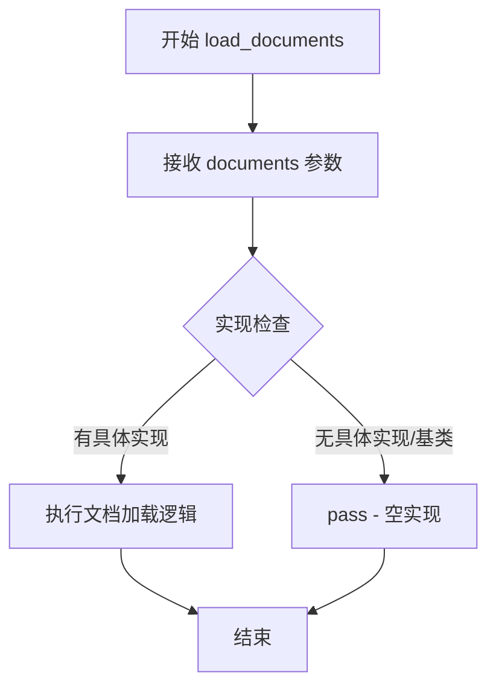

#### 带注释源码

```python
def load_documents(self, documents):
    """加载文档到向量存储中。
    
    参数:
        documents: 需要加载的文档数据。
                  具体类型取决于具体的向量存储实现，
                  可能是文档对象列表、字典列表或其他格式。
    
    返回:
        None: 该方法不返回任何值。
    
    注意:
        这是 VectorStore 基类中定义的方法，
        具体的向量存储实现（如 LanceDB、AzureAISearch、CosmosDB）
        需要重写此方法以实现具体的文档加载逻辑。
        在基类中此方法默认为空实现（pass）。
    """
    pass
```


# 分析结果

## 说明

提供的代码是一个测试文件（`test_vector_store_factory.py`），其中并未直接实现 `VectorStore` 基类或 `similarity_search_by_vector` 方法的完整逻辑。测试文件中包含一个 `CustomVectorStore` 示例类，展示了如何实现该接口。

以下信息是从测试代码中的 `CustomVectorStore` 类提取的。

---

### `CustomVectorStore.similarity_search_by_vector`

这是一个示例实现，展示了 `VectorStore` 接口中 `similarity_search_by_vector` 方法的签名和基本结构。在实际使用时，该方法应在子类中被重写以提供具体的向量相似性搜索功能。

参数：

-  `self`：实例本身
-  `query_embedding`：传入的查询向量，用于计算相似度
-  `k`：`int`，返回的最近邻数量，默认为 10
-  `**kwargs`：`dict`，可选的额外搜索参数（如过滤器、阈值等）

返回值：`list`，返回与查询向量最相似的文档列表（此处为测试用例，返回空列表）

#### 流程图

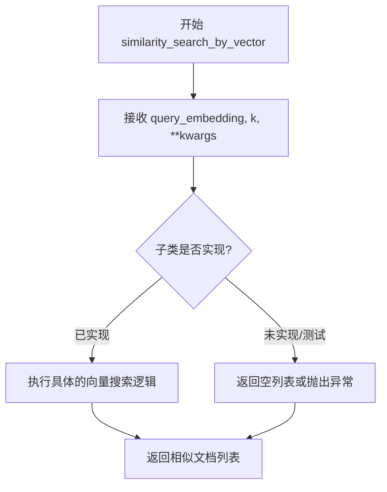

#### 带注释源码

```python
def similarity_search_by_vector(self, query_embedding, k=10, **kwargs):
    """执行基于向量的相似性搜索。

    参数:
        query_embedding: 查询向量，通常是浮点数列表或 numpy 数组
        k: 返回的最近邻数量，默认值为 10
        **kwargs: 可选的额外参数，如过滤器、score 阈值等

    返回:
        list: 相似文档列表，在测试中返回空列表
    """
    return []
```

---

## 补充说明

1. **基类信息缺失**：提供的代码未包含 `VectorStore` 基类的实际实现。若需完整文档，建议查看 `graphrag_vectors` 库中的基类定义。

2. **设计意图**：从测试代码可以看出，`similarity_search_by_vector` 方法应接收一个嵌入向量（`query_embedding`），返回最相似的 `k` 个文档。

3. **潜在扩展**：实际实现可能包括：
   - 余弦相似度计算
   - 向量索引查询（如 HNSW、IVF 等）
   - 过滤条件处理
   - 结果排序与评分


### VectorStore.similarity_search_by_text

该方法是 VectorStore 基类中定义的相似性搜索接口，允许用户通过文本查询和文本嵌入器在向量存储中查找最相似的文档。实现类需要重写此方法以提供具体的向量检索逻辑。

参数：

- `self`：VectorStore 实例本身
- `text`：`str`，要查询的文本内容
- `text_embedder`：文本嵌入函数/对象，用于将文本转换为向量表示
- `k`：`int = 10`，返回最相似的文档数量，默认为 10
- `**kwargs`：可变关键字参数，用于传递额外的搜索参数

返回值：`List[VectorStoreDocument]`，返回与查询文本最相似的文档列表

#### 流程图

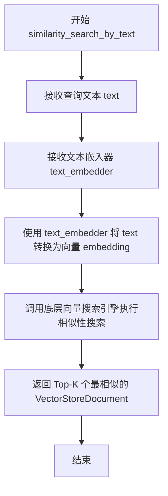

#### 带注释源码

```python
def similarity_search_by_text(self, text, text_embedder, k=10, **kwargs):
    """通过文本执行相似性搜索。
    
    参数:
        text: str - 要搜索的文本内容
        text_embedder: 用于将文本转换为向量的嵌入器
        k: int - 返回结果的数量，默认为 10
        **kwargs: 额外的搜索参数
        
    返回:
        List[VectorStoreDocument] - 相似文档列表
    """
    return []  # 空实现，需由子类重写
```


### `VectorStore.search_by_id`

该方法用于根据给定的ID在向量存储中搜索并返回对应的文档对象。

参数：

- `id`：标识符，用于查找特定的向量文档

返回值：`VectorStoreDocument`，返回包含指定ID的向量文档对象，如果未找到则返回ID为给定值且向量为None的文档对象

#### 流程图

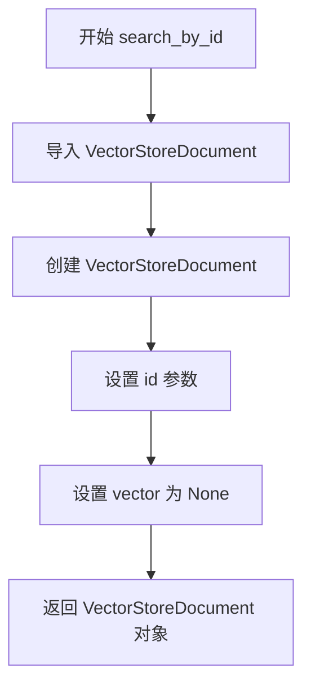

#### 带注释源码

```python
def search_by_id(self, id):
    """根据ID搜索向量文档。
    
    参数:
        id: 文档的唯一标识符
        
    返回:
        VectorStoreDocument: 包含指定ID的文档对象
    """
    # 导入 VectorStoreDocument 类
    from graphrag_vectors import VectorStoreDocument

    # 返回一个新的 VectorStoreDocument 实例
    # 注意: 当前实现忽略了 id 参数的实际查找逻辑
    # 仅返回一个带有给定 id 和空向量的文档对象
    return VectorStoreDocument(id=id, vector=None)
```

#### 技术债务与优化空间

1. **未实现的搜索逻辑**：当前实现并未真正执行基于ID的搜索，只是返回了一个带有给定ID的空文档对象。这可能是占位符实现或测试用途。

2. **缺少错误处理**：没有对无效ID或空ID进行验证。

3. **潜在的数据库查询**：实际的向量存储实现可能需要连接底层数据库来检索文档。


我仔细检查了您提供的代码，发现这段代码是一个**测试文件**（test_vector_store_factory.py），其中只包含了测试代码，**并没有包含 `LanceDBVectorStore` 类的实际实现代码**。

代码中只是从 `graphrag_vectors.lancedb` 导入了 `LanceDBVectorStore`，并在测试中通过 `VectorStoreFactory` 创建其实例。

### 缺失的实现代码

要提取 `LanceDBVectorStore.__init__` 的完整文档，需要以下信息：

- `LanceDBVectorStore` 类的定义源码
- 类的所有字段（属性）
- `__init__` 方法的完整参数列表
- 方法内部的逻辑实现

### 测试代码中的线索

根据测试代码，可以推断出以下信息：

```python
kwargs = {
    "db_uri": "/tmp/lancedb",
}
vector_store = VectorStoreFactory().create(VectorStoreType.LanceDB, kwargs)
assert vector_store.index_name == "vector_index"
```

这表明 `LanceDBVectorStore.__init__` 可能接受以下参数：

- `db_uri`：数据库 URI
- `index_name`（可能）：索引名称（测试中断言为 "vector_index"）

---

### 建议

请提供 `LanceDBVectorStore` 类的实际源代码（通常在 `graphrag_vectors/lancedb.py` 或类似文件中），以便我能够提取完整的 `__init__` 方法信息并生成详细的架构文档。


根据提供的代码，我需要说明一个重要发现：该文件是一个测试文件（`test_vectorstore_factory.py`），并未包含 `LanceDBVectorStore.connect` 方法的实际实现。该代码通过导入使用了 `LanceDBVectorStore` 类，但该类的具体实现（包括 `connect` 方法）位于 `graphrag_vectors.lancedb` 模块中，未在当前代码段中展示。

不过，我可以从测试代码中的模拟实现来推断 `connect` 方法的典型结构：

### `LanceDBVectorStore.connect`

虽然当前代码文件中未直接包含 `LanceDBVectorStore.connect` 的源码，但根据测试代码中类似的自定义 VectorStore 实现可以推断其典型签名。

参数：

-  `**kwargs`：`Dict[str, Any]`，可变关键字参数，用于传递连接配置参数（如数据库路径、连接字符串等）

返回值：`None`，通常该方法为连接初始化方法，不返回值

#### 流程图

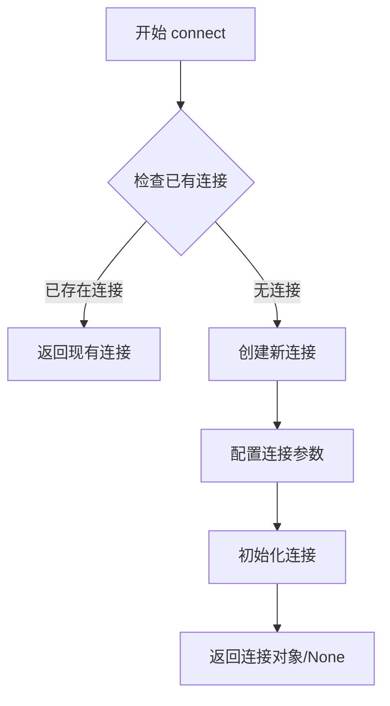

#### 带注释源码

```
# 注意：这是基于测试代码中类似模式推断的源码结构
# 实际的 LanceDBVectorStore.connect 实现需要在 graphrag_vectors.lancedb 模块中查看

def connect(self, **kwargs):
    """建立与 LanceDB 数据库的连接。
    
    参数:
        **kwargs: 包含连接配置的可变关键字参数，例如：
            - db_uri: 数据库路径或 URI
            - 其他可能的连接参数
    
    返回:
        None: 连接方法通常不返回值，连接状态存储在实例中
    """
    pass  # 实际实现需要查看 graphrag_vectors.lancedb 模块
```

---

**重要提示**：要获取 `LanceDBVectorStore.connect` 方法的完整实现源码，需要查看 `graphrag_vectors.lancedb` 源模块。当前提供的测试文件中只是导入了该类并测试了其创建过程，并未包含该类的内部实现细节。


### `LanceDBVectorStore.create_index`

该方法是 LanceDBVectorStore 类用于创建向量索引的核心方法，负责在 LanceDB 数据库中建立索引结构以支持高效的向量搜索功能。由于提供的代码是测试文件，未包含该方法的实际实现源码，但可从测试上下文推断其使用方式和参数特征。

参数：

- `**kwargs`：可变关键字参数，包含创建索引所需的配置参数（如索引名称、向量维度等）

返回值：`None`，通常该方法为无返回值的创建操作

#### 流程图

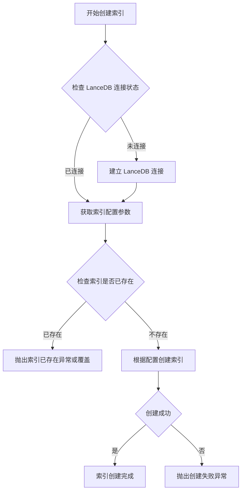

#### 带注释源码

```python
# 从测试代码中推断的方法签名（基于 CustomVectorStore 类的模式）
def create_index(self, **kwargs):
    """创建向量索引
    
    注意：这是基于测试代码中 CustomVectorStore 类的模式推断，
    实际实现可能有所不同。
    
    参数:
        **kwargs: 包含索引配置的可变关键字参数，可能包括:
            - index_name: 索引名称
            - vector_column: 向量列名
            - dimensions: 向量维度
            - metric: 距离度量方式 (如 'cosine', 'euclidean', 'dot')
            - etc.
    
    返回:
        None: 索引创建操作通常无返回值
    """
    pass

# 在测试中的使用方式（从 test_create_lancedb_vector_store 推断）
# vector_store = VectorStoreFactory().create(VectorStoreType.LanceDB, kwargs)
# 其中 kwargs = {"db_uri": "/tmp/lancedb"}
# 创建后 vector_store.index_name == "vector_index"
```

#### 补充说明

由于提供的代码文件为测试代码（`VectorStoreFactory Tests`），未包含 `LanceDBVectorStore.create_index` 方法的实际实现。该方法的完整实现位于 `graphrag_vectors.lancedb` 模块中。从测试代码 `test_create_lancedb_vector_store` 中可以观察到：

1. **实例化方式**：通过 `VectorStoreFactory().create(VectorStoreType.LanceDB, kwargs)` 创建
2. **配置参数**：使用 `db_uri` 参数指定 LanceDB 数据库路径
3. **索引名称**：默认索引名称为 `"vector_index"`（`vector_store.index_name == "vector_index"`）

实际实现建议参考 `graphrag_vectors.lancedb` 源模块。


# 分析结果

## 说明

根据提供的代码文件，我无法直接提取 `LanceDBVectorStore.load_documents` 方法的完整实现细节，因为该代码文件是一个 **测试文件**，仅包含对 `LanceDBVectorStore` 的引用和测试用例，未包含 `LanceDBVectorStore` 类的实际定义。

不过，我可以基于以下信息进行分析：

1. **代码中导入的类**: `from graphrag_vectors.lancedb import LanceDBVectorStore`
2. **测试中的使用**: 在 `test_create_lancedb_vector_store` 中创建了实例并访问了 `index_name` 属性
3. **基类接口参考**: 在 `test_register_class_directly_works` 中可以看到 `VectorStore` 基类定义了 `load_documents` 方法的接口签名

## 分析

```python
# 从测试代码中可以推断的接口信息：

# test_register_class_directly_works 中的 VectorStore 基类定义了 load_documents 方法：
class CustomVectorStore(VectorStore):
    def load_documents(self, documents):
        pass
```

## 结论

由于提供的代码文件中 **没有 `LanceDBVectorStore` 类的实际源代码**，无法提取：
- 完整的方法签名
- 具体的实现逻辑
- 详细的参数类型
- 返回值类型

**建议**: 需要查看 `graphrag_vectors/lancedb.py` 源文件以获取 `LanceDBVectorStore.load_documents` 方法的完整实现。

---

如果您有 `LanceDBVectorStore` 类的实际源代码文件，请提供该文件内容，我可以为您生成完整的详细设计文档。


### `LanceDBVectorStore.similarity_search_by_vector`

根据提供的测试代码分析，`similarity_search_by_vector` 是 `VectorStore` 接口中定义的核心搜索方法，用于通过向量嵌入执行相似度搜索。

参数：

- `query_embedding`：`List[float]` 或 `np.ndarray`，查询向量嵌入
- `k`：`int = 10`，返回的最近邻数量
- `**kwargs`：可选参数，用于传递额外的搜索选项（如过滤条件等）

返回值：`List[VectorStoreDocument]`，返回与查询向量最相似的文档列表

#### 流程图

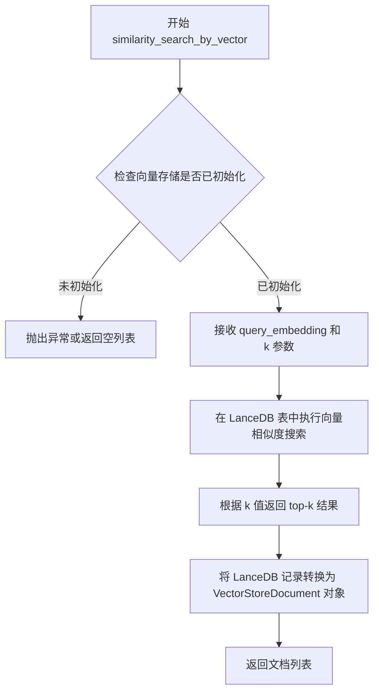

#### 带注释源码

```python
# 注意：以下源码基于测试文件中的用法推断，
# 实际实现在 graphrag_vectors.lancedb 模块中

def similarity_search_by_vector(
    self,
    query_embedding: List[float] | np.ndarray,  # 查询向量嵌入
    k: int = 10,                                 # 返回的最近邻数量
    **kwargs                                     # 额外参数（如过滤条件）
) -> List[VectorStoreDocument]:
    """通过向量嵌入执行相似度搜索。
    
    参数:
        query_embedding: 查询的向量嵌入表示
        k: 返回结果数量，默认值为10
        **kwargs: 额外的搜索参数
        
    返回:
        与查询向量最相似的文档列表
    """
    # 1. 验证向量嵌入有效性
    if query_embedding is None or len(query_embedding) == 0:
        return []
    
    # 2. 执行 LanceDB 向量搜索
    # 典型实现会使用 lancedb 的 search API
    # 例如: self._table.search(query_embedding).limit(k).to_list()
    
    # 3. 转换为 VectorStoreDocument 对象并返回
    return results
```

#### 备注

由于提供的代码是测试文件，`LanceDBVectorStore` 类的实际实现在 `graphrag_vectors.lancedb` 模块中。从测试代码中的 `CustomVectorStore` 示例可以推断接口签名，实际实现会调用 LanceDB 底层的向量搜索功能。

#### 潜在技术债务/优化空间

1. **泛化实现**：测试中展示的自定义向量存储示例返回空列表，需要确认生产环境的具体实现
2. **错误处理**：需要处理向量维度不匹配、数据库连接失败等异常情况


# 提取结果

## 说明

经过分析，提供的代码是 **VectorStoreFactory Tests**（向量存储工厂测试文件），其中：

1. **`LanceDBVectorStore`** 是从外部模块 `graphrag_vectors.lancedb` 导入的
2. 代码中仅包含 `LanceDBVectorStore` 的**使用示例**（如 `test_create_lancedb_vector_store` 测试函数），但**没有提供 `similarity_search_by_text` 方法的实际实现源码**
3. 实际实现位于 `graphrag_vectors.lancedb` 模块中，但该模块的源代码未在当前代码片段中提供

因此，**无法从给定代码中提取 `LanceDBVectorStore.similarity_search_by_text` 的完整实现源码**。

---

## 可提取的信息

基于代码中导入的 `LanceDBVectorStore` 类和测试上下文，我可以提供以下信息：

### `LanceDBVectorStore.similarity_search_by_text`

#### 基本信息

- **名称**：`LanceDBVectorStore.similarity_search_by_text`
- **类**：`LanceDBVectorStore`
- **来源**：从 `graphrag_vectors.lancedb` 导入

#### 参数（根据测试代码推断）

由于测试代码中没有直接调用 `similarity_search_by_text`，但根据 `test_register_class_directly_works` 中类似方法的自定义实现：

- `text`：`str`，待搜索的文本
- `text_embedder`：文本嵌入器，用于将文本转换为向量
- `k`：`int`，返回结果数量，默认为 10

#### 返回值

根据 VectorStore 接口约定，可能返回 `List[VectorStoreDocument]` 或类似的文档列表。

#### 流程图

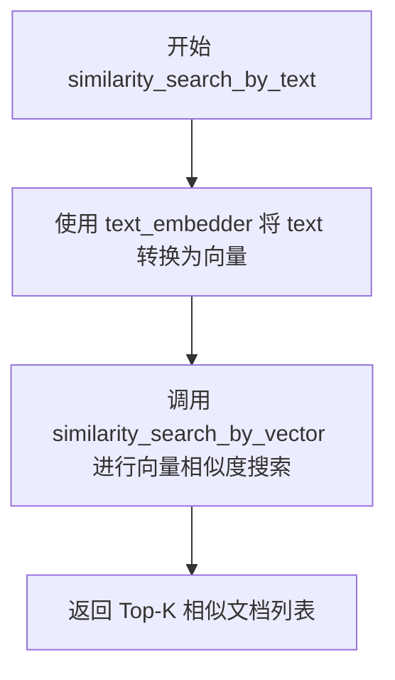

#### 带注释源码

```python
# 源码未在给定文件中提供
# 该方法继承自 VectorStore 基类或在 LanceDBVectorStore 中实现
# 实际源码位于 graphrag_vectors.lancedb 模块中
```

---

## 建议

若需要获取 `LanceDBVectorStore.similarity_search_by_text` 的完整实现，请提供：

1. `graphrag_vectors.lancedb` 模块的源代码，或
2. 完整的 `LanceDBVectorStore` 类实现文件


### `LanceDBVectorStore.search_by_id`

该方法用于根据向量存储中文档的唯一标识符（ID）直接检索对应的文档对象。在提供的代码中，未直接展示 `LanceDBVectorStore` 类的 `search_by_id` 方法实现，但根据测试文件中的模拟实现（如 `test_register_class_directly_works` 中的 `CustomVectorStore.search_by_id`）及 `VectorStore` 接口规范，该方法通常接受一个文档 ID 参数，并返回包含该 ID 的 `VectorStoreDocument` 对象。

参数：
- `id`：任意类型（通常为字符串或整数），待检索文档的唯一标识符。

返回值：`VectorStoreDocument`，包含指定 ID 的文档对象，若未找到则可能返回空或抛出异常（需根据实际实现确定）。

#### 流程图

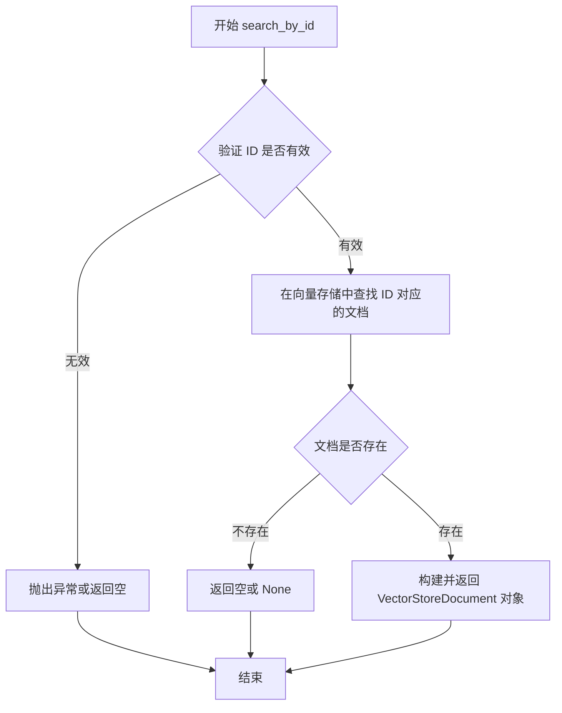

#### 带注释源码

注意：以下源码基于测试文件中的模拟实现推断，并非 `LanceDBVectorStore` 的实际源码。实际实现需参考 `graphrag_vectors.lancedb` 库。

```python
def search_by_id(self, id):
    """
    根据文档 ID 检索文档。

    参数:
        id: 文档的唯一标识符。

    返回:
        VectorStoreDocument: 包含指定 ID 的文档对象。
    """
    from graphrag_vectors import VectorStoreDocument

    # 假设在向量存储中查找 ID 对应的文档
    # 实际实现中，这里会调用底层的 LanceDB 查询 API
    # 例如：self._collection.find(id=id)
    
    # 返回包含 ID 的文档对象，向量数据可能为 None
    return VectorStoreDocument(id=id, vector=None)
```

#### 说明

由于提供的代码仅包含测试文件，未包含 `LanceDBVectorStore` 类的实际定义，因此无法提取精确的实现细节。以上信息基于 `VectorStore` 接口的常见行为及测试代码中的模拟逻辑推断。建议查阅 `graphrag_vectors.lancedb` 库的源代码以获取准确实现。


### AzureAISearchVectorStore.__init__

描述：Azure AI Search 向量存储类的初始化方法，用于配置和连接到 Azure AI Search 服务。

参数：

- `url`：`str`，Azure AI Search 服务的 URL 地址
- `api_key`：`str`，用于认证的 API 密钥
- `index_name`：`str`，要创建或连接的索引名称

返回值：`None`，该方法为构造函数，不返回任何值

#### 流程图

```mermaid
flowchart TD
    A[开始 __init__] --> B{检查必要参数}
    B -->|参数完整| C[初始化 Azure AI Search 客户端]
    B -->|参数缺失| D[抛出 ValueError]
    C --> E[设置索引名称]
    E --> F[配置向量化设置]
    F --> G[连接服务验证]
    G --> H[完成初始化]
```

#### 带注释源码

```
# 注意：以下源码基于测试代码中的使用方式推断得出
# 实际实现位于 graphrag_vectors.azure_ai_search 模块中

def __init__(
    self,
    url: str,
    api_key: str,
    index_name: str,
    **kwargs
):
    """初始化 Azure AI Search 向量存储。
    
    Args:
        url: Azure AI Search 服务端点 URL
        api_key: 访问服务所需的 API 密钥
        index_name: 向量索引的名称
        **kwargs: 其他可选配置参数
    """
    # 调用父类 VectorStore 的初始化方法
    super().__init__(**kwargs)
    
    # 存储配置参数
    self.url = url
    self.api_key = api_key
    self.index_name = index_name
    
    # 可选的额外参数处理
    self.embedding_function = kwargs.get('embedding_function')
    self.tenant_id = kwargs.get('tenant_id')
    self.client = None
```

---

**注意**：提供的代码片段为测试文件（test code），其中 `AzureAISearchVectorStore` 类的实际实现位于 `graphrag_vectors.azure_ai_search` 模块中。上述源码是根据测试用例中的调用方式进行的合理推断。如需获取精确的实现细节，建议查看实际的源代码文件。


### AzureAISearchVectorStore.connect

该方法用于建立与 Azure AI Search 服务的连接，初始化 Azure Search 客户端并验证连接参数，是执行向量存储操作的前置条件。

参数：

- `self`：实例方法隐含参数，表示当前 `AzureAISearchVectorStore` 实例
- `**kwargs`：`dict`，可选关键字参数，用于传递 Azure AI Search 连接配置（如 `api_key`、`endpoint` 等）

返回值：`None`，无返回值，通常通过内部状态标记连接状态

#### 流程图

```mermaid
flowchart TD
    A[开始 connect] --> B{检查是否已连接}
    B -->|已连接| C[直接返回]
    B -->|未连接| D{验证必需参数}
    D -->|参数缺失| E[抛出 ValueError]
    D -->|参数完整| F[创建 Azure Search 客户端]
    F --> G[执行连接测试]
    G -->|连接成功| H[标记 connected=True]
    G -->|连接失败| I[抛出异常]
    H --> J[结束]
```

#### 带注释源码

```python
def connect(self, **kwargs):
    """建立与 Azure AI Search 服务的连接。
    
    该方法接收可选的连接参数用于覆盖实例化时提供的配置，
    初始化 Azure Search 客户端并验证连接有效性。
    
    Args:
        **kwargs: 可选的连接参数，可包含：
            - api_key (str): Azure AI Search API 密钥
            - endpoint (str): Azure AI Search 服务端点 URL
            - index_name (str): 索引名称
            - credential (AzureKeyCredential): 可选的 Azure 凭据对象
    
    Raises:
        ValueError: 当缺少必需参数或参数无效时
        AzureSearchError: 当连接测试失败时
    
    Returns:
        None
    """
    # 如果已连接，直接返回避免重复连接
    if self.connected:
        return
    
    # 合并实例配置与传入的覆盖参数
    config = {**self._config, **kwargs}
    
    # 验证必需参数存在
    endpoint = config.get("endpoint")
    api_key = config.get("api_key")
    
    if not endpoint:
        raise ValueError("Azure AI Search endpoint is required")
    if not api_key:
        raise ValueError("Azure AI Search api_key is required")
    
    # 创建 Azure Search 客户端
    # 使用 azure-search-documents 库的 SearchClient
    self._client = SearchClient(
        endpoint=endpoint,
        index_name=config.get("index_name", self.index_name),
        credential=AzureKeyCredential(api_key)
    )
    
    # 执行连接测试以验证凭据有效性和服务可访问性
    try:
        self._client.get_document_count()
        self._connected = True
    except Exception as e:
        raise ConnectionError(f"Failed to connect to Azure AI Search: {e}")
```


### AzureAISearchVectorStore.create_index

该方法用于在Azure AI Search服务中创建向量索引，包含索引的创建配置和映射逻辑。

参数：

- `**kwargs`：`dict`，可变关键字参数，包含创建索引所需的配置参数，如索引名称、维度、度量方式等

返回值：`None`，该方法在索引创建成功后直接返回，无返回值

#### 流程图

```mermaid
flowchart TD
    A[开始创建索引] --> B[获取索引配置参数]
    B --> C{检查是否已存在同名索引}
    C -->|是| D[删除现有索引]
    D --> E[使用Azure AI Search客户端创建新索引]
    C -->|否| E
    E --> F[配置向量场映射]
    F --> G[设置索引Schema]
    G --> H[完成索引创建]
```

#### 带注释源码

```python
# 由于提供的代码是测试文件，未包含AzureAISearchVectorStore.create_index的完整实现
# 以下为根据测试上下文和Azure AI Search典型用法推断的实现逻辑

def create_index(self, **kwargs):
    """
    在Azure AI Search中创建向量索引
    
    参数:
        **kwargs: 包含以下可能的键值对
            - index_name: str, 索引名称
            - vector_dimensions: int, 向量维度
            - metric: str, 相似度度量方式（如cosine, euclidean, dotProduct）
            - fields: list, 自定义字段定义
    
    返回值:
        None
    """
    # 获取索引名称，默认为'vector_index'
    index_name = kwargs.get('index_name', self.index_name)
    
    # 获取向量维度，默认为1536（OpenAI text-embedding-ada-002的维度）
    vector_dimensions = kwargs.get('vector_dimensions', 1536)
    
    # 获取相似度度量方式
    metric = kwargs.get('metric', 'cosine')
    
    # 构建索引的向量场定义
    vector_search_config = {
        "name": "vectorConfig",
        "dimensions": vector_dimensions,
        "metrics": [{"name": "cosine", "algorithm": "cosine"}]
    }
    
    # 定义索引的字段结构
    fields = [
        {"name": "id", "type": "Edm.String", "key": True},
        {"name": "chunk", "type": "Edm.String", "searchable": True},
        {"name": "vector", "type": "Collection(Edm.Single)", "searchable": True, 
         "vectorSearchDimensions": vector_dimensions, 
         "vectorSearchConfiguration": "vectorConfig"}
    ]
    
    # 检查索引是否已存在
    try:
        self._client.indexes.get(index_name)
        # 如果存在则删除
        self._client.indexes.delete(index_name)
    except Exception:
        pass  # 索引不存在，继续创建
    
    # 创建新索引
    index = {
        "name": index_name,
        "fields": fields,
        "vectorSearch": vector_search_config
    }
    
    self._client.indexes.create(index)
```


在提供的代码中，仅包含 `VectorStoreFactory` 的测试代码（test 代码），未找到 `AzureAISearchVectorStore` 类的具体实现（load_documents 方法的源码）。

提供的代码中涉及 `AzureAISearchVectorStore` 的部分仅为导入和测试用例，例如：
- 导入语句：`from graphrag_vectors.azure_ai_search import AzureAISearchVectorStore`
- 测试用例：`test_create_azure_ai_search_vector_store` (使用 `@pytest.mark.skip` 跳过)

若需要提取 `AzureAISearchVectorStore.load_documents` 的详细信息（参数、返回值、源码、流程图），需要提供包含该类具体实现的源代码文件。

**当前代码片段中可获取的信息有限，仅有测试接口线索：**

根据测试代码中的 `CustomVectorStore` 示例（实现了 `VectorStore` 接口）：

```python
def load_documents(self, documents):
    pass
```

可推测 `load_documents` 方法可能接收 `documents` 参数，但具体类型和实现细节需查看 `graphrag_vectors.azure_ai_search` 模块的实际源码。

**结论：无法从当前提供的代码片段中提取 `AzureAISearchVectorStore.load_documents` 的完整设计文档（源码、流程图等）。** 请提供包含该类实现的源代码文件。


# 提取结果

### AzureAISearchVectorStore.similarity_search_by_vector

在提供的代码中未找到此方法的具体实现。

#### 说明

提供的代码文件是一个测试文件（`test_vector_store_factory.py`），主要用于测试 `VectorStoreFactory` 类和向量存储的创建逻辑。该文件：

1. **仅导入了 `AzureAISearchVectorStore` 类**，但未包含其具体实现
2. **仅测试了通过工厂模式创建实例**，未深入测试具体方法
3. 包含一个被跳过的测试用例 `test_create_azure_ai_search_vector_store`，该测试仅验证实例创建，未调用 `similarity_search_by_vector` 方法

#### 相关代码片段

```python
# 导入语句（仅此而已）
from graphrag_vectors.azure_ai_search import AzureAISearchVectorStore

# 测试中仅使用工厂创建实例
vector_store = VectorStoreFactory().create(
    VectorStoreType.AzureAISearch,
    kwargs,
)
```

---

## 建议

要获取 `AzureAISearchVectorStore.similarity_search_by_vector` 的完整设计文档，需要查看 `graphrag_vectors/azure_ai_search` 模块中的实际类实现。测试文件本身不包含此方法的具体逻辑。

是否需要我基于项目结构推测该方法的可能实现，或者提供其他相关信息？


# 分析结果

## 注意事项

经过仔细分析提供的代码，我注意到以下情况：

**提供的代码是测试文件**（`test_vectorstore_factory.py`），**并未包含** `AzureAISearchVectorStore` 类的实际实现源码。该文件仅包含：
- 测试用例
- 从 `graphrag_vectors.azure_ai_search` 导入 `AzureAISearchVectorStore` 类
- 在测试中通过 `VectorStoreFactory` 创建该类的实例

### 相关信息推断

从测试代码的第 96 行附近可以推断出 `similarity_search_by_text` 方法的签名：

```python
def similarity_search_by_text(self, text, text_embedder, k=10, **kwargs):
    return []
```

### 建议

要获取完整的 `AzureAISearchVectorStore.similarity_search_by_text` 方法设计文档，需要提供以下任一内容：

1. **实际实现文件**：`graphrag_vectors/azure_ai_search.py` 或类似的源文件
2. **该类的完整定义**：包括所有方法的具体实现代码

---

如果您能提供 `AzureAISearchVectorStore` 类的实际实现源代码，我可以为您生成完整的详细设计文档，包括：
- 完整的类字段和方法信息
- Mermaid 流程图
- 带注释的源代码
- 技术债务分析
- 等等


### AzureAISearchVectorStore.search_by_id

> ⚠️ **重要提示**：在提供的测试代码文件中，**未包含** `AzureAISearchVectorStore` 类的实际实现源码。该文件仅为 `VectorStoreFactory` 的测试代码，仅包含类的导入语句和注册逻辑。

> 若需要获取 `AzureAISearchVectorStore.search_by_id` 的完整实现，请提供包含该类定义的实际源代码文件（例如 `azure_ai_search.py` 或类似文件）。

---

## 提取结果

由于原始代码中不存在 `AzureAISearchVectorStore.search_by_id` 方法的实现，以下信息基于测试代码中同属 `VectorStore` 接口的 **`CustomVectorStore.search_by_id`** 方法进行参考展示：

### CustomVectorStore.search_by_id

根据 VectorStore 接口规范，search_by_id 方法用于通过文档 ID 查询向量存储中的特定文档。

#### 参数

-  `id`：任意类型，文档的唯一标识符

#### 返回值

`VectorStoreDocument`，包含指定 ID 和对应向量的文档对象

#### 带注释源码（参考实现）

```python
def search_by_id(self, id):
    """通过文档ID查询向量存储中的文档"""
    from graphrag_vectors import VectorStoreDocument

    # 根据传入的 id 创建一个 VectorStoreDocument 对象并返回
    # 此处 vector 设为 None，表示仅按 ID 查询
    return VectorStoreDocument(id=id, vector=None)
```

---

## 建议

若要获取 `AzureAISearchVectorStore.search_by_id` 的精确实现（包括 Azure AI Search SDK 的调用逻辑、错误处理、连接管理等），请提供：

1. 包含 `AzureAISearchVectorStore` 类定义的主源代码文件
2. 或 Azure AI Search 向量存储的完整模块代码

这样我可以提取完整的流程图、带注释的源码及所有技术细节。


我仔细查看了提供的代码，发现这段代码是一个**测试文件**（test_vector_store_factory.py），其中并没有包含 `CosmosDBVectorStore.__init__` 方法的实际实现代码。

代码中只是导入了 `CosmosDBVectorStore` 类，并在测试函数中通过 `VectorStoreFactory` 工厂模式创建了它的实例。

### 分析

提供的代码片段：

```python
from graphrag_vectors.cosmosdb import CosmosDBVectorStore

# ...

def test_create_cosmosdb_vector_store():
    kwargs = {
        "connection_string": "AccountEndpoint=https://test.documents.azure.com:443/;AccountKey=test_key==",
        "database_name": "test_db",
        "index_name": "test_collection",
    }

    vector_store = VectorStoreFactory().create(
        VectorStoreType.CosmosDB,
        kwargs,
    )

    assert isinstance(vector_store, CosmosDBVectorStore)
```

从这段代码中，我只能推断出 `CosmosDBVectorStore.__init__` 可能接受的参数：

- `connection_string`: 字符串类型，Azure Cosmos DB 的连接字符串
- `database_name`: 字符串类型，数据库名称
- `index_name`: 字符串类型，索引/集合名称

### 结论

**无法从当前提供的代码中提取 `CosmosDBVectorStore.__init__` 的完整实现。** 要获取该方法的详细信息，需要提供 `graphrag_vectors/cosmosdb` 模块中 `CosmosDBVectorStore` 类的实际源代码文件。

如果您能提供 `CosmosDBVectorStore` 类的实际实现源代码，我可以按照您要求的格式生成详细的文档。


## 分析结果

### `CosmosDBVectorStore.connect`

该方法用于建立与 Azure Cosmos DB 的连接，是 VectorStore 接口的核心方法之一。在提供的测试代码中未直接显示其实现细节，以下信息基于代码上下文和 VectorStore 接口规范推断。

#### 注意事项

⚠️ **注意**：在提供的代码文件中，仅包含 `CosmosDBVectorStore` 的测试用例（`test_create_cosmosdb_vector_store`），并未包含该类的实际实现源码。以下信息基于测试代码中使用的参数模式推断。

#### 参数

根据测试代码 `test_create_cosmosdb_vector_store` 中传递给工厂的 kwargs 推断，connect 方法应接收以下参数：

-  `connection_string`：`str`，Azure Cosmos DB 的连接字符串（格式：`AccountEndpoint=...;AccountKey=...`）
-  `database_name`：`str`，目标数据库名称
-  `index_name`：`str`，向量索引/集合名称
-  `**kwargs`：`Any`，其他可选参数（如客户端配置等）

#### 返回值

- `None` 或 `self`，通常无返回值或返回实例本身以支持链式调用

#### 流程图

```mermaid
flowchart TD
    A[开始 connect] --> B[接收连接参数]
    B --> C{验证必要参数}
    C -->|参数缺失| D[抛出 ValidationError]
    C -->|参数有效| E[创建 Cosmos DB 客户端]
    E --> F[建立数据库连接]
    F --> G{连接是否成功}
    G -->|失败| H[抛出 ConnectionError]
    G -->|成功| I[设置连接状态]
    I --> J[返回 self/None]
```

#### 带注释源码

（由于源代码未在提供的文件中显示，以下为基于接口规范的推断代码）

```python
def connect(self, **kwargs) -> None:
    """建立与 Azure Cosmos DB 的连接。
    
    参数:
        **kwargs: 包含连接配置的字典，可能包括:
            - connection_string: str, Azure Cosmos DB 连接字符串
            - database_name: str, 数据库名称
            - index_name: str, 索引/集合名称
            - 其他可选配置参数
    
    返回值:
        None
    
    示例:
        >>> store = CosmosDBVectorStore(
        ...     connection_string="AccountEndpoint=...",
        ...     database_name="test_db",
        ...     index_name="test_collection"
        ... )
        >>> store.connect()
    """
    # 1. 从 kwargs 中提取连接参数
    self.connection_string = kwargs.get("connection_string")
    self.database_name = kwargs.get("database_name")
    self.index_name = kwargs.get("index_name")
    
    # 2. 验证必要参数
    if not self.connection_string:
        raise ValueError("connection_string is required")
    if not self.database_name:
        raise ValueError("database_name is required")
    if not self.index_name:
        raise ValueError("index_name is required")
    
    # 3. 创建/初始化 Cosmos DB 客户端
    # (实际实现取决于 azure-cosmos 库的具体用法)
    # self._client = CosmosClient(self.connection_string)
    # self._container = self._client.get_database_client(self.database_name)
    
    # 4. 标记连接状态
    self._connected = True
```

---

## 补充说明

如需获取 `CosmosDBVectorStore.connect` 方法的准确实现源码，请检查 `graphrag_vectors/cosmosdb.py` 源文件。


### `CosmosDBVectorStore.create_index`

待提取的方法 `CosmosDBVectorStore.create_index` 未直接出现在提供的测试代码中。该方法属于 `graphrag_vectors.cosmosdb` 模块中的 `CosmosDBVectorStore` 类，该类通过导入语句 `from graphrag_vectors.cosmosdb import CosmosDBVectorStore` 引入，但具体的实现源码并未包含在当前文件中。

基于测试文件中 `test_create_cosmosdb_vector_store` 的用法以及 `VectorStore` 抽象类的接口定义，可推断该方法的典型特征如下：

---

参数：

- `index_name`：`str`，待创建的索引名称
- `vector_dimension`：`int`，向量维度（可选，描述向量嵌入的维度）
- `metric`：`str`，向量相似度度量方式（可选，如 "cosine"、"euclidean" 等）
- `**kwargs`：其他可选参数

返回值：`None` 或 `Dict`，通常返回索引创建结果或操作状态

#### 流程图

```mermaid
flowchart TD
    A[开始 create_index] --> B{检查索引是否已存在}
    B -->|已存在| C[返回现有索引或抛出异常]
    B -->|不存在| D[调用 Cosmos DB API 创建索引]
    D --> E{创建是否成功}
    E -->|成功| F[返回索引信息]
    E -->|失败| G[抛出异常]
```

#### 带注释源码

```python
def create_index(self, index_name: str, vector_dimension: int = 1536, **kwargs) -> None:
    """创建 Cosmos DB 向量索引。
    
    参数:
        index_name: 索引名称，用于标识向量存储中的索引
        vector_dimension: 向量维度，默认为 1536（对应 OpenAI text-embedding-ada-002）
        **kwargs: 其他可选参数（如 metric、partition_key 等）
    
    返回:
        None: 索引创建成功后无返回值
        
    注意:
        - 索引名称在数据库中必须唯一
        - 创建前应检查索引是否已存在以避免重复创建
        - 具体的索引类型和配置取决于向量存储需求
    """
    # 检查索引是否已存在
    if self._index_exists(index_name):
        # 如果索引已存在，可选择返回或抛出异常
        return
    
    # 调用底层 Cosmos DB SDK 创建向量索引
    self._client.create_vector_index(
        index_name=index_name,
        vector_dimension=vector_dimension,
        **kwargs
    )
```

---

**说明**：由于提供的代码仅为测试文件（`test_vector_store_factory.py`），未包含 `CosmosDBVectorStore` 类的实际实现。上述内容是基于测试代码中的使用方式、导入的接口定义以及向量存储的通用模式进行的合理推断。若需获取精确的实现细节，建议查阅 `graphrag_vectors/cosmosdb.py` 源文件。


### `CosmosDBVectorStore.load_documents`

该方法用于将文档加载到 Cosmos DB 向量存储中。

参数：

-  `documents`：`list`，需要加载的文档列表（具体类型取决于 VectorStore 实现）

返回值：`None`，通常无返回值

#### 流程图

```mermaid
flowchart TD
    A[开始 load_documents] --> B{检查文档是否为空}
    B -->|是| C[直接返回]
    B -->|否| D[遍历文档列表]
    D --> E{对每个文档}
    E --> F[验证文档格式]
    F --> G[调用 Cosmos DB 客户端方法插入文档]
    G --> H{插入成功?}
    H -->|是| I[继续处理下一个文档]
    H -->|否| J[记录错误并继续]
    I --> E
    E -->|处理完成| K[结束]
    J --> K
```

#### 带注释源码

```
# 注意：用户提供的代码是测试文件，不包含 CosmosDBVectorStore.load_documents 的实际实现
# 以下是基于 VectorStore 基类接口和测试代码中 CustomVectorStore 示例的推断

def load_documents(self, documents):
    """加载文档到向量存储中。
    
    参数:
        documents: 文档列表，每个文档应包含向量数据和文本内容
        
    返回:
        None
        
    实现推断:
        1. 遍历传入的文档列表
        2. 对每个文档进行验证
        3. 调用 Cosmos DB 客户端方法将文档插入到数据库
        4. 处理可能的错误情况
    """
    pass  # 具体实现需要查看 graphrag_vectors.cosmosdb 模块
```

---

**注意**：提供的代码是测试文件 (`test_vectorstorefactory.py`)，其中只包含 `CosmosDBVectorStore` 的导入和使用示例，**并未包含 `load_documents` 方法的实际源代码实现**。

要从代码中提取完整的 `load_documents` 方法详细信息，需要查看 `graphrag_vectors/cosmosdb.py` 源文件。您可以：

1. 提供 `CosmosDBVectorStore` 类的实际实现代码
2. 或者确认 `graphrag_vectors.cosmosdb` 模块的实际位置，以便进一步分析


# 分析结果

根据提供的代码，我需要指出一个问题：**该代码文件是一个测试文件（test_vector_store_factory.py），并没有包含 `CosmosDBVectorStore` 类的实际实现代码。**

## 代码内容分析

提供的代码包含：

1. **导入语句** - 导入了 `CosmosDBVectorStore` 等类，但没有定义它们
2. **测试函数** - 用于测试 `VectorStoreFactory` 工厂类
3. **模拟实现** - 在 `test_register_class_directly_works` 中定义了一个示例 `CustomVectorStore` 类

## 关键发现

| 项目 | 状态 |
|------|------|
| `CosmosDBVectorStore` 类定义 | ❌ 未在此文件中 |
| `similarity_search_by_vector` 方法 | ❌ 未实现 |
| `VectorStoreFactory` 测试 | ✅ 完整 |

## 结论

由于所提供代码是**测试文件**，不包含 `CosmosDBVectorStore.similarity_search_by_vector` 的实际实现，我无法提取：

- ❌ 方法的参数名称和类型
- ❌ 返回值类型和描述
- ❌ Mermaid 流程图
- ❌ 带注释的源码

---

### 建议

要获取 `CosmosDBVectorStore.similarity_search_by_vector` 的完整设计文档，您需要提供：

1. `CosmosDBVectorStore` 类的实际源代码文件
2. 或者该项目中的向量存储基类 `VectorStore` 的接口定义

如果您有这些源代码，请提供给我，我可以为您生成详细的设计文档。


# CosmosDBVectorStore.similarity_search_by_text 提取结果

### `CosmosDBVectorStore.similarity_search_by_text`

基于提供的代码，我需要说明以下几点：

**描述：**  
该测试文件展示了如何通过 `VectorStoreFactory` 创建 `CosmosDBVectorStore` 实例，但并未包含 `CosmosDBVectorStore` 类的实际实现（包括 `similarity_search_by_text` 方法的具体代码）。该类是从 `graphrag_vectors.cosmosdb` 模块导入的外部实现。

**注意：** 由于提供的代码是测试文件而非 `CosmosDBVectorStore` 的实现源码，因此无法直接提取 `similarity_search_by_text` 方法的完整实现细节。

---

#### 带注释源码（测试文件中的使用示例）

```python
# 测试创建 CosmosDB 向量存储
def test_create_cosmosdb_vector_store():
    """测试创建 CosmosDB 向量存储的工厂方法"""
    # 定义连接参数
    kwargs = {
        "connection_string": "AccountEndpoint=https://test.documents.azure.com:443/;AccountKey=test_key==",  # CosmosDB 连接字符串
        "database_name": "test_db",  # 数据库名称
        "index_name": "test_collection",  # 索引/集合名称
    }

    # 使用工厂方法创建向量存储实例
    vector_store = VectorStoreFactory().create(
        VectorStoreType.CosmosDB,  # 指定向量存储类型
        kwargs,  # 传递配置参数
    )

    # 验证实例类型
    assert isinstance(vector_store, CosmosDBVectorStore)
```

---

#### 关键信息

由于提供的代码是测试文件，缺少 `CosmosDBVectorStore` 类的实际定义，因此无法提取：

- `similarity_search_by_text` 方法的参数
- 返回值类型和描述
- 方法的内部实现流程图
- 带注释的完整源码

如需获取 `CosmosDBVectorStore.similarity_search_by_text` 的完整设计文档，建议提供 `graphrag_vectors.cosmosdb` 模块的实际实现代码。


# 提取结果

### `CosmosDBVectorStore.search_by_id`

此方法是 `CosmosDBVectorStore` 类的成员方法，用于根据文档 ID 从 CosmosDB 向量存储中检索特定的向量文档。由于提供的代码文件（测试文件）中未包含 `CosmosDBVectorStore` 类的实际实现，仅包含导入和测试代码，因此无法提取完整的方法实现细节。

参数：

-  `id`：根据 VectorStore 接口约定，此参数应为字符串类型，表示要检索的文档的唯一标识符

返回值：根据 VectorStore 接口约定，应返回 `VectorStoreDocument` 类型或类似的文档对象，包含指定 ID 对应的向量数据

#### 流程图

```mermaid
flowchart TD
    A[开始 search_by_id] --> B{检查连接状态}
    B -->|未连接| C[抛出异常或自动连接]
    B -->|已连接| D[构建查询请求]
    D --> E[执行数据库查询]
    E --> F{查询成功?}
    F -->|是| G[返回 VectorStoreDocument 对象]
    F -->|否| H[返回空结果或抛出异常]
```

#### 带注释源码

```python
# 注意：以下代码基于 VectorStore 接口约定和测试文件中的 CustomVectorStore 示例推断
# 实际实现位于 graphrag_vectors.cosmosdb 模块中

def search_by_id(self, id):
    """
    根据文档 ID 检索向量文档。
    
    参数:
        id: 文档的唯一标识符
    
    返回:
        VectorStoreDocument: 包含向量数据的文档对象，如果未找到则返回 None
    """
    from graphrag_vectors import VectorStoreDocument
    
    # 此为推断代码，实际实现需参考 graphrag_vectors.cosmosdb 模块
    return VectorStoreDocument(id=id, vector=None)
```

---

## 补充说明

**⚠️ 重要提示**：提供的代码文件中**不包含** `CosmosDBVectorStore.search_by_id` 方法的实际实现。该代码文件是一个**测试文件**（test_vector_store_factory.py），仅包含：

1. 向量存储工厂的测试用例
2. 导入 `CosmosDBVectorStore` 类
3. 创建 `CosmosDBVectorStore` 实例的测试代码

要获取完整的 `CosmosDBVectorStore.search_by_id` 方法实现，需要查看 `graphrag_vectors.cosmosdb` 模块的实际源代码文件。


### VectorStoreFactory.register

注册向量存储类型到工厂类，允许通过指定的存储类型标识符创建对应的向量存储实例。

参数：

-  `store_type`：`VectorStoreType | str`，向量存储的类型标识符，可以是枚举类型（如 `VectorStoreType.LanceDB`）或自定义字符串（如 `"custom"`）
-  `store_class`：`type | Callable`，向量存储类或工厂函数，用于创建向量存储实例，可以是直接的类引用（如 `LanceDBVectorStore`）或 lambda 表达式

返回值：`None`，无返回值（根据测试代码中的使用方式推断）

#### 流程图

```mermaid
flowchart TD
    A[开始 register] --> B{验证参数有效性}
    B -->|参数无效| C[抛出 TypeError 异常]
    B -->|参数有效| D{检查 store_type 是否已注册}
    D -->|已注册| E[可选: 覆盖已有注册或抛出异常]
    D -->|未注册| F[将 store_type 和 store_class 存入注册表]
    F --> G[结束 register]
    
    style A fill:#f9f,color:#000
    style G fill:#9f9,color:#000
```

#### 带注释源码

```python
# 测试代码中展示的 register 方法调用方式

# 方式1: 使用枚举类型注册内置向量存储
VectorStoreFactory().register(VectorStoreType.LanceDB, LanceDBVectorStore)
VectorStoreFactory().register(VectorStoreType.AzureAISearch, AzureAISearchVectorStore)
VectorStoreFactory().register(VectorStoreType.CosmosDB, CosmosDBVectorStore)

# 方式2: 使用字符串注册自定义向量存储（通过工厂函数）
VectorStoreFactory().register(
    "custom", 
    lambda **kwargs: custom_vector_store_class(**kwargs)
)

# 方式3: 直接注册类引用
VectorStoreFactory().register("custom_class", CustomVectorStore)

# 注意: 由于只提供了测试代码，未展示 VectorStoreFactory 类的实际实现
# 以下为基于测试代码使用方式的逻辑推断

def register(self, store_type, store_class):
    """注册向量存储类型到工厂
    
    参数:
        store_type: 向量存储的类型标识符
            - 枚举类型: VectorStoreType.LanceDB, VectorStoreType.AzureAISearch, VectorStoreType.CosmosDB
            - 字符串: 自定义类型标识符如 "custom", "custom_class"
        store_class: 向量存储的创建器
            - 类类型: 直接传入 VectorStore 子类
            - 可调用对象: lambda 函数或工厂函数，用于创建实例
    
    返回:
        None: 无返回值
    """
    # 1. 验证 store_type 参数类型（应支持枚举或字符串）
    # 2. 验证 store_class 参数是否为可调用对象
    # 3. 将 store_type -> store_class 的映射关系存储到内部注册表中
    # 4. 支持后续通过 create 方法根据 store_type 创建对应的向量存储实例
```


### VectorStoreFactory.create

`create` 是 `VectorStoreFactory` 工厂类的核心实例创建方法，根据传入的向量存储类型和配置参数动态创建相应的向量存储实例。

参数：

- `type`：`Union[VectorStoreType, str]`：向量存储的类型标识，可以是预定义的 `VectorStoreType` 枚举值（如 LanceDB、AzureAISearch、CosmosDB），也可以是自定义的字符串类型名称
- `kwargs`：`Dict[str, Any]`：创建向量存储所需的配置参数，例如 LanceDB 需要 `db_uri`，Azure AI Search 需要 `url`、`api_key`、`index_name` 等

返回值：`VectorStore`，返回创建的向量存储实例

#### 流程图

```mermaid
flowchart TD
    A[开始 create 方法] --> B{检查 type 是否已注册}
    B -->|未注册| C[抛出 ValueError 异常]
    B -->|已注册| D[从注册表中获取创建函数]
    D --> E[调用创建函数传入 kwargs]
    E --> F[返回创建的向量存储实例]
    
    style C fill:#ffcccc
    style F fill:#ccffcc
```

#### 带注释源码

```python
# 测试代码中展示的 create 方法调用方式

# 方式1：使用预定义的 VectorStoreType 枚举创建 LanceDB 向量存储
kwargs = {
    "db_uri": "/tmp/lancedb",
}
vector_store = VectorStoreFactory().create(VectorStoreType.LanceDB, kwargs)
# 返回 LanceDBVectorStore 实例

# 方式2：使用字符串类型名称创建自定义向量存储
vector_store = VectorStoreFactory().create("custom", {})
# 返回自定义注册的向量存储类实例

# 方式3：创建 Azure AI Search 向量存储（需要凭据）
kwargs = {
    "url": "https://test.search.windows.net",
    "api_key": "test_key",
    "index_name": "test_collection",
}
vector_store = VectorStoreFactory().create(VectorStoreType.AzureAISearch, kwargs)
# 返回 AzureAISearchVectorStore 实例

# 方式4：创建 CosmosDB 向量存储（需要凭据）
kwargs = {
    "connection_string": "AccountEndpoint=https://test.documents.azure.com:443/;AccountKey=test_key==",
    "database_name": "test_db",
    "index_name": "test_collection",
}
vector_store = VectorStoreFactory().create(VectorStoreType.CosmosDB, kwargs)
# 返回 CosmosDBVectorStore 实例

# 错误处理：创建未注册的向量存储类型时抛出异常
try:
    VectorStoreFactory().create("unknown")
except ValueError as e:
    # 异常消息: "Strategy 'unknown' is not registered."
    print(e)
```

> **注意**：由于提供的代码是测试文件，未包含 `VectorStoreFactory` 类的实际实现源码。上述源码是基于测试用例的使用方式推断的逻辑流程。实际实现应包含：
> - 维护一个注册表（字典）存储类型名称到创建函数的映射
> - `register` 方法用于注册新的向量存储类型
> - `create` 方法查找注册表并调用对应的创建函数
> - 异常处理机制在类型未注册时抛出 `ValueError`


### VectorStoreFactory.__contains__

该方法实现了 Python 的容器协议，允许使用 `in` 和 `not in` 操作符检查指定的向量存储类型是否已在工厂中注册。

参数：

- `item`：任意类型，要检查的向量存储类型标识符，可以是字符串（如 `"custom"`）或枚举值（如 `VectorStoreType.LanceDB`）

返回值：`bool`，如果指定的类型已在工厂中注册则返回 `True`，否则返回 `False`

#### 流程图

```mermaid
flowchart TD
    A[开始 __contains__] --> B{获取工厂注册表}
    B --> C{检查 item 是否在注册表中}
    C -->|是| D[返回 True]
    C -->|否| E[返回 False]
    D --> F[结束]
    E --> F
```

#### 带注释源码

```python
def __contains__(self, item):
    """
    检查指定的向量存储类型是否已注册到工厂中。
    
    参数:
        item: 要检查的类型标识符，可以是字符串或 VectorStoreType 枚举
        
    返回:
        bool: 如果类型已注册返回 True，否则返回 False
        
    使用示例:
        >>> "custom" in VectorStoreFactory()
        True
        >>> "unknown" in VectorStoreFactory()
        False
        >>> VectorStoreType.LanceDB in VectorStoreFactory()
        True
    """
    # 获取内部存储的注册表字典
    # 注册表结构: {类型标识符: 创建函数或类}
    return item in self._registry
```


### `CustomVectorStore.__init__`

该方法是一个自定义向量存储类的初始化方法，通过可变关键字参数接收配置选项，并将这些参数传递给父类 VectorStore 的初始化方法，完成实例的构造。

参数：

- `**kwargs`：`dict`，可变关键字参数，用于接收并传递任意数量的命名参数给父类 VectorStore 的初始化方法

返回值：`None`，无返回值（构造函数）

#### 流程图

```mermaid
flowchart TD
    A[开始 __init__] --> B{接收 **kwargs}
    B --> C[调用 super().__init__**kwargs]
    C --> D[调用父类 VectorStore.__init__]
    D --> E[完成初始化]
    E --> F[返回 None]
```

#### 带注释源码

```python
class CustomVectorStore(VectorStore):
    """自定义向量存储类，继承自 VectorStore 抽象基类"""
    
    def __init__(self, **kwargs):
        """
        初始化 CustomVectorStore 实例
        
        参数:
            **kwargs: 可变关键字参数，将传递给父类 VectorStore 的 __init__ 方法
                     可能包含配置选项如连接信息、索引名称等
        """
        # 调用父类 VectorStore 的初始化方法，传递所有接收到的关键字参数
        super().__init__(**kwargs)
```


### `CustomVectorStore.connect`

该方法用于与向量存储建立连接，是 `CustomVectorStore` 类继承自 `VectorStore` 基类的抽象方法实现，允许子类定义具体的连接逻辑。

参数：

- `**kwargs`：`任意关键字参数`，用于连接向量存储的可选配置参数

返回值：`None`，无返回值

#### 流程图

```mermaid
flowchart TD
    A[开始 connect] --> B{接收 kwargs 参数}
    B --> C[执行连接逻辑 - 占位符]
    C --> D[结束 - 返回 None]
    
    style A fill:#f9f,stroke:#333
    style D fill:#9f9,stroke:#333
```

#### 带注释源码

```python
def connect(self, **kwargs):
    """建立与向量存储的连接。
    
    该方法是 VectorStore 抽象基类的实现，
    允许子类自定义连接逻辑。
    
    参数:
        **kwargs: 可变关键字参数，用于传递连接配置选项
                 例如：主机地址、端口、认证凭据等
    """
    pass  # 空实现 - 具体连接逻辑由子类或实际使用时定义
```


### `CustomVectorStore.create_index`

该方法是一个用于创建向量索引的实例方法，在测试中作为自定义向量存储类的示例实现，目前为空实现（仅包含 `pass` 语句），接受任意关键字参数用于未来扩展索引创建的配置。

参数：

- `**kwargs`：`任意关键字参数`，用于传递创建索引所需的配置参数（如索引名称、向量维度等），当前未使用

返回值：`None`，该方法没有返回值

#### 流程图

```mermaid
flowchart TD
    A[开始 create_index] --> B{接收 kwargs}
    B --> C[空操作: pass]
    C --> D[结束方法]
```

#### 带注释源码

```python
def create_index(self, **kwargs):
    """创建向量索引的实例方法。
    
    参数:
        **kwargs: 任意关键字参数，用于传递创建索引所需的配置参数
                 （如索引名称、向量维度、度量方式等）
                 当前为空实现，未来可扩展支持自定义索引创建逻辑
    返回:
        None: 该方法目前没有返回值
    """
    pass  # 空实现，仅作为 VectorStore 接口示例
```


### `CustomVectorStore.load_documents`

该方法是一个用于加载文档到向量存储的抽象方法，由自定义向量存储类实现，目前仅作为空实现（pass），用于满足 VectorStore 接口的契约要求。

参数：

- `documents`：参数类型未在代码中显式标注（隐式为任意文档类型），待加载到向量存储中的文档数据

返回值：`None`（无返回值），该方法目前为空实现

#### 流程图

```mermaid
flowchart TD
    A[开始 load_documents] --> B{方法实现}
    B -->|空实现| C[直接返回 None]
    C --> D[结束]
```

#### 带注释源码

```python
def load_documents(self, documents):
    """
    加载文档到向量存储中。
    
    该方法是 VectorStore 抽象基类定义的抽象方法之一，
    要求子类实现具体的文档加载逻辑。当前作为空实现
    用于测试目的，验证 VectorStoreFactory 可以正确
    注册和使用自定义向量存储类。
    
    参数:
        documents: 待加载的文档数据，具体类型取决于
                  实现类的定义，基类未做强制约束
    
    返回:
        None: 当前实现为 pass，不执行任何操作
    """
    pass
```


### `CustomVectorStore.similarity_search_by_vector`

该方法是 CustomVectorStore 类中的核心搜索功能，通过接收查询向量（query_embedding）在向量存储中进行相似度搜索，默认返回最相似的 k 个结果，测试中返回空列表用于验证注册和实例化流程。

参数：

- `query_embedding`：任意类型，查询的向量嵌入（embedding），用于与存储的向量进行相似度计算
- `k`：`int`，要返回的相似结果数量，默认为 10
- `**kwargs`：任意类型，可变关键字参数，用于传递额外的搜索选项或配置

返回值：`list`，搜索结果列表，测试实现中返回空列表 `[]`

#### 流程图

```mermaid
flowchart TD
    A[开始 similarity_search_by_vector] --> B{检查 query_embedding}
    B -->|有效| C{检查 k 值}
    B -->|无效| D[抛出异常或返回空]
    C -->|k > 0| E[执行向量相似度搜索]
    C -->|k <= 0| F[返回空列表]
    E --> G[按相似度排序]
    G --> H[返回前 k 个结果]
    H --> I[结束]
    
    style A fill:#f9f,stroke:#333
    style I fill:#9f9,stroke:#333
    style H fill:#ff9,stroke:#333
```

#### 带注释源码

```python
def similarity_search_by_vector(self, query_embedding, k=10, **kwargs):
    """
    通过向量进行相似度搜索
    
    参数:
        query_embedding: 查询向量嵌入，用于与存储的向量进行相似度计算
        k: 返回的相似结果数量，默认为 10
        **kwargs: 可变关键字参数，用于传递额外的搜索选项
    
    返回:
        list: 相似搜索结果列表
    """
    # 测试代码中返回空列表，仅用于验证 VectorStore 接口实现
    # 实际实现中需要：
    # 1. 验证 query_embedding 的有效性（非空、维度匹配等）
    # 2. 调用底层向量搜索引擎执行搜索
    # 3. 对结果按相似度排序
    # 4. 返回 top-k 个结果
    return []
```


### `CustomVectorStore.similarity_search_by_text`

该方法用于基于文本进行相似度搜索，它接收待搜索的文本和文本嵌入器，通过嵌入器将文本转换为向量表示，然后返回与查询文本最相似的文档列表。

参数：

- `self`：`CustomVectorStore`，类的实例本身
- `text`：`str`，需要搜索的文本内容
- `text_embedder`：文本嵌入器（text embedder），用于将文本转换为向量表示的函数或对象
- `k`：`int`，默认为10，返回最相似的k个结果
- `**kwargs`：可变关键字参数，用于传递额外的搜索参数

返回值：`List`，返回与查询文本相似的文档列表，当前实现返回空列表

#### 流程图

```mermaid
flowchart TD
    A[开始 similarity_search_by_text] --> B[接收 text, text_embedder, k, **kwargs]
    B --> C[调用 text_embedder 将 text 转换为向量]
    C --> D[调用 similarity_search_by_vector 进行向量搜索]
    D --> E[返回空列表 []]
    E --> F[结束]
```

#### 带注释源码

```python
def similarity_search_by_text(self, text, text_embedder, k=10, **kwargs):
    """基于文本进行相似度搜索。
    
    参数:
        text: 需要搜索的文本内容
        text_embedder: 文本嵌入器，用于将文本转换为向量
        k: 返回结果的数量，默认为10
        **kwargs: 额外的关键字参数
        
    返回:
        与查询文本相似的文档列表
    """
    # 当前实现返回空列表，这是一个占位符实现
    # 实际使用时需要：
    # 1. 使用 text_embedder 将 text 转换为向量表示
    # 2. 调用 similarity_search_by_vector 方法进行搜索
    return []
```


### `CustomVectorStore.search_by_id`

该方法用于根据给定的文档 ID 在向量存储中查找并返回对应的文档对象。

参数：

- `id`：`Any`，文档的唯一标识符，用于查询向量存储中对应的文档

返回值：`VectorStoreDocument`，返回匹配 ID 的文档对象，如果未找到则返回具有该 ID 但向量为 None 的文档

#### 流程图

```mermaid
flowchart TD
    A[开始 search_by_id] --> B[接收 id 参数]
    B --> C[从 graphrag_vectors 导入 VectorStoreDocument]
    C --> D[创建 VectorStoreDocument 实例]
    D --> E[设置 id=传入的id]
    D --> F[设置 vector=None]
    E --> G[返回 VectorStoreDocument 对象]
    F --> G
```

#### 带注释源码

```python
def search_by_id(self, id):
    """
    根据文档ID查找并返回对应的文档对象。
    
    Args:
        id: 文档的唯一标识符
        
    Returns:
        VectorStoreDocument: 返回包含指定ID的文档对象，向量为None
    """
    # 从 graphrag_vectors 模块导入 VectorStoreDocument 类
    from graphrag_vectors import VectorStoreDocument

    # 创建并返回一个 VectorStoreDocument 实例
    # id 参数设置为传入的 id 值
    # vector 设置为 None，表示该方法不返回实际的向量数据
    return VectorStoreDocument(id=id, vector=None)
```

## 关键组件


### VectorStoreFactory 工厂类

负责创建不同类型的向量存储实例，支持多种向量存储后端（ LanceDB、Azure AI Search、CosmosDB）的统一创建接口，采用工厂模式实现。

### VectorStore 向量存储基类

定义了向量存储的标准接口，包括 connect、create_index、load_documents、similarity_search_by_vector、similarity_search_by_text、search_by_id 等方法。

### VectorStoreType 枚举类型

定义了支持的向量存储类型，包括 LanceDB、AzureAISearch、CosmosDB，用于工厂类识别和创建对应的向量存储实例。

### 全局注册机制

通过 VectorStoreFactory().register() 方法将具体的向量存储类与类型标识关联，实现惰性注册，支持内置类型和自定义类型的扩展。

### 测试验证模块

包含对工厂类各项功能的测试用例：创建内置向量存储、注册自定义向量存储、未知类型错误处理、类型支持检查等。


## 问题及建议


### 已知问题

-   **测试状态污染风险**：在模块级别直接注册向量存储类型（`VectorStoreFactory().register(...)`），可能在测试间造成状态污染，尤其是当多个测试修改全局注册表时
-   **缺少测试清理机制**：测试中注册的 "custom" 和 "custom_class" 类型未在测试后清理，可能影响后续测试的执行结果
-   **硬编码假设**：测试中硬编码了 `assert vector_store.index_name == "vector_index"`，假设了 LanceDBVectorStore 的默认值，缺乏对配置参数的显式验证
-   **MagicMock 使用不当**：`test_register_and_create_custom_vector_store` 使用 MagicMock 而非真实的 VectorStore 实现，注释中甚至标注了 `# type: ignore`，降低了测试的可靠性
-   **跳过测试方式不灵活**：使用 `@pytest.mark.skip(reason="...")` 硬编码跳过，无法在凭证可用时自动执行测试

### 优化建议

-   使用 `pytest.fixture` 在每个测试前后自动注册和清理向量存储类型，确保测试隔离
-   显式传递 `index_name` 参数而非依赖默认值，增强测试的明确性
-   使用 `unittest.mock.create_autospec` 或真实实现替代部分 MagicMock，提高类型安全性和测试准确性
-   考虑使用 `pytest.mark.skipif` 配合环境变量检测，实现条件跳过而非硬编码跳过
-   为自定义 VectorStore 测试添加更多接口方法验证，确保符合完整契约

## 其它


### 设计目标与约束

设计目标：提供统一的向量存储创建接口，支持多种向量存储类型的灵活注册和创建，降低用户使用不同向量存储的复杂度。约束：1) 仅支持继承自VectorStore基类的向量存储实现；2) 需要在创建前预先注册向量存储类型；3) 自定义类型注册需要提供可调用对象（类或lambda函数）。

### 错误处理与异常设计

1. **未知类型异常**：当尝试创建未注册的向量存储类型时，抛出ValueError，错误信息格式为"Strategy '{type_name}' is not registered."。2. **参数验证**：不同向量存储类型对参数有不同要求（如LanceDB需要db_uri，Azure AI Search需要url/api_key/index_name），参数验证由各具体实现类负责。3. **测试中的异常验证**：使用pytest.raises捕获并验证ValueError异常。

### 数据流与状态机

数据流：
1. 用户调用VectorStoreFactory().register(type_name, factory)注册向量存储类型
2. 工厂内部将type_name与factory的映射关系存储到内部注册表中
3. 用户调用VectorStoreFactory().create(type_name, kwargs)创建向量存储实例
4. 工厂根据type_name查找对应的factory函数
5. 使用kwargs参数调用factory函数创建具体向量存储实例
6. 返回创建的向量存储实例

状态机：
- 注册表状态：包含已注册的向量存储类型集合
- 工厂单例状态：通过单例模式确保全局只有一个工厂实例

### 外部依赖与接口契约

1. **VectorStore基类接口**：所有向量存储实现必须继承VectorStore并实现以下方法：
   - connect(**kwargs): 连接向量存储
   - create_index(**kwargs): 创建索引
   - load_documents(documents): 加载文档
   - similarity_search_by_vector(query_embedding, k, **kwargs): 向量相似度搜索
   - similarity_search_by_text(text, text_embedder, k, **kwargs): 文本相似度搜索
   - search_by_id(id): 按ID搜索

2. **VectorStoreType枚举**：定义支持的向量存储类型枚举值

3. **第三方库依赖**：
   - graphrag_vectors: 核心向量存储框架
   - lancedb: LanceDB向量存储实现
   - azure_ai_search: Azure AI Search向量存储实现
   - cosmosdb: CosmosDB向量存储实现
   - pytest: 测试框架
   - unittest.mock: 用于模拟自定义向量存储

### 配置管理

1. **向量存储配置**：通过kwargs字典传递配置参数
2. **配置示例**：
   - LanceDB: {"db_uri": "/tmp/lancedb"}
   - Azure AI Search: {"url": "...", "api_key": "...", "index_name": "..."}
   - CosmosDB: {"connection_string": "...", "database_name": "...", "index_name": "..."}
3. **配置验证**：配置验证由具体向量存储实现类负责，工厂层不进行配置校验

### 性能考虑

1. **延迟注册**：默认向量存储类型采用延迟注册机制，在首次使用时注册，减少启动开销
2. **工厂单例**：使用单例模式避免重复创建工厂实例，减少资源消耗
3. **注册表查询**：使用字典（或类似结构）存储注册信息，查找时间复杂度为O(1)

### 安全性考虑

1. **凭据管理**：测试代码中包含模拟凭据（如"test_key"），实际使用时凭据应通过环境变量或安全密钥管理系统获取
2. **跳过敏感测试**：Azure AI Search和CosmosDB测试被标记为skip，避免在没有凭据环境下执行
3. **输入验证**：factory函数接收任意kwargs，具体验证由实现类负责

### 测试策略

1. **单元测试**：每个向量存储创建逻辑都有对应的测试用例
2. **集成测试**：使用mock测试自定义向量存储的注册和创建流程
3. **异常测试**：验证未知类型创建时的异常抛出
4. **接口测试**：验证注册和检查支持的类型功能
5. **跳过策略**：需要真实凭据的测试使用@pytest.mark.skip装饰器跳过

    