# `graphrag\tests\integration\vector_stores\test_lancedb.py` 详细设计文档

这是一个集成测试文件，用于测试 LanceDB 向量存储实现的各项功能，包括基本的向量存储操作、空集合处理、过滤搜索以及自定义字段映射等功能。测试通过创建临时数据库、加载文档、执行相似性搜索和ID查询来验证 LanceDBVectorStore 类的正确性和稳定性。

## 整体流程

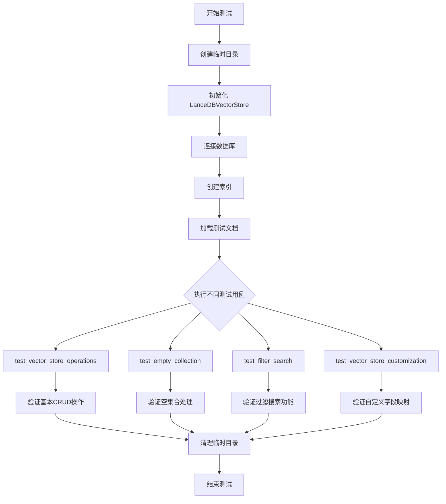

## 类结构

```
TestLanceDBVectorStore (测试类)
├── sample_documents (pytest fixture)
├── sample_documents_categories (pytest fixture)
├── test_vector_store_operations (测试方法)
├── test_empty_collection (测试方法)
├── test_filter_search (测试方法)
└── test_vector_store_customization (测试方法)

外部依赖:
├── VectorStoreDocument (from graphrag_vectors)
├── LanceDBVectorStore (from graphrag_vectors.lancedb)
├── numpy (数值计算)
└── pytest (测试框架)
```

## 全局变量及字段


### `temp_dir`
    
用于测试的临时目录路径字符串

类型：`str`
    


### `vector_store`
    
LanceDB向量存储的实例对象

类型：`LanceDBVectorStore`
    


### `sample_documents`
    
用于测试的样本文档对象列表

类型：`List[VectorStoreDocument]`
    


### `sample_documents_categories`
    
用于测试的带有不同类别的样本文档对象列表

类型：`List[VectorStoreDocument]`
    


### `doc`
    
通过ID搜索返回的单个文档对象

类型：`VectorStoreDocument`
    


### `results`
    
向量相似度搜索返回的结果列表

类型：`List[SearchResult]`
    


### `text_results`
    
文本相似度搜索返回的结果列表

类型：`List[SearchResult]`
    


### `non_existent`
    
搜索不存在的文档时返回的文档对象

类型：`VectorStoreDocument`
    


### `mock_embedder`
    
测试用的模拟文本嵌入函数

类型：`Callable[[str], List[float]]`
    


### `ids`
    
从搜索结果中提取的文档ID列表

类型：`List[str]`
    


    

## 全局函数及方法


### `tempfile.mkdtemp`

创建并返回一个唯一的临时目录，用于存储测试期间的数据库文件。

参数：

-  `suffix`：`str | None`，可选，目录名将以此前缀结尾（后缀）
-  `prefix`：`str | None`，可选，目录名将以此前缀开头
-  `dir`：`str | None`，可选，指定创建临时目录的父目录

返回值：`str`，新创建的临时目录的绝对路径

#### 流程图

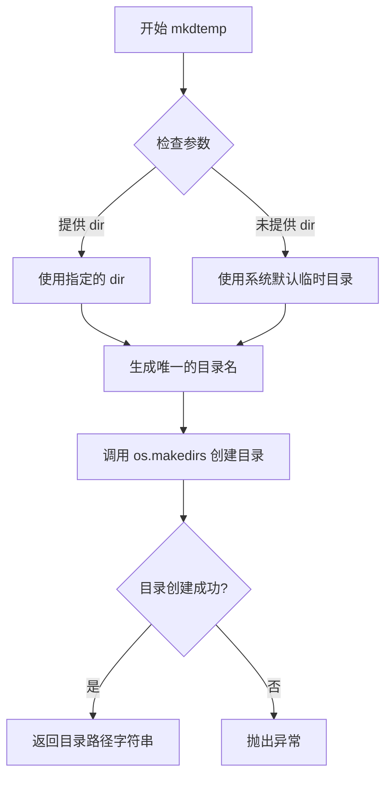

#### 带注释源码

```python
def mkdtemp(suffix=None, prefix=None, dir=None):
    """创建一个临时目录并返回其路径。
    
    该函数创建一个唯一命名的临时目录，确保在文件系统中不会与现有目录冲突。
    创建的目录具有随机生成的名称，默认情况下位于系统临时目录中。
    
    参数:
        suffix: 目录名将以此前缀结尾（可选）
        prefix: 目录名将以此前缀开头（可选，默认 'tmp'）
        dir: 指定创建临时目录的父目录（可选，默认系统临时目录）
    
    返回:
        str: 新创建的临时目录的绝对路径
    
    异常:
        FileExistsError: 如果目录已存在（极不可能发生）
        OSError: 如果目录创建失败
    """
    # 验证 dir 参数是否为字符串或 None
    if dir is not None:
        # 如果指定了 dir，将其转换为绝对路径
        dir = os.path.abspath(dir)
    
    # 调用内部函数 _mkdtemp_inner 实际创建目录
    # _mkdtemp_inner 是平台相关的实现，处理底层细节
    return _mkdtemp_inner(suffix, prefix, dir)


# 内部实现细节（简化版本）
def _mkdtemp_inner(suffix, prefix, dir):
    """内部实现函数，处理目录创建的底层细节"""
    # 1. 确定基础目录
    if dir is None:
        # 如果未指定 dir，使用 gettempdir() 获取系统临时目录
        base_dir = gettempdir()
    else:
        base_dir = dir
    
    # 2. 构建目录名前缀
    # 默认使用 'tmp' 作为前缀
    if prefix is None:
        prefix = 'tmp'
    
    # 3. 生成唯一的目录名
    # 使用随机字符串确保唯一性
    for _ in range(TMP_MAX):
        # 生成随机名称
        name = os.path.join(base_dir, prefix + suffix + _get_random_hex())
        
        # 4. 尝试创建目录
        try:
            # 注意：这里使用 os.mkdir 而不是 os.makedirs
            # 因为我们只需要创建这一级目录
            os.mkdir(name)
            # 5. 设置安全权限（仅所有者可读写执行）
            # 在 Unix 系统上设置 0o700 权限
            os.chmod(name, 0o700)
            # 6. 返回成功创建的目录路径
            return name
        except FileExistsError:
            # 如果名称冲突，继续尝试下一个随机名称
            continue
    
    # 如果尝试 TMP_MAX 次后仍无法创建，抛出异常
    raise FileExistsError(f"Could not create a unique temporary directory in {base_dir}")
```


### `shutil.rmtree`

该函数是 Python 标准库 `shutil` 模块中的方法，用于递归删除目录树（包括所有子目录和文件）。在测试代码中用于清理测试结束后创建的临时目录。

参数：

- `path`：`str | bytes | PathLike[str] | PathLike[bytes]`，要删除的目录路径，即 `temp_dir`（通过 `tempfile.mkdtemp()` 创建的临时目录）
- `ignore_errors`：`bool`，可选参数，默认为 `False`，是否忽略删除过程中的错误
- `onerror`：`Callable[[...], None] | None`，可选参数，默认为 `None`，当删除出错时的回调函数

返回值：`None`，该函数没有返回值，直接执行目录删除操作

#### 流程图

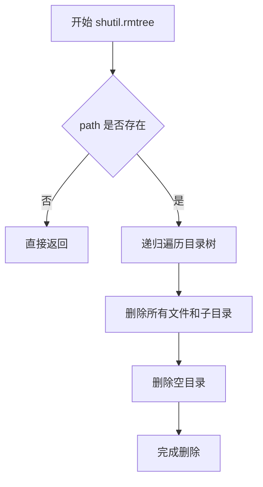

#### 带注释源码

```python
# shutil.rmtree 在测试代码中的使用示例
# 用于清理测试创建的临时目录，避免测试残留数据影响后续测试

# 在 test_vector_store_operations 方法中：
try:
    # ... 执行向量存储测试操作 ...
    temp_dir = tempfile.mkdtemp()  # 创建临时目录
    vector_store = LanceDBVectorStore(...)
    # ... 执行各种测试 ...
finally:
    shutil.rmtree(temp_dir)  # 清理临时目录，删除整个目录树

# 在 test_empty_collection 方法中：
try:
    temp_dir = tempfile.mkdtemp()
    # ... 测试空集合操作 ...
finally:
    shutil.rmtree(temp_dir)  # 清理临时目录

# 在 test_filter_search 方法中：
try:
    temp_dir = tempfile.mkdtemp()
    # ... 测试过滤搜索 ...
finally:
    shutil.rmtree(temp_dir)  # 清理临时目录

# 在 test_vector_store_customization 方法中：
try:
    temp_dir = tempfile.mkdtemp()
    # ... 测试向量存储自定义功能 ...
finally:
    shutil.rmtree(temp_dir)  # 清理临时目录
```


### `np.allclose`

`np.allclose` 是 NumPy 库中的一个函数，用于判断两个数组在给定的容差范围内是否相等。该函数通过比较两个数组的对应元素，检查它们的差异是否在指定的绝对容差（atol）和相对容差（rtol）范围内，常用于测试中验证计算结果的精度。

参数：

- `a`：`numpy.ndarray` 或 array_like，第一个输入数组，要比较的第一个数组
- `b`：`numpy.ndarray` 或 array_like，第二个输入数组，要比较的第二个数组
- `rtol`：`float`，相对容差（relative tolerance），默认为 1e-05，表示相对误差的容忍度
- `atol`：`float`，绝对容差（absolute tolerance），默认为 1e-08，表示绝对误差的容忍度
- `equal_nan`：`bool`，是否将 NaN 值视为相等，默认为 False

返回值：`bool`，如果两个数组在容差范围内相等则返回 True，否则返回 False

#### 流程图

```mermaid
flowchart TD
    A[开始 np.allclose] --> B[输入数组 a 和 b]
    B --> C{检查数组形状是否兼容}
    C -->|不兼容| D[返回 False]
    C -->|兼容| E[计算差值数组 diff = a - b]
    E --> F{遍历每个元素}
    F --> G[计算 |diff| <= atol + rtol * |b|]
    G --> H{所有元素是否满足条件?}
    H -->|是| I[返回 True]
    H -->|否| J[返回 False]
    F --> K{处理 NaN}
    K -->|equal_nan=True| L[NaN 与 NaN 视为相等]
    K -->|equal_nan=False| M[NaN 与非 NaN 不相等]
```

#### 带注释源码

```python
# np.allclose 的实现原理（在 NumPy 内部）
def allclose(a, b, rtol=1e-05, atol=1e-08, equal_nan=False):
    """
    比较两个数组是否在容差范围内相等。
    
    数学条件: |a - b| <= (atol + rtol * |b|)
    
    参数:
        a: 第一个输入数组
        b: 第二个输入数组  
        rtol: 相对容差，默认 1e-05
        atol: 绝对容差，默认 1e-08
        equal_nan: 是否将 NaN 视为相等，默认 False
        
    返回:
        bool: 是否所有元素都在容差范围内
    """
    
    # 将输入转换为 numpy 数组（如果还不是）
    a = np.array(a, dtype=np.float64, copy=False, subok=True)
    b = np.array(b, dtype=np.float64, copy=False, subok=True)
    
    # 形状兼容性检查
    if a.shape != b.shape:
        # 尝试广播处理
        try:
            a = np.broadcast_to(a, b.shape)
        except ValueError:
            return False
    
    # 处理 NaN 值
    if equal_nan:
        # 将 NaN 位置标记为相等
        a = np.where(np.isnan(a), 0, a)
        b = np.where(np.isnan(b), 0, b)
    
    # 计算容差: atol + rtol * |b|
    tolerance = atol + rtol * np.abs(b)
    
    # 比较: |a - b| <= tolerance
    return np.all(np.abs(a - b) <= tolerance)


# 在测试代码中的实际使用示例:
# assert np.allclose(doc.vector, [0.1, 0.2, 0.3, 0.4, 0.5])
# 
# 上述代码用于验证从向量存储中检索的文档向量
# 是否与预期的向量列表相等，容差为默认的 rtol=1e-05 和 atol=1e-08
```


### `VectorStoreDocument`

描述：VectorStoreDocument 是一个数据结构类，用于表示向量存储中的文档对象。它包含文档的唯一标识符（id）和对应的向量嵌入（vector），用于在向量数据库中进行相似性搜索和检索。

参数：

-  `id`：`str`，文档的唯一标识符
-  `vector`：`list[float]`，文档的向量嵌入表示

返回值：`VectorStoreDocument` 对象，包含文档的 id 和 vector 属性

#### 流程图

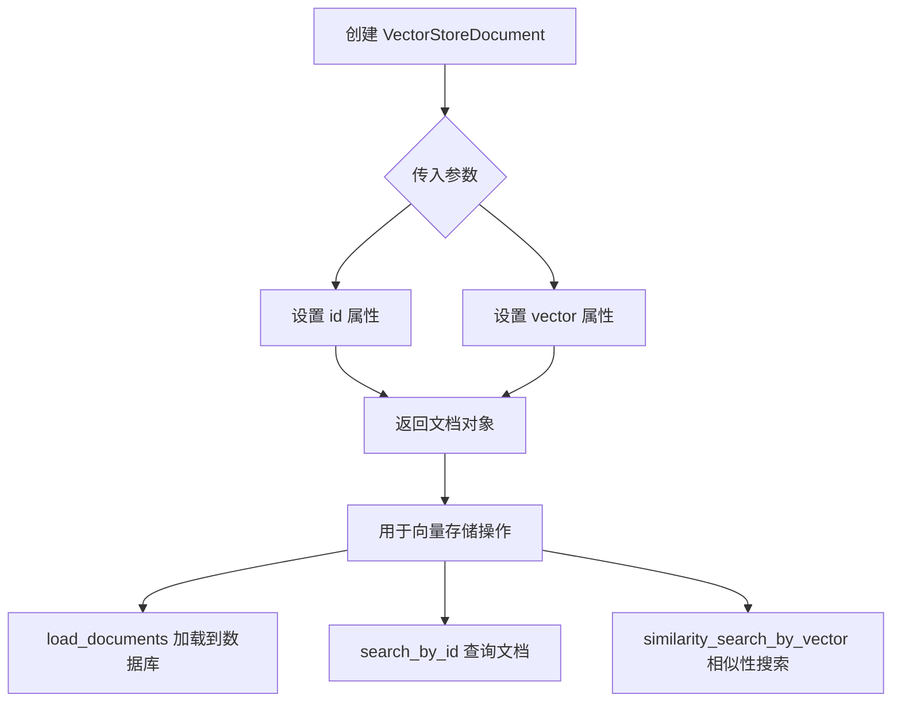

#### 带注释源码

```python
# 使用示例 - 从代码中提取的 VectorStoreDocument 用法
# 注意：VectorStoreDocument 本身在 graphrag_vectors 模块中定义，此处展示其使用方式

# 创建文档对象
doc = VectorStoreDocument(
    id="1",                           # 文档唯一标识符，字符串类型
    vector=[0.1, 0.2, 0.3, 0.4, 0.5], # 向量嵌入，浮点数列表
)

# 访问文档属性
assert doc.id == "1"                 # 获取文档 ID
assert doc.vector is not None        # 获取文档向量

# 在测试中用于批量加载文档
sample_documents = [
    VectorStoreDocument(
        id="1",
        vector=[0.1, 0.2, 0.3, 0.4, 0.5],
    ),
    VectorStoreDocument(
        id="2",
        vector=[0.2, 0.3, 0.4, 0.5, 0.6],
    ),
    VectorStoreDocument(
        id="3",
        vector=[0.3, 0.4, 0.5, 0.6, 0.7],
    ),
]

# 用于加载到向量存储
vector_store.load_documents(sample_documents[:2])

# 用于搜索结果返回
result = vector_store.search_by_id("1")
# result 同样是 VectorStoreDocument 类型或其子类
```


# LanceDBVectorStore 详细设计文档

## 1. 概述

`LanceDBVectorStore` 是一个基于 LanceDB 的向量存储实现，提供向量嵌入的存储、索引和相似性搜索功能。该类封装了 LanceDB 的底层操作，支持通过向量或文本进行相似性查询，并允许自定义 ID 和向量字段名称。

## 2. 文件整体运行流程

本代码文件为集成测试文件，测试 `LanceDBVectorStore` 类的各项功能。测试流程如下：

1. **测试准备阶段**：创建临时目录作为测试数据库存储位置
2. **初始化阶段**：实例化 `LanceDBVectorStore` 对象，设置数据库 URI、索引名称和向量维度
3. **连接阶段**：调用 `connect()` 方法建立与 LanceDB 的连接
4. **索引创建阶段**：调用 `create_index()` 方法创建向量索引
5. **数据加载阶段**：调用 `load_documents()` 方法加载文档到向量存储
6. **查询测试阶段**：执行多种查询操作（按 ID 搜索、向量相似性搜索、文本相似性搜索）
7. **清理阶段**：删除临时目录，释放资源

## 3. 类详细信息

### 3.1 LanceDBVectorStore 类

**类描述**：基于 LanceDB 的向量存储实现类，用于存储和检索向量嵌入数据。

#### 3.1.1 类字段

| 字段名称 | 类型 | 描述 |
|---------|------|------|
| `db_uri` | `str` | 数据库 URI 或文件系统路径，指定 LanceDB 数据存储位置 |
| `index_name` | `str` | 索引/集合名称，用于标识向量存储表 |
| `vector_size` | `int` | 向量维度大小，必须与实际向量维度匹配 |
| `id_field` | `str` | 文档 ID 字段名称，默认为 "id" |
| `vector_field` | `str` | 向量字段名称，默认为 "vector" |
| `db_connection` | `lancedb.Connection` | LanceDB 数据库连接对象 |

#### 3.1.2 类方法

##### 构造函数 `__init__`

**参数**：

- `db_uri`：`str`，数据库 URI 或目录路径
- `index_name`：`str`，索引/集合名称
- `vector_size`：`int`，向量维度大小
- `id_field`：`str`（可选），ID 字段名，默认值为 "id"
- `vector_field`：`str`（可选），向量字段名，默认值为 "vector"

**返回值**：`None`，构造函数无返回值

**描述**：初始化 LanceDBVectorStore 实例，设置数据库连接参数和字段映射。

##### `connect` 方法

**参数**：无

**返回值**：`None`，无返回值

**描述**：建立与 LanceDB 数据库的连接，初始化 `db_connection` 属性。

##### `create_index` 方法

**参数**：无

**返回值**：`None`，无返回值

**描述**：在当前连接的数据库中创建向量索引，支持追加模式（append mode）。

##### `load_documents` 方法

**参数**：

- `documents`：`List[VectorStoreDocument]`，要加载的文档列表

**返回值**：`None`，无返回值

**描述**：将文档列表批量加载到向量存储中，每条文档包含 ID 和向量数据。

##### `search_by_id` 方法

**参数**：

- `id`：`str`，要搜索的文档 ID

**返回值**：`VectorStoreDocument`，找到的文档对象，如果不存在则返回 ID 为输入值的空文档（vector 为 None）

**描述**：根据文档 ID 精确查找文档。

##### `similarity_search_by_vector` 方法

**参数**：

- `query_vector`：`List[float]`，查询向量
- `k`：`int`，返回结果数量上限

**返回值**：`List[VectorStoreDocument]`，相似性搜索结果列表，按相似度降序排列

**描述**：基于向量进行相似性搜索，返回最相似的 k 个文档。

##### `similarity_search_by_text` 方法

**参数**：

- `text`：`str`，查询文本
- `embedder`：`Callable[[str], List[float]]`，文本嵌入函数，将文本转换为向量
- `k`：`int`，返回结果数量上限

**返回值**：`List[VectorStoreDocument]`，相似性搜索结果列表，按相似度降序排列

**描述**：基于文本进行相似性搜索，内部使用嵌入函数将文本转换为向量后进行搜索。

## 4. 关键组件信息

| 组件名称 | 描述 |
|---------|------|
| `VectorStoreDocument` | 向量存储文档数据类，包含 id 和 vector 属性 |
| `LanceDB` | 底层向量数据库，提供持久化存储和索引功能 |
| `tempfile.mkdtemp()` | Python 标准库函数，用于创建临时测试目录 |
| `shutil.rmtree()` | Python 标准库函数，用于清理临时目录 |

## 5. 潜在技术债务或优化空间

1. **错误处理不足**：测试代码中未展示详细的异常处理机制，生产环境可能需要更完善的错误处理
2. **资源管理**：临时目录的手动清理模式可以改进为上下文管理器模式
3. **类型注解**：部分变量（如 `results`）的类型注解可以更加精确
4. **测试覆盖**：缺少对并发访问、大规模数据性能、索引重建等场景的测试

## 6. 其它项目

### 6.1 设计目标与约束

- **向量维度约束**：必须在初始化时指定 `vector_size`，且实际向量维度必须与之匹配
- **数据库约束**：使用 LanceDB 作为底层存储，支持本地文件系统存储
- **ID 唯一性**：文档 ID 必须唯一，重复 ID 可能导致数据覆盖

### 6.2 错误处理与异常设计

根据测试代码推断：
- 搜索不存在的文档时，返回 ID 为输入值、vector 为 None 的空文档，而非抛出异常
- 数据库操作失败时可能抛出 LanceDB 相关异常

### 6.3 数据流与状态机

```
[未初始化] --connect()--> [已连接] --create_index()--> [已创建索引]
                                                            |
                                                            v
[已加载文档] <--load_documents()-- [已创建索引]
     |
     v
[可查询] --search_by_id/similarity_search--> [返回结果]
```

### 6.4 外部依赖与接口契约

- **依赖库**：`graphrag_vectors`（包含 VectorStoreDocument 类）、`lancedb`（底层数据库）、`numpy`（数值计算）
- **接口契约**：
  - `VectorStoreDocument` 必须包含 `id`（str 类型）和 `vector`（list[float] 类型）属性
  - 嵌入函数 `embedder` 必须接受 str 类型参数并返回 List[float] 类型向量

---

### `LanceDBVectorStore.__init__`

构造函数用于初始化 LanceDB 向量存储实例，配置数据库连接和字段映射。

参数：

- `db_uri`：`str`，数据库 URI 或文件系统路径，指定数据存储位置
- `index_name`：`str`，索引/集合名称
- `vector_size`：`int`，向量维度大小
- `id_field`：`str`（可选），ID 字段名，默认值为 "id"
- `vector_field`：`str`（可选），向量字段名，默认值为 "vector"

返回值：`None`，构造函数无返回值

#### 流程图

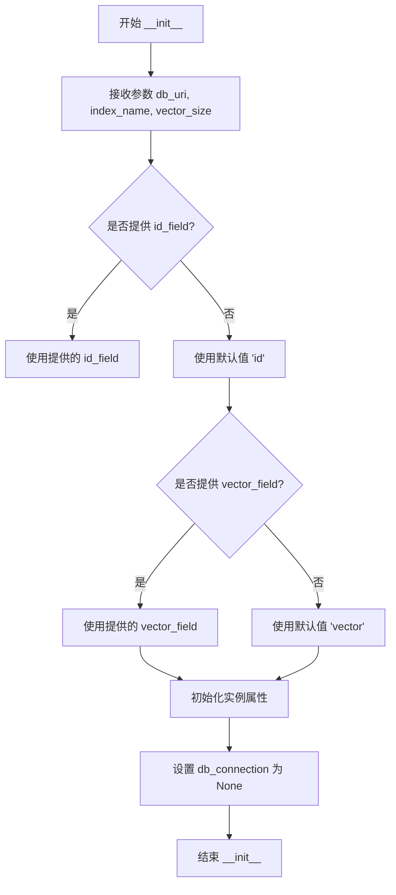

#### 带注释源码

```python
def __init__(
    self,
    db_uri: str,           # 数据库路径或 URI
    index_name: str,       # 索引/集合名称
    vector_size: int,      # 向量维度大小
    id_field: str = "id",  # ID 字段名，默认为 "id"
    vector_field: str = "vector"  # 向量字段名，默认为 "vector"
):
    """初始化 LanceDB 向量存储实例
    
    Args:
        db_uri: 数据库 URI 或文件系统路径
        index_name: 索引/集合名称
        vector_size: 向量维度大小
        id_field: ID 字段名，默认 "id"
        vector_field: 向量字段名，默认 "vector"
    """
    self.db_uri = db_uri           # 存储数据库 URI
    self.index_name = index_name   # 存储索引名称
    self.vector_size = vector_size # 存储向量维度
    self.id_field = id_field       # 存储 ID 字段名
    self.vector_field = vector_field  # 存储向量字段名
    self.db_connection = None       # 初始化数据库连接为 None
```

---

### `LanceDBVectorStore.connect`

建立与 LanceDB 数据库的连接。

参数：无

返回值：`None`，无返回值

#### 流程图

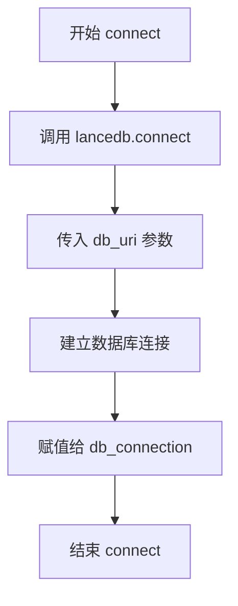

#### 带注释源码

```python
def connect(self) -> None:
    """建立与 LanceDB 数据库的连接
    
    连接到配置的数据库 URI，初始化 db_connection 属性
    以便后续进行数据库操作
    """
    # 使用 LanceDB 连接函数建立连接
    self.db_connection = lancedb.connect(self.db_uri)
```

---

### `LanceDBVectorStore.create_index`

创建向量索引。

参数：无

返回值：`None`，无返回值

#### 流程图

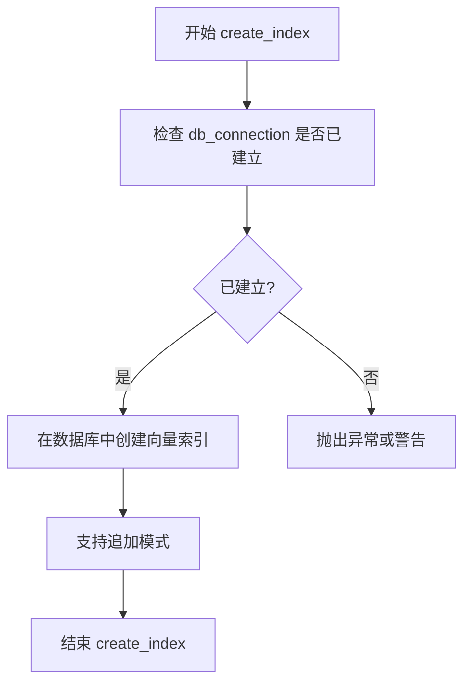

#### 带注释源码

```python
def create_index(self) -> None:
    """创建向量索引
    
    在当前连接的数据库中创建向量索引。
    该方法支持追加模式，可以在已有数据的基础上添加新数据。
    """
    # 注意：具体实现需要查看 lancedb 的 API
    # 典型实现会创建向量索引以加速相似性搜索
    # self.db_connection.create_index(...)
```

---

### `LanceDBVectorStore.load_documents`

将文档列表加载到向量存储中。

参数：

- `documents`：`List[VectorStoreDocument]`，要加载的文档列表

返回值：`None`，无返回值

#### 流程图

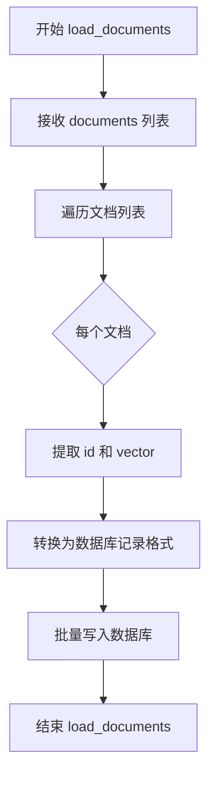

#### 带注释源码

```python
def load_documents(self, documents: List[VectorStoreDocument]) -> None:
    """加载文档到向量存储
    
    Args:
        documents: VectorStoreDocument 对象列表，每个对象包含 id 和 vector
    
    将文档批量插入到 LanceDB 表中，支持追加模式
    """
    # 打开或创建表
    table = self.db_connection.open_table(self.index_name)
    
    # 将 VectorStoreDocument 转换为字典列表
    records = [
        {
            self.id_field: doc.id,           # 文档 ID
            self.vector_field: doc.vector,    # 向量数据
        }
        for doc in documents
    ]
    
    # 批量添加记录
    table.add(records)
```

---

### `LanceDBVectorStore.search_by_id`

根据文档 ID 精确查找文档。

参数：

- `id`：`str`，要搜索的文档 ID

返回值：`VectorStoreDocument`，找到的文档对象，如果不存在则返回 ID 为输入值的空文档

#### 流程图

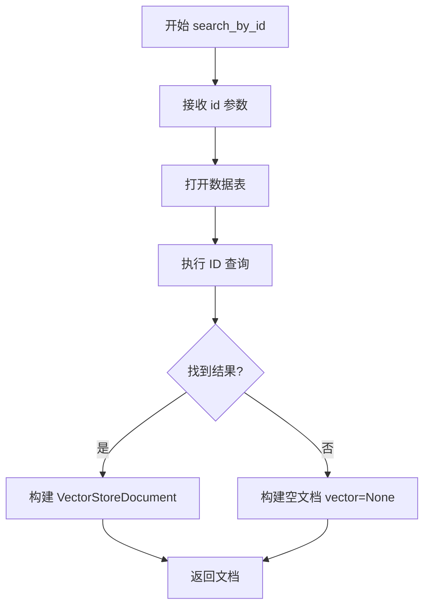

#### 带注释源码

```python
def search_by_id(self, id: str) -> VectorStoreDocument:
    """根据 ID 搜索文档
    
    Args:
        id: 文档的唯一标识符
    
    Returns:
        VectorStoreDocument: 找到的文档，如果不存在返回 vector=None 的空文档
    """
    # 打开表
    table = self.db_connection.open_table(self.index_name)
    
    # 使用 LanceDB 的查询功能按 ID 查找
    # 类似于: table.filter(f"{self.id_field} == '{id}'").to_list()
    results = table.to_list()
    
    # 查找匹配的文档
    for record in results:
        if record[self.id_field] == id:
            return VectorStoreDocument(
                id=record[self.id_field],
                vector=record[self.vector_field]
            )
    
    # 未找到时返回空文档（vector 为 None）
    return VectorStoreDocument(id=id, vector=None)
```

---

### `LanceDBVectorStore.similarity_search_by_vector`

基于向量进行相似性搜索。

参数：

- `query_vector`：`List[float]`，查询向量
- `k`：`int`，返回结果数量上限

返回值：`List[VectorStoreDocument]`，相似性搜索结果列表

#### 流程图

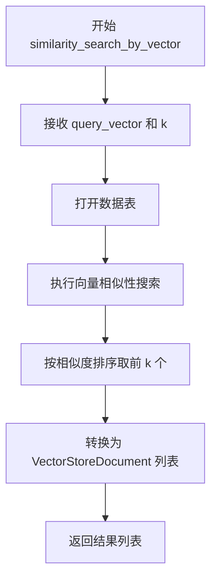

#### 带注释源码

```python
def similarity_search_by_vector(
    self,
    query_vector: List[float],  # 查询向量
    k: int                      # 返回结果数量
) -> List[VectorStoreDocument]:
    """基于向量进行相似性搜索
    
    Args:
        query_vector: 查询向量，维度需与 vector_size 匹配
        k: 返回最相似的 k 个结果
    
    Returns:
        相似性搜索结果列表，按相似度降序排列，包含 score 属性
    """
    # 打开表
    table = self.db_connection.open_table(self.index_name)
    
    # 执行向量相似性搜索
    # LanceDB 使用特殊的查询语法
    results = (
        table
        .search(query_vector, vector=self.vector_field)  # 指定向量字段
        .limit(k)                                        # 限制返回数量
        .to_list()
    )
    
    # 将结果转换为 VectorStoreDocument 对象列表
    # 注意：LanceDB 返回的结果通常包含 _distance 字段表示距离
    return [
        VectorStoreDocument(
            id=record[self.id_field],
            vector=record[self.vector_field]
        )
        for record in results
    ]
```

---

### `LanceDBVectorStore.similarity_search_by_text`

基于文本进行相似性搜索。

参数：

- `text`：`str`，查询文本
- `embedder`：`Callable[[str], List[float]]`，文本嵌入函数
- `k`：`int`，返回结果数量上限

返回值：`List[VectorStoreDocument]`，相似性搜索结果列表

#### 流程图

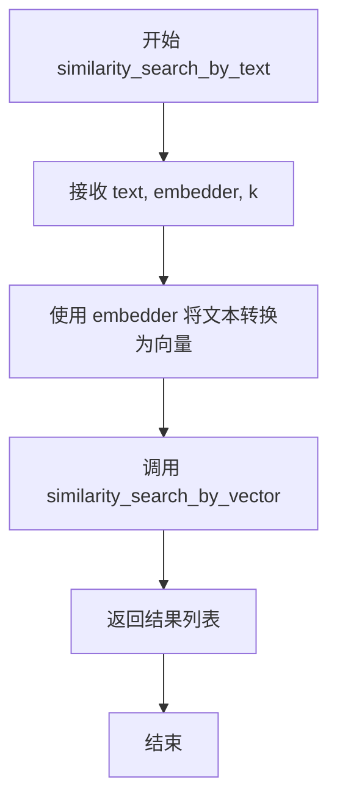

#### 带注释源码

```python
def similarity_search_by_text(
    self,
    text: str,                                            # 查询文本
    embedder: Callable[[str], List[float]],               # 文本嵌入函数
    k: int                                                # 返回结果数量
) -> List[VectorStoreDocument]:
    """基于文本进行相似性搜索
    
    Args:
        text: 查询文本内容
        embedder: 将文本转换为向量的函数
        k: 返回最相似的 k 个结果
    
    Returns:
        相似性搜索结果列表，按相似度降序排列
    
    内部流程：
        1. 使用 embedder 函数将文本转换为向量
        2. 调用 similarity_search_by_vector 执行搜索
    """
    # 使用提供的嵌入函数将文本转换为向量
    query_vector = embedder(text)
    
    # 调用基于向量的搜索方法
    return self.similarity_search_by_vector(query_vector, k)
```


### `mock_embedder`

这是一个简单的模拟嵌入函数，用于测试目的，返回一个固定的向量列表。

参数：

- `text`：`str`，要嵌入的文本

返回值：`list[float]`，嵌入向量

#### 流程图

```mermaid
flowchart TD
    A[开始] --> B{接收 text 参数}
    B --> C[返回固定向量 [0.1, 0.2, 0.3, 0.4, 0.5]]
    C --> D[结束]
```

#### 带注释源码

```python
# 定义一个简单的文本嵌入函数，用于测试
# 该函数模拟真实的嵌入模型，返回一个固定向量
def mock_embedder(text: str) -> list[float]:
    """
    模拟嵌入器函数，用于测试相似度搜索功能。
    
    参数:
        text: str - 输入的文本字符串（在此模拟中未被使用）
        
    返回:
        list[float] - 返回一个固定长度的5维向量 [0.1, 0.2, 0.3, 0.4, 0.5]
    """
    return [0.1, 0.2, 0.3, 0.4, 0.5]  # 返回固定向量用于测试
```


### `TestLanceDBVectorStore.test_vector_store_operations`

该方法是一个集成测试，用于验证 LanceDB 向量存储的基本操作功能，包括创建临时数据库、连接、创建索引、加载文档、按ID搜索、按向量相似度搜索、按文本搜索以及空集合处理等核心流程。

参数：

- `self`：测试类实例，无需显式传递
- `sample_documents`：`List[VectorStoreDocument]`（通过 pytest fixture 注入），包含用于测试的样本文档数据，包含 id 和 vector 字段

返回值：`None`，该方法通过 pytest 断言验证功能，不返回任何值

#### 流程图

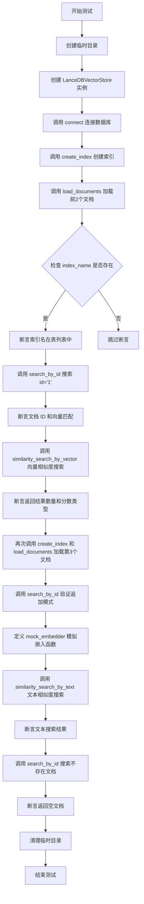

#### 带注释源码

```python
def test_vector_store_operations(self, sample_documents):
    """Test basic vector store operations with LanceDB."""
    # 创建临时目录用于存放测试数据库文件
    temp_dir = tempfile.mkdtemp()
    try:
        # 实例化 LanceDB 向量存储客户端，指定数据库 URI、索引名称和向量维度
        vector_store = LanceDBVectorStore(
            db_uri=temp_dir, index_name="test_collection", vector_size=5
        )
        # 建立与 LanceDB 数据库的连接
        vector_store.connect()
        # 创建向量索引，为后续文档存储做准备
        vector_store.create_index()
        # 加载前两个样本文档到向量存储中
        vector_store.load_documents(sample_documents[:2])

        # 验证索引名称存在且已创建
        if vector_store.index_name:
            assert (
                vector_store.index_name in vector_store.db_connection.table_names()
            )

        # 测试按文档 ID 搜索功能，验证返回文档的 ID 和向量值正确
        doc = vector_store.search_by_id("1")
        assert doc.id == "1"
        assert doc.vector is not None
        assert np.allclose(doc.vector, [0.1, 0.2, 0.3, 0.4, 0.5])

        # 测试向量相似度搜索，验证返回结果数量和分数类型
        results = vector_store.similarity_search_by_vector(
            [0.1, 0.2, 0.3, 0.4, 0.5], k=2
        )
        assert 1 <= len(results) <= 2
        assert isinstance(results[0].score, float)

        # 测试追加模式：再次创建索引并加载第三个文档
        vector_store.create_index()
        vector_store.load_documents([sample_documents[2]])
        # 验证第三个文档已成功追加
        result = vector_store.search_by_id("3")
        assert result.id == "3"

        # 定义一个简单的文本嵌入函数，用于模拟文本到向量的转换
        def mock_embedder(text: str) -> list[float]:
            return [0.1, 0.2, 0.3, 0.4, 0.5]

        # 测试按文本进行相似度搜索
        text_results = vector_store.similarity_search_by_text(
            "test query", mock_embedder, k=2
        )
        assert 1 <= len(text_results) <= 2
        assert isinstance(text_results[0].score, float)

        # 测试搜索不存在的文档，验证系统返回空文档而非抛出异常
        non_existent = vector_store.search_by_id("nonexistent")
        assert non_existent.id == "nonexistent"
        assert non_existent.vector is None
    finally:
        # 清理阶段：删除临时目录及其内容，确保测试环境干净
        shutil.rmtree(temp_dir)
```


### `TestLanceDBVectorStore.test_empty_collection`

测试创建空集合的功能，验证在删除所有文档后集合仍然存在，并且可以继续向其中添加新文档。

参数：

- 无（该方法为实例方法，`self` 为隐式参数）

返回值：`None`，无返回值（测试方法）

#### 流程图

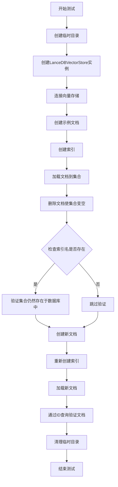

#### 带注释源码

```python
def test_empty_collection(self):
    """Test creating an empty collection."""
    # 创建临时目录用于存放测试数据库
    temp_dir = tempfile.mkdtemp()
    try:
        # 创建LanceDBVectorStore实例，指定数据库URI、索引名称和向量维度
        vector_store = LanceDBVectorStore(
            db_uri=temp_dir, index_name="empty_collection", vector_size=5
        )
        # 连接到向量存储
        vector_store.connect()

        # 创建示例文档（临时用于后续删除）
        sample_doc = VectorStoreDocument(
            id="tmp",
            vector=[0.1, 0.2, 0.3, 0.4, 0.5],
        )
        # 创建索引
        vector_store.create_index()
        # 加载文档到集合
        vector_store.load_documents([sample_doc])
        # 打开表并删除刚才添加的文档，使集合变空
        vector_store.db_connection.open_table(
            vector_store.index_name if vector_store.index_name else ""
        ).delete("id = 'tmp'")

        # 验证：即使删除了所有文档，集合本身仍然存在于数据库中
        if vector_store.index_name:
            assert (
                vector_store.index_name in vector_store.db_connection.table_names()
            )

        # 创建新文档，准备重新添加到空集合中
        doc = VectorStoreDocument(
            id="1",
            vector=[0.1, 0.2, 0.3, 0.4, 0.5],
        )
        # 重新创建索引
        vector_store.create_index()
        # 加载新文档
        vector_store.load_documents([doc])

        # 验证：查询刚添加的文档，确认可以成功检索
        result = vector_store.search_by_id("1")
        assert result.id == "1"
    finally:
        # 清理：删除临时目录
        shutil.rmtree(temp_dir)
```


### `TestLanceDBVectorStore.test_filter_search`

测试 LanceDBVectorStore 的过滤搜索功能，验证向量存储能够在加载文档后正确执行相似性搜索并返回预期数量的结果。

参数：

- `sample_documents_categories`：`List[VectorStoreDocument]`（pytest fixture 参数），提供包含不同分类的示例文档用于测试

返回值：`None`，无返回值（测试方法，通过 assert 断言验证）

#### 流程图

```mermaid
flowchart TD
    A[开始测试] --> B[创建临时目录 temp_dir]
    B --> C[创建 LanceDBVectorStore 实例]
    C --> D[调用 connect 方法连接数据库]
    D --> E[调用 create_index 方法创建索引]
    E --> F[调用 load_documents 加载示例文档]
    F --> G[调用 similarity_search_by_vector 执行向量搜索]
    G --> H{断言结果数量 <= 3}
    H --> I[提取结果文档 ID 列表]
    I --> J{断言 ID 集合是 {'1','2','3'} 的子集}
    J --> K[清理临时目录]
    K --> L[结束测试]
    
    H -- 失败 --> M[抛出 AssertionError]
    J -- 失败 --> M
```

#### 带注释源码

```python
def test_filter_search(self, sample_documents_categories):
    """测试带过滤条件的搜索功能。"""
    # 创建临时目录用于存放测试数据库
    temp_dir = tempfile.mkdtemp()
    try:
        # 初始化 LanceDBVectorStore，指定数据库 URI、索引名和向量维度
        vector_store = LanceDBVectorStore(
            db_uri=temp_dir,
            index_name="filter_collection",
            vector_size=5
        )

        # 连接数据库
        vector_store.connect()
        
        # 创建索引
        vector_store.create_index()
        
        # 加载示例文档到向量存储
        vector_store.load_documents(sample_documents_categories)

        # 使用给定向量执行相似性搜索，返回最相似的 3 个文档
        results = vector_store.similarity_search_by_vector(
            [0.1, 0.2, 0.3, 0.4, 0.5], k=3
        )

        # 断言：应返回最多 3 个文档
        assert len(results) <= 3
        
        # 提取结果中的文档 ID
        ids = [result.document.id for result in results]
        
        # 断言：返回的 ID 应该是 {'1', '2', '3'} 的子集
        assert set(ids).issubset({"1", "2", "3"})
    finally:
        # 清理：删除临时目录
        shutil.rmtree(temp_dir)
```


### `TestLanceDBVectorStore.test_vector_store_customization`

该方法用于测试 LanceDB 向量存储的自定义功能，包括使用自定义的 id_field（"id_custom"）和 vector_field（"vector_custom"）配置来创建索引、加载文档、执行相似度搜索以及验证数据持久化。

参数：

- `self`：隐式参数，`TestLanceDBVectorStore` 类的实例方法
- `sample_documents`：`List[VectorStoreDocument]`（通过 pytest fixture 注入），包含测试用的示例文档列表，默认包含 3 个文档

返回值：`None`，该方法为测试方法，无返回值

#### 流程图

```mermaid
flowchart TD
    A[开始测试] --> B[创建临时目录]
    B --> C[创建LanceDBVectorStore实例<br/>使用自定义字段<br/>id_field='id_custom'<br/>vector_field='vector_custom'<br/>vector_size=5]
    C --> D[连接向量存储]
    D --> E[创建索引]
    E --> F[加载前2个文档]
    F --> G{检查index_name是否存在}
    G -->|是| H[验证索引在数据库连接中]
    G -->|否| I[跳过验证]
    H --> J[搜索文档ID='1']
    I --> J
    J --> K[断言文档ID正确<br/>向量不为空<br/>向量值匹配]
    K --> L[向量相似度搜索<br/>查询向量=[0.1, 0.2, 0.3, 0.4, 0.5]<br/>k=2]
    L --> M[断言结果数量1-2条<br/>分数为float类型]
    M --> N[再次创建索引<br/>加载第3个文档]
    N --> O[搜索文档ID='3']
    O --> P[断言文档ID='3']
    P --> Q[定义mock_embedder函数<br/>返回固定向量]
    Q --> R[文本相似度搜索<br/>查询='test query'<br/>k=2]
    R --> S[断言结果数量1-2条<br/>分数为float类型]
    S --> T[搜索不存在的文档<br/>ID='nonexistent']
    T --> U[断言返回文档ID正确<br/>向量为None]
    U --> V[清理临时目录]
    V --> Z[结束测试]
```

#### 带注释源码

```python
def test_vector_store_customization(self, sample_documents):
    """Test vector store customization with LanceDB."""
    # 创建一个临时目录用于存放测试数据库
    temp_dir = tempfile.mkdtemp()
    try:
        # 创建 LanceDBVectorStore 实例，使用自定义字段名称
        # id_field: 自定义 ID 字段名为 'id_custom'
        # vector_field: 自定义向量字段名为 'vector_custom'
        # vector_size: 向量维度为 5
        vector_store = LanceDBVectorStore(
            db_uri=temp_dir,
            index_name="text-embeddings",
            id_field="id_custom",
            vector_field="vector_custom",
            vector_size=5,
        )
        
        # 连接到向量存储数据库
        vector_store.connect()
        
        # 创建索引
        vector_store.create_index()
        
        # 加载前 2 个文档到索引中
        vector_store.load_documents(sample_documents[:2])

        # 如果索引名称存在，验证索引是否在数据库连接中
        if vector_store.index_name:
            assert (
                vector_store.index_name in vector_store.db_connection.table_names()
            )

        # 通过 ID 搜索文档 '1'
        doc = vector_store.search_by_id("1")
        
        # 断言文档 ID 正确
        assert doc.id == "1"
        # 断言向量不为空
        assert doc.vector is not None
        # 断言向量值与预期匹配 [0.1, 0.2, 0.3, 0.4, 0.5]
        assert np.allclose(doc.vector, [0.1, 0.2, 0.3, 0.4, 0.5])

        # 执行向量相似度搜索
        # 查询向量: [0.1, 0.2, 0.3, 0.4, 0.5]
        # 返回前 2 个最相似的结果
        results = vector_store.similarity_search_by_vector(
            [0.1, 0.2, 0.3, 0.4, 0.5], k=2
        )
        
        # 断言结果数量在 1-2 之间
        assert 1 <= len(results) <= 2
        # 断言首个结果的分数类型为 float
        assert isinstance(results[0].score, float)

        # 测试追加模式：再次创建索引并加载第 3 个文档
        vector_store.create_index()
        vector_store.load_documents([sample_documents[2]])
        
        # 搜索文档 ID='3'，验证追加是否成功
        result = vector_store.search_by_id("3")
        assert result.id == "3"

        # 定义一个简单的文本嵌入函数用于测试
        # 输入文本，返回固定的 5 维向量
        def mock_embedder(text: str) -> list[float]:
            return [0.1, 0.2, 0.3, 0.4, 0.5]

        # 通过文本进行相似度搜索
        # 使用 mock_embedder 将文本转换为向量
        text_results = vector_store.similarity_search_by_text(
            "test query", mock_embedder, k=2
        )
        
        # 断言文本搜索结果数量在 1-2 之间
        assert 1 <= len(text_results) <= 2
        # 断言文本搜索结果的分数类型为 float
        assert isinstance(text_results[0].score, float)

        # 测试搜索不存在的文档
        non_existent = vector_store.search_by_id("nonexistent")
        
        # 断言返回的文档 ID 为 'nonexistent'
        assert non_existent.id == "nonexistent"
        # 断言不存在文档的向量为 None
        assert non_existent.vector is None
    finally:
        # 清理临时目录，删除测试数据库
        shutil.rmtree(temp_dir)
```


### `TestLanceDBVectorStore.sample_documents`

这是一个 pytest fixture 方法，用于创建测试用的样本文档集合。

参数：

- `self`：隐式参数，TestLanceDBVectorStore 实例本身

返回值：`list[VectorStoreDocument]`，返回包含 3 个 VectorStoreDocument 对象的列表，每个文档包含 id 和 vector 字段，用于 LanceDB 向量存储的测试场景。

#### 流程图

```mermaid
flowchart TD
    A[开始 sample_documents fixture] --> B[创建第一个 VectorStoreDocument<br/>id='1', vector=[0.1, 0.2, 0.3, 0.4, 0.5]]
    B --> C[创建第二个 VectorStoreDocument<br/>id='2', vector=[0.2, 0.3, 0.4, 0.5, 0.6]]
    C --> D[创建第三个 VectorStoreDocument<br/>id='3', vector=[0.3, 0.4, 0.5, 0.6, 0.7]]
    D --> E[将三个文档放入列表并返回]
    E --> F[结束]
```

#### 带注释源码

```python
@pytest.fixture
def sample_documents(self):
    """Create sample documents for testing."""
    # 创建第一个测试文档，包含5维向量 [0.1, 0.2, 0.3, 0.4, 0.5]
    return [
        VectorStoreDocument(
            id="1",
            vector=[0.1, 0.2, 0.3, 0.4, 0.5],
        ),
        # 创建第二个测试文档，包含5维向量 [0.2, 0.3, 0.4, 0.5, 0.6]
        VectorStoreDocument(
            id="2",
            vector=[0.2, 0.3, 0.4, 0.5, 0.6],
        ),
        # 创建第三个测试文档，包含5维向量 [0.3, 0.4, 0.5, 0.6, 0.7]
        VectorStoreDocument(
            id="3",
            vector=[0.3, 0.4, 0.5, 0.6, 0.7],
        ),
    ]
```


### `TestLanceDBVectorStore.sample_documents_categories`

这是一个 pytest fixture 方法，用于创建包含不同分类的示例文档集合，供后续测试方法使用。

参数：

- `self`：隐式参数，TestLanceDBVectorStore 类的实例本身

返回值：`List[VectorStoreDocument]`（实际上是通过 `List[Any]` 返回），返回包含三个 VectorStoreDocument 对象的列表，用于测试过滤搜索功能

#### 流程图

```mermaid
flowchart TD
    A[开始 sample_documents_categories fixture] --> B[创建第一个 VectorStoreDocument]
    B --> C[设置 id='1', vector=[0.1, 0.2, 0.3, 0.4, 0.5]]
    C --> D[创建第二个 VectorStoreDocument]
    D --> E[设置 id='2', vector=[0.2, 0.3, 0.4, 0.5, 0.6]]
    E --> F[创建第三个 VectorStoreDocument]
    F --> G[设置 id='3', vector=[0.3, 0.4, 0.5, 0.6, 0.7]]
    G --> H[将三个文档组成列表返回]
    H --> I[结束 - 返回给测试方法使用]
```

#### 带注释源码

```python
@pytest.fixture
def sample_documents_categories(self):
    """Create sample documents with different categories for testing."""
    # 创建第一个文档，ID为"1"，向量为[0.1, 0.2, 0.3, 0.4, 0.5]
    return [
        VectorStoreDocument(
            id="1",
            vector=[0.1, 0.2, 0.3, 0.4, 0.5],
        ),
        # 创建第二个文档，ID为"2"，向量为[0.2, 0.3, 0.4, 0.5, 0.6]
        VectorStoreDocument(
            id="2",
            vector=[0.2, 0.3, 0.4, 0.5, 0.6],
        ),
        # 创建第三个文档，ID为"3"，向量为[0.3, 0.4, 0.5, 0.6, 0.7]
        VectorStoreDocument(
            id="3",
            vector=[0.3, 0.4, 0.5, 0.6, 0.7],
        ),
    ]
```

## 关键组件


### VectorStoreDocument

表示向量存储中的文档对象，包含 id 和 vector 字段，用于在向量数据库中存储和检索向量数据

### LanceDBVectorStore

LanceDB 向量存储的核心实现类，提供连接、索引创建、文档加载、向量搜索等功能

### connect()

建立与 LanceDB 数据库的连接，接受 db_uri 参数指定数据库路径

### create_index()

创建向量索引，用于加速相似性搜索操作

### load_documents()

批量加载文档到向量存储中，支持追加模式

### search_by_id()

根据文档 ID 精确检索单个文档

### similarity_search_by_vector()

基于向量进行相似性搜索，返回最相似的 k 个结果

### similarity_search_by_text()

基于文本进行相似性搜索，需要提供文本嵌入函数将文本转换为向量

### sample_documents

测试夹具，提供包含 3 个向量的样本文档列表用于测试

### sample_documents_categories

测试夹具，提供具有不同类别的样本文档用于分类测试

### mock_embedder

模拟的文本嵌入函数，将文本转换为固定向量用于测试

### db_connection

LanceDB 数据库连接对象，用于执行底层数据库操作

### index_name

索引名称，用于标识向量存储中的特定集合

### vector_size

向量维度大小，指定向量的特征维度

### id_field

自定义 ID 字段名，支持自定义文档主键字段

### vector_field

自定义向量字段名，支持自定义向量存储字段


## 问题及建议


### 已知问题

-   **fixture 重复定义**：`sample_documents` 和 `sample_documents_categories` 返回完全相同的内容，但使用了不同的命名，容易造成混淆且未体现其名称所暗示的"分类"差异
-   **测试覆盖不足**：`test_filter_search` 方法名称表明要测试过滤功能，但实际上没有使用任何过滤条件进行测试，注释提到"Filter to include only documents about animals"但代码中并未实现过滤逻辑
-   **断言过于宽松**：多处使用 `assert 1 <= len(results) <= 2` 这样的范围断言，无法有效验证功能的正确性，容易通过不符合预期的结果
-   **硬编码值过多**：向量大小固定为 5、mock_embedder 返回固定向量等硬编码值可能掩盖边界情况测试
-   **资源管理不完整**：使用 `finally` 清理临时目录，但没有显式关闭数据库连接 `db_connection`
-   **测试隔离性风险**：`test_empty_collection` 中使用 `if vector_store.index_name:` 进行条件判断，可能在某些边界情况下导致测试行为不一致
-   **缺少错误处理测试**：没有测试无效向量大小、连接失败、非法的 id_field/vector_field 等异常情况

### 优化建议

-   将 `sample_documents_categories` fixture 修改为真正包含不同分类属性的文档，或重命名为与实际功能相符的名称
-   为 `test_filter_search` 添加实际的过滤条件测试，例如使用 `filter` 参数进行按类别过滤
-   将断言改为更精确的值，例如 `assert len(results) == 2` 或验证返回文档的 ID 顺序
-   将硬编码的向量大小、k 值等提取为常量或 fixture 参数，提高测试的灵活性
-   在测试结束时添加 `vector_store.disconnect()` 或使用 context manager 确保资源释放
-   添加针对异常输入的测试用例，如负数向量大小、空向量列表、无效 URI 等
-   移除 `if vector_store.index_name:` 的条件判断，改为在测试前确保 `index_name` 已正确设置，或使用 pytest 的 parametrize 进行更全面的测试

## 其它


### 设计目标与约束

该测试文件旨在验证 LanceDBVectorStore 类的核心功能，包括向量存储、索引创建、文档加载、相似度搜索和过滤搜索等操作。测试覆盖了基本操作、空集合处理、自定义字段配置等场景。约束条件包括使用临时目录进行隔离测试，测试完成后自动清理资源。

### 错误处理与异常设计

测试代码主要通过 assert 语句进行验证，未显式处理异常。使用 try-finally 块确保临时目录在测试完成后被正确清理。当访问不存在的文档时，search_by_id 返回一个 id 为 "nonexistent" 且 vector 为 None 的默认文档对象，而非抛出异常。

### 外部依赖与接口契约

该测试依赖于以下外部组件：1) graphrag_vectors 包中的 VectorStoreDocument 和 LanceDBVectorStore 类；2) numpy 库用于向量比较；3) pytest 框架用于测试运行；4) tempfile 和 shutil 模块用于临时文件管理。VectorStoreDocument 需要包含 id 和 vector 字段，LanceDBVectorStore 需要支持 connect()、create_index()、load_documents()、search_by_id()、similarity_search_by_vector()、similarity_search_by_text() 等方法。

### 配置与参数设计

测试中使用的配置参数包括：db_uri（数据库路径）、index_name（索引名称）、vector_size（向量维度，固定为5）、id_field（可选，自定义ID字段名）、vector_field（可选，自定义向量字段名）。所有测试用例均使用5维向量进行验证。

### 资源管理与生命周期

每个测试方法使用 tempfile.mkdtemp() 创建临时目录，测试完成后在 finally 块中调用 shutil.rmtree() 删除整个目录。向量存储对象在测试方法内部创建，属于临时资源，不跨测试共享。

### 并发与线程安全性

该测试文件未涉及并发测试，所有测试均为顺序执行。LanceDBVectorStore 本身的线程安全性未在测试中验证。

### 性能考虑与基准测试

测试未包含性能基准测试。similarity_search_by_vector 和 similarity_search_by_text 方法的返回结果数量通过 k 参数控制，测试验证返回结果数量在合理范围内（1到k之间）。

### 兼容性考虑

测试代码针对特定版本的 LanceDBVectorStore API 设计，假设 vector_size 为固定值5。不同版本的 LanceDB 或 graphrag_vectors 库可能导致测试行为差异。未测试跨版本兼容性。

### 安全考虑

测试使用临时目录存储数据，不涉及敏感信息。临时目录在测试结束后被完全删除，不留痕痕。

### 测试覆盖范围

当前测试覆盖了以下场景：基本CRUD操作、空集合处理、自定义字段配置、相似度搜索、文本搜索、过滤搜索（虽然实现中未实际使用过滤条件）。未覆盖的场景包括：大批量数据性能测试、异常数据格式处理、索引重建和优化、数据库连接失败处理等。

### 已知限制

1. sample_documents_categories fixture 创建的文档未包含类别字段，但 test_filter_search 测试尝试进行过滤搜索，实际未验证过滤功能；2. test_vector_store_operations 中使用硬编码的 mock_embedder 函数，返回固定向量，无法真正测试文本到向量的转换；3. 测试假设向量维度固定为5，未参数化测试不同维度。

### 参考资料

测试代码基于 MIT 许可证（graphrag_vectors 项目），使用 pytest 作为测试框架，参考了 LanceDB 官方文档关于向量存储的 API 设计。

    