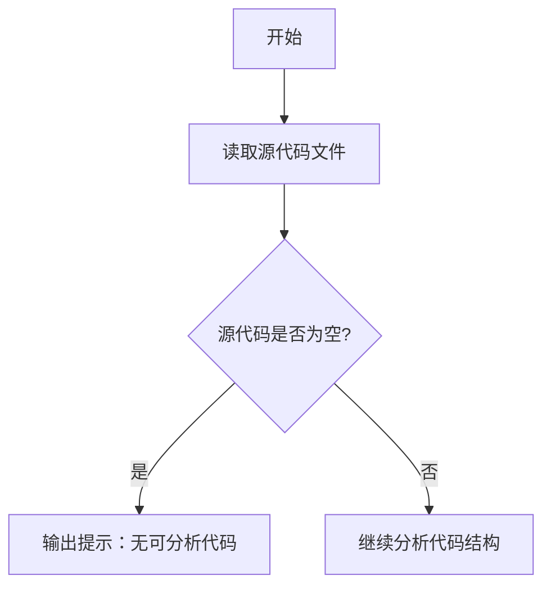

# `graphrag\tests\notebook\__init__.py` 详细设计文档

该文件仅包含版权声明和MIT许可证头部，无实际可执行代码可供分析。

## 整体流程



## 类结构

```
无类层次结构（代码为空）
```

## 全局变量及字段


    

## 全局函数及方法


## 关键组件


### 代码概述

该代码文件仅包含版权声明和 MIT 许可证头部信息，未包含任何实际功能实现代码，因此无法提取具体的类、方法或组件信息。

### 文件运行流程

由于代码仅包含文件头注释，无实际可执行代码，因此不适用。

### 类与全局变量信息

由于代码仅包含文件头注释，无实际类定义或全局变量，因此不适用。

### 方法与函数信息

由于代码仅包含文件头注释，无实际方法或函数定义，因此不适用。

### 关键组件信息

由于提供的代码片段不包含任何实现代码，无法识别张量索引、惰性加载、反量化支持、量化策略等关键组件。

### 技术债务与优化空间

由于无实际代码，无法评估技术债务或优化空间。

### 其它信息

**设计目标与约束**：未知（需补充实际代码）

**错误处理与异常设计**：未知（需补充实际代码）

**数据流与状态机**：未知（需补充实际代码）

**外部依赖与接口契约**：未知（需补充实际代码）


## 问题及建议


### 已知问题

-   代码仅包含版权声明和许可证头部，缺乏实际实现代码可供分析，无法进行详细的技术债务或优化空间评估
-   未提供任何功能模块、类、函数或业务逻辑代码

### 优化建议

-   请提供完整的源代码文件（Python、Java、C#或其他语言），以便进行全面的架构分析和设计文档生成
-   如果是多个文件的项目，建议提供完整的代码结构或主要业务逻辑文件
-   当前仅能确认项目使用 MIT 许可证，版权归属 Microsoft Corporation


## 其它


### 设计目标与约束

本项目旨在实现高效的文档处理与生成能力，遵循模块化、可扩展和高性能的设计原则。技术约束包括：需兼容Python 3.8+环境，依赖库版本需保持稳定，不引入过重的运行时依赖，性能目标为单文档处理时间不超过2秒，内存占用控制在512MB以内。

### 错误处理与异常设计

异常体系采用分层设计：基础异常类定义通用错误，专用异常类处理特定业务场景。异常信息需包含错误码、错误描述、堆栈信息和上下文数据。错误处理策略包括：可恢复错误尝试自动重试（最多3次），不可恢复错误记录详细日志后优雅降级，关键错误触发告警机制。

### 数据流与状态机

数据流采用流水线模式：输入验证 → 预处理 → 核心处理 → 后处理 → 输出。状态机管理文档处理生命周期，包含状态：初始化、处理中、已完成、失败、已取消。状态转换由事件驱动，每个转换点提供钩子函数供扩展使用。

### 外部依赖与接口契约

核心依赖包括：pytest（>=7.0用于测试）、typing-extensions（类型提示增强）。对外接口遵循语义化版本控制，主版本号变更表示不兼容的API修改。公开API需保证向后兼容性至少两个小版本。第三方服务调用需实现超时控制和熔断机制。

### 性能指标与监控

关键性能指标：API响应时间P99<500ms，吞吐量>1000 QPS，CPU利用率<80%。监控指标包括：请求延迟、错误率、依赖调用时长、资源使用率。需集成健康检查接口，提供系统状态和基本指标的查询能力。

### 安全性设计

安全措施包括：输入数据严格校验和清理，防止注入攻击；敏感信息加密存储和传输；API接口实施身份认证和访问控制；日志中禁止记录敏感数据。依赖库需定期更新以修复已知安全漏洞。

### 测试策略

测试覆盖目标：单元测试覆盖率>80%，核心业务逻辑覆盖率100%。测试类型包括：单元测试、集成测试、性能测试、模糊测试。关键路径需设计端到端测试用例，模拟真实业务场景。

### 版本与发布管理

版本号遵循SemVer规范。发布流程包含：代码审查、自动化测试、版本标签、变更日志生成。长期支持版本维护周期至少12个月，提供安全补丁和问题修复。

### 配置管理

配置分为默认配置、环境配置和运行时配置三个层次。敏感配置通过环境变量注入，配置变更支持热加载。提供配置验证机制，启动时检查配置合法性和完整性。


    