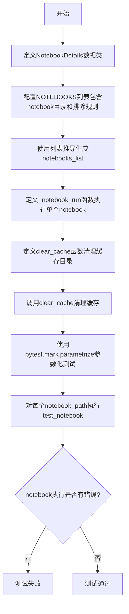
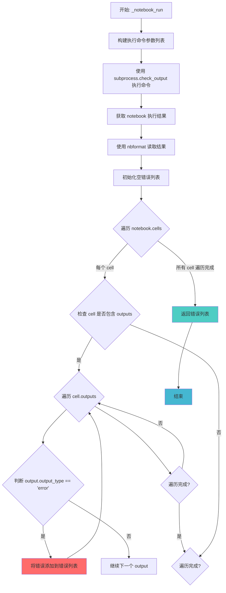
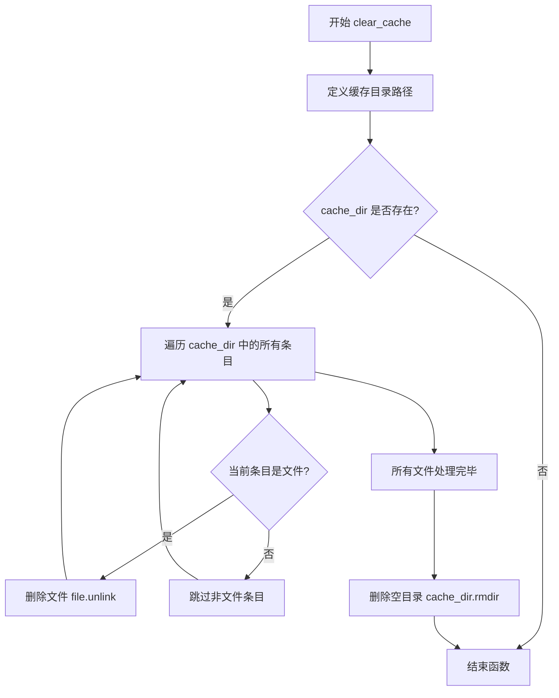

# `graphrag\tests\notebook\test_notebooks.py` 详细设计文档

该脚本是一个自动化测试工具，用于发现并执行指定目录下的所有Jupyter notebooks，通过nbconvert运行notebook并收集执行错误，使用pytest参数化确保每个notebook都能无错运行。

## 整体流程



## 类结构

```
NotebookDetails (dataclass)
    ├── dir: Path
    └── excluded_filenames: list[str]
```

## 全局变量及字段


### `NOTEBOOKS`
    
配置要测试的notebook目录和排除规则

类型：`list[NotebookDetails]`
    


### `notebooks_list`
    
扫描得到的所有notebook文件路径列表

类型：`list[Path]`
    


### `NotebookDetails.dir`
    
notebook目录路径

类型：`Path`
    


### `NotebookDetails.excluded_filenames`
    
排除的文件名列表

类型：`list[str]`
    
    

## 全局函数及方法


### `_notebook_run(filepath: Path)`

该函数通过 `subprocess` 调用 `uv` 和 `jupyter nbconvert` 命令执行指定的 Jupyter Notebook 文件，然后解析执行结果，筛选并返回所有错误类型的输出。

参数：

- `filepath`：`Path`，待执行的 notebook 文件路径

返回值：`list[dict]`，返回 notebook 执行过程中产生的所有错误输出列表，每个错误是一个包含错误类型和错误消息的字典对象

#### 流程图



#### 带注释源码

```python
def _notebook_run(filepath: Path):
    """Execute a notebook via nbconvert and collect output.
    :returns execution errors
    """
    # 构建执行命令参数列表
    # 使用 uv 作为运行器，通过 jupyter nbconvert 执行 notebook
    # 参数说明：
    #   --to notebook: 转换为 notebook 格式
    #   --execute: 执行 notebook
    #   -y: 自动确认所有提示
    #   --no-prompt: 不包含输入输出提示符
    #   --stdout: 输出到标准输出
    args = [
        "uv",
        "run",
        "jupyter",
        "nbconvert",
        "--to",
        "notebook",
        "--execute",
        "-y",
        "--no-prompt",
        "--stdout",
        str(filepath.resolve()),
    ]
    
    # 使用 subprocess 执行命令并捕获输出
    # check_output 会在命令返回非零退出码时抛出 CalledProcessError
    notebook = subprocess.check_output(args)
    
    # 使用 nbformat 解析 notebook 内容
    # nbformat.current_nbformat 确保使用当前支持的格式版本
    nb = nbformat.reads(notebook, nbformat.current_nbformat)

    # 遍历所有 cell，收集错误输出
    # 嵌套列表推导式执行以下操作：
    # 1. 遍历 nb.cells 中的每个 cell
    # 2. 检查 cell 是否包含 'outputs' 键
    # 3. 遍历 cell['outputs'] 中的每个 output
    # 4. 筛选 output_type 为 'error' 的项
    return [
        output
        for cell in nb.cells
        if "outputs" in cell
        for output in cell["outputs"]
        if output.output_type == "error"
    ]
```


### `clear_cache`

清理 notebook 缓存目录，删除缓存目录中的所有文件并移除空目录。

参数：

- 无参数

返回值：`None`，无返回值描述

#### 流程图



#### 带注释源码

```python
def clear_cache():
    """清理 notebook 缓存目录，删除所有缓存文件并移除空目录。"""
    # 定义缓存目录的路径
    cache_dir = Path("packages/graphrag-llm/notebooks/cache")
    
    # 检查缓存目录是否存在
    if cache_dir.exists():
        # 遍历缓存目录中的所有文件和子目录
        for file in cache_dir.iterdir():
            # 检查当前条目是否为文件
            if file.is_file():
                # 删除文件
                file.unlink()
        
        # 删除空的缓存目录
        cache_dir.rmdir()
```


### `test_notebook`

这是 pytest 的参数化测试函数，用于验证指定路径的 Jupyter notebook 执行后不包含任何错误输出。它通过调用内部函数 `_notebook_run` 执行 notebook，并断言执行结果的错误列表为空。

**参数：**

- `notebook_path`：`Path`，待测试的 Jupyter Notebook 文件路径（来自 pytest 参数化提供的 `notebooks_list`）

**返回值：**`None`，无返回值（pytest 测试函数）

#### 流程图

```mermaid
flowchart TD
    A[开始: test_notebook] --> B[接收 notebook_path 参数]
    B --> C[调用 _notebook_run 函数]
    C --> D[执行 subprocess 运行 jupyter nbconvert]
    D --> E[捕获 notebook 输出]
    E --> F{检查是否存在 error 输出}
    F -->|有错误| G[返回 error 列表]
    F -->|无错误| H[返回空列表]
    G --> I[断言结果 == []]
    H --> I
    I --> J{断言是否通过}
    J -->|通过| K[测试通过]
    J -->|失败| L[测试失败并报告错误]
```

#### 带注释源码

```python
@pytest.mark.parametrize("notebook_path", notebooks_list)
def test_notebook(notebook_path: Path):
    """pytest 参数化测试：验证指定 notebook 执行无错误。
    
    参数:
        notebook_path: Path - 通过 pytest.mark.parametrize 从 notebooks_list
                        提供的待测试 notebook 文件路径
    
    返回:
        None - 无返回值，作为测试函数使用
    
    逻辑:
        1. 调用 _notebook_run 函数执行 notebook
        2. 断言返回的错误列表为空
        3. 若有错误则测试失败并显示具体错误信息
    """
    # 断言：执行 notebook 后返回的错误列表应为空
    # 若有错误，pytest 会显示详细的错误输出
    assert _notebook_run(notebook_path) == []
```

---

**关联上下文信息**

| 组件 | 类型 | 描述 |
|------|------|------|
| `_notebook_run` | 全局函数 | 通过 `uv run jupyter nbconvert` 执行 notebook 并返回错误列表 |
| `notebooks_list` | 全局变量 | 通过 `rglob` 递归收集的待测试 notebook 路径列表 |
| `NOTEBOOKS` | 全局常量 | 定义 notebook 目录和排除文件名的配置列表 |
| `NotebookDetails` | 数据类 | 存储 notebook 目录路径和排除文件列表的数据结构 |

## 关键组件


### NotebookDetails 数据类

用于存储notebook目录路径和需要排除的文件名列表的配置数据类，包含dir字段（Path类型，指定notebook目录）和excluded_filenames字段（list[str]类型，指定排除的文件名）。

### NOTEBOOKS 全局变量

定义要测试的notebook目录列表，包含一个NotebookDetails实例，指向"packages/graphrag-llm/notebooks"目录，用于配置需要扫描和测试的notebook位置。

### notebooks_list 动态列表

通过列表推导式动态生成的notebook文件路径列表，遍历NOTEBOOKS中的每个目录，使用rglob递归查找所有.ipynb文件，并根据excluded_filenames过滤排除指定的notebook。

### _notebook_run 函数

执行单个notebook的核心函数，接收filepath参数（Path类型，要执行的notebook文件路径），使用subprocess调用uv run jupyter nbconvert命令执行notebook，返回notebook执行过程中的错误输出列表（list[dict]类型）。

### clear_cache 函数

清理notebook缓存目录的函数，删除"packages/graphrag-llm/notebooks/cache"目录下的所有文件，然后删除缓存目录本身，用于确保测试环境的一致性。

### test_notebook 测试函数

pytest参数化测试函数，接收notebook_path参数（Path类型，当前测试的notebook文件路径），调用_notebook_run执行notebook并断言错误列表为空，确保所有notebook都能正常执行无报错。

### nbformat 依赖

外部依赖库，用于解析和操作Jupyter notebook格式（.ipynb文件），在_notebook_run函数中用于读取执行后的notebook内容以提取错误输出。

### subprocess 模块

Python标准库模块，用于在_notebook_run函数中调用外部命令（uv run jupyter nbconvert），实现notebook的自动化执行。


## 问题及建议


### 已知问题

-   **路径硬编码问题**：笔记本目录路径在 NOTEBOOKS 定义和 clear_cache 函数中重复硬编码为 "packages/graphrag-llm/notebooks"，若目录结构变化需要同步修改多处
-   **缺少错误处理**：subprocess.check_output 直接抛出异常而非返回错误信息，且_notebook_run 函数未对 nbconvert 执行失败的情况进行捕获和处理
-   **无执行超时限制**：调用 nbconvert 时未设置 timeout 参数，测试可能无限期挂起
-   **模块加载时计算**：notebooks_list 在模块导入时即进行计算，若目录不存在会导致导入失败
-   **缓存清理逻辑脆弱**：clear_cache 函数假设 cache_dir 存在且非空，未考虑异常情况
-   **未使用的导入**：nbformat 导入了但仅用于读取执行结果，未充分利用其完整功能

### 优化建议

-   将笔记本目录路径提取为配置常量或从配置文件/环境变量读取，避免多处硬编码
-   为 subprocess 调用添加 timeout 参数（如 timeout=300）防止测试挂起
-   使用 subprocess.run 替代 check_output 以获取完整的返回码和错误输出，实现更精细的错误处理
-   将 notebooks_list 的计算延迟到 pytest 参数化阶段，或添加目录存在性检查
-   在 clear_cache 中添加异常处理（try-except），处理文件删除失败或目录不存在的情况
-   考虑添加更详细的断言信息，如在测试失败时输出具体的 notebook 路径和错误类型，便于调试

## 其它


### 一段话描述

该脚本是一个自动化Jupyter笔记本测试工具，用于递归扫描指定目录下的所有.ipynb文件，通过nbconvert执行每个笔记本并收集执行过程中的错误输出，确保所有笔记本都能成功运行无报错，同时提供清理笔记本缓存的功能。

### 文件的整体运行流程

1. **模块导入阶段**：导入必要的标准库和第三方库（subprocess、dataclasses、pathlib、nbformat、pytest）
2. **配置定义阶段**：定义NOTEBOOKS配置列表，指定需要测试的笔记本目录和排除的文件名
3. **笔记本列表生成阶段**：递归扫描配置目录，生成需要测试的笔记本路径列表
4. **缓存清理阶段**：执行clear_cache()清理缓存目录
5. **测试执行阶段**：通过pytest参数化测试，对每个笔记本执行_notebook_run函数并验证无错误输出

### 类的详细信息

#### NotebookDetails 类

**类字段：**
| 字段名称 | 类型 | 描述 |
|---------|------|------|
| dir | Path | 存储笔记本文件的目录路径 |
| excluded_filenames | list[str] | 需要排除的笔记本文件名列表 |

**类方法：** 无（数据类）

### 全局变量和全局函数详细信息

#### NOTEBOOKS

| 名称 | 类型 | 描述 |
|------|------|------|
| NOTEBOOKS | list[NotebookDetails] | 配置列表，定义需要测试的笔记本目录和排除规则 |

#### notebooks_list

| 名称 | 类型 | 描述 |
|------|------|------|
| notebooks_list | list[Path] | 通过列表推导式生成的待测试笔记本文件路径列表 |

#### _notebook_run 函数

| 项目 | 详情 |
|------|------|
| 函数名称 | _notebook_run |
| 参数名称 | filepath |
| 参数类型 | Path |
| 参数描述 | 要执行的Jupyter笔记本文件路径 |
| 返回值类型 | list |
| 返回值描述 | 包含所有错误输出的列表，若为空表示执行成功 |
| mermaid流程图 | ```mermaid\nflowchart TD\n    A[开始执行笔记本] --> B[构建nbconvert命令参数]\n    B --> C[通过subprocess执行命令]\n    D[获取命令输出] --> E[使用nbformat解析notebook]\n    E --> F[遍历所有cell]\n    F --> G{检查cell是否有outputs}\n    G -->|是| H{遍历outputs}\n    G -->|否| I[检查下一个cell]\n    H --> J{output_type是否为error}\n    J -->|是| K[添加到错误列表]\n    J -->|否| I\n    K --> I\n    I --> L{还有更多cell?}\n    L -->|是| F\n    L -->|否| M[返回错误列表]\n``` |
| 带注释源码 | ```python\ndef _notebook_run(filepath: Path):\n    \"\"\"Execute a notebook via nbconvert and collect output.\n    :returns execution errors\n    \"\"\"\n    # 构建nbconvert命令参数列表，使用uv运行jupyter nbconvert\n    args = [\n        "uv",\n        "run",\n        "jupyter",\n        "nbconvert",\n        "--to",\n        "notebook",\n        "--execute",\n        "-y",\n        "--no-prompt",\n        "--stdout",\n        str(filepath.resolve()),\n    ]\n    # 执行subprocess并捕获输出\n    notebook = subprocess.check_output(args)\n    # 使用nbformat解析notebook内容\n    nb = nbformat.reads(notebook, nbformat.current_nbformat)\n\n    # 遍历所有cell，收集错误输出\n    return [\n        output\n        for cell in nb.cells\n        if "outputs" in cell\n        for output in cell["outputs"]\n        if output.output_type == "error"\n    ]\n``` |

#### clear_cache 函数

| 项目 | 详情 |
|------|------|
| 函数名称 | clear_cache |
| 参数名称 | 无 |
| 参数类型 | 无 |
| 参数描述 | 无参数，清理预定义的缓存目录 |
| 返回值类型 | None |
| 返回值描述 | 无返回值，仅执行目录清理操作 |
| mermaid流程图 | ```mermaid\nflowchart TD\n    A[开始清理缓存] --> B[定义缓存目录路径]\n    B --> C{缓存目录是否存在?}\n    C -->|否| D[函数结束]\n    C -->|是| E[遍历缓存目录中的所有文件]\n    E --> F{当前项是文件吗?}\n    F -->|是| G[删除文件]\n    F -->|否| E\n    G --> H{还有更多文件吗?}\n    H -->|是| E\n    H -->|否| I[删除空的缓存目录]\n    I --> D\n``` |
| 带注释源码 | ```python\ndef clear_cache():\n    cache_dir = Path("packages/graphrag-llm/notebooks/cache")\n    # 检查缓存目录是否存在\n    if cache_dir.exists():\n        # 遍历目录中的所有文件并删除\n        for file in cache_dir.iterdir():\n            if file.is_file():\n                file.unlink()\n        # 删除空的缓存目录本身\n        cache_dir.rmdir()\n``` |

#### test_notebook 函数

| 项目 | 详情 |
|------|------|
| 函数名称 | test_notebook |
| 参数名称 | notebook_path |
| 参数类型 | Path |
| 参数描述 | 要测试的Jupyter笔记本文件路径 |
| 返回值类型 | None |
| 返回值描述 | 无返回值，通过pytest断言验证笔记本执行无错误 |
| mermaid流程图 | ```mermaid\nflowchart TD\n    A[测试开始] --> B[调用_notebook_run执行笔记本]\n    B --> C[获取错误输出列表]\n    C --> D{错误列表是否为空?}\n    D -->|是| E[测试通过]\n    D -->|否| F[测试失败 - 断言错误]\n``` |
| 带注释源码 | ```python\n@pytest.mark.parametrize("notebook_path", notebooks_list)\ndef test_notebook(notebook_path: Path):\n    # 执行笔记本并验证无错误输出\n    assert _notebook_run(notebook_path) == []\n``` |

### 关键组件信息

| 组件名称 | 一句话描述 |
|----------|------------|
| NOTEBOOKS 配置 | 定义需要扫描和测试的笔记本目录及排除规则的配置列表 |
| notebooks_list | 存储所有待测试笔记本文件路径的列表，通过递归扫描生成 |
| _notebook_run | 核心执行函数，通过subprocess调用nbconvert执行笔记本并捕获错误 |
| clear_cache | 缓存清理函数，删除指定缓存目录下的所有文件和目录本身 |
| test_notebook | pytest测试函数，参数化执行每个笔记本并断言无错误 |

### 潜在的技术债务或优化空间

1. **硬编码路径问题**：缓存目录路径"packages/graphrag-llm/notebooks/cache"硬编码在clear_cache函数中，应考虑配置化或作为参数传入
2. **NOTEBOOKS配置注释掉的示例**：存在被注释掉的NotebookDetails示例（examples_notebooks），代码整洁度有待提升
3. **缺少日志记录**：执行过程没有任何日志输出，难以追踪执行状态和问题排查
4. **异常处理不足**：_notebook_run函数使用subprocess.check_output但未捕获可能的异常（如文件不存在、nbconvert未安装等）
5. **并行执行缺失**：当前串行执行所有笔记本，大型项目时执行时间较长
6. **缓存清理逻辑缺陷**：clear_cache中先删除文件再删除目录，但如果子目录结构存在时rmdir会失败
7. **超时机制缺失**：笔记本执行可能耗时较长甚至卡死，应添加超时控制

### 其它项目

#### 设计目标与约束

**设计目标：**
- 实现自动化笔记本回归测试，确保代码变更后笔记本仍可正常执行
- 通过参数化pytest实现单测试函数覆盖多个笔记本的简洁设计
- 在测试前清理缓存，确保测试环境一致性

**设计约束：**
- 依赖外部工具uv和jupyter nbconvert，必须确保环境中已安装
- 只能检测notebook格式的错误，无法检测内核执行时的运行时错误
- 笔记本执行依赖特定内核环境（如Python），环境配置不一致可能导致测试失败

#### 错误处理与异常设计

**当前实现的问题：**
- subprocess.check_output在命令执行失败时会抛出subprocess.CalledProcessError，但未被捕获
- 笔记本执行超时、文件权限问题、nbconvert未安装等场景缺乏明确错误提示
- 文件路径不存在时，rglob会返回空列表，测试会被跳过而非报错

**建议改进：**
- 在_notebook_run中添加try-except捕获subprocess异常，转换为有意义的错误信息
- 添加路径存在性检查，在测试开始前验证notebook_path的有效性
- 为subprocess调用添加超时参数，防止笔记本执行卡死导致测试挂起

#### 数据流与状态机

**数据流：**
```
NOTEBOOKS配置 → 递归扫描(rglob) → notebooks_list → 
pytest参数化 → test_notebook调用 → _notebook_run执行 → 
nbformat解析输出 → 错误收集 → 断言验证
```

**状态机：**
- **初始状态**：模块加载，NOTEBOOKS和notebooks_list初始化
- **清理状态**：clear_cache执行，删除缓存文件
- **测试就绪状态**：pytest收集到所有参数化的测试用例
- **执行状态**：每个test_notebook实例运行中，调用nbconvert执行
- **完成状态**：所有测试通过（错误列表为空）或失败（断言错误）

#### 外部依赖与接口契约

**外部依赖：**
| 依赖名称 | 版本要求 | 用途 |
|----------|----------|------|
| subprocess | 标准库 | 执行外部命令jupyter nbconvert |
| dataclasses | 标准库 | 定义数据类NotebookDetails |
| pathlib | 标准库 | 路径操作 |
| nbformat | 需安装 | 解析Jupyter notebook格式 |
| pytest | 需安装 | 测试框架 |
| uv | 需安装 | Python包管理和运行工具 |
| jupyter nbconvert | 需安装 | 执行notebook的工具 |

**接口契约：**
- NOTEBOOKS列表中每个NotebookDetails的dir路径必须存在且可访问
- notebooks_list中每个Path对应的文件必须是有效的.ipynb格式
- _notebook_run函数接收Path对象，返回包含错误输出的列表（空列表表示成功）
- clear_cache函数不接收参数，不返回有意义的返回值
- test_notebook函数通过断言验证错误列表为空，任何非空列表都会导致测试失败

#### 配置管理

**当前配置特点：**
- 配置信息直接写在代码中（NOTEBOOKS列表）
- 排除规则通过excluded_filenames列表管理
- 缓存目录路径硬编码

**改进建议：**
- 考虑使用配置文件（YAML/JSON）管理笔记本目录和排除规则
- 缓存目录路径应作为配置项或环境变量
- 支持从命令行参数覆盖配置

#### 性能考量

**当前性能特征：**
- 串行执行所有笔记本，速度较慢
- 每次执行都启动新的subprocess进程
- 笔记本执行可能重复加载相同依赖

**优化建议：**
- 考虑使用pytest-xdist实现并行测试
- 缓存已执行的notebook结果，避免重复执行未修改的笔记本
- 评估使用nbconvert的--execute选项的kernel管理策略

#### 安全考量

**潜在安全风险：**
- 通过subprocess执行外部命令，存在命令注入风险（虽然filepath已通过resolve()处理）
- 执行任意notebook文件，如果notebook来源不可信可能存在风险
- 文件删除操作（clear_cache）存在误删风险

**缓解措施：**
- 严格验证filepath路径，确保在预期目录内
- 考虑添加notebook来源签名验证
- clear_cache前增加路径白名单检查

    