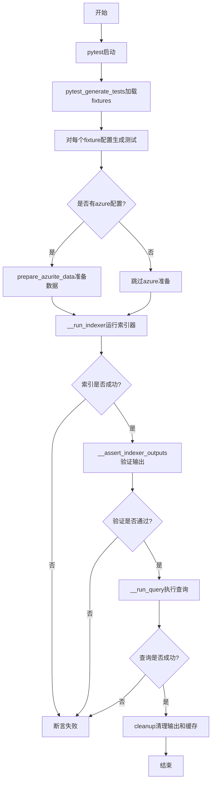
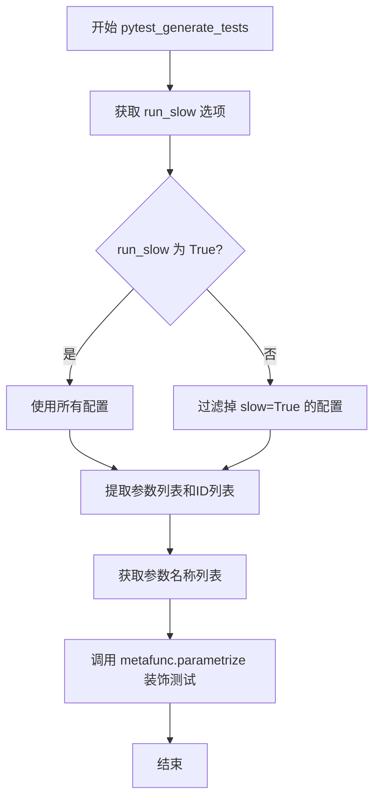
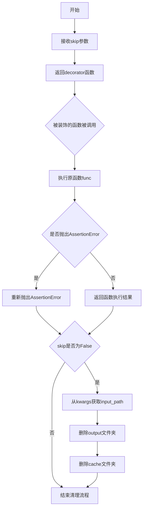
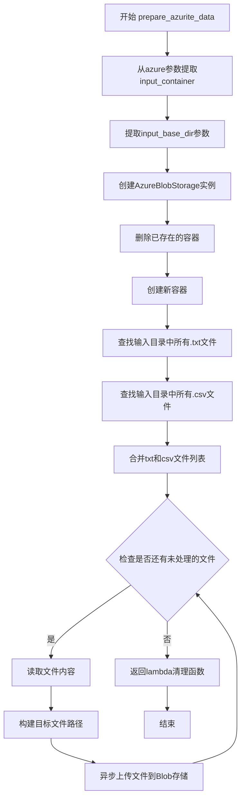
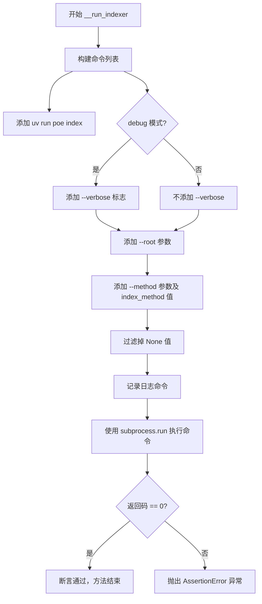
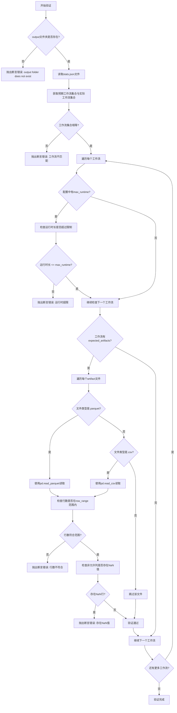
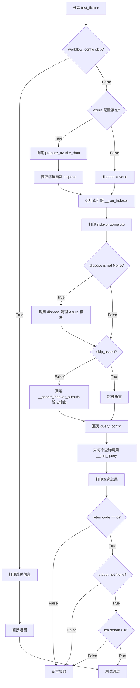

# `graphrag\tests\smoke\test_fixtures.py` 详细设计文档

这是一个GraphRAG项目的集成测试文件，用于通过pytest框架对索引器(indexer)和查询(query)功能进行自动化测试。它加载不同的fixture配置，运行索引流程，验证输出结果，并执行查询以确保整个pipeline的正确性。

## 整体流程



## 类结构

```
TestIndexer (测试类)
├── params (类变量: 测试配置字典)
├── __run_indexer (私有方法: 运行索引器)
├── __assert_indexer_outputs (私有方法: 验证索引输出)
├── __run_query (私有方法: 执行查询)
└── test_fixture (测试方法: 主测试入口)
```

## 全局变量及字段


### `debug`
    
调试模式标志，通过环境变量DEBUG是否存在来判断

类型：`bool`
    


### `gh_pages`
    
GitHub Pages模式标志，通过环境变量GH_PAGES是否存在来判断

类型：`bool`
    


### `WELL_KNOWN_AZURITE_CONNECTION_STRING`
    
Azurite本地模拟器的默认连接字符串，用于Azure Blob存储测试

类型：`str`
    


### `KNOWN_WARNINGS`
    
已知警告列表，包含NO_COMMUNITY_RECORDS_WARNING等预定义警告

类型：`list`
    


### `TestIndexer.params`
    
存储测试fixtures配置的类变量，包含所有测试配置的参数映射

类型：`ClassVar[dict[str, list[tuple[str, dict[str, Any]]]]]`
    
    

## 全局函数及方法


### `_load_fixtures`

该函数用于从 `tests/fixtures/` 目录加载所有测试fixtures配置，遍历子文件夹并读取每个子文件夹中的 `config.json` 文件，返回包含子文件夹名称和配置字典的元组列表（跳过第一个元素以禁用 Azure Blob 连接测试）。

参数：无

返回值：`list[tuple[str, dict[str, Any]]]`，返回子文件夹名称与对应配置字典组成的元组列表，用于测试参数化。

#### 流程图

```mermaid
flowchart TD
    A[开始] --> B[初始化空列表 params]
    B --> C[设置 fixtures_path = ./tests/fixtures/]
    C --> D{检查 gh_pages 环境变量}
    D -->|是| E[subfolders = ['min-csv']]
    D -->|否| F[subfolders = sorted os.listdir fixtures_path]
    E --> G[遍历 subfolders]
    F --> G
    G --> H{当前 subfolder 是目录?}
    H -->|否| I[continue 跳过]
    H -->|是| J[构造 config_file 路径]
    J --> K[读取 config.json 文件]
    K --> L[解析 JSON 为字典]
    L --> M[(subfolder, config_dict) 加入 params]
    M --> G
    I --> G
    G --> N{遍历完成?}
    N -->|否| G
    N -->|是| O[返回 params[1:]]
    O --> P[结束]
```

#### 带注释源码

```python
def _load_fixtures():
    """Load all fixtures from the tests/data folder."""
    params = []  # 用于存储 (子文件夹名称, 配置字典) 元组的列表
    fixtures_path = Path("./tests/fixtures/")  # fixtures 目录路径
    # use the min-csv smoke test to hydrate the docsite parquet artifacts (see gh-pages.yml)
    # 如果是 GH_PAGES 环境，则只使用 min-csv 子文件夹；否则使用所有子文件夹
    subfolders = ["min-csv"] if gh_pages else sorted(os.listdir(fixtures_path))

    for subfolder in subfolders:  # 遍历每个子文件夹
        if not os.path.isdir(fixtures_path / subfolder):  # 跳过非目录项
            continue

        config_file = fixtures_path / subfolder / "config.json"  # 构造配置文件路径
        # 读取并解析 JSON 配置文件
        params.append((subfolder, json.loads(config_file.read_bytes().decode("utf-8"))))

    return params[1:]  # disable azure blob connection test
    # 返回时跳过第一个元素，通常是为了禁用 Azure Blob 连接测试
```


### `pytest_generate_tests`

该函数是 pytest 的测试生成钩子（hook），用于动态参数化测试，根据配置过滤慢速测试，并将测试配置参数化到测试函数中。

参数：

- `metafunc`：`pytest.Metafunc` 对象，pytest 框架传递的元函数对象，包含测试函数的配置信息，用于获取测试参数和配置选项

返回值：`None`，无返回值（pytest 钩子函数）

#### 流程图



#### 带注释源码

```python
def pytest_generate_tests(metafunc):
    """Generate tests for all test functions in this module."""
    # 从 pytest 配置中获取 run_slow 选项，用于控制是否运行慢速测试
    run_slow = metafunc.config.getoption("run_slow")
    # 从测试类的 params 类变量中获取当前测试函数的配置参数
    # params 格式: {函数名: [(子文件夹名, 配置字典), ...]}
    configs = metafunc.cls.params[metafunc.function.__name__]

    if not run_slow:
        # 如果不运行慢速测试，则过滤掉配置中标记为 slow=True 的配置项
        configs = [config for config in configs if not config[1].get("slow", False)]

    # 从配置中提取参数值列表（第二个元素是参数字典）
    funcarglist = [params[1] for params in configs]
    # 从配置中提取测试ID列表（第一个元素是子文件夹名称）
    id_list = [params[0] for params in configs]

    # 从第一个配置参数字典中获取所有参数名（排除 "slow" 键），并排序确保顺序一致
    argnames = sorted(arg for arg in funcarglist[0] if arg != "slow")
    
    # 使用 pytest 的 parametrize 方法动态参数化测试
    # 构建参数值矩阵：按参数名顺序提取每个配置的值
    metafunc.parametrize(
        argnames,  # 参数名称列表
        [[funcargs[name] for name in argnames] for funcargs in funcarglist],  # 参数值矩阵
        ids=id_list,  # 测试ID列表，用于标识每个测试用例
    )
```


### `cleanup`

清理装饰器，用于在每个测试执行后自动清理输出(output)和缓存(cache)文件夹。该装饰器通过捕获测试函数的执行结果，无论成功还是失败，都在`finally`块中执行清理操作，确保测试环境的一致性。

参数：

- `skip`：`bool`，可选参数，默认为`False`。当设置为`True`时，跳过清理操作，保留测试生成的输出和缓存文件夹，常用于调试模式。

返回值：`Callable`，返回一个装饰器函数，用于装饰目标测试函数。

#### 流程图



#### 带注释源码

```python
def cleanup(skip: bool = False):
    """Decorator to cleanup the output and cache folders after each test."""

    def decorator(func):
        """装饰器函数，用于包装测试函数"""
        @wraps(func)
        def wrapper(*args, **kwargs):
            try:
                # 执行原始测试函数
                return func(*args, **kwargs)
            except AssertionError:
                # 捕获AssertionError并重新抛出，不中断清理流程
                raise
            finally:
                # finally块确保清理操作总是执行，无论测试成功或失败
                if not skip:
                    # 从kwargs中获取input_path参数，构建根路径
                    root = Path(kwargs["input_path"])
                    # 递归删除output文件夹，ignore_errors=True忽略可能的错误（如文件夹不存在）
                    shutil.rmtree(root / "output", ignore_errors=True)
                    # 递归删除cache文件夹
                    shutil.rmtree(root / "cache", ignore_errors=True)

        return wrapper

    return decorator
```


### `prepare_azurite_data`

异步准备Azurite测试数据。该函数创建一个Azure Blob存储连接，上传本地的txt和csv文件到Azurite模拟的Azure Blob存储容器中，并返回一个清理函数用于删除容器。

参数：

- `input_path`：`str`，输入数据的根目录路径
- `azure`：`dict`，包含Azure配置信息的字典，必须包含`input_container`键，可选包含`input_base_dir`键

返回值：`Callable[[], None]]`，返回一个无参数无返回值的清理函数，用于删除测试容器

#### 流程图



#### 带注释源码

```python
async def prepare_azurite_data(input_path: str, azure: dict) -> Callable[[], None]:
    """Prepare the data for the Azurite tests."""
    # 从azure配置字典中提取容器名称
    input_container = azure["input_container"]
    # 获取可选的基础目录配置
    input_base_dir = azure.get("input_base_dir")

    # 将输入路径转换为Path对象
    root = Path(input_path)
    # 创建Azure Blob存储客户端，使用预设的Azurite连接字符串
    input_storage = AzureBlobStorage(
        connection_string=WELL_KNOWN_AZURITE_CONNECTION_STRING,
        container_name=input_container,
    )
    # 先删除容器（如果存在）以清除旧的测试数据
    input_storage._delete_container()  # noqa: SLF001
    # 创建新的空容器
    input_storage._create_container()  # noqa: SLF001

    # 查找输入目录中所有txt文件
    txt_files = list((root / "input").glob("*.txt"))
    # 查找输入目录中所有csv文件
    csv_files = list((root / "input").glob("*.csv"))
    # 合并文件列表
    data_files = txt_files + csv_files
    # 遍历每个数据文件并上传到Blob存储
    for data_file in data_files:
        # 读取文件内容并解码为UTF-8字符串
        text = data_file.read_bytes().decode("utf-8")
        # 确定目标文件路径：如果指定了input_base_dir则使用相对路径，否则使用文件名
        file_path = (
            str(Path(input_base_dir) / data_file.name)
            if input_base_dir
            else data_file.name
        )
        # 异步上传文件到Azure Blob存储
        await input_storage.set(file_path, text, encoding="utf-8")

    # 返回一个清理函数，用于测试结束后删除容器
    return lambda: input_storage._delete_container()  # noqa: SLF001
```


### `TestIndexer.__run_indexer`

运行索引器命令行，执行 `uv run poe index` 命令来执行索引操作，并验证返回码为0表示成功。

参数：

- `root`：`Path`，输入文件的根目录路径
- `input_type`：`str`，输入数据类型（虽然参数被传入但在当前命令构建中未使用）
- `index_method`：`str`，索引方法（如 "graph" 或 "text"）

返回值：`None`，该方法通过 `assert` 断言验证索引器执行成功，不返回任何值

#### 流程图



#### 带注释源码

```python
def __run_indexer(
    self,
    root: Path,
    input_type: str,
    index_method: str,
):
    """运行索引器命令行
    
    Args:
        root: 输入文件的根目录路径
        input_type: 输入数据类型（当前未在命令中使用）
        index_method: 索引方法（如 'graph' 或 'text'）
    """
    # 构建命令列表，使用 uv run poe index 来执行索引
    command = [
        "uv",           # Python 包运行器
        "run",          # 运行命令
        "poe",          # Poe 任务运行器
        "index",        # 索引命令
        "--verbose" if debug else None,  # 如果 debug 模式则添加 verbose 标志
        "--root",                       # 根目录参数
        root.resolve().as_posix(),      # 将 Path 转换为 POSIX 路径字符串
        "--method",                     # 索引方法参数
        index_method,                   # 索引方法的值
    ]
    # 过滤掉 None 值（当 debug 为 False 时，--verbose 为 None）
    command = [arg for arg in command if arg]
    # 记录日志信息
    logger.info("running command ", " ".join(command))
    # 执行子进程命令，使用当前环境变量
    completion = subprocess.run(command, env=os.environ)
    # 断言返回码为 0，表示索引器执行成功
    assert completion.returncode == 0, (
        f"Indexer failed with return code: {completion.returncode}"
    )
```


### `TestIndexer.__assert_indexer_outputs`

验证索引器输出的结果，检查输出文件、工作流执行状态、运行时长以及生成的文件内容是否符合预期。

参数：

- `self`：`TestIndexer`，TestIndexer 类的实例本身
- `root`：`Path`，测试输入文件的根目录路径
- `workflow_config`：`dict[str, dict[str, Any]]`，工作流配置字典，包含预期工作流、输出文件、运行时长限制等信息

返回值：`None`，无返回值（该方法通过断言验证，不返回任何值）

#### 流程图



#### 带注释源码

```python
def __assert_indexer_outputs(
    self, root: Path, workflow_config: dict[str, dict[str, Any]]
):
    """
    验证索引器输出的结果
    
    参数:
        root: 测试输入文件的根目录路径
        workflow_config: 工作流配置字典
    """
    # 构建输出文件夹路径
    output_path = root / "output"

    # 断言输出文件夹存在
    assert output_path.exists(), "output folder does not exist"

    # 读取stats.json文件获取工作流统计信息
    stats = json.loads((output_path / "stats.json").read_bytes().decode("utf-8"))

    # 获取预期工作流集合（来自配置）
    expected_workflows = set(workflow_config.keys())
    # 获取实际运行的工作流集合（来自stats.json）
    workflows = set(stats["workflows"].keys())
    
    # 断言预期工作流与实际工作流完全匹配
    assert workflows == expected_workflows, (
        f"Workflows missing from stats.json: {expected_workflows - workflows}. "
        f"Unexpected workflows in stats.json: {workflows - expected_workflows}"
    )

    # 遍历每个工作流进行详细验证
    for workflow, config in workflow_config.items():
        # 获取该工作流预期的输出产物列表
        workflow_artifacts = config.get("expected_artifacts", [])
        
        # 获取最大运行时长限制（可选）
        max_runtime = config.get("max_runtime", None)
        
        # 如果配置了最大运行时长，则验证实际运行时长
        if max_runtime:
            actual_runtime = stats["workflows"][workflow]["overall"]
            assert actual_runtime <= max_runtime, (
                f"Expected max runtime of {max_runtime}, found: {actual_runtime} "
                f"for workflow: {workflow}"
            )
        
        # 检查每个预期的输出产物
        for artifact in workflow_artifacts:
            # 根据文件类型选择合适的读取方式
            if artifact.endswith(".parquet"):
                # 读取parquet文件
                output_df = pd.read_parquet(output_path / artifact)
            elif artifact.endswith(".csv"):
                # 读取csv文件
                output_df = pd.read_csv(
                    output_path / "artifact", keep_default_na=False
                )
            else:
                # 其他文件类型跳过
                continue

            # 验证输出行数是否在指定范围内
            row_range = config["row_range"]
            assert (
                row_range[0] <= len(output_df) <= row_range[1]
            ), (
                f"Expected between {row_range[0]} and {row_range[1]}, "
                f"found: {len(output_df)} for file: {artifact}"
            )

            # 获取不允许包含NaN值的列（即除了nan_allowed_columns之外的所有列）
            nan_df = output_df.loc[
                :,
                ~output_df.columns.isin(config.get("nan_allowed_columns", [])),
            ]
            
            # 筛选出包含NaN值的行
            nan_df = nan_df[nan_df.isna().any(axis=1)]
            
            # 断言不存在NaN值
            assert len(nan_df) == 0, (
                f"Found {len(nan_df)} rows with NaN values for file: {artifact} "
                f"on columns: {nan_df.columns[nan_df.isna().any()].tolist()}"
            )
```


### `TestIndexer.__run_query`

执行查询命令，运行 `poe query` 子进程并返回查询结果。该方法构造命令行参数，包括查询字符串、根路径、查询方法和社区级别，然后通过 `subprocess.run` 执行并捕获输出。

参数：

- `self`：`TestIndexer`，类的实例本身
- `root`：`Path`，索引根目录的路径对象，用于指定查询的工作目录
- `query_config`：`dict[str, str]`，查询配置字典，必须包含 `query`（查询字符串）、`method`（查询方法），可选 `community_level`（社区级别，默认为 2）

返回值：`subprocess.CompletedProcess`，命令执行完成后的结果对象，包含 `returncode`（返回码）、`stdout`（标准输出）、`stderr`（标准错误）等属性

#### 流程图

```mermaid
flowchart TD
    A[开始执行 __run_query] --> B[构建命令列表]
    B --> C[添加 'uv', 'run', 'poe', 'query']
    C --> D[添加查询字符串 query_config['query']]
    D --> E[添加 --root 参数和根路径]
    E --> F[添加 --method 参数和查询方法]
    F --> G[添加 --community-level 参数]
    G --> H[记录日志命令]
    H --> I[执行 subprocess.run]
    I --> J[返回 CompletedProcess 结果]
```

#### 带注释源码

```python
def __run_query(self, root: Path, query_config: dict[str, str]):
    """
    执行查询命令并返回结果
    
    参数:
        root: 索引根目录路径
        query_config: 包含 query、method 和可选 community_level 的配置字典
    
    返回:
        CompletedProcess: 子进程执行结果
    """
    # 构建命令列表，使用 uv run poe query 执行查询
    command = [
        "uv",              # Python 包运行器
        "run",             # 运行命令
        "poe",             # PoE 任务运行器
        "query",           # 查询任务
        query_config["query"],  # 查询字符串
        "--root",          # 根目录参数
        root.resolve().as_posix(),  # 转换为 POSIX 路径格式
        "--method",        # 查询方法参数
        query_config["method"],  # 查询方法（如 'local' 或 'global'）
        "--community-level",  # 社区级别参数
        str(query_config.get("community_level", 2)),  # 默认为 2
    ]

    # 记录执行的命令到日志
    logger.info("running command ", " ".join(command))
    # 执行子进程并捕获输出（stdout 和 stderr）
    return subprocess.run(command, capture_output=True, text=True)
```


### `TestIndexer.test_fixture`

主测试方法，负责运行索引器、验证输出并执行查询测试。

参数：

- `input_path`：`str`，输入数据路径
- `input_type`：`str`，输入数据类型
- `index_method`：`str`，索引方法
- `workflow_config`：`dict[str, dict[str, Any]]`，工作流配置，包含预期输出、最大运行时间等
- `query_config`：`list[dict[str, str]]`，查询配置列表

返回值：`None`，该方法无返回值，通过断言验证测试结果

#### 流程图



#### 带注释源码

```python
@cleanup(skip=debug)
@mock.patch.dict(
    os.environ,
    {
        **os.environ,
        "BLOB_STORAGE_CONNECTION_STRING": WELL_KNOWN_AZURITE_CONNECTION_STRING,
        "LOCAL_BLOB_STORAGE_CONNECTION_STRING": WELL_KNOWN_AZURITE_CONNECTION_STRING,
        "AZURE_AI_SEARCH_URL_ENDPOINT": os.getenv("AZURE_AI_SEARCH_URL_ENDPOINT"),
        "AZURE_AI_SEARCH_API_KEY": os.getenv("AZURE_AI_SEARCH_API_KEY"),
    },
    clear=True,
)
@pytest.mark.timeout(2000)
def test_fixture(
    self,
    input_path: str,
    input_type: str,
    index_method: str,
    workflow_config: dict[str, dict[str, Any]],
    query_config: list[dict[str, str]],
):
    """主测试方法：运行索引器并验证结果"""
    
    # 1. 检查是否跳过该测试配置
    if workflow_config.get("skip"):
        print(f"skipping smoke test {input_path})")
        return

    # 2. 准备 Azure Blob 测试数据（如果配置了 azure）
    azure = workflow_config.get("azure")
    root = Path(input_path)
    dispose = None
    if azure is not None:
        # 异步准备 Azurite 测试数据，返回清理函数
        dispose = asyncio.run(prepare_azurite_data(input_path, azure))

    # 3. 运行索引器
    print("running indexer")
    self.__run_indexer(root, input_type, index_method)
    print("indexer complete")

    # 4. 清理 Azure 容器
    if dispose is not None:
        dispose()

    # 5. 验证索引器输出
    if not workflow_config.get("skip_assert"):
        print("performing dataset assertions")
        self.__assert_indexer_outputs(root, workflow_config)

    # 6. 运行查询测试
    print("running queries")
    for query in query_config:
        result = self.__run_query(root, query)
        print(f"Query: {query}\nResponse: {result.stdout}")

        # 验证查询成功
        assert result.returncode == 0, "Query failed"
        assert result.stdout is not None, "Query returned no output"
        assert len(result.stdout) > 0, "Query returned empty output"
```

## 关键组件


### Fixture加载与配置管理

负责从tests/data文件夹加载所有测试配置，支持min-csv子文件夹的筛选（用于gh-pages构建），并解析config.json配置文件

### 测试参数化生成器

通过pytest_generate_tests函数实现动态测试生成，根据run_slow选项过滤慢速测试，使用metaparametrize装饰器为每个测试函数生成参数化测试用例

### 测试清理装饰器

cleanup装饰器用于在每个测试执行后清理output和cache目录，确保测试环境隔离，支持通过skip参数跳过清理操作

### Azure Blob Storage测试数据准备器

prepare_azurite_data函数异步准备Azurite测试数据，包括创建容器、上传txt和csv文件到指定路径，并返回容器清理函数

### 索引器执行器

TestIndexer类的__run_indexer方法负责通过subprocess执行poe index命令，支持verbose调试模式和不同的索引方法

### 索引输出断言器

__assert_indexer_outputs方法验证索引输出结果，包括检查output目录存在性、stats.json工作流完整性、运行时性能阈值、输出文件行数范围以及NaN值检测

### 查询执行器

__run_query方法通过subprocess运行poe query命令，支持社区级别参数配置，并捕获命令的标准输出

### 主测试用例

test_fixture方法是集成测试入口，协调索引器执行、Azurite数据准备、输出断言和查询验证的全流程

### 全局环境配置

debug和gh_pages标志控制测试行为，WELL_KNOWN_AZURITE_CONNECTION_STRING提供本地开发用Azurite连接字符串

### Azure存储抽象层

AzureBlobStorage类封装Azure Blob Storage操作，提供容器创建、删除和文件上传能力，用于测试云存储集成

## 问题及建议


### 已知问题

-   **脆弱的测试禁用机制**（第64行）：`return params[1:]` 通过跳过第一个参数来禁用 Azure Blob 连接测试，这种方式假设第一个参数总是 Azure 测试，极其脆弱且不可维护。
- **环境变量处理风险**（第211-218行）：`mock.patch.dict` 使用 `clear=True` 后再设置环境变量，但 `AZURE_AI_SEARCH_URL_ENDPOINT` 和 `AZURE_AI_SEARCH_API_KEY` 直接使用 `os.getenv()` 可能返回 `None`，导致测试在未设置这些环境变量的 CI 环境中行为不一致。
- **断言逻辑缺陷**（第234-240行）：查询结果仅检查 `len(result.stdout) > 0`，未验证输出格式或内容有效性，可能导致空字符串或无效响应通过测试。
- **子进程无超时限制**（第203行）：`subprocess.run` 调用未设置超时参数，测试可能无限期挂起。
- **错误处理不足**（第160行）：读取 `stats.json` 时假设文件存在且格式正确，缺乏 `try-except` 保护和文件存在性预检查。
- **输出文件验证不完整**（第186-187行）：对于非 `.parquet` 和 `.csv` 文件直接 `continue` 跳过，可能遗漏重要输出文件的验证。
- **资源清理时序问题**（第225-226行）：在索引完成后立即调用 `dispose()` 删除 Azure 容器，但索引器可能仍在进行后台清理操作。
- **魔法数字**（第221行）：`@pytest.mark.timeout(2000)` 的 2000 秒超时是硬编码值，缺乏配置化和文档说明。

### 优化建议

-   将测试配置外部化，使用明确的标志位（如 `skip_azure`）控制是否运行 Azure 相关测试，而非依赖参数顺序。
-   在 `mock.patch.dict` 前检查环境变量是否存在，或提供合理的默认值，避免 `None` 值传播。
-   为查询结果添加内容验证模式（如 JSON 解析检查、正则表达式匹配），确保返回有效响应。
-   为所有 `subprocess.run` 调用添加合理的 `timeout` 参数，防止测试挂起。
-   使用 `pathlib` 的 `exists()` 方法预检查输出文件，并为文件读取操作添加异常处理。
-   扩展输出文件验证逻辑，记录被跳过的文件类型或添加警告日志。
-   考虑将超时值提取为命令行参数或配置文件常量，并添加注释说明 2000 秒的合理性依据。
-   在 `dispose()` 调用前添加适当的等待或确认机制，确保索引器完全完成。

## 其它


### 设计目标与约束

本测试框架的设计目标是验证 graphrag 项目的索引器（Indexer）和查询功能的正确性，确保在不同的配置场景下系统能够正确运行并产生预期的输出。约束条件包括：使用 pytest 作为测试框架，通过参数化方式支持多配置测试，仅在 run_slow 选项启用时运行慢速测试，设置 2000 秒超时限制，测试完成后自动清理 output 和 cache 文件夹，以及在 DEBUG 模式下跳过清理以便调试。

### 错误处理与异常设计

测试框架采用分层错误处理策略。在测试执行层面，使用 try-finally 块确保资源清理，无论测试成功还是失败都会执行清理操作。在断言层面，使用 Python assert 语句验证所有关键条件，包括索引器返回码、输出文件夹存在性、工作流完整性、运行时性能约束、输出文件行数范围以及 NaN 值检查。在查询验证层面，检查返回码、输出存在性和输出长度。异常信息设计清晰，包含具体的期望值与实际值对比，便于快速定位问题。

### 数据流与状态机

测试数据流分为五个主要阶段。第一阶段是配置加载阶段，_load_fixtures 函数从 tests/fixtures/ 目录扫描所有子文件夹，读取每个子文件夹中的 config.json 配置文件，构建参数列表。第二阶段是测试参数化阶段，pytest_generate_tests 根据配置生成参数化测试，根据 run_slow 选项过滤慢速测试。第三阶段是索引执行阶段，test_fixture 方法调用 __run_indexer 方法执行索引命令，运行 poe index 命令构建索引。第四阶段是输出验证阶段，调用 __assert_indexer_outputs 方法验证 stats.json 的工作流完整性，检查输出文件的行数范围和 NaN 值。第五阶段是查询验证阶段，遍历 query_config 中的每个查询配置，调用 __run_query 方法执行查询并验证返回结果。

### 外部依赖与接口契约

本测试框架依赖多个外部组件。命令行工具依赖包括 uv、poe（用于执行 index 和 query 命令）。Python 库依赖包括 pandas（用于读取和验证 parquet/csv 文件）、pytest（测试框架）、unittest.mock（用于模拟环境变量）、asyncio（用于异步操作 Azure Storage）。Azure 相关依赖包括 AzureBlobStorage 类和 Azurite 本地模拟容器。环境变量依赖包括 DEBUG（控制调试模式）、GH_PAGES（控制测试范围）、BLOB_STORAGE_CONNECTION_STRING（Azure 连接字符串）、AZURE_AI_SEARCH_URL_ENDPOINT 和 AZURE_AI_SEARCH_API_KEY（Azure AI Search 配置）。配置文件契约要求每个测试子文件夹包含 config.json 文件，其中包含 slow、skip、skip_assert、azure、expected_artifacts、max_runtime、row_range、nan_allowed_columns 等字段。

### 配置管理

配置管理采用目录级配置策略。每个测试场景对应 tests/fixtures/ 下的一个子文件夹，包含一个 config.json 文件。配置通过 TestIndexer 类的类变量 params 存储，供 pytest 参数化使用。配置支持的功能包括：slow 标记（控制是否默认跳过）、skip 标记（跳过整个测试）、skip_assert 标记（跳过输出验证）、azure 配置（Azure Blob Storage 集成测试参数）、expected_artifacts 配置（预期输出文件列表）、max_runtime 配置（工作流最大运行时间）、row_range 配置（输出文件行数范围）、nan_allowed_columns 配置（允许 NaN 值的列）。

### 测试覆盖范围

测试覆盖范围涵盖三个层面。功能层面覆盖索引器构建、统计信息生成、多种格式输出（parquet/csv）、查询执行、社区级别查询。集成层面覆盖 Azure Blob Storage 集成、完整的数据管道（输入->索引->输出->查询）。性能层面覆盖工作流运行时间验证、测试超时控制（2000秒）。

### 性能考虑与优化空间

性能相关设计包括通过 run_slow 选项控制是否运行耗时测试，设置 @pytest.mark.timeout(2000) 防止测试无限挂起，通过 max_runtime 配置验证工作流性能。优化空间包括：当前每次测试都重新构建索引，可以考虑使用共享的索引缓存；配置加载在模块导入时执行，可以考虑延迟加载；清理操作使用 shutil.rmtree 可以考虑并行化；可以添加测试并行执行支持以加速测试套件。

### 日志与调试支持

日志系统使用 Python 标准 logging 模块，logger 命名空间为 __name__。日志级别通过 DEBUG 环境变量控制，在 DEBUG 模式下会传递 --verbose 参数给索引器。调试辅助功能包括：在 DEBUG 模式下跳过清理操作（@cleanup(skip=debug)），保留 output 和 cache 文件夹供调试使用；打印测试进度信息（running indexer、indexer complete、performing dataset assertions、running queries）；打印每个查询及其响应结果。

### 测试数据管理

测试数据存储在 tests/fixtures/ 目录下的各个子文件夹中。每个子文件夹包含 input 子文件夹（存放输入的 txt 和 csv 文件）和 config.json（配置文件）。在 GH_PAGES 模式下，仅运行 min-csv 子文件夹以加速文档站点构建。Azure Blob 测试会动态上传 input 文件夹中的 txt 和 csv 文件到 Azurite 容器。

### 资源清理与生命周期管理

资源清理采用装饰器模式。@cleanup 装饰器包装测试函数，在测试执行后（无论成功或失败）清理 output 和 cache 文件夹。Azure 资源清理通过 dispose 函数实现，prepare_azurite_data 返回一个 lambda 函数用于删除测试容器。清理操作使用 shutil.rmtree 并设置 ignore_errors=True 以防止清理失败影响测试报告。

### Mock 策略与环境模拟

环境模拟策略使用 @mock.patch.dict 修改 os.environ 字典，注入测试所需的环，墨水变量。BLOB_STORAGE_CONNECTION_STRING 和 LOCAL_BLOB_STORAGE_CONNECTION_STRING 被设置为 Azurite 的连接字符串。Azure AI Search 的端点和 API 密钥从原始环境变量继承。clear=True 参数清除所有原有环境变量，确保测试环境的一致性。

### 代码质量与可维护性

代码质量特性包括使用类型提示（Type Hints）增强代码可读性和 IDE 支持，使用 @wraps 装饰器保留原函数元数据，使用路径处理（pathlib.Path）确保跨平台兼容性，函数和变量命名清晰表达意图，代码注释说明关键逻辑。技术债务包括：__run_indexer、__assert_indexer_outputs、__run_query 方法使用私有命名约定但实际被测试类直接调用；直接调用 input_storage._delete_container() 和 _create_container()（带 SLF001 跳过私有成员检查）；缺少对 stderr 输出的验证；查询结果验证仅检查非空而未验证内容正确性。

    