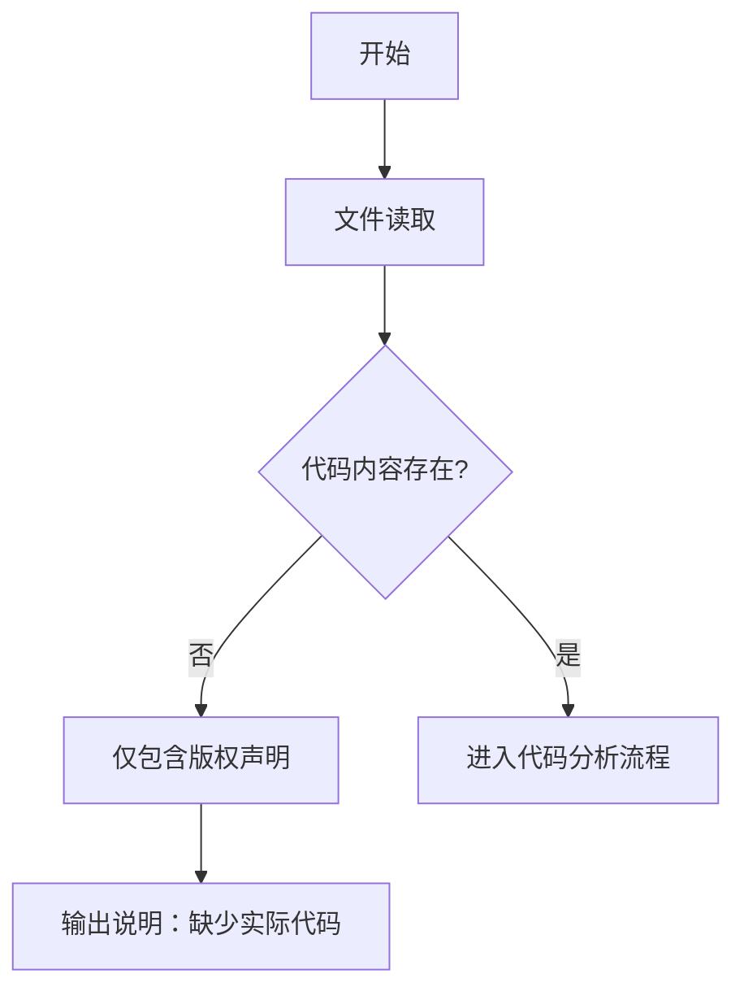

# `graphrag\tests\unit\__init__.py` 详细设计文档

该文件仅包含版权声明信息，无实际代码实现，无法进行详细的功能分析。

## 整体流程



## 类结构

```
该文件不包含任何类或模块定义
```

## 全局变量及字段


    

## 全局函数及方法


## 关键组件


我注意到所提供的代码仅包含版权声明和MIT许可证声明，没有包含任何实际的功能实现代码。因此，无法从中提取关键组件（如张量索引、惰性加载、反量化支持、量化策略等）或生成详细的设计文档。

### 缺少功能代码

{当前提供的代码片段仅包含版权信息，没有实际的类、函数或业务逻辑实现。}


## 问题及建议


### 已知问题

-   代码片段仅包含版权声明和许可证头，缺乏实际实现代码，无法进行有意义的技术债务或优化空间分析

### 优化建议

-   提供完整的源代码文件以便进行全面的架构和设计分析
-   确保代码遵循项目既定的编码规范和设计模式
-   如代码仍在开发早期阶段，建议补充功能实现后再进行设计文档审查


## 其它


### 项目概览

本代码文件仅包含版权声明和MIT许可证声明，不包含任何实际的功能实现代码。因此，无法对具体的类结构、方法、流程、组件等进行分析。

### 设计目标与约束

不适用 - 代码中未包含任何功能实现，无法确定设计目标与约束。

### 错误处理与异常设计

不适用 - 代码中未包含任何功能实现，无法评估错误处理与异常设计。

### 数据流与状态机

不适用 - 代码中未包含任何功能实现，无法分析数据流或状态机。

### 外部依赖与接口契约

不适用 - 代码中未包含任何功能实现，无法确定外部依赖或接口契约。

### 性能考虑

不适用 - 代码中未包含任何功能实现，无法进行性能评估。

### 安全性考虑

不适用 - 代码中未包含任何功能实现，无法进行安全性评估。

### 可测试性分析

不适用 - 代码中未包含任何功能实现，无法进行可测试性分析。

### 潜在的技术债务或优化空间

由于代码仅为版权声明文件，不存在技术债务。但需要注意：如果此文件是项目的占位符或初始模板，未来填充实际功能代码时，应遵循良好的编码实践和文档规范。

### 备注

该文件可能是一个开源项目的头部声明文件，用于声明MIT许可证。完整的代码实现可能在其他文件中。


    