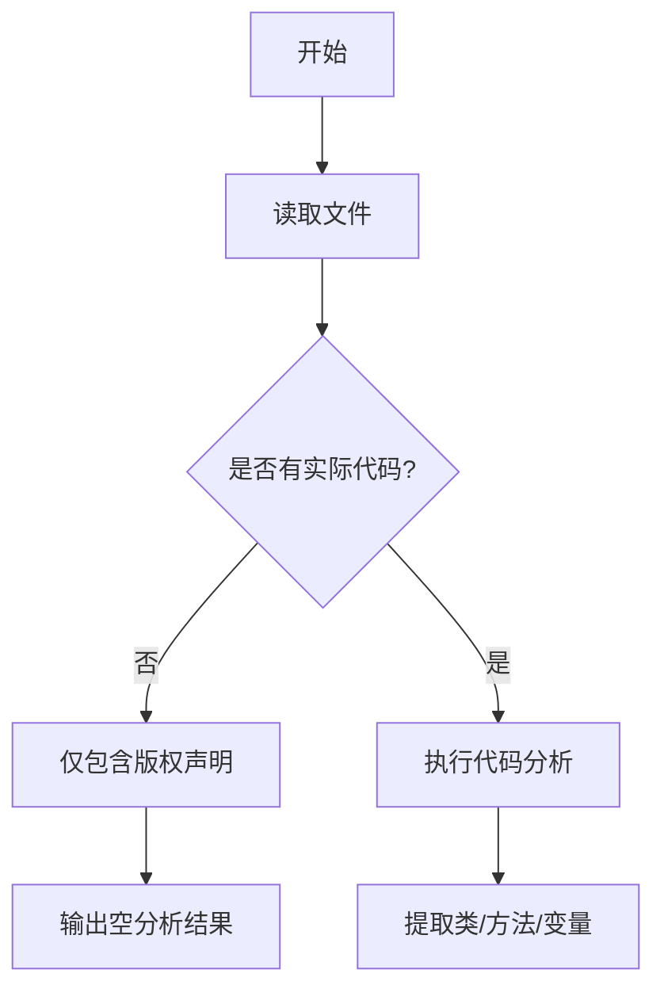

# `graphrag\tests\unit\chunking\__init__.py` 详细设计文档

该文件仅包含版权声明和MIT许可证声明，无实际功能代码实现。

## 整体流程



## 类结构

```

```

## 全局变量及字段


    

## 全局函数及方法


## 关键组件


### 版权声明模块

该代码文件仅包含版权声明信息，不涉及任何功能性实现逻辑。

### 文件信息

由于提供的源代码仅包含版权声明（Copyright (c) 2024 Microsoft Corporation. Licensed under the MIT License），没有实际的代码实现，因此无法进行完整的设计文档分析。

### 关键组件信息

无实际功能代码组件可供分析。

### 潜在技术债务

由于无实际代码，暂无技术债务分析。

### 总结

当前提供的代码片段仅为版权声明文件，不包含任何业务逻辑、类定义、函数实现或功能组件。若需要进行完整的架构设计文档分析，请提供包含实际功能实现的源代码文件。


## 问题及建议


### 已知问题

-   代码文件中仅包含版权声明和许可证信息，没有实际的实现代码可供分析
-   缺少功能代码导致无法评估架构设计、类结构、方法实现等技术债务

### 优化建议

-   提供完整的代码实现以便进行技术债务分析和优化建议
-   如果这是初始项目结构，建议先补充核心业务逻辑代码后再进行设计文档的生成


## 其它


### 设计目标与约束
本代码库的核心目标是为Microsoft提供一种开源的解决方案，基于MIT许可证，允许广泛的使用和修改。设计约束包括遵循MIT许可证的所有条款，确保代码的兼容性、可维护性和安全性。

### 错误处理与异常设计
由于代码片段仅包含版权注释，未展示具体的实现逻辑，因此无法提供详细的错误处理与异常设计。在实际项目中，应定义清晰的异常类型、错误码和日志记录机制，以确保问题的可追溯性和系统的稳定性。

### 数据流与状态机
当前代码片段未包含任何功能实现，因此无法描述数据流或状态机。在完整项目中，应通过状态图和流程图描述数据在系统中的流动路径，以及状态转换的触发条件和行为。

### 外部依赖与接口契约
代码片段未展示任何外部依赖或接口。在实际项目中，应列出所有第三方库、框架或服务，并定义清晰的接口契约，包括输入输出格式、协议版本和兼容性要求。

### 性能要求
由于缺乏具体实现，无法确定性能指标。但在完整设计中，应明确性能目标，如响应时间、吞吐量和资源利用率，并设计相应的性能测试计划。

### 安全性考虑
尽管代码片段未包含安全相关实现，但在完整项目中应进行威胁建模、输入验证、加密传输和访问控制等安全设计，确保符合行业安全标准。

### 可扩展性与模块化
应设计高内聚低耦合的模块结构，以便未来功能扩展和维护。代码应遵循单一职责原则，并提供清晰的模块划分和接口定义。

### 测试策略
应制定单元测试、集成测试和端到端测试的策略，确保代码质量。测试覆盖率应达到既定目标，并持续集成到开发流程中。

### 部署与运维
应提供部署脚本、容器化配置和环境变量管理，确保在不同环境中的一致性。同时应定义监控、备份和灾难恢复方案。

### 版本与兼容性
应遵循语义化版本规范，明确主版本、次版本和补丁版本的变更规则，并确保向后兼容性。

### 文档与注释规范
代码应遵循一致的注释风格，并生成API文档。文档应包含使用示例、参数说明和返回值描述。

### 编码规范
应遵循业界推荐的编码规范，如PEP 8（Python）、Google Java Style等，确保代码风格统一，提高可读性。

### 许可与版权
本代码基于MIT许可证开源，详情见LICENSE文件。代码中应保留版权声明，并确保所有第三方依赖的许可证兼容。

### 贡献指南
应提供CONTRIBUTING.md文件，说明如何提交问题、发起请求和参与代码审查，确保社区贡献的规范性。

### 变更日志
应维护CHANGELOG.md文件，记录每个版本的变更内容、新增功能、修复的问题和已知问题。

    