# `graphrag\tests\unit\chunking\test_chunker.py` 详细设计文档

这是一个用于测试文本分块（text chunking）功能的测试文件，主要测试基于句子和基于token的分块策略，验证分块器对不同文本的处理能力。

## 整体流程

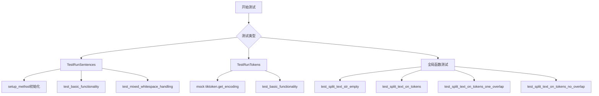

## 类结构

```
MockTokenizer (测试用分词器mock类)
TestRunSentences (句子分块测试类)
TestRunTokens (token分块测试类)
```

## 全局变量及字段


### `input`
    
测试用例的输入文本字符串

类型：`str`
    


### `chunks`
    
分块后的文本块列表

类型：`list[Chunk]`
    


### `chunker`
    
通过工厂创建的分块器实例

类型：`BaseChunker`
    


### `config`
    
分块配置对象，包含大小、重叠、编码模型等设置

类型：`ChunkingConfig`
    


### `tokenizer`
    
tokenizer实例，用于编码和解码文本

类型：`Tokenizer`
    


### `mocked_tokenizer`
    
模拟的tokenizer用于测试

类型：`MockTokenizer`
    


### `expected_splits`
    
预期的文本分块结果列表

类型：`list[str]`
    


### `result`
    
实际的分块结果

类型：`list[str]`
    


### `mock_encoder`
    
模拟的编码器对象，用于模拟tiktoken行为

类型：`Mock`
    


### `text`
    
待分块的输入文本

类型：`str`
    


### `MockTokenizer.encode`
    
将文本编码为token ID列表的抽象方法

类型：`Callable[[Any], list[int]]`
    


### `MockTokenizer.decode`
    
将token ID列表解码为文本的抽象方法

类型：`Callable[[list[int]], str]`
    


### `Chunk.text`
    
文本块的内容

类型：`str`
    


### `Chunk.index`
    
文本块在原始文本中的索引顺序

类型：`int`
    


### `Chunk.start_char`
    
文本块在原始文本中的起始字符位置

类型：`int`
    


### `Chunk.end_char`
    
文本块在原始文本中的结束字符位置

类型：`int`
    
    

## 全局函数及方法


### `test_split_text_str_empty`

该函数是一个单元测试，用于验证 `split_text_on_tokens` 函数在处理空字符串输入时的正确性。它获取一个 tokenizer，然后调用 `split_text_on_tokens` 传入空字符串作为文本参数，期望返回空列表。

参数： 无

返回值：`None`，该函数不返回任何值，仅通过断言验证结果

#### 流程图

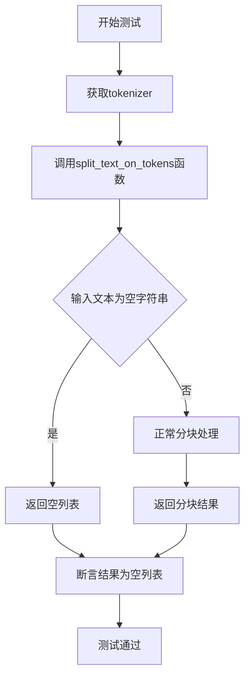

#### 带注释源码

```python
def test_split_text_str_empty():
    """测试split_text_on_tokens函数处理空字符串输入的边界情况"""
    
    # 步骤1: 获取tokenizer用于文本编码和解码
    tokenizer = get_tokenizer()
    
    # 步骤2: 调用split_text_on_tokens函数，传入空字符串作为文本输入
    # 参数说明:
    #   - "": 空字符串文本输入
    #   - chunk_size=5: 每个分块包含5个token
    #   - chunk_overlap=2: 相邻分块之间重叠2个token
    #   - encode: tokenizer的编码函数
    #   - decode: tokenizer的解码函数
    result = split_text_on_tokens(
        "",
        chunk_size=5,
        chunk_overlap=2,
        encode=tokenizer.encode,
        decode=tokenizer.decode,
    )
    
    # 步骤3: 断言验证空字符串输入应返回空列表
    assert result == []
```


### `test_split_text_on_tokens`

这是一个测试函数，用于验证 `split_text_on_tokens` 函数在给定 chunk_size=10 和 chunk_overlap=5 的情况下是否能正确地将文本分割成重叠的文本块。

参数：
- 该函数无显式参数

返回值：`None`，测试函数通过断言（assert）验证结果，不返回具体值

#### 流程图

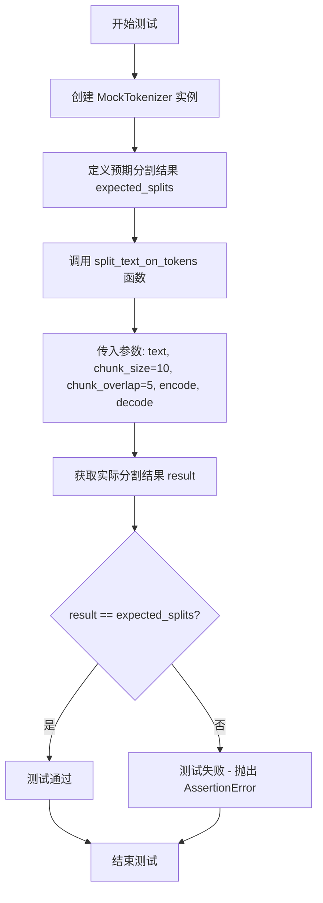

#### 带注释源码

```python
def test_split_text_on_tokens():
    """
    测试 split_text_on_tokens 函数的基本功能
    验证使用 chunk_size=10 和 chunk_overlap=5 时能否正确分割文本
    """
    # 定义测试输入文本
    text = "This is a test text, meaning to be taken seriously by this test only."
    
    # 创建 MockTokenizer 实例用于模拟分词器
    # MockTokenizer.encode 返回每个字符的 ASCII 码作为 token
    mocked_tokenizer = MockTokenizer()
    
    # 定义预期的分割结果列表
    # 根据 MockTokenizer 的编码规则（每个字符为一个 token）
    # chunk_size=10 意味着每个块包含 10 个字符
    # chunk_overlap=5 意味着相邻块之间有 5 个字符的重叠
    expected_splits = [
        "This is a ",        # 0-9: 10个字符
        "is a test ",        # 5-14: 与前一个重叠5个字符
        "test text,",        # 10-19
        "text, mean",        # 15-24
        " meaning t",        # 20-29
        "ing to be ",        # 25-34
        "o be taken",        # 30-39
        "taken seri",        # 35-44
        " seriously",        # 40-49
        "ously by t",        # 45-54
        " by this t",        # 50-59
        "his test o",        # 55-64
        "est only.",         # 60-69
    ]

    # 调用被测试的 split_text_on_tokens 函数
    result = split_text_on_tokens(
        text=text,                    # 待分割的文本
        chunk_overlap=5,              # 相邻块之间的重叠 token 数
        chunk_size=10,                # 每个块的 token 数
        decode=mocked_tokenizer.decode,  # 解码函数
        encode=lambda text: mocked_tokenizer.encode(text),  # 编码函数
    )
    
    # 断言验证实际结果与预期结果一致
    assert result == expected_splits
```


### `test_split_text_on_tokens_one_overlap`

该函数是一个单元测试，用于验证 `split_text_on_tokens` 函数在设置 `chunk_size=2`（每块2个token）和 `chunk_overlap=1`（相邻块之间重叠1个token）时的文本分块功能是否符合预期。

参数：

- 无直接参数（该函数为测试函数，内部调用 `split_text_on_tokens` 函数）

返回值：`None`，该函数为测试函数，使用 `assert` 断言验证分块结果是否符合预期，无显式返回值。

#### 流程图

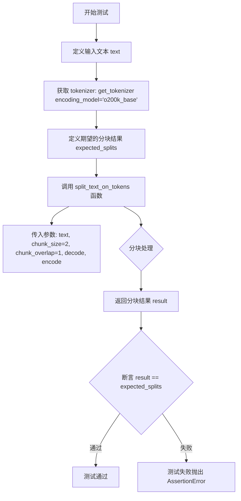

#### 带注释源码

```python
def test_split_text_on_tokens_one_overlap():
    """测试 split_text_on_tokens 函数在重叠为1时的分块行为"""
    
    # 定义测试用的输入文本
    text = "This is a test text, meaning to be taken seriously by this test only."
    
    # 获取 tokenizer，使用 o200k_base 编码模型
    # 这是 OpenAI 的编码模型，用于将文本转换为 token
    tokenizer = get_tokenizer(encoding_model="o200k_base")

    # 定义期望的分块结果
    # 预期结果：每2个token一块，相邻块之间重叠1个token
    expected_splits = [
        "This is",          # chunk 0: tokens[0:2]
        " is a",            # chunk 1: tokens[1:3] (重叠1个token: "is")
        " a test",          # chunk 2: tokens[2:4]
        " test text",       # chunk 3: tokens[3:5]
        " text,",           # chunk 4: tokens[4:6]
        ", meaning",        # chunk 5: tokens[5:7]
        " meaning to",      # chunk 6: tokens[6:8]
        " to be",           # chunk 7: tokens[7:9]
        " be taken",        # chunk 8: tokens[8:10]
        " taken seriously", # chunk 9: tokens[9:11]
        " seriously by",    # chunk 10: tokens[10:12]
        " by this",         # chunk 11: tokens[11:13]
        " this test",       # chunk 12: tokens[12:14]
        " test only",       # chunk 13: tokens[13:15]
        " only.",           # chunk 14: tokens[14:16]
    ]

    # 调用 split_text_on_tokens 函数进行分块
    # 参数说明：
    # - text: 待分块的文本
    # - chunk_size=2: 每个chunk包含2个token
    # - chunk_overlap=1: 相邻chunk之间重叠1个token
    # - decode: tokenizer的解码函数
    # - encode: tokenizer的编码函数
    result = split_text_on_tokens(
        text=text,
        chunk_size=2,
        chunk_overlap=1,
        decode=tokenizer.decode,
        encode=tokenizer.encode,
    )
    
    # 断言：验证分块结果与期望结果一致
    assert result == expected_splits
```

---

### 关联：`split_text_on_tokens` 函数

由于 `test_split_text_on_tokens_one_overlap` 是对 `split_text_on_tokens` 函数的测试，以下是该核心函数的详细信息：

**函数名称：** `split_text_on_tokens`

**参数：**

- `text`：`str`，待分块的输入文本
- `chunk_size`：`int`，每个分块包含的 token 数量
- `chunk_overlap`：`int`，相邻分块之间重叠的 token 数量
- `encode`：可调用对象，用于将文本编码为 token 列表
- `decode`：可调用对象，用于将 token 列表解码为文本

**返回值：** `list[str]`，返回分块后的文本列表

**mermaid 流程图：**

```mermaid
flowchart TD
    A[输入: text, chunk_size, chunk_overlap, encode, decode] --> B[使用 encode 将文本转换为 tokens]
    B --> C{token 列表是否为空?}
    C -->|是| D[返回空列表 []]
    C -->|否| E[初始化结果列表和偏移量 offset=0]
    E --> F{offset < len(tokens)?}
    F -->|是| G[从 offset 开始取 chunk_size 个 tokens]
    G --> H[使用 decode 将 tokens 转换为文本片段]
    H --> I[将文本片段添加到结果列表]
    I --> J[计算下一个 offset: offset + chunk_size - overlap]
    J --> F
    F -->|否| K[返回结果列表]
```

**带注释源码：**

```python
# 来源：graphrag_chunking/token_chunker.py
def split_text_on_tokens(
    text: str,
    chunk_size: int,
    chunk_overlap: int,
    encode: callable,
    decode: callable,
) -> list[str]:
    """基于 token 的文本分块函数
    
    Args:
        text: 待分块的输入文本
        chunk_size: 每个分块包含的 token 数量
        chunk_overlap: 相邻分块之间重叠的 token 数量
        encode: 编码函数，将文本转换为 token 列表
        decode: 解码函数，将 token 列表转换为文本
    
    Returns:
        分块后的文本列表
    """
    # 边界情况处理：空文本返回空列表
    if not text:
        return []
    
    # Step 1: 使用 encode 函数将文本编码为 token 列表
    tokens = encode(text)
    
    # 边界情况处理：编码后为空则返回空列表
    if not tokens:
        return []
    
    # Step 2: 初始化变量
    result = []  # 存储最终的分块结果
    offset = 0   # 当前处理的起始位置
    
    # Step 3: 循环遍历 token 列表，每次移动 (chunk_size - chunk_overlap) 个位置
    while offset < len(tokens):
        # 提取当前 chunk 的 tokens
        chunk_tokens = tokens[offset : offset + chunk_size]
        
        # 使用 decode 函数将 token 转换为文本
        chunk_text = decode(chunk_tokens)
        
        # 添加到结果列表
        result.append(chunk_text)
        
        # 计算下一个 chunk 的起始位置
        # 关键：offset 增加量为 (chunk_size - overlap)，实现重叠效果
        offset += chunk_size - chunk_overlap
    
    return result
```


### `test_split_text_on_tokens_no_overlap`

这是一个测试函数，用于验证 `split_text_on_tokens` 函数在 `chunk_overlap=0`（无重叠）情况下的分块功能是否正确。

参数：
- 无

返回值：`None`，测试函数无返回值，通过 `assert` 断言验证分块结果是否符合预期。

#### 流程图

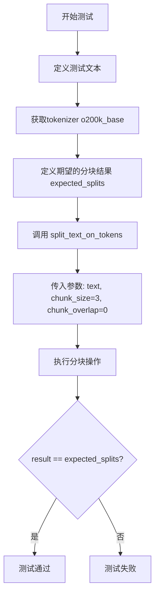

#### 带注释源码

```python
def test_split_text_on_tokens_no_overlap():
    """测试无重叠的token分块功能"""
    
    # 定义测试文本
    text = "This is a test text, meaning to be taken seriously by this test only."
    
    # 获取tokenizer，使用o200k_base编码模型
    tokenizer = get_tokenizer(encoding_model="o200k_base")

    # 定义期望的分块结果列表（无重叠，每3个token一个chunk）
    expected_splits = [
        "This is a",
        " test text,",
        " meaning to be",
        " taken seriously by",
        " this test only",
        ".",
    ]

    # 调用split_text_on_tokens函数进行分块
    # 参数说明:
    # - text: 输入文本
    # - chunk_size: 每个chunk包含的token数量（3个）
    # - chunk_overlap: chunk之间的重叠token数量（0表示无重叠）
    # - decode: tokenizer的decode方法
    # - encode: tokenizer的encode方法
    result = split_text_on_tokens(
        text=text,
        chunk_size=3,
        chunk_overlap=0,
        decode=tokenizer.decode,
        encode=tokenizer.encode,
    )

    # 断言验证分块结果是否与期望结果一致
    assert result == expected_splits
```


### `MockTokenizer.__init__`

初始化 MockTokenizer 类的实例，用于在测试环境中模拟 Tokenizer 行为，提供简单的字符级编码和解码功能。

参数：

- `**kwargs`：`Any`，可变关键字参数，用于接收任意数量的命名参数，当前实现中未使用

返回值：`None`，无返回值

#### 流程图

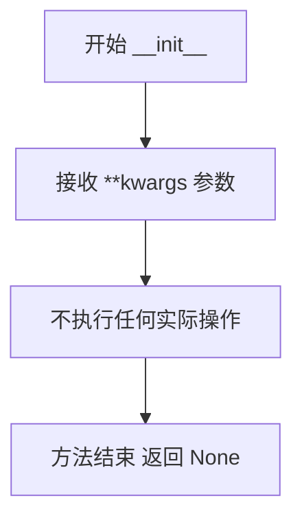

#### 带注释源码

```python
def __init__(self, **kwargs: Any) -> None:
    """Initialize the LiteLLM Tokenizer."""
    # 该方法接受任意关键字参数 **kwargs，类型为 Any
    # 实际上这里没有执行任何初始化逻辑
    # 因为 MockTokenizer 是用于测试的模拟类
    # 只需要满足 Tokenizer 接口的签名要求即可
    # 真正的功能实现由 encode 和 decode 方法提供
```


### `MockTokenizer.encode`

该方法是 `MockTokenizer` 类的核心编码方法，用于将输入文本转换为令牌（tokens）列表。该方法模拟了分词器的编码功能，将文本中的每个字符转换为其对应的 ASCII 码值，生成一个整数列表。这是用于测试目的的模拟实现。

参数：

- `text`：任意类型，输入的文本内容。在实际调用中通常传入字符串类型。

返回值：`list[int]`。返回一个整数列表，其中每个整数代表输入文本中对应字符的 ASCII 码值。

#### 流程图

```mermaid
flowchart TD
    A[开始 encode 方法] --> B[接收 text 参数]
    B --> C[遍历 text 中的每个字符]
    C --> D{是否还有未处理的字符}
    D -->|是| E[对当前字符调用 ord() 获取 ASCII 码]
    E --> F[将 ASCII 码添加到结果列表]
    F --> C
    D -->|否| G[返回结果列表]
    G --> H[结束 encode 方法]
```

#### 带注释源码

```python
def encode(self, text) -> list[int]:
    """将输入文本转换为令牌（ASCII码列表）
    
    参数:
        text: 输入的文本内容，通常为字符串类型
        
    返回值:
        返回一个整数列表，每个整数代表对应字符的ASCII码值
    """
    # 使用列表推导式遍历文本中的每个字符
    # ord() 函数返回字符的ASCII码值
    # 例如：'A' -> 65, 'a' -> 97, ' ' -> 32
    return [ord(char) for char in text]
```


### `MockTokenizer.decode`

该方法是一个模拟分词器的解码函数，用于将token ID列表转换回原始文本字符串。它接受一个token ID列表，通过将每个token ID转换为其对应的字符并连接来重建文本。

参数：

- `tokens`：`list[int]` 或可迭代的整数类型，一个token ID列表，每个ID代表一个字符的编码值

返回值：`str`，解码后的文本字符串，即将token ID列表转换回原始的文本内容

#### 流程图

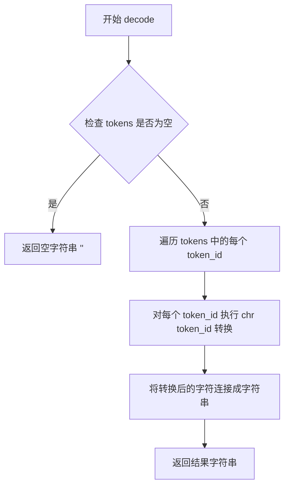

#### 带注释源码

```python
def decode(self, tokens) -> str:
    """将token ID列表解码为文本字符串。
    
    该方法是MockTokenizer类的实例方法，用于模拟分词器的解码功能。
    它将每个token ID（整数）转换为其对应的Unicode字符，然后将这些字符
    连接成一个完整的字符串。
    
    参数:
        tokens: 一个包含token ID的列表或可迭代对象，每个ID应该是整数类型
        
    返回值:
        str: 解码后的文本字符串
    """
    # 使用列表推导式将每个token ID通过chr()函数转换为对应的字符
    # chr()函数将整数转换为对应的Unicode字符
    # 然后使用join()方法将所有字符连接成一个字符串
    return "".join(chr(id) for id in tokens)
```


### `TestRunSentences.setup_method`

该方法是一个 pytest 测试类初始化方法，在每个测试方法执行前自动调用，用于初始化测试环境所需的依赖资源。

参数：

- `method`：`<bound method>`，pytest 自动传入的待执行测试方法对象，用于标识当前正在初始化的测试方法

返回值：`None`，无返回值

#### 流程图

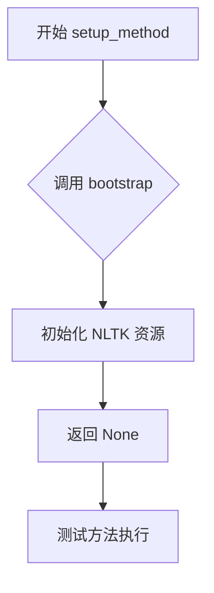

#### 带注释源码

```python
def setup_method(self, method):
    """
    pytest 框架的 setup 方法，在每个测试方法执行前调用。
    
    参数:
        method: pytest 自动传入的当前测试方法对象，用于标识
                即将执行的测试方法（如 test_basic_functionality）
    
    返回:
        None: 此方法仅执行初始化操作，不返回任何值
    """
    # 调用 bootstrap 函数初始化 NLTK 工具包
    # 确保 sentence splitting 等 NLP 功能所需的资源可用
    bootstrap()
```


### TestRunSentences.test_basic_functionality

这是一个单元测试方法，用于验证基于句子的分块（chunking）功能是否正常工作。它创建一个句子类型的分块器，对输入文本进行分割，并验证分割结果的数量、文本内容、索引位置以及字符起始和结束位置是否符合预期。

参数：此方法无显式参数（除 `self` 外）

返回值：`None`，该方法为测试方法，通过断言验证功能，不返回实际数据

#### 流程图

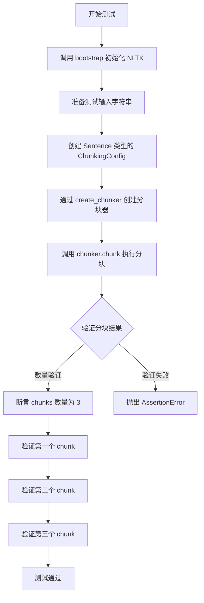

#### 带注释源码

```python
def test_basic_functionality(self):
    """Test basic sentence splitting"""
    # 定义测试输入：包含3个句子的字符串
    input = "This is a test. Another sentence. And a third one!"
    
    # 创建分块配置，指定使用 Sentence 类型的分块器
    # ChunkerType.Sentence 表示基于句子边界进行分割
    chunker = create_chunker(ChunkingConfig(type=ChunkerType.Sentence))
    
    # 执行分块操作，将输入文本分割成多个 chunk
    chunks = chunker.chunk(input)

    # ==================== 验证分块数量 ====================
    # 预期将输入分割成3个句子块
    assert len(chunks) == 3

    # ==================== 验证第一个 chunk ====================
    # 第一个句子："This is a test."
    assert chunks[0].text == "This is a test."      # 验证文本内容
    assert chunks[0].index == 0                      # 验证chunk索引为0
    assert chunks[0].start_char == 0                 # 验证起始字符位置
    assert chunks[0].end_char == 14                  # 验证结束字符位置

    # ==================== 验证第二个 chunk ====================
    # 第二个句子："Another sentence."
    assert chunks[1].text == "Another sentence."     # 验证文本内容
    assert chunks[1].index == 1                      # 验证chunk索引为1
    assert chunks[1].start_char == 16                # 验证起始字符位置（跳过第一个句子和空格）
    assert chunks[1].end_char == 32                  # 验证结束字符位置

    # ==================== 验证第三个 chunk ====================
    # 第三个句子："And a third one!"
    assert chunks[2].text == "And a third one!"      # 验证文本内容
    assert chunks[2].index == 2                      # 验证chunk索引为2
    assert chunks[2].start_char == 34                # 验证起始字符位置
    assert chunks[2].end_char == 49                   # 验证结束字符位置（包含感叹号）
```


### `TestRunSentences.test_mixed_whitespace_handling`

该测试方法用于验证句子分块器对包含不规则空白字符（如前后多余空格）的输入文本的处理能力，确保分块器能够正确识别并去除首尾空白，同时准确定位每个句子在原始文本中的字符位置。

参数：

- `self`：无需显式传递，由测试框架自动注入的 `TestRunSentences` 类实例引用

返回值：`None`，通过断言（assert）验证分块结果的正确性，不返回任何值

#### 流程图

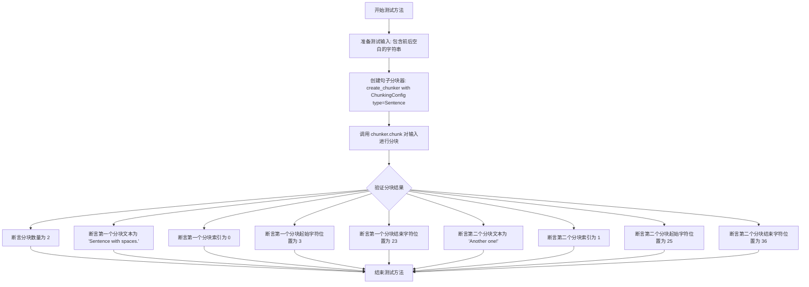

#### 带注释源码

```python
def test_mixed_whitespace_handling(self):
    """
    测试输入带有不规则空白字符时的句子分块处理能力。
    验证分块器能够正确去除首尾空白，并准确计算每个句子在原始文本中的位置。
    """
    
    # 定义包含前后多余空格的测试输入字符串
    # 原始字符串: "   Sentence with spaces. Another one!   "
    # 前面有3个空格，后面有3个空格
    input = "   Sentence with spaces. Another one!   "
    
    # 使用句子分块类型创建分块器配置
    # ChunkingConfig 包含分块策略类型等配置参数
    chunker = create_chunker(ChunkingConfig(type=ChunkerType.Sentence))
    
    # 调用分块器的 chunk 方法对输入文本进行句子级别分块
    # 预期结果：去除首尾空白后，分割为2个句子
    chunks = chunker.chunk(input)

    # 验证分块结果的数量是否正确（应为2个句子）
    assert len(chunks) == 2
    
    # 验证第一个分块的各项属性
    # 分块文本应为去除首尾空白后的内容
    assert chunks[0].text == "Sentence with spaces."
    # 分块索引表示在分块列表中的位置（从0开始）
    assert chunks[0].index == 0
    # 起始字符位置：第一个句子"Sentence with spaces."在原始字符串中从索引3开始
    # 原始字符串 "   Sentence..." 中，前3个空格被跳过
    assert chunks[0].start_char == 3
    # 结束字符位置：第一个句子在原始字符串中结束于索引23（不含）
    assert chunks[0].end_char == 23

    # 验证第二个分块的各项属性
    # 第二个句子 "Another one!" 的文本内容
    assert chunks[1].text == "Another one!"
    # 第二个分块的索引位置为1
    assert chunks[1].index == 1
    # 起始字符位置：第二个句子在原始字符串中从索引25开始
    # （前面有3个空格 + "Sentence with spaces."共22个字符 + 1个空格 = 25）
    assert chunks[1].start_char == 25
    # 结束字符位置：第二个句子在原始字符串中结束于索引36（不含）
    assert chunks[1].end_char == 36
```

#### 关键组件信息

| 组件名称 | 一句话描述 |
|---------|-----------|
| `ChunkerType.Sentence` | 枚举值，用于指定使用基于句子边界的分块策略 |
| `ChunkingConfig` | 分块器配置类，包含分块类型、块大小、重叠大小等配置参数 |
| `create_chunker` | 工厂函数，根据配置创建对应的分块器实例 |
| `chunker.chunk()` | 执行文本分块的核心方法，返回分块结果列表 |

#### 潜在技术债务与优化空间

1. **测试数据硬编码**：测试输入和预期结果直接内嵌在测试方法中，建议使用测试数据工厂或参数化测试（pytest.mark.parametrize）提高可维护性
2. **断言信息不足**：当前断言仅验证数值正确性，失败时缺少有意义的错误提示信息，建议添加 `assert ... , "具体错误描述"` 格式的自定义错误消息
3. **缺少边界条件测试**：仅测试了前后有空白的情况，建议补充测试中间有多余空白、只有空白、空白字符类型多样（如\t、\n）等场景
4. **未验证 `Chunk` 对象结构**：`chunks` 返回的 `Chunk` 对象结构未在测试中显式定义，建议添加类型注解或文档说明

#### 其它项目说明

**设计目标**：验证句子分块器能够正确处理包含不规则空白的输入，核心关注点是去除首尾空白后的句子边界识别和字符位置计算。

**约束条件**：
- 输入文本必须为字符串类型
- 分块器需支持基于句子的分块策略
- 返回的 `Chunk` 对象需包含 `text`、`index`、`start_char`、`end_char` 属性

**错误处理**：本测试方法未显式处理异常，假设 `create_chunker` 和 `chunk()` 方法在正常输入下不会抛出异常，任何失败将通过断言失败表现。

**数据流**：
```
原始输入字符串 
    → create_chunker 创建分块器 
    → chunker.chunk 执行分块 
    → 返回 Chunk 对象列表 
    → 断言验证各属性值
```

**外部依赖**：
- `graphrag_chunking.chunker_factory.create_chunker`：分块器工厂函数
- `graphrag_chunking.chunking_config.ChunkingConfig`：分块配置类
- `graphrag_chunking.chunk_strategy_type.ChunkerType`：分块策略枚举类型


### `TestRunTokens.test_basic_functionality`

这是一个基于 token 的分块功能测试方法，使用 `@patch` 装饰器模拟 `tiktoken.get_encoding`，创建 mock encoder 并配置 `ChunkingConfig`，最后通过 `create_chunker` 创建分块器并验证其能够对文本进行有效分块。

参数：

- `self`：隐式的 TestRunTokens 实例，代表当前测试类的对象
- `mock_get_encoding`：`unittest.mock.Mock` 对象，通过 `@patch("tiktoken.get_encoding")` 装饰器注入，用于模拟 `tiktoken` 库的 `get_encoding` 函数，以隔离外部依赖

返回值：无返回值（`None`），该方法为单元测试方法，通过断言验证功能正确性

#### 流程图

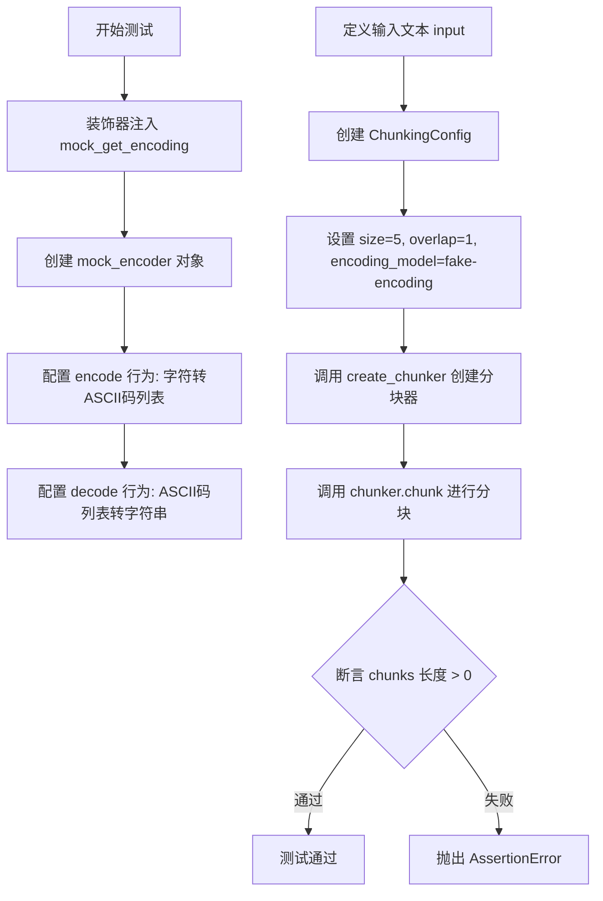

#### 带注释源码

```python
@patch("tiktoken.get_encoding")  # 装饰器: 模拟 tiktoken.get_encoding 函数
def test_basic_functionality(self, mock_get_encoding):
    """测试基于 token 的分块基本功能"""
    
    # 创建 Mock 对象用于模拟 tiktoken encoder
    mock_encoder = Mock()
    
    # 配置 encode 方法: 将文本字符转换为 ASCII 码列表
    # 例如: "abc" -> [97, 98, 99]
    mock_encoder.encode.side_effect = lambda x: list(x.encode())
    
    # 配置 decode 方法: 将 ASCII 码列表转换回字符串
    mock_encoder.decode.side_effect = lambda x: bytes(x).decode()
    
    # 设置 mock_get_encoding 返回 mock_encoder
    mock_get_encoding.return_value = mock_encoder

    # 测试输入文本 (一段关于圣诞颂歌的著名开场白)
    input = "Marley was dead: to begin with. There is no doubt whatever about that. The register of his burial was signed by the clergyman, the clerk, the undertaker, and the chief mourner. Scrooge signed it. And Scrooge's name was good upon 'Change, for anything he chose to put his hand to."

    # 创建分块配置: 基于 token 的分块方式
    config = ChunkingConfig(
        size=5,              # 每个 chunk 包含 5 个 token
        overlap=1,           # 相邻 chunk 之间重叠 1 个 token
        encoding_model="fake-encoding",  # 模拟的编码模型名称
        type=ChunkerType.Tokens,  # 指定分块类型为 token 级别
    )

    # 使用工厂函数创建分块器,传入自定义的 encode/decode 函数
    chunker = create_chunker(config, mock_encoder.encode, mock_encoder.decode)
    
    # 对输入文本进行分块
    chunks = chunker.chunk(input)

    # 断言: 验证分块结果非空
    assert len(chunks) > 0
```

## 关键组件


### MockTokenizer

用于测试的模拟分词器实现，继承自Tokenizer基类，提供文本编码和解码功能。

### TestRunSentences

句子级别文本分块的测试类，验证基于句子的分块功能是否正确，包括基本句子分割和不规则空白字符处理。

### TestRunTokens

基于Token的文本分块测试类，使用Mock的tiktoken编码器验证分块逻辑。

### split_text_on_tokens

将文本按token数量进行分块的核心函数，支持自定义分块大小、重叠大小、编码和解码函数。

### create_chunker

分块器工厂函数，根据配置创建相应类型的分块器实例。

### ChunkingConfig

分块配置类，定义分块类型、尺寸、重叠、编码模型等参数。

### ChunkerType

分块策略类型的枚举定义，支持Sentence和Tokens两种分块方式。

### bootstrap

NLTK语料库初始化函数，确保分词所需的NLP资源可用。

## 问题及建议


### 已知问题

- **MockTokenizer实现与真实Tokenizer不一致**：使用`ord(char)`将每个字符转换为ASCII码，这与真实tokenizer的词表映射机制完全不同，可能导致测试通过但生产环境行为异常。
- **TestRunTokens中的MockEncoder实现不准确**：`mock_encoder.encode.side_effect = lambda x: list(x.encode())`实际上只是调用Python内置的字符串encode，而非真正的tokenization逻辑，无法验证真实的分块逻辑。
- **测试断言过于宽松**：如`assert len(chunks) > 0`只验证有输出但不验证正确性，无法有效捕获回归问题。
- **缺乏边界条件测试**：未覆盖空字符串、None输入、单字符、纯空白等边界场景。
- **全局状态依赖**：`bootstrap()`在setup_method中调用修改全局状态，可能导致测试间隐藏依赖和执行顺序敏感问题。
- **硬编码测试数据**：测试字符串和期望结果直接内联在测试方法中，缺乏参数化和可维护性。
- **缺失类型注解**：全局函数`test_split_text_str_empty`和`test_split_text_on_tokens`缺少类型注解。
- **未使用的导入**：`ChunkerType`、`ChunkingConfig`等在某些测试中未被充分使用。

### 优化建议

- **使用真实或更准确的Mock**：考虑使用真实的tiktoken encoder进行集成测试，或实现一个更接近真实Tokenizer行为的Mock类（如基于词表的映射）。
- **增强断言精确性**：将`len(chunks) > 0`改为验证具体的分块内容、索引和字符位置。
- **添加边界条件测试**：增加对空字符串、None、超短文本、特殊字符（如emoji、unicode）的测试用例。
- **参数化测试**：使用`@pytest.mark.parametrize`重构相似测试，减少代码重复。
- **显式化依赖**：将`bootstrap()`调用改为fixture显式注入，或在文档中说明其全局副作用。
- **添加类型注解**：为全局测试函数添加输入输出类型注解，提升代码可读性。
- **抽取测试数据**：将测试字符串和期望结果移至测试类或模块级别的常量/fixture中，提高可维护性。

## 其它


### 设计目标与约束

本代码的核心设计目标是验证文本分块（Chunking）功能的正确性，包括基于句子的分块和基于Token的分块两种策略。设计约束包括：1）依赖graphrag_tokenizer、graphrag_chunking和graphrag_llm三个外部模块；2）使用NLTK进行句子边界检测；3）Token分块需要提供有效的encode/decode函数；4）所有分块操作必须保持原始文本的字符索引信息以支持后续的上下文追溯。

### 错误处理与异常设计

代码采用Python标准的assert断言进行验证，在测试失败时抛出AssertionError。create_chunker可能抛出ValueError当传入无效的ChunkerType时。split_text_on_tokens对空字符串返回空列表而非抛出异常，这是合理的防御性编程。当前代码缺少对以下异常场景的测试：None输入、编码/解码函数抛出异常、非法chunk_size/chunk_overlap参数（如负数）。

### 数据流与状态机

数据流主要分为两条路径：1）句子分块路径：输入文本→bootstrap NLTK→create_chunker(Sentence)→chunker.chunk()→返回Chunk对象列表；2）Token分块路径：输入文本→create_chunker(Tokens)→split_text_on_tokens()→返回字符串列表。状态机相对简单，主要状态包括：初始化状态（setup_method bootstrap）、就绪状态（chunker创建完成）、分块执行状态、验证状态（assert检查）。无复杂的并发状态或事务性状态。

### 外部依赖与接口契约

核心依赖包括：1）graphrag_tokenizer提供get_tokenizer()获取tokenizer实例；2）graphrag_chunking.bootstrap_nltk提供bootstrap()初始化NLTK数据；3）graphrag_chunking.chunker_factory.create_chunker创建分块器；4）graphrag_chunking.chunking_config.ChunkingConfig配置对象；5）graphrag_chunking.token_chunker.split_text_on_tokens核心分块函数；6）graphrag_llm.tokenizer.Tokenizer抽象基类。接口契约方面：Tokenizer.encode()返回list[int]，Tokenizer.decode()接受list[int]返回str；create_chunker()接受ChunkingConfig和可选的encode/decode函数；chunker.chunk()返回Chunk对象列表需包含text、index、start_char、end_char属性。

### 性能考虑

当前代码为单元测试，未包含性能基准测试。split_text_on_tokens的时间复杂度为O(n)线性遍历文本长度，空间复杂度为O(n)存储所有分块结果。潜在的性能优化点：对于大批量文本处理可考虑批处理和流式处理；当前重叠计算可能存在重复编码可以考虑缓存机制；MockTokenizer的encode实现使用ord字符级别编码，生产环境应使用更高效的tokenizer如tiktoken。

### 安全性考虑

代码为测试代码，安全性风险较低。需要注意：1）MockTokenizer.decode使用chr转换需防范非法的token id输入；2）测试代码中mock_get_encoding可能存在安全风险需确保mock返回值的经验证；3）依赖的外部模块需关注其安全更新。代码本身不涉及用户输入处理、权限控制或敏感数据操作。

### 配置管理

ChunkingConfig是核心配置类，支持以下参数：type（ChunkerType枚举）、size（分块大小）、overlap（重叠大小）、encoding_model（编码模型名称）。当前测试覆盖的配置场景：默认句子分块、不带重叠的Token分块、带重叠的Token分块、不同encoding_model。配置验证逻辑未在测试代码中体现，建议在实际使用中添加配置校验。

### 测试策略

采用pytest框架，测试策略包括：1）单元测试覆盖核心分块逻辑（TestRunSentences、TestRunTokens）；2）使用Mock对象隔离外部依赖（MockTokenizer、mock_get_encoding）；3）参数化测试思想通过多个test_split_text_on_tokens变体体现。测试覆盖场景：基本功能、空输入、空白字符处理、重叠/无重叠场景。测试缺口：未覆盖超大文本、边界条件（极短文本、特殊字符）、性能回归测试、并发场景。

### 版本兼容性与依赖管理

代码明确标注Copyright 2024 Microsoft Corporation，License为MIT。依赖版本约束未在代码中显式声明，建议使用requirements.txt或pyproject.toml锁定：graphrag_tokenizer、graphrag_chunking、graphrag_llm、pytest、tiktoken、nltk。Python版本要求推测为3.8+（使用typing.Any、setup_method等特性）。NLTK数据（punkt、punkt_tab、averaged_perceptron_tagger）需通过bootstrap()显式下载。

### 部署与运维

此代码为测试代码，不直接用于生产部署。运维关注点：1）CI/CD需确保NLTK数据可用；2）集成测试需配置tiktoken mock或使用真实encoding model；3）建议添加测试覆盖率报告和持续监控。日志记录需求较低，主要通过pytest的详细输出进行调试。

### 关键设计决策记录

1）采用字符级索引（start_char/end_char）而非token级索引，权衡：精确但可能因编码差异导致不一致；2）split_text_on_tokens返回字符串列表而非Chunk对象列表，与Sentence分块策略返回不同类型，决策原因可能是Token分块不需要索引信息；3）空字符串返回空列表的设计决策，避免边界条件判断简化调用方逻辑。


    