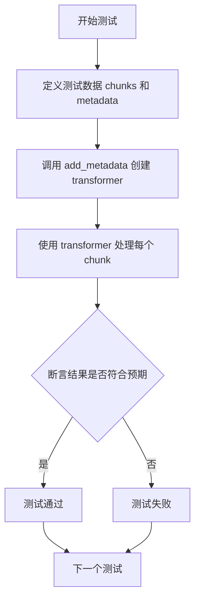
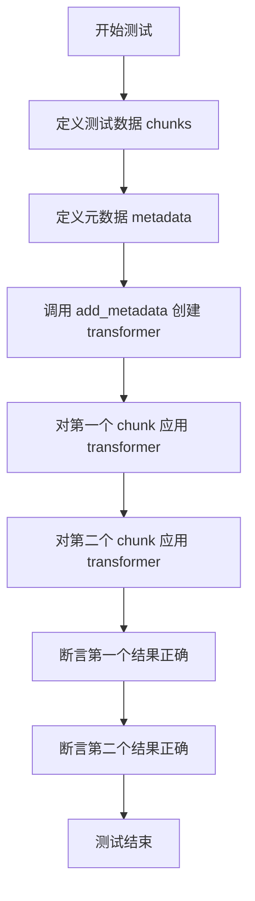
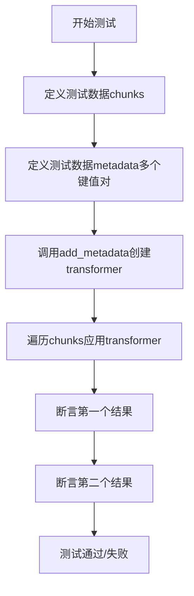

# `graphrag\tests\unit\chunking\test_prepend_metadata.py` 详细设计文档

这是一个测试文件，用于验证 graphrag_chunking 模块中 add_metadata 函数的功能。该函数用于在文本块（chunks）前后添加元数据（metadata），支持自定义分隔符和追加模式。

## 整体流程



## 类结构

```
测试文件 (无类定义)
└── 测试函数集合
    ├── test_add_metadata_one_row (基本前置元数据测试)
    ├── test_add_metadata_one_row_append (追加模式测试)
    ├── test_add_metadata_multiple_rows (多键值对测试)
    └── test_add_metadata_custom_delimiters (自定义分隔符测试)
```

## 全局变量及字段


### `chunks`
    
测试用的文本块列表

类型：`List[str]`
    


### `metadata`
    
要添加的元数据字典

类型：`Dict[str, str]`
    


### `transformer`
    
add_metadata返回的转换函数，用于将元数据添加到文本块

类型：`Callable[[str], str]`
    


### `results`
    
转换函数处理文本块后的结果列表

类型：`List[str]`
    


### `delimiter`
    
元数据键值对之间的分隔符，默认为换行符

类型：`str`
    


### `line_delimiter`
    
元数据与文本块之间的分隔符，默认为换行符

类型：`str`
    


### `add_metadata`
    
从graphrag_chunking.transformers导入的函数，用于创建元数据转换器

类型：`Callable`
    


    

## 全局函数及方法


### `test_add_metadata_one_row`

测试函数，用于验证向文本块添加元数据（前置元数据）功能的正确性。

参数：
- （无参数）

返回值：`None`，测试函数无返回值，通过断言验证逻辑正确性。

#### 流程图

```mermaid
flowchart TD
    A[Start] --> B[定义 chunks 列表<br/>["This is a test.", "Another sentence."]]
    B --> C[定义 metadata 字典<br/>{"message": "hello"}]
    C --> D[调用 add_metadata 创建 transformer<br/>transformer = add_metadata(metadata)]
    D --> E[对第一个 chunk 应用 transformer<br/>transformer("This is a test.")]
    E --> F[获取结果 result[0]<br/>"message: hello\nThis is a test."]
    F --> G{断言 result[0] ==<br/>"message: hello\nThis is a test."}
    G -->|通过| H[对第二个 chunk 应用 transformer<br/>transformer("Another sentence.")]
    H --> I[获取结果 result[1]<br/>"message: hello\nAnother sentence."]
    I --> J{断言 result[1] ==<br/>"message: hello\nAnother sentence."}
    J -->|通过| K[End 测试通过]
    G -->|失败| L[End 测试失败]
    J -->|失败| L
```

#### 带注释源码

```python
def test_add_metadata_one_row():
    """Test prepending metadata to chunks"""
    # 定义待处理的文本块列表
    chunks = ["This is a test.", "Another sentence."]
    # 定义要添加的元数据字典
    metadata = {"message": "hello"}
    # 使用 add_metadata 函数创建转换器（高阶函数）
    # 转换器是一个闭包，接收 chunk 参数并返回添加元数据后的字符串
    transformer = add_metadata(metadata)
    # 对每个 chunk 应用转换器，获取结果列表
    results = [transformer(chunk) for chunk in chunks]
    # 断言第一个结果：元数据应前置+换行+原始文本
    assert results[0] == "message: hello\nThis is a test."
    # 断言第二个结果：同样的元数据应添加到第二个文本前
    assert results[1] == "message: hello\nAnother sentence."
```


### `test_add_metadata_one_row_append`

该测试函数用于验证 `add_metadata` 函数在 `append=True` 参数下的行为，即验证元数据是追加到文本块末尾而非前置。

参数：此函数无参数

返回值：`None`，该函数为测试函数，不返回值，仅通过断言验证逻辑正确性

#### 流程图



#### 带注释源码

```python
def test_add_metadata_one_row_append():
    """Test prepending metadata to chunks"""
    # 定义测试用的文本块列表
    chunks = ["This is a test.", "Another sentence."]
    
    # 定义要追加的元数据字典
    metadata = {"message": "hello"}
    
    # 调用 add_metadata 函数创建转换器
    # append=True 表示将 metadata 追加到 chunk 末尾而不是前置
    transformer = add_metadata(metadata, append=True)
    
    # 对每个 chunk 应用转换器
    results = [transformer(chunk) for chunk in chunks]
    
    # 验证第一个 chunk 的结果
    # 预期：原文本 + metadata 追加到末尾 + 换行符
    assert results[0] == "This is a test.message: hello\n"
    
    # 验证第二个 chunk 的结果
    assert results[1] == "Another sentence.message: hello\n"
```


### `test_add_metadata_multiple_rows`

该函数是一个单元测试，用于验证 `add_metadata` 函数在处理包含多个键值对的元数据字典时，能够正确地将所有键值对以默认格式（键冒号空格值换行）添加到文本块之前，并确保元数据的顺序保持一致。

参数：此函数无参数

返回值：`None`，该函数为测试函数，通过断言验证结果，不返回任何值

#### 流程图



#### 带注释源码

```python
def test_add_metadata_multiple_rows():
    """Test prepending metadata to chunks"""
    # 定义测试用的文本块列表
    chunks = ["This is a test.", "Another sentence."]
    
    # 定义包含多个键值对的元数据字典
    metadata = {"message": "hello", "tag": "first"}
    
    # 使用add_metadata函数创建转换器，默认prepend模式
    # 转换器将把metadata格式化后 prepend 到每个chunk 前面
    transformer = add_metadata(metadata)
    
    # 对每个chunk应用transformer，得到结果列表
    results = [transformer(chunk) for chunk in chunks]
    
    # 断言第一个chunk的转换结果
    # 期望格式：metadata键值对按顺序排列，每对格式为"key: value\n"，最后拼接原chunk
    assert results[0] == "message: hello\ntag: first\nThis is a test."
    
    # 断言第二个chunk的转换结果
    assert results[1] == "message: hello\ntag: first\nAnother sentence."
```


### `test_add_metadata_custom_delimiters`

这是一个测试函数，用于验证 `add_metadata` 函数在使用自定义分隔符（`delimiter` 和 `line_delimiter`）时能否正确地将元数据添加到文本块的前面。

参数：

- 无（测试函数不接受外部参数）

返回值：`无`（该函数使用 `assert` 语句进行断言验证，不返回任何值）

#### 流程图

```mermaid
flowchart TD
    A[开始测试] --> B[定义chunks列表: "This is a test.", "Another sentence."]
    B --> C[定义metadata字典: {"message": "hello", "tag": "first"}]
    C --> D[创建transformer: 调用add_metadata函数, 传入metadata, delimiter="-", line_delimiter="_"]
    D --> E[对第一个chunk应用transformer]
    E --> F{断言结果}
    F -->|通过| G[对第二个chunk应用transformer]
    G --> H{断言结果}
    H -->|通过| I[测试通过]
    F -->|失败| J[抛出AssertionError]
    H -->|失败| J
```

#### 带注释源码

```python
def test_add_metadata_custom_delimiters():
    """Test prepending metadata to chunks"""
    # 定义测试用的文本块列表
    chunks = ["This is a test.", "Another sentence."]
    
    # 定义要添加的元数据字典（包含两个键值对）
    metadata = {"message": "hello", "tag": "first"}
    
    # 创建transformer函数，指定自定义分隔符：
    # delimiter="-" 用于键值对之间的分隔（如 "message-hello"）
    # line_delimiter="_" 用于不同键值对之间的分隔
    transformer = add_metadata(metadata, delimiter="-", line_delimiter="_")
    
    # 对每个chunk应用transformer并收集结果
    results = [transformer(chunk) for chunk in chunks]
    
    # 断言第一个结果是否符合预期格式
    # 预期: "message-hello_tag-first_This is a test."
    assert results[0] == "message-hello_tag-first_This is a test."
    
    # 断言第二个结果是否符合预期格式
    # 预期: "message-hello_tag-first_Another sentence."
    assert results[1] == "message-hello_tag-first_Another sentence."
```


## 关键组件


### add_metadata 函数

将元数据字典添加到文本块的功能函数，支持前置或后置添加，并允许自定义键值对和行分隔符。

### 元数据前缀模式

默认行为，将元数据键值对以 "key: value\n" 格式添加到文本块开头，多个键值对按顺序排列。

### 元数据后缀模式

通过 append=True 参数激活，将元数据键值对添加到文本块末尾。

### 可配置分隔符系统

支持自定义键值对分隔符（delimiter 参数）和行分隔符（line_delimiter 参数），默认分别为 ": " 和 "\n"。


## 问题及建议


### 已知问题

- 缺少边界条件测试：未测试空chunks、空metadata、None值等极端情况
- 缺少错误处理测试：未测试传入无效参数（如非字符串类型）时的异常处理
- 测试覆盖不足：未测试特殊字符（换行符、冒号等）在metadata值中的处理
- 测试数据重复：多个测试函数中重复定义chunks和metadata，可提取为共享的fixture
- 断言信息不明确：测试失败时仅使用默认断言消息，缺乏有意义的错误提示

### 优化建议

- 使用pytest fixtures定义共享的chunks和metadata测试数据，减少代码重复
- 添加边界条件测试用例：空字符串、单字符、Unicode字符、超长字符串等
- 添加类型错误测试：验证当传入非字符串类型时是否抛出TypeError
- 改进断言消息：使用pytest的assert语句配合自定义错误信息，如`assert results[0] == expected, f"Expected {expected}, got {results[0]}"`
- 考虑添加性能测试：验证在大量chunks和metadata时的处理效率
- 添加模糊测试：使用property-based testing验证各种输入组合的正确性

## 其它


### 设计目标与约束

本代码模块的核心目标是为文本块（chunks）添加元数据，支持前置和追加两种模式，并允许自定义分隔符。设计约束包括：元数据以键值对形式存储， delimiter 参数控制键值对内部连接符，line_delimiter 参数控制多行元数据的换行符，默认分隔符分别为冒号和换行符。

### 错误处理与异常设计

代码中未显式定义异常处理机制。潜在异常场景包括：metadata 参数类型不为字典时的 TypeError，delimiter 或 line_delimiter 参数为非字符串类型时的 TypeError，以及空字符串作为分隔符时可能导致输出格式问题。建议调用方在传入参数前进行类型校验。

### 数据流与状态机

数据流为：输入 chunks 列表 → 遍历每个 chunk → 应用 transformer 函数 → 输出添加元数据后的字符串列表。状态机仅涉及两种状态：前置模式（默认）和追加模式，由 append 参数控制。

### 外部依赖与接口契约

外部依赖为 graphrag_chunkings.transformers 模块中的 add_metadata 函数。接口契约如下：
- 函数签名：add_metadata(metadata: dict, append: bool = False, delimiter: str = ":", line_delimiter: str = "\n")
- metadata：字典类型，用于存储要添加的元数据键值对
- append：布尔类型，False 表示前置元数据，True 表示追加元数据
- delimiter：字符串类型，控制键值对内部连接符，默认为冒号
- line_delimiter：字符串类型，控制多行元数据换行符，默认为换行符
- 返回值：返回一个接受单个 chunk 参数的函数（闭包），该函数返回添加元数据后的字符串

### 性能考虑与优化空间

当前实现采用列表推导式遍历 chunks，对于大规模数据可能存在性能瓶颈。优化方向包括：支持批量处理多个 chunks 而非逐个应用 transformer，以及考虑使用生成器模式减少内存占用。此外，当前每次调用 transformer 都会重新构建元数据字符串，可考虑缓存机制。

### 安全性考虑

代码本身不涉及敏感数据处理，但需注意：metadata 字典中的值应避免包含恶意构造的字符串导致输出格式错乱；如元数据来源于用户输入，应进行必要的转义处理以防止注入攻击。

### 版本兼容性

代码未标注版本兼容性信息。建议确认 add_metadata 函数在不同版本的 graphrag_chunking 包中的行为一致性，特别是在 delimiter 和 line_delimiter 参数的处理逻辑上。

    