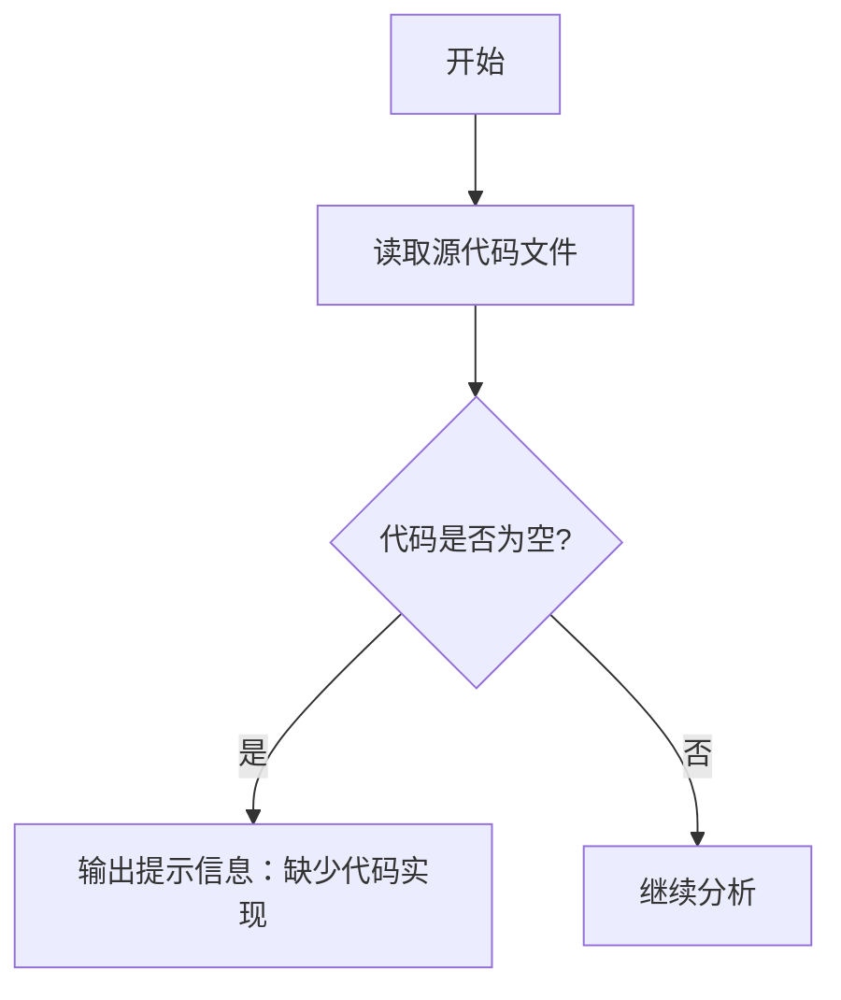

# `graphrag\tests\unit\config\__init__.py` 详细设计文档

该文件仅包含版权声明和MIT许可证头部，没有实际可执行的代码实现，因此无法进行完整的功能分析。

## 整体流程



## 类结构

```
无可用类结构 - 代码仅包含许可证头部
```

## 全局变量及字段


    

## 全局函数及方法


## 关键组件


### 组件识别结果

由于提供的源代码仅包含MIT许可证的版权声明，没有实际的功能代码实现，因此无法识别出任何关键组件（如张量索引、惰性加载、反量化支持、量化策略等）。

### 建议

请提供完整的源代码文件，以便进行架构分析和生成详细设计文档。


## 问题及建议


### 已知问题

-   代码仅包含版权声明和 MIT 许可证声明，缺乏实际的业务逻辑实现
-   无法从现有代码中提取类、方法、全局变量等设计文档所需的元素
-   由于缺少功能代码，无法进行完整的技术债务分析和优化建议

### 优化建议

-   提供完整的源代码实现，以便进行全面的架构分析和设计文档生成
-   建议在后续代码中添加清晰的模块划分和接口定义
-   建议包含完整的错误处理、日志记录和异常管理机制
-   建议添加必要的单元测试和集成测试代码
-   建议提供配置文件和依赖管理文件（如 requirements.txt、pyproject.toml 等）


## 其它


### 设计目标与约束

本项目旨在提供一个符合MIT许可的开源软件框架，核心目标是确保代码的合法性、清晰性和可维护性。设计约束包括：遵循MIT许可证条款、保持代码简洁性、确保跨平台兼容性、遵守Microsoft内部开发规范。由于当前代码仅为版权声明文件，尚未定义具体功能性设计目标。

### 错误处理与异常设计

当前代码文件为纯版权声明，不涉及运行时错误处理逻辑。在实际功能代码中，应采用统一的异常捕获机制，使用try-catch块处理潜在异常，并记录详细错误日志。异常类应继承自基异常类，定义有意义的错误码和错误消息，便于问题定位和调试。

### 数据流与状态机

由于代码仅包含版权声明，无数据流或状态机设计。在完整项目中，数据流应清晰定义输入数据处理流程、中间数据转换逻辑和输出数据格式。状态机应定义所有可能状态、状态转换条件及触发动作，确保业务逻辑清晰可控。

### 外部依赖与接口契约

当前文件无外部依赖。在完整项目中，应明确列出所有第三方库依赖，注明版本范围和许可证兼容性。接口契约应定义清晰的API规范，包括请求参数格式、响应数据结构、错误返回码及HTTP状态码对应关系，确保与外部系统的交互一致性。

### 性能要求与约束

由于代码仅为版权声明，无性能相关设计。在实际项目中，应定义性能指标如响应时间、吞吐量、资源占用等要求。关键路径应进行性能测试，确保满足预定义的性能目标。

### 安全性考虑

代码应遵循安全编码最佳实践，防止常见安全漏洞。当前文件为版权声明，无敏感数据处理。在功能代码中，应实施输入验证、输出编码、认证授权、加密传输等安全措施，保护系统和用户数据安全。

### 兼容性设计

应明确支持的运行环境，包括操作系统版本、运行时环境版本、浏览器兼容性等。采用版本化管理依赖库，确保向后兼容。提供迁移指南，帮助用户平滑升级到新版本。

### 配置管理

定义可配置参数及默认值，说明配置加载机制和优先级顺序。支持环境变量、配置文件、命令行参数等多种配置方式。敏感配置应支持加密存储，避免硬编码敏感信息。

### 测试策略

制定完整测试策略，包括单元测试、集成测试、系统测试和端到端测试。定义测试覆盖率目标，确保关键路径充分测试。自动化测试应集成到CI/CD流程，保证代码质量。

### 部署架构

描述系统部署模式，包括环境要求、服务器配置、负载均衡、高可用方案等。提供容器化部署方案（如Dockerfile、Kubernetes配置），简化部署流程。明确不同环境的配置差异。

### 版本管理

采用语义化版本号（Semantic Versioning），清晰标识主版本、次版本、补丁版本变更。维护CHANGELOG文档，记录每个版本的变更内容。定义版本兼容性策略和升级路径。

### 监控与运维

建立完善的监控体系，包括系统监控、应用监控和业务监控。定义关键指标和告警阈值，确保问题及时发现。提供健康检查接口和运维日志，便于故障排查。

### 许可证合规性

本项目基于MIT许可证开源，需确保代码中包含完整的许可证头声明。第三方依赖需检查许可证兼容性，避免法律风险。分发时需保留许可证文件和版权声明。


    