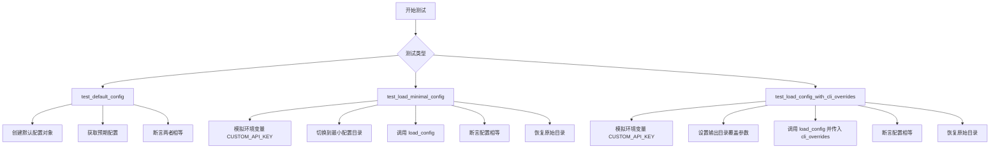
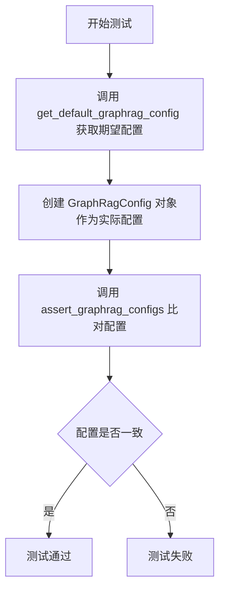
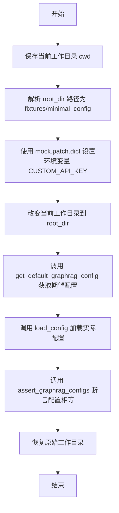
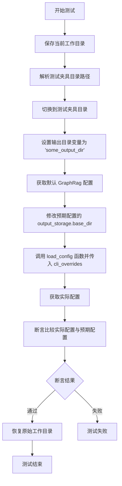

# `graphrag\tests\unit\config\test_config.py` 详细设计文档

该文件是 GraphRAG 配置加载模块的单元测试文件，主要测试默认配置生成、最小配置加载以及 CLI 参数覆盖功能，验证配置系统能否正确初始化并处理环境变量和命令行参数。

## 整体流程



## 类结构

```
测试模块 (test_load_config.py)
├── 测试函数
│   ├── test_default_config
│   ├── test_load_minimal_config
│   └── test_load_config_with_cli_overrides
└── 依赖模块
    ├── graphrag.config.load_config
    └── graphrag.config.models.graph_rag_config
```

## 全局变量及字段


### `cwd`
    
测试前保存的当前工作目录

类型：`Path`
    


### `root_dir`
    
最小配置 fixtures 目录路径

类型：`Path`
    


### `output_dir`
    
CLI 覆盖的输出目录名称

类型：`str`
    


### `expected_output_base_dir`
    
预期的输出基础目录

类型：`Path`
    


    

## 全局函数及方法


### `test_default_config`

该函数通过创建默认的 GraphRagConfig 对象并与预期的默认配置进行比对，验证配置生成功能的正确性。

参数： 无

返回值：`None`，无返回值（测试函数）

#### 流程图



#### 带注释源码

```python
def test_default_config() -> None:
    # 调用工具函数获取预期的默认配置对象
    expected = get_default_graphrag_config()
    
    # 使用默认的完成模型和嵌入模型创建实际的 GraphRagConfig 配置对象
    actual = GraphRagConfig(
        completion_models=DEFAULT_COMPLETION_MODELS,  # type: ignore
        embedding_models=DEFAULT_EMBEDDING_MODELS,  # type: ignore
    )
    
    # 断言实际配置与预期配置一致，验证默认配置生成功能的正确性
    assert_graphrag_configs(actual, expected)
```


### `test_load_minimal_config`

测试从文件加载最小配置的功能，该函数通过模拟环境变量并调用 `load_config` 函数来验证配置加载的正确性。

参数：此函数无显式参数。

返回值：`None`，测试函数无返回值。

#### 流程图



#### 带注释源码

```python
@mock.patch.dict(os.environ, {"CUSTOM_API_KEY": FAKE_API_KEY}, clear=True)
def test_load_minimal_config() -> None:
    """
    测试从文件加载最小配置的功能
    
    该测试函数验证 load_config 能否正确加载最小配置文件，
    并确保加载的配置与默认配置一致。
    """
    # 保存测试执行前的当前工作目录，以便测试后恢复
    cwd = Path.cwd()
    
    # 解析最小配置文件所在目录的绝对路径
    # 路径为: tests/unit/config/fixtures/minimal_config
    root_dir = (Path(__file__).parent / "fixtures" / "minimal_config").resolve()
    
    # 切换到配置文件目录，以便 load_config 能正确读取相对路径配置
    os.chdir(root_dir)
    
    # 获取期望的默认配置对象
    expected = get_default_graphrag_config()

    # 调用 load_config 函数从 minimal_config 目录加载配置
    actual = load_config(
        root_dir=root_dir,  # 配置文件根目录路径
    )
    
    # 断言实际加载的配置与期望的默认配置相等
    assert_graphrag_configs(actual, expected)
    
    # 测试完成后恢复原始工作目录，避免影响其他测试
    os.chdir(cwd)
```


### `test_load_config_with_cli_overrides`

测试函数，用于验证 CLI 参数覆盖功能。通过模拟环境变量并调用 `load_config` 函数，传入 `cli_overrides` 参数，验证该参数能够正确覆盖默认配置中的 `output_storage.base_dir` 值。

参数：

- 此函数无显式参数（测试函数，通过装饰器和函数内部逻辑执行）

返回值：`None`，测试函数无返回值

#### 流程图



#### 带注释源码

```python
@mock.patch.dict(os.environ, {"CUSTOM_API_KEY": FAKE_API_KEY}, clear=True)
def test_load_config_with_cli_overrides() -> None:
    # 保存测试前的当前工作目录，测试结束后需要恢复
    cwd = Path.cwd()
    
    # 解析测试夹具目录路径 (tests/fixtures/minimal_config)
    root_dir = (Path(__file__).parent / "fixtures" / "minimal_config").resolve()
    
    # 切换到测试夹具目录，模拟在项目根目录下运行
    os.chdir(root_dir)
    
    # 定义测试用的输出目录名称
    output_dir = "some_output_dir"
    
    # 计算预期的输出基础目录路径
    expected_output_base_dir = root_dir / output_dir
    
    # 获取默认的 GraphRag 配置作为预期配置基准
    expected = get_default_graphrag_config()
    
    # 修改预期配置中的 output_storage.base_dir 为测试值
    expected.output_storage.base_dir = str(expected_output_base_dir)

    # 调用 load_config 函数，传入根目录和 CLI 覆盖参数
    # cli_overrides 参数用于覆盖默认配置中的特定值
    actual = load_config(
        root_dir=root_dir,
        cli_overrides={"output_storage": {"base_dir": output_dir}},
    )
    
    # 断言实际配置与预期配置一致
    assert_graphrag_configs(actual, expected)
    
    # 测试完成后恢复原始工作目录，避免影响其他测试
    os.chdir(cwd)
```

## 关键组件


### 配置加载模块 (load_config)

负责从指定根目录加载 GraphRAG 配置的核心函数，支持自定义配置覆盖

### 配置模型 (GraphRagConfig)

定义 GraphRAG 框架的配置数据结构，包含 completion_models 和 embedding_models 等字段

### 默认配置生成器 (get_default_graphrag_config)

生成测试用的默认 GraphRagConfig 对象，用于测试用例的比对基准

### 配置断言工具 (assert_graphrag_configs)

验证实际配置与预期配置是否一致的断言工具函数

### 环境变量模拟 (mock.patch.dict)

通过 unittest.mock.patch.dict 动态设置和清理环境变量，模拟测试所需的 API 密钥等配置

### 路径处理模块 (Path)

使用 pathlib.Path 处理文件路径，支持相对路径转绝对路径、目录切换等操作

### 测试数据 fixtures

包含 minimal_config 目录的测试配置文件，用于验证不同配置场景的加载逻辑

### CLI 配置覆盖机制

支持通过 cli_overrides 参数动态覆盖配置项，如 output_storage.base_dir 等嵌套配置


## 问题及建议


### 已知问题

-   **工作目录恢复风险**：测试中使用`os.chdir(cwd)`恢复工作目录，但如果测试在恢复前抛出异常，工作目录将保持为`root_dir`，影响后续测试执行。
-   **环境变量清理过度**：`@mock.patch.dict(os.environ, {"CUSTOM_API_KEY": FAKE_API_KEY}, clear=True)`使用`clear=True`会清除所有环境变量，可能破坏其他测试或系统功能。
-   **硬编码路径缺少校验**：`(Path(__file__).parent / "fixtures" / "minimal_config").resolve()`如果目录不存在，测试会直接失败，缺乏友好的错误提示。
-   **重复调用get_default_graphrag_config()**：在多个测试中重复调用`get_default_graphrag_config()`获取期望值，可能引入状态不一致风险。
-   **类型注解缺失**：测试函数`test_load_config_with_cli_overrides`的返回值类型未标注，`actual`变量类型不明确。

### 优化建议

-   使用`pytest fixture`配合`yield`语法自动管理测试前后的工作目录恢复，确保异常情况下也能正确清理。
-   移除`mock.patch.dict`的`clear=True`参数，或在测试结束后显式恢复环境变量，改为仅设置需要的变量。
-   在测试开始前添加路径存在性检查，提供清晰的测试跳过或失败信息。
-   将`get_default_graphrag_config()`的调用提取为测试fixture，避免重复执行。
-   为所有测试函数添加返回类型注解`: None`，明确函数无返回值。
-   考虑使用`tmp_path` fixture或`os.environ`的保护机制来隔离测试环境。

## 其它


### 设计目标与约束

本测试文件旨在验证GraphRag配置加载模块的核心功能，包括默认配置生成、环境变量读取、CLI参数覆盖等场景。测试约束包括：1) 必须使用mock隔离外部依赖；2) 测试前后需恢复工作目录以避免副作用；3) 配置对象比较使用专门的assert_graphrag_configs工具函数。

### 错误处理与异常设计

测试代码主要处理两类异常场景：1) 工作目录切换失败时的异常捕获（通过finally或测试后重置）；2) 配置加载过程中缺少必要环境变量时的错误响应。测试通过@mock.patch.dict模拟各种环境变量组合，验证load_config函数的容错能力。

### 数据流与状态机

测试数据流为：环境变量（os.environ）→ load_config() → GraphRagConfig对象 → assert_graphrag_configs()比较。状态机涉及：初始状态（cwd）→ 切换到测试目录 → 执行配置加载 → 验证结果 → 恢复cwd。每个测试用例独立运行，通过mock实现环境隔离。

### 外部依赖与接口契约

核心依赖包括：1) graphrag.config.load_config.load_config函数，接受root_dir和cli_overrides参数；2) GraphRagConfig数据模型类；3) tests.unit.config.utils中的辅助函数。接口契约规定load_config必须返回可与get_default_graphrag_config()结果进行深度比较的GraphRagConfig实例。

### 测试覆盖范围

test_default_config覆盖默认构造场景；test_load_minimal_config验证从minimal_config fixture加载配置的能力；test_load_config_with_cli_overrides测试CLI参数覆盖机制。三个测试函数覆盖了配置系统的核心使用路径。

### Fixtures与测试数据

测试使用fixtures/minimal_config目录作为配置源，通过Path(__file__).parent / "fixtures" / "minimal_config"动态构建路径。FAKE_API_KEY用于模拟API密钥环境变量，DEFAULT_COMPLETION_MODELS和DEFAULT_EMBEDDING_MODELS提供模型配置基准值。

### 并发与副作用考虑

测试通过os.chdir修改进程工作目录，存在潜在的测试间相互影响风险。代码已通过在测试结尾调用os.chdir(cwd)进行恢复，但最佳实践是使用pytest fixtures或context manager封装目录切换逻辑。测试执行顺序不影响结果，因每个测试独立设置环境。

    