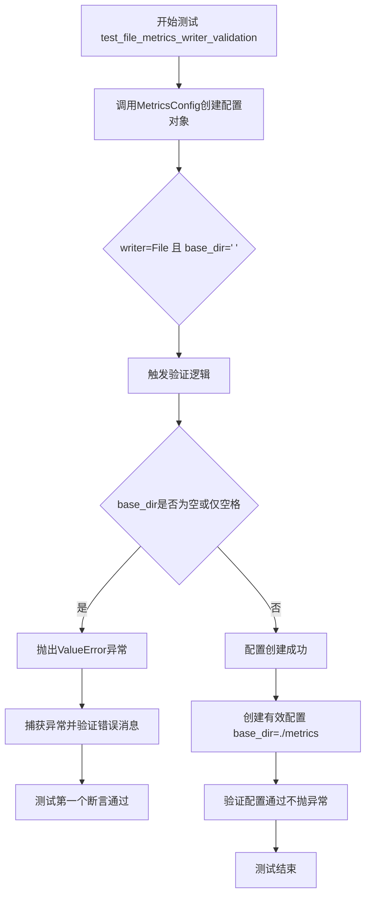
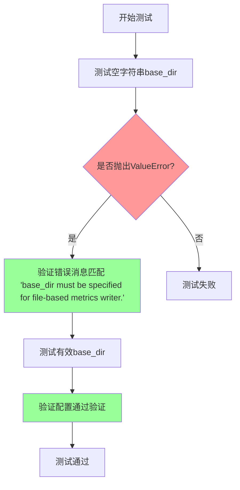

# `graphrag\tests\unit\config\test_metrics_config.py` 详细设计文档

这是一个测试文件，用于验证指标配置加载功能，特别是测试文件类型指标写入器（MetricsWriterType.File）在缺少必需参数（base_dir）时的验证逻辑，确保抛出正确的ValueError异常。

## 整体流程



## 类结构

```
测试模块 (test file)
└── test_file_metrics_writer_validation (测试函数)
```

## 全局变量及字段


    

## 全局函数及方法


### `test_file_metrics_writer_validation`

该测试函数用于验证 `MetricsConfig` 在使用文件类型指标写入器时，如果 `base_dir` 参数为空或仅包含空白字符，则会正确抛出 `ValueError` 异常。

参数：

- 该函数无参数

返回值：`None`，测试函数不返回值

#### 流程图



#### 带注释源码

```python
# Copyright (c) 2024 Microsoft Corporation.
# Licensed under the MIT License

"""Test metrics configuration loading."""

# 导入pytest用于测试框架
import pytest
# 从graphrag_llm.config模块导入所需的配置类和枚举
from graphrag_llm.config import (
    MetricsConfig,
    MetricsWriterType,
)


def test_file_metrics_writer_validation() -> None:
    """Test that missing required parameters raise validation errors."""
    
    # 测试场景1：验证当base_dir为空字符串时，应该抛出ValueError
    # 使用pytest.raises上下文管理器来捕获并验证异常
    with pytest.raises(
        ValueError,  # 期望抛出的异常类型
        # 期望匹配的错误消息正则表达式
        match="base_dir must be specified for file-based metrics writer\\.",
    ):
        # 尝试创建配置，空字符串的base_dir应该触发验证错误
        _ = MetricsConfig(
            writer=MetricsWriterType.File,  # 使用文件类型写入器
            base_dir="   ",  # 仅包含空白字符的目录路径
        )

    # 测试场景2：验证有效的base_dir能够通过验证
    # passes validation - 有效的base_dir应该能成功创建配置对象
    _ = MetricsConfig(
        writer=MetricsWriterType.File,  # 使用文件类型写入器
        base_dir="./metrics",  # 有效的目录路径
    )
```

## 关键组件


### MetricsConfig

指标配置类，用于配置指标写入器的相关参数，包括写入器类型和基础目录等设置。

### MetricsWriterType

指标写入器类型的枚举定义，代码中使用了 File 类型用于文件写入。

### test_file_metrics_writer_validation

测试函数，用于验证文件类型指标写入器在缺少必需参数或参数为空字符串时能够正确抛出验证错误。


## 问题及建议


### 已知问题

- **测试覆盖不足**：仅测试了 `MetricsWriterType.File` 一种 writer 类型，未覆盖其他可能的 writer 类型（如 Console、Memory 等）的验证逻辑
- **边界情况测试缺失**：未测试 `base_dir` 为 `None`、空字符串 `""` 或其他无效值的情况
- **断言缺失**：第二个测试用例（标记为 "passes validation"）没有使用任何断言来验证 `MetricsConfig` 对象是否正确创建，应添加断言检查返回对象的属性
- **测试意图不明确**：使用 `base_dir="   "`（三个空格）来触发验证错误的做法不够直观，应使用更明确的无效值如 `None` 或 `""`
- **缺少负面测试**：未测试当 `writer` 参数为无效值时的错误处理

### 优化建议

- 增加对其他 `MetricsWriterType` 类型的验证测试，确保每种 writer 类型的必需参数都被正确验证
- 添加对 `base_dir` 为 `None`、空字符串 `""`、纯空白字符串等边界情况的测试用例
- 在 "passes validation" 测试中添加断言，如 `assert config.writer == MetricsWriterType.File` 和 `assert config.base_dir == "./metrics"`
- 考虑使用 `@pytest.mark.parametrize` 装饰器参数化测试，提高测试代码的可维护性和覆盖率
- 将测试拆分为多个更细粒度的测试函数，每个函数专注于测试一个特定场景
- 添加对无效 `writer` 值的异常测试

## 其它


### 设计目标与约束

验证 MetricsConfig 在使用 File 类型的 MetricsWriter 时，base_dir 参数必须为有效路径，不能为空字符串或仅包含空白字符。

### 错误处理与异常设计

当 base_dir 为空字符串或仅包含空白字符时，抛出 ValueError，错误信息为 "base_dir must be specified for file-based metrics writer."。调用方需要捕获该异常并提供有效的 base_dir。

### 数据流与状态机

输入：writer=MetricsWriterType.File, base_dir="   " → 验证器检查 base_dir 有效性 → 无效时抛出 ValueError → 测试捕获异常并验证错误信息匹配

输入：writer=MetricsWriterType.File, base_dir="./metrics" → 验证器检查 base_dir 有效性 → 有效时创建 MetricsConfig 实例 → 测试通过

### 外部依赖与接口契约

依赖 graphrag_llm.config 模块中的 MetricsConfig 枚举类、MetricsWriterType 枚举类。MetricsConfig 构造函数接受 writer 和 base_dir 参数，writer 必须为 MetricsWriterType.File，base_dir 必须为非空有效路径字符串。

### 测试用例设计说明

使用 pytest 框架的 pytest.raises 上下文管理器验证异常抛出行为。第一个测试用例验证空/空白 base_dir 触发 ValueError，第二个测试用例验证有效 base_dir 通过验证。

### 边界条件与异常路径

边界条件：base_dir 仅为空白字符（"   "）、空字符串（""）、None（隐式测试）。异常路径：无效 base_dir 抛出 ValueError 并携带指定错误信息。

### 配置验证规则

base_dir 必须满足：不能为空字符串、不能仅包含空白字符、必须为有效字符串类型。验证在 MetricsConfig 构造函数内部执行。

    