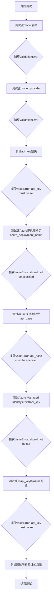

# `graphrag\tests\unit\config\test_model_config.py` 详细设计文档

这是一个测试文件，用于验证ModelConfig模型配置类的各种参数验证逻辑，包括LLM提供商类型、API密钥、Azure部署名称等参数的合法性检查。

## 整体流程



## 类结构

```
测试文件结构（无自定义类）
└── test_litellm_provider_validation (测试函数)
    └── 依赖模块: graphrag_llm.config.ModelConfig
```

## 全局变量及字段


    

## 全局函数及方法


### `test_litellm_provider_validation`

验证 LiteLLM 提供商配置的正确性，确保在缺少必需参数或参数组合错误时抛出适当的验证错误。

参数：此函数无参数

返回值：`None`，测试函数无返回值

#### 流程图

```mermaid
flowchart TD
    A[开始测试] --> B{测试1: 空model}
    B -->|期望ValidationError| C[通过]
    C --> D{测试2: 空model_provider}
    D -->|期望ValidationError| E[通过]
    E --> F{测试3: 缺少api_key}
    F -->|期望ValueError: api_key must be set| G[通过]
    G --> H{测试4: 非Azure provider指定azure_deployment_name}
    H -->|期望ValueError: should not be specified| I[通过]
    I --> J{测试5: Azure provider缺少api_base}
    J -->|期望ValueError: must be specified| K[通过]
    K --> L{测试6: Azure Managed Identity时设置api_key}
    L -->|期望ValueError: should not be set| M[通过]
    M --> N{测试7: Azure provider缺少api_key}
    N -->|期望ValueError: must be set| O[通过]
    O --> P{测试8: 有效配置 - openai}
    P --> Q[通过]
    Q --> R{测试9: 有效配置 - azure with api_key}
    R --> S[通过]
    S --> T{测试10: 有效配置 - azure with Managed Identity}
    T --> U[结束测试]
```



#### 带注释源码

```python
def test_litellm_provider_validation() -> None:
    """Test that missing required parameters raise validation errors."""

    # 测试1: 验证空的model字段应抛出ValidationError
    with pytest.raises(ValidationError):
        _ = ModelConfig(
            type=LLMProviderType.LiteLLM,
            model_provider="openai",
            model="",
        )

    # 测试2: 验证空的model_provider字段应抛出ValidationError
    with pytest.raises(ValidationError):
        _ = ModelConfig(
            type=LLMProviderType.LiteLLM,
            model_provider="",
            model="gpt-4o",
        )

    # 测试3: 验证当auth_method未指定时，缺少api_key应抛出ValueError
    with pytest.raises(
        ValueError,
        match="api_key must be set when auth_method=api_key\\.",
    ):
        _ = ModelConfig(
            type=LLMProviderType.LiteLLM,
            model_provider="openai",
            model="gpt-4o",
        )

    # 测试4: 验证非Azure provider指定azure_deployment_name应抛出ValueError
    with pytest.raises(
        ValueError,
        match="azure_deployment_name should not be specified for non-Azure model providers\\.",
    ):
        _ = ModelConfig(
            type=LLMProviderType.LiteLLM,
            model_provider="openai",
            model="gpt-4o",
            azure_deployment_name="some-deployment",
        )

    # 测试5: 验证Azure provider缺少api_base应抛出ValueError
    with pytest.raises(
        ValueError,
        match="api_base must be specified with the 'azure' model provider\\.",
    ):
        _ = ModelConfig(
            type=LLMProviderType.LiteLLM,
            model_provider="azure",
            model="gpt-4o",
        )

    # 测试6: 验证使用Azure Managed Identity时设置api_key应抛出ValueError
    with pytest.raises(
        ValueError,
        match="api_key should not be set when using Azure Managed Identity\\.",
    ):
        _ = ModelConfig(
            type=LLMProviderType.LiteLLM,
            model_provider="azure",
            model="gpt-4o",
            azure_deployment_name="gpt-4o",
            api_base="https://my-azure-endpoint/",
            api_version="2024-06-01",
            auth_method=AuthMethod.AzureManagedIdentity,
            api_key="some-api-key",
        )

    # 测试7: 验证Azure provider使用默认auth_method时缺少api_key应抛出ValueError
    with pytest.raises(
        ValueError,
        match="api_key must be set when auth_method=api_key\\.",
    ):
        _ = ModelConfig(
            type=LLMProviderType.LiteLLM,
            model_provider="azure",
            azure_deployment_name="gpt-4o",
            api_base="https://my-azure-endpoint/",
            api_version="2024-06-01",
            model="gpt-4o",
        )

    # 测试8: 验证有效的OpenAI配置可以通过验证
    _ = ModelConfig(
        type=LLMProviderType.LiteLLM,
        model_provider="openai",
        model="gpt-4o",
        api_key="NOT_A_REAL_API_KEY",
    )
    
    # 测试9: 验证有效的Azure配置（使用api_key）可以通过验证
    _ = ModelConfig(
        type=LLMProviderType.LiteLLM,
        model_provider="azure",
        model="gpt-4o",
        azure_deployment_name="gpt-4o",
        api_base="https://my-azure-endpoint/",
        api_key="NOT_A_REAL_API_KEY",
    )
    
    # 测试10: 验证有效的Azure配置（使用Managed Identity）可以通过验证
    _ = ModelConfig(
        type=LLMProviderType.LiteLLM,
        model_provider="azure",
        model="gpt-4o",
        azure_deployment_name="gpt-4o",
        api_base="https://my-azure-endpoint/",
        api_version="2024-06-01",
        auth_method=AuthMethod.AzureManagedIdentity,
    )
```

## 关键组件


### ModelConfig

Pydantic模型类，用于配置LLM（大型语言模型）的参数，包含模型类型、提供商、认证方式、API配置等字段，并内置验证逻辑确保配置的有效性。

### LLMProviderType

枚举类型，定义支持的LLM提供者类型，当前代码中主要用于标识LiteLLM提供商。

### AuthMethod

枚举类型，定义认证方法，包括api_key和AzureManagedIdentity两种模式，用于区分不同的认证策略。

### 配置验证逻辑

包含多个验证场景：必需参数检查（model、model_provider、api_key）、互斥参数检查（azure_deployment_name与non-Azure provider）、Azure特定配置验证（api_base与azure provider、api_key与AzureManagedIdentity互斥）等。

### 测试用例集合

通过pytest框架对ModelConfig进行参数组合验证，涵盖有效配置通过验证和无效配置抛出预期异常两种场景。


## 问题及建议


### 已知问题

- **测试覆盖范围有限**：仅测试了 `LLMProviderType.LiteLLM` 这一个 provider 类型，未覆盖其他 provider 类型（如 OpenAI、Azure 等独立枚举值）的验证逻辑
- **硬编码错误消息**：错误消息字符串在测试中硬编码，如果产品代码修改错误文案会导致测试失败，降低了测试的鲁棒性
- **测试函数命名不精确**：`test_litellm_provider_validation` 命名较为宽泛，未能清晰表达其验证多种配置组合的含义
- **缺少边界条件测试**：未测试边界情况，如空字符串的细微处理、`api_version` 格式验证、`model_provider` 取值范围外的无效值等
- **测试数据缺乏灵活性**：使用 `"NOT_A_REAL_API_KEY"` 等硬编码字符串，可考虑使用 fixtures 或参数化测试提升可维护性
- **未测试完整的模型配置生命周期**：仅验证了构造时的校验，未测试配置对象创建后的属性访问、序列化或其他操作

### 优化建议

- **扩展测试覆盖率**：为其他 `LLMProviderType` 枚举值（如适用）添加对应的验证测试，确保各 provider 的校验逻辑独立且正确
- **提取错误消息常量**：将错误消息字符串提取为常量或使用产品代码中定义的错误类，提高测试与实现的可维护性
- **采用参数化测试**：使用 `@pytest.mark.parametrize` 减少重复代码，将相似的验证场景合并为参数化测试用例
- **增加边界值测试**：补充空字符串、None 值、非法枚举值、超出范围的参数等边界场景的测试
- **添加测试文档**：为关键测试用例添加 docstring，说明测试的业务逻辑和预期行为
- **考虑测试分层**：将配置验证逻辑的单元测试与集成测试分离，确保验证规则变更时能快速定位影响范围

## 其它


### 设计目标与约束

本测试文件旨在验证 ModelConfig 配置类的参数校验逻辑，确保在各种错误配置场景下能够正确抛出 ValidationError 或 ValueError。设计约束包括：必须使用 pydantic 的验证机制、错误信息必须匹配指定正则表达式、测试覆盖所有支持的 LLMProviderType（目前主要为 LiteLLM）以及 Azure 相关的配置验证。

### 错误处理与异常设计

测试文件覆盖了以下错误场景：1）空模型名称（model=""）触发 ValidationError；2）空模型提供者（model_provider=""）触发 ValidationError；3）auth_method 为 api_key 时未提供 api_key 触发 ValueError；4）非 Azure 提供商指定了 azure_deployment_name 触发 ValueError；5）Azure 提供商未指定 api_base 触发 ValueError；6）使用 Azure Managed Identity 时错误地提供了 api_key 触发 ValueError；7）Azure 提供商使用 api_key 认证时未提供 api_key 触发 ValueError。所有错误信息均通过 pytest.raises 的 match 参数进行正则匹配验证。

### 外部依赖与接口契约

本测试依赖以下外部模块：1）graphrag_llm.config 模块中的 AuthMethod 枚举、LLMProviderType 枚举和 ModelConfig 配置类；2）pydantic 的 ValidationError 用于验证模型验证失败场景；3）pytest 框架用于测试执行和断言。接口契约要求 ModelConfig 接受 type（LLMProviderType）、model_provider（字符串）、model（字符串）及其他可选参数，并返回配置实例或在验证失败时抛出异常。

### 测试覆盖范围

当前测试覆盖了 ModelConfig 的以下验证场景：必需字段非空验证、api_key 条件性必需验证、azure_deployment_name 条件性禁止验证、api_base Azure 必需验证、Azure Managed Identity 与 api_key 互斥验证、成功创建有效配置实例。边界条件测试包括空字符串处理、缺失可选参数处理、多认证方式组合验证。

### 配置约束矩阵

| 场景 | model_provider | auth_method | api_key | azure_deployment_name | api_base | 预期结果 |
|------|----------------|-------------|---------|----------------------|----------|----------|
| 1 | openai | api_key（默认）| 必需 | 禁止 | 可选 | 有效 |
| 2 | openai | api_key（默认）| 缺失 | - | - | ValueError |
| 3 | openai | - | - | 指定 | - | ValueError |
| 4 | azure | api_key（默认）| 必需 | 必需 | 必需 | 有效 |
| 5 | azure | AzureManagedIdentity | 禁止 | 必需 | 必需 | 有效 |
| 6 | azure | AzureManagedIdentity | 指定 | - | - | ValueError |
| 7 | azure | api_key（默认）| 缺失 | - | - | ValueError |
| 8 | azure | - | - | - | 缺失 | ValueError |

### 潜在改进建议

1. 当前测试仅覆盖 LiteLLM Provider，建议添加对其他 LLMProviderType（如 OpenAI、Anthropic 等）的验证测试；2. 缺少对 model_provider 枚举值合法性的验证测试；3. 建议添加集成测试验证 ModelConfig 实际实例化后能否被 LLM 客户端正确使用；4. 可考虑添加边界值测试如超长字符串、特殊字符等；5. 建议将部分测试数据提取为测试 fixtures 提高可维护性。


    