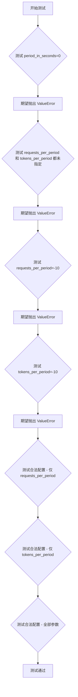
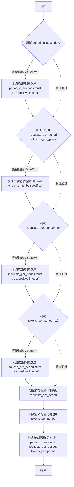

# `graphrag\tests\unit\config\test_rate_limit_config.py` 详细设计文档

这是一个pytest测试文件，用于验证RateLimitConfig类在滑动窗口(Sliding Window)限流配置下的参数校验逻辑，确保在缺少必要参数或参数值不符合要求时正确抛出ValueError异常。

## 整体流程



## 类结构

```
测试模块 (test_rate_limit_config.py)
└── 导入的类 (from graphrag_llm.config)
    ├── RateLimitConfig
    └── RateLimitType
```

## 全局变量及字段


### `graphrag_llm.config.RateLimitConfig`
    
Rate limit configuration class that validates sliding window rate limit parameters

类型：`class`
    


### `graphrag_llm.config.RateLimitType`
    
Enumeration defining rate limit types including SlidingWindow

类型：`enum`
    


### `RateLimitType.SlidingWindow`
    
Sliding window rate limit type constant

类型：`enum member`
    


### `pytest.pytest`
    
Testing framework module for writing and running unit tests

类型：`module`
    
    

## 全局函数及方法


### `test_sliding_window_validation`

测试滑窗限流配置（Sliding Window）在缺少必需参数或参数值无效时，是否能正确抛出验证错误。

参数：
- 该函数无参数

返回值：`None`，无返回值（测试函数）

#### 流程图



#### 带注释源码

```python
def test_sliding_window_validation() -> None:
    """测试滑窗限流配置的参数验证逻辑"""
    
    # 测试用例1: period_in_seconds 为 0 时应抛出验证错误
    # period_in_seconds 必须为正整数
    with pytest.raises(
        ValueError,
        match="period_in_seconds must be a positive integer for Sliding Window rate limit\\.",
    ):
        _ = RateLimitConfig(
            type=RateLimitType.SlidingWindow,
            period_in_seconds=0,          # 无效值：0 不是正整数
            requests_per_period=100,
            tokens_per_period=1000,
        )

    # 测试用例2: 同时缺少 requests_per_period 和 tokens_per_period 时应抛出验证错误
    # 至少需要指定其中之一
    with pytest.raises(
        ValueError,
        match="At least one of requests_per_period or tokens_per_period must be specified for Sliding Window rate limit\\.",
    ):
        _ = RateLimitConfig(
            type=RateLimitType.SlidingWindow,
            # 缺少必需的限流参数
        )

    # 测试用例3: requests_per_period 为负数时 应抛出验证错误
    with pytest.raises(
        ValueError,
        match="requests_per_period must be a positive integer for Sliding Window rate limit\\.",
    ):
        _ = RateLimitConfig(
            type=RateLimitType.SlidingWindow,
            period_in_seconds=60,
            requests_per_period=-10,       # 无效值：负数不是正整数
        )

    # 测试用例4: tokens_per_period 为负数时 应抛出验证错误
    with pytest.raises(
        ValueError,
        match="tokens_per_period must be a positive integer for Sliding Window rate limit\\.",
    ):
        _ = RateLimitConfig(
            type=RateLimitType.SlidingWindow,
            period_in_seconds=60,
            tokens_per_period=-10,        # 无效值：负数不是正整数
        )

    # 测试用例5-7: 有效配置应该通过验证（不抛出异常）
    
    # 有效配置1: 只提供 requests_per_period
    _ = RateLimitConfig(
        type=RateLimitType.SlidingWindow,
        requests_per_period=100,
    )
    
    # 有效配置2: 只提供 tokens_per_period
    _ = RateLimitConfig(
        type=RateLimitType.SlidingWindow,
        tokens_per_period=1000,
    )
    
    # 有效配置3: 提供所有参数
    _ = RateLimitConfig(
        type=RateLimitType.SlidingWindow,
        period_in_seconds=60,
        requests_per_period=100,
        tokens_per_period=1000,
    )
```

## 关键组件


### RateLimitConfig

用于配置速率限制的类，包含速率限制类型、时间段、每时间段请求数、每时间段令牌数等属性。

### RateLimitType

定义速率限制类型的枚举，包含 SlidingWindow（滑动窗口）等类型。

### test_sliding_window_validation

测试函数，用于验证 RateLimitConfig 在配置滑动窗口速率限制时的参数校验逻辑，确保传入无效参数时抛出正确的 ValueError 异常。


## 问题及建议


### 已知问题

- 测试仅覆盖 SlidingWindow 类型的验证逻辑，缺少对其他 RateLimitType（如 TokenBucket、FixedWindow 等）的测试覆盖
- 测试用例仅验证了负面场景（验证失败），缺少对成功创建配置对象的正面测试验证
- 缺少边界条件测试，如 period_in_seconds=1、requests_per_period=1 等最小有效值的测试
- 测试缺少对配置对象实际使用场景的验证，仅测试了构造函数的验证逻辑
- 未测试并发场景下的配置加载和行为
- 测试用例缺乏组织结构，未对不同验证规则进行分组或添加测试类装饰器
- 缺少对 RateLimitConfig 类其他方法（如序列化、反序列化、配置合并等）的测试
- 未验证错误消息的国际化或外部化，错误消息硬编码在测试中

### 优化建议

- 增加对其他 RateLimitType 的测试用例，确保所有类型都能被正确验证
- 添加正面测试用例，验证有效配置能够成功创建并正确保存参数
- 补充边界值测试，覆盖最小有效值和极端大值场景
- 考虑添加集成测试，验证 RateLimitConfig 在实际限流组件中的使用
- 使用 pytest.mark.parametrize 重构重复性测试逻辑，提高可维护性
- 添加测试文档或注释，说明各验证规则的测试意图
- 将测试数据提取为测试 fixture，提高测试的可读性和可复用性

## 其它


### 一段话描述

该测试文件主要用于验证RateLimitConfig配置类的参数校验逻辑，特别是针对SlidingWindow（滑动窗口）类型的速率限制配置，确保period_in_seconds、requests_per_period和tokens_per_period等参数满足业务规则要求。

### 文件的整体运行流程

该测试文件通过pytest框架执行，依次验证SlidingWindow类型速率限制配置的各类验证场景：测试period_in_seconds为0或负数时抛出异常、测试未指定requests_per_period和tokens_per_period时抛出异常、测试requests_per_period为负数时抛出异常、测试tokens_per_period为负数时抛出异常，最后测试合法参数组合可以通过验证。

### 类的详细信息

#### RateLimitConfig类

**类字段：**

- type：RateLimitType类型，表示速率限制的类型
- period_in_seconds：int类型，滑动窗口的时间周期（秒）
- requests_per_period：int类型，每个周期允许的请求数量
- tokens_per_period：int类型，每个周期允许的令牌数量

**类方法：**

- __init__方法：初始化配置对象，接受类型、周期秒数、请求数、令牌数等参数
- validate方法：验证配置参数的合法性和完整性

#### RateLimitType枚举类

**枚举值：**

- SlidingWindow：滑动窗口类型
- FixedWindow：固定窗口类型（推断）

### 全局变量和全局函数

**全局变量：**

- RateLimitConfig：从graphrag_llm.config导入的配置类
- RateLimitType：从graphrag_llm.config导入的速率限制类型枚举

**全局函数：**

- test_sliding_window_validation：测试滑动窗口验证逻辑的主测试函数

### 关键组件信息

- pytest框架：用于测试执行和断言
- pytest.raises：用于验证异常抛出的上下文管理器
- ValueError：验证失败时抛出的异常类型

### 潜在的技术债务或优化空间

1. 测试覆盖不完整：仅测试了SlidingWindow类型，缺少FixedWindow等其他类型的验证测试
2. 边界值测试不足：未测试超长周期、超大数值等极端边界情况
3. 缺少集成测试：未测试该配置在实际速率限制器中的使用效果
4. 错误消息硬编码：验证错误消息分散在代码中，难以统一管理和国际化

### 设计目标与约束

该测试文件的设计目标是确保RateLimitConfig配置类的参数验证逻辑正确可靠，约束条件包括：period_in_seconds必须为正整数、requests_per_period和tokens_per_period至少有一个为正整数、所有数值参数不能为负数。

### 错误处理与异常设计

该模块采用显式验证方式，在配置对象初始化时进行参数校验，验证失败时抛出ValueError异常并附带明确的错误消息，错误消息遵循统一的格式规范，包含参数名称、约束条件和速率限制类型。

### 数据流与状态机

测试数据流为：传入配置参数 → RateLimitConfig构造函数 → validate方法校验 → 通过验证创建对象或抛出ValueError。状态机包含两个状态：初始状态（待验证）和验证完成状态（通过或失败）。

### 外部依赖与接口契约

主要外部依赖包括pytest测试框架和graphrag_llm.config模块。接口契约规定RateLimitConfig接受type、period_in_seconds、requests_per_period、tokens_per_period四个参数，其中type为必需参数，其余为可选参数但需满足验证规则。

### 测试用例设计原则

该测试采用边界值分析法，针对每个验证规则设计正反两类测试用例，确保合法输入能够通过验证，非法输入能够正确抛出预期异常。

    