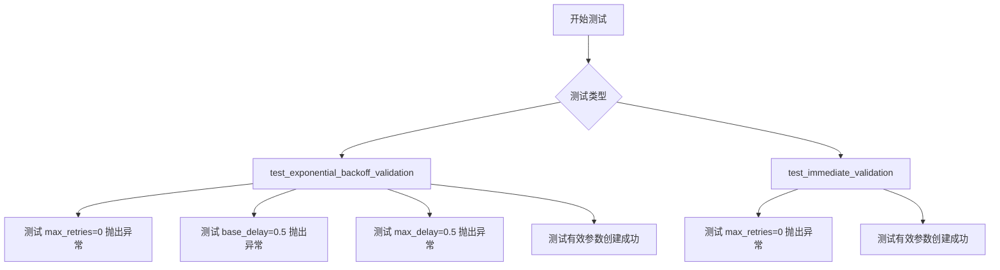
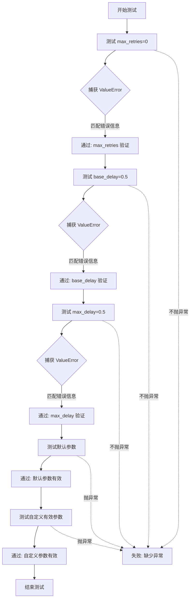
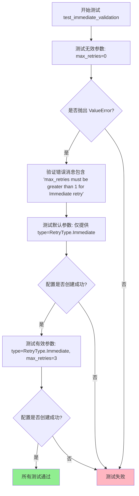
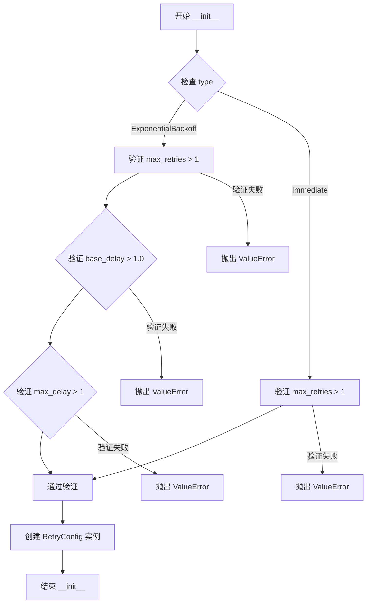
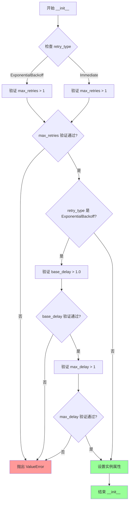

# `graphrag\tests\unit\config\test_retry_config.py` 详细设计文档

这是一个测试重试配置（RetryConfig）加载和验证功能的单元测试文件，测试了指数退避（ExponentialBackoff）和立即重试（Immediate）两种策略的参数验证逻辑。

## 整体流程



## 类结构

```
测试模块
├── test_exponential_backoff_validation (指数退避验证测试)
└── test_immediate_validation (立即重试验证测试)

推断的 config 模块类结构:
RetryConfig (配置类)
└── RetryType (枚举类)
    ├── ExponentialBackoff
    └── Immediate
```

## 全局变量及字段


### `RetryConfig.type`
    
重试策略类型，支持 ExponentialBackoff（指数退避）或 Immediate（立即重试）

类型：`RetryType`
    


### `RetryConfig.max_retries`
    
最大重试次数，必须大于等于 1

类型：`int`
    


### `RetryConfig.base_delay`
    
基础延迟时间（秒），指数退避策略使用，必须大于 1.0

类型：`float`
    


### `RetryConfig.max_delay`
    
最大延迟时间（秒），指数退避策略使用，必须大于 1

类型：`float`
    


### `RetryType.ExponentialBackoff`
    
指数退避重试策略，每次重试延迟时间指数增长

类型：`RetryType`
    


### `RetryType.Immediate`
    
立即重试策略，立即进行下一次重试尝试

类型：`RetryType`
    
    

## 全局函数及方法


### `test_exponential_backoff_validation`

测试指数退避（Exponential Backoff）重试配置的参数验证逻辑，确保当 `max_retries`、`base_delay`、`max_delay` 参数不满足要求时，`RetryConfig` 构造函数能够正确抛出 `ValueError` 异常，并在参数合法时能够成功创建配置对象。

参数：

- （无参数，测试函数）

返回值：`None`，无返回值，仅执行测试验证逻辑

#### 流程图



#### 带注释源码

```python
def test_exponential_backoff_validation() -> None:
    """Test that missing required parameters raise validation errors."""
    # 测试用例1: 验证 max_retries 必须大于等于1
    # 当 max_retries=0 时，应抛出 ValueError，错误信息需匹配指定正则
    with pytest.raises(
        ValueError,
        match="max_retries must be greater than 1 for Exponential Backoff retry\\.",
    ):
        _ = RetryConfig(
            type=RetryType.ExponentialBackoff,
            max_retries=0,
        )

    # 测试用例2: 验证 base_delay 必须大于1.0
    # 当 base_delay=0.5 时，应抛出 ValueError
    with pytest.raises(
        ValueError,
        match="base_delay must be greater than 1\\.0 for Exponential Backoff retry\\.",
    ):
        _ = RetryConfig(
            type=RetryType.ExponentialBackoff,
            base_delay=0.5,
        )

    # 测试用例3: 验证 max_delay 必须大于1
    # 当 max_delay=0.5 时，应抛出 ValueError
    with pytest.raises(
        ValueError,
        match="max_delay must be greater than 1 for Exponential Backoff retry\\.",
    ):
        _ = RetryConfig(
            type=RetryType.ExponentialBackoff,
            max_delay=0.5,
        )

    # 测试用例4: 验证默认参数可以通过验证
    # 使用最小配置（仅指定类型），验证默认值是否满足要求
    _ = RetryConfig(type=RetryType.ExponentialBackoff)

    # 测试用例5: 验证自定义有效参数可以通过验证
    # 使用自定义的有效参数值创建配置对象
    _ = RetryConfig(
        type=RetryType.ExponentialBackoff,
        max_retries=5,
        base_delay=2.0,
        max_delay=30,
    )
```


### `test_immediate_validation`

该测试函数用于验证 `RetryConfig` 在使用 `Immediate` 重试类型时的参数校验逻辑，确保当 `max_retries` 小于等于 1 时抛出 `ValueError`，而在提供有效参数或使用默认参数时能够正常创建配置对象。

参数：此函数无参数

返回值：`None`，测试函数不返回任何值

#### 流程图



#### 带注释源码

```python
def test_immediate_validation() -> None:
    """Test that missing required parameters raise validation errors."""

    # 测试用例1: 验证当 max_retries=0 时，Immediate 类型应抛出 ValueError
    # 错误消息应包含 "max_retries must be greater than 1 for Immediate retry"
    with pytest.raises(
        ValueError,
        match="max_retries must be greater than 1 for Immediate retry\\.",
    ):
        _ = RetryConfig(
            type=RetryType.Immediate,
            max_retries=0,
        )

    # 测试用例2: 验证使用默认参数时配置创建成功
    # Immediate 类型使用默认值 max_retries=3
    # passes validation
    _ = RetryConfig(type=RetryType.Immediate)
    
    # 测试用例3: 验证提供有效参数时配置创建成功
    # 当 max_retries=3 (>1) 时，应通过验证
    _ = RetryConfig(
        type=RetryType.Immediate,
        max_retries=3,
    )
```


### `RetryConfig.__init__`

这是 `RetryConfig` 类的初始化方法，用于配置重试策略的参数。它接收重试类型、最大重试次数、基础延迟和最大延迟等参数，并根据重试类型进行参数验证。

参数：

- `type`：`RetryType`，重试策略类型（如 ExponentialBackoff、Immediate）
- `max_retries`：`int`，最大重试次数，默认为特定值（测试代码显示对于 ExponentialBackoff 和 Immediate 都要求大于 1）
- `base_delay`：`float`，指数退避重试的基础延迟秒数，测试代码显示要求大于 1.0
- `max_delay`：`float`，指数退避重试的最大延迟秒数，测试代码显示要求大于 1

返回值：`RetryConfig`，返回配置对象实例

注意：根据提供的测试代码，无法直接获取 `RetryConfig.__init__` 的完整实现源码。测试文件展示了其使用方式和验证逻辑，但实际的类定义在 `graphrag_llm.config` 模块中，未在此代码片段中提供。以下是基于测试用例反推的带注释源码：

#### 流程图



#### 带注释源码

```python
# 基于测试代码反推的实现逻辑
def __init__(
    self,
    type: RetryType,
    max_retries: int = 1,
    base_delay: float = 1.0,
    max_delay: float = 1.0
) -> None:
    """初始化重试配置。
    
    参数:
        type: 重试策略类型 (ExponentialBackoff 或 Immediate)
        max_retries: 最大重试次数，必须大于 1
        base_delay: 基础延迟秒数，指数退避策略必须大于 1.0
        max_delay: 最大延迟秒数，指数退避策略必须大于 1
        
    异常:
        ValueError: 当参数不满足验证条件时抛出
    """
    # 验证 ExponentialBackoff 类型的参数
    if type == RetryType.ExponentialBackoff:
        if max_retries <= 1:
            raise ValueError(
                "max_retries must be greater than 1 for Exponential Backoff retry."
            )
        if base_delay <= 1.0:
            raise ValueError(
                "base_delay must be greater than 1.0 for Exponential Backoff retry."
            )
        if max_delay <= 1:
            raise ValueError(
                "max_delay must be greater than 1 for Exponential Backoff retry."
            )
    
    # 验证 Immediate 类型的参数
    if type == RetryType.Immediate:
        if max_retries <= 1:
            raise ValueError(
                "max_retries must be greater than 1 for Immediate retry."
            )
    
    # 存储配置参数
    self.type = type
    self.max_retries = max_retries
    self.base_delay = base_delay
    self.max_delay = max_delay
```

#### 注意事项

⚠️ **源码说明**：由于提供的代码仅为测试文件（`test_retry_configuration.py`），未包含 `RetryConfig` 类的实际实现。上述源码为根据测试用例中的使用方式和验证逻辑反推的模拟实现。如需获取准确实现，请参考 `graphrag_llm.config` 模块中的 `RetryConfig` 类定义。


### `RetryConfig.__init__`

描述：该方法是 `RetryConfig` 类的构造函数，负责初始化重试配置参数，并根据不同的重试类型（ExponentialBackoff 或 Immediate）进行参数验证，确保必填参数满足业务需求。

参数：

- `type`：`RetryType`，重试策略的类型，必填参数，指定使用哪种重试策略
- `max_retries`：`int`，可选参数，最大重试次数，默认为某个默认值
- `base_delay`：`float`，可选参数，基础延迟时间（秒），仅对 ExponentialBackoff 有效
- `max_delay`：`float`，可选参数，最大延迟时间（秒），仅对 ExponentialBackoff 有效

返回值：`None`，该方法无返回值，主要作用是初始化实例属性并执行验证

#### 流程图



#### 带注释源码

```python
def __init__(
    self,
    type: RetryType,  # 重试策略类型，必填
    max_retries: int = DEFAULT_MAX_RETRIES,  # 最大重试次数，可选，默认值由常量定义
    base_delay: float = DEFAULT_BASE_DELAY,  # 基础延迟时间，可选，默认值由常量定义
    max_delay: float = DEFAULT_MAX_DELAY,  # 最大延迟时间，可选，默认值由常量定义
) -> None:
    """初始化 RetryConfig 并验证参数有效性。
    
    根据不同的重试类型执行相应的验证规则：
    - ExponentialBackoff: 需要验证 max_retries、base_delay、max_delay
    - Immediate: 只需验证 max_retries
    
    Args:
        type: 重试策略类型，决定了验证规则的具体执行
        max_retries: 最大重试次数，必须大于1
        base_delay: 指数退避的基础延迟，必须大于1.0秒
        max_delay: 最大延迟上限，必须大于1秒
        
    Raises:
        ValueError: 当必填参数不满足对应重试类型的验证条件时抛出
    """
    # 验证最大重试次数
    if type == RetryType.ExponentialBackoff:
        # 指数退避策略要求 max_retries 必须大于 1
        if max_retries <= 1:
            raise ValueError(
                "max_retries must be greater than 1 for Exponential Backoff retry."
            )
    elif type == RetryType.Immediate:
        # 立即重试策略要求 max_retries 必须大于 1
        if max_retries <= 1:
            raise ValueError(
                "max_retries must be greater than 1 for Immediate retry."
            )
    
    # 仅对指数退避策略验证延迟参数
    if type == RetryType.ExponentialBackoff:
        # 验证基础延迟必须大于 1.0 秒
        if base_delay <= 1.0:
            raise ValueError(
                "base_delay must be greater than 1.0 for Exponential Backoff retry."
            )
        # 验证最大延迟必须大于 1 秒
        if max_delay <= 1:
            raise ValueError(
                "max_delay must be greater than 1 for Exponential Backoff retry."
            )
    
    # 设置实例属性，保存配置参数
    self.type = type
    self.max_retries = max_retries
    self.base_delay = base_delay
    self.max_delay = max_delay
```

## 关键组件


### RetryConfig

用于配置重试策略的配置类，支持多种重试类型（如指数退避Immediate）的参数验证和初始化。

### RetryType

定义重试策略类型的枚举，包含 ExponentialBackoff（指数退避）和 Immediate（立即重试）等类型。

### 参数验证逻辑

对 ExponentialBackoff 类型的 max_retries、base_delay、max_delay 参数进行数值范围验证，确保满足最小值要求。

### 参数验证逻辑

对 Immediate 类型的 max_retries 参数进行数值范围验证，确保大于等于1。

### test_exponential_backoff_validation

测试 ExponentialBackoff 重试配置的正确性验证，包括必填参数缺失时抛出 ValueError 异常，以及有效参数能够通过验证。

### test_immediate_validation

测试 Immediate 重试配置的正确性验证，包括必填参数缺失时抛出 ValueError 异常，以及有效参数能够通过验证。


## 问题及建议


### 已知问题

-   **测试覆盖不完整**：仅测试了 `ExponentialBackoff` 和 `Immediate` 两种重试类型，未覆盖 `RetryType` 枚举中可能存在的其他类型
-   **正向测试缺少断言**：成功创建 `RetryConfig` 的测试用例（如 `_ = RetryConfig(type=RetryType.ExponentialBackoff)`）未验证对象的实际属性值是否正确设置，无法确保配置参数被正确解析和应用
-   **验证逻辑可能过于严格**：`max_retries > 1` 的要求意味着不允许单次重试（重试1次），这在某些场景下可能不合理；`base_delay > 1.0` 的要求也排除了小于1秒的延迟配置
-   **边界情况未测试**：未测试 `base_delay > max_delay` 的情况（如 base_delay=10.0, max_delay=5.0）、负数值、以及 `max_retries=1` 的边界值
-   **测试可读性不足**：使用 `_ =` 忽略返回值的方式不如显式变量清晰；缺少对测试意图的详细说明文档

### 优化建议

-   **补充正向测试断言**：在成功创建配置后，添加断言验证关键属性，例如 `assert config.max_retries == 5`
-   **扩展测试覆盖**：添加对其他 `RetryType` 枚举值的测试，以及边界值和非法组合的测试
-   **考虑放宽验证条件**：根据实际业务需求，评估 `max_retries > 1` 和 `base_delay > 1.0` 的限制是否合理，或提供更灵活的验证逻辑
-   **添加集成测试**：考虑编写测试验证 `RetryConfig` 在实际重试场景中的行为是否符合预期

## 其它


### 设计目标与约束

验证 RetryConfig 类在不同重试策略下的参数校验逻辑，确保配置参数满足业务需求和安全约束。测试代码聚焦于边界条件验证，包括 max_retries、base_delay、max_delay 等关键参数的合法性和有效性检查。

### 错误处理与异常设计

测试用例覆盖了参数校验失败时的异常抛出场景。通过 pytest.raises 捕获 ValueError 异常，并验证错误消息的准确性。异常设计采用前置校验模式，在 RetryConfig 初始化时立即进行参数验证，避免无效配置进入运行阶段。

### 数据流与状态机

测试代码本身不涉及运行时数据流，主要关注配置对象的初始化状态转换。RetryConfig 对象在构造时根据 RetryType 类型进入不同的验证分支：ExponentialBackoff 类型需要额外验证 base_delay 和 max_delay 参数，而 Immediate 类型仅需验证 max_retries 参数。

### 外部依赖与接口契约

测试依赖于 graphrag_llm.config 模块中的 RetryConfig 和 RetryType 类。RetryConfig 预期提供 type、max_retries、base_delay、max_delay 等配置属性。测试代码与被测模块之间通过 pytest 框架定义的接口契约进行交互：合法的配置参数应成功创建 RetryConfig 实例，而不合法的参数应抛出匹配特定错误消息的 ValueError 异常。

### 测试覆盖范围

当前测试覆盖了 ExponentialBackoff 和 Immediate 两种重试策略的参数校验场景。测试验证了参数边界条件：max_retries 必须大于 1，base_delay 必须大于 1.0，max_delay 必须大于 1。同时也验证了默认值场景下的正确行为，确保使用默认参数时配置能够成功创建。

### 边界条件分析

测试聚焦于最小边界值和零值的校验。max_retries=0 触发验证失败，base_delay=0.5 和 max_delay=0.5 均不满足大于 1.0 或大于 1 的条件。这些边界测试确保 RetryConfig 能够有效防止无效配置被创建，从而保证重试机制的正确性。


    