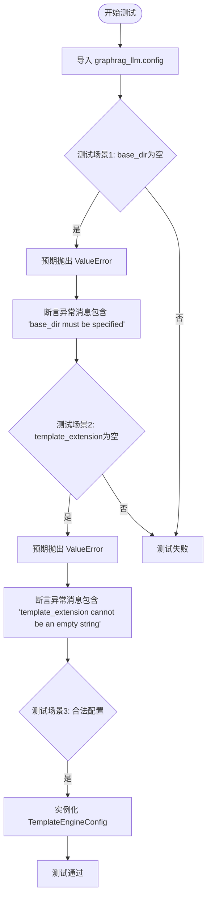
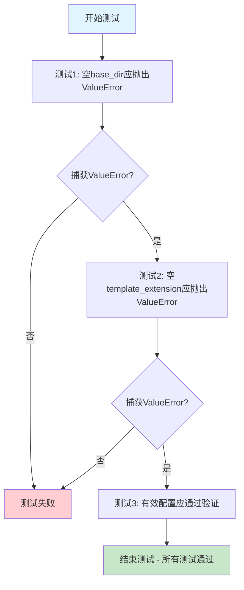
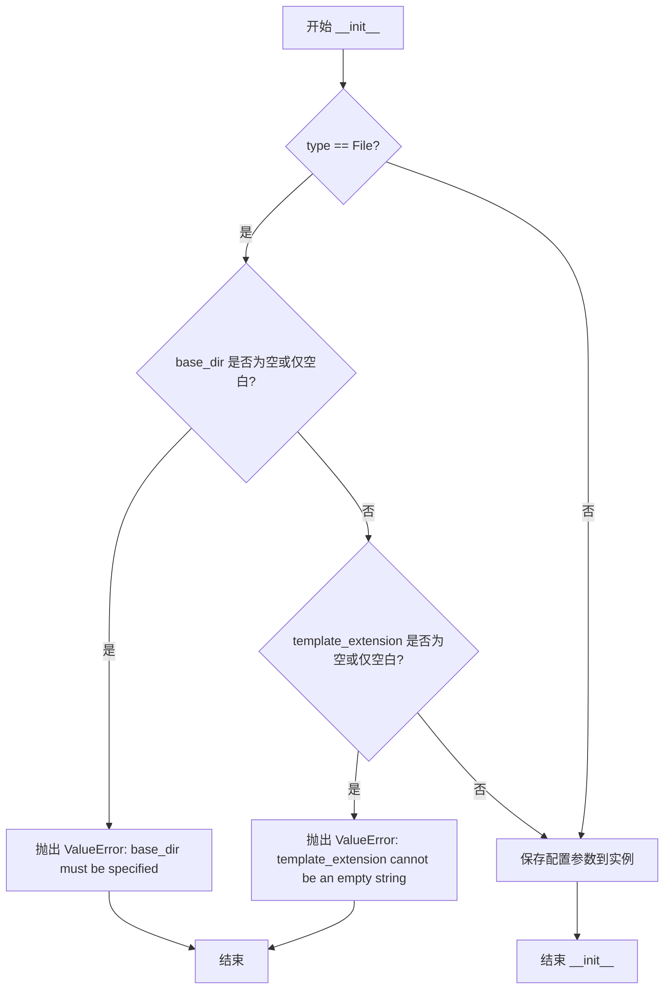

# `graphrag\tests\unit\config\test_template_engine_config.py` 详细设计文档

这是一个针对模板引擎配置类的单元测试文件，通过 pytest 验证了配置参数（base_dir 和 template_extension）在为空或无效时是否能正确抛出 ValueError，并在参数合法时能成功实例化对象。

## 整体流程



## 类结构

```
TestModule (测试模块)
├── test_template_engine_config_validation (测试函数)
│
graphrag_llm.config (被测模块 - 推测)
├── TemplateEngineConfig (配置类)
│   ├── TemplateEngineType (枚举类型)
│   └── TemplateManagerType (枚举类型)
```

## 全局变量及字段


### `TemplateEngineConfig.type`
    
模板引擎的类型（如 Jinja）

类型：`TemplateEngineType`
    


### `TemplateEngineConfig.template_manager`
    
模板管理器的类型（如 File）

类型：`TemplateManagerType`
    


### `TemplateEngineConfig.base_dir`
    
模板文件的基础目录路径

类型：`str`
    


### `TemplateEngineConfig.template_extension`
    
模板文件的扩展名

类型：`str`
    
    

## 全局函数及方法


### `test_template_engine_config_validation`

Test that missing required parameters raise validation errors.

参数：

- 无参数

返回值：`None`，测试函数不返回值，仅验证异常抛出

#### 流程图



#### 带注释源码

```python
def test_template_engine_config_validation() -> None:
    """Test that missing required parameters raise validation errors."""

    # 测试1: 验证当base_dir为空字符串时,文件型模板管理器应抛出ValueError
    with pytest.raises(
        ValueError,
        match="base_dir must be specified for file-based template managers\\.",
    ):
        _ = TemplateEngineConfig(
            type=TemplateEngineType.Jinja,
            template_manager=TemplateManagerType.File,
            base_dir="   ",  # 空格字符串,应被视为无效
        )

    # 测试2: 验证当template_extension为空字符串时,文件型模板管理器应抛出ValueError
    with pytest.raises(
        ValueError,
        match="template_extension cannot be an empty string for file-based template managers\\.",
    ):
        _ = TemplateEngineConfig(
            type=TemplateEngineType.Jinja,
            template_manager=TemplateManagerType.File,
            base_dir="./templates",
            template_extension="   ",  # 空格字符串,应被视为无效
        )

    # 测试3: 验证有效配置通过验证,不抛出异常
    _ = TemplateEngineConfig(
        type=TemplateEngineType.Jinja,
        template_manager=TemplateManagerType.File,
        base_dir="./templates",
        template_extension=".jinja",  # 有效的文件扩展名
    )
```


### `TemplateEngineConfig.__init__`

构造函数，负责初始化配置参数并进行业务逻辑验证（检查 base_dir 和 template_extension 是否为空）。

参数：

-  `self`：无，Python 实例方法的隐式参数
-  `type`：`TemplateEngineType`，模板引擎类型（如 Jinja 等）
-  `template_manager`：`TemplateManagerType`，模板管理器类型（File 或其他）
-  `base_dir`：`str`，模板文件的根目录路径，用于文件型模板管理器
-  `template_extension`：`str`，模板文件扩展名，用于文件型模板管理器

返回值：`None`，无返回值（构造函数）

#### 流程图



#### 带注释源码

```python
def __init__(
    self,
    type: TemplateEngineType,
    template_manager: TemplateManagerType,
    base_dir: str = None,
    template_extension: str = None,
) -> None:
    """
    初始化模板引擎配置。
    
    参数:
        type: 模板引擎类型（e.g. TemplateEngineType.Jinja）
        template_manager: 模板管理器类型（e.g. TemplateManagerType.File）
        base_dir: 模板文件的根目录路径（仅 File 类型需要）
        template_extension: 模板文件扩展名（仅 File 类型需要）
    
    异常:
        ValueError: 当 template_manager 为 File 类型但 base_dir 为空时抛出
        ValueError: 当 template_manager 为 File 类型但 template_extension 为空时抛出
    """
    # 业务逻辑验证：当使用文件型模板管理器时，base_dir 不能为空
    if template_manager == TemplateManagerType.File:
        # 检查 base_dir 是否为空或仅包含空白字符
        if not base_dir or not base_dir.strip():
            raise ValueError(
                "base_dir must be specified for file-based template managers."
            )
        
        # 检查 template_extension 是否为空或仅包含空白字符
        if not template_extension or not template_extension.strip():
            raise ValueError(
                "template_extension cannot be an empty string for file-based template managers."
            )
    
    # 保存配置参数到实例
    self.type = type
    self.template_manager = template_manager
    self.base_dir = base_dir
    self.template_extension = template_extension
```


## 关键组件


### TemplateEngineConfig

用于配置模板引擎的类，包含引擎类型、模板管理器类型、基础目录和模板文件扩展名等属性，并提供验证功能确保配置的有效性。

### TemplateEngineType

枚举类型，定义了支持的模板引擎类型（如 Jinja），用于指定使用哪种模板引擎进行模板渲染。

### TemplateManagerType

枚举类型，定义了模板管理器的类型（如 File），用于指定如何加载和管理模板文件。

### 配置验证逻辑

负责验证 TemplateEngineConfig 的必填字段，当 base_dir 为空字符串时抛出"base_dir must be specified for file-based template managers."错误，当 template_extension 为空字符串时抛出"template_extension cannot be an empty string for file-based template managers."错误。

### pytest 测试框架

使用 pytest 的 raises 上下文管理器来验证配置验证逻辑是否正确抛出预期的 ValueError 异常。


## 问题及建议


### 已知问题

-   **验证逻辑与测试数据不完全匹配**：测试中使用 `"   "` (三个空格) 作为无效输入，但错误消息是 "base_dir must be specified"，这暗示应该检查空字符串或空白字符。实际验证逻辑是否使用 `.strip()` 检查空字符串不够明确，可能导致预期外的行为。
-   **测试覆盖不足**：缺少对以下边界情况的测试：`base_dir` 为空字符串 `""`、`template_extension` 为空字符串 `""`、参数为 `None` 的情况。
-   **测试断言不够精确**：错误消息使用正则表达式匹配，但只验证了部分场景，没有验证完整的验证规则集合。

### 优化建议

-   增加边界测试用例：添加 `base_dir=""`、`template_extension=""`、`base_dir=None` 等情况的测试，确保验证逻辑全面覆盖。
-   统一错误消息规范：确保错误消息准确反映验证失败的具体原因（如"仅包含空白字符"vs"为空字符串"），并与实际验证逻辑保持一致。
-   添加参数类型验证测试：测试传入无效类型（如整数、列表等）时的错误处理。
-   考虑添加正向测试用例：验证有效配置可以通过验证，并检查返回的配置对象属性是否正确。

## 其它


### 设计目标与约束

本文档描述的代码是一个pytest测试单元，用于验证 `TemplateEngineConfig` 配置类的参数校验功能。测试确保在使用文件型模板管理器时，必须提供有效的 `base_dir` 和 `template_extension` 参数，且这些参数不能为空字符串。测试约束包括：仅测试验证逻辑，不测试实际模板渲染功能；使用 pytest 框架和 `pytest.raises` 上下文管理器进行异常断言。

### 错误处理与异常设计

代码通过 `pytest.raises(ValueError, match=...)` 捕获并验证 `TemplateEngineConfig` 构造时抛出的 `ValueError` 异常。错误消息使用正则表达式匹配：`"base_dir must be specified for file-based template managers\."` 和 `"template_extension cannot be an empty string for file-based template managers\."`。测试验证了两种验证失败场景：空字符串和仅包含空白字符的字符串。有效的配置构造不抛出异常，表示验证通过。

### 外部依赖与接口契约

代码依赖以下外部组件：
- `pytest`：测试框架，用于编写和运行测试用例
- `graphrag_llm.config`：被测模块，包含 `TemplateEngineConfig`、`TemplateEngineType`、`TemplateManagerType` 三个配置类/枚举

接口契约方面：
- `TemplateEngineConfig` 构造函数接收 `type`（模板引擎类型）、`template_manager`（模板管理器类型）、`base_dir`（模板目录路径）、`template_extension`（模板文件扩展名）四个参数
- 当 `template_manager` 为 `File` 时，`base_dir` 和 `template_extension` 必须为非空字符串
- `TemplateEngineType` 枚举至少包含 `Jinja` 值
- `TemplateManagerType` 枚举至少包含 `File` 值

### 安全性考虑

测试代码本身不涉及敏感数据处理，但验证逻辑确保配置参数不为空，有助于防止因配置错误导致的路径遍历或模板加载失败等安全问题。测试使用 "./templates" 和 ".jinja" 作为示例路径，不涉及实际文件系统操作。

### 性能要求

测试为单元测试，性能要求为快速执行。测试不涉及网络请求、数据库操作或大量计算，预计执行时间在毫秒级别。

### 兼容性考虑

测试代码兼容 Python 3.x（具体版本取决于项目要求）。`graphrag_llm` 库版本需与测试代码兼容，确保 `TemplateEngineConfig` 类及其枚举值存在。pytest 版本需支持 `pytest.raises` 的 `match` 参数（pytest 3.0+）。

### 测试策略

采用黑盒测试方法，仅通过公共接口验证行为。测试覆盖两种验证失败场景和一种有效配置场景。测试策略包括：
- 边界值测试：空字符串、空白字符串
- 正向测试：有效配置通过验证
- 异常消息验证：确保错误信息准确描述问题

### 配置管理

测试涉及的配置项：
- `type`：模板引擎类型（`TemplateEngineType.Jinja`）
- `template_manager`：模板管理器类型（`TemplateManagerType.File`）
- `base_dir`：模板文件目录（"./templates" 或 "   "）
- `template_extension`：模板文件扩展名（".jinja" 或 "   "）

配置验证规则由 `TemplateEngineConfig` 类内部控制，测试验证这些规则的有效性。

    