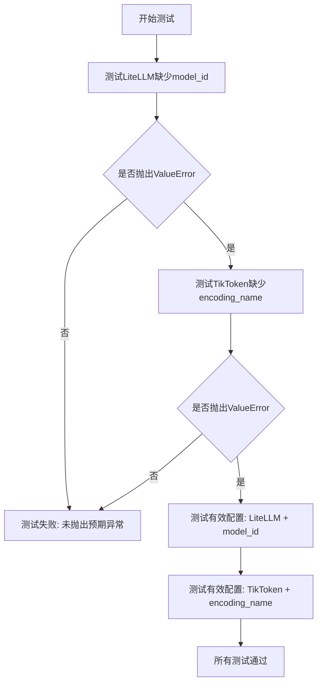
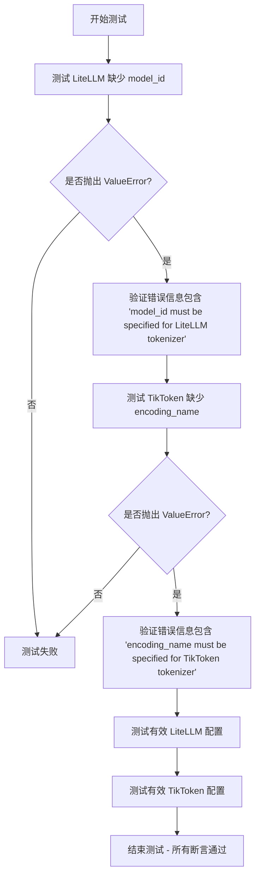
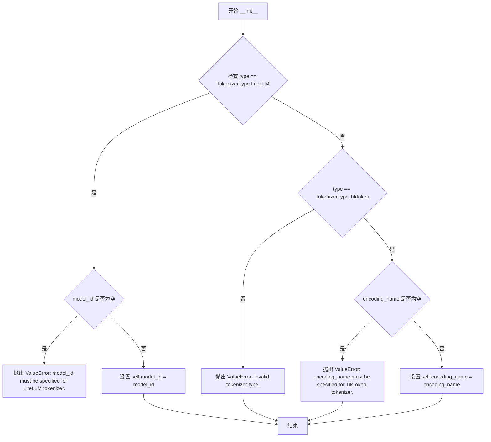

# `graphrag\tests\unit\config\test_tokenizer_config.py` 详细设计文档

这是一个测试文件，用于验证TokenizerConfig配置类在初始化时能够正确校验必需参数，当LiteLLM类型缺少model_id或TikToken类型缺少encoding_name时抛出ValueError异常，确保tokenizer配置的完整性和有效性。

## 整体流程



## 类结构

```
test_tokenizer_config.py (测试模块)
├── TokenizerConfig (被测类 - 来自 graphrag_llm.config)
└── TokenizerType (枚举 - 来自 graphrag_llm.config)
```

## 全局变量及字段


### `TokenizerType`
    
Enumeration defining tokenizer types (LiteLLM or Tiktoken)

类型：`Enum`
    


### `TokenizerConfig`
    
Configuration class for tokenizer settings with type, model_id, and encoding_name fields

类型：`Class`
    


### `TokenizerConfig.type`
    
The tokenizer type configuration specifying whether to use LiteLLM or Tiktoken

类型：`TokenizerType`
    


### `TokenizerConfig.model_id`
    
The model identifier required for LiteLLM tokenizer (e.g., 'openai/gpt-4o')

类型：`str`
    


### `TokenizerConfig.encoding_name`
    
The encoding name required for TikToken tokenizer (e.g., 'o200k-base')

类型：`str`
    


### `TokenizerType.LiteLLM`
    
Enum member representing the LiteLLM tokenizer type

类型：`TokenizerType`
    


### `TokenizerType.Tiktoken`
    
Enum member representing the TikToken tokenizer type

类型：`TokenizerType`
    
    

## 全局函数及方法


### `test_litellm_tokenizer_validation`

该测试函数用于验证 `TokenizerConfig` 在缺少必要参数时能够正确抛出 `ValueError` 异常，并确保有效配置能够通过验证。

参数： 无

返回值：`None`，作为 pytest 测试函数无返回值

#### 流程图



#### 带注释源码

```python
# 导入 pytest 用于测试框架
import pytest
# 从 graphrag_llm.config 导入配置类和枚举类型
from graphrag_llm.config import TokenizerConfig, TokenizerType


def test_litellm_tokenizer_validation() -> None:
    """Test that missing required parameters raise validation errors."""

    # ============================================================
    # 测试 1: 验证 LiteLLM tokenizer 缺少 model_id 时抛出异常
    # ============================================================
    with pytest.raises(
        ValueError,
        match="model_id must be specified for LiteLLM tokenizer\\.",
    ):
        # 尝试创建缺少 model_id 的 LiteLLM 配置，期望抛出 ValueError
        _ = TokenizerConfig(
            type=TokenizerType.LiteLLM,
            model_id="",  # 空字符串，应触发验证错误
        )

    # ============================================================
    # 测试 2: 验证 TikToken tokenizer 缺少 encoding_name 时抛出异常
    # ============================================================
    with pytest.raises(
        ValueError,
        match="encoding_name must be specified for TikToken tokenizer\\.",
    ):
        # 尝试创建缺少 encoding_name 的 TikToken 配置，期望抛出 ValueError
        _ = TokenizerConfig(
            type=TokenizerType.Tiktoken,
            encoding_name="",  # 空字符串，应触发验证错误
        )

    # ============================================================
    # 测试 3: 验证有效的 LiteLLM 配置能够通过验证
    # ============================================================
    # 传入有效的 model_id，应该不抛出异常
    _ = TokenizerConfig(
        type=TokenizerType.LiteLLM,
        model_id="openai/gpt-4o",
    )

    # ============================================================
    # 测试 4: 验证有效的 TikToken 配置能够通过验证
    # ============================================================
    # 传入有效的 encoding_name，应该不抛出异常
    _ = TokenizerConfig(
        type=TokenizerType.Tiktoken,
        encoding_name="o200k-base",
    )
```


### `TokenizerConfig.__init__`

该方法用于初始化 TokenizerConfig 实例，根据传入的 tokenizer 类型（LiteLLM 或 TikToken）验证并设置相应的模型 ID 或编码名称。

参数：

-  `type`：`TokenizerType`，tokenizer 的类型，枚举值包括 LiteLLM 和 Tiktoken
-  `model_id`：`str`，当 type 为 LiteLLM 时必须提供，表示模型标识符
-  `encoding_name`：`str`，当 type 为 Tiktoken 时必须提供，表示编码名称

返回值：`None`，该方法无返回值，直接修改实例属性

#### 流程图



#### 带注释源码

```python
def __init__(
    self,
    type: TokenizerType,
    model_id: str = "",
    encoding_name: str = "",
) -> None:
    """初始化 TokenizerConfig 实例。
    
    根据 tokenizer 类型验证并设置相应的配置参数。
    
    Args:
        type: tokenizer 的类型，枚举值包括 LiteLLM 和 Tiktoken
        model_id: 当 type 为 LiteLLM 时必须提供，表示模型标识符
        encoding_name: 当 type 为 Tiktoken 时必须提供，表示编码名称
    
    Raises:
        ValueError: 当 type 为 LiteLLM 但 model_id 为空时
        ValueError: 当 type 为 Tiktoken 但 encoding_name 为空时
    """
    # 检查 tokenizer 类型
    if type == TokenizerType.LiteLLM:
        # LiteLLM 类型需要 model_id
        if not model_id:
            raise ValueError(
                "model_id must be specified for LiteLLM tokenizer."
            )
        self.model_id = model_id
    elif type == TokenizerType.Tiktoken:
        # TikToken 类型需要 encoding_name
        if not encoding_name:
            raise ValueError(
                "encoding_name must be specified for TikToken tokenizer."
            )
        self.encoding_name = encoding_name
    else:
        raise ValueError(f"Invalid tokenizer type: {type}")
    
    # 存储 tokenizer 类型
    self.type = type
```

#### 补充说明

由于提供的代码是测试文件，未包含 `TokenizerConfig` 类的实际源码。上述文档是基于测试用例 `test_litellm_tokenizer_validation` 的行为推断得出的。实际实现可能包含更多字段或验证逻辑。


## 关键组件


### 核心功能概述

该测试文件验证了 TokenizerConfig 配置类的参数校验逻辑，确保 LiteLLM 和 TikToken 两种 tokenizer 类型在缺少必需参数时能够正确抛出 ValidationError，同时验证有效配置能够通过校验。

### 文件运行流程

1. 测试函数 `test_litellm_tokenizer_validation` 开始执行
2. 使用 `pytest.raises` 捕获第一个预期异常：空 model_id 的 LiteLLM 配置应抛出 ValueError
3. 使用 `pytest.raises` 捕获第二个预期异常：空 encoding_name 的 TikToken 配置应抛出 ValueError
4. 创建两个有效配置对象，验证不会抛出异常
5. 测试完成，所有断言通过

### 关键组件信息

### TokenizerConfig

用于配置不同 tokenizer 类型的参数容器，支持 LiteLLM 和 TikToken 两种类型，根据类型验证相应的必需参数。

### TokenizerType

枚举类型，定义了支持的 tokenizer 类别，包括 LiteLLM 和 Tiktoken 两个枚举值。

### test_litellm_tokenizer_validation

测试函数，验证 TokenizerConfig 对不同 tokenizer 类型的参数校验逻辑是否符合预期。

### 潜在技术债务与优化空间

1. **测试覆盖不完整**：未测试 TokenizerType 的其他可能值或边界情况
2. **错误消息硬编码**：错误匹配字符串直接写在测试中，建议提取为常量
3. **缺乏集成测试**：仅测试了配置校验，未测试实际 tokenizer 实例化

### 其它项目

#### 设计目标与约束

- 确保不同 tokenizer 类型必须提供对应的必需参数
- model_id 仅对 LiteLLM 类型必需
- encoding_name 仅对 TikToken 类型必需

#### 错误处理与异常设计

- 使用 ValueError 作为验证异常类型
- 错误消息包含具体的参数名称和类型提示

#### 外部依赖

- pytest 测试框架
- graphrag_llm.config 模块中的 TokenizerConfig 和 TokenizerType


## 问题及建议


### 已知问题

-   **测试覆盖不全面**：仅测试了空字符串 `""` 的验证场景，未测试 `None` 值的处理，存在边界条件漏洞
-   **缺少负向测试场景**：未测试无效的 `model_id` 或 `encoding_name` 格式（如特殊字符、过长字符串等）
-   **未覆盖所有 TokenizerType**：当前仅测试了 `LiteLLM` 和 `Tiktoken` 两种类型，其他可能的 tokenizer 类型未被验证
-   **缺少正向验证测试**：仅在最后简单构造了有效配置，未对配置对象的实际属性值进行断言验证
-   **测试用例粒度较粗**：测试函数 `test_litellm_tokenizer_validation` 混合了多种验证场景，不利于精确定位失败原因

### 优化建议

-   补充 `None` 值的验证测试，确保空值和空字符串处理一致
-   添加参数类型错误（如传入整数、列表等）的异常测试
-   为不同 tokenizer 类型拆分独立测试函数，提高可维护性
-   在正向测试中添加断言，验证 `model_id` 和 `encoding_name` 被正确赋值
-   考虑添加集成测试，验证配置在实际 tokenizer 初始化时的行为
-   添加性能基准测试，评估配置解析开销

## 其它


### 设计目标与约束

本测试代码的设计目标是验证 TokenizerConfig 配置类的参数验证逻辑，确保在使用 LiteLLM 和 Tiktoken 两种 tokenizer 类型时，必须提供相应的必需参数（model_id 或 encoding_name）。约束条件包括：model_id 不能为空字符串、encoding_name 不能为空字符串、仅允许特定的 TokenizerType 枚举值。

### 错误处理与异常设计

测试代码使用了 pytest.raises 来验证参数验证失败时抛出 ValueError 异常，错误消息包含具体的验证规则描述（如 "model_id must be specified for LiteLLM tokenizer."）。这种设计确保了配置错误能够被早期捕获并提供清晰的错误信息，便于开发者定位问题。异常设计遵循了"fail fast"原则，在配置对象构造时立即进行验证。

### 外部依赖与接口契约

测试代码依赖以下外部组件：
- **pytest**：用于测试框架和异常断言
- **graphrag_llm.config.TokenizerConfig**：被测试的配置类
- **graphrag_llm.config.TokenizerType**：tokenizer 类型枚举

接口契约规定：TokenizerConfig 构造函数接受 type、model_id、encoding_name 等参数，其中 type 为必需参数，model_id 和 encoding_name 根据 type 类型为条件必需参数。

### 数据流与状态机

配置对象的数据流如下：用户创建 TokenizerConfig 实例时，输入参数首先经过验证逻辑检查；对于 LiteLLM 类型，model_id 必须非空；对于 Tiktoken 类型，encoding_name 必须非空。验证通过后创建配置对象，验证失败则抛出 ValueError。状态机包含两个有效状态（配置有效）和一个无效状态（验证失败异常）。

### 安全性考虑

当前测试代码未涵盖安全性测试场景。建议增加以下安全测试：空字符串验证、特殊字符处理、超长参数值处理、SQL 注入/命令注入防护测试（虽然当前参数不太可能涉及）。

### 性能考虑

当前验证逻辑简单，性能开销较低。潜在优化点：对于大量配置创建场景，可考虑缓存验证结果；验证逻辑可考虑延迟执行（懒验证）以提高对象创建性能。

### 测试覆盖度分析

当前测试覆盖了核心验证逻辑，但存在以下覆盖缺口：
- 边界条件测试：空字符串、None 值、超长字符串
- 负面测试：无效的 TokenizerType 值
- 组合测试：多种参数同时缺失的情况
- 性能测试：大量配置对象创建的验证开销

### 可扩展性设计

当前设计支持通过枚举扩展新的 tokenizer 类型。扩展建议：新增 tokenizer 类型时需在验证逻辑中添加对应分支，并编写相应测试用例。配置类可考虑使用策略模式或注册机制来动态支持新的 tokenizer 类型。

### 配置管理策略

TokenizerConfig 采用声明式配置模式，参数在对象构造时指定。优点：配置与使用解耦、验证时机明确。缺点：无法支持动态配置变更。建议对于需要动态修改配置的场景，考虑添加配置更新方法或使用不可变配置对象配合配置构建器模式。


    