# `graphrag\tests\unit\config\utils.py` 详细设计文档

这是一个GraphRag配置验证模块，定义了默认的模型配置（完成模型和嵌入模型），并提供了一系列断言函数用于验证各种配置对象（重试配置、速率限制配置、指标配置、模型配置、向量存储配置、报告配置、存储配置、缓存配置、输入配置、文本嵌入配置、分块配置、快照配置、图提取配置、图NLP配置、图剪枝配置、描述摘要配置、社区报告配置、声明提取配置、聚类图配置、本地搜索配置、全局搜索配置、DRIFT搜索配置和基本搜索配置）的属性是否符合预期。

## 整体流程

```mermaid
graph TD
    A[开始] --> B[定义默认配置常量]
    B --> C[定义get_default_graphrag_config函数]
    C --> D[定义各类型断言函数]
    D --> E[assert_retry_configs - 验证重试配置]
    E --> F[assert_rate_limit_configs - 验证速率限制配置]
    F --> G[assert_metrics_configs - 验证指标配置]
    G --> H[assert_model_configs - 验证模型配置]
    H --> I[assert_vector_store_configs - 验证向量存储配置]
    I --> J[assert_reporting_configs - 验证报告配置]
    J --> K[assert_storage_config - 验证存储配置]
    K --> L[assert_cache_configs - 验证缓存配置]
    L --> M[assert_input_configs - 验证输入配置]
    M --> N[assert_text_embedding_configs - 验证文本嵌入配置]
    N --> O[assert_chunking_configs - 验证分块配置]
    O --> P[assert_snapshots_configs - 验证快照配置]
    P --> Q[assert_extract_graph_configs - 验证图提取配置]
    Q --> R[assert_text_analyzer_configs - 验证文本分析器配置]
    R --> S[assert_extract_graph_nlp_configs - 验证图NLP配置]
    S --> T[assert_prune_graph_configs - 验证图剪枝配置]
    T --> U[assert_summarize_descriptions_configs - 验证描述摘要配置]
    U --> V[assert_community_reports_configs - 验证社区报告配置]
    V --> W[assert_extract_claims_configs - 验证声明提取配置]
    W --> X[assert_cluster_graph_configs - 验证聚类图配置]
    X --> Y[assert_local_search_configs - 验证本地搜索配置]
    Y --> Z[assert_global_search_configs - 验证全局搜索配置]
    Z --> AA[assert_drift_search_configs - 验证DRIFT搜索配置]
    AA --> AB[assert_basic_search_configs - 验证基本搜索配置]
    AB --> AC[assert_graphrag_configs - 综合验证所有GraphRag配置]
```

## 类结构

```
模块: graphrag.config.assertions (本文件)
├── 全局常量
│   ├── FAKE_API_KEY
│   ├── DEFAULT_COMPLETION_MODEL_CONFIG
│   ├── DEFAULT_EMBEDDING_MODEL_CONFIG
│   ├── DEFAULT_COMPLETION_MODELS
│   └── DEFAULT_EMBEDDING_MODELS
└── 函数
    ├── get_default_graphrag_config()
    ├── assert_retry_configs()
    ├── assert_rate_limit_configs()
    ├── assert_metrics_configs()
    ├── assert_model_configs()
    ├── assert_vector_store_configs()
    ├── assert_reporting_configs()
    ├── assert_storage_config()
    ├── assert_cache_configs()
    ├── assert_input_configs()
    ├── assert_text_embedding_configs()
    ├── assert_chunking_configs()
    ├── assert_snapshots_configs()
    ├── assert_extract_graph_configs()
    ├── assert_text_analyzer_configs()
    ├── assert_extract_graph_nlp_configs()
    ├── assert_prune_graph_configs()
    ├── assert_summarize_descriptions_configs()
    ├── assert_community_reports_configs()
    ├── assert_extract_claims_configs()
    ├── assert_cluster_graph_configs()
    ├── assert_local_search_configs()
    ├── assert_global_search_configs()
    ├── assert_drift_search_configs()
    ├── assert_basic_search_configs()
    └── assert_graphrag_configs()
```

## 全局变量及字段


### `FAKE_API_KEY`
    
用于测试环境的伪造API密钥，避免在测试中使用真实API密钥

类型：`str`
    


### `DEFAULT_COMPLETION_MODEL_CONFIG`
    
默认的完成模型配置字典，包含API密钥、模型名称和模型提供者信息

类型：`dict`
    


### `DEFAULT_EMBEDDING_MODEL_CONFIG`
    
默认的嵌入模型配置字典，包含API密钥、模型名称和模型提供者信息

类型：`dict`
    


### `DEFAULT_COMPLETION_MODELS`
    
默认的完成模型注册表，以模型ID为键存储对应的模型配置

类型：`dict`
    


### `DEFAULT_EMBEDDING_MODELS`
    
默认的嵌入模型注册表，以模型ID为键存储对应的模型配置

类型：`dict`
    


    

## 全局函数及方法


### `get_default_graphrag_config`

该函数用于获取GraphRag的默认配置对象，通过合并系统预设的默认配置与自定义的模型配置（completion_models和embedding_models），返回一个完整可用的`GraphRagConfig`实例。

参数： 无

返回值：`GraphRagConfig`，返回包含默认配置和自定义模型配置的完整GraphRag配置对象。

#### 流程图

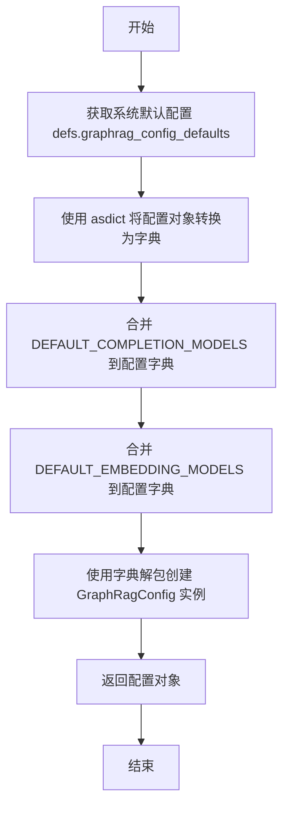

#### 带注释源码

```python
def get_default_graphrag_config() -> GraphRagConfig:
    """
    获取默认的GraphRagConfig配置对象。
    
    该函数通过以下步骤构建默认配置：
    1. 获取系统预设的默认配置（defs.graphrag_config_defaults）
    2. 将其转换为字典形式
    3. 合并自定义的completion_models配置
    4. 合并自定义的embedding_models配置
    5. 创建并返回完整的GraphRagConfig实例
    
    Returns:
        GraphRagConfig: 包含默认配置和自定义模型配置的完整配置对象
    """
    return GraphRagConfig(**{
        # 将系统默认配置对象转换为字典
        **asdict(defs.graphrag_config_defaults),
        # 覆盖默认的completion_models，使用自定义配置
        # 包含默认completion模型的API密钥、模型提供商等信息
        "completion_models": DEFAULT_COMPLETION_MODELS,
        # 覆盖默认的embedding_models，使用自定义配置
        # 包含默认embedding模型的API密钥、模型提供商等信息
        "embedding_models": DEFAULT_EMBEDDING_MODELS,
    })
```


### `assert_retry_configs`

该函数用于验证两个 `RetryConfig` 对象的配置参数是否完全一致，通过逐个断言比较重试类型、最大重试次数、基础延迟、抖动和最大延迟等属性，如果任何一项不匹配则抛出 `AssertionError`。

参数：

- `actual`：`RetryConfig`，实际的 retry 配置对象
- `expected`：`RetryConfig`，期望的 retry 配置对象

返回值：`None`，无返回值（通过断言验证配置一致性）

#### 流程图

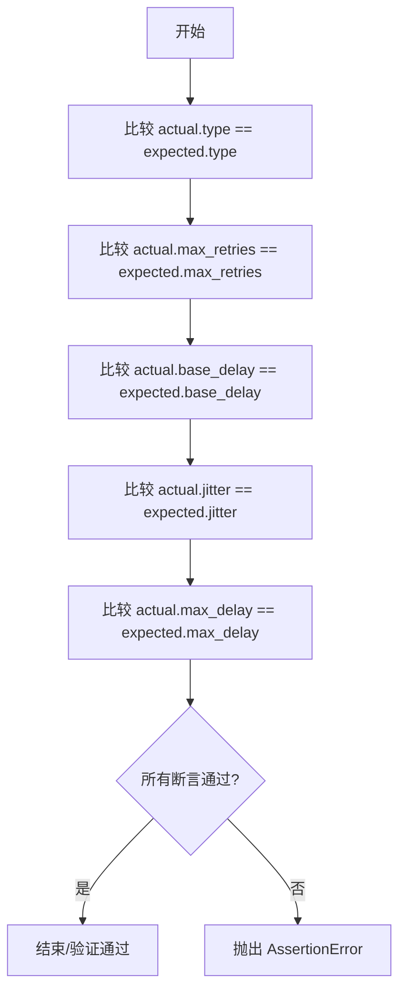

#### 带注释源码

```python
def assert_retry_configs(actual: RetryConfig, expected: RetryConfig) -> None:
    """
    验证两个 RetryConfig 对象的配置是否完全一致。
    
    参数:
        actual: 实际的 retry 配置对象
        expected: 期望的 retry 配置对象
    
    返回:
        None。如果配置不一致会抛出 AssertionError。
    """
    # 断言重试类型一致
    assert actual.type == expected.type
    # 断言最大重试次数一致
    assert actual.max_retries == expected.max_retries
    # 断言基础延迟时间一致
    assert actual.base_delay == expected.base_delay
    # 断言抖动配置一致
    assert actual.jitter == expected.jitter
    # 断言最大延迟时间一致
    assert actual.max_delay == expected.max_delay
```


### `assert_rate_limit_configs`

该函数用于验证两个 `RateLimitConfig` 对象的速率限制配置是否完全匹配，通过逐一比较类型、时间周期、请求限制和令牌限制等关键属性来确保配置的一致性。

参数：

- `actual`：`RateLimitConfig`，实际要验证的速率限制配置对象
- `expected`：`RateLimitConfig`，期望的速率限制配置对象，用于与实际配置进行比对

返回值：`None`，该函数不返回任何值，仅通过断言验证配置是否匹配

#### 流程图

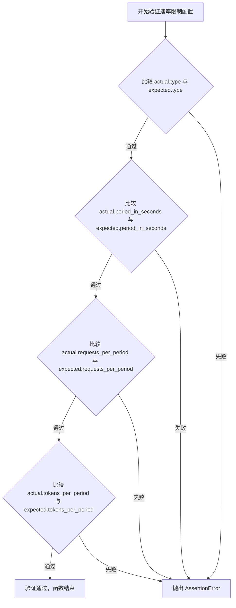

#### 带注释源码

```python
def assert_rate_limit_configs(
    actual: RateLimitConfig, expected: RateLimitConfig
) -> None:
    """
    验证两个 RateLimitConfig 对象的速率限制配置是否完全匹配。
    
    参数:
        actual: 实际要验证的速率限制配置对象
        expected: 期望的速率限制配置对象，用于与实际配置进行比对
    
    返回值:
        None: 该函数不返回任何值，仅通过断言验证配置是否匹配
    """
    # 验证速率限制配置的类型是否一致
    assert actual.type == expected.type
    
    # 验证速率限制的时间周期（秒）是否一致
    assert actual.period_in_seconds == expected.period_in_seconds
    
    # 验证每个周期内允许的请求数是否一致
    assert actual.requests_per_period == expected.requests_per_period
    
    # 验证每个周期内允许的令牌数是否一致
    assert actual.tokens_per_period == expected.tokens_per_period
```


### `assert_metrics_configs`

该函数用于断言并验证两个 `MetricsConfig` 对象的配置属性是否完全匹配，通过逐个比较 `type`、`store`、`writer`、`log_level` 和 `base_dir` 属性来确保配置一致性。

参数：

- `actual`：`MetricsConfig`，实际配置对象，包含待验证的指标配置
- `expected`：`MetricsConfig`，预期配置对象，作为对比的基准配置

返回值：`None`，该函数不返回任何值，仅通过断言验证配置

#### 流程图

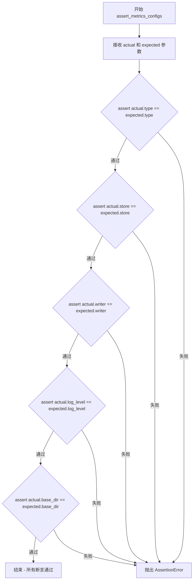

#### 带注释源码

```python
def assert_metrics_configs(actual: MetricsConfig, expected: MetricsConfig) -> None:
    """
    断言并验证两个 MetricsConfig 对象的属性是否完全匹配。
    
    该函数用于测试场景中验证指标配置是否按预期设置，
    通过逐一比较配置对象的各个属性来确保一致性。
    
    参数:
        actual: MetricsConfig, 实际被测试的指标配置对象
        expected: MetricsConfig, 预期的指标配置对象作为参考基准
    
    返回:
        None: 不返回任何值，若配置不匹配则抛出 AssertionError
    """
    # 验证指标配置类型是否一致
    assert actual.type == expected.type
    # 验证指标存储配置是否一致
    assert actual.store == expected.store
    # 验证指标写入器配置是否一致
    assert actual.writer == expected.writer
    # 验证日志级别配置是否一致
    assert actual.log_level == expected.log_level
    # 验证基础目录配置是否一致
    assert actual.base_dir == expected.base_dir
```


### `assert_model_configs`

该函数用于验证两个 `ModelConfig` 对象的所有配置属性是否匹配，包括基本属性（类型、模型提供商、模型名称等）以及可选的子配置（重试配置、速率限制配置、指标配置）。

参数：

- `actual`：`ModelConfig`，实际的模型配置对象
- `expected`：`ModelConfig`，期望的模型配置对象

返回值：`None`，无返回值（通过断言验证配置一致性）

#### 流程图

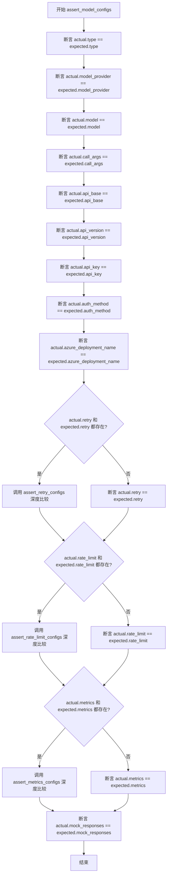

#### 带注释源码

```python
def assert_model_configs(actual: ModelConfig, expected: ModelConfig) -> None:
    """
    验证两个 ModelConfig 对象的所有配置属性是否匹配。
    
    参数:
        actual: 实际的模型配置对象
        expected: 期望的模型配置对象
    
    返回:
        None (通过断言验证，若不匹配则抛出 AssertionError)
    """
    # 验证基本字符串/标识符属性
    assert actual.type == expected.type  # 配置类型
    assert actual.model_provider == expected.model_provider  # 模型提供商
    assert actual.model == expected.model  # 模型名称
    assert actual.call_args == expected.call_args  # 调用参数
    assert actual.api_base == expected.api_base  # API 基础 URL
    assert actual.api_version == expected.api_version  # API 版本
    assert actual.api_key == expected.api_key  # API 密钥
    assert actual.auth_method == expected.auth_method  # 认证方法
    assert actual.azure_deployment_name == expected.azure_deployment_name  # Azure 部署名称
    
    # 处理可选的重试配置
    if actual.retry and expected.retry:
        # 当两者都存在重试配置时，进行深度比较
        assert_retry_configs(actual.retry, expected.retry)
    else:
        # 任一者缺失时，直接比较对象引用
        assert actual.retry == expected.retry
    
    # 处理可选的速率限制配置
    if actual.rate_limit and expected.rate_limit:
        # 当两者都存在速率限制配置时，进行深度比较
        assert_rate_limit_configs(actual.rate_limit, expected.rate_limit)
    else:
        # 任一者缺失时，直接比较对象引用
        assert actual.rate_limit == expected.rate_limit
    
    # 处理可选的指标配置
    if actual.metrics and expected.metrics:
        # 当两者都存在指标配置时，进行深度比较
        assert_metrics_configs(actual.metrics, expected.metrics)
    else:
        # 任一者缺失时，直接比较对象引用
        assert actual.metrics == expected.metrics
    
    # 验证模拟响应标志
    assert actual.mock_responses == expected.mock_responses
```


### `assert_vector_store_configs`

该函数用于断言并验证两个 `VectorStoreConfig` 对象的所有配置属性是否完全一致，包括类型、数据库 URI、URL、API 密钥、受众和数据库名称等关键属性。

参数：

- `actual`：`VectorStoreConfig`，实际配置对象
- `expected`：`VectorStoreConfig`，期望的配置对象

返回值：`None`，无返回值

#### 流程图

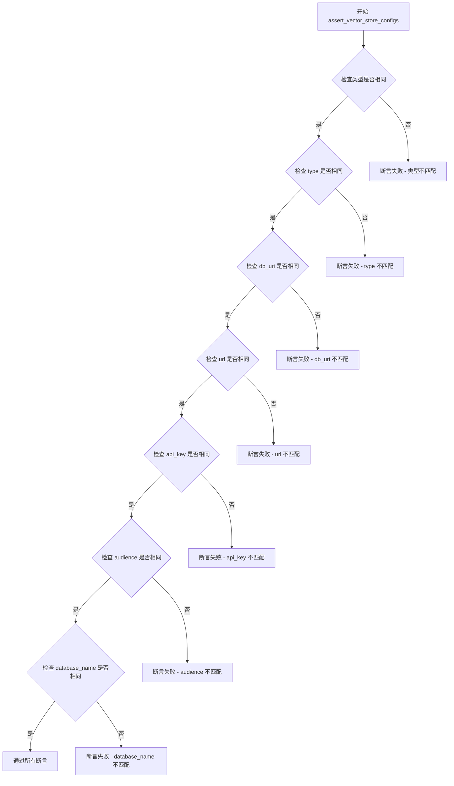

#### 带注释源码

```python
def assert_vector_store_configs(
    actual: VectorStoreConfig,
    expected: VectorStoreConfig,
):
    """断言并验证两个 VectorStoreConfig 对象的所有配置属性是否完全一致
    
    参数:
        actual: 实际配置对象
        expected: 期望配置对象
    
    异常:
        AssertionError: 任一配置项不匹配时抛出
    """
    # 验证两个对象的类型完全相同
    assert type(actual) is type(expected)
    
    # 验证向量存储类型配置
    assert actual.type == expected.type
    
    # 验证数据库连接 URI
    assert actual.db_uri == expected.db_uri
    
    # 验证 URL 配置
    assert actual.url == expected.url
    
    # 验证 API 密钥配置
    assert actual.api_key == expected.api_key
    
    # 验证受众配置
    assert actual.audience == expected.audience
    
    # 验证数据库名称配置
    assert actual.database_name == expected.database_name
```


### `assert_reporting_configs`

该函数用于验证两个 ReportingConfig 对象的配置属性是否完全匹配，通过逐个比较 type、base_dir、connection_string、container_name 和 account_url 等关键属性来确保配置的一致性，常用于测试场景中验证配置的正确性。

参数：

- `actual`：`ReportingConfig`，实际获取的 ReportingConfig 配置对象，用于与期望值进行比较
- `expected`：`ReportingConfig`，预期的 ReportingConfig 配置对象，作为验证的基准

返回值：`None`，该函数不返回任何值，仅通过断言验证配置属性是否相等

#### 流程图

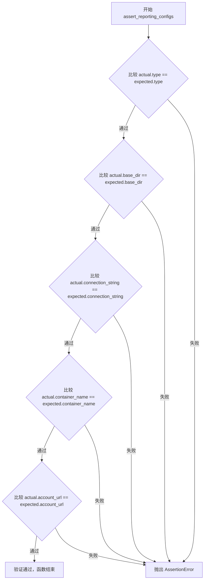

#### 带注释源码

```python
def assert_reporting_configs(
    actual: ReportingConfig, expected: ReportingConfig
) -> None:
    """
    验证两个 ReportingConfig 对象的配置属性是否完全一致。
    
    参数:
        actual: 实际获取的 ReportingConfig 配置对象
        expected: 预期的 ReportingConfig 配置对象
    
    返回:
        None: 仅通过断言验证，不返回任何值
    
    异常:
        AssertionError: 当任意属性不匹配时抛出
    """
    # 断言报告类型匹配
    assert actual.type == expected.type
    # 断言基础目录配置匹配
    assert actual.base_dir == expected.base_dir
    # 断言连接字符串配置匹配
    assert actual.connection_string == expected.connection_string
    # 断言容器名称配置匹配
    assert actual.container_name == expected.container_name
    # 断言账户URL配置匹配
    assert actual.account_url == expected.account_url
```


### `assert_storage_config`

验证存储配置对象的各项属性是否与预期值完全匹配，确保配置的合法性。

参数：

- `actual`：`StorageConfig`，实际的存储配置对象，需要被验证的配置
- `expected`：`StorageConfig`，预期的存储配置对象，用于对比的基准配置

返回值：`None`，无返回值，通过 `assert` 语句进行断言验证

#### 流程图

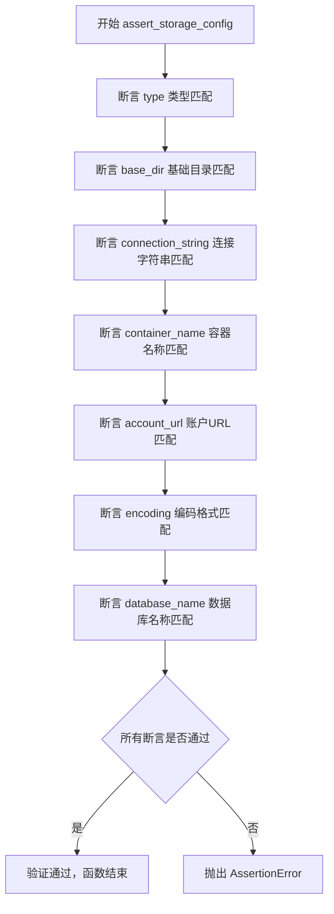

#### 带注释源码

```python
def assert_storage_config(actual: StorageConfig, expected: StorageConfig) -> None:
    """
    验证存储配置对象的各项属性是否与预期值完全匹配
    
    参数:
        actual: 实际的存储配置对象
        expected: 预期的存储配置对象
    
    返回值:
        None，通过 assert 语句进行断言验证
    """
    # 断言存储类型必须一致（如本地存储、Azure Blob存储等）
    assert expected.type == actual.type
    
    # 断言基础目录路径必须一致
    assert expected.base_dir == actual.base_dir
    
    # 断言连接字符串必须一致（用于云存储连接）
    assert expected.connection_string == actual.connection_string
    
    # 断言容器名称必须一致
    assert expected.container_name == actual.container_name
    
    # 断言账户URL必须一致（如Azure存储账户地址）
    assert expected.account_url == actual.account_url
    
    # 断言文件编码格式必须一致
    assert expected.encoding == actual.encoding
    
    # 断言数据库名称必须一致
    assert expected.database_name == actual.database_name
```


### `assert_cache_configs`

该函数用于验证缓存配置（CacheConfig）对象的一致性，通过比较实际配置与预期配置的类型，以及在两者都包含存储配置的情况下，进一步验证存储配置的一致性。

参数：

- `actual`：`CacheConfig`，实际的缓存配置对象，包含需要验证的当前配置状态
- `expected`：`CacheConfig`，预期的缓存配置对象，包含期望的配置值作为比对基准

返回值：`None`，该函数无返回值，通过 assert 语句在验证失败时抛出 AssertionError

#### 流程图

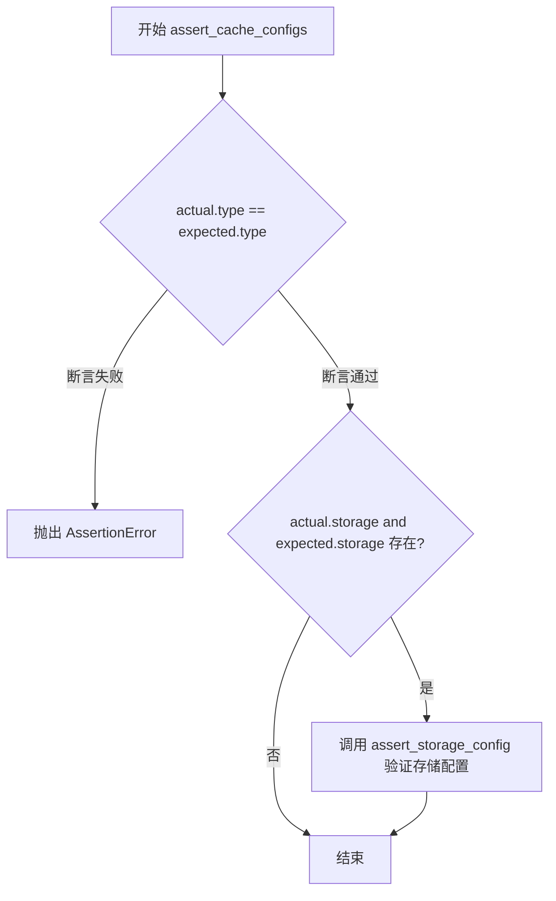

#### 带注释源码

```python
def assert_cache_configs(actual: CacheConfig, expected: CacheConfig) -> None:
    """
    验证缓存配置的一致性
    
    参数:
        actual: 实际的缓存配置对象
        expected: 预期的缓存配置对象
    """
    # 断言缓存类型一致性
    assert actual.type == expected.type
    
    # 仅当两者的存储配置都存在时才进行深度验证
    if actual.storage and expected.storage:
        assert_storage_config(actual.storage, expected.storage)
```


### `assert_input_configs`

该函数用于验证输入配置（InputConfig）的各项属性是否与预期配置一致，通过逐一比对 type、encoding、file_pattern、text_column 和 title_column 字段来确保配置的正确性。

参数：

- `actual`：`InputConfig`，实际的输入配置对象，用于与预期配置进行比对
- `expected`：`InputConfig`，预期的输入配置对象，作为比对的标准

返回值：`None`，该函数不返回任何值，仅通过断言验证配置属性是否匹配，若不匹配则抛出 `AssertionError`

#### 流程图

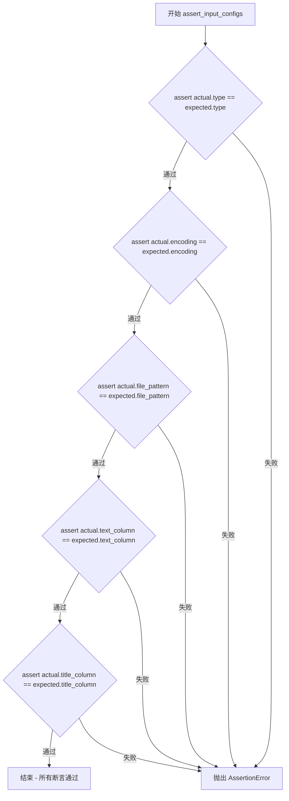

#### 带注释源码

```python
def assert_input_configs(actual: InputConfig, expected: InputConfig) -> None:
    """
    验证输入配置的各项属性是否与预期配置一致。
    
    参数:
        actual: 实际的输入配置对象
        expected: 预期的输入配置对象
    
    返回值:
        无返回值，若配置不匹配则抛出 AssertionError
    """
    # 验证配置类型是否一致
    assert actual.type == expected.type
    # 验证编码格式是否一致
    assert actual.encoding == expected.encoding
    # 验证文件匹配模式是否一致
    assert actual.file_pattern == expected.file_pattern
    # 验证文本列名是否一致
    assert actual.text_column == expected.text_column
    # 验证标题列名是否一致
    assert actual.title_column == expected.title_column
```


### `assert_text_embedding_configs`

该函数是一个测试断言辅助函数，用于验证文本嵌入配置（EmbedTextConfig）的实际对象与预期对象的各项属性是否完全匹配，确保配置一致性。

参数：

- `actual`：`EmbedTextConfig`，实际被测试的文本嵌入配置对象
- `expected`：`EmbedTextConfig`，预期的文本嵌入配置对象，用于比较基准

返回值：`None`，该函数为断言函数，不返回任何值，仅通过断言验证配置

#### 流程图

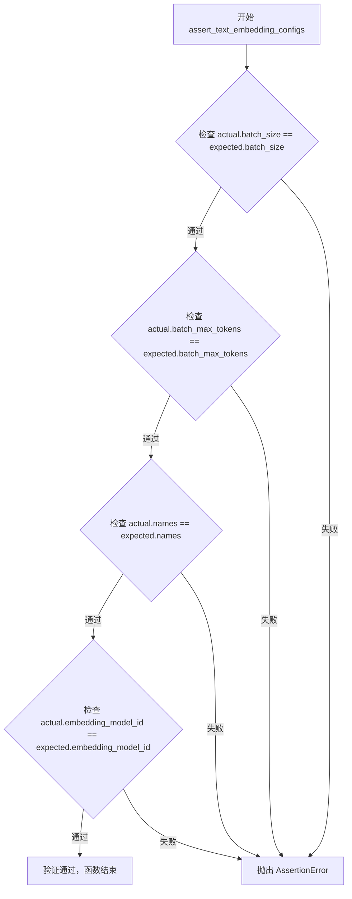

#### 带注释源码

```python
def assert_text_embedding_configs(
    actual: EmbedTextConfig, expected: EmbedTextConfig
) -> None:
    """
    验证文本嵌入配置对象的属性是否与预期配置匹配
    
    参数:
        actual: 实际被测试的 EmbedTextConfig 配置对象
        expected: 预期的 EmbedTextConfig 配置对象作为比较基准
    
    返回值:
        无返回值，若配置不匹配则抛出 AssertionError
    """
    
    # 断言验证：批处理大小是否一致
    assert actual.batch_size == expected.batch_size
    
    # 断言验证：批处理最大 token 数是否一致
    assert actual.batch_max_tokens == expected.batch_max_tokens
    
    # 断言验证：嵌入配置名称列表是否一致
    assert actual.names == expected.names
    
    # 断言验证：嵌入模型 ID 是否一致
    assert actual.embedding_model_id == expected.embedding_model_id
```


### `assert_chunking_configs`

该函数用于验证两个 `ChunkingConfig` 对象的配置是否一致，通过逐个比较分块配置的关键属性（大小、重叠、类型、编码模型和元数据前缀设置）来判断配置是否符合预期，常用于单元测试或配置校验场景。

参数：

- `actual`：`ChunkingConfig`，实际的分块配置对象
- `expected`：`ChunkingConfig`，期望的分块配置对象

返回值：`None`，该函数不返回任何值，仅通过断言验证配置一致性

#### 流程图

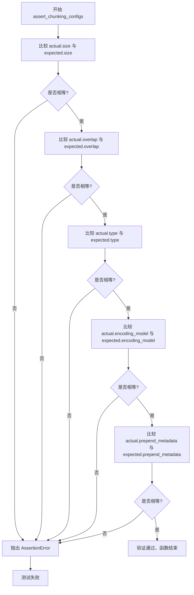

#### 带注释源码

```python
def assert_chunking_configs(actual: ChunkingConfig, expected: ChunkingConfig) -> None:
    """
    验证两个 ChunkingConfig 对象的配置是否一致
    
    参数:
        actual: 实际的分块配置对象
        expected: 期望的分块配置对象
    
    异常:
        AssertionError: 当任意配置属性不匹配时抛出
    """
    # 验证分块大小配置
    assert actual.size == expected.size
    # 验证分块重叠大小配置
    assert actual.overlap == expected.overlap
    # 验证分块类型配置
    assert actual.type == expected.type
    # 验证编码模型配置
    assert actual.encoding_model == expected.encoding_model
    # 验证是否在分块前追加元数据
    assert actual.prepend_metadata == expected.prepend_metadata
```


### `assert_snapshots_configs`

该函数用于验证两个 SnapshotsConfig 对象的配置是否一致，通过断言比较 embeddings 和 graphml 两个关键属性的值。

参数：

- `actual`：`SnapshotsConfig`，实际的快照配置对象，用于与期望配置进行比较
- `expected`：`SnapshotsConfig`，期望的快照配置对象，作为比较的基准

返回值：`None`，该函数不返回任何值，仅通过断言验证配置一致性

#### 流程图

```mermaid
flowchart TD
    A[开始 assert_snapshots_configs] --> B{断言 actual.embeddings == expected.embeddings}
    B -->|通过 --> C{断言 actual.graphml == expected.graphml}
    B -->|失败 --> D[抛出 AssertionError]
    C -->|通过 --> E[验证通过，函数结束]
    C -->|失败 --> D
```

#### 带注释源码

```python
def assert_snapshots_configs(
    actual: SnapshotsConfig, expected: SnapshotsConfig
) -> None:
    """验证快照配置对象的一致性
    
    参数:
        actual: 实际的快照配置对象
        expected: 期望的快照配置对象
    
    异常:
        AssertionError: 当任一配置项不匹配时抛出
    """
    # 验证 embeddings 快照配置是否一致
    assert actual.embeddings == expected.embeddings
    # 验证 graphml 快照配置是否一致
    assert actual.graphml == expected.graphml
```


### `assert_extract_graph_configs`

该函数是一个测试断言辅助函数，用于验证两个 `ExtractGraphConfig` 对象的属性值是否一致，通过逐一比较提示词、实体类型、最大提取次数和 completion 模型 ID 来确保配置的正确性。

参数：

- `actual`：`ExtractGraphConfig`，实际获取的图谱提取配置对象
- `expected`：`ExtractGraphConfig`，期望的图谱提取配置对象

返回值：`None`，该函数通过断言进行验证，不返回任何值

#### 流程图

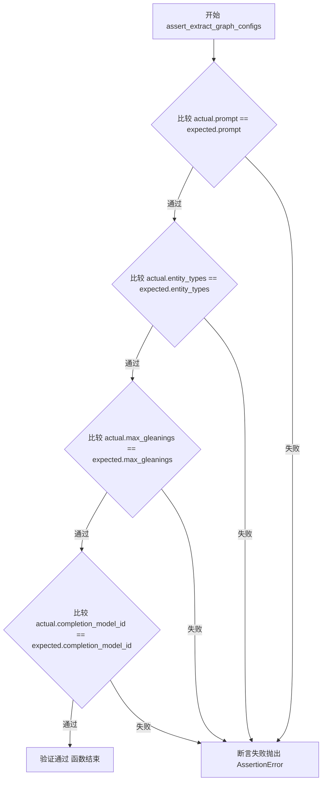

#### 带注释源码

```python
def assert_extract_graph_configs(
    actual: ExtractGraphConfig, expected: ExtractGraphConfig
) -> None:
    """
    断言验证两个 ExtractGraphConfig 配置对象的属性是否一致。
    
    参数:
        actual: 实际获取的图谱提取配置对象
        expected: 期望的图谱提取配置对象
    
    返回:
        None: 通过断言验证配置一致性，失败时抛出 AssertionError
    """
    # 验证提取图谱的提示词配置是否一致
    assert actual.prompt == expected.prompt
    
    # 验证实体类型列表是否一致
    assert actual.entity_types == expected.entity_types
    
    # 验证最大提取轮次配置是否一致
    assert actual.max_gleanings == expected.max_gleanings
    
    # 验证使用的 completion 模型 ID 是否一致
    assert actual.completion_model_id == expected.completion_model_id
```


### `assert_text_analyzer_configs`

该函数用于验证两个 `TextAnalyzerConfig` 配置对象的所有属性是否相等，确保实际配置与预期配置完全一致。

参数：

- `actual`：`TextAnalyzerConfig`，实际获得的文本分析器配置对象
- `expected`：`TextAnalyzerConfig`，期望的文本分析器配置对象

返回值：`None`，该函数通过断言验证配置，不返回任何值

#### 流程图

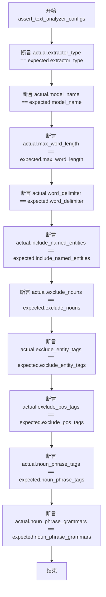

#### 带注释源码

```python
def assert_text_analyzer_configs(
    actual: TextAnalyzerConfig, expected: TextAnalyzerConfig
) -> None:
    """
    验证两个 TextAnalyzerConfig 配置对象的属性是否相等
    
    参数:
        actual: 实际获得的配置对象
        expected: 期望的配置对象
    
    返回:
        None: 通过断言验证，失败时抛出 AssertionError
    """
    # 验证提取器类型
    assert actual.extractor_type == expected.extractor_type
    # 验证模型名称
    assert actual.model_name == expected.model_name
    # 验证最大词长
    assert actual.max_word_length == expected.max_word_length
    # 验证词分隔符
    assert actual.word_delimiter == expected.word_delimiter
    # 验证是否包含命名实体
    assert actual.include_named_entities == expected.include_named_entities
    # 验证是否排除名词
    assert actual.exclude_nouns == expected.exclude_nouns
    # 验证是否排除实体标签
    assert actual.exclude_entity_tags == expected.exclude_entity_tags
    # 验证是否排除词性标签
    assert actual.exclude_pos_tags == expected.exclude_pos_tags
    # 验证名词短语标签
    assert actual.noun_phrase_tags == expected.noun_phrase_tags
    # 验证名词短语语法
    assert actual.noun_phrase_grammars == expected.noun_phrase_grammars
```


### `assert_extract_graph_nlp_configs`

这是一个测试断言函数，用于验证 `ExtractGraphNLPConfig` 配置对象的实际值是否与预期值匹配。该函数主要检查三个配置项：边缘权重归一化设置、文本分析器配置以及并发请求数。

参数：

- `actual`：`ExtractGraphNLPConfig`，待验证的实际配置对象
- `expected`：`ExtractGraphNLPConfig`，预期的配置对象

返回值：`None`，该函数不返回任何值，仅通过断言进行配置验证

#### 流程图

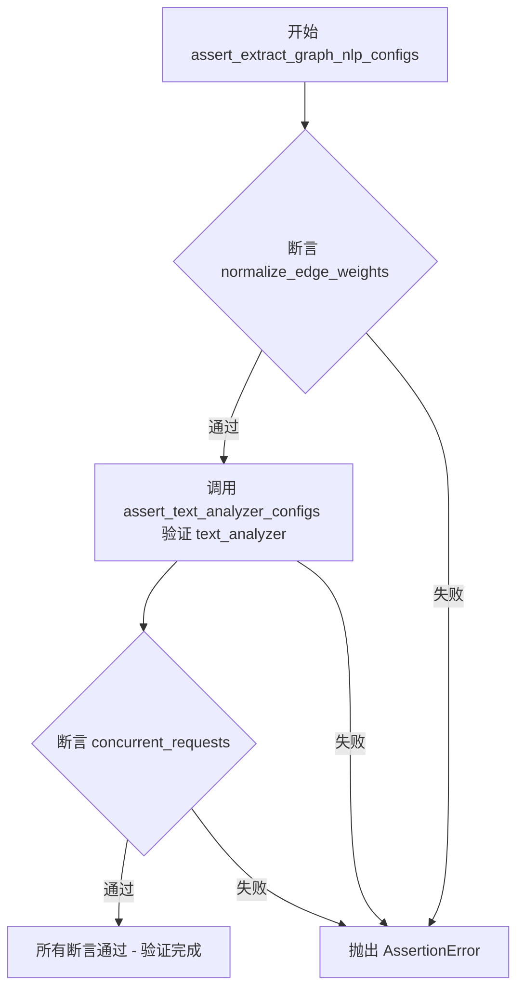

#### 带注释源码

```python
def assert_extract_graph_nlp_configs(
    actual: ExtractGraphNLPConfig, expected: ExtractGraphNLPConfig
) -> None:
    """
    验证 ExtractGraphNLPConfig 配置对象的一致性
    
    参数:
        actual: 实际获取的配置对象
        expected: 预期期望的配置对象
    """
    # 断言边缘权重归一化配置是否一致
    assert actual.normalize_edge_weights == expected.normalize_edge_weights
    
    # 调用专门的文本分析器配置验证函数
    assert_text_analyzer_configs(actual.text_analyzer, expected.text_analyzer)
    
    # 断言并发请求数配置是否一致
    assert actual.concurrent_requests == expected.concurrent_requests
```


### `assert_prune_graph_configs`

该函数用于断言两个 `PruneGraphConfig` 对象的属性值是否完全相等，常用于测试场景中验证配置的正确性。

参数：

- `actual`：`PruneGraphConfig`，要检查的实际配置对象
- `expected`：`PruneGraphConfig`，期望的配置对象，用于对比的基准

返回值：`None`，该函数仅执行断言比较，不返回任何值

#### 流程图

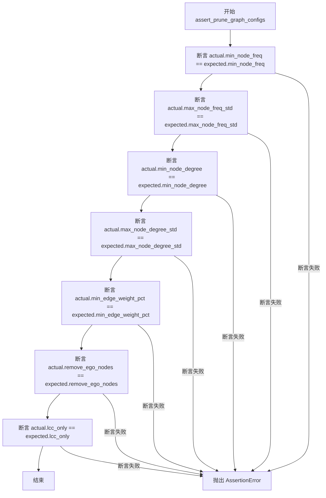

#### 带注释源码

```python
def assert_prune_graph_configs(
    actual: PruneGraphConfig, expected: PruneGraphConfig
) -> None:
    """
    断言两个 PruneGraphConfig 对象的属性值是否相等
    
    Args:
        actual: 要检查的实际配置对象
        expected: 期望的配置对象，用于对比的基准
    
    Returns:
        None: 该函数仅执行断言，不返回任何值
    
    Raises:
        AssertionError: 当任意属性值不相等时抛出
    """
    # 断言节点最小频率相等
    assert actual.min_node_freq == expected.min_node_freq
    # 断言节点最大频率标准差相等
    assert actual.max_node_freq_std == expected.max_node_freq_std
    # 断言节点最小度数相等
    assert actual.min_node_degree == expected.min_node_degree
    # 断言节点最大度数标准差相等
    assert actual.max_node_degree_std == expected.max_node_degree_std
    # 断言最小边权重百分比相等
    assert actual.min_edge_weight_pct == expected.min_edge_weight_pct
    # 断言是否移除自我中心节点相等
    assert actual.remove_ego_nodes == expected.remove_ego_nodes
    # 断言是否仅保留最大连通分量相等
    assert actual.lcc_only == expected.lcc_only
```


### `assert_summarize_descriptions_configs`

该函数是一个测试辅助函数，用于验证 `SummarizeDescriptionsConfig` 对象的实际配置与预期配置是否一致，通过逐个比较配置的各项属性（prompt、max_length、completion_model_id）来判断两个对象是否相等。

参数：

- `actual`：`SummarizeDescriptionsConfig`，实际待验证的配置对象
- `expected`：`SummarizeDescriptionsConfig`，预期用作基准的配置对象

返回值：`None`，该函数仅通过断言进行验证，不返回任何值

#### 流程图

```mermaid
flowchart TD
    A[开始 assert_summarize_descriptions_configs] --> B[接收 actual 和 expected 参数]
    B --> C{比较 actual.prompt == expected.prompt}
    C -->|通过 --> D{比较 actual.max_length == expected.max_length}
    C -->|失败 --> F[抛出 AssertionError]
    D -->|通过 --> E{比较 actual.completion_model_id == expected.completion_model_id}
    D -->|失败 --> F
    E -->|通过 --> G[验证通过，函数结束]
    E -->|失败 --> F
```

#### 带注释源码

```python
def assert_summarize_descriptions_configs(
    actual: SummarizeDescriptionsConfig, expected: SummarizeDescriptionsConfig
) -> None:
    """
    验证实际配置与预期配置是否一致
    
    参数:
        actual: 实际待验证的 SummarizeDescriptionsConfig 对象
        expected: 预期用作基准的 SummarizeDescriptionsConfig 对象
    
    返回:
        None: 仅通过断言验证，不返回任何值
    """
    # 断言比较两个配置对象的 prompt 属性
    assert actual.prompt == expected.prompt
    
    # 断言比较两个配置对象的 max_length 属性
    assert actual.max_length == expected.max_length
    
    # 断言比较两个配置对象的 completion_model_id 属性
    assert actual.completion_model_id == expected.completion_model_id
```


### `assert_community_reports_configs`

该函数用于验证两个 `CommunityReportsConfig` 对象的所有配置字段是否完全一致，通过逐个断言比较图提示词、文本提示词、最大长度、最大输入长度和completion模型ID等关键属性。

参数：

- `actual`：`CommunityReportsConfig`，实际获得的社区报告配置对象，用于与预期配置进行比对
- `expected`：`CommunityReportsConfig`，预期的社区报告配置标准值，用于验证实际配置的正确性

返回值：`None`，通过断言验证配置一致性，验证失败时抛出 `AssertionError`

#### 流程图

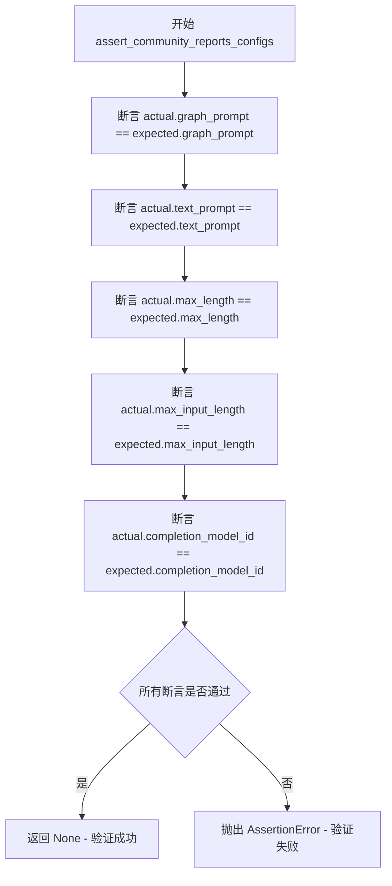

#### 带注释源码

```python
def assert_community_reports_configs(
    actual: CommunityReportsConfig, expected: CommunityReportsConfig
) -> None:
    """
    验证两个 CommunityReportsConfig 对象的配置字段是否完全一致。
    
    参数:
        actual: 实际获得的社区报告配置对象
        expected: 预期的社区报告配置标准值
    
    返回:
        None - 通过断言验证配置一致性，失败时抛出 AssertionError
    """
    # 验证图提取提示词配置是否一致
    assert actual.graph_prompt == expected.graph_prompt
    
    # 验证文本处理提示词配置是否一致
    assert actual.text_prompt == expected.text_prompt
    
    # 验证报告最大长度配置是否一致
    assert actual.max_length == expected.max_length
    
    # 验证输入数据最大长度配置是否一致
    assert actual.max_input_length == expected.max_input_length
    
    # 验证用于生成的completion模型ID是否一致
    assert actual.completion_model_id == expected.completion_model_id
```


### `assert_extract_claims_configs`

该函数是一个测试辅助函数，用于验证 `ExtractClaimsConfig` 配置对象的实际值是否与预期值一致，通过逐个断言各个配置属性的相等性来确保配置的正确性。

参数：

- `actual`：`ExtractClaimsConfig`，实际提取声明配置对象，包含待验证的当前配置值
- `expected`：`ExtractClaimsConfig`，期望的提取声明配置对象，包含预期的配置值

返回值：`None`，该函数不返回任何值，仅通过断言进行配置验证

#### 流程图

```mermaid
flowchart TD
    A[开始 assert_extract_claims_configs] --> B[断言 actual.enabled == expected.enabled]
    B --> C[断言 actual.prompt == expected.prompt]
    C --> D[断言 actual.description == expected.description]
    D --> E[断言 actual.max_gleanings == expected.max_gleanings]
    E --> F[断言 actual.completion_model_id == expected.completion_model_id]
    F --> G[结束函数]
    
    B -- 断言失败 --> H[抛出 AssertionError]
    C -- 断言失败 --> H
    D -- 断言失败 --> H
    E -- 断言失败 --> H
    F -- 断言失败 --> H
```

#### 带注释源码

```python
def assert_extract_claims_configs(
    actual: ExtractClaimsConfig, expected: ExtractClaimsConfig
) -> None:
    """
    验证 ExtractClaimsConfig 配置对象的实际值与预期值是否一致
    
    参数:
        actual: 实际提取声明配置对象
        expected: 期望提取声明配置对象
    
    返回:
        None: 仅通过断言验证，不返回任何值
    """
    # 验证 enabled（是否启用）属性
    assert actual.enabled == expected.enabled
    
    # 验证 prompt（提示词模板）属性
    assert actual.prompt == expected.prompt
    
    # 验证 description（描述）属性
    assert actual.description == expected.description
    
    # 验证 max_gleanings（最大提取轮次）属性
    assert actual.max_gleanings == expected.max_gleanings
    
    # 验证 completion_model_id（Completion模型ID）属性
    assert actual.completion_model_id == expected.completion_model_id
```


### `assert_cluster_graph_configs`

该函数用于断言比较两个 `ClusterGraphConfig` 对象的核心配置字段是否相等，包括最大聚类大小、是否使用最大连通分量以及随机种子，确保实际配置与预期配置一致。

参数：

- `actual`：`ClusterGraphConfig`，实际待验证的聚类图配置对象
- `expected`：`ClusterGraphConfig`，预期用作基准的聚类图配置对象

返回值：`None`，无返回值（通过 `assert` 语句在配置不一致时抛出 `AssertionError` 异常）

#### 流程图

```mermaid
flowchart TD
    A[开始 assert_cluster_graph_configs] --> B[比较 actual.max_cluster_size == expected.max_cluster_size]
    B --> C{是否相等?}
    C -->|是| D[比较 actual.use_lcc == expected.use_lcc]
    C -->|否| E[抛出 AssertionError]
    D --> F{是否相等?}
    F -->|是| G[比较 actual.seed == expected.seed]
    F -->|否| E
    G --> H{是否相等?}
    H -->|是| I[通过验证 - 函数结束]
    H -->|否| E
```

#### 带注释源码

```python
def assert_cluster_graph_configs(
    actual: ClusterGraphConfig, expected: ClusterGraphConfig
) -> None:
    """
    断言比较两个 ClusterGraphConfig 对象的核心配置是否相等。
    
    该函数验证以下三个配置字段：
    - max_cluster_size: 聚类图的最大簇大小
    - use_lcc: 是否使用最大连通分量( Largest Connected Component)
    - seed: 随机种子，用于确保结果可复现
    
    参数:
        actual: 实际获取到的聚类图配置对象
        expected: 期望的聚类图配置对象作为基准
    
    返回值:
        None - 若配置不一致则通过 assert 抛出 AssertionError
    
     Raises:
        AssertionError: 当任一配置字段不匹配时抛出
    """
    # 验证最大聚类大小配置是否一致
    assert actual.max_cluster_size == expected.max_cluster_size
    # 验证是否使用最大连通分量配置是否一致
    assert actual.use_lcc == expected.use_lcc
    # 验证随机种子配置是否一致
    assert actual.seed == expected.seed
```


### `assert_local_search_configs`

该函数用于验证 LocalSearchConfig 对象的实际配置与预期配置是否一致，通过一系列断言检查本地搜索配置的各项参数是否匹配。

参数：

- `actual`：`LocalSearchConfig`，实际的本 地搜索配置对象
- `expected`：`LocalSearchConfig`，预期的本地搜索配置对象

返回值：`None`，该函数不返回任何值，仅通过断言验证配置一致性

#### 流程图

```mermaid
flowchart TD
    A[开始 assert_local_search_configs] --> B{断言 actual.prompt == expected.prompt}
    B --> C{断言 actual.text_unit_prop == expected.text_unit_prop}
    C --> D{断言 actual.community_prop == expected.community_prop}
    D --> E{断言 conversation_history_max_turns 相等}
    E --> F{断言 actual.top_k_entities == expected.top_k_entities}
    F --> G{断言 actual.top_k_relationships == expected.top_k_relationships}
    G --> H{断言 actual.max_context_tokens == expected.max_context_tokens}
    H --> I[结束 - 所有断言通过]
    
    B -->|失败| J[抛出 AssertionError]
    C -->|失败| J
    D -->|失败| J
    E -->|失败| J
    F -->|失败| J
    G -->|失败| J
    H -->|失败| J
```

#### 带注释源码

```python
def assert_local_search_configs(
    actual: LocalSearchConfig, expected: LocalSearchConfig
) -> None:
    """
    验证 LocalSearchConfig 配置对象的实际值与预期值是否一致。
    
    参数:
        actual: LocalSearchConfig - 实际配置的 LocalSearchConfig 对象
        expected: LocalSearchConfig - 预期配置的 LocalSearchConfig 对象
    
    返回:
        None - 该函数通过断言验证，不返回任何值
    """
    
    # 验证本地搜索提示词配置
    assert actual.prompt == expected.prompt
    
    # 验证文本单元比例配置
    assert actual.text_unit_prop == expected.text_unit_prop
    
    # 验证社区比例配置
    assert actual.community_prop == expected.community_prop
    
    # 验证对话历史最大轮次配置
    assert (
        actual.conversation_history_max_turns == expected.conversation_history_max_turns
    )
    
    # 验证Top K实体数量配置
    assert actual.top_k_entities == expected.top_k_entities
    
    # 验证Top K关系数量配置
    assert actual.top_k_relationships == expected.top_k_relationships
    
    # 验证最大上下文令牌数配置
    assert actual.max_context_tokens == expected.max_context_tokens
```


### `assert_global_search_configs`

该函数是一个断言验证函数，用于比较两个 `GlobalSearchConfig` 对象的所有配置属性是否完全一致。如果任何属性不匹配，将抛出 `AssertionError`。常用于测试场景或配置校验，确保实际使用的全局搜索配置与预期配置相符。

参数：

- `actual`：`GlobalSearchConfig`，实际创建的全局搜索配置对象
- `expected`：`GlobalSearchConfig`，期望的全局搜索配置对象

返回值：`None`，无返回值，仅通过断言验证配置一致性

#### 流程图

```mermaid
flowchart TD
    A[开始 assert_global_search_configs] --> B[断言 actual.map_prompt == expected.map_prompt]
    B --> C[断言 actual.reduce_prompt == expected.reduce_prompt]
    C --> D[断言 actual.knowledge_prompt == expected.knowledge_prompt]
    D --> E[断言 actual.max_context_tokens == expected.max_context_tokens]
    E --> F[断言 actual.data_max_tokens == expected.data_max_tokens]
    F --> G[断言 actual.map_max_length == expected.map_max_length]
    G --> H[断言 actual.reduce_max_length == expected.reduce_max_length]
    H --> I[断言 actual.dynamic_search_threshold == expected.dynamic_search_threshold]
    I --> J[断言 actual.dynamic_search_keep_parent == expected.dynamic_search_keep_parent]
    J --> K[断言 actual.dynamic_search_num_repeats == expected.dynamic_search_num_repeats]
    K --> L[断言 actual.dynamic_search_use_summary == expected.dynamic_search_use_summary]
    L --> M[断言 actual.dynamic_search_max_level == expected.dynamic_search_max_level]
    M --> N[所有断言通过，函数结束]
    
    B -.-> O1[抛出 AssertionError]
    C -.-> O2[抛出 AssertionError]
    D -.-> O3[抛出 AssertionError]
    E -.-> O4[抛出 AssertionError]
    F -.-> O5[抛出 AssertionError]
    G -.-> O6[抛出 AssertionError]
    H -.-> O7[抛出 AssertionError]
    I -.-> O8[抛出 AssertionError]
    J -.-> O9[抛出 AssertionError]
    K -.-> O10[抛出 AssertionError]
    L -.-> O11[抛出 AssertionError]
    M -.-> O12[抛出 AssertionError]
```

#### 带注释源码

```python
def assert_global_search_configs(
    actual: GlobalSearchConfig, expected: GlobalSearchConfig
) -> None:
    """
    断言验证两个 GlobalSearchConfig 对象的配置是否完全一致。
    
    参数:
        actual: 实际创建的全局搜索配置对象
        expected: 期望的全局搜索配置对象
    
    返回:
        None: 无返回值，任何不匹配都会抛出 AssertionError
    """
    
    # 验证 map 阶段的提示词配置
    assert actual.map_prompt == expected.map_prompt
    
    # 验证 reduce 阶段的提示词配置
    assert actual.reduce_prompt == expected.reduce_prompt
    
    # 验证知识库提示词配置
    assert actual.knowledge_prompt == expected.knowledge_prompt
    
    # 验证最大上下文 token 数量限制
    assert actual.max_context_tokens == expected.max_context_tokens
    
    # 验证最大数据 token 数量限制
    assert actual.data_max_tokens == expected.data_max_tokens
    
    # 验证 map 阶段最大输出长度
    assert actual.map_max_length == expected.map_max_length
    
    # 验证 reduce 阶段最大输出长度
    assert actual.reduce_max_length == expected.reduce_max_length
    
    # 验证动态搜索阈值配置
    assert actual.dynamic_search_threshold == expected.dynamic_search_threshold
    
    # 验证动态搜索是否保留父节点配置
    assert actual.dynamic_search_keep_parent == expected.dynamic_search_keep_parent
    
    # 验证动态搜索重复次数配置
    assert actual.dynamic_search_num_repeats == expected.dynamic_search_num_repeats
    
    # 验证动态搜索是否使用摘要配置
    assert actual.dynamic_search_use_summary == expected.dynamic_search_use_summary
    
    # 验证动态搜索最大层级配置
    assert actual.dynamic_search_max_level == expected.dynamic_search_max_level
```


### `assert_drift_search_configs`

该函数是一个配置验证函数，用于断言比对两个 `DRIFTSearchConfig` 对象的全部配置属性是否完全一致，确保实际配置与预期配置匹配。

参数：

- `actual`：`DRIFTSearchConfig`，实际配置对象
- `expected`：`DRIFTSearchConfig`，预期配置对象

返回值：`None`，无返回值，通过断言验证配置一致性

#### 流程图

```mermaid
flowchart TD
    A[开始 assert_drift_search_configs] --> B{断言 actual.prompt == expected.prompt}
    B --> C{断言 actual.reduce_prompt == expected.reduce_prompt}
    C --> D{断言 actual.data_max_tokens == expected.data_max_tokens}
    D --> E{断言 actual.reduce_max_tokens == expected.reduce_max_tokens}
    E --> F{断言 actual.reduce_temperature == expected.reduce_temperature}
    F --> G{断言 actual.concurrency == expected.concurrency}
    G --> H{断言 actual.drift_k_followups == expected.drift_k_followups}
    H --> I{断言 actual.primer_folds == expected.primer_folds}
    I --> J{断言 actual.primer_llm_max_tokens == expected.primer_llm_max_tokens}
    J --> K{断言 actual.n_depth == expected.n_depth}
    K --> L{断言 actual.local_search_text_unit_prop == expected.local_search_text_unit_prop}
    L --> M{断言 actual.local_search_community_prop == expected.local_search_community_prop}
    M --> N{断言 actual.local_search_top_k_mapped_entities == expected.local_search_top_k_mapped_entities}
    N --> O{断言 actual.local_search_top_k_relationships == expected.local_search_top_k_relationships}
    O --> P{断言 actual.local_search_max_data_tokens == expected.local_search_max_data_tokens}
    P --> Q{断言 actual.local_search_temperature == expected.local_search_temperature}
    Q --> R{断言 actual.local_search_top_p == expected.local_search_top_p}
    R --> S{断言 actual.local_search_n == expected.local_search_n}
    S --> T{断言 actual.local_search_llm_max_gen_tokens == expected.local_search_llm_max_gen_tokens}
    T --> U[结束 - 所有断言通过]
```

#### 带注释源码

```python
def assert_drift_search_configs(
    actual: DRIFTSearchConfig, expected: DRIFTSearchConfig
) -> None:
    """
    断言两个 DRIFTSearchConfig 对象的配置是否完全一致。
    
    参数:
        actual: 实际的 DRIFTSearchConfig 配置对象
        expected: 预期的 DRIFTSearchConfig 配置对象
    
    返回:
        None - 通过断言验证配置一致性，若不一致则抛出 AssertionError
    """
    # 验证基础提示词配置
    assert actual.prompt == expected.prompt
    assert actual.reduce_prompt == expected.reduce_prompt
    
    # 验证令牌限制配置
    assert actual.data_max_tokens == expected.data_max_tokens
    assert actual.reduce_max_tokens == expected.reduce_max_tokens
    
    # 验证温度参数配置
    assert actual.reduce_temperature == expected.reduce_temperature
    
    # 验证并发配置
    assert actual.concurrency == expected.concurrency
    
    # 验证 DRIFT 搜索特定参数
    assert actual.drift_k_followups == expected.drift_k_followups
    assert actual.primer_folds == expected.primer_folds
    assert actual.primer_llm_max_tokens == expected.primer_llm_max_tokens
    assert actual.n_depth == expected.n_depth
    
    # 验证本地搜索文本单元比例配置
    assert actual.local_search_text_unit_prop == expected.local_search_text_unit_prop
    assert actual.local_search_community_prop == expected.local_search_community_prop
    
    # 验证本地搜索 top-k 实体和关系配置
    assert (
        actual.local_search_top_k_mapped_entities
        == expected.local_search_top_k_mapped_entities
    )
    assert (
        actual.local_search_top_k_relationships
        == expected.local_search_top_k_relationships
    )
    
    # 验证本地搜索数据令牌限制
    assert actual.local_search_max_data_tokens == expected.local_search_max_data_tokens
    
    # 验证本地搜索生成参数配置
    assert actual.local_search_temperature == expected.local_search_temperature
    assert actual.local_search_top_p == expected.local_search_top_p
    assert actual.local_search_n == expected.local_search_n
    assert (
        actual.local_search_llm_max_gen_tokens
        == expected.local_search_llm_max_gen_tokens
    )
```


### `assert_basic_search_configs`

该函数用于验证两个 `BasicSearchConfig` 对象的配置是否一致，通过断言比较它们的 prompt 和 k 值是否相等。

参数：

- `actual`：`BasicSearchConfig`，实际搜索配置对象，用于与期望配置进行比对
- `expected`：`BasicSearchConfig`，期望的搜索配置对象，作为比对的标准参考

返回值：`None`，该函数仅执行断言验证，不返回任何值

#### 流程图

```mermaid
flowchart TD
    A[开始 assert_basic_search_configs] --> B[断言 actual.prompt == expected.prompt]
    B --> C{断言结果}
    C -->|通过| D[断言 actual.k == expected.k]
    C -->|失败| E[抛出 AssertionError]
    D --> F{断言结果}
    F -->|通过| G[验证完成，函数结束]
    F -->|失败| E
```

#### 带注释源码

```python
def assert_basic_search_configs(
    actual: BasicSearchConfig, expected: BasicSearchConfig
) -> None:
    """
    验证 BasicSearchConfig 配置对象的一致性
    
    Args:
        actual: 实际配置对象
        expected: 期望配置对象
    """
    # 验证实际配置的 prompt 与期望配置的 prompt 是否一致
    assert actual.prompt == expected.prompt
    # 验证实际配置的 k 值与期望配置的 k 值是否一致
    assert actual.k == expected.k
```


### `assert_graphrag_configs`

该函数是 GraphRagConfig 配置对象的深度验证函数，通过逐层比对实际配置与预期配置的所有关键属性（包括模型配置、存储配置、缓存配置、各类搜索配置等）来确保配置的正确性和完整性。

参数：

- `actual`：`GraphRagConfig`，实际运行的 GraphRAG 配置对象
- `expected`：`GraphRagConfig`，预期/期望的 GraphRAG 配置对象

返回值：`None`，该函数通过断言（assert）验证配置一致性，验证失败时抛出 AssertionError

#### 流程图

```mermaid
flowchart TD
    A[开始 assert_graphrag_configs] --> B[获取 actual 和 expected 的 completion_models 键列表并排序]
    B --> C{键数量相等?}
    C -->|否| D[断言失败: 抛出 AssertionError]
    C -->|是| E[遍历键列表]
    E --> F[比对键名并调用 assert_model_configs 验证每个模型配置]
    F --> G[获取 actual 和 expected 的 embedding_models 键列表并排序]
    G --> H{键数量相等?}
    H -->|否| D
    H -->|是| I[遍历键列表]
    I --> J[比对键名并调用 assert_model_configs 验证每个嵌入模型配置]
    J --> K[依次调用 assert_vector_store_configs 验证向量存储配置]
    K --> L[调用 assert_reporting_configs 验证报告配置]
    L --> M[调用 assert_storage_config 验证 output_storage]
    M --> N[调用 assert_storage_config 验证 input_storage]
    N --> O[调用 assert_storage_config 验证 update_output_storage]
    O --> P[调用 assert_cache_configs 验证缓存配置]
    P --> Q[调用 assert_input_configs 验证输入配置]
    Q --> R[调用 assert_text_embedding_configs 验证文本嵌入配置]
    R --> S[调用 assert_chunking_configs 验证分块配置]
    S --> T[调用 assert_snapshots_configs 验证快照配置]
    T --> U[调用 assert_extract_graph_configs 验证图提取配置]
    U --> V[调用 assert_extract_graph_nlp_configs 验证 NLP 配置]
    V --> W[调用 assert_summarize_descriptions_configs 验证描述摘要配置]
    W --> X[调用 assert_community_reports_configs 验证社区报告配置]
    X --> Y[调用 assert_extract_claims_configs 验证声明提取配置]
    Y --> Z[调用 assert_prune_graph_configs 验证图剪枝配置]
    Z --> AA[调用 assert_cluster_graph_configs 验证聚类配置]
    AA --> AB[调用 assert_local_search_configs 验证本地搜索配置]
    AB --> AC[调用 assert_global_search_configs 验证全局搜索配置]
    AC --> AD[调用 assert_drift_search_configs 验证 DRIFT 搜索配置]
    AD --> AE[调用 assert_basic_search_configs 验证基础搜索配置]
    AE --> AF[结束 - 所有配置验证通过]
```

#### 带注释源码

```python
def assert_graphrag_configs(actual: GraphRagConfig, expected: GraphRagConfig) -> None:
    """
    深度验证 GraphRagConfig 配置对象的完整性和正确性。
    
    该函数通过比对实际配置与预期配置的各个子模块，确保两者完全一致。
    验证范围涵盖：模型配置、存储配置、缓存配置、输入配置、分块配置、
    图提取配置、各类搜索配置等 GraphRAG 的所有核心配置项。
    
    参数:
        actual: 实际运行的 GraphRAG 配置对象
        expected: 预期/期望的 GraphRAG 配置对象
    
    异常:
        AssertionError: 任意配置项不匹配时抛出
    """
    
    # ========== 验证 completion_models (完成模型配置) ==========
    # 提取并排序实际的完成模型键列表
    completion_keys = sorted(actual.completion_models.keys())
    # 提取并排序预期的完成模型键列表
    expected_completion_keys = sorted(expected.completion_models.keys())
    # 断言模型数量一致
    assert len(completion_keys) == len(expected_completion_keys)
    # 逐个比对模型键并验证每个模型的配置
    for a, e in zip(completion_keys, expected_completion_keys, strict=False):
        assert a == e  # 验证模型ID一致
        # 调用 assert_model_configs 深度验证模型配置
        assert_model_configs(actual.completion_models[a], expected.completion_models[e])

    # ========== 验证 embedding_models (嵌入模型配置) ==========
    # 提取并排序实际的嵌入模型键列表
    embedding_keys = sorted(actual.embedding_models.keys())
    # 提取并排序预期的嵌入模型键列表
    expected_embedding_keys = sorted(expected.embedding_models.keys())
    # 断言嵌入模型数量一致
    assert len(embedding_keys) == len(expected_embedding_keys)
    # 逐个比对模型键并验证每个嵌入模型的配置
    for a, e in zip(embedding_keys, expected_embedding_keys, strict=False):
        assert a == e  # 验证模型ID一致
        # 调用 assert_model_configs 深度验证嵌入模型配置
        assert_model_configs(actual.embedding_models[a], expected.embedding_models[e])

    # ========== 验证存储和报告相关配置 ==========
    # 验证向量存储配置
    assert_vector_store_configs(actual.vector_store, expected.vector_store)
    # 验证报告配置
    assert_reporting_configs(actual.reporting, expected.reporting)
    # 验证输出存储配置
    assert_storage_config(actual.output_storage, expected.output_storage)
    # 验证输入存储配置
    assert_storage_config(actual.input_storage, expected.input_storage)
    # 验证更新输出存储配置
    assert_storage_config(actual.update_output_storage, expected.update_output_storage)

    # ========== 验证缓存和输入配置 ==========
    # 验证缓存配置（可能包含嵌套的存储配置）
    assert_cache_configs(actual.cache, expected.cache)
    # 验证输入配置
    assert_input_configs(actual.input, expected.input)

    # ========== 验证处理流水线配置 ==========
    # 验证文本嵌入配置
    assert_text_embedding_configs(actual.embed_text, expected.embed_text)
    # 验证文本分块配置
    assert_chunking_configs(actual.chunking, expected.chunking)
    # 验证快照配置
    assert_snapshots_configs(actual.snapshots, expected.snapshots)

    # ========== 验证图处理相关配置 ==========
    # 验证图提取配置
    assert_extract_graph_configs(actual.extract_graph, expected.extract_graph)
    # 验证 NLP 图提取配置（包含文本分析器配置）
    assert_extract_graph_nlp_configs(
        actual.extract_graph_nlp, expected.extract_graph_nlp
    )
    # 验证描述摘要配置
    assert_summarize_descriptions_configs(
        actual.summarize_descriptions, expected.summarize_descriptions
    )
    # 验证社区报告配置
    assert_community_reports_configs(
        actual.community_reports, expected.community_reports
    )
    # 验证声明提取配置
    assert_extract_claims_configs(actual.extract_claims, expected.extract_claims)
    # 验证图剪枝配置
    assert_prune_graph_configs(actual.prune_graph, expected.prune_graph)
    # 验证图聚类配置
    assert_cluster_graph_configs(actual.cluster_graph, expected.cluster_graph)

    # ========== 验证搜索策略配置 ==========
    # 验证本地搜索配置
    assert_local_search_configs(actual.local_search, expected.local_search)
    # 验证全局搜索配置
    assert_global_search_configs(actual.global_search, expected.global_search)
    # 验证 DRIFT 搜索配置
    assert_drift_search_configs(actual.drift_search, expected.drift_search)
    # 验证基础搜索配置
    assert_basic_search_configs(actual.basic_search, expected.basic_search)
    
    # 所有配置验证通过，函数正常结束（返回 None）
```

## 关键组件


## 1. 一段话描述

该代码是 GraphRAG 系统的配置验证测试模块，提供了一系列断言函数用于验证不同类型的配置对象（如模型配置、向量存储配置、缓存配置、搜索配置等）的有效性，并包含默认配置生成功能。

## 2. 文件的整体运行流程

该文件为测试辅助模块，不作为主程序运行。其运行流程如下：

1. 导入阶段：导入所需的配置模型类和默认配置
2. 初始化阶段：定义默认模型配置常量和 API 密钥
3. 提供默认配置生成函数 `get_default_graphrag_config()`
4. 提供各类配置断言函数，用于测试框架中验证配置对象的正确性

## 3. 类的详细信息

该文件不包含类定义，所有功能通过全局函数实现。

## 4. 全局变量和全局函数详细信息

### 全局变量

### FAKE_API_KEY

- **类型**: str
- **描述**: 模拟 API 密钥，用于测试环境，默认值为 "NOT_AN_API_KEY"

### DEFAULT_COMPLETION_MODEL_CONFIG

- **类型**: dict
- **描述**: 默认文本补全模型配置，包含 api_key、model 和 model_provider

### DEFAULT_EMBEDDING_MODEL_CONFIG

- **类型**: dict
- **描述**: 默认嵌入模型配置，包含 api_key、model 和 model_provider

### DEFAULT_COMPLETION_MODELS

- **类型**: dict
- **描述**: 默认文本补全模型字典，以模型 ID 为键

### DEFAULT_EMBEDDING_MODELS

- **类型**: dict
- **描述**: 默认嵌入模型字典，以模型 ID 为键

### 全局函数

### get_default_graphrag_config

- **参数**: 无
- **返回值类型**: GraphRagConfig
- **返回值描述**: 返回包含所有默认配置的 GraphRagConfig 对象
- **源码**:
```python
def get_default_graphrag_config() -> GraphRagConfig:
    return GraphRagConfig(**{
        **asdict(defs.graphrag_config_defaults),
        "completion_models": DEFAULT_COMPLETION_MODELS,
        "embedding_models": DEFAULT_EMBEDDING_MODELS,
    })
```

### assert_retry_configs

- **参数**: actual (RetryConfig) - 实际重试配置, expected (RetryConfig) - 期望重试配置
- **返回值类型**: None
- **返回值描述**: 验证重试配置的类型、最大重试次数、基础延迟、抖动和最大延迟

### assert_rate_limit_configs

- **参数**: actual (RateLimitConfig) - 实际限流配置, expected (RateLimitConfig) - 期望限流配置
- **返回值类型**: None
- **返回值描述**: 验证限流配置的类型、周期、请求数和令牌数

### assert_metrics_configs

- **参数**: actual (MetricsConfig) - 实际指标配置, expected (MetricsConfig) - 期望指标配置
- **返回值类型**: None
- **返回值描述**: 验证指标配置的类型、存储、写入器、日志级别和基础目录

### assert_model_configs

- **参数**: actual (ModelConfig) - 实际模型配置, expected (ModelConfig) - 期望模型配置
- **返回值类型**: None
- **返回值描述**: 验证模型配置的所有字段，包括提供商、模型参数、API 配置、重试、限流和指标配置

### assert_vector_store_configs

- **参数**: actual (VectorStoreConfig) - 实际向量存储配置, expected (VectorStoreConfig) - 期望向量存储配置
- **返回值类型**: None
- **返回值描述**: 验证向量存储配置的类型、URI、URL、API 密钥、受众和数据库名

### assert_reporting_configs

- **参数**: actual (ReportingConfig) - 实际报告配置, expected (ReportingConfig) - 期望报告配置
- **返回值类型**: None
- **返回值描述**: 验证报告配置的类型、基础目录、连接字符串、容器名和账户 URL

### assert_storage_config

- **参数**: actual (StorageConfig) - 实际存储配置, expected (StorageConfig) - 期望存储配置
- **返回值类型**: None
- **返回值描述**: 验证存储配置的所有字段，包括类型、目录、连接字符串、容器名、账户 URL、编码和数据库名

### assert_cache_configs

- **参数**: actual (CacheConfig) - 实际缓存配置, expected (CacheConfig) - 期望缓存配置
- **返回值类型**: None
- **返回值描述**: 验证缓存配置的类型和存储配置

### assert_input_configs

- **参数**: actual (InputConfig) - 实际输入配置, expected (InputConfig) - 期望输入配置
- **返回值类型**: None
- **返回值描述**: 验证输入配置的类型、编码、文件模式、文本列和标题列

### assert_text_embedding_configs

- **参数**: actual (EmbedTextConfig) - 实际文本嵌入配置, expected (EmbedTextConfig) - 期望文本嵌入配置
- **返回值类型**: None
- **返回值描述**: 验证文本嵌入配置的批次大小、批次最大令牌数、名称和嵌入模型 ID

### assert_chunking_configs

- **参数**: actual (ChunkingConfig) - 实际分块配置, expected (ChunkingConfig) - 期望分块配置
- **返回值类型**: None
- **返回值描述**: 验证分块配置的大小、重叠、类型、编码模型和元数据前置选项

### assert_snapshots_configs

- **参数**: actual (SnapshotsConfig) - 实际快照配置, expected (SnapshotsConfig) - 期望快照配置
- **返回值类型**: None
- **返回值描述**: 验证快照配置的嵌入和 GraphML 选项

### assert_extract_graph_configs

- **参数**: actual (ExtractGraphConfig) - 实际图提取配置, expected (ExtractGraphConfig) - 期望图提取配置
- **返回值类型**: None
- **返回值描述**: 验证图提取配置的提示词、实体类型、最大 gleanings 和补全模型 ID

### assert_text_analyzer_configs

- **参数**: actual (TextAnalyzerConfig) - 实际文本分析器配置, expected (TextAnalyzerConfig) - 期望文本分析器配置
- **返回值类型**: None
- **返回值描述**: 验证文本分析器配置的所有 NLP 相关参数

### assert_extract_graph_nlp_configs

- **参数**: actual (ExtractGraphNLPConfig) - 实际图 NLP 提取配置, expected (ExtractGraphNLPConfig) - 期望图 NLP 提取配置
- **返回值类型**: None
- **返回值描述**: 验证图 NLP 提取配置的边权重归一化和文本分析器配置

### assert_prune_graph_configs

- **参数**: actual (PruneGraphConfig) - 实际图剪枝配置, expected (PruneGraphConfig) - 期望图剪枝配置
- **返回值类型**: None
- **返回值描述**: 验证图剪枝配置的节点频率、度数、边权重百分比和ego节点选项

### assert_summarize_descriptions_configs

- **参数**: actual (SummarizeDescriptionsConfig) - 实际描述摘要配置, expected (SummarizeDescriptionsConfig) - 期望描述摘要配置
- **返回值类型**: None
- **返回值描述**: 验证描述摘要配置的提示词、最大长度和补全模型 ID

### assert_community_reports_configs

- **参数**: actual (CommunityReportsConfig) - 实际社区报告配置, expected (CommunityReportsConfig) - 期望社区报告配置
- **返回值类型**: None
- **返回值描述**: 验证社区报告配置的图提示词、文本提示词、最大长度和输入长度

### assert_extract_claims_configs

- **参数**: actual (ExtractClaimsConfig) - 实际声明提取配置, expected (ExtractClaimsConfig) - 期望声明提取配置
- **返回值类型**: None
- **返回值描述**: 验证声明提取配置的启用状态、提示词、描述、gleanings 和补全模型 ID

### assert_cluster_graph_configs

- **参数**: actual (ClusterGraphConfig) - 实际图聚类配置, expected (ClusterGraphConfig) - 期望图聚类配置
- **返回值类型**: None
- **返回值描述**: 验证图聚类配置的最大聚类大小、LCC 使用和随机种子

### assert_local_search_configs

- **参数**: actual (LocalSearchConfig) - 实际本地搜索配置, expected (LocalSearchConfig) - 期望本地搜索配置
- **返回值类型**: None
- **返回值描述**: 验证本地搜索配置的提示词、文本单元比例、社区比例、会话历史、实体和关系数量以及上下文令牌数

### assert_global_search_configs

- **参数**: actual (GlobalSearchConfig) - 实际全局搜索配置, expected (GlobalSearchConfig) - 期望全局搜索配置
- **返回值类型**: None
- **返回值描述**: 验证全局搜索配置的所有提示词、令牌限制、动态搜索阈值和重复次数

### assert_drift_search_configs

- **参数**: actual (DRIFTSearchConfig) - 实际 DRIFT 搜索配置, expected (DRIFTSearchConfig) - 期望 DRIFT 搜索配置
- **返回值类型**: None
- **返回值描述**: 验证 DRIFT 搜索配置的所有参数，包括提示词、令牌限制、温度、并发数、深度和本地搜索参数

### assert_basic_search_configs

- **参数**: actual (BasicSearchConfig) - 实际基础搜索配置, expected (BasicSearchConfig) - 期望基础搜索配置
- **返回值类型**: None
- **返回值描述**: 验证基础搜索配置的提示词和 K 值

### assert_graphrag_configs

- **参数**: actual (GraphRagConfig) - 实际 GraphRAG 配置, expected (GraphRagConfig) - 期望 GraphRAG 配置
- **返回值类型**: None
- **返回值描述**: 验证完整的 GraphRAG 配置，包含所有子配置的递归验证
- **mermaid 流程图**:
```mermaid
flowchart TD
    A[开始验证 GraphRagConfig] --> B[验证 completion_models 键和配置]
    B --> C[验证 embedding_models 键和配置]
    C --> D[验证 vector_store 配置]
    D --> E[验证 reporting 配置]
    E --> F[验证 output_storage 配置]
    F --> G[验证 input_storage 配置]
    G --> H[验证 update_output_storage 配置]
    H --> I[验证 cache 配置]
    I --> J[验证 input 配置]
    J --> K[验证 embed_text 配置]
    K --> L[验证 chunking 配置]
    L --> M[验证 snapshots 配置]
    M --> N[验证 extract_graph 配置]
    N --> O[验证 extract_graph_nlp 配置]
    O --> P[验证 summarize_descriptions 配置]
    P --> Q[验证 community_reports 配置]
    Q --> R[验证 extract_claims 配置]
    R --> S[验证 prune_graph 配置]
    S --> T[验证 cluster_graph 配置]
    T --> U[验证 local_search 配置]
    U --> V[验证 global_search 配置]
    V --> W[验证 drift_search 配置]
    W --> X[验证 basic_search 配置]
    X --> Y[验证完成]
```

## 5. 关键组件信息

### 配置模型导入模块

导入 GraphRAG 系统的各类配置模型，包括 BasicSearchConfig、ClusterGraphConfig、CommunityReportsConfig、DRIFTSearchConfig、EmbedTextConfig、ExtractClaimsConfig、ExtractGraphConfig、ExtractGraphNLPConfig、GlobalSearchConfig、GraphRagConfig、LocalSearchConfig、PruneGraphConfig、ReportingConfig、SnapshotsConfig、SummarizeDescriptionsConfig 等

### 默认配置生成器

get_default_graphrag_config 函数负责生成包含所有默认值的完整 GraphRAG 配置对象

### 配置断言函数集

包含 20+ 个 assert_* 函数，用于验证不同类型配置对象的正确性，覆盖模型配置、存储配置、搜索配置、图处理配置等各个方面

### 配置验证框架

assert_graphrag_configs 作为主验证函数，递归验证整个 GraphRagConfig 对象及其所有子配置

## 6. 潜在的技术债务或优化空间

### 重复代码模式

多个断言函数存在相似的模式（比较字段是否相等），可以通过泛型或装饰器模式减少重复代码

### 缺乏配置文件序列化验证

当前仅验证配置对象的字段值，未验证配置对象的序列化/反序列化能力

### 错误信息不够详细

断言失败时仅抛出 assert 错误，未提供更详细的错误上下文信息

### 测试覆盖可能不完整

某些嵌套配置对象的深层字段验证可能缺失

## 7. 其它项目

### 设计目标与约束

- 目标：确保 GraphRAG 系统的配置在测试环境中的一致性和正确性
- 约束：依赖外部配置模型定义，断言函数必须与配置模型字段同步更新

### 错误处理与异常设计

- 使用 Python 内置 assert 语句进行验证
- 验证失败时抛出 AssertionError
- 对于可选配置，使用条件判断处理 None 值

### 数据流与状态机

该模块为无状态函数式模块，不涉及状态机设计

### 外部依赖与接口契约

- 依赖 graphrag.config 模块提供的配置模型类
- 依赖 graphrag_cache、graphrag_chunking、graphrag_input、graphrag_llm、graphrag_storage、graphrag_vectors 等外部包提供的配置类型
- 所有断言函数遵循统一的接口契约：接收 actual 和 expected 两个相同类型的配置对象参数


## 问题及建议


### 已知问题

-   **大量重复的断言代码**：每个assert函数（assert_retry_configs、assert_rate_limit_configs等）都使用几乎相同的模式逐个字段进行比较，导致大量代码重复，增加维护成本和出错风险。
-   **缺乏对None值的全面处理**：虽然部分assert函数检查了retry、rate_limit等字段是否为None，但整体上不一致，部分函数直接访问属性可能导致AttributeError。
-   **硬编码的默认值**：FAKE_API_KEY和DEFAULT_COMPLETION_MODEL_CONFIG、DEFAULT_EMBEDDING_MODEL_CONFIG等配置以字典形式硬编码在代码中，缺乏集中管理。
-   **魔法值和魔法字符串**：代码中存在多处硬编码的字符串和数值（如"NOT_AN_API_KEY"），难以理解和维护。
-   **zip函数使用strict=False**：在比较completion_models和embedding_models的键时使用strict=False，可能掩盖排序不一致的问题，导致静默错误。
-   **测试逻辑与数据混合**：配置验证逻辑与具体的测试数据和断言紧密耦合，降低了代码的可复用性。
-   **缺乏异常处理**：assert_graphrag_configs等函数在比较嵌套配置对象时，没有处理可能的异常情况（如属性访问错误）。
-   **函数命名不一致**：部分函数使用复数形式（如assert_retry_configs），部分使用单数形式，命名规范不统一。

### 优化建议

-   **使用通用配置比较器**：创建通用的配置对象比较函数，利用数据类的字段反射或asdict方法递归比较，减少重复代码。
-   **提取配置默认值到独立模块**：将硬编码的默认值配置（DEFAULT_COMPLETION_MODEL_CONFIG等）提取到专门的defaults.py或config.py中集中管理。
-   **统一处理None值**：在所有assert函数开始时统一检查None情况，或者使用Optional类型注解并添加适当的None检查逻辑。
-   **移除strict=False并确保排序正确**：将zip的strict=False改为strict=True，或在比较前明确检查列表长度和排序一致性。
-   **采用pytest参数化测试**：使用pytest.mark.parametrize装饰器来参数化测试配置，减少重复的测试函数。
-   **添加类型注解和返回类型**：为所有函数添加完整的类型注解和返回类型，提高代码可读性和静态类型检查能力。
-   **提取断言辅助函数**：创建断言辅助函数来处理常见的断言模式（如比较两个配置对象的属性字典），提高代码复用性。

## 其它


### 设计目标与约束

本模块的核心目标是提供一套完整的配置验证机制，确保GraphRagConfig及其子配置对象的正确性。通过断言函数验证所有配置字段是否符合预期，从而在配置初始化阶段及时发现配置错误。设计约束包括：1) 所有断言函数都是纯函数，不修改传入的配置对象；2) 使用深比较方式验证嵌套对象；3) 支持可选字段的差异化验证。

### 错误处理与异常设计

本模块采用Python内置的assert语句进行配置验证，当配置不符合预期时直接抛出AssertionError。错误信息包含具体的字段名称和预期值，便于快速定位配置问题。对于可选字段，采用条件判断处理None值的情况，避免空指针异常。所有断言函数没有返回值，验证失败时立即终止执行。

### 数据流与状态机

配置数据从外部传入开始，经过get_default_graphrag_config()函数获取默认配置，然后通过assert_graphrag_configs进行完整验证。数据流为：GraphRagConfig -> 各子配置模型 -> 具体配置项。状态机表现为：配置加载 -> 字段提取 -> 分层验证 -> 验证通过/失败。

### 外部依赖与接口契约

本模块依赖多个外部配置模型，包括：graphrag.config.models中的各种Config类、graphrag_llm.config中的ModelConfig/RetryConfig等、graphrag_storage的StorageConfig、graphrag_vectors的VectorStoreConfig等。所有Config类需提供对应的断言函数进行验证。接口契约要求传入的配置对象必须包含所有必需字段，且字段类型与定义一致。

### 安全性考虑

FAKE_API_KEY用于测试环境，不包含真实的API密钥。配置验证过程中不执行网络请求或敏感操作，所有验证均在内存中完成。敏感信息（如api_key）在断言比较中直接暴露，建议在生产环境中对敏感字段采用哈希比较而非明文比较。

### 性能考虑

断言函数采用字典键排序后逐个比较，确保比较顺序确定性。使用strict=False参数避免索引越界检查带来的性能开销。对于大型配置对象，验证时间复杂度为O(n)，其中n为配置项数量。可以通过按需验证（延迟验证）优化大规模配置场景的性能。

### 可维护性与扩展性

新增配置类型时需要创建对应的assert_xxx_configs函数，并在assert_graphrag_configs中调用。建议使用模板模式简化新断言函数的创建。每个断言函数职责单一，符合单一职责原则。配置验证逻辑与业务逻辑分离，便于独立演进。

### 测试策略

本模块本身即为测试辅助模块，用于验证其他配置的正确性。建议为每个配置模型编写单元测试，覆盖正常值、边界值、默认值、异常值等场景。对于复杂嵌套配置，采用自底向上的测试策略，先验证叶子节点配置，再验证容器配置。

    