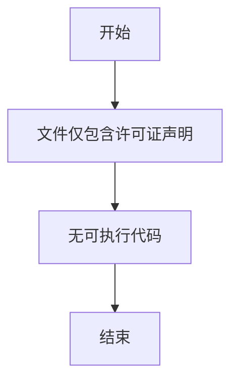

# `graphrag\tests\unit\graphrag_factory\__init__.py` 详细设计文档

该文件仅包含版权声明和MIT许可证声明，没有实际的功能代码实现。

## 整体流程



## 类结构

```
无类结构（代码中未定义任何类）
```

## 全局变量及字段


    

## 全局函数及方法


## 关键组件


### 代码分析说明

由于提供的源代码仅包含版权声明（MIT License），没有实际的代码实现，因此无法从中识别出任何功能性组件。

### 组件分析结果

无

### 关键组件信息

无

### 技术债务或优化空间

无

### 其它说明

要生成完整的详细设计文档，需要提供实际的Python、C++或其他语言的源代码文件。当前输入仅包含文件头注释，不包含任何可分析的代码逻辑、类定义、函数实现或全局变量。

如需继续分析，请提供完整的源代码文件内容。


## 问题及建议


### 已知问题

-   代码仅包含版权声明和许可证声明，缺少实际实现代码，无法进行详细的技术债务或优化空间分析。

### 优化建议

-   请提供完整的代码实现以便进行深入分析。
-   建议在后续代码中添加适当的文档字符串（docstrings）和注释，以提高代码可维护性。
-   建议遵循项目的代码规范和最佳实践。


## 其它


### 一段话描述

该代码文件目前仅包含版权声明和MIT许可证声明，无实际功能实现代码，因此无法提取核心功能描述。根据文件头部信息可知该代码属于Microsoft Corporation于2024年发布的开源项目，采用MIT许可证进行分发。

### 文件的整体运行流程

由于该文件仅包含版权声明信息，不包含任何可执行代码，因此不存在实际的运行流程。

### 类的详细信息

由于该代码文件中不包含任何类定义，因此无法提取类结构信息。

### 类字段和全局变量

由于该代码文件中不包含任何变量定义，因此无法提取字段信息。

### 类方法和全局函数

由于该代码文件中不包含任何函数或方法定义，因此无法提取函数信息。

### 关键组件信息

由于该代码文件中不包含任何功能组件，因此无法提取组件信息。

### 潜在的技术债务或优化空间

由于缺乏实际代码，无法进行技术债务分析。建议在后续补充完整功能代码后进行评估。

### 设计目标与约束

**许可证约束**：代码采用MIT许可证发布，这意味着：

- 允许自由使用、复制、修改、合并、发布、分发、再授权和销售
- 需要包含版权声明和许可证声明
- 软件按"原样"提供，无任何明示或暗示的保证

**法律合规性**：需遵守Microsoft Corporation的知识产权要求

### 错误处理与异常设计

由于无实际代码，无法分析错误处理机制。

### 数据流与状态机

由于无实际代码，无法分析数据流和状态机设计。

### 外部依赖与接口契约

由于无实际代码，无法确定外部依赖和接口契约。

### 配置文件与参数设计

无相关信息可供分析。

### 测试覆盖与质量保障

无相关信息可供分析。

### 性能考量与资源管理

无相关信息可供分析。

### 安全考虑与防护措施

无相关信息可供分析，但由于采用MIT许可证，需要注意：

- 确保代码中不包含违反MIT许可证的第三方代码
- 保留所有版权和许可证声明

### 版本兼容性规划

文件声明为2024年版本，建议后续版本更新时同步更新年份和版本号。

### 部署与运维指南

无相关信息可供分析。

    