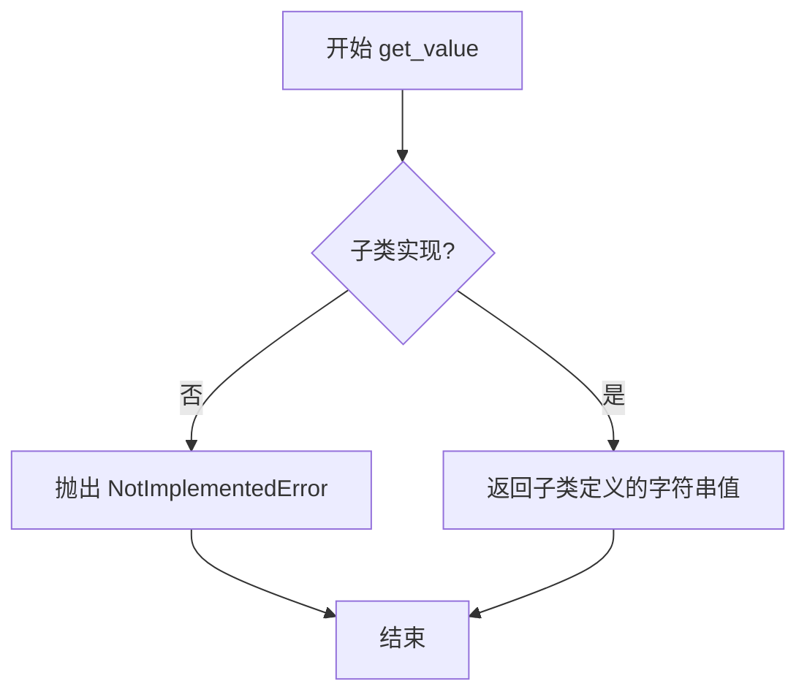
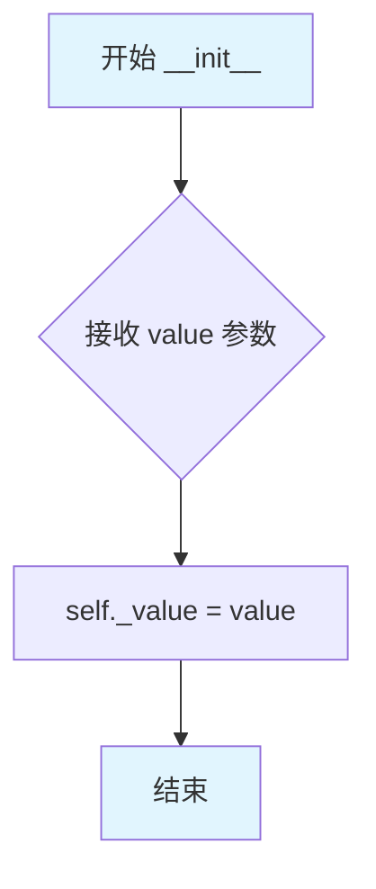
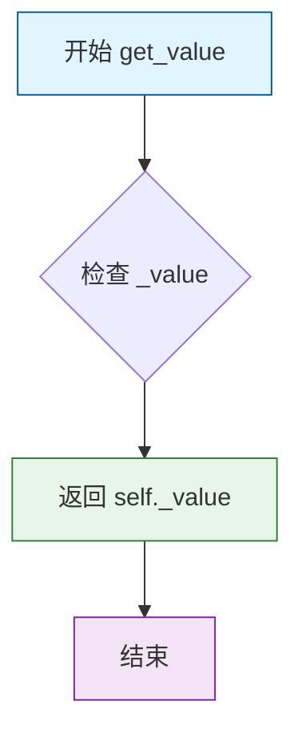
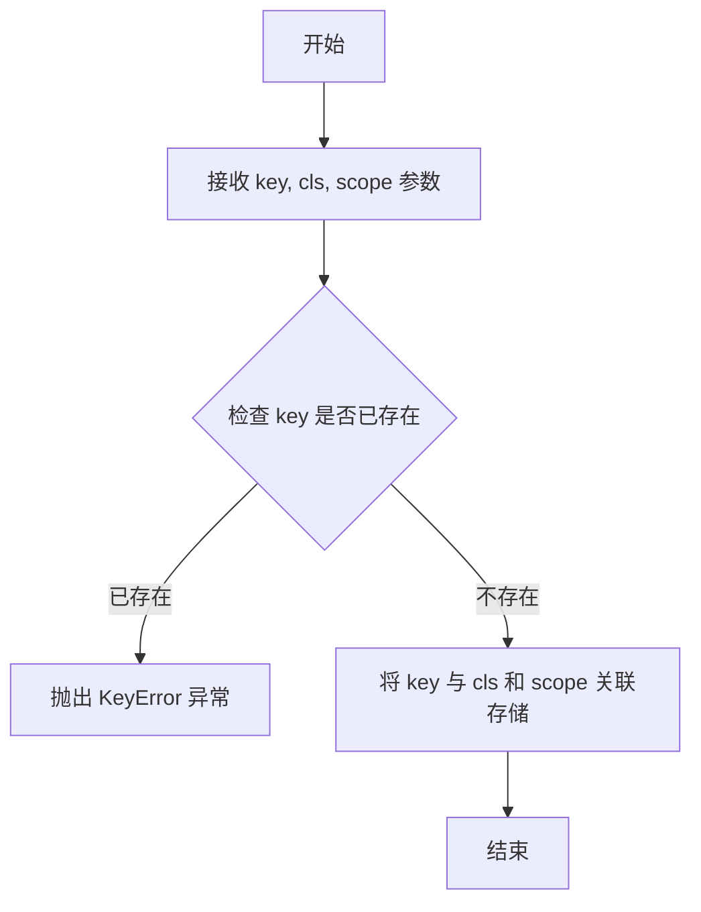
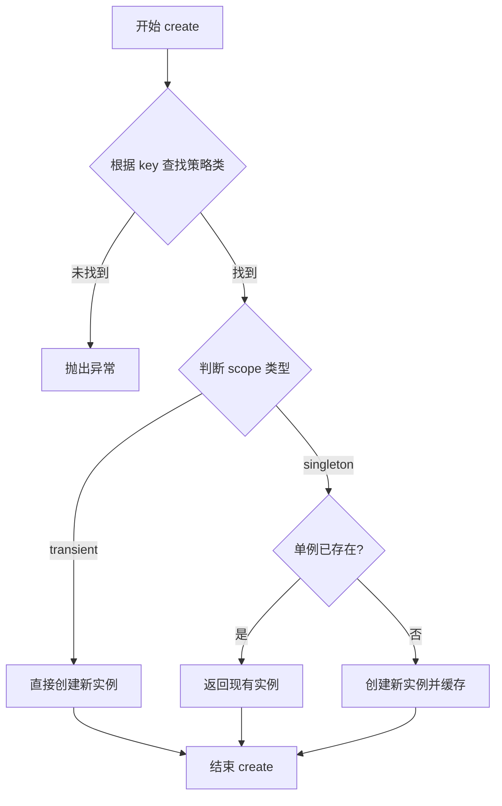

# `graphrag\tests\unit\graphrag_factory\test_factory.py` 详细设计文档

测试graphrag_common包中Factory工厂模式的实现，验证瞬态(transient)和单例(singleton)两种对象创建策略的正确性

## 整体流程

```mermaid
graph TD
    A[开始 test_factory] --> B[实例化TestFactory]
B --> C[注册 transient_strategy: ConcreteTestClass]
C --> D[注册 singleton_strategy: ConcreteTestClass scope=singleton]
D --> E[创建 trans1 = factory.create('transient_strategy')]
E --> F[创建 trans2 = factory.create('transient_strategy')]
F --> G{验证 trans1 is not trans2}
G --> H[验证 trans1.get_value == 'test1']
H --> I[验证 trans2.get_value == 'test2']
I --> J[创建 single1 = factory.create('singleton_strategy')]
J --> K[创建 single2 = factory.create('singleton_strategy')]
K --> L{验证 single1 is single2}
L --> M[验证 single1.get_value == 'singleton']
M --> N[验证 single2.get_value == 'singleton']
N --> O[所有断言通过，测试结束]
```

## 类结构

```
ABC (Python内置)
└── TestABC (抽象基类)
    └── ConcreteTestClass (具体实现类)

Factory<T> (graphrag_common.factory)
└── TestFactory (测试工厂类)
```

## 全局变量及字段


### `ConcreteTestClass._value`
    
私有实例字段，用于存储传入的字符串值

类型：`str`
    
    

## 全局函数及方法


### `test_factory`

该函数通过测试 Factory 类的注册与创建功能，验证了瞬态（transient）和单例（singleton）两种策略的正确性，包括对象的实例隔离、作用域行为以及参数传递。

参数：- 该函数无参数

返回值：`None`，无返回值

#### 流程图

```mermaid
flowchart TD
    A[开始 test_factory] --> B[创建 TestFactory 继承自 Factory[TestABC]]
    B --> C[实例化 factory]
    C --> D[注册 transient_strategy: ConcreteTestClass, scope=默认]
    D --> E[注册 singleton_strategy: ConcreteTestClass, scope=singleton]
    E --> F[创建 trans1: factory.create<br/>参数: {value: test1}]
    F --> G[创建 trans2: factory.create<br/>参数: {value: test2}]
    G --> H{trans1 is not trans2?}
    H -->|True| I[断言通过: trans1.get_value == test1]
    I --> J[断言通过: trans2.get_value == test2]
    J --> K[创建 single1: factory.create<br/>参数: {value: singleton}]
    K --> L[创建 single2: factory.create<br/>参数: {value: singleton}]
    L --> M{single1 is single2?}
    M -->|True| N[断言通过: single1.get_value == singleton]
    N --> O[断言通过: single2.get_value == singleton]
    O --> P[结束 test_factory]
    H -->|False| Q[断言失败]
    M -->|False| R[断言失败]
```

#### 带注释源码

```python
def test_factory() -> None:
    """Test the factory behavior."""
    # 定义一个测试工厂类，继承自泛型 Factory，使用 TestABC 作为产品类型
    class TestFactory(Factory[TestABC]):
        """Test factory for TestABC implementations."""

    # 实例化工厂对象
    factory = TestFactory()
    
    # 注册瞬态策略：每次 create 调用都会创建新的实例
    # 参数: 策略名称, 产品类, scope 默认为 'transient'（瞬态）
    factory.register("transient_strategy", ConcreteTestClass)
    
    # 注册单例策略：同一策略名称多次 create 仅返回同一个实例
    # 参数: 策略名称, 产品类, scope='singleton' 指定为单例模式
    factory.register("singleton_strategy", ConcreteTestClass, scope="singleton")

    # 通过瞬态策略创建两个实例，传入不同的参数
    trans1 = factory.create("transient_strategy", {"value": "test1"})
    trans2 = factory.create("transient_strategy", {"value": "test2"})

    # 验证瞬态模式：两次创建返回不同对象（不是同一引用）
    assert trans1 is not trans2
    # 验证瞬态实例正确使用传入的参数
    assert trans1.get_value() == "test1"
    assert trans2.get_value() == "test2"

    # 通过单例策略创建两个实例，传入相同参数
    single1 = factory.create("singleton_strategy", {"value": "singleton"})
    single2 = factory.create("singleton_strategy", {"value": "singleton"})

    # 验证单例模式：两次创建返回同一对象（同一引用）
    assert single1 is single2
    # 验证单例实例正确使用传入的参数
    assert single1.get_value() == "singleton"
    assert single2.get_value() == "singleton"
```


### `TestABC.get_value`

获取字符串值（抽象方法，由子类实现具体逻辑）

参数：

- 无

返回值：`str`，返回一个字符串值

#### 流程图



#### 带注释源码

```python
@abstractmethod
def get_value(self) -> str:
    """
    获取一个字符串值。

    Returns
    -------
        str: 一个字符串值。
    """
    # 错误消息：子类必须实现 get_value 方法
    msg = "Subclasses must implement the get_value method."
    # 抛出 NotImplementedError 异常，提示子类未实现该抽象方法
    raise NotImplementedError(msg)
```

---

### 补充说明

| 项目 | 说明 |
|------|------|
| **所属类** | `TestABC`（抽象基类） |
| **方法类型** | 抽象方法（`@abstractmethod`） |
| **设计目的** | 定义一个接口，要求子类必须实现返回字符串值的逻辑 |
| **技术债务** | 该抽象方法仅作为接口定义，实际功能由 `ConcreteTestClass` 等子类实现，当前实现仅抛出异常，缺乏更有意义的默认行为或文档示例 |


### `ConcreteTestClass.__init__`

构造函数，用于初始化 `ConcreteTestClass` 实例，接受一个字符串参数并将其存储为实例变量。

参数：

-  `value`：`str`，要存储的字符串值

返回值：`None`，构造函数没有显式返回值，隐式返回 `None`

#### 流程图



#### 带注释源码

```python
def __init__(self, value: str):
    """Initialize with a string value.
    
    Parameters
    ----------
    value : str
        A string value to be stored in the instance.
    """
    self._value = value  # 将传入的字符串参数赋值给实例变量 _value
```


### `ConcreteTestClass.get_value`

获取存储在当前对象中的字符串值。

参数：

- （无参数）

返回值：`str`，返回初始化时传入的字符串值。

#### 流程图



#### 带注释源码

```python
def get_value(self) -> str:
    """Get a string value.

    Returns
    -------
        str: A string value.
    """
    # 返回在初始化时存储的字符串值
    # 该值通过构造函数的 value 参数设置
    return self._value
```


### TestFactory.register

将类注册到工厂中，并可选择指定作用域（transient 表示每次创建新实例，singleton 表示单例模式）。

参数：

-  `key`：`str`，用于在工厂中标识类的唯一键名
-  `cls`：`type`，要注册的类类型，必须是 TestABC 的子类
-  `scope`：`str`，可选，作用域，默认为 "transient"；"singleton" 表示单例模式

返回值：`None`，无返回值

#### 流程图



#### 带注释源码

```python
def register(self, key: str, cls: type, scope: str = "transient") -> None:
    """
    在工厂中注册一个类。
    
    参数:
        key: 注册表中的唯一标识符，用于后续 create 时查找
        cls: 要注册的类类型，必须是基类 TestABC 的实现
        scope: 作用域，可选，默认为 "transient"；"singleton" 表示单例模式
    
    返回:
        None: 此方法不返回值
    
    异常:
        KeyError: 如果 key 已经存在于注册表中
    """
    # 检查是否已存在同名的注册项
    if key in self._registry:
        # 如果已存在则抛出异常，防止覆盖
        raise KeyError(f"Key '{key}' is already registered.")
    
    # 将类及其作用域存储到注册表中
    # _registry 是一个字典，键为 key，值为 (cls, scope) 元组
    self._registry[key] = (cls, scope)
```


### TestFactory.create

描述：TestFactory 类继承自通用 Factory 模板类，通过 create 方法根据传入的 key 查找对应的策略类并实例化。根据注册时指定的 scope 参数（默认为 "transient"），决定每次调用 create 是创建新实例还是返回已存在的单例实例。

参数：

- `key`：`str`，要创建的对象对应的策略标识符，必须是已通过 register 方法注册的键名
- `kwargs`：`dict`，传递给策略类构造函数的参数字典，将作为关键字参数传给被实例化的类

返回值：`object`，返回策略类（TestABC）的实例对象，具体类型取决于注册时绑定的类

#### 流程图



#### 带注释源码

```python
def create(self, key: str, kwargs: dict) -> object:
    """
    根据 key 创建或获取已注册的策略类实例。

    Parameters
    ----------
    key : str
        策略标识符，对应 register 时传入的键名
    kwargs : dict
        传递给策略类构造函数的参数字典

    Returns
    -------
    object
        策略类的实例对象
    """
    # 1. 获取策略类和对应的 scope 配置
    strategy_cls, scope = self._strategies.get(key)
    
    if scope == "singleton":
        # 2. 如果是单例模式，检查缓存中是否已有实例
        if key not in self._instances:
            # 3. 不存在则创建新实例并缓存
            self._instances[key] = strategy_cls(**kwargs)
        # 4. 返回缓存的单例实例
        return self._instances[key]
    else:
        # 5. 如果是瞬态模式，每次都创建新实例
        return strategy_cls(**kwargs)
```

## 关键组件


### 抽象基类 (TestABC)

定义抽象接口，约束具体实现类必须实现 get_value 方法，作为工厂创建对象的类型契约

### 具体实现类 (ConcreteTestClass)

实现抽象基类，封装字符串值，提供 get_value 方法返回存储的值

### 工厂类 (TestFactory)

继承通用工厂基类，管理类的注册与实例创建，支持瞬态和单例两种创建策略

### 工厂注册机制 (register 方法)

将类与标识符关联，支持指定作用域（瞬态或单例），决定对象的生命周期管理方式

### 工厂创建机制 (create 方法)

根据注册标识符和初始化参数创建实例，瞬态策略每次返回新对象，单例策略返回同一对象

### 瞬态策略 (transient_strategy)

每次调用 create 时创建新的对象实例，不同调用返回不同对象引用

### 单例策略 (singleton_strategy)

首次调用 create 时创建实例，后续调用返回同一实例，全局共享同一对象


## 问题及建议


### 已知问题

- **测试辅助类与测试代码混合**：TestABC 和 ConcreteTestClass 作为测试辅助类定义在测试文件中，这些类应该作为 mock 或 fixture 单独管理，便于复用
- **缺少工厂异常情况测试**：未测试工厂在未注册策略、重复注册策略、创建时缺少必要参数等异常场景下的行为
- **依赖外部 Factory 实现**：代码引用了 `graphrag_common.factory.Factory`，但未展示其接口定义，导致测试文件不完整且难以独立运行
- **魔法字符串未提取**：scope 参数使用的 "singleton" 字符串应定义为常量或枚举，避免硬编码和拼写错误风险
- **测试用例缺乏边界验证**：未验证工厂在空参数字典、None 值、错误类型参数等情况下的容错能力
- **文档字符串冗余**：get_value 方法的 docstring 与基类中的定义重复，可通过继承或省略避免

### 优化建议

- 将 TestABC 和 ConcreteTestClass 移至独立的 mock 模块或 conftest.py 中，使用 pytest fixtures 提供
- 添加异常场景测试用例：测试 KeyError（策略不存在）、ValueError（参数错误）、重复注册覆盖等边界条件
- 使用 Enum 定义 scope 参数的可选值（如 Scope.TRANSIENT、Scope.SINGLETON），提高类型安全和可读性
- 补充参数化测试（@pytest.mark.parametrize），覆盖不同参数组合和边界值
- 考虑添加性能测试，验证单例模式下多次创建的开销是否真正被优化

## 其它


### 设计目标与约束

本代码演示了工厂模式（Factory Pattern）的实现，主要目标是通过注册机制动态创建对象实例。约束包括：1）必须继承自抽象基类 TestABC；2）支持两种生命周期策略：transient（每次创建新实例）和singleton（单例模式）；3）工厂类使用泛型类型参数确保类型安全。

### 错误处理与异常设计

当调用未注册的策略名称时，Factory 类应抛出 KeyError 异常。当创建实例所需参数不足或类型错误时，应抛出 TypeError 异常。抽象方法 get_value() 的实现类未重写时抛出 NotImplementedError 异常。

### 外部依赖与接口契约

依赖 graphrag_common.factory 模块中的 Factory 基类。Factory 基类需提供 register(name, cls, scope) 方法用于注册类，create(name, kwargs) 方法用于创建实例。TestABC 抽象基类定义了 get_value() -> str 的接口契约。

### 性能考虑

singleton 策略使用字典缓存实例，避免重复创建对象。transient 策略每次调用 create 都创建新实例，可能带来一定的内存分配开销。在高频调用场景下，应优先使用 singleton 策略。

### 安全性考虑

代码本身不涉及敏感数据处理，但工厂模式可扩展用于依赖注入场景，需确保注册的是可信的类实现，防止恶意类注入。

### 可扩展性设计

可通过继承 Factory 基类实现自定义工厂类。当前支持 scope="transient"（默认）和 scope="singleton" 两种生命周期，可扩展支持其他策略如 scope="scoped"（请求级别单例）。

### 测试策略

test_factory() 函数展示了完整的测试用例，包括：1）transient 策略每次创建新实例的验证；2）singleton 策略返回同一实例的验证；3）实例方法调用返回正确值的验证。建议补充异常场景测试，如创建未注册的策略。

### 限制和边界条件

Factory 的 create 方法 kwargs 参数必须与目标类的 __init__ 参数完全匹配。singleton 策略的实例在首次创建后会被永久缓存，直到工厂实例被销毁。不支持带参数的构造函数用于 singleton 策略的实例化（首次创建后参数被忽略）。

### 并发考虑

当前代码未实现线程安全机制。在多线程环境下，singleton 策略的实例创建和缓存可能存在竞态条件，建议使用线程锁保护实例缓存的读写操作。

### 资源管理

singleton 策略的实例会一直保留在内存中直到工厂实例被销毁。如果实例包含外部资源（如数据库连接），建议提供显式的清理方法或在工厂析构时释放资源。

### 版本兼容性

代码使用了 Python 3.9+ 的泛型语法（Factory[TestABC]）。Python 版本要求取决于 graphrag_common.factory 模块的实现。类型注解使用 Python 3.9+ 的内置泛型支持。


    