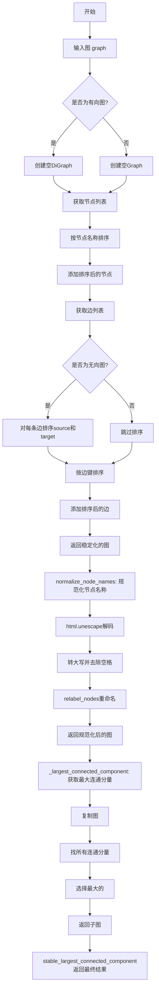
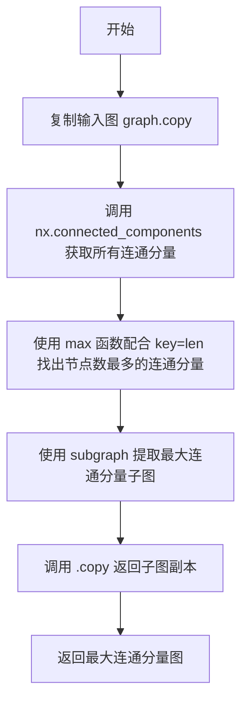
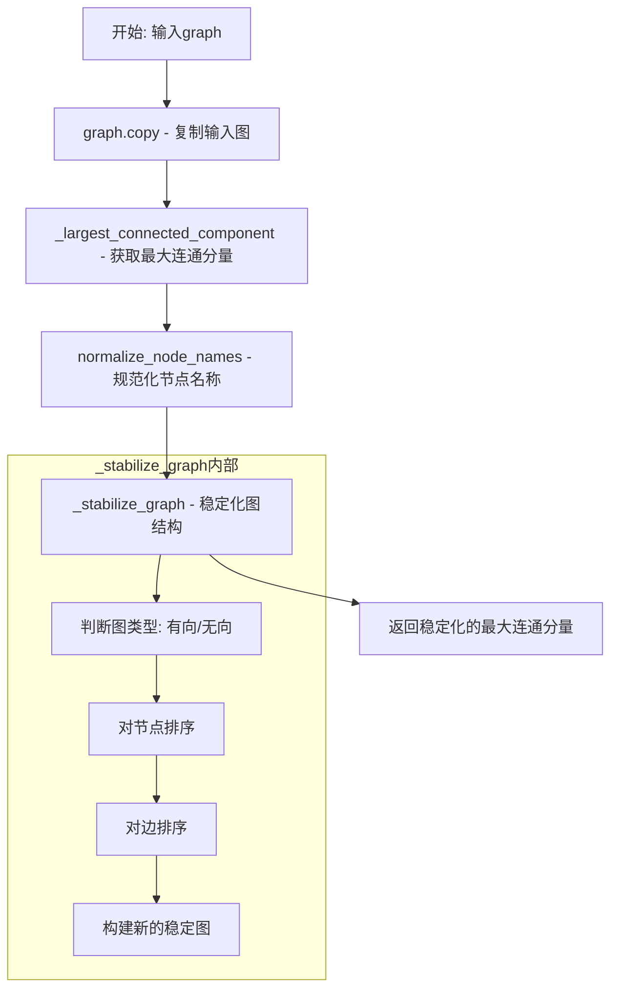
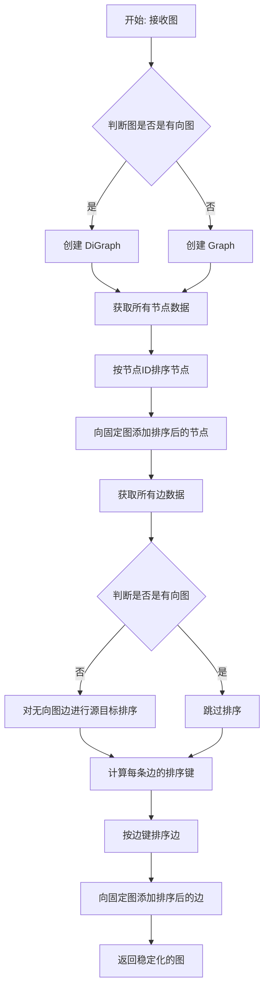

# `graphrag\tests\unit\graphs\nx_stable_lcc.py` 详细设计文档

基于NetworkX的稳定最大连通分量(LCC)工具，通过规范化节点名称和稳定排序边节点顺序，确保相同关系的图总是以相同方式被读取，主要用于与DataFrame实现的stable_lcc进行并排测试比较。

## 整体流程



## 类结构

```
无类定义 (基于函数的模块)
```

## 全局变量及字段


### `html`
    
Python HTML处理模块，用于HTML实体解码

类型：`module`
    


### `nx`
    
NetworkX图库，提供图数据结构和算法

类型：`module`
    


### `Any`
    
typing模块中的Any类型，表示任意类型

类型：`type`
    


### `cast`
    
typing模块中的类型强制转换函数

类型：`function`
    


    

## 全局函数及方法


### `_largest_connected_component`

返回图的最大连通分量（基于NetworkX实现）。

参数：

- `graph`：`nx.Graph`，输入的NetworkX无向图

返回值：`nx.Graph`，返回原图的最大连通分量（子图）

#### 流程图



#### 带注释源码

```python
def _largest_connected_component(graph: nx.Graph) -> nx.Graph:
    """Return the largest connected component of the graph (NX-based)."""
    # 复制输入图，避免修改原始图数据
    graph = graph.copy()
    # 使用NetworkX的connected_components获取图中所有连通分量（返回迭代器）
    # 每个连通分量是一个包含节点集合的集合
    lcc_nodes = max(nx.connected_components(graph), key=len)
    # 使用subgraph方法提取最大连通分量的节点，生成子图
    # 最后调用copy()返回一个新的图对象，确保返回的是独立副本
    return graph.subgraph(lcc_nodes).copy()
```


### `stable_largest_connected_component`

返回图的最大连通分量，并对节点和边进行稳定化排序，确保具有相同关系的图始终以相同方式读取。

参数：

- `graph`：`nx.Graph`，输入的NetworkX无向图或有权图

返回值：`nx.Graph`，经过规范化节点名称和稳定化排序后的最大连通分量

#### 流程图



#### 带注释源码

```python
def stable_largest_connected_component(graph: nx.Graph) -> nx.Graph:
    """Return the largest connected component of the graph, with nodes and edges sorted in a stable way."""
    # 步骤1: 复制输入图，避免修改原始图
    graph = graph.copy()
    
    # 步骤2: 调用内部函数获取最大连通分量(LCC)
    # 使用NetworkX的连通分量算法，找到节点数最多的连通子图
    graph = cast("nx.Graph", _largest_connected_component(graph))
    
    # 步骤3: 规范化节点名称
    # 将节点名转换为HTML未转义的大写形式，并去除首尾空格
    # 例如: "&lt;node&gt;" -> "NODE"
    graph = normalize_node_names(graph)
    
    # 步骤4: 稳定化图结构
    # 确保相同拓扑关系的图总是以相同的方式序列化和读取
    return _stabilize_graph(graph)
```


### `_stabilize_graph`

确保无向图（或有向图）以一致的方式读取，即使输入图的节点和边顺序不同，输出图也会保持相同的顺序，从而保证图的处理结果可复现。

参数：

- `graph`：`nx.Graph`，输入的 NetworkX 图对象

返回值：`nx.Graph`，稳定化后的图对象，其节点和边按字母顺序排序

#### 流程图



#### 带注释源码

```python
def _stabilize_graph(graph: nx.Graph) -> nx.Graph:
    """Ensure an undirected graph with the same relationships will always be read the same way."""
    # 根据原图是否是有向图，创建对应类型的新图
    # 有向图用DiGraph，无向图用Graph
    fixed_graph = nx.DiGraph() if graph.is_directed() else nx.Graph()

    # 获取图的节点及其数据，节点是NetworkX图中的元素
    sorted_nodes = graph.nodes(data=True)
    # 按节点ID（键）进行排序，确保节点顺序一致
    sorted_nodes = sorted(sorted_nodes, key=lambda x: x[0])

    # 将排序后的节点添加到新图中，保留节点属性
    fixed_graph.add_nodes_from(sorted_nodes)
    
    # 获取所有边及其数据
    edges = list(graph.edges(data=True))

    # 如果是无向图，需要确保边的两端节点顺序一致
    # 例如：边(A, B)和边(B, A)应该被视为同一条边
    if not graph.is_directed():

        def _sort_source_target(edge):
            """将边的源节点和目标节点按字母顺序排列"""
            source, target, edge_data = edge
            # 如果源节点大于目标节点，则交换位置
            if source > target:
                temp = source
                source = target
                target = temp
            # 返回排序后的边
            return source, target, edge_data

        # 对所有边进行源目标排序
        edges = [_sort_source_target(edge) for edge in edges]

    def _get_edge_key(source: Any, target: Any) -> str:
        """生成边的排序键，格式为'source -> target'"""
        return f"{source} -> {target}"

    # 按边的键进行排序，确保边顺序一致
    edges = sorted(edges, key=lambda x: _get_edge_key(x[0], x[1]))

    # 将排序后的边添加到固定图中
    fixed_graph.add_edges_from(edges)
    # 返回稳定化后的图
    return fixed_graph
```


### `normalize_node_names`

该函数用于规范化 NetworkX 图中所有节点的名称，通过 HTML 解码、大写转换和去除首尾空格来统一节点名称格式。

参数：

- `graph`：`nx.Graph | nx.DiGraph`，输入的 NetworkX 图对象，可以是有向图或无向图

返回值：`nx.Graph | nx.DiGraph`，节点名称规范化后的图（类型与输入图保持一致）

#### 流程图

```mermaid
flowchart TD
    A[开始 normalize_node_names] --> B[遍历图的所有节点]
    B --> C[为每个节点创建映射规则: html.unescape(node.upper().strip())]
    C --> D[调用nx.relabel_nodes重新标记节点]
    D --> E[返回规范化后的图]
```

#### 带注释源码

```python
def normalize_node_names(graph: nx.Graph | nx.DiGraph) -> nx.Graph | nx.DiGraph:
    """Normalize node names."""
    # 创建一个节点映射字典，遍历图中的所有节点
    # 对每个节点应用三个转换：
    # 1. strip() - 去除首尾空格
    # 2. upper() - 转换为大写
    # 3. html.unescape() - 解码 HTML 实体（如 &amp; -> &）
    node_mapping = {node: html.unescape(node.upper().strip()) for node in graph.nodes()}  # type: ignore
    # 使用 NetworkX 的 relabel_nodes 函数根据映射字典重新标记节点
    return nx.relabel_nodes(graph, node_mapping)
```

## 关键组件


### 稳定最大连通分量计算组件

该组件提供基于NetworkX的图连通分量计算功能，通过节点名称规范化和边排序确保相同图结构始终产生一致的输出结果，主要用于与DataFrame实现进行对比测试。

### _largest_connected_component 函数

使用NetworkX的connected_components和max函数计算图的最大连通分量，并返回包含该连通分量的子图副本。

### stable_largest_connected_component 函数

主入口函数，返回最大连通分量且节点和边经过稳定化排序处理，确保图的读取顺序一致。

### _stabilize_graph 函数

通过规范化节点排序、有向边源目标顺序、边排序等方式确保无向图和有向图在相同关系下始终以相同方式读取，实现图的稳定性。

### normalize_node_names 节点名称规范化组件

使用html.unescape解码HTML实体并将节点名称转换为大写且去除首尾空格，实现节点名称的标准化处理。

### NetworkX 图操作组件

基于NetworkX库进行图复制、子图提取、节点重命名、有向图/无向图类型转换等底层图操作。


## 问题及建议


### 已知问题

-   **遗留代码**：代码注释明确说明"production code no longer uses it"，该模块仅为与DataFrame版本的对比测试而保留，继续维护已不在生产环境中使用的代码会增加长期维护负担
-   **类型转换妥协**：在`stable_largest_connected_component`中使用`cast("nx.Graph", ...)`绕过了类型检查，表明对类型系统做出了妥协
-   **未使用的导入**：`from typing import Any, cast`中导入了`Any`，虽然参数类型使用了隐式`Any`，但显式注解会更好
-   **函数嵌套定义**：`_sort_source_target`和`_get_edge_key`函数在`if`块内部定义，这种嵌套定义降低了代码可读性和可测试性
-   **缺少输入验证**：函数没有对`graph`参数进行None检查或有效性验证，可能导致运行时错误
-   **多次图复制**：在`stable_largest_connected_component`中调用了`graph.copy()`，之后在`_largest_connected_component`和`_stabilize_graph`中又各自复制，导致不必要的内存开销
-   **节点排序效率**：在`_stabilize_graph`中使用`sorted()`对节点和边进行排序，时间复杂度为O(n log n)，对于大型图可能存在性能瓶颈

### 优化建议

-   **移除或归档**：如果对比测试不再需要，建议移除此代码或将其移至单独的废弃代码仓库
-   **重构类型安全**：移除`cast`调用，通过重构逻辑确保类型正确，或使用泛型
-   **提取嵌套函数**：将`_sort_source_target`和`_get_edge_key`提升到模块级别作为私有函数
-   **添加输入验证**：在每个公开函数入口添加`graph is not None`和图类型检查
-   **优化复制策略**：仅在必要时复制图，考虑使用`copy=False`参数并显式管理可变状态
-   **改进文档**：为`_stabilize_graph`等内部函数添加完整的Google风格docstring
-   **性能优化**：对于超大规模图，考虑使用更高效的排序算法或延迟排序到需要时再执行

## 其它


### 设计目标与约束

**设计目标**：提供一个稳定、可重现的最大连通分量（Stable Largest Connected Component）计算工具，确保相同的图结构无论何时运行都产生完全一致的输出结果，用于测试对比和图索引场景。

**设计约束**：

- 仅支持NetworkX的Graph和DiGraph对象
- 节点名称必须可转换为字符串（用于排序和HTML解码）
- 图的邻接关系必须是无向的才能进行连通分量计算（除非先提取连通分量）
- 保持对原有API的兼容性以支持side-by-side测试对比

### 错误处理与异常设计

**异常处理机制**：

- 代码依赖NetworkX内置的异常处理，当传入无效图对象时，NetworkX方法会抛出`nx.NetworkXError`或相关子类异常
- 对于空图输入，`max()`函数在空迭代器上会抛出`ValueError`，但由于`_largest_connected_component`内部使用`max(nx.connected_components(graph), key=len)`，空图会返回空集，逻辑上可处理
- 节点名称的HTML转义字符解码使用`html.unescape`，对无效的HTML实体会引发`html.HTMLParseError`（Python 3.5及之前版本）或静默保留原字符

**错误传播策略**：异常向上层调用者传播，由调用方决定如何处理，工具函数本身不进行额外的异常捕获和恢复。

### 数据流与状态机

**数据流转过程**：

```
输入图(nx.Graph/nx.DiGraph)
    ↓
[复制原图] → 避免修改原始输入
    ↓
[提取LCC] → 使用NetworkX的connected_components获取所有连通分量，取最大者
    ↓
[节点名规范化] → 对每个节点名进行HTML解码并转换为大写
    ↓
[图稳定化] → 排序节点、排序边、确保无向图边顺序一致
    ↓
输出稳定化的LCC图
```

**状态转换**：无状态设计，每次调用独立处理，不维护内部状态。

### 外部依赖与接口契约

**外部依赖**：

- `networkx` (nx)：图数据结构和算法库
- `html`：Python标准库，用于HTML实体解码
- `typing`：Python标准库，类型提示

**公开接口契约**：

- `stable_largest_connected_component(graph: nx.Graph) -> nx.Graph`：输入任意Graph，返回最大连通分量且节点边排序稳定的Graph
- `normalize_node_names(graph: nx.Graph | nx.DiGraph) -> nx.Graph | nx.DiGraph`：输入图，返回节点名规范化后的同类型图

**接口约束**：

- 输入图对象必须实现NetworkX图接口协议
- 节点必须可迭代且可作为字典键（字符串化后用于排序）

### 性能特征与复杂度分析

**时间复杂度**：

- 提取连通分量：O(V + E)，其中V为节点数，E为边数
- 节点排序：O(V log V)
- 边排序：O(E log E)
- 节点名规范化：O(V × N)，N为平均节点名长度
- 总体：O(V log V + E log E)

**空间复杂度**：

- 复制图：O(V + E)
- 稳定化过程：O(V + E)
- 总体：O(V + E)

**性能特征**：适用于中小规模图（数千至数万个节点），大规模图（百万级）需考虑性能优化。

### 使用场景与调用上下文

**主要使用场景**：

- GraphRAG图索引流程中的数据预处理
- 测试框架中的确定性输出对比
- 数据管道中确保图数据一致性
- 作为遗留代码用于与新实现进行side-by-side测试对比

**调用上下文**：

- 被`graphrag.index.utils.stable_lcc`引用（现已被DataFrame-based实现替代）
- 可直接导入使用：`from graphrag.model.utils.stable_lcc import stable_largest_connected_component`

### 边界条件与输入验证

**边界条件处理**：

- 空图输入：返回空图（无节点无边）
- 单节点图：返回该节点（无自环情况下）
- 多连通分量图：仅保留最大连通分量
- 自环处理：保留自环，但稳定化时边的源目标排序逻辑不影响自环
- 有向图输入：`_largest_connected_component`内部调用`nx.connected_components`会将有向图视为无向图处理
- 重复节点名：规范化后可能产生重复节点名（如果节点名仅在大小写或HTML实体上有差异），`nx.relabel_nodes`会静默处理冲突

**输入验证缺失**：代码未对输入类型进行显式验证，依赖NetworkX的隐式类型检查。


    