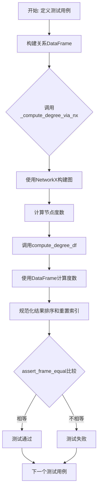
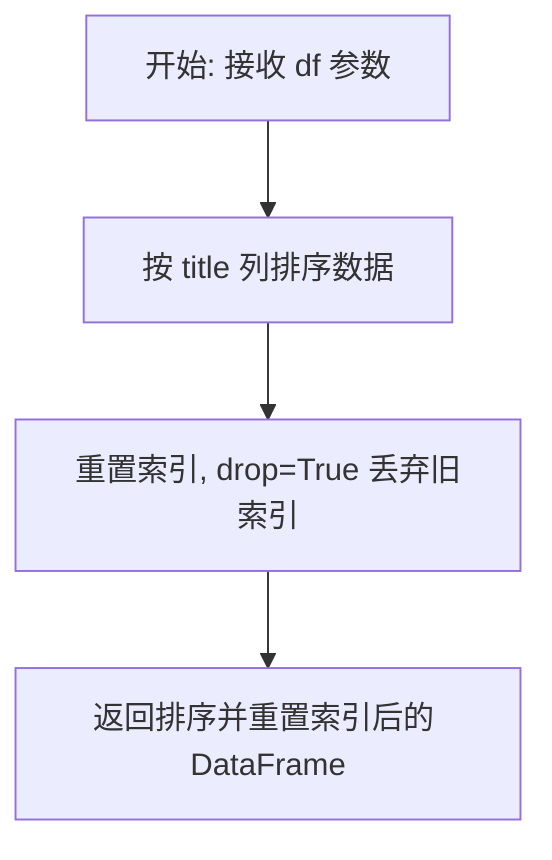
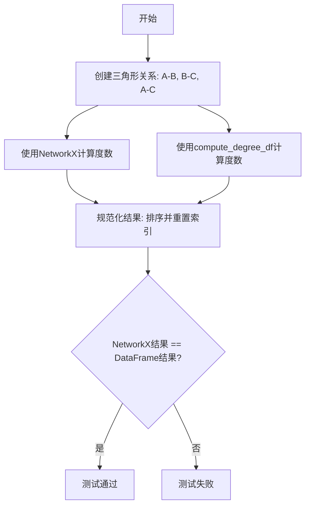
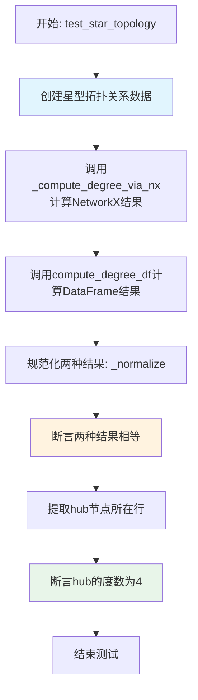
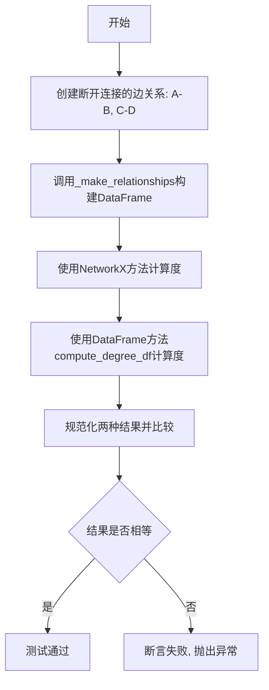
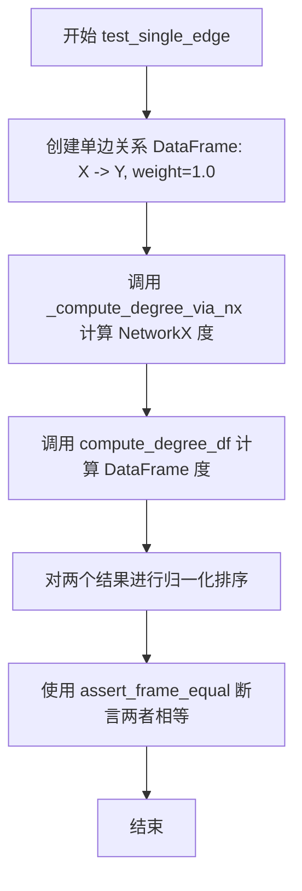
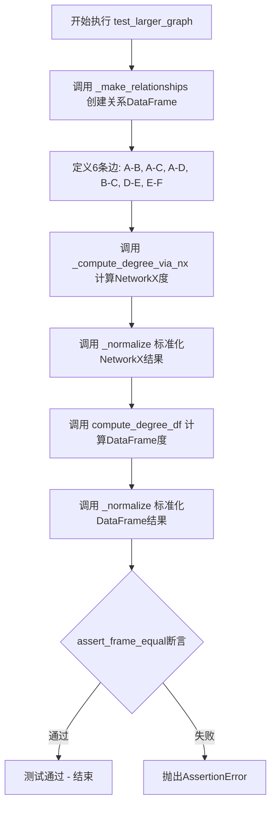
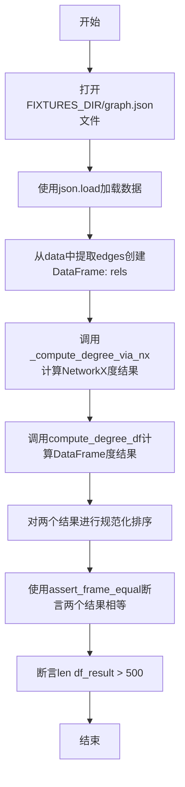

# `graphrag\tests\unit\graphs\test_compute_degree.py` 详细设计文档

该文件是GraphRAG项目中用于测试图节点度数计算功能的测试套件，通过对比NetworkX原生的compute_degree方法与DataFrame实现的compute_degree_df方法，验证两种计算方式在各种图结构（三角形、星型、断开连接、自环、重复边等）下结果的一致性。

## 整体流程



## 类结构

```
测试模块 (无类)
├── 辅助函数
│   ├── _make_relationships
│   ├── _normalize
│   └── _compute_degree_via_nx
└── 测试函数
    ├── test_simple_triangle
    ├── test_star_topology
    ├── test_disconnected_components
    ├── test_single_edge
    ├── test_self_loop
    ├── test_duplicate_edges
    ├── test_larger_graph
    └── test_fixture_graph
```

## 全局变量及字段


### `FIXTURES_DIR`
    
测试fixtures目录路径，指向包含graph.json的fixtures文件夹

类型：`Path`
    


    

## 全局函数及方法


### `_make_relationships`

构建关系 DataFrame 的辅助函数，接收可变数量的边元组（源节点、目标节点、权重），并将其转换为包含 source、target、weight 三列的 Pandas DataFrame，用于后续图计算测试。

参数：

- `*edges`：`tuple[str, str, float]`，可变数量的边元组，每个元组包含 (source, target, weight)，分别表示源节点、目标节点和边的权重

返回值：`pd.DataFrame`，包含三列（source、target、weight）的关系数据表

#### 流程图

```mermaid
flowchart TD
    A[开始 _make_relationships] --> B{接收 edges 元组}
    B --> C[遍历每个边元组]
    C --> D[解包: s=源节点, t=目标节点, w=权重]
    D --> E[构建字典 {'source': s, 'target': t, 'weight': w}]
    E --> F{是否还有更多边元组?}
    F -->|是| C
    F -->|否| G[将字典列表转换为 DataFrame]
    G --> H[返回 DataFrame]
    
    style A fill:#f9f,stroke:#333
    style H fill:#9f9,stroke:#333
```

#### 带注释源码

```python
def _make_relationships(*edges: tuple[str, str, float]) -> pd.DataFrame:
    """Build a relationships DataFrame from (source, target, weight) tuples.
    
    Args:
        *edges: 可变数量的边元组，每个元组为 (source: str, target: str, weight: float)
                source - 边的起始节点
                target - 边的终止节点  
                weight - 边的权重值
    
    Returns:
        pd.DataFrame: 包含三列的关系数据表
            - source: 源节点列
            - target: 目标节点列
            - weight: 边权重列
    
    Example:
        >>> rels = _make_relationships(("A", "B", 1.0), ("B", "C", 2.0))
        >>> print(rels)
          source target  weight
        0      A      B     1.0
        1      B      C     2.0
    """
    # 使用列表推导式将每个边元组转换为字典
    # 字典键对应 DataFrame 的列名
    return pd.DataFrame([{"source": s, "target": t, "weight": w} for s, t, w in edges])
```


### `_normalize`

排序并重置索引的辅助函数，用于在比较两个 DataFrame（如 NetworkX 和 DataFrame 版本的计算结果）之前对它们进行标准化处理，确保测试的公平性。

参数：

- `df`：`pd.DataFrame`，需要排序和重置索引的输入 DataFrame

返回值：`pd.DataFrame`，按 "title" 列排序并重置索引后的 DataFrame

#### 流程图



#### 带注释源码

```python
def _normalize(df: pd.DataFrame) -> pd.DataFrame:
    """Sort by title and reset index for comparison."""
    # 首先按 "title" 列进行升序排序
    sorted_df = df.sort_values("title")
    # 重置索引并将旧索引丢弃（不保留为列）
    # 这样确保不同次排序后的 DataFrame 索引一致，便于比较
    return sorted_df.reset_index(drop=True)
```


### `_compute_degree_via_nx`

使用 NetworkX 直接从关系数据框计算图中各节点的度数，并返回包含节点标题和度数的 DataFrame。

参数：

- `relationships`：`pd.DataFrame`，包含 "source"、"target" 和 "weight" 列的关系数据表

返回值：`pd.DataFrame`，包含 "title"（节点标识）和 "degree"（节点度数）列的数据表

#### 流程图

```mermaid
flowchart TD
    A[输入: relationships DataFrame] --> B[调用 nx.from_pandas_edgelist 构建图]
    B --> C[使用 graph.degree 获取所有节点度数]
    C --> D[将度数组装为 {'title': node, 'degree': int} 字典列表]
    D --> E[转换为 DataFrame]
    E --> F[返回 DataFrame]
```

#### 带注释源码

```python
def _compute_degree_via_nx(relationships: pd.DataFrame) -> pd.DataFrame:
    """Compute degree using NetworkX directly.
    
    使用 NetworkX 库直接计算图中各节点的度数。
    该函数是测试中的辅助函数，用于与 DataFrame 方式的 compute_degree_df 进行结果比对。
    
    参数:
        relationships: pd.DataFrame - 包含边的 DataFrame，需包含 'source', 'target', 'weight' 列
    
    返回:
        pd.DataFrame - 包含 'title' (节点标识) 和 'degree' (整数度数) 两列的 DataFrame
    """
    # 使用 NetworkX 的 from_pandas_edgelist 从 DataFrame 创建无向图
    # source: 源节点列名
    # target: 目标节点列名
    # edge_attr: 需要包含的边属性列表 (此处为 weight)
    graph = nx.from_pandas_edgelist(
        relationships, source="source", target="target", edge_attr=["weight"]
    )
    
    # graph.degree 返回一个 DegreeView 对象，包含 (node, degree) 元组的迭代器
    # 遍历每个节点及其度数，构建结果列表
    # 将 degree 转换为 int 类型以确保输出为整数
    return pd.DataFrame([
        {"title": node, "degree": int(degree)} for node, degree in graph.degree
    ])
```


### `test_simple_triangle`

测试三角形图结构，验证在三个节点（A、B、C）形成三角形时，DataFrame方式的度数计算结果与NetworkX的度数计算结果一致，每个节点的度数应为2。

参数： 无

返回值： `None`，测试函数无返回值，通过断言验证正确性

#### 流程图



#### 带注释源码

```python
def test_simple_triangle():
    """Three nodes forming a triangle — each should have degree 2."""
    # 构建三角形关系：节点A-B、B-C、A-C之间各有连接
    rels = _make_relationships(
        ("A", "B", 1.0),  # 边: A -> B, 权重1.0
        ("B", "C", 1.0),  # 边: B -> C, 权重1.0
        ("A", "C", 1.0),  # 边: A -> C, 权重1.0
    )
    
    # 使用NetworkX计算每个节点的度数
    nx_result = _normalize(_compute_degree_via_nx(rels))
    
    # 使用DataFrame方式计算每个节点的度数
    df_result = _normalize(compute_degree_df(rels))
    
    # 断言两种方法计算结果完全一致
    # 在三角形中，每个节点的度数都应为2
    assert_frame_equal(nx_result, df_result)
```


### `test_star_topology`

测试星型拓扑结构：验证在以一个中心节点（hub）连接多个叶子节点（a、b、c、d）的星型图结构中，基于DataFrame的度数计算方法 `compute_degree_df` 与NetworkX的度数计算结果一致，且hub节点的度数为4。

参数：

- 该函数无参数

返回值：`None`，测试函数无返回值，通过断言验证逻辑正确性

#### 流程图



#### 带注释源码

```python
def test_star_topology():
    """One hub connected to many leaves."""
    # 创建星型拓扑关系数据：hub节点连接四个叶子节点a、b、c、d
    # 每条边的权重均为1.0
    rels = _make_relationships(
        ("hub", "a", 1.0),
        ("hub", "b", 1.0),
        ("hub", "c", 1.0),
        ("hub", "d", 1.0),
    )
    # 使用NetworkX计算度数作为参考实现
    nx_result = _normalize(_compute_degree_via_nx(rels))
    # 使用DataFrame方法计算度数
    df_result = _normalize(compute_degree_df(rels))
    # 断言两种方法的计算结果完全一致
    assert_frame_equal(nx_result, df_result)
    # hub should have degree 4
    # 在星型拓扑中，hub节点连接了四个叶子节点，度数为4
    hub_row = df_result[df_result["title"] == "hub"]
    # 验证hub节点的度数确实为4
    assert hub_row["degree"].iloc[0] == 4
```


### `test_disconnected_components`

该测试函数用于验证在存在两个相互断开的图组件时，`compute_degree_df` 函数能够正确计算每个节点的度数，并与 NetworkX 的计算结果保持一致。

参数：
- 无参数

返回值：`None`，该函数为测试函数，通过 `assert_frame_equal` 断言验证结果的正确性，若失败则抛出异常。

#### 流程图



#### 带注释源码

```python
def test_disconnected_components():
    """Two separate components."""
    # 创建包含两个断开连接组件的关系数据
    # 组件1: A-B
    # 组件2: C-D
    rels = _make_relationships(
        ("A", "B", 1.0),
        ("C", "D", 1.0),
    )
    
    # 使用NetworkX方法计算每个节点的度数
    nx_result = _normalize(_compute_degree_via_nx(rels))
    
    # 使用DataFrame方法compute_degree_df计算每个节点的度数
    df_result = _normalize(compute_degree_df(rels))
    
    # 断言两种方法的计算结果完全一致
    # 期望结果: A, B, C, D 各有 degree=1
    assert_frame_equal(nx_result, df_result)
```


### `test_single_edge`

测试函数，用于验证在最简单的单边情况下，DataFrame 实现的 `compute_degree_df` 函数与 NetworkX 实现的度计算结果一致。

参数：

- 无

返回值：`None`，无返回值（测试函数）

#### 流程图



#### 带注释源码

```python
def test_single_edge():
    """Simplest case: one edge, two nodes, each with degree 1."""
    # 创建一个包含单条边的关系DataFrame：X -> Y，权重为1.0
    rels = _make_relationships(("X", "Y", 1.0))
    
    # 使用NetworkX计算图的度中心性
    nx_result = _normalize(_compute_degree_via_nx(rels))
    
    # 使用DataFrame方法计算图的度中心性
    df_result = _normalize(compute_degree_df(rels))
    
    # 断言两种方法计算的结果完全一致
    assert_frame_equal(nx_result, df_result)
```


### `test_self_loop`

测试自环情况，验证 DataFrame 版本的 `compute_degree_df` 方法与 NetworkX 的度计算在处理自环（self-loop）边时结果一致。自环在无向图中贡献度为 2。

参数： 无

返回值： `None`，通过 `assert_frame_equal` 断言验证两种方法的计算结果一致，若不一致则抛出异常

#### 流程图

```mermaid
flowchart TD
    A[开始 test_self_loop] --> B[创建包含自环的关系数据]
    B --> C[_make_relationships<br/>('A', 'A', 1.0) + ('A', 'B', 1.0)]
    C --> D[调用 _compute_degree_via_nx<br/>使用 NetworkX 计算度]
    D --> E[调用 compute_degree_df<br/>使用 DataFrame 方法计算度]
    E --> F[调用 _normalize 规范化结果<br/>排序并重置索引]
    F --> G{assert_frame_equal<br/>nx_result == df_result?}
    G -->|是| H[测试通过]
    G -->|否| I[抛出 AssertionError]
```

#### 带注释源码

```python
def test_self_loop():
    """A self-loop contributes degree 2 in NetworkX for undirected graphs."""
    # 构建包含自环的关系数据：(source, target, weight)
    # ('A', 'A', 1.0) 表示节点 A 的自环
    # ('A', 'B', 1.0) 表示节点 A 到节点 B 的边
    rels = _make_relationships(
        ("A", "A", 1.0),  # 自环边：节点 A 指向自身
        ("A", "B", 1.0),  # 普通边：节点 A 指向节点 B
    )
    
    # 使用 NetworkX 计算图的度
    # 自环在无向图中会被计算为度贡献 2
    # 预期结果：A 的度为 3 (自环2 + 边1)，B 的度为 1
    nx_result = _normalize(_compute_degree_via_nx(rels))
    
    # 使用 DataFrame 方法计算图的度
    # 验证自定义实现与 NetworkX 结果一致
    df_result = _normalize(compute_degree_df(rels))
    
    # 断言两种方法的计算结果完全一致
    # 若不一致，pandas.testing.assert_frame_equal 会抛出 AssertionError
    assert_frame_equal(nx_result, df_result)
```


### `test_duplicate_edges`

测试重复边情况，验证当 DataFrame 中存在重复边时，`compute_degree_df` 函数的计算结果是否与 NetworkX 的计算结果一致。

参数：无

返回值：`None`，测试函数无返回值

#### 流程图

```mermaid
flowchart TD
    A[开始] --> B[创建包含重复边的关系 DataFrame<br/>rels = [("A","B",1.0), ("A","B",2.0), ("B","C",1.0)]</br>即 A->B 有两条边]
    B --> C[调用 NetworkX 计算度分布<br/>nx_result = _compute_degree_via_nx(rels)]
    C --> D[调用 DataFrame 方法计算度分布<br/>df_result = compute_degree_df(rels)]
    D --> E[规范化两个结果<br/>_normalize 对结果排序并重置索引]
    E --> F[断言两者相等<br/>assert_frame_equal(nx_result, df_result)]
    F --> G{测试通过?}
    G -->|是| H[测试通过]
    G -->|否| I[抛出 AssertionError]
    H --> J[结束]
    I --> J
```

#### 带注释源码

```python
def test_duplicate_edges():
    """Duplicate edges in the DataFrame — NetworkX deduplicates, so should we check behavior."""
    # 创建包含重复边的关系 DataFrame
    # ("A", "B", 1.0) 和 ("A", "B", 2.0) 是从 A 到 B 的两条边（权重不同）
    # ("B", "C", 1.0) 是从 B 到 C 的一条边
    rels = _make_relationships(
        ("A", "B", 1.0),
        ("A", "B", 2.0),
        ("B", "C", 1.0),
    )
    
    # 使用 NetworkX 直接计算度分布
    # NetworkX 会对重复边进行去重处理
    nx_result = _normalize(_compute_degree_via_nx(rels))
    
    # 使用 DataFrame 方法计算度分布
    # 验证自定义实现的计算结果是否与 NetworkX 一致
    df_result = _normalize(compute_degree_df(rels))
    
    # 断言两种方法的计算结果相等
    # 如果不相等会抛出 AssertionError
    assert_frame_equal(nx_result, df_result)
```


### `test_larger_graph`

测试较大图结构，验证在包含多个节点和边的更复杂图场景下，基于DataFrame的度计算方法与NetworkX计算结果的一致性。

参数： 无

返回值： `None`，本函数为测试函数，不返回任何值，通过断言验证正确性

#### 流程图



#### 带注释源码

```python
def test_larger_graph():
    """A larger graph to exercise multiple degree values."""
    # 创建包含6条边的关系DataFrame
    # 边的结构: A连接B/C/D, B连接C, D连接E, E连接F
    # 预期节点度数: A=3, B=2, C=2, D=2, E=2, F=1
    rels = _make_relationships(
        ("A", "B", 1.0),
        ("A", "C", 1.0),
        ("A", "D", 1.0),
        ("B", "C", 1.0),
        ("D", "E", 1.0),
        ("E", "F", 1.0),
    )
    # 使用NetworkX计算度并标准化结果
    nx_result = _normalize(_compute_degree_via_nx(rels))
    # 使用DataFrame方法计算度并标准化结果
    df_result = _normalize(compute_degree_df(rels))
    # 断言两种方法的计算结果完全一致
    assert_frame_equal(nx_result, df_result)
```


### `test_fixture_graph`

测试函数，用于验证在真实fixture数据（A Christmas Carol图数据）上，`compute_degree_df`函数的度计算结果与NetworkX的度计算结果一致，并进行合理性检查确保图节点数大于500。

参数： 无

返回值：`None`，该函数为测试函数，不返回任何值

#### 流程图



#### 带注释源码

```python
def test_fixture_graph():
    """Degree computation on the realistic A Christmas Carol fixture should match NetworkX."""
    # 打开fixture目录下的graph.json文件
    with open(FIXTURES_DIR / "graph.json") as f:
        # 加载JSON格式的图数据
        data = json.load(f)
    # 从加载的数据中提取edges字段，创建关系DataFrame
    rels = pd.DataFrame(data["edges"])
    # 使用NetworkX方法计算图中各节点的度
    nx_result = _normalize(_compute_degree_via_nx(rels))
    # 使用DataFrame方法计算图中各节点的度
    df_result = _normalize(compute_degree_df(rels))
    # 断言两种方法的计算结果完全一致
    assert_frame_equal(nx_result, df_result)
    # 合理性检查：真实图应包含500个以上节点
    assert len(df_result) > 500  # sanity: realistic graph has 500+ nodes
```

## 关键组件


### 关系数据构建组件 (_make_relationships)

将(source, target, weight)元组列表转换为pandas DataFrame，用于后续图计算。接受可变数量的边作为参数，每条边包含源节点、目标节点和权重值。

### DataFrame规范化组件 (_normalize)

对DataFrame按title列排序并重置索引，确保不同方法计算结果的一致性可比。主要用于测试中断言相等之前的预处理步骤。

### NetworkX度计算组件 (_compute_degree_via_nx)

使用NetworkX的from_pandas_edgelist构建无向图，然后调用graph.degree方法计算每个节点的度。返回包含title和degree列的DataFrame。

### DataFrame度计算组件 (compute_degree_df)

从graphrag.graphs.compute_degree模块导入的DataFrame方法计算节点度，作为测试中被验证的实现。

### 图拓扑测试用例

包含多种图结构的测试场景：三角形（完全图）、星型拓扑、 disconnected components、single edge、self loop、duplicate edges、larger graph以及从JSON fixture加载的现实图。每个测试用例验证compute_degree_df的结果与NetworkX参考实现一致。

### 测试数据fixture

FIXTURES_DIR指向测试文件所在目录的fixtures子目录，graph.json包含真实图数据（约500+节点边关系），用于端到端验证度计算的正确性。

### 断言与验证框架

使用pandas.testing.assert_frame_equal进行DataFrame相等性断言，确保两种方法输出完全相同。部分测试包含额外断言如检查hub节点的度值或结果集大小。


## 问题及建议


### 已知问题

-   **缺少空输入处理测试**：未测试`compute_degree_df`在空DataFrame输入时的行为，这可能导致运行时错误
-   **未测试孤立节点**：测试用例未明确验证度为0的孤立节点是否正确出现在结果中
-   **缺少性能基准测试**：作为比较两种实现方式的测试文件，缺少性能基准测试来验证`compute_degree_df`是否比NetworkX更高效
-   **硬编码的fixture路径**：`FIXTURES_DIR`路径未做存在性检查，若文件不存在会导致测试失败而非清晰的错误信息
-   **重复的规范化逻辑**：`_normalize`函数在每个测试中重复调用，可以提取为pytest fixture或辅助函数
-   **未测试非法输入**：缺少对无效数据类型、负权重、null值等异常输入的测试覆盖
-   **测试函数内重复构建图**：`_compute_degree_via_nx`在每个测试中重复构建NetworkX图，可以提取为共享fixture以提高测试执行效率

### 优化建议

-   添加空DataFrame、只有source列或只有target列的边界测试用例
-   添加明确包含孤立节点的测试，确保度为0的节点也出现在结果中
-   使用`pytest.mark.parametrize`重构重复的测试模式，减少代码冗余
-   将`FIXTURES_DIR`检查和fixture数据加载提取为pytest fixture，使用`pytest.fixture(scope="module")`缓存已加载的数据
-   考虑添加性能基准测试（使用`pytest-benchmark`），记录两种实现的时间复杂度差异
-   添加负权重、null值、重复节点名等非法输入的异常测试
-   将`_compute_degree_via_nx`提取为模块级别的fixture或helper函数，避免重复构建图
-   为关键测试用例添加更详细的docstring，说明每个测试验证的具体图论属性

## 其它


### 设计目标与约束

本测试代码的核心设计目标是验证基于DataFrame的compute_degree_df函数与NetworkX的compute_degree函数在图节点度计算结果上的一致性。约束条件包括：1）必须完全匹配NetworkX在各种图拓扑结构下的度计算行为，包括无向图、自环、重复边等情况；2）测试用例需覆盖常见的图结构模式，包括三角形、星型、连通分量、单边、自环、重复边等场景；3）使用pandas.testing.assert_frame_equal进行结果比对，确保列名、数据类型和数值完全一致。

### 错误处理与异常设计

测试代码主要通过assert_frame_equal断言进行结果验证，当compute_degree_df的输出与NetworkX结果不一致时会抛出AssertionError。测试用例覆盖了多种边界情况：空图（未直接测试，但fixture测试间接覆盖）、自环（NetworkX中自环贡献度为2）、重复边（NetworkX会自动去重）。建议在生产代码中添加输入验证：检查relationships DataFrame是否包含必需的source和target列，检查weight列是否为数值类型，当输入为空或格式不正确时抛出明确的ValueError或TypeError。

### 数据流与状态机

数据流遵循以下路径：1）测试用例通过_make_relationships创建包含source、target、weight列的DataFrame；2）分别调用_compute_degree_via_nx（内部构建NetworkX图并计算度）和compute_degree_df（DataFrame方法）；3）通过_normalize函数对结果排序和重置索引；4）使用assert_frame_equal进行比对。这是一个纯函数式的数据流，没有状态机设计，两个compute_degree函数都是无副作用的确定性函数。

### 外部依赖与接口契约

主要外部依赖包括：networkx（版本需支持from_pandas_edgelist和degree方法）、pandas（DataFrame操作和assert_frame_equal）、json（加载fixture数据）、pathlib（路径处理）。compute_degree_df函数的接口契约为：输入参数relationships应为pd.DataFrame，必须包含source和target列（str类型），可选包含weight列（数值类型）；输出为pd.DataFrame，包含title（节点名，str类型）和degree（度值，int类型）列。FIXTURES_DIR指向测试文件所在目录的fixtures子目录，graph.json fixture文件应包含edges数组。

### 测试覆盖范围分析

测试代码覆盖了以下场景：简单三角形（三人完全互联，每节点度为2）、星型拓扑（中心节点连接多个叶子节点，中心度等于叶子数）、 disconnected_components（两个独立连通分量）、单边（最简单情况，两节点度均为1）、自环（自环贡献度为2符合NetworkX行为）、重复边（NetworkX去重后计算）、较大图（多节点多边复杂结构）、真实fixture图（500+节点的实际图数据）。覆盖了度计算的主要边界情况和典型应用场景。

### 代码组织与模块化

代码采用工具函数模式组织：_make_relationships用于从元组构建测试DataFrame，_normalize用于结果标准化（排序和重置索引），_compute_degree_via_nx作为参考实现。所有测试函数共享这些工具函数，避免重复代码。建议将工具函数移入独立的conftest.py或测试辅助模块，以提高测试文件的可维护性和可重用性。

### 性能考量

测试代码主要用于功能验证，性能不是主要关注点。但_compute_degree_via_nx使用nx.from_pandas_edgelist构建完整图对象，对于大规模图可能产生内存开销。compute_degree_df作为被测实现，应关注其在大规模数据集上的性能表现，建议添加性能基准测试以确保DataFrame方法在大图场景下不会成为瓶颈。

### 可维护性与扩展性

当前测试代码结构清晰，每个测试函数对应一个明确的图结构场景。扩展建议：1）添加参数化测试使用pytest.mark.parametrize减少重复代码；2）添加性能测试对比两种实现的执行时间；3）添加边界条件测试如空DataFrame、仅包含source或target列的不完整数据、负权重边等；4）考虑将fixture数据生成逻辑抽象为可配置的测试数据工厂。

    