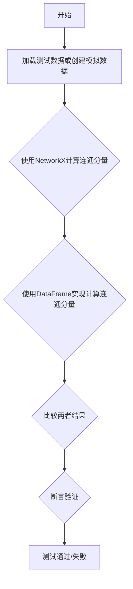
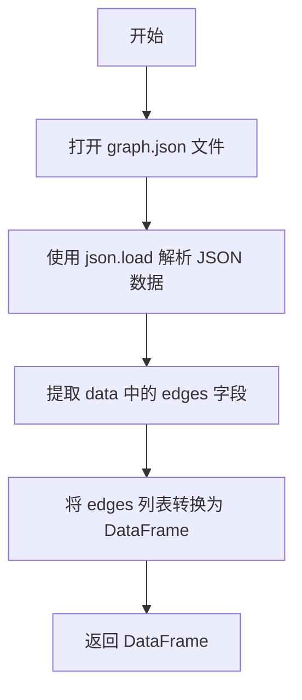
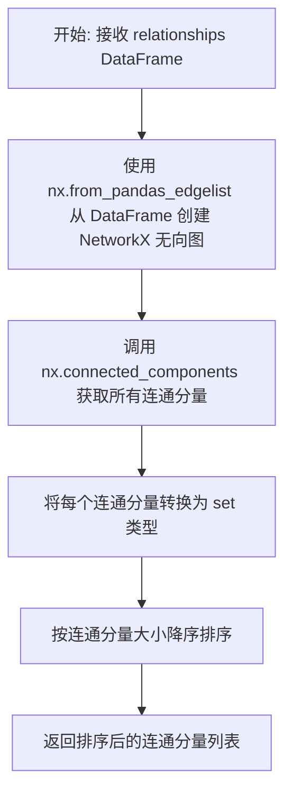
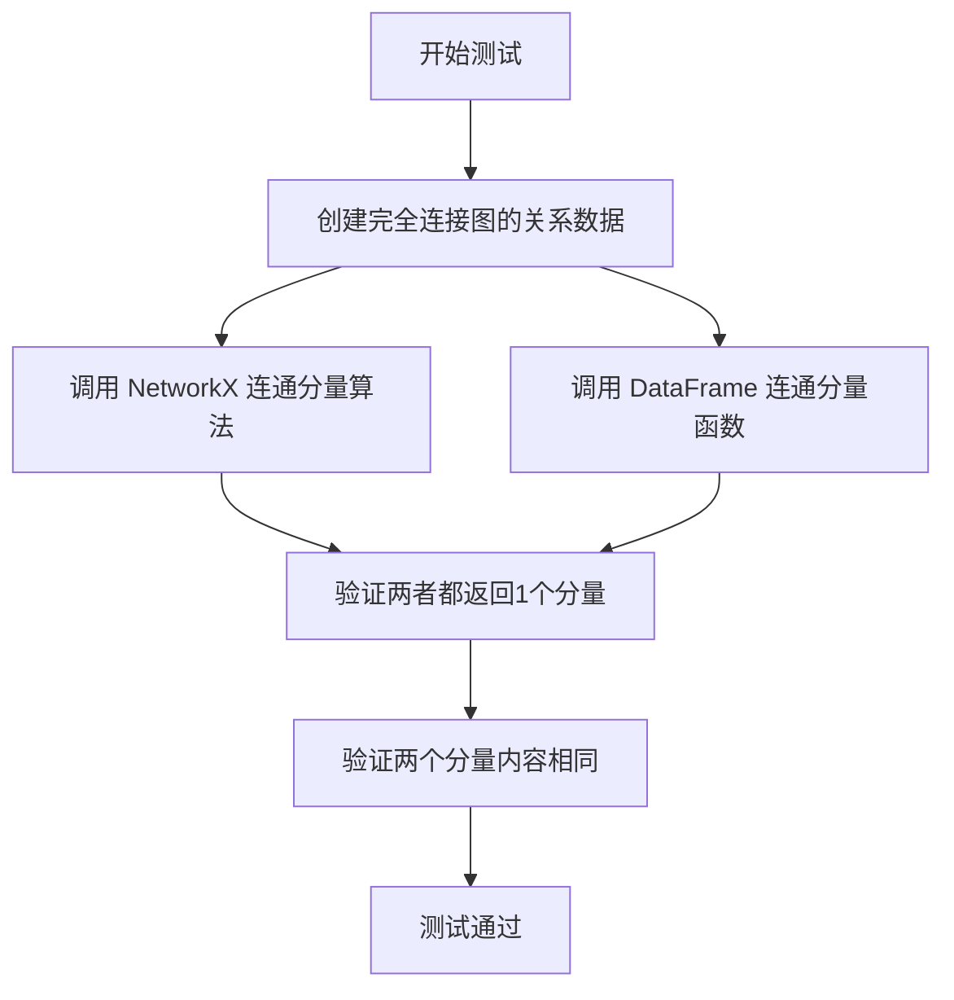
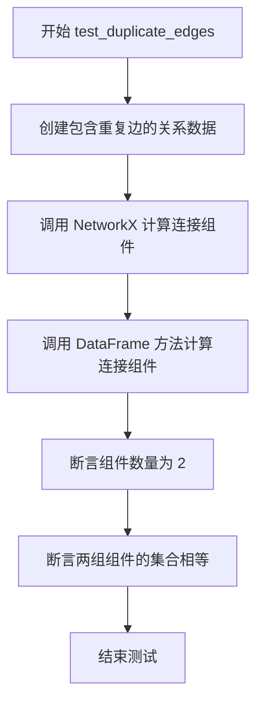
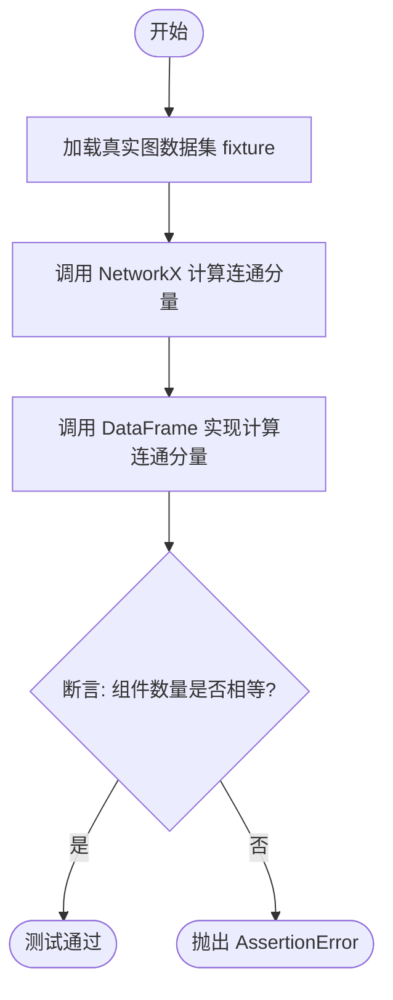
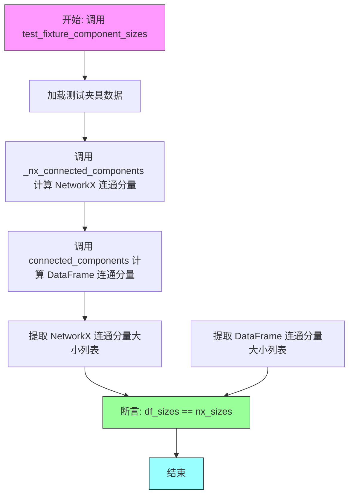
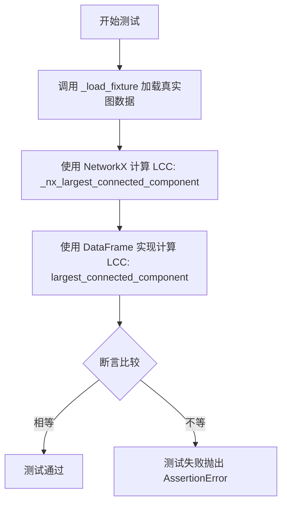

# `graphrag\tests\unit\graphs\test_connected_components.py` 详细设计文档

这是一个对比测试文件，用于验证基于DataFrame的连通分量算法实现与NetworkX参考实现的正确性，通过多种图拓扑场景（单分量、双分量、星型、重复边等）和真实fixture数据来确保算法的一致性。

## 整体流程



## 类结构

```
无类层次结构（纯测试模块）
├── 全局辅助函数
│   ├── _load_fixture()
│   ├── _make_relationships()
│   ├── _nx_connected_components()
│   └── _nx_largest_connected_component()
└── 测试函数组（10个测试用例）
```

## 全局变量及字段


### `FIXTURES_DIR`
    
测试夹具目录路径，指向包含测试fixture数据的fixtures文件夹，用于加载图数据的JSON文件

类型：`Path`
    


    

## 全局函数及方法


### `_load_fixture`

加载真实图谱fixture数据，并将其转换为关系DataFrame返回。

参数：

- （无参数）

返回值：`pd.DataFrame`，包含图谱边数据的Pandas DataFrame对象

#### 流程图



#### 带注释源码

```python
def _load_fixture() -> pd.DataFrame:
    """Load the realistic graph fixture as a relationships DataFrame."""
    # 打开 fixtures 目录下的 graph.json 文件
    with open(FIXTURES_DIR / "graph.json") as f:
        # 解析 JSON 数据为 Python 字典
        data = json.load(f)
    # 从数据中提取 'edges' 字段，并转换为 DataFrame 返回
    return pd.DataFrame(data["edges"])
```

#### 相关全局变量

- `FIXTURES_DIR`：`Path`，测试fixture文件所在的目录路径（`Path(__file__).parent / "fixtures"`）


### `_make_relationships`

构建一个关系 DataFrame，接受可变数量的边元组（源节点、目标节点、权重），并将其转换为包含 source、target、weight 三列的 Pandas DataFrame。

参数：

- `*edges`：`tuple[str, str, float]`，可变数量的边元组，每个元组包含 (source, target, weight)

返回值：`pd.DataFrame`，包含 source、target、weight 三列的关系数据框

#### 流程图

```mermaid
flowchart TD
    A[开始] --> B[接收可变数量边元组 *edges]
    B --> C{遍历每个边元组}
    C -->|对于每个元组 s, t, w| D[创建字典 {'source': s, 'target': t, 'weight': w}]
    D --> E[将所有字典收集为列表]
    E --> F[使用 pd.DataFrame 构造数据框]
    F --> G[返回 DataFrame]
    G --> H[结束]
```

#### 带注释源码

```python
def _make_relationships(*edges: tuple[str, str, float]) -> pd.DataFrame:
    """Build a relationships DataFrame from (source, target, weight) tuples.
    
    将可变数量的边元组转换为 Pandas DataFrame。
    每个元组应包含 (源节点, 目标节点, 权重) 三个元素。
    
    Args:
        *edges: 可变数量的边元组，格式为 (source: str, target: str, weight: float)
    
    Returns:
        pd.DataFrame: 包含三列的关系数据框
            - source: 源节点标识
            - target: 目标节点标识
            - weight: 边的权重值
    
    Example:
        >>> rels = _make_relationships(
        ...     ("A", "B", 1.0),
        ...     ("B", "C", 2.0)
        ... )
        >>> print(rels)
          source target  weight
        0      A      B     1.0
        1      B      C     2.0
    """
    # 使用列表推导式将每个边元组 (s, t, w) 转换为字典
    # 字典键对应 DataFrame 的列名：source, target, weight
    return pd.DataFrame([{"source": s, "target": t, "weight": w} for s, t, w in edges])
```


### `_nx_connected_components`

使用 NetworkX 计算无向图的连通分量，并将结果按大小降序返回。该函数作为测试中的参考实现，用于验证 DataFrame 实现的正确性。

参数：

- `relationships`：`pd.DataFrame`，包含边的关系数据，必须包含 `source` 和 `target` 列，每行表示一条边

返回值：`list[set[str]]`，按连通分量大小降序排列的集合列表，每个集合包含该连通分量中的所有节点标识符

#### 流程图



#### 带注释源码

```python
def _nx_connected_components(relationships: pd.DataFrame) -> list[set[str]]:
    """Compute connected components using NetworkX.
    
    这是一个测试辅助函数，用于生成与 DataFrame 实现对比的参考结果。
    它使用 NetworkX 库计算无向图的连通分量。
    
    参数:
        relationships: 包含边的 DataFrame，必须有 'source' 和 'target' 列，
                      可选的 'weight' 列会被忽略
    
    返回值:
        按大小降序排列的连通分量列表，每个元素是一个 set，包含该分量中所有节点
    """
    # 从 pandas DataFrame 创建 NetworkX 无向图
    # source 和 target 列定义边的端点
    graph = nx.from_pandas_edgelist(relationships, source="source", target="target")
    
    # 使用 NetworkX 的 connected_components 算法
    # 返回一个生成器，每个元素是一个连通分量的节点集合
    # 使用 sorted 按长度降序排列，方便与 DataFrame 实现的结果对比
    return sorted(
        [set(c) for c in nx.connected_components(graph)],
        key=len,
        reverse=True,
    )
```


### `_nx_largest_connected_component`

该函数是用于测试对比的辅助函数，通过调用 NetworkX 库计算无向图中最大的连通分量（Largest Connected Component, LCC），返回包含最多节点的那个连通分量。

参数：

- `relationships`：`pd.DataFrame`，包含图边关系的数据框，需包含 `source` 和 `target` 列，每行表示一条有向边

返回值：`set[str]`，最大连通分量中所有节点的集合，若无任何边则返回空集

#### 流程图

```mermaid
flowchart TD
    A[开始: 传入 relationships DataFrame] --> B[调用 _nx_connected_components 获取所有连通分量]
    B --> C{components 列表是否为空?}
    C -->|是| D[返回空集 set()]
    C -->|否| E[返回 components[0] 即最大的连通分量]
    D --> F[结束]
    E --> F
    
    subgraph _nx_connected_components
        B1[使用 nx.from_pandas_edgelist 构建无向图] --> B2[使用 nx.connected_components 获取所有分量]
        B2 --> B3[按分量大小降序排序]
    end
```

#### 带注释源码

```python
def _nx_largest_connected_component(relationships: pd.DataFrame) -> set[str]:
    """Return the LCC using NetworkX.
    
    这是一个测试辅助函数，用于生成 NetworkX 版本的参考结果，
    以便与 DataFrame 实现的 largest_connected_component 进行对比测试。
    
    参数:
        relationships: 包含 source 和 target 列的 DataFrame，
                       每行代表图中的一条边
    
    返回值:
        最大的连通分量（包含节点数最多的连通分量），如果没有任何边则返回空集
    """
    # 调用内部函数获取所有连通分量（已按大小降序排列）
    components = _nx_connected_components(relationships)
    
    # 如果存在连通分量，返回最大的（列表第一个元素）
    # 否则返回空集（处理空关系图的情况）
    return components[0] if components else set()
```


### `test_single_component`

完全连接图（有三条边 A-B, B-C, A-C 形成一个三角形）应该被识别为只有一个连通分量。该测试函数通过比较 NetworkX 和 DataFrame 两种实现方式的输出来验证 `connected_components` 函数的正确性。

参数： 无

返回值： `None`，该函数为测试函数，不返回值，通过断言验证逻辑

#### 流程图



#### 带注释源码

```python
def test_single_component():
    """Fully connected graph should have one component."""
    # 使用辅助函数创建包含三条边 A-B, B-C, A-C 的关系数据
    # 这形成一个完全连接的三角形图
    rels = _make_relationships(
        ("A", "B", 1.0),
        ("B", "C", 1.0),
        ("A", "C", 1.0),
    )
    
    # 使用 NetworkX 参考实现计算连通分量
    nx_components = _nx_connected_components(rels)
    
    # 使用待测试的 DataFrame 实现计算连通分量
    df_components = connected_components(rels)
    
    # 断言：两种实现都应返回恰好1个连通分量
    assert len(nx_components) == len(df_components) == 1
    
    # 断言：NetworkX 和 DataFrame 实现返回的连通分量应相同
    assert nx_components[0] == df_components[0]
```


### `test_two_components`

验证两个不相连的节点对（"A-B" 和 "C-D"）能够被正确识别为两个独立的连通分量，确保 DataFrame 实现的连通分量算法与 NetworkX 实现结果一致。

参数：

- 无

返回值：`None`，测试函数无返回值，仅通过断言验证正确性

#### 流程图

```mermaid
flowchart TD
    A[开始测试] --> B[创建关系数据<br/>rels = (A,B), (C,D)]
    B --> C[调用 NetworkX 实现<br/>_nx_connected_components]
    B --> D[调用 DataFrame 实现<br/>connected_components]
    C --> E[断言分量数量<br/>len == 2]
    D --> E
    E --> F[断言分量集合相等<br/>frozenset匹配]
    F --> G[测试通过<br/>返回None]
```

#### 带注释源码

```python
def test_two_components():
    """Two disconnected pairs should give two components."""
    # 构建两个不相连的边：(A,B) 和 (C,D)，形成两对节点
    # 每条边权重为1.0，但权重在连通分量计算中不影响结果
    rels = _make_relationships(
        ("A", "B", 1.0),
        ("C", "D", 1.0),
    )
    
    # 使用NetworkX库计算连通分量
    # 内部将DataFrame转换为NetworkX图，使用source和target列
    nx_components = _nx_connected_components(rels)
    
    # 使用自定义DataFrame实现计算连通分量
    # 该实现不依赖NetworkX，基于图遍历算法
    df_components = connected_components(rels)
    
    # 断言1：两种实现都应找到恰好2个连通分量
    # A-B形成一个分量，C-D形成另一个分量，两者互不相连
    assert len(nx_components) == len(df_components) == 2
    
    # 断言2：两种实现找到的分量集合必须完全一致
    # 使用frozenset忽略分量内部的顺序，只比较集合内容
    assert {frozenset(c) for c in nx_components} == {
        frozenset(c) for c in df_components
    }
```


### `test_three_components_lcc`

该函数是一个测试用例，用于验证 `largest_connected_component` 函数能从包含三个独立连通分量的图中正确识别并返回最大的连通分量。测试通过创建三个互不连通的子图（分别为 {A,B,C,D}、{X,Y}、{P,Q}），然后断言函数返回包含节点 A、B、C、D 的最大分量。

参数： 无

返回值：`None`，因为该函数是一个测试函数，没有返回值（返回类型为 `None`）

#### 流程图

```mermaid
flowchart TD
    A["开始测试<br/>test_three_components_lcc"] --> B[创建关系数据<br/>包含3个连通分量]
    B --> C["调用 NetworkX 函数<br/>_nx_largest_connected_component"]
    B --> D["调用 DataFrame 函数<br/>largest_connected_component"]
    C --> E[验证结果一致性<br/>nx_lcc == df_lcc]
    D --> E
    E --> F[验证结果正确性<br/>df_lcc == {A, B, C, D}]
    F --> G["结束测试<br/>通过/失败"]
```

#### 带注释源码

```python
def test_three_components_lcc():
    """LCC should pick the largest of three components."""
    # 创建一个包含三个独立连通分量的关系数据帧
    # 分量1: A-B, A-C, A-D (星型结构，节点 A, B, C, D)
    # 分量2: X-Y (节点 X, Y)
    # 分量3: P-Q (节点 P, Q)
    rels = _make_relationships(
        ("A", "B", 1.0),
        ("A", "C", 1.0),
        ("A", "D", 1.0),
        ("X", "Y", 1.0),
        ("P", "Q", 1.0),
    )
    
    # 使用 NetworkX 计算最大连通分量作为参考
    nx_lcc = _nx_largest_connected_component(rels)
    
    # 使用 DataFrame 实现计算最大连通分量
    df_lcc = largest_connected_component(rels)
    
    # 断言：两种实现的结果应该一致
    assert nx_lcc == df_lcc
    
    # 断言：最大连通分量应该是 {A, B, C, D}
    # 因为这是包含节点数最多的分量（共4个节点）
    assert df_lcc == {"A", "B", "C", "D"}
```


### `test_star_topology`

该测试函数用于验证在星型拓扑结构中，以中心节点（hub）为枢纽连接多个叶子节点（a, b, c）时，系统能够正确识别所有节点属于同一连通分量，并与 NetworkX 的计算结果保持一致。

参数： 无

返回值： `None`，测试函数无返回值，通过断言验证逻辑正确性

#### 流程图

```mermaid
flowchart TD
    A([开始测试]) --> B[创建星型关系数据]
    B --> C[调用 largest_connected_component<br/>计算 DataFrame 结果]
    C --> D[调用 _nx_largest_connected_component<br/>计算 NetworkX 结果]
    D --> E{断言验证}
    E -->|df_lcc == nx_lcc == {hub,a,b,c}| F[测试通过]
    E -->|断言失败| G[抛出 AssertionError]
    F --> H([测试结束])
    G --> H
```

#### 带注释源码

```python
def test_star_topology():
    """Star should be a single component."""
    # 构建星型拓扑关系数据：以 hub 为中心，连接三个叶子节点 a, b, c
    # 这形成了一个典型的星型图结构，所有节点都通过 hub 相互连通
    rels = _make_relationships(
        ("hub", "a", 1.0),
        ("hub", "b", 1.0),
        ("hub", "c", 1.0),
    )
    
    # 使用 DataFrame 方法（自定义实现）计算最大连通分量
    df_lcc = largest_connected_component(rels)
    
    # 使用 NetworkX 参考实现计算最大连通分量
    nx_lcc = _nx_largest_connected_component(rels)
    
    # 断言两种实现的结果一致，且等于预期的连通分量集合
    # 预期结果：{hub, a, b, c}，因为所有节点都通过 hub 连接在一起
    assert df_lcc == nx_lcc == {"hub", "a", "b", "c"}
```


### `test_duplicate_edges`

该测试函数用于验证在存在重复边的情况下，连接的组件计算结果应保持一致，即重复边不应影响组件的成员资格。

参数：
- 该函数没有参数

返回值：`None`，无返回值（测试函数）

#### 流程图



#### 带注释源码

```python
def test_duplicate_edges():
    """Duplicate edges should not affect component membership."""
    # 使用包含重复边的数据创建关系 DataFrame
    # ("A", "B", 1.0) 和 ("A", "B", 2.0) 是重复边（源和目标相同，权重不同）
    rels = _make_relationships(
        ("A", "B", 1.0),
        ("A", "B", 2.0),
        ("C", "D", 1.0),
    )
    
    # 使用 NetworkX 计算连接组件
    nx_components = _nx_connected_components(rels)
    
    # 使用 DataFrame 方法计算连接组件
    df_components = connected_components(rels)
    
    # 验证两种方法都返回 2 个组件
    # 预期：{A, B} 和 {C, D}
    assert len(nx_components) == len(df_components) == 2
    
    # 验证两个实现返回的组件成员完全相同
    # 使用 frozenset 是为了忽略顺序进行集合比较
    assert {frozenset(c) for c in nx_components} == {
        frozenset(c) for c in df_components
    }
```


### `test_empty_relationships`

该测试函数用于验证当关系DataFrame为空时，`connected_components`函数返回空列表，`largest_connected_component`函数返回空集合，确保图处理逻辑正确处理边界情况。

参数： 无

返回值：`None`，该函数为测试函数，不返回任何值，仅通过断言验证行为

#### 流程图

```mermaid
flowchart TD
    A[开始测试 test_empty_relationships] --> B[创建空DataFrame: pd.DataFrame columns=['source', 'target', 'weight']]
    B --> C[调用 connected_componentsrels 并断言 == []]
    C --> D[调用 largest_connected_componentrels 并断言 == set()]
    D --> E[测试通过 / 抛出 AssertionError]
```

#### 带注释源码

```python
def test_empty_relationships():
    """Empty edge list should produce no components."""
    # 创建一个空的DataFrame，只包含列名但没有数据行
    # 用于模拟没有任何边的图
    rels = pd.DataFrame(columns=["source", "target", "weight"])
    
    # 断言：空图应该没有连通分量
    assert connected_components(rels) == []
    
    # 断言：空图的最大连通分量应该是空集
    assert largest_connected_component(rels) == set()
```


### `test_fixture_component_count`

该函数是一个测试用例，用于验证在真实图数据集上，使用 DataFrame 实现的连通分量算法与 NetworkX 实现的连通分量算法在组件数量上保持一致。

参数：

- 无

返回值：`None`，该函数为测试用例，使用 `assert` 语句进行断言，不返回任何值。

#### 流程图



#### 带注释源码

```python
def test_fixture_component_count():
    """Component count should match NetworkX on the realistic fixture."""
    # 步骤1: 加载真实图数据集作为关系 DataFrame
    rels = _load_fixture()
    
    # 步骤2: 使用 NetworkX 计算图的连通分量
    nx_components = _nx_connected_components(rels)
    
    # 步骤3: 使用 DataFrame 实现计算连通分量
    df_components = connected_components(rels)
    
    # 步骤4: 断言两种实现返回的组件数量相同
    assert len(df_components) == len(nx_components)
```


### `test_fixture_component_sizes`

测试函数，用于验证 DataFrame 实现的连通分量大小（降序排列）与 NetworkX 实现的一致性。

参数：

- 无

返回值：`None`，测试函数无返回值，通过断言验证正确性

#### 流程图



#### 带注释源码

```python
def test_fixture_component_sizes():
    """Component sizes (sorted desc) should match NetworkX."""
    # 步骤1: 从测试夹具文件加载关系数据为 DataFrame
    rels = _load_fixture()
    
    # 步骤2: 使用 NetworkX 计算图的连通分量，并提取各分量大小
    nx_sizes = [len(c) for c in _nx_connected_components(rels)]
    
    # 步骤3: 使用 DataFrame 实现计算图的连通分量，并提取各分量大小
    df_sizes = [len(c) for c in connected_components(rels)]
    
    # 步骤4: 断言两种实现计算出的连通分量大小列表完全一致
    assert df_sizes == nx_sizes
```


### `test_fixture_lcc_membership`

该测试函数用于验证 DataFrame 实现的 `largest_connected_component` 方法计算出的最大连通分量（LCC）的节点成员资格与 NetworkX 实现的结果完全一致，确保两种不同实现的输出等价性。

参数： 无

返回值： `None`，测试函数无返回值，通过断言验证正确性

#### 流程图



#### 带注释源码

```python
def test_fixture_lcc_membership():
    """LCC membership should be identical to NetworkX."""
    # 加载真实图fixture数据作为关系DataFrame
    rels = _load_fixture()
    
    # 使用NetworkX参考实现计算最大连通分量
    nx_lcc = _nx_largest_connected_component(rels)
    
    # 使用待测试的DataFrame实现计算最大连通分量
    df_lcc = largest_connected_component(rels)
    
    # 断言两种实现的LCC成员完全一致
    assert df_lcc == nx_lcc
```


### `test_fixture_lcc_size`

该测试函数用于验证在真实图数据集上，最大连通分量（LCC）的节点数量是否为已知的535个节点，通过对比 DataFrame 实现的 `largest_connected_component` 函数与 NetworkX 参考实现的结果来确保实现的正确性。

参数： 无

返回值： `None`，测试函数无返回值，通过断言进行验证

#### 流程图

```mermaid
flowchart TD
    A[开始] --> B[调用 _load_fixture 加载测试数据]
    B --> C[调用 largest_connected_component 计算 LCC]
    C --> D{len(lcc) == 535?}
    D -->|是| E[测试通过]
    D -->|否| F[断言失败, 抛出 AssertionError]
```

#### 带注释源码

```python
def test_fixture_lcc_size():
    """LCC should contain 535 nodes (known from the fixture)."""
    # 步骤1: 从测试夹具文件加载真实的图数据作为关系 DataFrame
    rels = _load_fixture()
    
    # 步骤2: 使用 DataFrame 实现的函数计算最大连通分量
    lcc = largest_connected_component(rels)
    
    # 步骤3: 断言 LCC 包含535个节点（这是已知的预期值）
    assert len(lcc) == 535
```

## 关键组件


### connected_components 函数

从 graphrag.graphs.connected_components 模块导入的 DataFrame 实现，用于计算关系 DataFrame 中的所有连通分量。接受包含 source 和 target 列的 pandas DataFrame 作为输入，返回 list[set[str]] 类型的连通分量列表。

### largest_connected_component 函数

从 graphrag.graphs.connected_components 模块导入的 DataFrame 实现，用于从关系 DataFrame 中找出最大的连通分量。接受包含 source 和 target 列的 pandas DataFrame 作为输入，返回包含最多节点的集合 set[str]。

### FIXTURES_DIR 常量

类型为 Path，指向测试文件所在目录下的 fixtures 子目录，用于加载真实的图数据 JSON 文件。

### _load_fixture 函数

加载真实图结构 fixture 作为关系 DataFrame 的辅助函数。读取 FIXTURES_DIR / "graph.json" 文件，解析 JSON 中的 edges 数组，返回 pd.DataFrame 类型的数据。

### _make_relationships 函数

构建关系 DataFrame 的工厂函数，接受可变数量的 (source, target, weight) 元组参数。返回包含 source、target、weight 三列的 pd.DataFrame，用于测试场景构建。

### _nx_connected_components 函数

NetworkX 参考实现，使用 NetworkX 库计算连通分量作为测试基准。接受 pd.DataFrame 类型的 relationships 参数，调用 nx.from_pandas_edgelist 构建图，使用 nx.connected_components 计算，返回按长度降序排序的 list[set[str]]。

### _nx_largest_connected_component 函数

NetworkX 参考实现，返回最大连通分量作为测试基准。接受 pd.DataFrame 类型的 relationships 参数，调用 _nx_connected_components 获取所有分量后返回第一个（最大的）或空集，返回类型为 set[str]。

### 测试用例组件

包含 test_single_component、test_two_components、test_three_components_lcc、test_star_topology、test_duplicate_edges、test_empty_relationships、test_fixture_component_count、test_fixture_component_sizes、test_fixture_lcc_membership、test_fixture_lcc_size 等测试函数，分别验证不同图拓扑结构下 DataFrame 实现与 NetworkX 的一致性。

### pd.DataFrame 数据结构

使用 pandas DataFrame 表示图关系数据，预期包含 source（源节点）、target（目标节点）、weight（边权重）三列，作为连通分量算法的输入格式。


## 问题及建议


### 已知问题

-   **缺少参数化测试**：多个测试函数（test_single_component、test_two_components等）结构相似，可以使用 `@pytest.mark.parametrize` 装饰器合并，减少代码重复。
-   **边界条件测试不足**：未覆盖自环（self-loop）、孤立节点、负权重或零权重边、DataFrame列名不匹配等异常场景。
-   **异常处理缺失**：未对输入数据做验证，如检查DataFrame是否包含必需的 "source" 和 "target" 列，缺少对 KeyError 的防御性处理。
-   **重复逻辑**：`_nx_connected_components` 和 `_nx_largest_connected_component` 中有重复的图构建逻辑；测试中多次使用相同的比较模式。
-   **硬编码的测试断言**：test_fixture_lcc_size 中硬编码了期望值 535，如果fixture数据变化会导致测试失败，缺乏灵活性。
-   **fixture路径硬编码**：使用相对路径加载fixture，文件移动后可能失效，缺少文件存在性检查。
-   **测试隔离性问题**：所有测试共享同一个fixture加载逻辑，如果fixture数据被修改，可能影响多个测试。

### 优化建议

-   **引入参数化测试**：使用 pytest.mark.parametrize 重构相似测试用例，如将连通性相关的测试合并为一个参数化测试。
-   **增强边界测试**：添加自环、孤立节点、异常输入的测试用例，验证实现的数据验证逻辑。
-   **添加异常处理**：在被测函数中添加输入验证，对缺少必需列或类型错误的情况抛出有意义的异常。
-   **提取公共逻辑**：将 NetworkX 图构建逻辑抽取为独立函数，避免在 `_nx_connected_components` 和 `_nx_largest_connected_component` 中重复。
-   **动态计算断言值**：test_fixture_lcc_size 中使用动态获取的LCC大小而非硬编码值，提高测试的可维护性。
-   **增加fixture加载检查**：在 `_load_fixture` 中添加文件存在性检查和可选的缓存机制。
-   **使用pytest fixtures**：将共享的fixture数据和加载逻辑提取为 pytest fixture，提高测试隔离性和可复用性。

## 其它


### 设计目标与约束

本测试文件的设计目标是通过对比NetworkX库实现的连通分量算法与自定义DataFrame实现的连通分量算法，验证两种实现在各种图结构下的一致性。设计约束包括：测试必须覆盖单组件、多组件、重复边、空关系、真实数据集等多种场景；所有测试用例必须通过断言确保两种实现的输出完全一致；测试框架采用pytest标准格式。

### 错误处理与异常设计

测试文件中主要依赖pytest的断言机制进行错误检测。当两种实现的结果不一致时，assert语句会抛出AssertionError并显示具体的差异信息。空关系DataFrame场景下验证了函数能正确返回空列表或空集合，而不抛出异常。对于加载JSON文件失败的情况，代码未做特殊处理，依赖Python文件操作的标准异常传播机制。

### 数据流与状态机

数据流从JSON fixture文件或手动构建的边列表开始，经过DataFrame转换后，分别传入NetworkX参考实现和待测试的DataFrame实现进行计算，最后通过断言比较结果。状态机方面测试覆盖了：单连通分量状态、多连通分量状态、空图状态三种主要状态。

### 外部依赖与接口契约

主要外部依赖包括：networkx库提供参考实现、pandas库提供DataFrame数据结构、graphrag.graphs.connected_components模块提供待测函数。接口契约方面：connected_components函数接受包含source和target列的DataFrame参数，返回list[set[str]]类型；largest_connected_component函数接受相同参数，返回set[str]类型。

### 测试策略

采用等价类划分和边界值分析相结合的测试策略。等价类包括：完全连通图、非连通多组件图、重复边图、空图。边界值测试涵盖最小规模（0条边、1条边）和大规模真实数据集（535个节点的LCC）。

### 性能考虑

测试未包含性能基准测试，主要关注功能正确性验证。真实数据集测试使用535个节点的fixture，可以作为后续性能对比的参考基准。

### 可维护性分析

辅助函数_nx_connected_components和_nx_largest_connected_component作为NetworkX的封装，便于统一修改参考实现。_make_relationships工厂函数简化了测试数据的构建。测试函数命名清晰，直观表达测试场景。

### 版本兼容性

代码依赖Python标准库json、pathlib，以及networkx和pandas。需确保networkx版本支持from_pandas_edgelist和connected_components API，pandas版本支持DataFrame构造语法。

### 配置管理

FIXTURES_DIR通过Path动态计算，测试文件位置变更时无需修改代码。fixture文件名graph.json硬编码，如需切换不同测试数据集需修改代码。

### 部署相关

本测试文件作为单元测试模块，可通过pytest命令直接运行。部署时需确保graphrag.graphs.connected_components模块已正确安装或配置在Python路径中。


    