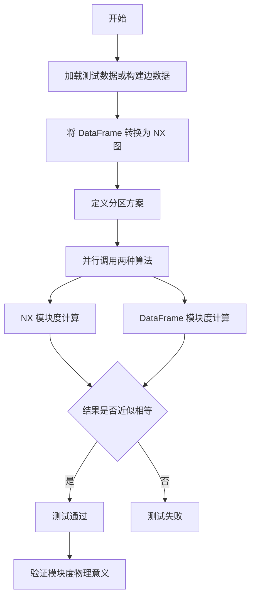
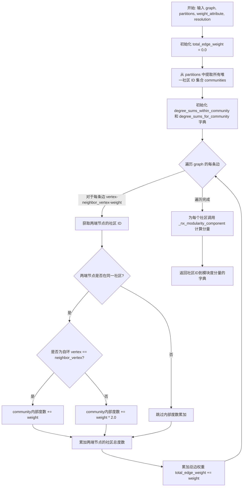
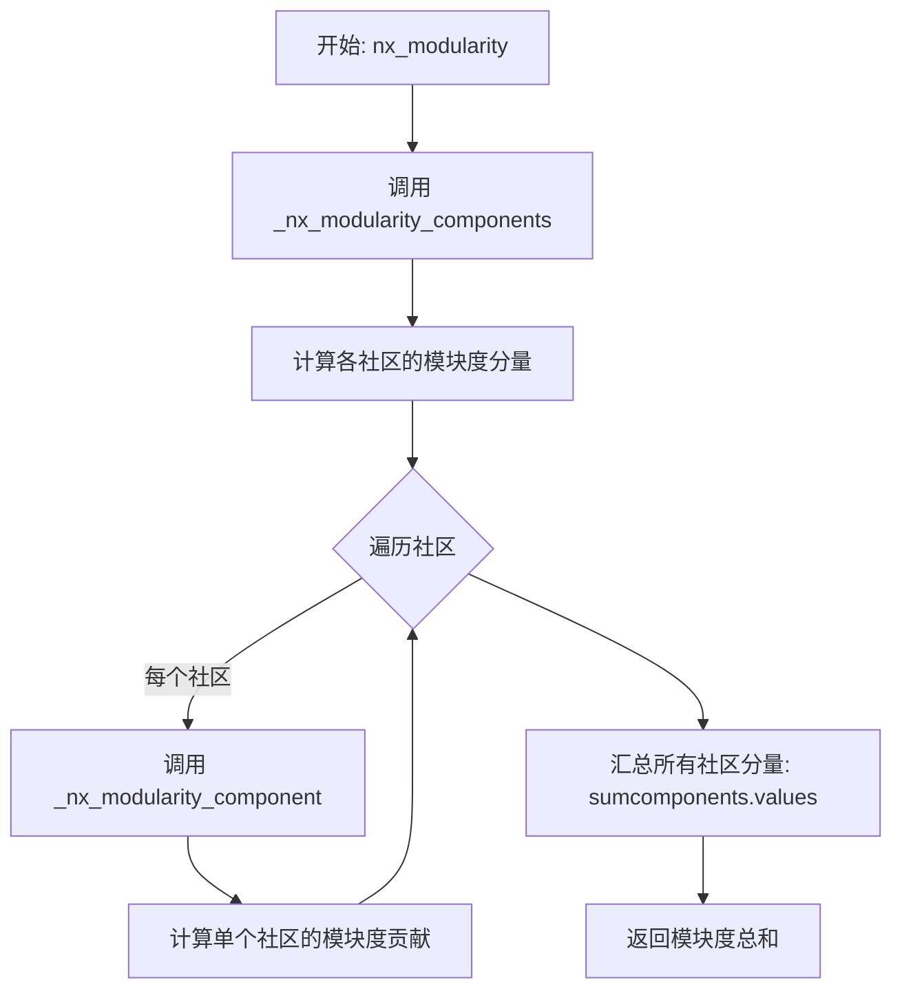
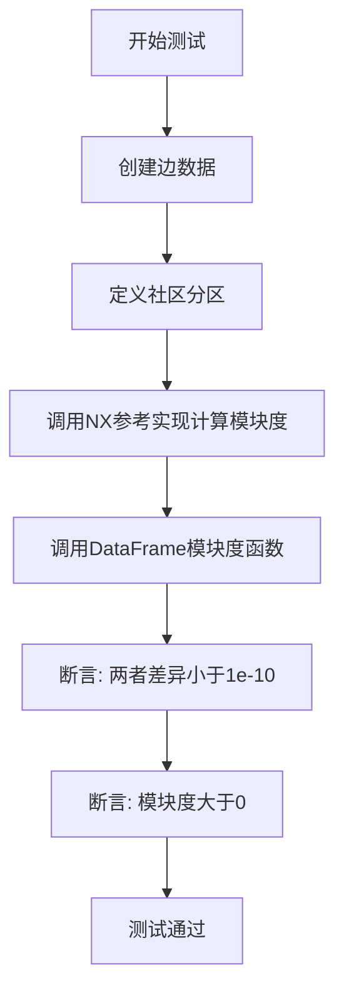
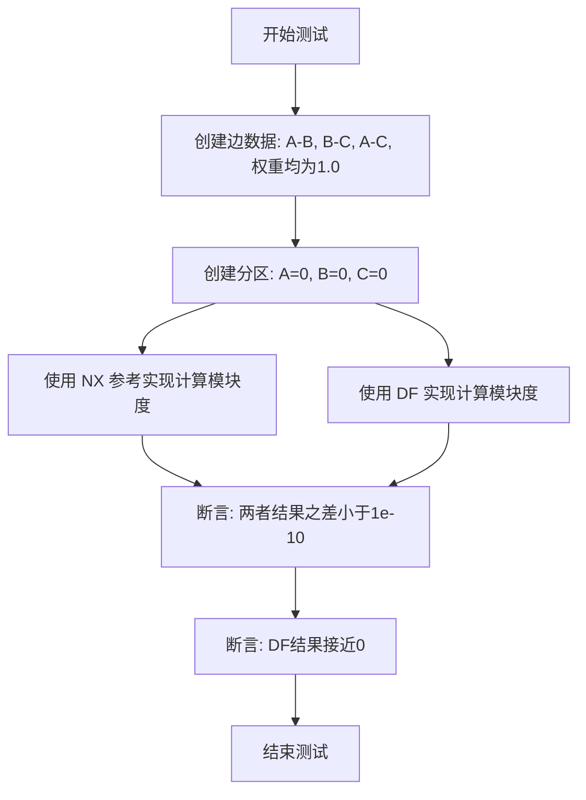
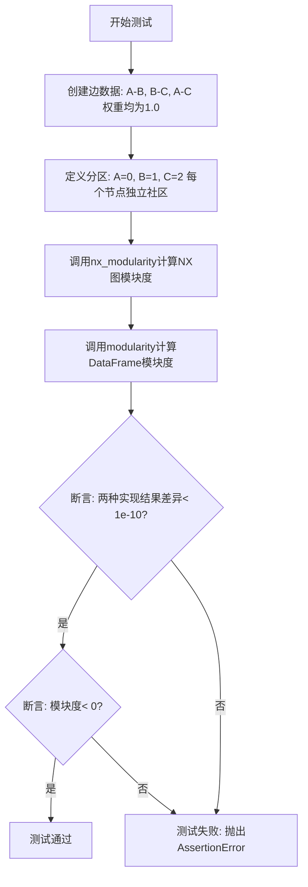
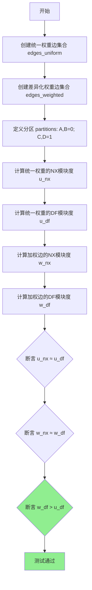
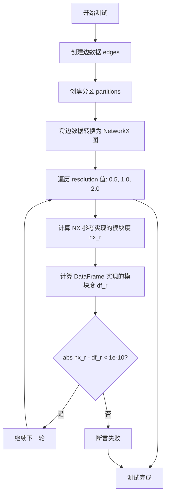
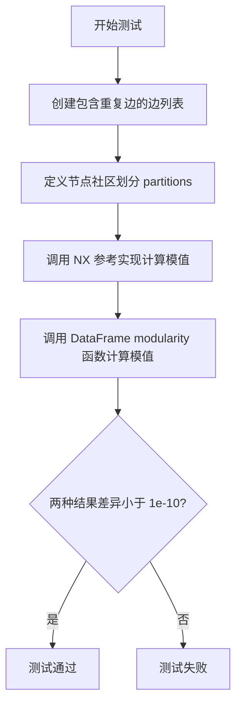
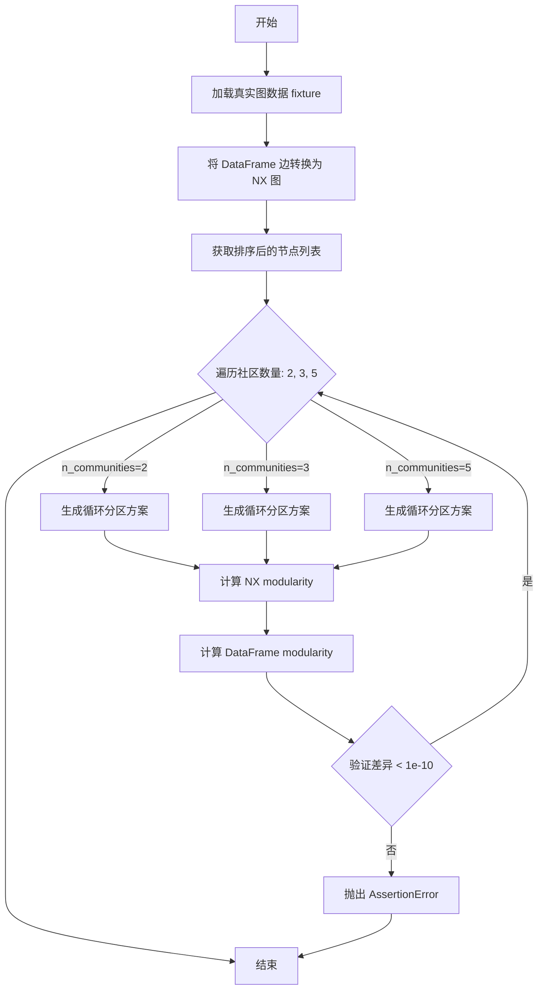

# `graphrag\tests\unit\graphs\test_modularity.py` 详细设计文档

这是一个用于测试 DataFrame 版本的模块度（modularity）计算函数的对比测试文件，通过与 NetworkX 参考实现进行端到端对比，验证基于 pandas DataFrame 的模块度算法正确性。

## 整体流程



## 类结构

```
无类定义 - 纯测试模块
├── 全局函数 (测试函数)
│   ├── test_two_clear_communities
│   ├── test_single_community
│   ├── test_every_node_own_community
│   ├── test_reversed_edges
│   ├── test_weighted_edges
│   ├── test_custom_resolution
│   ├── test_duplicate_edges
│   ├── test_reversed_duplicate_edges
│   └── test_fixture_matches_nx
├── 辅助函数 (NX 参考实现)
│   ├── _nx_modularity_component
│   ├── _nx_modularity_components
│   └── nx_modularity
└── 工具函数
    ├── _load_fixture
    ├── _make_edges
    └── _edges_to_nx
```

## 全局变量及字段


### `FIXTURES_DIR`
    
测试夹具目录路径，指向包含测试数据 JSON 文件的目录

类型：`Path`
    


    

## 全局函数及方法


### `_nx_modularity_component`

计算单个社区的模块度分量（modularity component），用于衡量在给定网络分区中该社区内部连接相对于期望随机连接的紧密程度。

参数：

- `intra_community_degree`：`float`，社区内部所有边的权重之和（包含自环权重）
- `total_community_degree`：`float`，社区内所有节点的度数之和（所有与社区内节点相连的边权重总和）
- `network_degree_sum`：`float`，整个网络中所有边权重之和的两倍（即 2 * total_edge_weight）
- `resolution`：`float`，分辨率参数，用于调节社区规模的惩罚程度（值越大倾向于产生更多小社区）

返回值：`float`，该社区的模块度分量值，正值表示社区内部连接优于随机期望，负值表示连接稀疏

#### 流程图

```mermaid
flowchart TD
    A[开始] --> B[计算 community_degree_ratio]
    B --> C[community_degree_ratio = (total_community_degree²) / (2 × network_degree_sum)]
    D[计算模块度分量] --> E[返回值公式]
    E --> F[结束]
    
    B --> D
    
    subgraph 计算公式
    C --> D
    end
    
    style A fill:#f9f,color:#333
    style F fill:#9f9,color:#333
```

#### 带注释源码

```python
def _nx_modularity_component(
    intra_community_degree: float,
    total_community_degree: float,
    network_degree_sum: float,
    resolution: float,
) -> float:
    """计算单个社区的模块度分量。
    
    模块度分量公式:
    Q_c = (intra_community_degree - resolution * community_degree_ratio) / (2 * network_degree_sum)
    
    其中 community_degree_ratio = (total_community_degree)² / (2 * network_degree_sum)
    
    该函数对应 NetworkX 的 modularity 组件计算逻辑，
    用于后续对所有社区的分量求和得到整体模块度。
    
    参数:
        intra_community_degree: 社区内部度数，即社区内部所有边的权重之和（自环计一次，其他边计两次）
        total_community_degree: 社区总度数，即社区内所有节点与其他所有节点相连的边权重之和
        network_degree_sum: 网络度数总和，等于 2 * total_edge_weight（所有边权重之和的两倍）
        resolution: 分辨率参数，默认为1.0。值越大倾向于产生更多、更小的社区
    
    返回:
        float: 该社区对整体模块度的贡献值
    """
    # 计算社区度数比率（社区总度数的平方除以网络度数总和的两倍）
    # 这代表了在随机网络中该社区内部期望的边数比例
    community_degree_ratio = math.pow(total_community_degree, 2.0) / (
        2.0 * network_degree_sum
    )
    
    # 计算模块度分量：实际内部连接减去期望的随机连接，再除以归一化因子
    # (实际内部权重 - resolution * 期望权重) / (2 * 网络总权重)
    return (intra_community_degree - resolution * community_degree_ratio) / (
        2.0 * network_degree_sum
    )
```


### `_nx_modularity_components`

该函数是 NetworkX 模块度计算的核心内部实现，用于计算图中每个社区的模块度分量（community modularity component）。它通过遍历图的边，根据节点所属的社区分区，计算社区内度数和社区总度数，然后应用模块度公式计算每个社区对整体模块度的贡献值。

参数：

-  `graph`：`nx.Graph`，输入的 NetworkX 无向图
-  `partitions`：`dict[Any, int]`，节点到社区ID的映射字典，键为节点标识，值为社区编号
-  `weight_attribute`：`str`，边属性中权重字段的名称，默认为 "weight"
-  `resolution`：`float`，模块度分辨率参数，用于调节社区规模，值越大产生的社区越多，默认为 1.0

返回值：`dict[int, float]`，社区ID到对应模块度分量的映射字典

#### 流程图



#### 带注释源码

```python
def _nx_modularity_components(
    graph: nx.Graph,
    partitions: dict[Any, int],
    weight_attribute: str = "weight",
    resolution: float = 1.0,
) -> dict[int, float]:
    """
    计算所有社区的模块度分量（内部使用）。
    
    模块度分量衡量每个社区内部连接密度与随机期望的偏差。
    最终的模块度是所有社区分量的总和。
    
    参数:
        graph: NetworkX 无向图对象
        partitions: 节点到社区ID的映射字典
        weight_attribute: 边权重属性名
        resolution: 模块度分辨率参数，控制社区规模
    
    返回:
        社区ID到模块度分量值的字典
    """
    # 初始化总边权重计数器
    total_edge_weight = 0.0
    
    # 从分区映射中提取所有唯一的社区ID集合
    communities = set(partitions.values())

    # 存储每个社区内部的度数总和（仅包含社区内部边的权重）
    degree_sums_within_community: dict[int, float] = defaultdict(float)
    
    # 存储每个社区的总度数（包含所有与社区内节点相连的边的权重）
    degree_sums_for_community: dict[int, float] = defaultdict(float)
    
    # 遍历图中的每条边，提取端点社区信息和权重
    for vertex, neighbor_vertex, weight in graph.edges(data=weight_attribute):
        # 获取两个端点各自所属的社区ID
        vertex_community = partitions[vertex]
        neighbor_community = partitions[neighbor_vertex]
        
        # 判断两端点是否在同一个社区内
        if vertex_community == neighbor_community:
            # 处理自环情况：同一节点的边只计算一次权重
            if vertex == neighbor_vertex:
                degree_sums_within_community[vertex_community] += weight
            else:
                # 非自环的社区内部边权重翻倍
                # 因为模块度计算中边会被两个端点各计算一次
                degree_sums_within_community[vertex_community] += weight * 2.0
        
        # 无论是否在同一社区，都累加两端点到各自社区的总度数
        # 每条边的权重都会贡献到两个端点所在社区的度数中
        degree_sums_for_community[vertex_community] += weight
        degree_sums_for_community[neighbor_community] += weight
        
        # 累加到网络的总度数
        total_edge_weight += weight

    # 对每个社区计算模块度分量并返回结果字典
    # 使用字典推导式一次性计算所有社区的分量值
    return {
        comm: _nx_modularity_component(
            # 社区内部度数（社区内边权重和的两倍）
            degree_sums_within_community[comm],
            # 社区总度数（所有与社区内节点相连的边权重和）
            degree_sums_for_community[comm],
            # 网络总度数（所有边权重和的两倍）
            total_edge_weight,
            # 分辨率参数
            resolution,
        )
        for comm in communities
    }
```


### `nx_modularity`

计算 NetworkX 图的模块度（Modularity），用于评估图的社区划分质量。该函数是模块度计算的 NetworkX 参考实现，常用于与 DataFrame 实现进行对比测试。

参数：

- `graph`：`nx.Graph`，输入的 NetworkX 无向图
- `partitions`：`dict[Any, int]`，节点到社区编号的映射字典，键为节点标识，值为社区编号
- `weight_attribute`：`str = "weight"`，边属性中存储权重的字段名称，默认为 "weight"
- `resolution`：`float = 1.0`，分辨率参数，用于调节社区规模，值越大产生越多小型社区，默认值为 1.0

返回值：`float`，模块度值，范围通常在 [-0.5, 1.0] 之间，值越大表示社区划分质量越好

#### 流程图



#### 带注释源码

```python
def nx_modularity(
    graph: nx.Graph,
    partitions: dict[Any, int],
    weight_attribute: str = "weight",
    resolution: float = 1.0,
) -> float:
    """NX reference: compute modularity from a networkx graph."""
    # 调用内部函数计算各社区的模块度分量
    components = _nx_modularity_components(
        graph, partitions, weight_attribute, resolution
    )
    # 返回所有社区分量的总和
    return sum(components.values())
```


### `_load_fixture`

从 FIXTURES_DIR 目录中的 "graph.json" 文件加载测试图数据，将其中的边数据转换为 pandas DataFrame 格式并返回。

参数：

- 该函数无参数

返回值：`pd.DataFrame`，包含从 JSON 文件加载的图边数据，列为 "source"、"target"、"weight"（如果有）

#### 流程图

```mermaid
flowchart TD
    A[开始] --> B[打开 FIXTURES_DIR/graph.json 文件]
    B --> C[使用 json.load 读取文件内容]
    C --> D[提取 data['edges'] 数据]
    D --> E[将 edges 列表转换为 pandas DataFrame]
    E --> F[返回 DataFrame]
    F --> G[结束]
```

#### 带注释源码

```python
def _load_fixture() -> pd.DataFrame:
    """Load the realistic graph fixture as a relationships DataFrame."""
    # 使用上下文管理器打开 FIXTURES_DIR 目录下的 graph.json 文件
    with open(FIXTURES_DIR / "graph.json") as f:
        # 使用 json 模块读取文件内容并解析为 Python 对象
        data = json.load(f)
    # 从解析的数据中提取 'edges' 键对应的列表，并将其转换为 pandas DataFrame
    # DataFrame 的列取决于 JSON 文件中 edges 数组中对象的键，通常包含 source, target, weight
    return pd.DataFrame(data["edges"])
```


### `_make_edges`

构建一个关系 DataFrame，从 (source, target, weight) 元组列表中提取数据并转换为 pandas DataFrame 格式。

参数：

- `*edges`：`tuple[str, str, float]`，可变数量的边元组，每个元组包含源节点（str）、目标节点（str）和权重（float）

返回值：`pd.DataFrame`，包含 "source"、"target"、"weight" 三列的关系 DataFrame

#### 流程图

```mermaid
flowchart TD
    A[输入: *edges<br/>可变数量的元组] --> B{遍历每个元组}
    B --> C[解包元组<br/>s, t, w = source, target, weight]
    C --> D[构建字典<br/>{'source': s, 'target': t, 'weight': w}]
    D --> E[收集到列表]
    E --> F{是否还有<br/>未处理的元组?}
    F -->|是| B
    F -->|否| G[pd.DataFrame<br/>列表转换为DataFrame]
    G --> H[输出: DataFrame<br/>包含source, target, weight列]
```

#### 带注释源码

```python
def _make_edges(*edges: tuple[str, str, float]) -> pd.DataFrame:
    """Build a relationships DataFrame from (source, target, weight) tuples."""
    # 使用列表推导式将每个 (source, target, weight) 元组转换为字典
    # 字典的键对应 DataFrame 的列名: source, target, weight
    return pd.DataFrame([{"source": s, "target": t, "weight": w} for s, t, w in edges])
```


### `_edges_to_nx`

将包含边信息的 pandas DataFrame 转换为 NetworkX 图对象。

参数：

- `edges`：`pd.DataFrame`，边数据框，必须包含 "source"、"target" 和 "weight" 列

返回值：`nx.Graph`，NetworkX 无向图对象

#### 流程图

```mermaid
flowchart TD
    A[开始] --> B[接收 edges DataFrame]
    B --> C[调用 nx.from_pandas_edgelist]
    C --> D[指定 edge_attr=["weight"]]
    D --> E[返回 nx.Graph 对象]
    E --> F[结束]
```

#### 带注释源码

```python
def _edges_to_nx(edges: pd.DataFrame) -> nx.Graph:
    """Build an NX graph from an edges DataFrame."""
    # 使用 NetworkX 的 from_pandas_edgelist 将 DataFrame 转换为图
    # edges: 包含 'source', 'target', 'weight' 列的 DataFrame
    # edge_attr: 指定要包含的边属性，这里只包含 weight
    return nx.from_pandas_edgelist(edges, edge_attr=["weight"])
```

#### 关键组件信息

- **nx.from_pandas_edgelist**：NetworkX 内置函数，将 pandas DataFrame 转换为图

#### 潜在的技术债务或优化空间

1. **缺乏输入验证**：未检查 DataFrame 是否包含必需列（source, target, weight），可能在列缺失时抛出难以理解的错误
2. **不支持有向图**：当前实现固定返回无向图，若需要支持有向图需扩展
3. **重复边处理**：nx.from_pandas_edgelist 默认保留最后出现的边权重，与测试中的 "duplicate edges" 行为一致，但应在文档中明确说明

#### 其它项目

- **设计目标**：作为测试辅助函数，用于将 DataFrame 格式的边转换为 NetworkX 图，以验证 modularity 函数的正确性
- **错误处理**：依赖 NetworkX 底层实现，无额外错误处理
- **外部依赖**：pandas, networkx


### `test_two_clear_communities`

测试两个清晰社区场景，验证模块度计算函数的正确性。该测试创建两个密集连接的社区（A、B、C）和（D、E、F），之间通过弱边连接，然后对比 NetworkX 参考实现与 DataFrame 实现的结果差异，并验证良好分割的模块度应为正值。

参数： 无

返回值：`None`，该函数通过断言验证计算结果，不返回任何值

#### 流程图



#### 带注释源码

```python
def test_two_clear_communities():
    """Two densely-connected communities with a weak bridge."""
    # 构建测试图：两个社区之间通过弱边(0.1)连接
    # 社区1: A-B-C (内部边权重均为1.0)
    # 社区2: D-E-F (内部边权重均为1.0)
    # 社区间: C-D (权重0.1，作为弱桥接)
    edges = _make_edges(
        ("A", "B", 1.0),
        ("B", "C", 1.0),
        ("A", "C", 1.0),
        ("D", "E", 1.0),
        ("E", "F", 1.0),
        ("D", "F", 1.0),
        ("C", "D", 0.1),  # 弱桥接边，连接两个社区
    )
    
    # 定义社区分区：节点A,B,C在社区0；节点D,E,F在社区1
    partitions = {"A": 0, "B": 0, "C": 0, "D": 1, "E": 1, "F": 1}

    # 使用NetworkX参考实现计算模块度
    # 先将边转换为NetworkX图
    nx_result = nx_modularity(_edges_to_nx(edges), partitions)
    
    # 使用DataFrame模块度函数计算
    df_result = modularity(edges, partitions)

    # 断言1: 验证两种实现的计算结果一致（浮点数容差1e-10）
    assert abs(nx_result - df_result) < 1e-10
    
    # 断言2: 良好分区（社区内连接紧密，社区间连接稀疏）的模块度应为正
    assert df_result > 0  # good partition should be positive
```


### `test_single_community`

测试单一社区场景，验证当所有节点都属于同一社区时，计算出的模块度应为零。该测试通过对比 NetworkX 参考实现和 DataFrame 实现的结果，确保两者一致。

参数： 无

返回值： 无（测试函数，使用断言进行验证）

#### 流程图



#### 带注释源码

```python
def test_single_community():
    """All nodes in one community — modularity should be zero."""
    # 构建简单的三角形边：(A, B), (B, C), (A, C)，权重均为1.0
    edges = _make_edges(
        ("A", "B", 1.0),
        ("B", "C", 1.0),
        ("A", "C", 1.0),
    )
    # 定义分区：所有节点都属于社区0
    partitions = {"A": 0, "B": 0, "C": 0}

    # 使用 NetworkX 参考实现计算模块度
    nx_result = nx_modularity(_edges_to_nx(edges), partitions)
    # 使用 DataFrame 实现计算模块度
    df_result = modularity(edges, partitions)

    # 断言：两种实现的计算结果应一致（误差小于1e-10）
    assert abs(nx_result - df_result) < 1e-10
    # 断言：单一社区的模块度应为零（或接近零）
    assert abs(df_result) < 1e-10
```


### `test_every_node_own_community`

该测试函数用于验证当图中的每个节点都被分配到独立社区（即每个节点自成一个社区）时，模块度值应为负数。这符合模块度的定义：差的社区划分会产生负的模块度值。

参数：

- 无参数

返回值：`None`，该函数为测试函数，不返回任何值，仅通过断言验证模块度计算的正确性。

#### 流程图



#### 带注释源码

```python
def test_every_node_own_community():
    """Each node in its own community — modularity should be negative."""
    # 构建测试边数据：三角形结构，三条边权重均为1.0
    edges = _make_edges(
        ("A", "B", 1.0),
        ("B", "C", 1.0),
        ("A", "C", 1.0),
    )
    
    # 定义社区分区：每个节点独立成为一个社区
    # A在社区0，B在社区1，C在社区2
    partitions = {"A": 0, "B": 1, "C": 2}

    # 使用NetworkX参考实现计算模块度
    nx_result = nx_modularity(_edges_to_nx(edges), partitions)
    
    # 使用DataFrame实现的modularity函数计算模块度
    df_result = modularity(edges, partitions)

    # 断言1：两种实现的计算结果应该一致（误差小于1e-10）
    assert abs(nx_result - df_result) < 1e-10
    
    # 断言2：当每个节点独立成社区时，模块度应该为负值
    # 这是因为没有任何社区内部边，模块度公式会产生负值
    assert df_result < 0
```


### `test_reversed_edges`

该测试函数用于验证在无向图中，边的方向不会影响模块度（modularity）的计算结果。测试通过创建两组边——一组正向边和一组反向边（只是 source 和 target 交换位置），然后验证两者的模块度值相等。

参数：
- 无参数

返回值：`None`，该函数为测试函数，无返回值，通过断言验证模块度计算的正确性

#### 流程图

```mermaid
flowchart TD
    A[开始测试] --> B[创建正向边 edges_fwd]
    B --> C[创建反向边 edges_rev]
    C --> D[定义分区 partitions]
    D --> E[计算正向边的模块度 fwd]
    E --> F[计算反向边的模块度 rev]
    F --> G{断言 |fwd - rev| < 1e-10?}
    G -->|是| H[测试通过]
    G -->|否| I[测试失败 - 抛出断言错误]
    H --> J[结束测试]
    I --> J
```

#### 带注释源码

```python
def test_reversed_edges():
    """Reversed edge direction should not affect modularity (undirected)."""
    # 创建正向边： A->B, B->C, C->D
    edges_fwd = _make_edges(("A", "B", 1.0), ("B", "C", 1.0), ("C", "D", 1.0))
    
    # 创建反向边： B->A, C->B, D->C (仅交换source和target位置)
    edges_rev = _make_edges(("B", "A", 1.0), ("C", "B", 1.0), ("D", "C", 1.0))
    
    # 定义社区分区：A,B在社区0，C,D在社区1
    partitions = {"A": 0, "B": 0, "C": 1, "D": 1}

    # 计算正向边的模块度
    fwd = modularity(edges_fwd, partitions)
    
    # 计算反向边的模块度
    rev = modularity(edges_rev, partitions)

    # 断言：对于无向图，正向边和反向边的模块度应该相等
    # 使用1e-10作为浮点数比较的容差
    assert abs(fwd - rev) < 1e-10
```


### `test_weighted_edges`

该测试函数用于验证不同边权重对模块度计算的影响。通过比较统一权重边和差异化权重边（社区内部强连接、社区间弱连接）的模块度值，确保模块度计算正确反映了权重因素。

参数： 无

返回值： `None`，该函数为测试函数，通过断言验证模块度计算的正确性，不返回任何值。

#### 流程图



#### 带注释源码

```python
def test_weighted_edges():
    """Different weights should affect modularity."""
    # 创建统一权重的边集合（所有边权重为1.0）
    # 拓扑结构: A - B - C - D，形成链式结构
    edges_uniform = _make_edges(
        ("A", "B", 1.0),
        ("B", "C", 1.0),
        ("C", "D", 1.0),
    )
    
    # 创建差异化权重的边集合
    # A-B 和 C-D 权重为5.0（社区内部强连接）
    # B-C 权重为0.1（社区间弱连接）
    # 这种结构应该产生更高的模块度
    edges_weighted = _make_edges(
        ("A", "B", 5.0),
        ("B", "C", 0.1),
        ("C", "D", 5.0),
    )
    
    # 定义社区分区：A和B在社区0，C和D在社区1
    partitions = {"A": 0, "B": 0, "C": 1, "D": 1}

    # 使用NetworkX参考实现计算统一权重边的模块度
    u_nx = nx_modularity(_edges_to_nx(edges_uniform), partitions)
    
    # 使用DataFrame实现计算统一权重边的模块度
    u_df = modularity(edges_uniform, partitions)
    
    # 使用NetworkX参考实现计算加权边的模块度
    w_nx = nx_modularity(_edges_to_nx(edges_weighted), partitions)
    
    # 使用DataFrame实现计算加权边的模块度
    w_df = modularity(edges_weighted, partitions)

    # 验证两种实现（NX和DF）对统一权重边产生相同结果
    assert abs(u_nx - u_df) < 1e-10
    
    # 验证两种实现（NX和DF）对加权边产生相同结果
    assert abs(w_nx - w_df) < 1e-10
    
    # 验证加权版本的模块度高于统一权重版本
    # 这是因为加权版本有强内部连接(A-B, C-D)和弱跨社区连接(B-C)
    assert w_df > u_df
```


### `test_custom_resolution`

该测试函数用于验证 `resolution` 参数对模块度计算的影响，并通过与 NetworkX 参考实现的对比确保 DataFrame 版模块度计算的正确性。

参数： 无

返回值： `None`，该函数为测试函数，通过断言验证计算结果，不返回具体值。

#### 流程图



#### 带注释源码

```python
def test_custom_resolution():
    """Resolution parameter should affect result and match NX."""
    # 创建测试边数据：两个社区（A,B,C）和（D,E），之间通过C-D的弱边连接
    edges = _make_edges(
        ("A", "B", 1.0),
        ("B", "C", 1.0),
        ("A", "C", 1.0),
        ("D", "E", 1.0),
        ("C", "D", 0.5),  # 社区间弱连接
    )
    
    # 定义节点分区：A,B,C在社区0；D,E在社区1
    partitions = {"A": 0, "B": 0, "C": 0, "D": 1, "E": 1}
    
    # 将边数据转换为 NetworkX 图，用于参考实现计算
    graph = _edges_to_nx(edges)

    # 测试三个不同的 resolution 参数值
    for res in (0.5, 1.0, 2.0):
        # 使用 NetworkX 参考实现计算模块度
        nx_r = nx_modularity(graph, partitions, resolution=res)
        
        # 使用 DataFrame 版本的模块度函数计算
        df_r = modularity(edges, partitions, resolution=res)
        
        # 断言两种实现的差异小于浮点数误差阈值
        assert abs(nx_r - df_r) < 1e-10
```


### `test_duplicate_edges`

该测试函数用于验证 DataFrame 版本的 `modularity` 函数在处理重复边（相同节点对但不同权重）时，与 NetworkX 参考实现的去重行为保持一致。

参数： 无

返回值： 无（测试函数，通过断言验证正确性）

#### 流程图



#### 带注释源码

```python
def test_duplicate_edges():
    """Duplicate edges (same pair, different weights) should match NX dedup."""
    # 创建包含重复边的边数据集：(源节点, 目标节点, 权重)
    # ("A", "B", 1.0) 和 ("A", "B", 3.0) 是重复边，权重不同
    edges = _make_edges(
        ("A", "B", 1.0),
        ("A", "B", 3.0),  # duplicate — NX keeps last
        ("B", "C", 2.0),
    )
    
    # 定义节点社区划分：A和B在社区0，C在社区1
    partitions = {"A": 0, "B": 0, "C": 1}

    # 使用 NX 参考实现计算模值（会自动去重，保留后出现的边）
    nx_result = nx_modularity(_edges_to_nx(edges), partitions)
    
    # 使用 DataFrame 版本的 modularity 函数计算模值
    df_result = modularity(edges, partitions)

    # 断言：两种实现的计算结果应该非常接近（误差小于 1e-10）
    assert abs(nx_result - df_result) < 1e-10
```


### `test_reversed_duplicate_edges`

测试反向重复边的处理，验证当存在边 (A,B) 和边 (B,A) 时，系统应将它们视为同一条边，并保留后出现的边的权重（5.0），确保模块度计算结果与 NetworkX 实现一致。

参数： 无

返回值： `None`，无返回值（测试函数，通过断言验证正确性）

#### 流程图

```mermaid
flowchart TD
    A[开始执行 test_reversed_duplicate_edges] --> B[创建边数据集]
    B --> C[添加边 A->B, 权重 1.0]
    C --> D[添加边 B->A, 权重 5.0]
    D --> E[添加边 B->C, 权重 2.0]
    E --> F[定义节点分区: A=0, B=0, C=1]
    F --> G[调用 nx_modularity 构建 NX 图并计算]
    G --> H[调用 modularity 使用 DataFrame 计算]
    H --> I{断言: |NX结果 - DF结果| < 1e-10?}
    I -->|是| J[测试通过]
    I -->|否| K[测试失败]
```

#### 带注释源码

```python
def test_reversed_duplicate_edges():
    """
    测试反向重复边的处理逻辑。
    验证边 (A,B) 和边 (B,A) 应被视为同一条边，
    保留后出现的边的权重（5.0），确保与 NetworkX 行为一致。
    """
    # 构建边数据集，包含一对反向重复边
    # A->B 权重 1.0，B->A 权重 5.0（后出现的应保留）
    edges = _make_edges(
        ("A", "B", 1.0),
        ("B", "A", 5.0),  # reversed duplicate — NX keeps 5.0
        ("B", "C", 2.0),
    )
    
    # 定义社区分区：A 和 B 在社区 0，C 在社区 1
    partitions = {"A": 0, "B": 0, "C": 1}

    # 使用 NetworkX 参考实现计算模块度
    nx_result = nx_modularity(_edges_to_nx(edges), partitions)
    
    # 使用 DataFrame 实现的 modularity 函数计算模块度
    df_result = modularity(edges, partitions)

    # 断言两者结果应完全一致（误差小于 1e-10）
    assert abs(nx_result - df_result) < 1e-10
```


### `test_fixture_matches_nx`

该函数用于测试真实图数据（从 fixtures/graph.json 加载）的模块度（modularity）计算结果与 NetworkX 参考实现的一致性。它通过多种分区方案（2、3、5 个社区）验证 DataFrame 实现的 modularity 函数与 NX 实现的模块度计算是否在浮点精度范围内匹配。

参数： 无

返回值： `None`，该函数为测试函数，通过 assert 断言验证正确性，若不匹配则抛出 AssertionError

#### 流程图



#### 带注释源码

```python
def test_fixture_matches_nx():
    """Modularity on the fixture graph should match NX for several partitions."""
    # 1. 从 fixtures 目录加载真实图数据作为 DataFrame
    edges = _load_fixture()
    
    # 2. 将 DataFrame 格式的边转换为 NetworkX 无向图
    graph = _edges_to_nx(edges)
    
    # 3. 获取排序后的节点列表，确保分区方案的一致性
    nodes = sorted(graph.nodes())

    # Test with a few different partition schemes
    # 4. 遍历不同的社区数量进行测试
    for n_communities in (2, 3, 5):
        # 5. 生成循环分区方案：每个节点分配到 i % n_communities 社区
        partitions = {node: i % n_communities for i, node in enumerate(nodes)}
        
        # 6. 使用 NX 参考实现计算模块度
        nx_result = nx_modularity(graph, partitions)
        
        # 7. 使用 DataFrame 实现计算模块度
        df_result = modularity(edges, partitions)
        
        # 8. 验证两种实现的计算结果在浮点精度范围内一致
        assert abs(nx_result - df_result) < 1e-10, (
            f"Mismatch for {n_communities} communities: NX={nx_result}, DF={df_result}"
        )
```

## 关键组件


### 模块度计算参考实现 (NX Reference Implementation)

提供NetworkX的模块度计算参考实现，用于与DataFrame实现进行对比验证。包含`_nx_modularity_component`计算单个社区的模块度值，`_nx_modularity_components`遍历所有社区边并计算社区内度数和社区总度数，以及`nx_modularity`主函数汇总各社区模块度得分。

### 辅助函数层 (Helper Functions)

提供测试数据构建和转换的辅助功能。`_load_fixture`从JSON文件加载真实图结构作为边DataFrame，`_make_edges`从元组构建边DataFrame（包含source、target、weight列），`_edges_to_nx`将DataFrame转换为NetworkX图对象。

### 并排测试套件 (Side-by-side Test Suite)

通过多个测试用例验证DataFrame实现的正确性。测试覆盖：清晰社区划分、单社区情况、每节点独立社区、边方向无关性、加权边处理、自定义分辨率参数、重复边处理、反向重复边处理以及真实fixture图对比。

### 关键断言逻辑 (Assertion Logic)

使用浮点数近似比较（容差1e-10）验证两种实现的结果一致性，确保DataFrame实现在数值精度上与NetworkX参考实现完全对齐。

### 测试数据构建 (Test Data Construction)

通过`_make_edges`函数使用变长参数构建测试边数据，转换为包含source/target/weight列的pandas DataFrame格式，模拟图分割场景中的边权重分布。


## 问题及建议


### 已知问题

- **重复代码风险**：`_nx_modularity_component` 和 `_nx_modularity_components` 是从 `graphrag.index.utils.graphs` 复制过来的，如果源文件更新，此处需要手动同步，容易导致代码不一致
- **硬编码的测试数据**：所有测试用例的边和分区都是硬编码的，缺乏从外部配置或文件加载测试数据的机制，降低了测试的可维护性和可扩展性
- **边界情况覆盖不足**：缺少对空图、单节点图、节点不在分区中、权重为负数或零等边界情况的测试
- **错误处理缺失**：`_load_fixture` 函数直接打开文件而没有任何异常处理，如果 fixture 文件不存在或格式错误，程序会直接崩溃
- **魔法数字**：`1e-10` 作为精度比较的阈值被多次使用，但没有解释为什么选择这个值，也没有提取为常量
- **测试隔离性问题**：虽然没有显式的全局状态，但 `FIXTURES_DIR` 是模块级常量，且测试之间没有明确的执行顺序假设说明

### 优化建议

- 将 NX 参考实现抽取为独立的测试辅助模块或 mock 对象，避免代码重复
- 使用 `pytest.mark.parametrize` 或从 YAML/JSON 配置文件加载测试数据，提高测试数据的可维护性
- 添加边界情况测试用例：空 DataFrame、空图、节点不在 partitions 字典中、权重为 0 或负数等
- 为 `_load_fixture` 添加文件不存在或 JSON 解析错误的异常处理，并提供更有意义的错误信息
- 将精度阈值 `1e-10` 提取为模块级常量（如 `MODULARITY_TOLERANCE = 1e-10`），并添加注释说明其选择原因
- 考虑将 `FIXTURES_DIR` 改为使用 `pathlib.Path` 的 `resolve()` 方法，确保路径解析的稳健性
- 添加测试执行顺序的明确说明，或使用 pytest 的随机化插件验证测试隔离性


## 其它


### 设计目标与约束

本代码的设计目标是验证基于pandas DataFrame的modularity计算实现与NetworkX参考实现的数值一致性。核心约束包括：1) 必须保持与NX实现完全一致的数值精度（误差小于1e-10）；2) 支持无向图和无权重的边；3) DataFrame输入格式必须包含source、target、weight三列；4) partitions字典的键必须与图中节点一致。

### 错误处理与异常设计

代码主要通过assert语句进行断言验证，未实现显式的异常处理机制。当输入数据不符合预期时（如缺少必需列、节点不在partitions中），会直接抛出KeyError或TypeError。建议在生产环境中添加参数校验，捕获并提供有意义的错误信息。

### 数据流与状态机

数据流：fixture文件(graph.json) → JSON加载 → DataFrame转换 → modularity函数计算 → 数值结果。测试状态机包含：准备阶段(构建边和分区) → 执行阶段(调用两种实现) → 验证阶段(比较结果)。

### 外部依赖与接口契约

核心依赖：networkx(图形结构)、pandas(DataFrame操作)、math(数学计算)、json(配置文件加载)。modularity函数契约：输入edges(pd.DataFrame)、partitions(dict)、weight_attribute(str默认"weight")、resolution(float默认1.0)，返回float类型的模块度值。

### 性能考量

当前为测试代码，未包含性能基准测试。潜在优化点：1) 大规模图计算时考虑向量化操作；2) 重复边去重逻辑可提前处理；3) 可添加缓存机制避免重复计算。

### 测试策略

采用等价类划分和边界值分析：1) 正常场景测试（清晰社区结构）；2) 边界条件测试（单社区、每节点独立社区）；3) 参数敏感性测试（分辨率参数、权重变化）；4) 一致性测试（重复边、反向边、fixture数据）。

### 边界条件处理

已覆盖的边界条件：1) 空图或单节点图；2) 全连接或无连接图；3) 重复边（保留最后权重）；4) 反向边（视为同一条无向边）；5) 分辨率参数边界值(0.5, 1.0, 2.0)。

### 版本兼容性

代码使用Python 3.9+类型注解（Any类型），依赖版本：networkx>=3.0, pandas>=2.0。建议在requirements.txt中明确标注最低版本要求。

### 配置与参数说明

weight_attribute参数用于指定边权重列名，默认"weight"；resolution参数控制社区检测的分辨率，默认1.0（值越大产生越多小社区）。FIXTURES_DIR指向测试fixture文件目录。

    