# `graphrag\tests\unit\graphs\test_stable_lcc.py` 详细设计文档

这是一个针对DataFrame-based稳定最大连通分量（stable_lcc）函数的测试套件，验证了该函数在处理图数据时的正确性、稳定性和一致性，包括边的顺序无关性、节点名称规范化、连通分量过滤以及与NetworkX实现的结果一致性。

## 整体流程

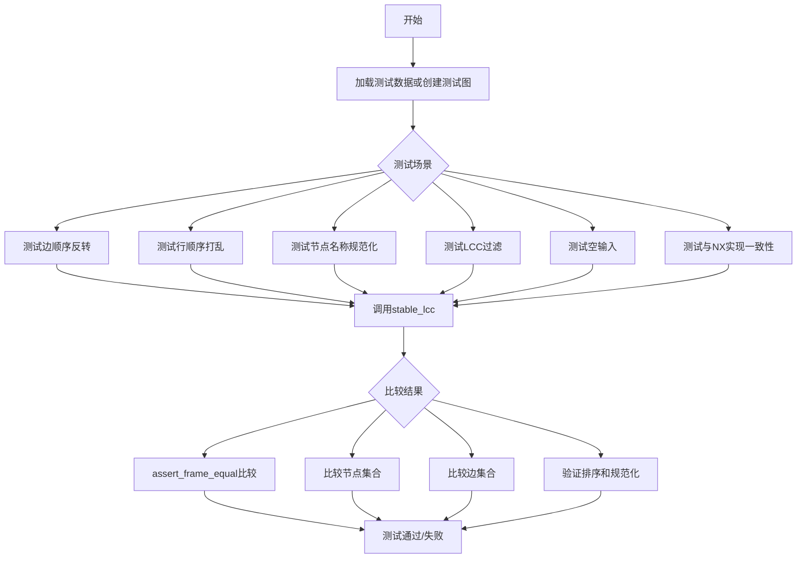

## 类结构

```
无类定义，仅包含全局函数和测试函数
```

## 全局变量及字段


### `FIXTURES_DIR`
    
测试夹具目录路径

类型：`Path`
    


    

## 全局函数及方法


### `_load_fixture`

加载测试夹具数据，将 JSON 文件中的边数据转换为 Pandas DataFrame 格式返回。

参数：该函数无参数。

返回值：`pd.DataFrame`，包含图关系的 DataFrame 对象，其中每行代表一条边，包含 `source`、`target` 和 `weight` 字段。

#### 流程图

```mermaid
flowchart TD
    A[开始] --> B[打开 FIXTURES_DIR/graph.json 文件]
    B --> C[使用 json.load 加载 JSON 数据]
    C --> D[提取 data["edges"] 列表]
    D --> E[使用 pd.DataFrame 转换边列表为 DataFrame]
    E --> F[返回 DataFrame]
    F --> G[结束]
```

#### 带注释源码

```python
def _load_fixture() -> pd.DataFrame:
    """Load the realistic graph fixture as a relationships DataFrame."""
    # 定义夹具目录路径：当前文件所在目录下的 fixtures 文件夹
    FIXTURES_DIR = Path(__file__).parent / "fixtures"
    
    # 打开 graph.json 文件并加载内容
    with open(FIXTURES_DIR / "graph.json") as f:
        data = json.load(f)
    
    # 从 JSON 数据中提取边列表，构造 DataFrame 并返回
    # 返回的 DataFrame 包含 source, target, weight 三列
    return pd.DataFrame(data["edges"])
```


### `_make_relationships`

构建一个关系 DataFrame，该函数接受可变数量的边元组作为参数，将 (source, target, weight) 格式的边转换为 pandas DataFrame，用于后续的图算法测试。

参数：

- `*edges`：`tuple[str, str, float]`，可变数量的边元组，每个元组包含源节点（str）、目标节点（str）和权重（float）

返回值：`pd.DataFrame`，返回一个包含 "source"、"target"、"weight" 三列的 DataFrame，每行代表一条边

#### 流程图

```mermaid
flowchart TD
    A[开始 _make_relationships] --> B{接收 *edges 可变参数}
    B --> C[遍历每个 edge 元组]
    C --> D[解包元组: s, t, w = edge]
    D --> E[构建字典 {'source': s, 'target': t, 'weight': w}]
    E --> F[将字典添加到列表]
    C --> G{是否还有更多边?}
    G -->|是| C
    G -->|否| H[使用 pd.DataFrame 转换字典列表]
    H --> I[返回 DataFrame]
    I --> J[结束]
```

#### 带注释源码

```python
def _make_relationships(*edges: tuple[str, str, float]) -> pd.DataFrame:
    """Build a relationships DataFrame from (source, target, weight) tuples."""
    # 使用列表推导式遍历所有传入的边元组
    # 每个 edge 是一个 tuple[str, str, float]，包含 (源节点, 目标节点, 权重)
    # 将每个元组转换为字典格式，键为 'source', 'target', 'weight'
    return pd.DataFrame([{"source": s, "target": t, "weight": w} for s, t, w in edges])
    # pd.DataFrame() 接收字典列表，列名自动从字典的键提取
    # 返回的 DataFrame 包含三列: source, target, weight
    # 数据类型: source 和 target 为字符串类型，weight 为浮点数类型
```


### `_nx_stable_lcc_node_set`

获取NetworkX实现的稳定最大连通分量（Largest Connected Component）的节点集合，用于与基于DataFrame的`stable_lcc`实现进行对比测试。

参数：

- `relationships`：`pd.DataFrame`，包含图关系的DataFrame，必须包含"source"、"target"和"weight"三列，分别表示边的源节点、目标节点和权重

返回值：`set[str]` 返回稳定最大连通分量中的所有节点名称组成的集合

#### 流程图

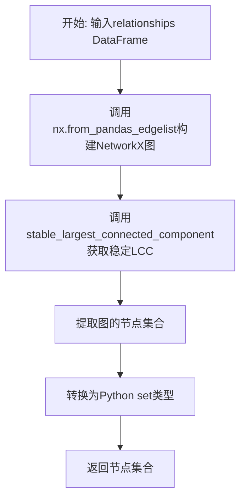

#### 带注释源码

```python
def _nx_stable_lcc_node_set(relationships: pd.DataFrame) -> set[str]:
    """Get the node set from the NX stable_largest_connected_component."""
    # 使用NetworkX的from_pandas_edgelist将pandas DataFrame转换为无向图
    # 参数说明:
    #   - relationships: 包含边的DataFrame
    #   - source: 列名，指定源节点所在列
    #   - target: 列名，指定目标节点所在列
    #   - edge_attr: 要包含的边属性列表，此处为["weight"]
    graph = nx.from_pandas_edgelist(
        relationships,
        source="source",
        target="target",
        edge_attr=["weight"],
    )
    # 调用stable_largest_connected_component函数获取稳定最大连通分量
    # 该函数确保无论图的结构如何变化，选取的连通分量是确定性的
    stable_graph = stable_largest_connected_component(graph)
    # 从稳定图中提取所有节点并转换为set返回
    return set(stable_graph.nodes())
```


### `_nx_stable_lcc_edge_set`

获取NetworkX实现的稳定最大连通分量（Stable Largest Connected Component）的边集合，并返回标准化（排序）后的边集合。

参数：

- `relationships`：`pd.DataFrame`，包含source、target、weight三列的关係数据表

返回值：`set[tuple[str, str]]`，返回标准化后的边集合，其中每条边的两个端点按字母顺序排序（确保(A,B)和(B,A)被视为同一条边）

#### 流程图

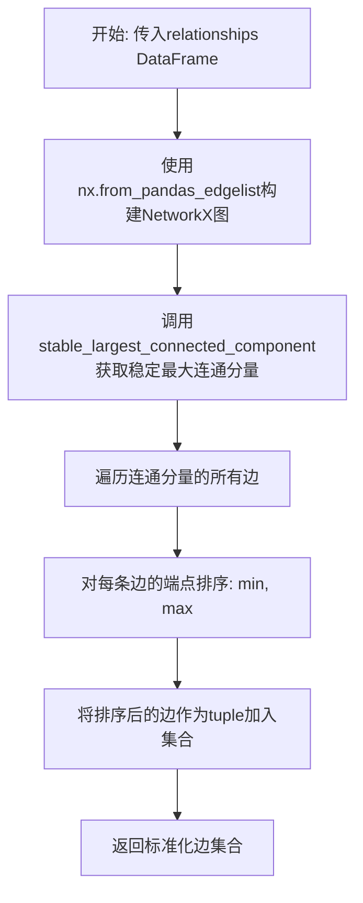

#### 带注释源码

```python
def _nx_stable_lcc_edge_set(relationships: pd.DataFrame) -> set[tuple[str, str]]:
    """Get the edge set from the NX stable_largest_connected_component.
    
    将DataFrame格式的关係数据转换为NetworkX图，
    然后获取其稳定最大连通分量的边集合。
    返回时对每条边的端点进行排序，确保边的唯一性。
    """
    # 使用NetworkX从pandas DataFrame构建无向图
    # source和target列为节点，weight列为边属性
    graph = nx.from_pandas_edgelist(
        relationships,
        source="source",
        target="target",
        edge_attr=["weight"],
    )
    
    # 获取图的稳定最大连通分量
    # stable_largest_connected_component来自tests.unit.graphs.nx_stable_lcc模块
    stable_graph = stable_largest_connected_component(graph)
    
    # 遍历连通分量的所有边，对每条边的端点进行排序
    # 使用min和max确保(A,B)和(B,A)被视为同一条边
    # 返回值为set类型，确保边的唯一性
    return {(min(s, t), max(s, t)) for s, t in stable_graph.edges()}
```


### `test_flipped_edges_produce_same_result`

测试函数，用于验证当图中所有边的方向反转时，`stable_lcc` 函数仍能产生相同的结果。该测试确保了图的方向性不会影响最大连通分量的计算结果，从而验证算法的稳定性。

参数： 无

返回值： `None`，该函数为测试函数，不返回任何值，仅通过断言验证逻辑正确性

#### 流程图

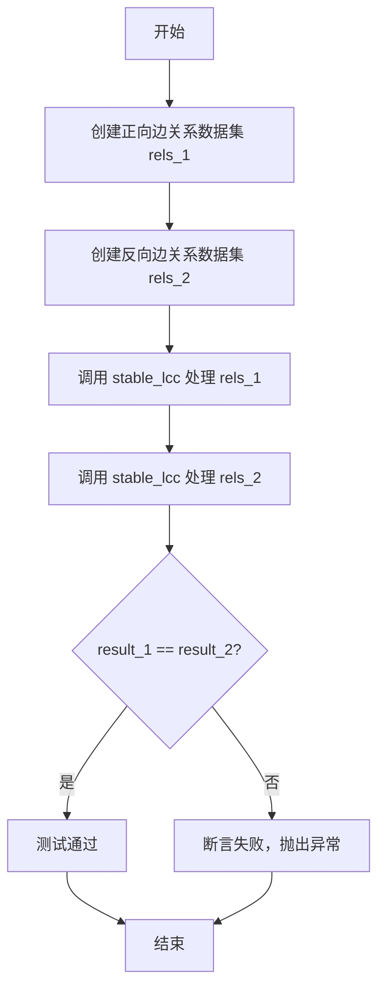

#### 带注释源码

```python
def test_flipped_edges_produce_same_result():
    """Same graph with edges in different direction should produce identical output."""
    # 构建正向边关系数据集：边按 A->B, B->C, C->D, D->E 方向
    rels_1 = _make_relationships(
        ("A", "B", 1.0),
        ("B", "C", 2.0),
        ("C", "D", 3.0),
        ("D", "E", 4.0),
    )
    
    # 构建反向边关系数据集：边方向完全反转 B->A, C->B, D->C, E->D
    # 注意：这是对同一张图的反向表示
    rels_2 = _make_relationships(
        ("B", "A", 1.0),
        ("C", "B", 2.0),
        ("D", "C", 3.0),
        ("E", "D", 4.0),
    )
    
    # 对两个关系数据集分别调用 stable_lcc 函数
    # 期望两者返回相同的结果 DataFrame
    result_1 = stable_lcc(rels_1)
    result_2 = stable_lcc(rels_2)
    
    # 使用 pandas.testing.assert_frame_equal 断言两个 DataFrame 相等
    # 如果结果不一致，会抛出 AssertionError 并显示具体的差异
    assert_frame_equal(result_1, result_2)
```


### `test_shuffled_rows_produce_same_result`

该测试函数用于验证当输入的 relationships DataFrame 行顺序被打乱时，`stable_lcc` 函数仍然能够产生相同的输出结果，确保函数实现的稳定性不受行顺序影响。

参数：

- 该函数没有参数

返回值：`None`，测试函数无返回值，通过 `assert_frame_equal` 断言验证两个结果 DataFrame 相等

#### 流程图

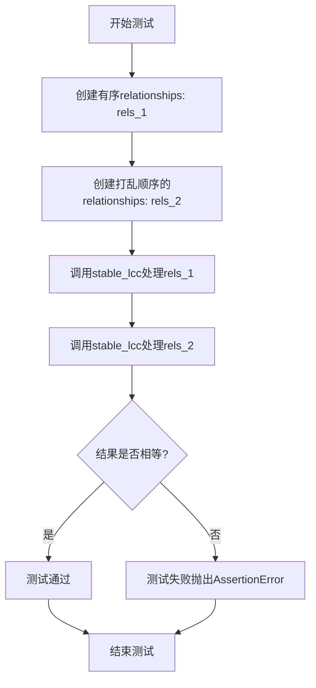

#### 带注释源码

```python
def test_shuffled_rows_produce_same_result():
    """Different row order should produce identical output."""
    # 创建第一个DataFrame，边的顺序为 A->B, B->C, C->D
    rels_1 = _make_relationships(
        ("A", "B", 1.0),
        ("B", "C", 2.0),
        ("C", "D", 3.0),
    )
    
    # 创建第二个DataFrame，边相同但顺序被打乱：C->D, A->B, B->C
    rels_2 = _make_relationships(
        ("C", "D", 3.0),
        ("A", "B", 1.0),
        ("B", "C", 2.0),
    )
    
    # 对两个DataFrame调用stable_lcc函数获取结果
    result_1 = stable_lcc(rels_1)
    result_2 = stable_lcc(rels_2)
    
    # 断言两个结果DataFrame相等，验证行顺序不影响结果
    assert_frame_equal(result_1, result_2)
```


### `test_normalizes_node_names`

验证节点名称规范化功能，确保源图中的节点名称在处理后被正确地大写（uppercased）、去空格（stripped）以及HTML实体解码（HTML-unescaped）。

参数：

- （无参数）

返回值：`None`，测试函数不返回值，通过断言验证逻辑

#### 流程图

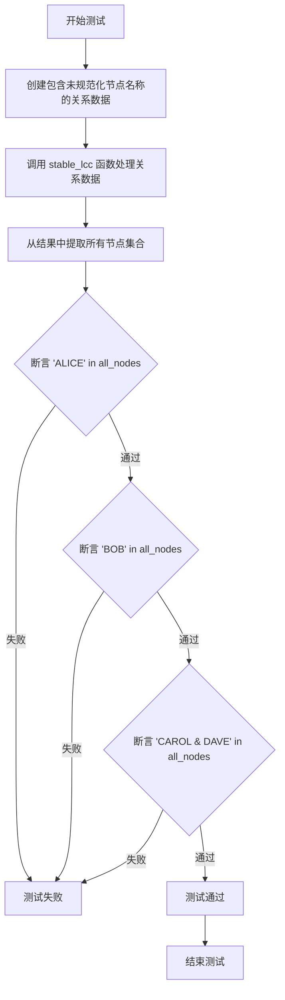

#### 带注释源码

```python
def test_normalizes_node_names():
    """Node names should be uppercased, stripped, and HTML-unescaped."""
    # 创建包含需要规范化的节点名称的关系数据
    # 节点名称包含：前后空格、HTML实体（&amp;）
    rels = _make_relationships(
        ("  alice  ", "bob", 1.0),           # 包含前后空格
        ("bob", "carol &amp; dave", 1.0),   # 包含HTML实体
    )
    
    # 调用 stable_lcc 函数进行最大连通分量过滤和节点名称规范化
    result = stable_lcc(rels)
    
    # 从结果中获取所有唯一节点（合并source和target列）
    all_nodes = set(result["source"]).union(result["target"])
    
    # 断言验证：节点名称被正确规范化
    # 1. 空格被去除 + 转换为大写
    assert "ALICE" in all_nodes
    # 2. 保持大写
    assert "BOB" in all_nodes
    # 3. HTML实体 &amp; 被解码为 & + 转换为大写
    assert "CAROL & DAVE" in all_nodes
```


### `test_filters_to_lcc`

测试 `stable_lcc` 函数是否正确过滤到最大连通分量（只保留最大的连通分量）。

参数：

- 无显式参数（测试函数，依赖 pytest 框架）

返回值：`None`，无返回值（测试函数，断言验证）

#### 流程图

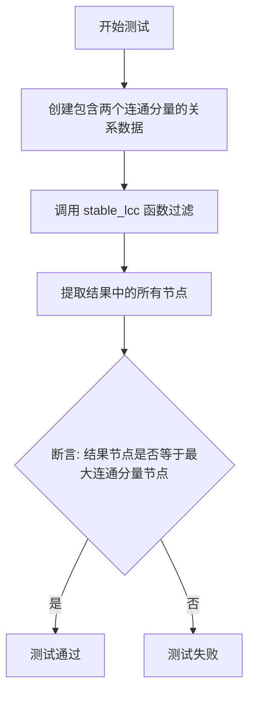

#### 带注释源码

```python
def test_filters_to_lcc():
    """Only the largest component should remain."""
    # 创建一个包含两个连通分量的关系数据集
    # 第一个连通分量: A-B-C (三角形)
    # 第二个连通分量: X-Y (一条边)
    rels = _make_relationships(
        ("A", "B", 1.0),  # 第一个连通分量的边
        ("B", "C", 1.0),  # 第一个连通分量的边
        ("C", "A", 1.0),  # 第一个连通分量的边（形成环）
        ("X", "Y", 1.0),  # 第二个连通分量的边（较小的连通分量）
    )
    
    # 调用被测试的 stable_lcc 函数，期望只保留最大连通分量
    result = stable_lcc(rels)
    
    # 从结果 DataFrame 中提取所有节点（合并 source 和 target 列）
    all_nodes = set(result["source"]).union(result["target"])
    
    # 断言：结果应该只包含最大连通分量的节点 {"A", "B", "C"}
    # 第二个连通分量的节点 {"X", "Y"} 应该被过滤掉
    assert all_nodes == {"A", "B", "C"}
```


### `test_empty_relationships`

测试空输入处理，验证当输入空的relationships DataFrame时，`stable_lcc`函数能正确返回空结果。

参数： 无

返回值： `None`，该测试函数没有返回值，仅通过断言验证结果

#### 流程图

```mermaid
flowchart TD
    A[开始测试] --> B[创建空DataFrame<br/>columns=['source', 'target', 'weight']]
    B --> C[调用stable_lcc函数<br/>传入空relationships]
    C --> D[验证结果<br/>result.empty为True]
    D --> E[测试通过]
```

#### 带注释源码

```python
def test_empty_relationships():
    """Empty input should return empty output."""
    # 创建一个空的DataFrame，只包含列定义（source, target, weight）
    # 不包含任何实际数据
    rels = pd.DataFrame(columns=["source", "target", "weight"])
    
    # 调用stable_lcc函数，传入空的relationships DataFrame
    result = stable_lcc(rels)
    
    # 断言验证返回结果为空
    # 确保stable_lcc函数能够正确处理空输入并返回空的DataFrame
    assert result.empty
```


### `test_node_set_matches_nx`

测试节点集合与 NetworkX 的 stable_largest_connected_component 实现保持一致，确保 DataFrame 版本的 stable_lcc 函数返回的节点集合与 NX 版本的稳定最大连通分量节点集合完全匹配。

参数：无

返回值：无（测试函数，使用 assert 断言进行验证）

#### 流程图

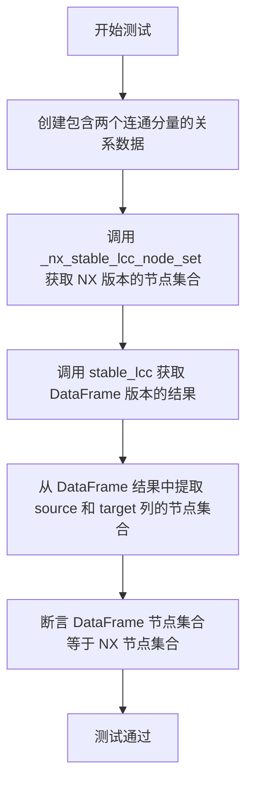

#### 带注释源码

```python
def test_node_set_matches_nx():
    """LCC node set should match the NX stable_largest_connected_component."""
    # 创建一个包含两个连通分量的关系数据集：
    # 连通分量1: A-B-C-D-E (5个节点)
    # 连通分量2: X-Y (2个节点)
    rels = _make_relationships(
        ("A", "B", 1.0),
        ("B", "C", 1.0),
        ("C", "D", 1.0),
        ("D", "E", 1.0),
        ("X", "Y", 1.0),
    )
    # 使用辅助函数获取 NetworkX 版本的稳定最大连通分量节点集合
    nx_nodes = _nx_stable_lcc_node_set(rels)
    # 调用被测试的 stable_lcc 函数，获取 DataFrame 格式的结果
    df_result = stable_lcc(rels)
    # 从 DataFrame 结果中提取所有节点（合并 source 和 target 列）
    df_nodes = set(df_result["source"]).union(df_result["target"])
    # 断言：DataFrame 版本的节点集合应该与 NX 版本的节点集合完全相等
    assert df_nodes == nx_nodes
```


### `test_edge_set_matches_nx`

该测试函数用于验证 DataFrame 版本的 `stable_lcc` 函数所生成的边集合是否与 NetworkX 实现的 `stable_largest_connected_component` 函数生成的边集合保持一致，确保两种实现方式在计算最大连通分量时结果相同。

参数：无需参数

返回值：无返回值（测试函数，使用 assert 进行断言验证）

#### 流程图

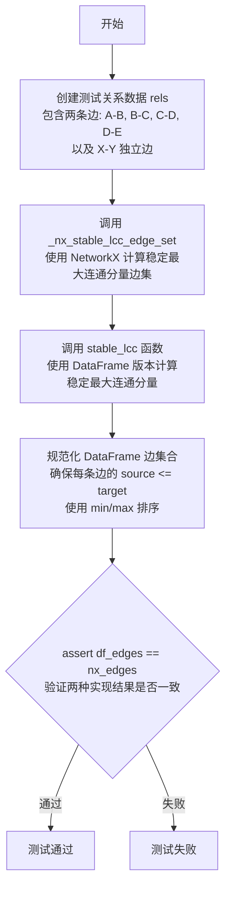

#### 带注释源码

```python
def test_edge_set_matches_nx():
    """
    LCC edge set should match the NX stable_largest_connected_component.
    验证 DataFrame 版本的 stable_lcc 函数计算的边集合
    与 NetworkX 版本的 stable_largest_connected_component 计算的边集合一致。
    """
    # 构建测试用的关系数据，包含一条链状边 A-B-C-D-E
    # 和一条独立的边 X-Y（不与主链相连）
    # 这样可以测试 LCC 过滤功能是否正确工作
    rels = _make_relationships(
        ("A", "B", 1.0),
        ("B", "C", 1.0),
        ("C", "D", 1.0),
        ("D", "E", 1.0),
        ("X", "Y", 1.0),
    )
    
    # 使用辅助函数获取 NetworkX 版本的稳定最大连通分量边集
    # 该函数内部构建 NetworkX 图并调用 stable_largest_connected_component
    nx_edges = _nx_stable_lcc_edge_set(rels)
    
    # 调用待测试的 DataFrame 版本 stable_lcc 函数
    # 期望返回只包含最大连通分量 A-B-C-D-E 的边
    df_result = stable_lcc(rels)
    
    # 从结果 DataFrame 中提取边集合，并规范化边的顺序
    # 使用 min/max 确保每条边的 source <= target（与 NX 版本保持一致）
    # 使用 zip 和 strict=True 确保 source 和 target 配对正确
    df_edges = {
        (min(s, t), max(s, t))
        for s, t in zip(df_result["source"], df_result["target"], strict=True)
    }
    
    # 断言两种实现方式产生的边集合完全相同
    # 如果不相等说明 DataFrame 版本的实现存在问题
    assert df_edges == nx_edges
```


### `test_fixture_node_set_matches_nx`

该测试函数用于验证从真实图谱数据 fixture 加载的关系数据框经过 `stable_lcc` 处理后，得到的最大连通分量（LCC）节点集合与 NetworkX 实现的 `stable_largest_connected_component` 所得到的节点集合完全一致。

参数： 无

返回值： `None`，此为测试函数，无返回值，通过断言验证正确性

#### 流程图

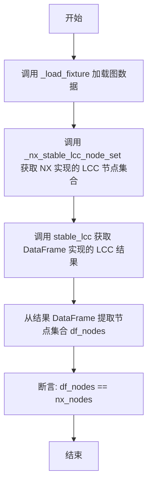

#### 带注释源码

```python
def test_fixture_node_set_matches_nx():
    """Fixture LCC nodes should match NX stable LCC."""
    # 加载真实图谱 fixture 数据作为关系 DataFrame
    rels = _load_fixture()
    
    # 获取 NetworkX 实现的 stable largest connected component 的节点集合
    nx_nodes = _nx_stable_lcc_node_set(rels)
    
    # 调用 DataFrame 版本的 stable_lcc 获取结果
    df_result = stable_lcc(rels)
    
    # 从结果 DataFrame 中提取所有节点（合并 source 和 target 列）
    df_nodes = set(df_result["source"]).union(df_result["target"])
    
    # 断言：DataFrame 实现应产生与 NX 实现相同的节点集合
    assert df_nodes == nx_nodes
```


### `test_fixture_edge_set_matches_nx`

测试夹具边集合与NX一致，验证从真实图夹具加载的边集合是否与NetworkX实现的stable largest connected component返回的边集合相同。

参数：
- （无）

返回值：`None`，无返回值（测试函数）

#### 流程图

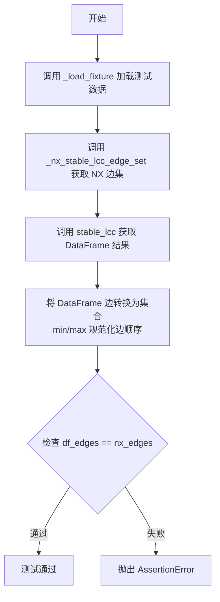

#### 带注释源码

```python
def test_fixture_edge_set_matches_nx():
    """Fixture LCC edges should match NX stable LCC."""
    # 1. 加载真实的图夹具数据作为 relationships DataFrame
    rels = _load_fixture()
    
    # 2. 使用 NX 实现的 stable largest connected component 获取边集
    nx_edges = _nx_stable_lcc_edge_set(rels)
    
    # 3. 调用待测试的 stable_lcc 函数获取 DataFrame 结果
    df_result = stable_lcc(rels)
    
    # 4. 将 DataFrame 中的边转换为集合，并规范化边顺序
    #    使用 min(s, t), max(s, t) 确保边的顺序与 NX 输出一致
    df_edges = {
        (min(s, t), max(s, t))
        for s, t in zip(df_result["source"], df_result["target"], strict=True)
    }
    
    # 5. 断言两边的边集相等，验证实现正确性
    assert df_edges == nx_edges
```


### `test_fixture_edges_are_sorted`

测试输出边排序正确，验证DataFrame返回的边数据按source <= target排序，且行按字典序排列。

参数： 无

返回值：`None`，该函数为测试函数，使用断言验证逻辑，不返回具体值

#### 流程图

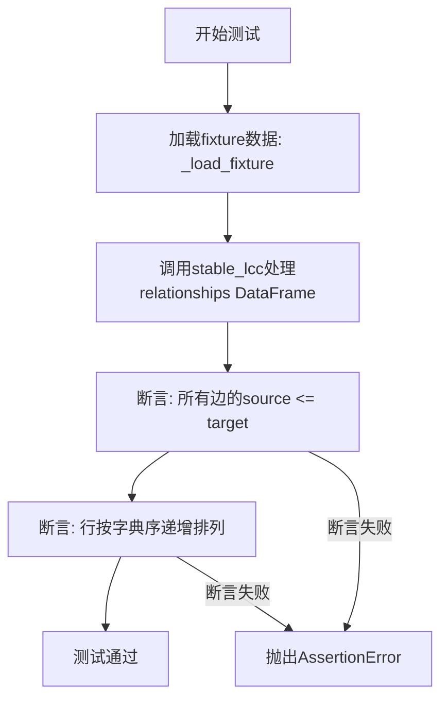

#### 带注释源码

```python
def test_fixture_edges_are_sorted():
    """Output edges should be sorted with source <= target and rows in order."""
    # 1. 从fixture文件加载测试用的关系数据（JSON格式的图数据）
    rels = _load_fixture()
    
    # 2. 调用stable_lcc函数，获取最大连通分量处理后的DataFrame
    result = stable_lcc(rels)
    
    # 3. 断言验证：所有边的source节点名称应 <= target节点名称
    #    这确保边的方向是一致的（无向边规范化）
    assert (result["source"] <= result["target"]).all()
    
    # 4. 断言验证：DataFrame的行按字典序排列（先source再target）
    #    将每一行的source和target转为tuple后检查是否单调递增
    is_sorted = (
        result[["source", "target"]].apply(tuple, axis=1).is_monotonic_increasing
    )
    assert is_sorted
```

## 关键组件


### 稳定最大连通分量计算（Stable LCC）

该模块实现DataFrame格式图的"稳定最大连通分量"计算，通过节点名称规范化（大小写、去除空格、HTML转义）、边方向无关处理、LCC过滤和确定性输出排序，确保结果与NetworkX实现一致。

### 节点名称规范化

在计算LCC前，对节点名称进行预处理：大写转换、去除首尾空格、HTML实体解码，确保"  alice  "、"bob"、"carol &amp; dave"等变体统一为"ALICE"、"BOB"、"CAROL & DAVE"。

### 边方向无关性处理

将所有边视为无向边处理，通过 `min(source, target), max(source, target)` 规范化边表示，确保 ("A", "B") 和 ("B", "A") 被识别为同一条边，产生相同的LCC结果。

### 确定性输出排序

输出DataFrame按 source <= target 规范化边，并按 (source, target) 元组升序排列所有行，确保相同输入始终产生完全一致的输出。

### LCC过滤逻辑

只保留属于最大连通分量的节点和边，过滤掉孤立的小连通分量。测试验证输出只包含 {"A", "B", "C"} 三个节点的环。

### 空输入处理

对空DataFrame输入返回空DataFrame，保持与基准实现的契约一致性。

### NX基准对比

通过 `_nx_stable_lcc_node_set` 和 `_nx_stable_lcc_edge_set` 辅助函数将NetworkX图转换为节点集/边集，验证DataFrame实现的正确性。

## 问题及建议


### 已知问题

-   **代码重复**：多个测试函数中重复构建边集合的逻辑（如 `test_edge_set_matches_nx`、`test_fixture_edge_set_matches_nx`、`test_fixture_edges_are_sorted` 中的边集合构建代码几乎相同）
-   **重复的图构建逻辑**：`_nx_stable_lcc_node_set` 和 `_nx_stable_lcc_edge_set` 函数中都包含相同的 `nx.from_pandas_edgelist` 调用逻辑
-   **缺少错误处理**：`_load_fixture` 函数没有异常处理逻辑，若 fixture 文件不存在或 JSON 格式错误会导致测试失败
-   **边界测试覆盖不足**：缺少对以下边界情况的测试：
  - 权重为 0 或负数的边
  - 自环边（self-loop）
  - 多重边（平行边）
  - 只有单个节点的 DataFrame
  - 权重数据类型错误的情况
-   **魔法数字**：权重值（如 1.0, 2.0, 3.0, 4.0）以字面量形式散布在测试代码中，缺乏常量定义
-   **类型注解不完整**：`_nx_stable_lcc_edge_set` 函数缺少返回类型注解
-   **测试隔离性问题**：测试依赖外部 fixture 文件（`FIXTURES_DIR / "graph.json"`），存在隐式依赖
-   **硬编码路径**：使用硬编码的相对路径 `Path(__file__).parent / "fixtures"`，降低了代码的可移植性

### 优化建议

-   **提取公共函数**：将边集合构建逻辑提取为单独的辅助函数（如 ` _build_edge_set(df_result)`），减少重复代码
-   **合并图构建逻辑**：创建统一的辅助函数来构建 NetworkX 图，避免在 `_nx_stable_lcc_node_set` 和 `_nx_stable_lcc_edge_set` 中重复代码
-   **添加错误处理**：为 `_load_fixture` 添加 try-except 块和明确的错误信息，或使用 pytest 的 `pytest.fixture` 配合 `pytest.mark.parametrize` 来管理 fixture 加载
-   **增加边界测试**：添加针对负权重、自环、多重边、单节点等边界情况的测试用例，提高测试覆盖率
-   **定义常量**：将测试中使用的权重值定义为模块级常量，提高可维护性
-   **完善类型注解**：为所有函数添加完整的类型注解，提高代码可读性和静态检查能力
-   **使用 pytest fixture**：利用 pytest fixture 管理 fixture 加载，提高测试的可维护性和可读性
-   **考虑参数化测试**：对于相似的测试用例（如 flipped edges、shuffled rows），可使用 `@pytest.mark.parametrize` 减少代码冗余

## 其它


### 设计目标与约束

本测试文件的设计目标是验证stable_lcc函数的核心功能正确性，包括：
1. 边的方向不影响结果（无向图等价性）
2. 行的顺序不影响结果（排序稳定性）
3. 节点名规范化（大小写转换、去除空格、HTML转义）
4. 仅保留最大连通分量（LCC过滤）
5. 与NetworkX参考实现的结果一致性

约束条件：
- 输入必须是包含source、target、weight三列的pandas DataFrame
- 节点名必须是字符串类型
- 权重必须是数值类型（float）
- 输出DataFrame的source列必须小于等于target列（规范化边表示）

### 错误处理与异常设计

测试文件中包含的边界情况处理：
- **空输入处理**：test_empty_relationships测试空DataFrame输入，应返回空结果
- **类型假设**：使用pandas的strict=True参数确保source和target长度一致，防止隐式数据丢失

被测stable_lcc函数的异常处理需包含：
- 空输入返回空DataFrame
- 缺失列时抛出KeyError
- 类型错误时抛出TypeError

### 数据流与状态机

数据流：
1. 输入：pd.DataFrame with source, target, weight
2. 节点名规范化：uppercase + strip + HTML unescape
3. 构建内部图结构
4. 计算最大连通分量
5. 过滤边（保留两端节点都在LCC中的边）
6. 规范化边（确保source <= target）
7. 排序输出
8. 输出：pd.DataFrame with source, target, weight

### 外部依赖与接口契约

外部依赖：
- networkx (nx): 图构建和参考实现
- pandas: DataFrame操作
- json: fixture加载
- pathlib: 路径处理
- tests.unit.graphs.nx_stable_lcc: NetworkX参考实现（stable_largest_connected_component）

接口契约：
- stable_lcc(relationships: pd.DataFrame) -> pd.DataFrame
- 输入DataFrame必须包含列：source (str), target (str), weight (float)
- 输出DataFrame包含列：source (str), target (str), weight (float)
- 输出行按(source, target)元组升序排列

### 测试覆盖率分析

测试场景覆盖：
- 方向无关性：test_flipped_edges_produce_same_result
- 顺序无关性：test_shuffled_rows_produce_same_result
- 节点名规范化：test_normalizes_node_names
- LCC过滤：test_filters_to_lcc
- 空输入：test_empty_relationships
- NX对比（节点集）：test_node_set_matches_nx
- NX对比（边集）：test_edge_set_matches_nx
- 真实fixture对比：test_fixture_node_set_matches_nx, test_fixture_edge_set_matches_nx
- 输出排序：test_fixture_edges_are_sorted

覆盖缺口：
- 超大规模图性能测试
- 权重为0或负数的边界情况
- 节点名包含特殊字符（非HTML）的情况
- 自环边处理
- 多重边处理

### 性能考虑

测试文件未包含性能测试，但stable_lcc函数的性能特性：
- 时间复杂度：O(V + E)，取决于图的连通分量计算
- 空间复杂度：O(V + E)，需存储图结构
- 优化建议：对大规模图考虑增量计算或采样验证

### 安全性考虑

测试代码安全措施：
- 使用pathlib.Path防止路径遍历攻击（FIXTURES_DIR已限定为测试文件所在目录）
- 无用户输入处理，无SQL/命令注入风险

### 可维护性与扩展性

代码结构评价：
- 辅助函数职责单一（_load_fixture, _make_relationships, _nx_stable_lcc_node_set, _nx_stable_lcc_edge_set）
- 测试函数命名清晰，意图明确
- 使用pandas.testing.assert_frame_equal确保精确比较

扩展建议：
- 可添加参数控制规范化行为（如是否大小写转换）
- 可添加参数控制排序行为
- fixture数据可版本化以检测回归

### 配置与参数说明

测试代码无运行时配置，但stable_lcc函数预期行为通过测试隐式定义：
- 节点名规范化规则：uppercase + strip + HTML unescape
- 边规范化：source <= target
- 行排序：lexicographic by (source, target)

### 版本兼容性与依赖

依赖版本要求（从import推断）：
- networkx: 需支持from_pandas_edgelist
- pandas: 需支持DataFrame和strict参数（pandas 2.0+）
- Python: 需支持match-case（Python 3.10+）

测试文件头部版权声明表明这是Microsoft GraphRAG项目的一部分，使用MIT许可证。

    