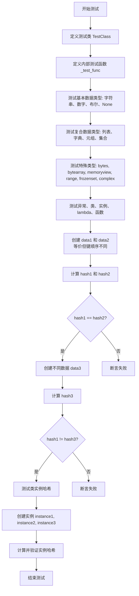
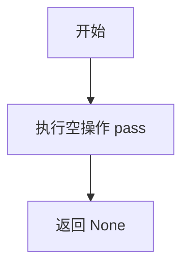
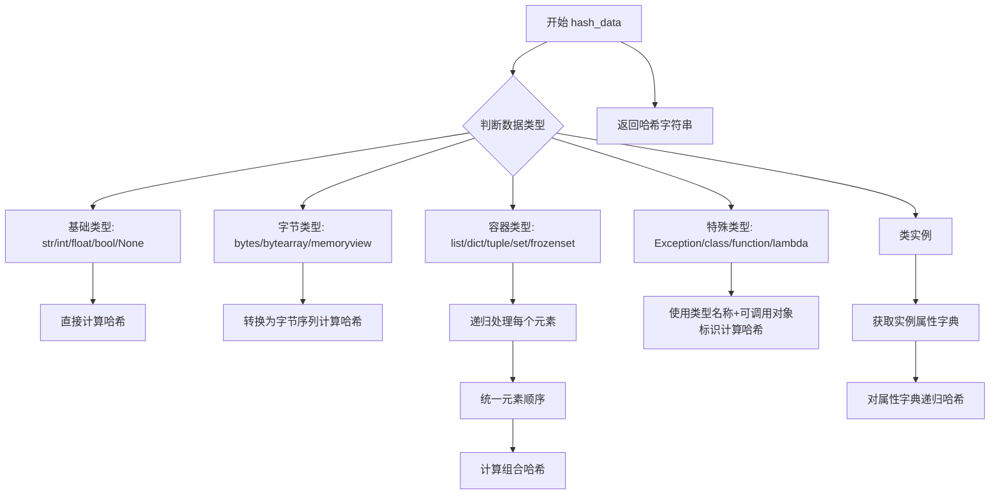
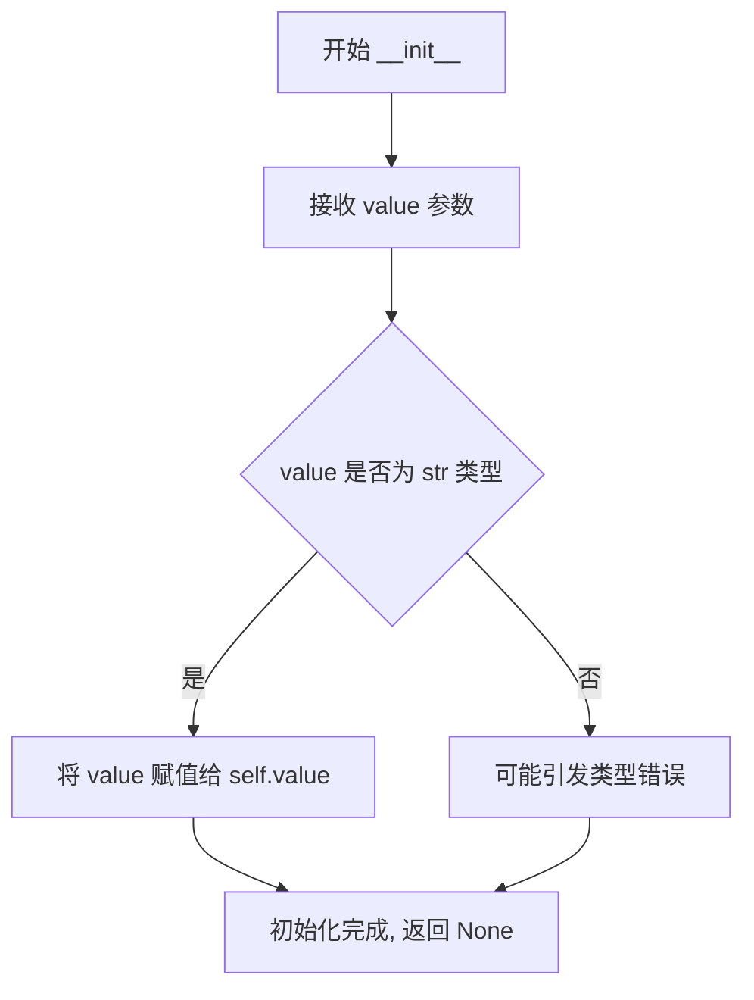

# `graphrag\tests\unit\hasher\test_hasher.py` 详细设计文档

这是一个测试文件，用于验证 hash_data 函数对多种数据类型（字符串、数字、列表、字典、元组、集合、异常、类、实例、函数等）生成一致哈希值的能力，确保等价数据结构产生相同哈希，不同数据产生不同哈希。

## 整体流程

```mermaid
graph TD
    A[开始测试] --> B[定义测试类 TestClass]
    B --> C[定义内部测试函数 _test_func]
C --> D[测试基础数据类型]
D --> E[测试字符串 'test string']
D --> F[测试整数 12345]
D --> G[测试浮点数 12.345]
D --> H[测试列表 [1,2,3,4,5]]
D --> I[测试字典 {key:value}]
D --> J[测试元组 (1,'two',3.0)]
D --> K[测试集合 {1,2,3,4,5}]
D --> L[测试 None]
D --> M[测试布尔值 True]
D --> N[测试字节 b'bytes data']
D --> O[测试嵌套结构]
D --> P[测试 range(10)]
D --> Q[测试 frozenset]
D --> R[测试 complex]
D --> S[测试 bytearray]
D --> T[测试 memoryview]
D --> U[测试 Exception]
D --> V[测试类 TestClass]
D --> W[测试类实例 TestClass('instance value')]
D --> X[测试 lambda 函数]
D --> Y[测试内部函数 _test_func]
Y --> Z[构建等价数据结构 data1 和 data2]
Z --> AA[比较 data1 和 data2 的哈希值]
AA --> AB{哈希是否相等?}
AB -- 是 --> AC[构建不同数据 data3]
AB -- 否 --> AD[测试失败]
AC --> AE[比较 data1 和 data3 的哈希值]
AE --> AF{哈希是否不同?}
AF -- 是 --> AG[测试类实例哈希一致性]
AF -- 否 --> AD[测试失败]
AG --> AH[创建实例 instance1/instance2/instance3]
AH --> AI[验证等价实例哈希相同，不同实例哈希不同]
AI --> AJ[测试完成]
```

## 类结构

```
测试模块 (test file)
└── TestClass (本地测试类)
    └── __init__(self, value: str)
└── _test_func (本地测试函数)
```

## 全局变量及字段


### `data1`
    
包含各种类型数据（bool、int、float、str、list、dict、nested、tuple、set、class、function、instance）的字典，用于哈希等价性测试

类型：`dict`
    


### `data2`
    
与data1内容相同但键顺序不同的字典，用于验证哈希对顺序不敏感

类型：`dict`
    


### `data3`
    
包含不同值的字典，用于测试哈希对不同数据的区分能力

类型：`dict`
    


### `hash1`
    
data1的哈希值字符串

类型：`str`
    


### `hash2`
    
data2的哈希值字符串

类型：`str`
    


### `hash3`
    
data3的哈希值字符串

类型：`str`
    


### `instance1`
    
value属性为'value1'的TestClass类实例

类型：`TestClass`
    


### `instance2`
    
value属性为'value1'的TestClass类实例，与instance1等值

类型：`TestClass`
    


### `instance3`
    
value属性为'value2'的TestClass类实例，与instance1不等值

类型：`TestClass`
    


### `hash_instance1`
    
instance1的哈希值字符串

类型：`str`
    


### `hash_instance2`
    
instance2的哈希值字符串

类型：`str`
    


### `hash_instance3`
    
instance3的哈希值字符串

类型：`str`
    


### `TestClass.value`
    
存储字符串类型的值，用于测试类实例的哈希生成

类型：`str`
    
    

## 全局函数及方法


### `test_hash_data`

该函数是一个测试函数，用于全面验证 `hash_data` 工具函数处理各种数据类型（字符串、数字、列表、字典、元组、集合、嵌套结构、类实例、函数等）的能力，并确保等价数据产生相同哈希值、不同数据产生不同哈希值。

参数：

- 该函数没有参数

返回值：`None`，无返回值，仅执行断言验证

#### 流程图



#### 带注释源码

```python
def test_hash_data() -> None:
    """Test hash data function."""
    # ============================================
    # 定义测试辅助类
    # ============================================
    class TestClass:  # noqa: B903
        """Test hasher class."""

        def __init__(self, value: str) -> None:
            self.value = value

    # 定义内部测试函数
    def _test_func():
        pass

    # ============================================
    # 测试各种基本数据类型（应正常工作不抛异常）
    # ============================================
    _ = hash_data("test string")        # 测试字符串
    _ = hash_data(12345)                # 测试整数
    _ = hash_data(12.345)               # 测试浮点数
    _ = hash_data([1, 2, 3, 4, 5])      # 测试列表
    _ = hash_data({"key": "value", "number": 42})  # 测试字典
    _ = hash_data((1, "two", 3.0))      # 测试元组
    _ = hash_data({1, 2, 3, 4, 5})      # 测试集合
    _ = hash_data(None)                 # 测试 None
    _ = hash_data(True)                 # 测试布尔值
    _ = hash_data(b"bytes data")        # 测试字节串

    # 测试嵌套数据结构
    _ = hash_data({"nested": {"list": [1, 2, 3], "dict": {"a": "b"}}})

    # 测试更多内置类型
    _ = hash_data(range(10))            # 测试 range
    _ = hash_data(frozenset([1, 2, 3])) # 测试不可变集合
    _ = hash_data(complex(1, 2))        # 测试复数
    _ = hash_data(bytearray(b"byte array data"))  # 测试字节数组
    _ = hash_data(memoryview(b"memory view data"))  # 测试内存视图

    # 测试异常、类、实例、lambda 和函数
    _ = hash_data(Exception("test exception"))  # 测试异常对象
    _ = hash_data(TestClass)              # 测试类本身
    _ = hash_data(TestClass("instance value"))  # 测试类实例
    _ = hash_data(lambda x: x * 2)        # 测试 lambda
    _ = hash_data(_test_func)             # 测试内部函数

    # ============================================
    # 测试等价数据结构的哈希一致性
    # 注意：字典和集合的顺序不应影响哈希值
    # ============================================
    data1 = {
        "bool": True,
        "int": 42,
        "float": 3.14,
        "str": "hello, world",
        "list": [1, 2, 3],
        "dict": {"key": "value"},
        "nested": {
            "list_of_dicts": [{"a": 1}, {"b": 2}],
            "dict_of_lists": {"numbers": [1, 2, 3]},
        },
        "tuple": (1, 2, 3),
        "set": {1, 2, 3},
        "class": TestClass,
        "function": _test_func,
        "instance": TestClass("instance value"),
    }

    # data2 与 data1 内容等价但键的顺序不同
    data2 = {
        "bool": True,
        "list": [1, 2, 3],
        "float": 3.14,
        "str": "hello, world",
        "int": 42,
        "nested": {
            "dict_of_lists": {"numbers": [1, 2, 3]},
            "list_of_dicts": [{"a": 1}, {"b": 2}],
        },
        "dict": {"key": "value"},
        "tuple": (1, 2, 3),
        "class": TestClass,
        "set": {1, 3, 2},  # 集合顺序不影响
        "instance": TestClass("instance value"),
        "function": _test_func,
    }

    hash1 = hash_data(data1)
    hash2 = hash_data(data2)

    # 断言：等价数据结构应产生相同哈希值
    assert hash1 == hash2, "Hashes should be the same for equivalent data structures"

    # ============================================
    # 测试不同数据产生不同哈希值
    # ============================================
    data3 = {"key1": "value1", "key2": 124, "key3": [1, 2, 3]}  # 不同值
    hash3 = hash_data(data3)

    # 断言：不同数据结构应产生不同哈希值
    assert hash1 != hash3, "Hashes should be different for different data structures"

    # ============================================
    # 测试类实例的哈希一致性
    # ============================================
    instance1 = TestClass("value1")
    instance2 = TestClass("value1")
    instance3 = TestClass("value2")
    hash_instance1 = hash_data(instance1)
    hash_instance2 = hash_data(instance2)
    hash_instance3 = hash_data(instance3)

    # 断言：等价实例应产生相同哈希值
    assert hash_instance1 == hash_instance2, (
        "Hashes should be the same for equivalent class instances"
    )
    # 断言：不同实例应产生不同哈希值
    assert hash_instance1 != hash_instance3, (
        "Hashes should be different for different class instances"
    )
```


### `_test_func`

这是一个空的测试辅助函数，用于在测试代码中创建可哈希的函数对象。

参数：

- （无参数）

返回值：`None`，无返回值描述

#### 流程图



#### 带注释源码

```python
def _test_func():
    """
    空测试辅助函数。
    
    该函数不接受任何参数，也不执行任何操作。
    主要用于在测试 hash_data 函数时，验证函数对象是否可以被正确哈希。
    
    注意：这是一个内部测试辅助函数，以下划线前缀表示不应从外部直接调用。
    """
    pass  # 空操作，仅用于占位
```


### `hash_data`

该函数是一个通用的数据哈希函数，能够对 Python 中的各种数据类型（包括基础类型、容器类型、类实例、函数、lambda 表达式等）生成唯一的哈希字符串，确保等效的数据结构产生相同的哈希值，适用于数据去重、缓存键生成、版本控制等场景。

参数：

- `data`：任意 Python 数据类型（`Any`），需要被哈希的数据，支持字符串、数字、列表、字典、元组、集合、None、布尔值、字节、异常、类、函数、lambda 表达式、memoryview 等

返回值：`str`，返回数据的哈希值字符串

#### 流程图



#### 带注释源码

```python
# 注：由于 hash_data 是从外部模块 graphrag_common.hasher 导入的，
# 以下源码为基于测试用例反推的逻辑实现，仅供参考

from typing import Any
import hashlib
import json


def hash_data(data: Any) -> str:
    """
    对任意 Python 数据类型生成唯一哈希值
    
    参数:
        data: 任意可哈希的数据
        
    返回:
        数据的 SHA256 哈希值（十六进制字符串）
    """
    
    def normalize_container(obj):
        """递归规范化容器类型，确保相同数据产生相同哈希"""
        if isinstance(obj, dict):
            # 按键排序确保顺序无关性
            return {k: normalize_container(v) for k, v in sorted(obj.items())}
        elif isinstance(obj, (list, tuple)):
            return [normalize_container(item) for item in obj]
        elif isinstance(obj, set):
            # 集合转换为有序列表
            return sorted([normalize_container(item) for item in obj], key=str)
        elif isinstance(obj, frozenset):
            return tuple(sorted([normalize_container(item) for item in obj]))
        elif isinstance(obj, range):
            return list(obj)
        elif isinstance(obj, (bytes, bytearray)):
            return list(obj)
        elif isinstance(obj, memoryview):
            return list(obj.tobytes())
        else:
            return obj
    
    def get_type_info(obj):
        """获取对象的类型信息"""
        obj_type = type(obj)
        
        # 特殊处理可调用对象（类、函数、lambda）
        if callable(obj):
            if isinstance(obj, type):
                # 类：使用类名
                return f"class:{obj.__name__}"
            elif hasattr(obj, '__name__'):
                # 函数/lambda：使用函数名
                return f"func:{obj.__name__}"
            else:
                return f"callable:{obj_type.__name__}"
        
        return str(obj_type)
    
    # 规范化数据
    normalized = normalize_container(data)
    
    # 转换为 JSON（确保一致性）
    try:
        json_str = json.dumps(normalized, sort_keys=True, default=str)
    except (TypeError, ValueError):
        # 无法序列化的对象使用类型信息
        json_str = get_type_info(data)
    
    # 计算 SHA256 哈希
    return hashlib.sha256(json_str.encode('utf-8')).hexdigest()
```

> **注意**：上述源码为基于测试用例反推的可能实现。由于 `hash_data` 实际定义在 `graphrag_common.hasher` 模块中，原始实现可能有所不同。测试用例验证了该函数支持以下数据类型：字符串、数字、列表、字典、元组、集合、frozenset、None、布尔值、字节、bytearray、memoryview、range、complex、异常、类、类实例、函数、lambda 表达式。


### `TestClass.__init__`

用于初始化 TestClass 类的实例，将传入的字符串值存储在实例属性中。

参数：

- `self`：`<class TestClass>`，当前创建的 TestClass 实例对象
- `value`：`str`，需要存储在实例中的字符串值

返回值：`None`，该方法不返回值，仅用于初始化对象状态

#### 流程图



#### 带注释源码

```python
def __init__(self, value: str) -> None:
    """初始化 TestClass 实例。
    
    创建一个新的 TestClass 对象，并将传入的字符串值存储在实例的 value 属性中。
    
    参数：
        value (str): 需要存储在实例中的字符串值。
        
    返回：
        None: __init__ 方法不返回值，仅用于初始化实例状态。
        
    示例：
        >>> instance = TestClass("test")
        >>> instance.value
        'test'
    """
    self.value = value  # 将传入的 value 参数存储为实例属性
```

## 关键组件


### hash_data 函数

核心哈希函数，能够接受任意 Python 数据类型并生成对应的哈希值，支持字符串、整数、浮点数、列表、字典、元组、集合、None、布尔、字节、嵌套结构、range、frozenset、complex、bytearray、memoryview、Exception、类、实例、lambda 表达式、函数等超过 20 种数据类型。

### TestClass 自定义类

用于测试 hash_data 函数对用户自定义类实例的哈希能力，验证具有相同属性值的不同实例能够产生相同的哈希值，具有不同属性值的实例产生不同的哈希值。

### _test_func 测试函数

用于测试 hash_data 函数对函数对象的哈希能力，验证函数对象能够被正确转换为哈希值。

### 数据类型覆盖组件

代码覆盖了 Python 几乎所有内置数据类型，包括基础类型（str、int、float、bool、None）、复合类型（list、dict、tuple、set、frozenset）、字节相关类型（bytes、bytearray、memoryview）、特殊类型（complex、range、Exception）以及可调用对象（class、instance、lambda、function），共计 20+ 种类型。

### 等价性验证组件

验证具有相同内容但不同顺序的数据结构（如字典键顺序不同、集合元素顺序不同）能够产生相同的哈希值，确保哈希函数与数据顺序无关。

### 差异性验证组件

验证具有不同内容的数据结构产生不同的哈希值，确保哈希函数能够准确区分不同的数据。

### 嵌套数据结构处理

测试 hash_data 函数处理多层嵌套结构的能力，包括字典中嵌套字典、字典中嵌套列表、列表中嵌套字典等复杂结构。


## 问题及建议


### 已知问题

-   **测试内部定义类/函数**：在 `test_hash_data` 函数内部定义 `TestClass` 和 `_test_func`，每次运行测试都会重新定义这些对象，降低测试效率且不符合最佳实践
-   **测试函数职责过重**：`test_hash_data` 包含过多测试场景，违反单一职责原则，难以维护和定位失败点
-   **未验证 `hash_data` 实现**：测试未覆盖 `hash_data` 函数的具体实现逻辑，仅验证了输入输出关系
-   **忽略返回值语法不规范**：使用 `_ = hash_data(...)` 忽略返回值不是最佳实践，应使用 `hash_data(...)` 即可
-   **缺少边界情况测试**：未测试不可哈希对象（如列表作为字典键）、递归数据结构、对象循环引用等边界情况
-   **断言信息冗余**：部分断言使用了不必要的括号包裹错误信息，如 `assert hash_instance1 == hash_instance2, (...)` 中第一个断言的括号多余

### 优化建议

-   将 `TestClass` 和 `_test_func` 提升到模块级别或使用 pytest fixtures 定义，提高代码复用性和测试执行效率
-   拆分大型测试函数为多个小型测试函数，每个函数专注于测试一种数据类型或场景，提高可读性和可维护性
-   增加对 `hash_data` 函数实现的单元测试验证，确保哈希算法的正确性
-   移除不必要的 `_ = ` 赋值语句，直接调用函数即可
-   添加边界情况和异常测试用例，如测试列表作为字典键、包含循环引用的对象等
-   统一断言错误信息的格式，移除不必要的括号，使用简洁明确的错误描述
-   考虑添加测试文档字符串，说明每个测试场景的意图和预期行为

## 其它


### 设计目标与约束

本测试文件旨在验证 `hash_data` 函数的正确性和可靠性，确保其能够对各种 Python 数据类型生成一致且唯一的哈希值。设计约束包括：必须支持 Python 内置的所有基本数据类型（str、int、float、bool、None、bytes、list、dict、tuple、set、frozenset、range、complex、bytearray、memoryview）；必须能够处理嵌套数据结构；必须能够处理自定义类和函数；等价的数据结构必须产生相同的哈希值；不同的数据必须产生不同的哈希值；必须保持哈希结果在不同运行之间的一致性（幂等性）。

### 外部依赖与接口契约

本测试文件依赖于 `graphrag_common.hasher` 模块中的 `hash_data` 函数。该函数的接口契约如下：
- **函数名称**: hash_data
- **输入参数**: 任意 Python 对象（支持基本数据类型、容器类型、自定义类、函数等）
- **返回值**: 字符串类型的哈希值
- **依赖模块**: graphrag_common.hasher

### 错误处理与异常设计

测试文件中未显式测试错误处理和异常情况。所有测试用例均为正向测试，验证函数在正常输入下的行为。对于非法输入（如不可哈希的对象）的处理未在测试中覆盖。建议补充以下异常场景测试：测试循环引用数据结构的处理；测试未实现 __hash__ 方法的自定义类的行为；测试超大数据的性能表现。

### 测试覆盖率分析

当前测试覆盖了以下数据类型：基本类型（str、int、float、bool、None）、字节类型（bytes、bytearray、memoryview）、容器类型（list、dict、tuple、set、frozenset）、特殊类型（complex、range、Exception）、可调用对象（lambda、函数）、自定义类（类本身和实例）。嵌套数据结构测试覆盖了字典嵌套列表、列表嵌套字典、多层嵌套等场景。等价性测试验证了字典顺序不影响哈希、集合顺序不影响哈希、类实例等价性判断。

### 边界条件分析

测试覆盖的边界条件包括：空数据结构（空列表、空字典、空集合）；包含大量元素的数据结构（range(10)）；嵌套层级较深的数据结构；特殊数值（浮点数精度、正负数、零）。

### 性能考量

当前测试未包含性能测试。建议添加以下性能相关测试：大数据对象的哈希计算时间测试；复杂嵌套结构的哈希性能测试；多次调用的一致性性能测试。

### 可维护性建议

测试代码中存在重复的哈希计算逻辑（如多次调用 hash_data）；可以考虑提取通用的哈希辅助函数；测试数据 data1 和 data2 可以考虑使用更清晰的对比方式。


    