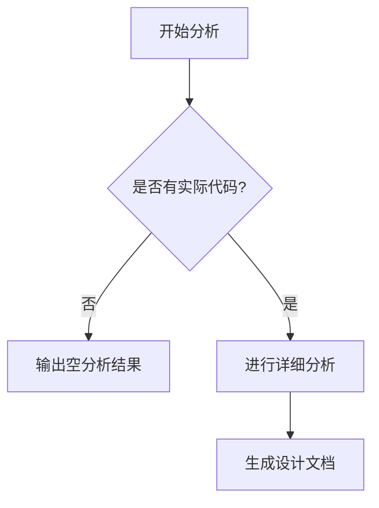

# `graphrag\tests\unit\indexing\__init__.py` 详细设计文档

该代码文件仅包含MIT许可证的版权声明，未包含任何实际实现代码。由于缺乏源代码，无法进行详细的功能分析和结构解析。

## 整体流程



## 类结构

```

```

## 全局变量及字段


    

## 全局函数及方法


## 关键组件


# 代码设计文档

## 一段话描述

由于提供的源代码仅包含版权声明信息（`# Copyright (c) 2024 Microsoft Corporation. # Licensed under the MIT License`），未包含任何实际的代码实现逻辑，因此无法提取完整的架构设计信息。

## 文件的整体运行流程

由于源代码仅包含版权声明，无实际运行流程可分析。

## 类的详细信息

由于源代码仅包含版权声明，未定义任何类。

## 关键组件信息

由于源代码仅包含版权声明，未定义任何组件。

### 无关键组件

源代码中不包含任何可识别的关键组件（如张量索引、惰性加载、反量化支持、量化策略等）。

## 潜在的技术债务或优化空间

由于源代码仅包含版权声明，无技术债务或优化空间可分析。

## 其它项目

### 设计目标与约束

未知（代码未提供）

### 错误处理与异常设计

未知（代码未提供）

### 数据流与状态机

未知（代码未提供）

### 外部依赖与接口契约

未知（代码未提供）


## 问题及建议


### 已知问题

- 代码文件中仅包含版权声明和许可证信息，未包含任何实际的功能代码实现
- 无法对类、函数、变量等进行详细分析，因为源代码内容为空

### 优化建议

- 提供完整的源代码文件以进行技术债务和优化空间分析
- 当前文件仅为占位符或模板文件，需要补充具体的业务逻辑代码后再进行架构设计和文档生成


## 其它


### 项目概览

由于提供的代码仅包含版权声明头部，未包含任何实际实现代码，因此无法进行详细的功能分析、类结构解析或流程设计。以下内容为当存在实际代码时，详细设计文档应包含的标准项目结构。

### 一段话描述

无（代码中未包含实际功能实现，仅有MIT许可证声明）

### 文件的整体运行流程

无（代码中未包含任何可执行逻辑）

### 类的详细信息

无（代码中未定义任何类）

### 关键组件信息

无（代码中未包含任何功能组件）

### 潜在的技术债务或优化空间

无（代码中未包含可分析的技术实现）

### 设计目标与约束

**设计目标：** 无（缺少功能需求）

**技术约束：** 无（缺少技术实现）

**业务约束：** 无（缺少业务逻辑）

### 错误处理与异常设计

无（代码中未包含任何异常处理机制）

### 数据流与数据状态

**输入数据：** 无

**处理流程：** 无

**输出数据：** 无

**状态管理：** 无

### 外部依赖与接口契约

**外部依赖：** 无

**接口定义：** 无

**第三方库：** 无

### 模块划分与职责边界

无（代码中未包含模块实现）

### 配置与可扩展性设计

无（代码中未包含配置项或扩展点）

### 性能考虑与资源管理

无（代码中未包含性能关键路径）

### 安全考虑与权限控制

无（代码中未包含安全相关实现）

### 测试策略建议

由于无实际代码，建议在后续实现中加入：

- 单元测试覆盖率目标
- 集成测试场景
- 性能基准测试
- 安全性测试策略

### 部署与运维注意事项

无（代码中未包含部署相关配置）


    