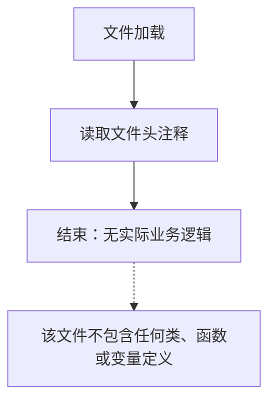

# `graphrag\tests\unit\indexing\cache\__init__.py` 详细设计文档

该源代码文件仅包含版权和许可证声明头部信息，没有实际的代码实现，仅作为文件占位符或模板使用。

## 整体流程



## 类结构

```

```

## 全局变量及字段


    

## 全局函数及方法


## 关键组件


### 核心功能概述

该代码文件仅包含版权声明头，未包含任何实际实现代码，无法提取核心功能信息。

### 文件整体运行流程

由于代码为空，不存在可描述的运行流程。

### 类详细信息

由于代码为空，不存在可提取的类信息。

### 全局变量与全局函数

由于代码为空，不存在可提取的全局变量和函数信息。

### 关键组件信息

由于代码为空，不存在可识别的关键组件（如张量索引、惰性加载、反量化支持、量化策略等）。

### 技术债务与优化空间

由于代码为空，不存在技术债务评估的基础。

### 其它项目

- **设计目标与约束**: 无从分析
- **错误处理与异常设计**: 无从分析
- **数据流与状态机**: 无从分析
- **外部依赖与接口契约**: 无从分析


## 问题及建议


### 已知问题

-   代码文件仅包含版权声明，未包含任何实际实现代码，无法进行详细的技术分析
-   缺少具体的业务逻辑、类定义、函数实现等核心代码内容

### 优化建议

-   提供完整的代码实现以便进行全面的技术债务分析和优化建议
-   如代码仍在开发中，建议在完成主要功能后再进行设计文档的生成
-   当前阶段可先完善代码结构，包括类设计、方法实现、错误处理机制等


## 其它


### 设计目标与约束

本项目旨在定义清晰的架构原则和技术边界，确保系统设计满足可扩展性、可维护性和性能要求。由于当前代码仅包含版权声明，暂无具体设计目标。

### 错误处理与异常设计

代码中未实现具体的错误处理机制。在实际开发中，应建立统一的异常捕获、日志记录和错误上报流程，确保系统异常能够被及时发现和处理。

### 数据流与状态机

当前代码片段不涉及数据流或状态机的实现。对于完整项目，应描述数据的输入、处理、输出流程，以及可能的状态转换逻辑。

### 外部依赖与接口契约

本代码目前无外部依赖。后续开发中应明确列出所有第三方库依赖、API接口规范、版本要求以及兼容性约束。

### 性能要求与基准

由于代码仅包含许可证声明，无法评估性能指标。项目应定义响应时间、吞吐量、资源利用率等关键性能指标。

### 安全性设计

应包含身份认证、授权控制、数据加密、输入验证等安全机制的设计规范。

### 兼容性规划

明确支持的运行环境、浏览器、操作系统版本，以及向前向后兼容的策略。

### 测试策略

定义单元测试、集成测试、系统测试的覆盖范围和测试用例设计原则。

### 部署架构

描述生产环境的部署拓扑、容器化方案、负载均衡和高可用性设计。

### 版本演进路线

规划功能迭代、API版本管理、迁移策略和升级路径。

    