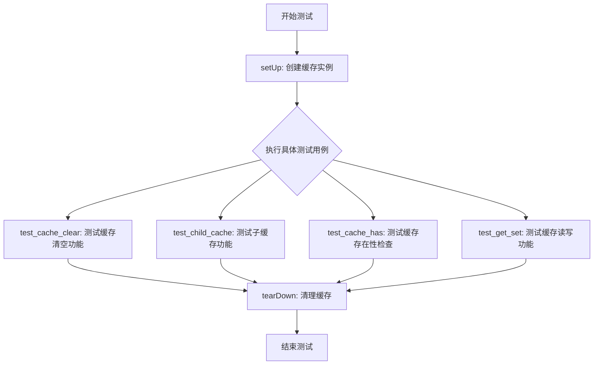
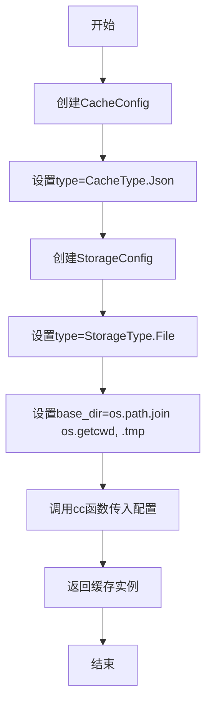
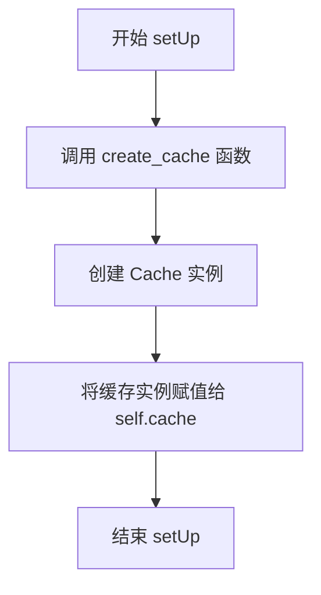
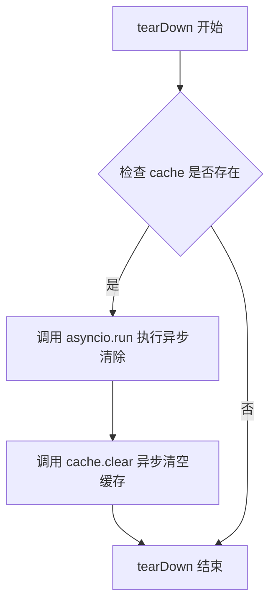
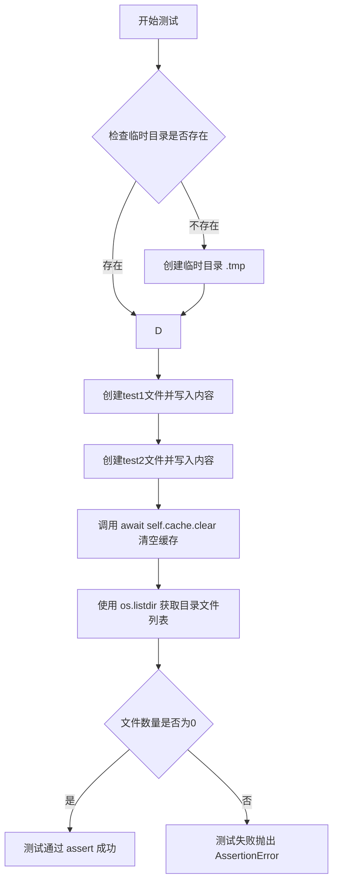
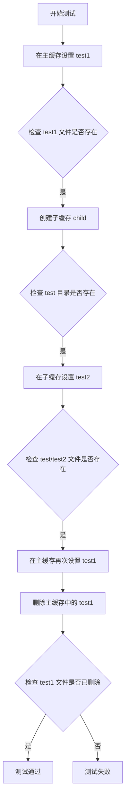

```mermaid
graph TD
    A[开始测试] --> B[创建测试字符串: test1 = 'this is a test file']
    B --> C[异步设置缓存: cache.set&#40;'test1', test1&#41;]
    C --> D{断言: cache.has&#40;'test1'&#41; 返回 true}
    D -->|通过| E{断言: cache.has&#40;'NON_EXISTENT'&#41; 返回 false}
    E -->|通过| F{断言: cache.get&#40;'NON_EXISTENT'&#41; 返回 None}
    F -->|通过| G[测试通过]
    D -->|失败| H[测试失败]
    E -->|失败| H
    F -->|失败| H
```

# `graphrag\tests\unit\indexing\cache\test_file_pipeline_cache.py` 详细设计文档

这是一个基于 unittest.IsolatedAsyncioTestCase 的异步测试文件，用于测试 graphrag_cache 库的缓存功能，包括缓存的创建、设置、获取、删除、清空以及子缓存等核心功能的正确性。

## 整体流程



## 类结构

```
unittest.IsolatedAsyncioTestCase (Python标准库基类)
└── TestFilePipelineCache (测试类)
```

## 全局变量及字段


### `TEMP_DIR`
    
临时目录路径字符串，值为 './.tmp'

类型：`str`
    


### `TestFilePipelineCache.self.cache`
    
缓存实例对象

类型：`Cache`
    
    

## 全局函数及方法


### `create_cache`

创建并返回一个配置好的缓存实例，使用Json类型的缓存和File类型的存储。

参数：
- 该函数无参数

返回值：`缓存实例`，返回通过 `graphrag_cache.create_cache` 创建的配置好的缓存实例

#### 流程图



#### 带注释源码

```python
# 导入必要的标准库和第三方库
import asyncio
import os
import unittest

# 从 graphrag_cache 模块导入缓存配置相关类
from graphrag_cache import CacheConfig, CacheType
# 导入 create_cache 函数并重命名为 cc
from graphrag_cache import create_cache as cc
# 从 graphrag_storage 模块导入存储配置相关类
from graphrag_storage import StorageConfig, StorageType

# 定义临时目录常量
TEMP_DIR = "./.tmp"


def create_cache():
    """
    创建并返回一个配置好的缓存实例
    
    该函数使用 Json 类型的缓存和 File 类型的存储来创建缓存实例。
    存储基础目录设置为当前工作目录下的 .tmp 文件夹。
    
    返回:
        缓存实例: 配置好的缓存对象，可用于数据的存取操作
    """
    # 调用 cc 函数（即 graphrag_cache.create_cache）创建缓存实例
    # 传入 CacheConfig 对象进行配置
    return cc(
        CacheConfig(
            # 设置缓存类型为 Json
            type=CacheType.Json,
            # 配置存储选项
            storage=StorageConfig(
                # 设置存储类型为 File（文件存储）
                type=StorageType.File,
                # 设置存储基础目录为当前工作目录下的 .tmp 文件夹
                base_dir=os.path.join(os.getcwd(), ".tmp"),
            ),
        ),
    )
```

---

### 补充信息

#### 全局变量

| 变量名 | 类型 | 描述 |
|--------|------|------|
| `TEMP_DIR` | `str` | 临时目录路径常量，值为 `"./.tmp"` |
| `cc` | `function` | `graphrag_cache.create_cache` 的别名引用 |
| `CacheConfig` | `class` | 缓存配置类，来自 graphrag_cache 模块 |
| `CacheType` | `class` | 缓存类型枚举类，来自 graphrag_cache 模块 |
| `StorageConfig` | `class` | 存储配置类，来自 graphrag_storage 模块 |
| `StorageType` | `class` | 存储类型枚举类，来自 graphrag_storage 模块 |

#### 关键组件信息

| 组件名称 | 一句话描述 |
|----------|------------|
| `create_cache` | 创建并返回配置好的 Json 类型缓存实例，使用 File 类型存储 |
| `CacheConfig` | 缓存配置类，用于指定缓存类型和存储配置 |
| `StorageConfig` | 存储配置类，用于指定存储类型和基础目录 |
| `CacheType.Json` | Json 缓存类型枚举值 |
| `StorageType.File` | 文件存储类型枚举值 |

#### 技术债务与优化空间

1. **硬编码路径**：`.tmp` 目录路径硬编码在函数内部，可考虑提取为配置参数
2. **错误处理缺失**：函数未处理可能的异常情况（如目录创建失败、配置无效等）
3. **功能单一**：当前函数仅支持 Json + File 组合，扩展性受限

#### 设计目标与约束

- **设计目标**：提供一个简单易用的缓存创建入口，封装底层配置细节
- **约束**：
  - 缓存类型固定为 Json
  - 存储类型固定为 File
  - 存储目录固定为当前工作目录下的 `.tmp` 文件夹


### `TestFilePipelineCache.setUp`

初始化测试环境，创建缓存实例并将其存储在实例变量中，供后续测试方法使用。

参数：

- `self`：`TestFilePipelineCache`，测试类实例，隐含参数

返回值：`None`，无返回值，仅执行初始化操作

#### 流程图



#### 带注释源码

```python
def setUp(self):
    """初始化测试环境，创建缓存实例并存储在 self.cache 中"""
    # 调用 create_cache 函数创建一个缓存实例
    # 该函数使用 CacheConfig 配置缓存类型为 JSON
    # 存储后端配置为本地文件存储，基础目录为 .tmp
    self.cache = create_cache()
```

---

### 上下文信息：TestFilePipelineCache 类

#### 类字段

| 字段名 | 类型 | 描述 |
|--------|------|------|
| `cache` | `Cache` | 缓存实例，由 `create_cache()` 创建，供测试方法使用 |

#### 类方法

| 方法名 | 描述 |
|--------|------|
| `setUp` | 初始化测试环境，创建缓存实例 |
| `tearDown` | 清理测试环境，异步清除缓存 |
| `test_cache_clear` | 测试缓存清除功能 |
| `test_child_cache` | 测试子缓存功能 |
| `test_cache_has` | 测试缓存存在性检查功能 |
| `test_get_set` | 测试缓存存取功能 |

#### 全局函数

| 函数名 | 描述 |
|--------|------|
| `create_cache` | 创建并返回一个配置好的缓存实例，使用 JSON 类型和文件存储 |

---

### 关键组件信息

| 组件名称 | 一句话描述 |
|----------|------------|
| `graphrag_cache` | 提供缓存配置和缓存类型定义的库 |
| `graphrag_storage` | 提供存储配置和存储类型定义的库 |
| `CacheType.Json` | 缓存类型为 JSON 格式 |
| `StorageType.File` | 存储类型为本地文件系统 |

---

### 潜在技术债务或优化空间

1. **硬编码路径**：`.tmp` 目录路径硬编码，建议使用临时目录 API（如 `tempfile`）以提高可移植性
2. **异常处理缺失**：`setUp` 方法未处理 `create_cache()` 可能抛出的异常
3. **测试隔离性**：`tearDown` 中使用 `asyncio.run()` 可能在某些测试框架环境下导致事件循环问题

---

### 其它项目

- **设计目标**：为 `TestFilePipelineCache` 测试类提供缓存实例支持，验证文件管道缓存的功能
- **约束**：依赖 `graphrag_cache` 和 `graphrag_storage` 库，缓存类型限定为 JSON，存储类型限定为文件
- **错误处理**：`setUp` 阶段未显式处理错误，建议添加 try-except 块以增强健壮性


### `TestFilePipelineCache.tearDown`

该方法用于在每个测试用例执行完毕后清理测试环境，通过异步调用缓存的 clear 方法来清空缓存内容，确保测试之间的隔离性。

参数：

- `self`：`TestFilePipelineCache`，表示测试类的实例本身，用于访问类成员变量 cache

返回值：`None`，该方法没有返回值

#### 流程图



#### 带注释源码

```python
def tearDown(self):
    """
    清理测试环境，在每个测试方法执行完毕后自动调用。
    使用 asyncio.run 同步调用异步的 clear 方法来清空缓存。
    """
    asyncio.run(self.cache.clear())  # 异步清空缓存内容，清理测试数据
```


### `TestFilePipelineCache.test_cache_clear`

该测试方法用于验证缓存系统的清空功能。它创建一个临时目录和两个测试文件，然后调用 `cache.clear()` 方法，最后断言临时目录为空以确认缓存已被正确清空。

参数： 无（该方法为实例方法，使用 `self` 隐式引用）

返回值：`None`，该方法为测试方法，通过 `assert` 语句进行验证，不返回具体值

#### 流程图



#### 带注释源码

```python
async def test_cache_clear(self):
    """测试缓存清空功能"""
    
    # 创建测试用的临时目录（如果不存在）
    # 确保测试环境准备就绪
    if not os.path.exists(TEMP_DIR):
        os.mkdir(TEMP_DIR)
    
    # 创建第一个测试文件 test1，写入测试内容
    # 用于验证缓存清空时是否同时删除物理文件
    with open(f"{TEMP_DIR}/test1", "w") as f:
        f.write("This is test1 file.")
    
    # 创建第二个测试文件 test2，写入测试内容
    # 两个文件用于确认批量清空功能
    with open(f"{TEMP_DIR}/test2", "w") as f:
        f.write("This is test2 file.")

    # 调用缓存的 clear 方法异步清空所有缓存数据
    # 期望此操作删除所有缓存文件和目录
    await self.cache.clear()

    # 获取临时目录下的所有文件列表
    # 验证缓存清空后目录是否为空
    files = os.listdir(TEMP_DIR)
    
    # 断言目录中文件数量为 0
    # 若不为 0 则说明缓存清空功能存在问题
    assert len(files) == 0
```


### `TestFilePipelineCache.test_child_cache`

该测试方法用于验证子缓存（child cache）的创建、设置、文件存在性检查以及删除功能，确保主缓存与子缓存之间的层级关系和文件操作正确运行。

参数：

- 无显式参数（继承自 `unittest.IsolatedAsyncioTestCase`）

返回值：`None`，因为这是一个测试方法，不返回任何值

#### 流程图



#### 带注释源码

```python
async def test_child_cache(self):
    """
    测试子缓存的创建和使用
    验证子缓存的文件系统操作是否正确
    """
    # 步骤1: 在主缓存中设置键值对 "test1" -> "test1"
    await self.cache.set("test1", "test1")
    
    # 步骤2: 断言主缓存文件已创建
    assert os.path.exists(f"{TEMP_DIR}/test1")

    # 步骤3: 创建一个名为 "test" 的子缓存
    # 子缓存会在主缓存目录下创建子目录
    child = self.cache.child("test")
    
    # 步骤4: 断言子缓存目录已创建
    assert os.path.exists(f"{TEMP_DIR}/test")

    # 步骤5: 在子缓存中设置键值对 "test2" -> "test2"
    # 这会在子缓存目录下创建文件
    await child.set("test2", "test2")
    
    # 步骤6: 断言子缓存文件已创建
    assert os.path.exists(f"{TEMP_DIR}/test/test2")

    # 步骤7: 在主缓存中再次设置 "test1"
    # 用于后续删除测试
    await self.cache.set("test1", "test1")
    
    # 步骤8: 删除主缓存中的 "test1" 键
    await self.cache.delete("test1")
    
    # 步骤9: 断言主缓存文件已被删除
    assert not os.path.exists(f"{TEMP_DIR}/test1")
```


### `TestFilePipelineCache.test_cache_has`

这是一个测试缓存键存在性的单元测试方法，用于验证缓存的`has`方法能够正确判断指定键是否存在，以及获取不存在的键时返回`None`。

参数：

- 该方法无参数（`self`为实例属性，不计入参数）

返回值：`None`，因为`test_cache_has`是一个测试方法，使用`assert`语句进行断言验证，不返回具体值。

#### 流程图



#### 带注释源码

```python
async def test_cache_has(self):
    """
    测试缓存键的存在性检查。
    
    验证以下场景：
    1. 设置键值后，has方法返回true
    2. 不存在的键，has方法返回false
    3. 获取不存在的键时，get方法返回None
    """
    # 定义测试数据
    test1 = "this is a test file"
    
    # 将测试数据存入缓存，键为"test1"
    await self.cache.set("test1", test1)
    
    # 断言：已存在的键"test1"应该被has方法检测到
    assert await self.cache.has("test1")
    
    # 断言：不存在的键"NON_EXISTENT"应该返回false
    assert not await self.cache.has("NON_EXISTENT")
    
    # 断言：获取不存在的键应该返回None
    assert await self.cache.get("NON_EXISTENT") is None
```


### `TestFilePipelineCache.test_get_set`

该方法是一个异步单元测试，用于验证缓存的基本读写功能。它通过设置三个不同复杂度（普通字符串、转义字符、反斜杠）的测试值，然后逐一读取并与原始值比对，确保缓存的 `set` 和 `get` 方法能够正确处理各种数据格式。

参数：

- 该方法无显式参数（`self` 为测试类实例隐含参数）

返回值：`None`，异步测试方法无返回值，通过断言验证结果

#### 流程图

```mermaid
flowchart TD
    A[开始测试 test_get_set] --> B[准备测试数据]
    B --> C[test1 = 'this is a test file']
    B --> D[test2 = '\\n test']
    B --> E[test3 = '\\\\\\']
    C --> F[await cache.set<br/>key='test1', value=test1]
    D --> G[await cache.set<br/>key='test2', value=test2]
    E --> H[await cache.set<br/>key='test3', value=test3]
    F --> I[await cache.get<br/>key='test1']
    G --> J[await cache.get<br/>key='test2']
    H --> K[await cache.get<br/>key='test3']
    I --> L{断言<br/>get('test1') == test1}
    J --> M{断言<br/>get('test2') == test2}
    K --> N{断言<br/>get('test3') == test3}
    L -->|通过| M
    M -->|通过| N
    N -->|通过| O[测试通过]
    L -->|失败| P[测试失败]
    M -->|失败| P
    N -->|失败| P
```

#### 带注释源码

```python
async def test_get_set(self):
    """测试缓存的基本读写操作"""
    
    # 定义三个不同复杂度的测试字符串
    # test1: 普通文本字符串，用于验证基本读写功能
    test1 = "this is a test file"
    
    # test2: 包含转义字符\n的字符串，用于验证转义字符处理
    test2 = "\\n test"
    
    # test3: 包含多个反斜杠的字符串，用于验证反斜杠的存储和读取
    test3 = "\\\\\\"
    
    # 使用 cache.set() 方法将三个键值对写入缓存
    # set 方法应该是异步的，使用 await 调用
    await self.cache.set("test1", test1)
    await self.cache.set("test2", test2)
    await self.cache.set("test3", test3)
    
    # 使用 cache.get() 方法读取缓存值
    # 断言读取的值与原始值完全一致，验证缓存的读写一致性
    assert await self.cache.get("test1") == test1
    assert await self.cache.get("test2") == test2
    assert await self.cache.get("test3") == test3
```

## 关键组件


### 缓存创建模块

负责初始化缓存系统，配置JSON类型的缓存存储后端，使用文件系统作为存储介质。

### 缓存清理模块

测试缓存的clear()方法，能够正确清除缓存目录下的所有文件，包括测试创建的临时文件。

### 子缓存隔离模块

实现了缓存的命名空间隔离功能，通过child()方法创建子缓存，支持分层级的缓存管理，各子缓存拥有独立的存储路径。

### 缓存状态查询模块

提供了has()方法用于检查缓存键是否存在，get()方法支持不存在键的默认值返回（返回None）。

### 缓存读写模块

验证缓存的set()和get()方法能够正确处理各种字符串数据，包括特殊字符（如换行符、反斜杠等），确保数据存储和读取的完整性。

### 测试基类

IsolatedAsyncioTestCase提供了异步测试框架支持，每个测试方法在独立的事件循环中运行，确保测试隔离性。


## 问题及建议


### 已知问题

- **setUp 方法实现错误**：在 IsolatedAsyncioTestCase 中，setUp 应该是异步方法（async def setUp），但当前代码使用了同步的 def setUp，这可能导致异步缓存初始化失败或行为异常。
- **tearDown 方法实现错误**：tearDown 方法中使用了 asyncio.run()，但 IsolatedAsyncioTestCase 应该使用 async def tearDown 或直接调用 await，而不是在同步方法中创建新的事件循环。
- **路径拼接不规范**：多处使用 f-string 进行路径拼接（如 f"{TEMP_DIR}/test1"），应使用 os.path.join() 以确保跨平台兼容性。
- **临时文件清理不彻底**：test_cache_clear 测试创建了临时文件，但在测试结束后没有明确的清理逻辑，虽然 clear() 会清理，但如果测试失败可能导致临时文件残留。
- **测试隔离性不足**：所有测试共享 TEMP_DIR 目录，测试之间可能存在状态污染，特别是当某个测试失败时可能影响后续测试。
- **缺少异常处理**：文件读写操作没有异常捕获，如果文件权限问题或磁盘空间不足会导致测试失败而非优雅处理。

### 优化建议

- **修复异步生命周期方法**：将 setUp 改为 async def setUp，tearDown 改为 async def tearDown，直接使用 await self.cache.clear()。
- **使用临时目录机制**：使用 Python 的 tempfile 模块或 unittest 的相关机制管理临时目录，提高测试的可移植性和清理可靠性。
- **统一路径处理**：使用 os.path.join 或 pathlib.Path 进行所有路径操作。
- **增强测试隔离**：每个测试使用独立的缓存实例或子目录，或在测试开始前清理 TEMP_DIR。
- **添加异常处理**：在文件操作处添加 try-except 块，提高代码健壮性。
- **增加测试用例**：添加边界条件测试（如空字符串键、特殊字符、None 值等）和并发测试。

## 其它


### 设计目标与约束

本代码的测试目标是验证 graphrag_cache 缓存系统的核心功能，包括缓存的创建、设置、获取、删除、清理以及子缓存管理等操作。约束条件包括：测试使用 Json 类型的缓存和 File 类型的存储后端，缓存基础目录为 ".tmp"，测试文件继承自 unittest.IsolatedAsyncioTestCase 以支持异步测试。

### 错误处理与异常设计

测试代码主要验证正常流程，对于异常场景的测试相对有限。从测试用例可推断，缓存系统在键不存在时返回 None（如 test_cache_has 中 `await self.cache.get("NON_EXISTENT") is None`），删除不存在的键不会抛出异常。缓存操作均为异步，依赖 asyncio 事件循环。潜在需要关注的异常场景包括：磁盘空间不足、文件权限问题、并发访问冲突、缓存键名无效等。

### 外部依赖与接口契约

本测试文件依赖以下外部包：graphrag_cache（提供 CacheConfig、CacheType、create_cache）、graphrag_storage（提供 StorageConfig、StorageType）、asyncio（Python 标准库）、unittest（Python 标准库）、os（Python 标准库）。Cache 对象的核心接口契约包括：async set(key, value) - 设置缓存、async get(key) - 获取缓存（不存在返回 None）、async has(key) - 检查键是否存在、async delete(key) - 删除键、async clear() - 清理所有缓存、child(prefix) - 创建子缓存实例。

### 测试策略与覆盖率

测试采用单元测试方式，使用 IsolatedAsyncioTestCase 确保异步测试隔离。测试覆盖了缓存的核心功能：clear 操作验证（test_cache_clear）、子缓存功能验证（test_child_cache）、has/get/set 基本操作验证（test_cache_has、test_get_set）。测试数据包含普通字符串（test1）、转义字符（test2、test3）以验证字符串处理的正确性。

### 配置与初始化

缓存通过 create_cache() 函数创建，配置为 Json 类型缓存和 File 类型存储。CacheConfig 指定缓存类型为 CacheType.Json，StorageConfig 指定存储类型为 StorageType.File，基础目录为 os.path.join(os.getcwd(), ".tmp")。测试使用 TEMP_DIR = "./.tmp" 作为缓存目录。

### 并发与异步设计

所有缓存操作（set、get、has、delete、clear）均为异步方法，返回协程对象。测试类继承 IsolatedAsyncioTestCase，每个测试方法在独立的事件循环中执行。child() 方法返回子缓存实例，子缓存共享父缓存的存储空间但在键名前缀上隔离。

### 数据清理与副作用管理

测试通过 tearDown 方法调用 asyncio.run(self.cache.clear()) 确保每次测试后清理缓存目录。test_cache_clear 测试显式创建测试文件后调用 clear() 验证文件被删除。这种设计避免了测试间的相互影响。


    